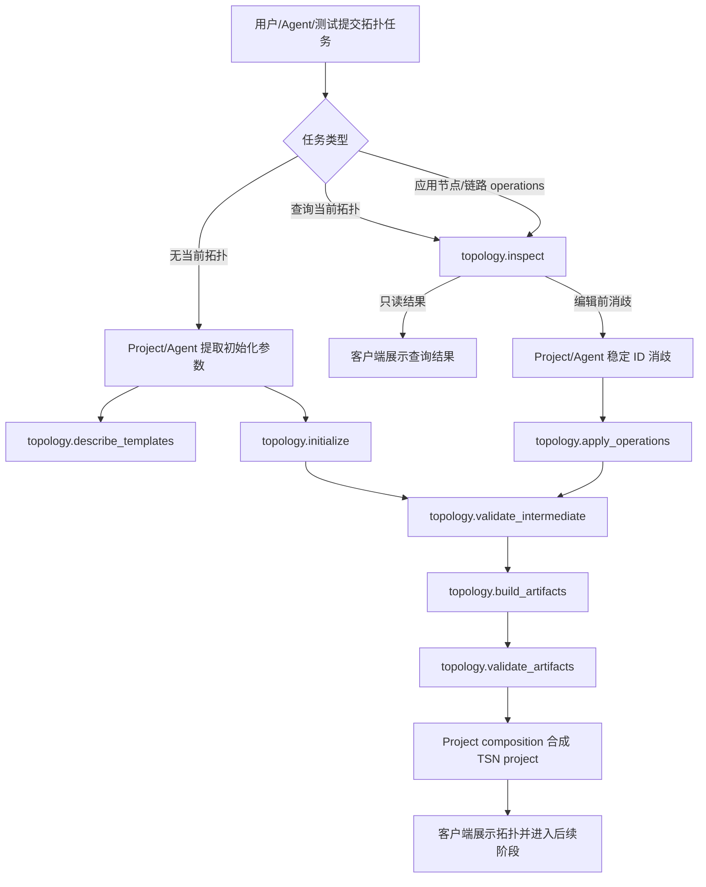

# TSN Topology MCP 服务化需求

## 摘要

把当前 `tsn-topology` skill 中可确定执行的拓扑初始化、校验、模板能力描述、只读查询和增量 operations 能力迁移为本地 MCP 服务。第一版只接受结构化输入，不调用大模型，不生成完整 TSN project，不导出 HTML；它提供可重复、可测试、可被 Agent 和客户端共同调用的拓扑领域工具。

---

## 问题框架

当前拓扑能力分散在独立参考 skill、项目内 `.claude/skills/tsn-topology`、`src-node/stage-skills/tsn-stage-runner.ts` 和 `src/domain/topology-factory.ts` 之间。参考 skill 和项目内 skill 的 builder/rules 已经出现差异：一个偏独立拓扑 artifact 构建，另一个适配 TSN Agent 的默认拓扑、坐标和阶段产物。这让后续调试很难判断“拓扑规则、Agent 语义解析、项目合成、artifact 写盘”到底是哪一层出问题。

MCP 服务化的主要价值不是让拓扑阶段更聪明，而是先把可确定执行的部分变成稳定服务边界。这样集成测试可以直接喂入结构化初始化参数、已有拓扑或 operations，得到可预测 JSON artifact、校验错误和摘要，不依赖模型输出、prompt、工具权限或临时目录写盘。

同时，`generate_project` 不应该放进 topology MCP。完整 TSN project 关心拓扑、时间同步、业务流、规划参数、仿真导出和场景默认值；拓扑 MCP 只负责拓扑领域事实，project composition 仍应留在应用/项目层。

---

## 关键决策

- **拓扑 MCP 是确定性领域服务。** 第一版只运行固定脚本/规则：initializer、validator、template catalog、topology inspect、topology operations 和摘要，不承担自然语言理解，也不调用大模型。
- **进程边界和拓扑 domain 边界分离。** P0 先定义可通过 MCP adapter/dev host 暴露的 `topology domain`；`tsn-mcp-host` 是生产/集成阶段的候选 host 形态，不是 topology contract 本身。未来 `time_sync.*`、`flow.*` 等 domain 需要单独规划，不改变拓扑契约。
- **`IntermediateTopology` 是权威拓扑事实契约。** MCP 工具之间共享同一个版本化 intermediate topology schema；它表达 nodes、links、ports、template metadata 等拓扑事实，不强制包含 project/client 层的 `topologyId` 或 `revision`；当前参考 skill 和 TSN Agent 项目内拓扑样例必须进入兼容 fixture，避免迁移后换一个名字继续出现多套拓扑事实来源。
- **不提供 `generate_project`。** 完整项目生成需要组合拓扑之外的 TSN 参数，不能把 topology MCP 变成隐式项目工厂。
- **移除 HTML 导出能力。** `topology.render_mac_table_html` 不进入 MCP 服务，后续也不再生成或导出 MAC 表 HTML。
- **初始化和增量 operations 是两条路径。** 无当前拓扑时，project/Agent/skill 层先通过 `topology.describe_templates` 查询模板目录，选择或确认 `templateId` 和初始化参数，再调用 `topology.initialize` 生成 initial intermediate topology；已有拓扑时才调用 `topology.inspect` 和 `topology.apply_operations` 应用已解析的节点/链路 operations。
- **P0 先交付可测 topology domain，不把生产打包绑进首个增量。** P0 目标是共享 topology domain package、MCP adapter/dev host、确定性 schema 和 fixture；Tauri 生产 sidecar、Node-free 全链路和多 server 拆分属于发布/集成阶段的架构决策门。
- **保留 skill 但降级为薄指引。** 迁移期 `.claude/skills/tsn-topology` 可以继续存在，用来指导 Agent 选择 MCP 工具、引用共享 `TopologyInitIntent` / selector-resolution schema、整理阶段摘要；它不再维护独立 builder、validator、template、默认值、端口分配或 edit 规则。后续当 Agent/客户端能直接稳定调用 MCP 后，可以删除该 skill 或只保留兼容入口。

---

## Core Data Contract

- `IntermediateTopology` 不是给大模型“理解语义”的中间步骤，而是 topology domain 的标准化拓扑事实模型：包含 `schemaVersion`、nodes、links、ports、template metadata 和 deterministic diagnostics。
- 即使 Agent/LLM 拥有全部 MCP 工具，也仍然需要 `IntermediateTopology`：`validate_intermediate`、`apply_operations`、`build_artifacts` 和 fixture 都需要一个稳定、可版本化、可回放的拓扑图模型；不能依赖模型上下文、legacy artifact 或完整 canonical project 作为事实来源。
- `topologyId` 若存在，应由 project/client 层管理，用来标识 project 内的拓扑实例；它不是 P0 `IntermediateTopology` 的必需字段，也不是 MCP 服务端持久化句柄。
- P0 不把服务端状态锁或额外一致性 token 作为核心更新机制。MCP 工具保持无状态：确认应用时由 project/client 层保存 dryRun 所用的 current `IntermediateTopology` snapshot 和 operations，并在用户确认后重放同一份结构化输入；若客户端侧当前拓扑已变化，应用层必须重新 dryRun。
- 新建拓扑时，`topology.initialize` 的调用方可以在 project/client 层分配 `topologyId`，但传给 MCP 的初始化参数只需要包含 `templateId` 和结构化参数；MCP 不生成随机 ID、随机坐标或当前时间戳。
- 模板发现是 MCP 能力的一部分。Agent/LLM 可以调用 `topology.describe_templates` 获取可用 `templateId`、参数 schema、默认值、约束和适用场景标签；模板推荐和最终选择仍属于 Project/Agent/skill 层，MCP 不根据自然语言自行挑模板。

---

## Actors

- A1. TSN Agent 客户端：需要在 UI/工作流中生成、校验和展示拓扑相关 artifact。
- A2. Agent 运行时：需要通过工具调用执行确定性拓扑能力，而不是用 prompt 复写拓扑规则。
- A3. Topology MCP 服务：执行结构化拓扑初始化、校验、模板能力描述、只读查询、增量 operations 和摘要。
- A4. Project composition 层：把拓扑结果与时间同步、流量规划、仿真参数和场景默认值组合成完整 project。
- A5. 测试与调试人员：需要用固定 fixture 复现拓扑初始化、operations 和校验结果。

---

## Key Flows

- F1. 无当前拓扑时初始化拓扑
  - **Trigger:** 当前 project 没有 topology，用户提出新建拓扑需求，例如交换机数量、每个交换机挂载终端数、连接方式或业务场景。
  - **Actors:** A1, A2, A3, A5
  - **Steps:** Project/Agent/skill 层先调用 `topology.describe_templates` 取得可用 `templateId`、参数约束和默认值，再从自然语言、场景默认值或用户确认中形成 `TopologyInitIntent`；调用方传入结构化初始化参数后调用 `topology.initialize`；服务返回 initial intermediate topology；调用方继续校验和构建 artifact，project/client 层可自行记录 `topologyId`。
  - **Outcome:** 从 0 创建拓扑走初始化接口，而不是把自然语言拆成一长串 add node/link operations。
  - **Covered by:** R4a, R8, R8a, R26, R27, R28, R29, R30, R47, R48

- F2. 结构化拓扑构建 artifact
  - **Trigger:** 调用方已有 intermediate topology。
  - **Actors:** A1, A2, A3
  - **Steps:** 调用 `topology.validate_intermediate`；若通过，则调用 `topology.build_artifacts`；服务返回 legacy JSON artifact 和摘要。
  - **Outcome:** 调用方得到 `topology.json`、`topo_feature.json`、`data-server.json`、`mac-forwarding-table.json` 等兼容 artifact。
  - **Covered by:** R5, R6, R7, R22, R23, R24, R25

- F3. 当前拓扑增量编辑
  - **Trigger:** 用户基于当前拓扑提出修改，例如“在交换机 1 和交换机 2 之间插入交换机 3”。
  - **Actors:** A1, A2, A3, A4
  - **Steps:** Agent 解析自然语言意图；project 层把“交换机 1/2”解析为当前 project 的稳定节点 ID，并取得当前 `IntermediateTopology`；如需读取当前节点、链路、端口占用或邻接关系，先调用 `topology.inspect`；若命中不唯一，project/Agent 层必须向用户澄清，不能把歧义 selector 传给 MCP；调用方把意图拆成确定性的 node/link operations，例如 `link.delete`、`node.add`、`link.add`、`link.add`，端口和坐标可以显式给出，也可以使用 MCP 支持的确定性 allocation/layout strategy；先用 `dryRun` 生成 changeSet 和受影响 flow 摘要；用户确认后，project/client 层使用 dryRun 时保存的同一 current topology snapshot 和同一 operations 调用 `topology.apply_operations` 应用；服务返回 updated intermediate 和 changeSet；project 层根据 changeSet 判断受影响 flow 并合成新的 canonical project。
  - **Outcome:** 现有拓扑可以被确定性修改，拓扑编辑规则不散落在 UI 或 prompt 中；该路径不负责从 0 生成拓扑。
  - **Covered by:** R2, R9, R10, R12-R21, R42-R45, R49, R50

- F4. Agent 与客户端共享同一拓扑能力
  - **Trigger:** Agent 运行时或 GUI 流程需要执行拓扑初始化、查询、operations 或校验。
  - **Actors:** A1, A2, A3, A4
  - **Steps:** Agent 通过 MCP 工具调用拓扑服务；客户端可通过同一 host 的本地调用包装层使用相同能力；项目层只消费结构化结果。
  - **Outcome:** 拓扑规则只有一个服务边界，减少 skill、stage runner 和客户端之间的重复逻辑。
  - **Covered by:** R31, R32, R33, R35, R36, R37

- F5. Tauri 打包与运行
  - **Trigger:** 用户启动打包后的桌面应用。
  - **Actors:** A1, A2, A3
  - **Steps:** P0 只要求 dev/test host 和 MCP adapter 可运行；生产阶段再由架构决策门选择由 Agent SDK 以 stdio spawn packaged server、由 Tauri 管理 loopback/private IPC host，或使用共享 topology domain package + adapter。客户端记录工具可用状态和调用摘要。
  - **Outcome:** 首个增量先证明 topology domain 可测试、可集成；生产包 Node-free 和 sidecar 生命周期作为后续发布验收。
  - **Covered by:** R31-R35, R35a-R35c

---

## Phased Scope

**P0: deterministic topology domain**
- 定义 `IntermediateTopology`、`TopologyInitIntent`、selector-resolution、operation、error envelope 和 summary/full response 契约。
- 提供共享 topology domain package、MCP adapter/dev host、`topology.describe_templates`、`topology.initialize`、`topology.inspect`、`topology.describe_artifacts`、`topology.validate_intermediate`、`topology.build_artifacts`、`topology.validate_artifacts`。
- `topology.apply_operations` P0 覆盖“在已有链路中插入一个交换机”的 tracer subset：`link.delete`、`node.add`、`link.add`、`dryRun`、原子校验、changeSet 和 programmatic dryRun/apply 双调用。
- 模板 P0 只覆盖已有规则和 fixture 能支撑的集合：`generic-line`、`generic-ring`，以及可由当前 `aerospace-redundant` 规则 fixture 化的场景模板。
- P0 测试必须无网络、无模型、无 Agent 会话，覆盖 compatibility fixture、初始化、校验、artifact 构建、插入交换机 dryRun/apply 和至少一个 `LIMIT_EXCEEDED`。

**P1: broadened topology capability**
- 扩展 node/link 全量 CRUD：`node.update`、`node.delete`、`link.update` 及对应 flow impact、恢复语义和失败 fixture。
- 扩展常用模板：`industrial-line`、`industrial-ring`、`automotive-zonal`、`aerospace-dual-plane`、`industrial-star-cell`、`rail-ladder-ring`、`substation-station-process-bus`、`proav-tree`。
- 完成客户端 runtime 状态矩阵、dryRun/confirm UI 状态机、生产打包和 Node-free 全链路方案。

**Architecture decision gates before production packaging**
- 如果选择 stdio MCP，通常由 Agent SDK/MCP client spawn packaged `tsn-mcp-host`；客户端通过 Tauri command 或共享 domain package 调用同一契约，不能假设 React/Tauri 和 Agent SDK 同时共享一个 stdio 进程。
- 如果要求 Agent 和客户端共享同一个长生命周期 host，则由 Tauri 管理 sidecar，并通过私有 IPC 或 loopback transport 暴露，必须有 capability token、来源校验、固定随包路径和完整性校验。
- 如果 sidecar 成本高于收益，允许采用共享 topology domain package + MCP adapter：MCP 是 Agent-facing adapter，客户端直接调用同一 domain package 的本地包装层。

## Requirements

**服务范围**
- R1. P0 `topology domain` 必须能通过 MCP adapter/dev host 暴露 `topology.*` 工具；生产阶段可以由 `tsn-mcp-host` 作为本地 sidecar 承载多个 domain 模块，但 host 形态不属于 topology contract 本身。第一版不暴露 project、workflow、export、time sync 或 flow 能力。
- R2. 第一版不得接受自然语言作为构建输入；调用方必须传入 intermediate topology、结构化初始化参数或结构化 topology operation。
- R3. 第一版不得调用大模型、Agent SDK 或外部语义解析服务。
- R4. Topology MCP 不得提供 `generate_project`、阶段推进、会话保存、用户确认、仿真导出或完整 TSN project 生成能力。
- R4a. 必须定义版本化 `IntermediateTopology` schema 作为 topology domain 的权威输入/输出模型；所有 topology MCP 工具必须声明兼容的 schema version，并拒绝不支持的版本；schema 不强制包含 `topologyId` 或 `revision`。
- R4b. 当前参考 `tsn-topology` skill、项目内 `.claude/skills/tsn-topology` 和 TSN Agent 现有 canonical topology 样例必须进入 `IntermediateTopology` 兼容 fixture，用于证明迁移后没有第二套 builder/validator 事实来源。

**工具清单**
- R5. 必须提供 `topology.validate_intermediate`，用于校验 intermediate topology 的节点、链路、端口、server 引用和基本结构。
- R6. 必须提供 `topology.build_artifacts`，用于把 intermediate topology 构建为兼容 JSON artifact。
- R7. 必须提供 `topology.validate_artifacts`，用于校验 `topology.json`、`topo_feature.json`、`data-server.json` 和 `mac-forwarding-table.json` 的 schema、引用和一致性。
- R8. 必须提供 `topology.initialize`，用于根据结构化初始化参数生成 deterministic initial intermediate topology；初始化参数至少包括 `templateId`、交换机/节点数量、终端挂载规则、链路速率和冗余策略；显式 `connectionMode` 可以由调用方传入，也可以由模板/场景默认值决定；`topologyId` 如需存在，由 project/client 层记录，不是 MCP 初始化必填项。
- R8a. 必须提供 `topology.describe_templates`，用于返回支持的模板 ID、参数 schema、默认值、约束、适用场景标签和示例；Agent/LLM 可以调用它发现可用模板，但它只描述能力，不根据自然语言推荐模板。
- R9. 必须提供 `topology.apply_operations`，用于对当前 intermediate topology 应用结构化、确定性的节点/链路 operations；P0 首先覆盖插入交换机 tracer subset，P1 再扩展全量 node/link CRUD。
- R10. 必须提供只读查询能力：`topology.inspect` 用于查询当前 intermediate topology 的节点、链路、端口占用、邻接关系和引用摘要；`topology.describe_artifacts` 用于返回 artifact 计数和诊断摘要。查询必须基于调用方传入的 current intermediate topology、稳定 ID 或明确过滤条件，遇到非唯一 selector 必须返回包含候选项的结构化歧义错误。
- R11. 不得提供 `topology.render_mac_table_html`；Topology MCP 不得生成、返回或写入任何 MAC 表 HTML 导出物。

**增量编辑契约**
- R12. `topology.apply_operations` 的输入必须包含当前 intermediate topology、按顺序排列的结构化 operations 和可选 `dryRun`；不得直接接收完整 prompt、完整 canonical project、`topologyId`、`revision` 或服务端状态句柄作为编辑依据。
- R12a. 当 `dryRun: true` 时，`topology.apply_operations` 必须执行完整校验并计算预览用 updated intermediate、changeSet、warnings 和 diagnostics，但结果必须标记为 dry run，调用方不得把它当作已应用状态；当 `dryRun: false` 或省略时，必须基于调用方传入的 current topology 和 operations 返回可供调用方采用的 updated intermediate 与 changeSet。确认防错由 project/client 层保存 dryRun snapshot 与 operations，并在确认时重放同一份结构化输入；若确认前项目当前 topology 已变化，应用层必须重新 dryRun，而不是依赖 MCP 服务端状态。
- R13. P0 `topology.apply_operations` 必须支持插入交换机 tracer subset：`link.delete`、`node.add`、`link.add`、`dryRun`、原子校验和 changeSet；P1 再支持六类基础变更操作：`node.add`、`node.update`、`node.delete`、`link.add`、`link.update`、`link.delete`；节点/链路的“查”不属于 operation，由 `topology.inspect` 承担。
- R14. `topology.apply_operations` 必须把整批 operations 作为一个原子事务处理：先完整校验，再应用；任一 operation 失败时不得返回半应用后的拓扑。
- R15. 新增节点和新增链路必须由调用方提供稳定 ID，或提供确定性 ID allocation rule；MCP 不得生成随机 ID、随机坐标、当前时间戳或任何导致相同输入产生不同输出的字段。
- R16. `topology.apply_operations` 必须定义稳定输出顺序：未变更节点/链路保持原顺序，新增节点/链路按 operation 顺序追加，删除项从结果中移除，更新项在原位置更新。
- R17. `topology.apply_operations` 必须校验操作齐全性和关键项：新增节点必须包含 ID、类型、端口或端口数量，并包含位置或确定性 layout strategy；新增链路必须包含 ID、两端节点、介质和速率，并包含两端端口或确定性 port allocation strategy；更新和删除必须指向稳定 ID。
- R18. `topology.apply_operations` 必须校验歧义和引用完整性：不得靠显示名猜测节点/链路；若调用方传入非稳定 selector 或 selector 命中不唯一，必须返回 `AMBIGUOUS_SELECTOR` 结构化错误。Agent-facing 默认 summary 模式只返回候选数量、类型和本地 UI 可继续消歧的摘要；完整候选项，包括 stable ID、显示名、类型、位置或邻接摘要，只能在 client-local UI 或授权 full 模式展示。
- R19. `topology.apply_operations` 必须校验端口冲突、重复 ID、缺失节点、缺失链路、删除冲突和安全上限；节点删除默认不级联删除链路，除非同一批 operations 显式删除相关链路。
- R20. `topology.apply_operations` 在 local/domain full 模式必须返回 updated intermediate topology、changeSet、validation summary、warnings 和 diagnostics；changeSet 至少包含 added/removed/updated nodes、links、released/allocated ports。Agent-facing MCP 只有在显式请求 `responseMode: "full"` 且 `topologyFullAllowed: true` 时才返回 updated intermediate topology；默认 summary 模式只能返回结构化摘要、计数、warning/error summary 和必要的本地引用信息，不返回完整端口表、artifact、MAC 表或 full changeSet。
- R21. `topology.apply_operations` 不得直接修改 flows；它必须返回足够的 removed/added/updated link 信息，让 project 层判断哪些 flow route 需要重新规划。
- R21a. MCP 工具响应中的 `diagnostics` 只能包含确定性摘要；耗时、进程 ID、绝对路径等易变 telemetry 只能进入诊断日志，不得进入需要快照断言的响应对象。

**Artifact 与写盘边界**
- R22. `topology.build_artifacts` 的核心输出必须是结构化 JSON 数据；是否写入文件系统由调用方或独立包装层决定。
- R23. 兼容 artifact 第一版限定为 `topology.json`、`topo_feature.json`、`data-server.json` 和 `mac-forwarding-table.json`。
- R24. `data-server.json` 和 `mac-forwarding-table.json` 第一版视为兼容/诊断 artifact，不作为完整 project 的唯一事实来源。
- R25. MCP 工具不得直接接管 `target_dir`、覆盖文件、备份、回滚或危险目录防护；这些属于应用导出和项目写盘边界。

**常用拓扑模板**
- R26. P0 模板必须覆盖已有规则和 fixture 可支撑的模板集合：`generic-line`、`generic-ring`，以及可从当前 `aerospace-redundant` 规则稳定迁移出的场景模板。
- R27. P1 模板候选包括 `industrial-line`、`industrial-ring`、`automotive-zonal`、`aerospace-dual-plane`、`industrial-star-cell`、`rail-ladder-ring`、`substation-station-process-bus` 和 `proav-tree`；进入 P1 前每个模板必须先有参数 schema、布局/端口规则来源和 golden fixture。
- R28. 每个模板必须有明确、结构化、可测试的初始化参数，例如交换机数量、每交换机终端数量、链路速率、是否双归属、是否冗余平面。
- R29. 每个模板必须通过 `topology.initialize` 输出 initial intermediate topology，而不是直接输出 canonical project、完整导出 bundle 或一组 add node/link operations。
- R30. P0 模板必须有固定 fixture 测试，覆盖正常初始化输出、至少一个参数边界和非法参数错误；P1 新增模板进入范围时必须补齐对应 fixture。

**Tauri 打包与多 MCP server 策略**
- R31. P0 必须提供开发/测试可运行的 MCP adapter 或 dev host；生产 Tauri sidecar 和 Node-free 全链路属于发布阶段验收，进入实现计划前必须通过架构决策门确认。
- R32. 开发环境可以直接运行 JS/TS MCP bundle 以提升迭代速度；生产包若选择 sidecar，应使用随应用分发的可执行文件或明确打包后的运行时，不得依赖用户手动安装系统 Node。
- R33. MVP 倾向先实现一个 `topology domain`，并保留被 `tsn-mcp-host` 注册的能力；`time_sync.*`、`flow.*` 等未来 domain 只能作为后续扩展，不属于第一版 topology domain 验收。
- R34. 当某个 domain 需要独立生命周期、不同语言运行时、隔离崩溃风险或重依赖时，才应拆成多个 MCP server 进程。
- R35. Agent runtime 必须通过 MCP server 配置加载本地拓扑工具；MCP server name 和工具名映射必须固定，例如 `tsn_topology` 暴露 `mcp__tsn_topology__topology_initialize` 等工具；`allowedTools` / MCP 配置必须同步更新；客户端直接调用时也必须经过同一服务契约或薄包装层，不能复制 builder 逻辑。
- R35a. 生产侧不得假设一个 stdio MCP 进程可同时被 Tauri 和 Agent SDK 共享；若选择 stdio，应由 Agent SDK/MCP client spawn packaged server，客户端通过 Tauri command 或共享 domain package 调用同一契约；若选择共享长生命周期 host，应由 Tauri 管理 sidecar，并通过私有 IPC 或 loopback transport 暴露，要求每次会话随机 capability token、来源校验和拒绝外部网络访问。
- R35b. 生产 sidecar 必须从 Tauri 管理的固定随包路径启动，不得从 `PATH`、全局 Node 或用户可写位置解析；发布包应依赖应用签名或显式 hash/signature 校验，校验失败时 fail closed。
- R35c. P0 必须提供 dev/test 可断言的 MCP runtime 可用性摘要，至少能区分 `available`、`unavailable` 和 `call_failed`；P1/production integration 再定义完整客户端状态矩阵，包括 `initializing`、`retrying`、拓扑阶段入口、错误提示、重试和诊断摘要行为。

**集成与测试**
- R36. `.claude/skills/tsn-topology` 迁移期可以继续存在，但职责应退化为 Agent 指令/兼容 shim：说明何时调用 MCP、如何引用共享 `TopologyInitIntent` / selector-resolution schema、如何调用/桥接 MCP、如何把 MCP 结果整理为阶段摘要；不得继续维护独立 builder、validator、template、默认值、端口分配或 edit 规则。
- R37. `src-node/stage-skills/tsn-stage-runner.ts` 可以保留阶段结果转换职责，但不应继续成为拓扑规则事实来源。
- R38. 所有 MCP 工具必须返回结构化成功结果或结构化错误列表，不能把 stdout、exit code 或临时文件内容作为公开 API 契约；错误 envelope 至少包含 `code`、`message`、`path`、`severity`、`details`、`retryable` 和 `requiresUserClarification`。
- R39. 集成测试必须能在无网络、无模型、无 Agent 会话的环境下运行，并对每个服务工具生成确定性用例。
- R40. `topology.inspect` 和 `topology.apply_operations` 必须有相同输入重复运行结果完全一致的快照测试；`inspect` 覆盖节点/链路查询和歧义查询失败用例，P0 `apply_operations` 覆盖插入交换机 tracer subset 的成功和失败用例，P1 再覆盖完整节点/链路增删改。
- R41. 诊断日志采用 allowlist：只记录工具名、schema version、状态、耗时 bucket、输入/输出计数、错误码、limit 类型和 run id；默认不得记录完整用户 prompt、凭证、MAC 地址、端口映射、稳定节点/链路 ID、完整 selector、完整 changeSet 或大段 artifact 原文。
- R42. `src/domain/topology-factory.ts` 迁移后不得继续承担拓扑 builder、validator、template 或 edit 规则；它只能保留自然语言意图解析、场景默认值读取、canonical project composition 映射，或通过 MCP 契约调用 topology domain。
- R43. Project/Agent 层必须定义自然语言拓扑编辑的上游 selector-resolution 契约：自然语言引用必须映射为稳定节点/链路 ID，歧义引用必须走用户澄清路径，`topology.apply_operations` 只能接收已解析的 operations。
- R44. 当前拓扑编辑工作流必须包含预览/确认路径：调用方先通过 `dryRun` 或等价预览展示 changeSet、端口变化和受影响 flow 摘要，用户确认后才应用。确认不依赖 MCP 服务端保存状态；project/client 层必须保存 dryRun 使用的 current `IntermediateTopology` snapshot、operations 和预览结果，确认时重放同一份结构化输入。用户取消、校验失败、项目当前拓扑已变化和歧义失败必须有可恢复状态；若当前拓扑已变化，必须重新 dryRun。
- R45. intermediate topology、artifact JSON、changeSet 和 MAC 表默认视为敏感工程数据；Agent-facing 工具响应默认必须是 `summary` 模式，只返回摘要、计数、warning/error summary 和必要字段；`initialize` / `apply_operations` 可在显式 `responseMode: "full"` 且 `topologyFullAllowed: true` 时返回 `IntermediateTopology` 以支撑无服务端状态的工具组合；完整 artifact、MAC 表、端口占用和 full changeSet 只能保留在本地 project/client 层，或在用户显式允许的非 Agent-facing full 模式下返回。MCP 服务端不得维护长期 artifact handle；如需本地引用或缓存句柄，应由 project/client 层生成、保存和清理。
- R45a. full artifact 与 full changeSet 的存储边界属于 project/client 层：默认只进入当前 project/session storage 或用户显式导出路径；dryRun 结果默认不持久化到长期项目文件；关闭会话、取消确认或删除项目时必须清理本地缓存；诊断日志和 Agent 上下文不得保存完整 artifact、端口映射、MAC 表或完整 changeSet。
- R46. 所有 MCP 工具必须有服务级资源上限，覆盖最大节点数、链路数、端口数、operation 数、模板参数规模、artifact 字节数、JSON 深度和执行超时；P1 生产 host 还必须限制并发工具调用数、等待队列长度、重试退避和取消语义；超限必须返回结构化 `LIMIT_EXCEEDED` 或 `BUSY` 错误并纳入 fixture 测试。
- R47. Project/Agent 层必须定义拓扑初始化的上游 intent 契约：当当前 project 没有 topology 时，必须先查询 `topology.describe_templates`，再提取或确认 `templateId`、交换机/节点数量、终端挂载规则、链路速率和冗余策略；`connectionMode` 可由模板或场景默认值提供，只有缺失且无默认值时才向用户确认；不能调用 `topology.apply_operations` 拼接初始拓扑。
- R48. 模板推荐属于 Project/Agent/skill 层职责；Topology MCP 可以通过 `topology.describe_templates` 暴露模板目录、参数约束和适用场景标签，但不得根据自然语言或业务语义自行选择模板。
- R49. Project composition bridge 必须定义在 topology MCP 之外：输入为 `IntermediateTopology` / topology tool result、`scenarioConfigId`、project metadata 和 simulation defaults，输出 `CanonicalTsnProjectV0` 或当前 topology stage payload；该 bridge 负责 ID 映射、场景默认值、flows 空置/保留规则和 simulationHints 归属。
- R50. 应用层必须提供现有拓扑进入 MCP 的转换路径：`canonicalTopologyToIntermediate`、`intermediateToCanonicalTopology`，必要时提供 `legacyArtifactsToIntermediate`；这些 converter 必须纳入 R4b/AE12 fixture，避免把完整 canonical project 直接传给 `topology.apply_operations`。

---

## Acceptance Examples

- AE1. **Covers R2, R3, R5, R6, R22, R23, R24, R25, R38.** Given 调用方传入合法 intermediate topology，when 调用 `topology.validate_intermediate` 和 `topology.build_artifacts`，then 服务返回稳定 JSON artifact 和结构化摘要，且不触发任何模型调用、不直接写用户目录、不接管覆盖/回滚策略。
- AE2. **Covers R5, R7, R38.** Given intermediate topology 存在端口冲突或链路引用缺失，when 调用 `topology.validate_intermediate`，then 服务返回带错误码、路径和详情的结构化错误列表；given artifact JSON 引用不一致，when 调用 `topology.validate_artifacts`，then 服务返回可定位到 artifact 和字段路径的结构化错误，而不是只返回失败字符串。
- AE3. **Covers R4a, R8, R8a, R26, R28, R29, R30, R47, R48.** Given 当前 project 没有 topology，用户说“帮我建一个 4 个交换机、每个交换机 2 个终端的环形 TSN 网络”，when Project/Agent 层先调用 `topology.describe_templates` 发现 `generic-ring` 的参数 schema，再形成 `{templateId: "generic-ring", switches: 4, endpointsPerSwitch: 2}` 并调用 `topology.initialize`，then 每次得到相同 initial intermediate topology、节点、链路和环形连接关系；MCP 不接收自然语言，也不自行推荐模板。
- AE3a. **Covers R8a, R27, R47, R48.** Given Agent/LLM 不知道当前支持哪些拓扑模板，when 调用 `topology.describe_templates`，then 服务返回可用 `templateId`、参数默认值、约束、适用场景标签和示例；Agent/Project 层据此选择模板或向用户确认，MCP 不根据自然语言做推荐；P1 模板进入目录前必须具备参数 schema、规则来源和 golden fixture。
- AE4. **Covers R9, R10, R12, R12a, R13, R14, R15, R16, R17, R18, R19, R20, R21, R40, R43, R44, R49, R50.** Given 当前拓扑存在 `sw1` 和 `sw2` 之间的直连链路，且应用层已把 canonical project 转换为 `IntermediateTopology`，when 调用方先用 `topology.inspect` 查询旧链路和端口占用，再用 `dryRun: true` 提交 operations `[link.delete, node.add, link.add, link.add]`，then Topology MCP 返回新增 `sw3`、删除旧链路、新增两条链路、端口释放/占用和 dry-run changeSet；when 用户确认后 project/client 层重放 dryRun 时保存的同一 current topology snapshot 和同一批 operations，then 返回 updated topology 与 changeSet；project composition bridge 再合成 canonical project；相同输入重复运行得到完全相同输出。
- AE5. **Covers R14, R17, R18, R19.** Given 调用方提交 `link.add` 但缺少目标端口，或引用不存在的节点，when 调用 `topology.apply_operations`，then 服务返回结构化错误且不返回半应用后的 updated topology。
- AE6. **Covers R15, R16, R21a, R40.** Given 两次调用传入同一 current topology 和同一 operations，when 调用 `topology.apply_operations`，then updated topology、changeSet、warnings 和响应内 diagnostics 中的可断言摘要保持一致；耗时、进程 ID 和绝对路径只允许出现在诊断日志，不进入响应快照。
- AE7. **Covers R1, R11.** Given 调用方枚举 MCP 工具，when Topology MCP 启动，then 第一版工具列表只包含 `topology.*` 工具，不存在 project、workflow、export、time sync、flow 或 `topology.render_mac_table_html` 工具，任何构建结果也不包含 `.html` artifact。
- AE8. **Covers R31, R32, R33, R34, R35, R35a, R35b, R35c.** Given P0 dev/test host 启动，when Agent runtime 或测试调用 MCP 工具列表和一次 ping/fixture 调用，then 能得到可断言的 `available`、`unavailable` 或 `call_failed` 摘要；given 进入生产打包阶段，when 架构决策门选择 stdio、Tauri-managed host 或 shared package + adapter 之一，then Agent runtime 和客户端调用路径必须有明确进程所有权；只有出现独立生命周期、不同运行时或隔离需求时才拆成多个 MCP server；若产品承诺 Node-free，验收必须同时覆盖 topology MCP 和现有 Agent worker 链路；客户端能展示 MCP runtime 的可用、不可用、调用失败和重试状态。
- AE9. **Covers R4, R35, R36, R37, R49.** Given Agent 完成拓扑工具调用，when 应用进入 project composition，then project 层通过 bridge 合成 canonical TSN project，Topology MCP 只提供 topology result、artifact summary、updated intermediate 和 changeSet；拓扑阶段不会提前把 flow-template 或 planning-export 标记完成。
- AE10. **Covers R39, R41.** Given 测试环境没有网络和模型凭证，when 运行 MCP 工具测试，then P0 initializer、validator、template catalog、inspect、artifact 和插入交换机 operations fixture 仍能稳定通过，诊断输出只包含 allowlisted 脱敏摘要。
- AE11. **Covers R10, R18, R38.** Given 调用方按稳定 ID 查询某个节点或链路，when 调用 `topology.inspect`，then 服务返回该对象详情、端口占用和邻接摘要；given 调用方使用命中不唯一的 selector，then 服务返回结构化歧义错误。
- AE12. **Covers R4a, R4b, R42, R50.** Given 参考 `tsn-topology` skill fixture、TSN Agent 现有 canonical topology fixture 和 legacy artifact fixture，when 转换为版本化 `IntermediateTopology` 并调用 MCP 工具，再转换回 canonical topology，then 样例通过 round-trip 兼容测试，且 `src/domain/topology-factory.ts` 不再包含独立 builder/validator/template/edit 规则。
- AE13. **Covers R43, R44.** Given 用户说“把交换机 3 放到交换机 1 和 2 之间”且当前拓扑存在多个显示名相似的交换机，when project/Agent 层无法唯一映射稳定 ID，then 客户端展示包含 stable ID、显示名、类型、位置或邻接摘要的候选项，不调用 `topology.apply_operations`；given 能唯一映射，then 只把稳定 ID operations 传给 MCP。
- AE14. **Covers R18, R45, R45a.** Given Agent-facing 路径需要把工具结果传给模型上下文，when topology MCP 返回 artifact、changeSet 或歧义错误，then 默认 response mode 只返回 summary、计数、warning/error summary、候选数量和必要字段；`initialize` / `apply_operations` 可在显式授权时返回 `IntermediateTopology` 用作后续结构化输入；MAC 表、端口占用、歧义候选详情和 full changeSet 保留在本地 project/client 层，除非用户显式允许非 Agent-facing full 模式；敏感 full 数据不得进入诊断日志。
- AE15. **Covers R46.** Given 调用方提交超过节点数、链路数、operation 数、JSON 深度或执行时间上限的输入，when 调用任一 MCP 工具，then 服务返回结构化 `LIMIT_EXCEEDED` 错误，且不写文件、不返回半构建 artifact；given 生产 host 并发或队列超限，then 返回结构化 `BUSY` 并保留可恢复状态。
- AE16. **Covers R47.** Given 当前 project 没有 topology 且用户只说“帮我建一个 TSN 网络”，when Project/Agent 层能从 `ScenarioConfig` 和 `topology.describe_templates` 得到明确默认模板和参数，then 生成可确认的默认拓扑草案并列出默认值；when 无法确定会改变拓扑类别的关键参数且没有默认值，then 客户端请求补充信息；不得把空拓扑加一串 `node.add`/`link.add` operations 传给 `topology.apply_operations` 作为初始化替代。
- AE17. **Covers R49.** Given `topology.initialize` 或 `topology.apply_operations` 返回 updated intermediate，when project composition bridge 执行，then 输出合法 `CanonicalTsnProjectV0`、React Flow topology 和 `planner/flow_plan_1.json` 输入，并且 staged workflow 只推进 topology 阶段，不伪造 flow planning 或 planning-export 结果。

---

## Success Criteria

- 拓扑初始化、operations 和校验可以独立于 Agent prompt、模型输出和 UI 会话运行。
- 现有拓扑 initializer、validator、template catalog 和 operations 规则被收拢到一个版本化 `IntermediateTopology` 服务契约，后续调试能明确定位是语义解析、拓扑规则、project composition 还是导出层问题。
- P0 能在无网络、无模型、无 Agent 会话下运行 topology domain fixture，并通过 MCP adapter/dev host 被 Agent runtime 集成测试发现。
- P0 能完成从 0 初始化拓扑和已有拓扑插入交换机两个 domain 级端到端 fixture，并提供 project composition bridge 的最小 round-trip 契约测试；完整 staged workflow 集成进入 P1/integration。
- 生产打包前完成 sidecar/stdio/shared package 架构决策门，若承诺 Node-free，验收必须覆盖现有 Agent worker 链路。
- 每个 P0 MCP 工具有确定性 fixture；P1 新增模板或 CRUD operation 时必须补对应 fixture，失败时返回可断言的结构化错误。
- HTML MAC 表导出彻底从 topology MCP 范围移除。

---

## Scope Boundaries

- 不在 topology MCP 中做自然语言理解、prompt 编排、模型调用或用户意图消歧。
- 不在 topology MCP 中实现 `generate_project`、完整 canonical project 生成或四阶段 workflow 推进。
- 不在 topology MCP 中处理时间同步、流量规划、调度器参数、仿真导出或 INET 文件生成。
- 不在 topology MCP 中做文件覆盖、备份、回滚、危险目录防护或导出目录选择。
- 不要求 P0 支持所有 node/link CRUD，也不要求 P0 一次性完成全部行业模板；新增 operation 或模板必须按 P1 能力进入独立验收。
- 不把 `topologyId` 放进 P0 topology MCP 核心契约，也不把它解释为 MCP 服务端持久化句柄；P0 MCP 工具无状态，调用方仍必须传入 current `IntermediateTopology`。
- 不再支持 MAC 表 HTML 导出；后续若需要可视化 MAC 表，应作为客户端 UI 视图或独立调试视图处理，而不是 HTML artifact。
- 不要求一次性删除所有旧 skill 文件；迁移可以分阶段进行，但旧 topology skill 不再作为拓扑规则事实来源，最终规则应收敛到 MCP 服务。
- 不要求 `tsn-mcp-host` 在第一版承载 `time_sync.*`、`flow.*` 或 `simulation.*`；这些 domain 必须在后续需求中单独定义。

---

## Dependencies / Assumptions

- MCP TypeScript SDK 支持通过 stdio transport 暴露本地工具；这适合 Agent runtime spawn MCP server，但不等于同一个 stdio 进程能同时被 Tauri 和 Agent SDK 共享。
- 当前 Agent SDK 类型支持配置 `mcpServers`，可把本地 sidecar 作为 Agent 可用工具来源。
- Tauri v2 支持随应用分发 sidecar/external binary；生产包若选择 sidecar，应使用这个机制或等价随包可执行方案提供 `tsn-mcp-host`。
- 当前项目已通过 `src-tauri/src/commands.rs` 启动 Node worker，并在 `src-tauri/tauri.conf.json` 中打包 worker/skill 资源；如果发布目标继续承诺生产环境不依赖系统 Node，后续计划必须替换、封装或合并这条 Agent worker 链路，而不只是新增 MCP sidecar。
- `CanonicalTsnProjectV0` 仍是项目层模型，不是 topology MCP 的输出模型。

---

## Outstanding Questions

### Resolve Before Planning

- [Affects R31-R35][Architecture gate] P0 计划前需要比较 standalone MCP sidecar、共享 topology domain package + MCP adapter、整合现有脚本三种方案，确认首个实现采用哪条开发/测试路径。
- [Affects R31-R35][Packaging] 生产包如果承诺 Node-free，需要单独定稿现有 `src-node/claude-agent-worker.mjs` 的处理方式：打成自包含可执行、由 host 承载、改为 Rust/Tauri command，还是明确保留系统 Node 依赖并修改生产验收。
- [Affects R35][Integration] 客户端直接调用 topology domain 时，是通过 Rust command、Node worker、Tauri-managed host、共享 package wrapper，还是 MCP client，需要在计划阶段选择一条 P0 主路径。
- [Affects R35, R45][Agent contract] Agent-facing MCP 工具默认 `summary` 模式和本地 `full` 模式的权限边界、本地缓存生命周期和用户显式授权交互需要定稿。

### Deferred to Planning

- [Affects R4a-R10, R47-R48][Schema] 每个 MCP 工具的输入/输出 schema、错误码和 fixture 命名需要在实现计划中细化，但 `IntermediateTopology` 和 `TopologyInitIntent` 必须作为版本化权威契约进入计划入口，而不能继续作为可选细节。
- [Affects R9, R12-R21, R43-R44][Topology editing] P0 插入交换机 tracer subset 的 operation 输入字段、错误码、端口分配策略、layout strategy、`dryRun` 响应、原子失败语义和用户确认/恢复路径需要在计划中细化；全量 CRUD 进入 P1。
- [Affects R8-R8a, R26-R30, R47-R48][Templates] P0 模板的默认参数、坐标布局、端口分配策略、适用场景标签和 project/Agent 层推荐规则需要结合现有 builder/rules 细化；行业模板进入 P1 前再补领域规则来源。
- [Affects R36-R37][Migration] `.claude/skills/tsn-topology` 与 `src-node/stage-skills/tsn-stage-runner.ts` 的兼容迁移顺序需要在计划中拆分，避免一次性破坏现有 staged workflow。
- [Affects R35a-R35c, R45-R46][Security] 生产 sidecar 的 IPC/transport、capability token、完整性校验、敏感 artifact 最小化外发、工具资源上限、并发/队列上限和超时阈值需要在计划中具体化。
- [Affects R42][Migration] `src/domain/topology-factory.ts` 迁移后的职责需要拆清：哪些代码删除，哪些改为调用 MCP，哪些保留为 project composition 或自然语言 intent parsing。
- [Affects R49-R50][Project bridge] `IntermediateTopology` 与 `CanonicalTsnProjectV0`、React Flow topology、planner input 的 adapter 和 round-trip fixture 需要在计划中具体化。

---

## 来源 / 调研

- `tsn-topology/SKILL.md`
- `tsn-topology/docs/rules.md`
- `tsn-topology/tools/topology-builder.js`
- `tsn-topology/tools/validate-topology.js`
- `tsn-topology/tools/validate-mac-forwarding-table.js`
- `tsn-topology/tests/run-e2e.js`
- `.claude/skills/tsn-topology/SKILL.md`
- `.claude/skills/tsn-topology/docs/rules.md`
- `.claude/skills/tsn-topology/tools/run-topology-skill.js`
- `src/domain/topology-factory.ts`
- `src-node/stage-skills/tsn-stage-runner.ts`
- `src-node/claude-agent-worker.mjs`
- `src-tauri/src/commands.rs`
- `src-tauri/tauri.conf.json`
- `docs/staged-agent-workflow.md`
- MCP TypeScript SDK documentation via Context7
- Claude Agent SDK local types in `node_modules/@anthropic-ai/claude-agent-sdk/sdk.d.ts`
- Tauri v2 sidecar documentation via Context7
- tmux `tsn-agent` session topology-template analysis
