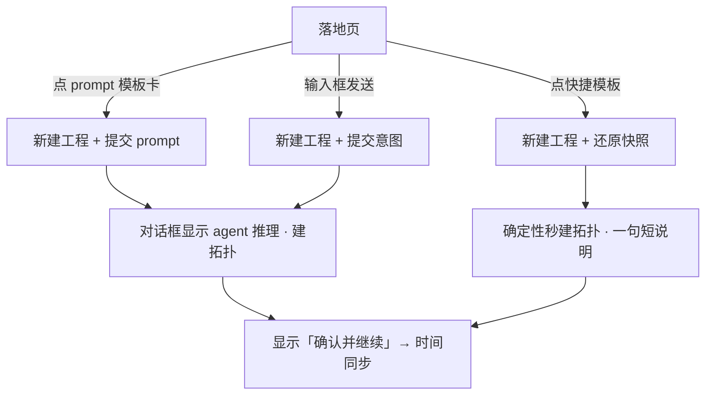

# 启动引导页 + 工程模板体系

## Summary

新增「新建工程 / 首启」落地页：一个自然语言输入框 + 一个按场景分组的工程模板画廊。模板分两类——面向新人的 **prompt 模板**（点击即让 agent 现场跑出拓扑、可见推理）和面向熟手的 **快捷模板**（从 session 拓扑导出、确定性秒建）。模板落进一张新 DB 表管理，可排序 / 硬删；出厂 prompt 模板建库时播种一次。

## Problem Frame

今天打开 app 或点「新建工程」，用户被直接丢进对话 stepper + 空画布（`src/app/App.tsx` 固定三栏壳，无空态、无引导）。首次用户面对一个空输入框和一张空画布，不知道该输入什么、当前在哪个阶段。空输入框本身就是"半成品"——新人大概率不会主动敲一段需求描述，于是卡在第一步。缺的是一个"一点就活"的入口：让用户从现成模板起步，立刻看到系统在动。

## Key Decisions

**两类模板、刻意隔离。** prompt 模板服务新人（agent 现场跑、看推理过程），快捷/导出模板服务熟手（确定性秒建、直接确认）。两者在数据与展示上分开，不混排、不互转。

**prompt 模板只存一段 prompt。** 不存拓扑几何；「使用」= 把该 prompt 当用户意图提交，复用现有"输入意图 → agent 建拓扑"主链路（`submitIntent`）。这是最轻的承载，也天然带来"看大模型推理"的体验。

**快捷模板存拓扑快照。** 从 session 拓扑画布「设为模板」导出当前拓扑的**完整行（节点/连线全字段）与来源 `scenario`**（不止 x/y 几何——否则下游时间同步/软仿缺节点类型、MAC、连线、场景上下文会失配）；「使用」= 确定性重建拓扑（不跑 LLM），对话框只显一句短说明，随即出「确认并继续」按钮。

**出厂只播种一次 + 硬删 + 本期不做恢复出厂。** 出厂 prompt 模板在建库/首次时播种一次——用**版本化迁移或 `app_state` sentinel 记录已播种**，不用"缺失即补播"式播种（否则硬删的模板会被下次启动复活，违反 AE4）。此后这张表全归用户：排序、硬删都直接生效。放弃三态播种 / 软删墓碑 / 恢复出厂——本期不做拓扑推荐。

**落点 resume-first。** 有工程则开 app 直接恢复上次工程；仅当无任何工程、或用户点「新建工程」时才进落地页。

**分类由场景派生。** 只有两类——航空航天对应 `aerospace-onboard`，普通对应 `generic-tsn`；分类是场景的派生视图，不单独存可编辑分类、不新增场景。

**评审反驳与取舍（保留原决策）。** doc-review 多位 persona 反驳：新人走"看 LLM 现跑"是最慢/最不确定的路径、可能建出与卡名不符的拓扑而新人无力判断（建议新人也走确定性）；prompt 模板与 R5 可点范例机制同构、疑似重复；快捷模板/设为模板服务熟手、是超出 onboarding 目标的第二 feature。**决策保留**："看大模型推理"正是本期要给新人的"一点就活"第一感觉，为此接受一次 LLM 现跑的代价；prompt 模板与快捷模板分别服务新人 / 熟手两类真实用户，本期一起做。反驳带出的真实缺口以 R22–R25 缓解（硬删加确认、两类卡视觉区分、卡名不做结果承诺、单击即建）。

## Actors

- A1. 新人用户 — 首次/少用，倾向点模板而非自己描述需求。
- A2. 熟手用户 — 反复用 app，需要把常用拓扑一键复用。
- A3. Agent（大模型）— 消费 prompt 模板的 prompt，现场推理建拓扑。

## Key Flows

F1. 进入落地页
- **Trigger:** 无任何工程时开 app，或任意时刻点「新建工程」。
- **Steps:** 渲染落地页（输入框 + 模板画廊 + disabled 知识库占位）取代空 stepper / 空画布。
- **Outcome:** 有工程时开 app 不进落地页，直接恢复上次工程。

F2. 使用 prompt 模板（新人路径）
- **Trigger:** 点一张 prompt 模板卡。
- **Steps:** 新建工程 → 把该卡的 prompt 作为用户意图提交给 agent → 对话框展示大模型推理过程、建出拓扑 → 拓扑建成后显示「确认并继续（跳转时间同步）」按钮。
- **Outcome:** 用户看着系统"活"起来，确认后进入时间同步。

F3. 使用快捷模板（熟手路径）
- **Trigger:** 点一张快捷/导出模板。
- **Steps:** 新建工程 → 确定性重建该模板的拓扑快照（不跑 LLM）→ 对话框显示一句简短说明 → 立即显示「确认并继续」（stage1→stage2）按钮。
- **Outcome:** 秒到"拓扑就绪、待确认"状态。

F4. NL 输入（既有路径保留）
- **Trigger:** 用户在输入框敲需求并发送。
- **Steps:** 同今天——走 agent 建拓扑。

F5. 设为模板 / 导出
- **Trigger:** 在 session 拓扑画布右上角点「设为模板」。
- **Steps:** 快照当前拓扑完整行 + 来源 scenario → 生成一条快捷模板（独立于 prompt 模板）。
- **Outcome:** 之后出现在快捷模板区，供熟手快速复用。

F6. 画廊管理
- **Trigger:** 在落地页对模板排序或删除。
- **Steps:** 拖拽改顺序、删除（硬删）；改动持久化。

## Requirements

**落地页与入口**

R1. 无工程时开 app、或点「新建工程」进入落地页；有工程时开 app 直接恢复上次工程。
R2. 落地页含：NL 输入框、按场景分组的 prompt 模板画廊、快捷模板区、右上角 disabled「知识库」占位按钮。
R3. 去掉示意图里的「时间延迟验证」「时间同步」两个快捷 chip。
R4. 落地页取代今天的空 stepper + 空画布，不新增第 4 个顶层视图。
R5. 输入框空态给 3-5 条具体可点范例（取自场景 `exampleIntent`），点击填入、可改再发。
R6. 落地页用 frontend-design 设计；模板画廊用 flex-wrap（非 grid），真机 WebKit 截图验证。

**两类模板与画廊**

R7. 存在两类模板——prompt 模板（存一段 prompt）与快捷模板（存拓扑快照），二者隔离，不混排、不互转。
R8. prompt 模板卡展示标题/副标题并按场景分组；快捷模板在与 prompt 模板隔离的区域展示。
R9. 模板可排序、可硬删；排序与删除持久化。
R22. 硬删模板走二次确认（尤其出厂模板，复用现有会话删除 `ConfirmDialog`）；防新人一次误删永久清空画廊（本期无恢复出厂）。
R23. 两类卡在视觉上区分行为：prompt 模板卡标注"现场生成 / 看推理"，快捷模板卡标注"即时"，用户点前即知快/慢，不靠分区自行体会。

**启动流（使用）**

R10. 使用 prompt 模板：新建工程 + 将其 prompt 作为用户意图提交给 agent，对话框展示推理过程建拓扑；建成后显示「确认并继续」按钮。
R11. 使用快捷模板：新建工程 + 确定性重建其拓扑快照（不跑 LLM），对话框显示一句简短说明，随即显示「确认并继续」（stage1→stage2）按钮。
R12. 两类「使用」都汇入同一 session 创建路径；建出的工程停在拓扑阶段等用户确认，不自动前进。
R13. NL 输入框路径保持今天行为（agent 建拓扑）。
R24. prompt 模板卡名/副标题表述为"起点意图"而非结果保证（如"用 agent 建出双平面冗余拓扑"）；卡名不对 agent 的非确定性产出做确定性承诺。
R25. 点模板卡=单击即建（无使用前预览弹窗），贴合"一点就活"；误点 prompt 模板会真发起一轮 LLM，靠删除/新建回退，本期接受此成本。

**设为模板 / 导出**

R14. session 拓扑画布右上角提供「设为模板」，快照当前拓扑的完整行（节点/连线全字段）与来源 `scenario` 为一条快捷模板；重建出的工程带回该 scenario 供下游阶段消费。
R15. 导出的快捷模板归入快捷模板区，可被熟手快速复用。

**数据与播种**

R16. 模板落进新 DB 表管理（承载 prompt 与快照两类，具体表形态由 planning 定）。
R17. 出厂 prompt 模板只在建库/首次时播种一次，用版本化迁移或 `app_state` sentinel 标记已播种（非"缺失即补播"，否则硬删项会复活）；此后不因启动或加列迁移补种。
R18. 新 DB 对象沿用 session/Tsn* 命名，不把「工程/模板」泄进打包 identifier `com.tsnagent.app`。

**分类**

R19. prompt 模板按场景派生分类：航空航天 → `aerospace-onboard`，普通 → `generic-tsn`；不单独存可编辑分类、不新增场景。

**约束**

R20. 不改品牌/版本名（保持 `HIBridge Agent` v1.0.1）。
R21. 「知识库」仅保留 disabled 占位按钮，本期不做内容层。

## Acceptance Examples

AE1. **Covers R1.** 有 ≥1 个工程时冷启 app → 直接进上次工程、不显落地页；删到 0 个工程后冷启 → 显落地页。
AE2. **Covers R10.** 点某 prompt 模板 → 新工程创建、对话框逐步显示 agent 推理、拓扑出现在画布 → 「确认并继续」按钮出现。
AE3. **Covers R11.** 点某快捷模板 → 拓扑立即出现（无 LLM 推理流）、对话框一句短说明 → 「确认并继续」按钮立即可见。
AE4. **Covers R9, R17, R22.** 出厂 prompt 模板硬删走二次确认 → 确认后重启 app（含加列迁移升级后）它不复活。
AE5. **Covers R7.** 快捷模板不出现在 prompt 模板的场景分组里，反之亦然。
AE6. **Covers R14.** 从某 aerospace 工程「设为模板」→ 用该快捷模板新建工程 → 拓扑与来源一致，且进入时间同步阶段时带 `aerospace-onboard` 场景上下文（术语/默认值正确）。

## Scope Boundaries

**Deferred（本期不做，后续可能做）**
- 恢复出厂 / 拓扑推荐；三态播种 / 软删墓碑。
- 编辑出厂模板内容（标题/参数）、从落地页凭空新建模板。
- 模板携带时间同步(GM)/流量，或整局项目快照。
- 知识库内容层（仅保留占位按钮）。
- 模板跨机导入/导出、团队共享。
- **出厂模板升级投递**：只播种一次 = 存量用户不再获得后续版本新增/改进的出厂模板（仅全新安装能拿到）——本期显式接受；将来如需投递，用 `seeded_version` 记已播集、只补未见项且尊重删除记录。

**Outside identity（不属本产品定位）**
- 落地页做成通用项目管理器 / 搜索优先的大规模模板库（当前模板量小）。

## Outstanding Questions

**Resolve before planning**
- 无（产品决策已收敛）。

**Deferred to planning**
- 两类模板用一张表带 kind 判别，还是两张表。
- 快捷模板在画廊里的展示分组方式（是否按来源场景分组）——场景本身已随快照携带（R14），此处仅指展示。
- 出厂 prompt 模板的具体内容与数量、各归哪个场景。
- prompt 模板「使用」提交给 agent 时与既有 `submitIntent` / 确认闸的接线细节（`submitIntent` 闭包 `currentSession`，新建后立即提交需传入显式 session 或等重渲染）。
- 「无工程」触发的判定：当前 `ensureCurrentSession` 总会造一个空 session（删到 0 后也重建），需定义「空工程 = 无用户交互 + 空拓扑」或停止造空 session，否则 R1/AE1 的落地页触发不可达。
- 「工程」导航项在有活跃工程时点击的行为（回落地页 / 保持当前 / 弹新建入口）。
- 画廊与快捷模板区的空态（某场景分组为空、快捷模板区首次为空的引导）。
- resume「上次工程」的选取与有效性：半成品/损坏 session 的降级出口（落回落地页或提供"回到落地页"入口），及"上次"排序依据。
- 拖拽排序在 flex-wrap 下的无障碍/触控回退（上移下移按钮或置顶置底）。
- 是否保留 origin/badge 字段、是否预留 `knowledge_ref` 列。

## Sources

- `src/app/App.tsx` — 三栏壳、`handleNewSession`、`submitIntent` 入口、resume/current session。
- `src/app/components/chat-pane/index.tsx` — 输入框 `#intent`、placeholder、Enter 发送、stepper。
- `src/domain/scenario-config.ts` — `ScenarioConfigId`、`exampleIntent`、`displayName`（分类派生源）。
- `src-tauri/src/topology_compute.rs` — `describe_templates` 目录、hop-linear / dual-plane（快捷模板与既有拓扑生成参考）。
- `src-tauri/src/db.rs` — 现有表与 pragma 守卫迁移（新模板表落点）；一次性播种用 `migrations()` 版本项或 `app_state` sentinel（版本化执行一次、防复活）。
- `src-tauri/src/skill_files.rs` — **反例警示**：其"缺失即补播"（每次启动补齐缺失文件）会让硬删项复活，**勿套用**于模板一次性播种。
- `src/app/hooks/use-session-repository.ts` / `src/sessions/session-repository.ts` — `ensureCurrentSession` 现总会造空 session（影响「无工程」触发判定）。
- `src/app/components/workspace-pane/index.tsx` — 拓扑阶段 `topology-stats` 工具组（「设为模板」按钮落点，与「撤销」并排）。
- `src/project/project-state.ts` — `createInitialWorkflowState`（两类使用汇入点）。
- `docs/ideation/2026-07-09-onboarding-landing-project-templates-ideation.md` — 前序 ideation。
