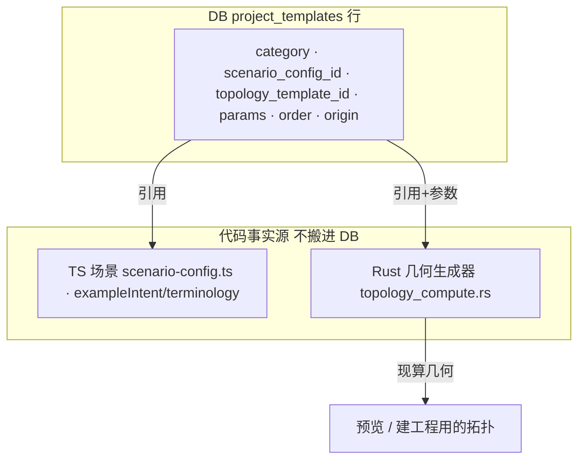

# Ideation：启动引导页 + 工程模板体系

打开 app / 点「新建工程」后，需要一个落地页：一个自然语言输入框，加一个可编辑、可排序、分类（航空/箭载/普通）的**工程模板**画廊。要求给模板建一套 DB 数据结构便于管理。本文只做方向筛选，不出需求/方案。

## Grounding Context

**现状（Codebase Context）**

- Tauri2 + React19 + Rust(sqlx SQLite)。入口 `src/app/App.tsx` 是固定三栏壳（brand-header + 导航栏 工程/Skill/设置 + `ChatPane` + `WorkspacePane`）。**今天没有落地页/空态**——新开 app 直接落进 chat stepper + 空画布（`currentStep="topology"`），首次用户被丢进一个看不懂的中间态。
- 新建工程 = `handleNewSession` → `createInitialWorkflowState`（`src/project/project-state.ts`，默认 `scenarioConfigId="aerospace-onboard"`）。输入框 = `chat-pane` 的 `<textarea id="intent">`，placeholder 取 `scenarioConfig.exampleIntent`，Enter 发送 → `submitIntent`。
- 已有**三套"模板"概念**，彼此不连：
  - 拓扑模板在 **Rust** 里硬编码（`src-tauri/src/topology_compute.rs`：`hop_linear_descriptor`/`dual_plane_descriptor`，`describe_templates_catalog_filtered` 按 scenario tag 过滤；MCP `topology.describe_templates`）。**只有 2 个，agent 运行时选，没有用户画廊**。descriptor 是**参数驱动**（节点数等）。
  - 场景系统在 **TS**（`src/domain/scenario-config.ts`：`ScenarioConfigId = generic-tsn | aerospace-onboard`，每个带 `displayName/exampleIntent/stageLabels/flowTemplates/terminology`；skill 引用 `.claude/skills/tsn-topology/references/<id>.md`）——**这已经是一条分类维度**。
  - `SKILL_CATALOG`（3 个 skill）。
- DB（`src-tauri/src/db.rs`）：`sessions`（整局 workflow 状态存 `payload` JSON blob）、`app_state`（kv，今天只放 `current_session_id`）、topology/timesync/flow 若干表。迁移 = **命令式 pragma 守卫**（幂等，`safety_net_schema` 须与迁移后 schema 逐字节一致）。
- **出厂播种 + 恢复生命周期已存在**（`skill_files.rs`：三态 resolve = 缺失→播种 / 哈希命中出厂→升级 / 用户改过→保留；带历代哈希；恢复前 dry-run 枚举将被覆盖的文件）。
- "工程" = "session" 的**纯显示改名**（代码符号仍是 session/Tsn*）；别让"工程模板"泄进任何打包标识。
- WebKit：macOS 用系统 WebKit，`grid + overflow` 的 auto 行会塌成 0 高 → **用 `flex-wrap`**；WKWebView 无法自动化，靠真机截图验证。
- 阶段只有 topology/time-sync/flow-template 三个；「时间延迟验证/通跑验证」不是独立阶段而是验证子 tab。示意图的 chips 是净新增 UI；**本期去掉「时间延迟验证」「时间同步」两个 chip，右上角「知识库」按钮只占位**。当前品牌 `HIBridge Agent` v1.0.1（示意图 "TSN AI AGENT 2.4.0" 仅为示意，不做改名）。

**外部先例**：prompt 输入框 + 模板画廊「双入口、都汇入同一编辑器」是成熟约定（Wix/Lovable/Base44）；v0/Bolt 纯 prompt。IDE 新建向导（Unity Hub Core/Sample/Learning 分类 + 详情面板、JetBrains 语言/框架分层、Rider「另存为模板」）。空输入框无示例 = "半成品"，应给 3-5 条**具体**范例 prompt。VS Code 分层设置（出厂基座 + 用户覆盖 + 逐项 reset）是「出厂 vs 用户」调和的最近先例。用户自建模板通常是 v2。

**贯穿全篇的核心分叉**：DB 承载可编辑模板，与今天「拓扑正本在 Rust 代码」的模型冲突——是把 DB 做成正本（Rust 降为 seed，需对账），还是让 Rust 继续当几何生成器、DB 只存**组合 + 覆盖层**。下面 1 号是对这条分叉的推荐取法。

## Topic Axes

- A. 首屏信息架构 — 输入框 + 提示 chips + 模板画廊布局；空态/返回态
- B. 模板数据模型与事实源 — DB schema、与 Rust catalog / TS 场景的关系、播种/恢复、对账
- C. 模板管理编辑与分类 — 增删/排序、航空/箭载/普通、出厂 vs 用户、reset
- D. 启动流与预览 — 模板「使用」→建工程带场景+拓扑；NL 输入→agent run；预览

## Ranked Ideas

跳转：[1. 组合式模板行](#1-组合式模板行rust-当渲染器db-存组合不存几何复用出厂三态) · [2. 落地页取代空态](#2-落地页取代空态输入框--3-5-条真实范例--flex-wrap-模板墙) · [3. 使用=确定性建工程](#3-使用确定性建工程nl走-agent双入口汇同一-session) · [4. 出厂不可编辑+用户覆盖层](#4-出厂不可编辑--用户覆盖层软删墓碑--一键恢复) · [5. 分类对齐场景](#5-分类对齐场景箭载缺场景是必须先拍的洞) · [6. 预留知识库列](#6-模板表预留-knowledge_ref为将来知识库当地基)

### 1. 组合式模板行（Rust 当渲染器，DB 存组合不存几何，复用出厂三态）

**Description:** 建一张 `project_templates` 表，一行 = 一个**组合/指针**：`(id, scenario_config_id, topology_template_id, params_json, title, subtitle, sort_order, origin[factory|user], hidden, factory_hash)`。它把今天代码里缺失的「场景 ↔ 拓扑模板」join 落成一行数据。分类不必单独存列——「航空/箭载=aerospace，普通=generic」可由 `scenario_config_id` 派生（见 5 号）。**几何仍由 Rust `topology_compute` 现算**（模板行只存"选哪个 + 什么参数"，不存节点坐标），出厂行用**已存在的三态生命周期**播种。这样同时满足用户要的"DB 承载 + 可编辑 + 分类"，又不复制 Rust catalog、不引入新对账机制。

**Axis:** B

**Basis:** `direct:` `topology_compute.rs` descriptor 已是参数驱动（`hop-linear`/`dual-plane` 吃节点数）；`scenario-config.ts` 每个场景已捆 `exampleIntent/flowTemplates`；`skill_files.rs` 三态播种/恢复现成可移植。`external:` CAD/EDA 参数化零件族——一个库条目参数化出多个实例，正对「2 个生成器 → 多张卡」。

**Rationale:** 这是本 feature 的承重决策。把模板做成**引用 Rust 的组合行**而非 DB 里的几何正本，一刀切开事实源：DB 管「选哪个 + 参数 + 分类 + 排序」，Rust 管「怎么算几何」。既拿到 DB 可编辑红利，又绕过「DB 正本 vs Rust catalog 谁对」的一致性地狱，符合「改动最小、不过度工程」。同时，`origin=user` 一列为将来「另存为模板」（把跑通的工程沉淀成复利资产，IDE 常见）预留了正本位置，本期可不实现但不被架构挡死。

**Downsides:** 用户**新增全新拓扑形状**（非现有 2 个生成器的参数变体）本期做不到——只能换场景/调参。对账压力没了，代价是灵活度上限被 Rust 生成器锁住。反方案（DB 做正本、Rust 降 seed）灵活度更高但要背对账，本期不建议。

**Confidence:** 82%
**Complexity:** Medium

### 2. 落地页取代空态：输入框 + 3-5 条真实范例 + flex-wrap 模板墙

**Description:** 用落地页顶掉今天的「空 stepper + 空画布」。首屏 = 一个 NL 输入框（带 3-5 条**具体可点**的范例 prompt，点了填进输入框可改再发）+ 一个 `flex-wrap`（非 grid）模板画廊。范例 prompt 直接取模板/场景的 `exampleIntent`，切分类换一批。按约束**去掉「时间延迟验证」「时间同步」两个 chip**，「知识库」按钮 disabled 占位。落地页渲染在现有壳的空态里，**数据驱动冷/暖**：无工程（首次）→纯落地页；已有工程→顶部先给「继续上次工程」，下方仍挂画廊。

**Axis:** A

**Basis:** `direct:` grounding「今天没有落地页/空态，新开 app = chat stepper + 空画布」；WebKit「grid+overflow 塌行 → flex-wrap」；约束明确 drop 两 chip + reserve 知识库。`external:` 对话式空态研究——「空输入框是未完成的功能」，应给 3-5 条具体范例；餐厅 mise en place——开工前备料台按「冷开台 / 暖返场」分层，不给老用户塞新手引导。

**Rationale:** 最大的第一印象痛点就是被丢进看不懂的中间态；落地页的**存在本身**（而非内容）是核心价值。冷/暖数据驱动一套视图，避免"空态页"和"返回态页"两套 UI 漂移，也回答了「有 10 个工程的老用户还看不看模板墙」。范例与模板同源，加模板即自动获得范例，永不过时。

**Downsides:** 需要定清落地页在三栏壳里的确切位置与「工程」导航项在有活跃工程时的行为（点它是否回落地页）。`flex-wrap` + 真机 WebKit 需要截图验证，不能只靠 Playwright。

**Confidence:** 80%
**Complexity:** Medium

### 3. 「使用」=确定性建工程，NL 走 agent，双入口汇同一 session

**Description:** 点模板卡的「使用」= 用该行的 `scenario + topology_template_id + params` **确定性**建 session（走 Rust `initialize`，**不花 LLM 轮次**），直接落到拓扑阶段的就绪画布；NL 输入框才是 agent 路径。两条最终都汇进同一个 `createInitialWorkflowState`/session。预览弹窗渲染的就是 `initialize` 的确定性输出——**预览即真相**，模板参数一变预览自动准，不存会漂移的缩略图。

**Axis:** D

**Basis:** `direct:` 拓扑模板今天是「agent 运行时选」（`describe_templates`），而卡片意味着用户已经选好；`initialize` 吃 `template_id + params`；急诊分诊「主诉（NL）+ 临床路径（模板）汇入同一诊疗计划」的双入口合流。`external:` 「prompt + 模板双入口都汇入同一 session」是成熟约定。

**Rationale:** 一个还要绕回 agent 重新选拓扑的画廊，等于无视用户的显式选择、还让他等一轮 agent——那就白选了。确定性 preload 才是模板「比打字快」的兑现点。预览复用现有画布渲染（floating 贝塞尔正交布局），省掉缩略图生成/存储/失效整条管线。

**Downsides:** 需明确「使用」写入拓扑后，agent 后续不得再自作主张重排（否则覆盖用户选择）——与阶段切换/确认闸的交互要理清。深拷贝语义（Figma「duplicate into workspace」）要落实，避免跨会话共享可变状态污染（项目踩过的 key 污染类 bug）。

**Confidence:** 78%
**Complexity:** Medium

### 4. 出厂不可编辑 + 用户覆盖层（软删墓碑 + 一键恢复）

**Description:** 出厂模板行**只读**；用户的「删除/排序/隐藏」全部落成**非破坏性覆盖**（hidden 集合 + order 数组，或 `template_overrides` 侧表），渲染 = 出厂全集 − 覆盖。「删除出厂模板」写**软删墓碑**（`hidden=true`）而非物理删——否则下次三态播种见「缺失」会把它**重新种回来**（复活，正是项目踩过的会话删除复活 bug 模式）。「恢复默认模板」= 清覆盖层，直接复用现有 restore 的 dry-run-then-apply。

**Axis:** C

**Basis:** `direct:` 三态 resolve「缺失→播种」与硬删冲突会复活；`skill_files.rs` 恢复生命周期现成；MEMORY 记的会话删除复活 bug 同型。`external:` DAW 音色预设——不可删的出厂库 + 可随意增删排的用户库 + 「恢复出厂」不碰用户预设；VS Code 分层设置逐项 reset。

**Rationale:** 让「删了又自己回来」这类读起来像坏了的 bug 从设计上不可能发生；覆盖层让 remove/reorder/reset 语义几乎零成本拿到，且用户永远 brick 不了出厂模板。出厂行是代码/seed，app 升级自动带新出厂模板，用户不留陈旧副本。

**Downsides:** 覆盖层 + 出厂行两层的渲染合并要写清（顺序、隐藏、用户新增行如何插入排序）。若走「侧表只存 delta」还是「主表 origin+hidden 列」需与 1 号 schema 一起定。

**Confidence:** 80%
**Complexity:** Medium

### 5. 分类即场景：两类（航空/箭载 → aerospace，普通 → generic）足够，从场景派生

**Description:** 「航空/箭载/普通」对齐到场景系统。经 boss 确认，**「箭载」就是「航空」**（同一类）——因此分类实际只有两类：**航空/箭载 → `aerospace-onboard`，普通 → `generic-tsn`**，两个现有场景刚好覆盖，**无需新建场景**。既然一张模板卡本就绑定一个 `scenario_config_id`，分类可**直接从场景派生**：本期不必单独存一列可编辑的自由文本分类，画廊的分组标签 = 场景的显示名。

**Axis:** C

**Basis:** `direct:` boss 确认「箭载场景就是航空场景」；`scenario-config.ts` 现有 `aerospace-onboard` / `generic-tsn` 两场景各带 `displayName/terminology`，正好当两个分组标签，无需新增枚举值。

**Rationale:** 之前担心的「箭载缺场景会静默套错术语」的硬洞，因「箭载=航空」直接消解——两类都有现成场景兜底，零新增场景工作。把分类降为「场景的派生视图」也顺手简化了 1 号 schema：`category` 可不落库、由 `scenario_config_id` 推出，去掉一整套分类 CRUD/校验，更贴合「不过度工程」。

**Downsides:** 若将来真要在同一场景下再细分展示分组（如 aerospace 下再分星载/箭载/机载），派生模型需回补一个可选的展示分组字段——属后续需求，本期两类够用。

**Confidence:** 88%
**Complexity:** Small

### 6. 模板表预留 `knowledge_ref`，为将来「知识库」当地基

**Description:** 建表时给模板行加一个**可空** `knowledge_ref`（或 references 数组）列，本期不用，UI 只保留「知识库」占位按钮。将来「知识库」= 「按模板/场景组织的内容层」时，可零 ALTER / 零回填直接挂上——场景系统本就用 `references/<id>.md` 按 id 引用文档，模板复用同一引用惯例。**本期严格克制**：只加一列 + 占位按钮，不建内容表、不做任何内容规划。

**Axis:** B

**Basis:** `direct:` 约束「reserve 知识库」；`scenario-config` 已有 `references/<id>.md` 的 id 引用惯例。`reasoned:` 预留可空列的边际成本≈0，却把未来「知识库」从「大改 schema + 数据回填」降为「填已有列」。

**Rationale:** 一次建表的顺手决定，避免将来知识库落地时被迫做一次表迁移；模板与内容天然按同一 id 组织。属低成本高杠杆的地基性预留。

**Downsides:** 有 YAGNI 风险——预留字段若最终知识库形态大变可能白留。缓解：只留一列、不扩散成表/关系，代价可控。

**Confidence:** 62%
**Complexity:** Small

## Rejection Summary

| # | Idea | Reason Rejected |
|---|------|-----------------|
| 1 | DB 做模板正本、Rust catalog 降为 seed（`template_registry` 全量） | 引入 DB↔Rust 对账负担，违背「改动最小/不过度工程」；作为 1 号的对立选项在其 Downsides 记录，非彻底否决 |
| 2 | 模板 = 纯 NL 文本串（不带拓扑，「使用」只填输入框） | 与用户明确的「拓扑卡片 + DB 承载模板内容」诉求冲突；且丢掉确定性建工程的价值（见 3 号） |
| 3 | 0 模板：首屏只留 NL + 场景 chips | 违背「要有模板画廊」这条硬约束；作为 2 号「范例 prompt」的一部分吸收 |
| 4 | 「另存为模板」把跑通工程沉淀成模板 | 强复利想法但属 v2（用户自建模板通常后置）；1 号 schema 的 `origin=user` 已为它留位，本期不做 |
| 5 | 独立可编辑的自由文本分类列 | boss 确认「箭载=航空」后只剩两类且各有现成场景 → 分类由 `scenario_config_id` 派生更简，已并入 5 号（非否决，是被更简方案取代） |
| 6 | 用量驱动排序（最近用的浮顶）替代手动拖拽 | 用户明确要「改变显示顺序」= 手动排序；用量排序作为 4 号的可选降级项提及，非主线 |
| 7 | 模板携带 HACCP 式安全关键不变量 / 溯源 lineage / provenance badge | 对本期落地页超纲，属安全校验/审计域的独立特性；过度工程 |
| 8 | 模板导出/导入文件、整队共享 | 本期无团队共享需求、无认证；v2 方向 |
| 9 | 1000 模板压力测试 → 搜索优先 IA | 今天只有 2 个模板，搜索/虚拟化是过早优化；分类 tab 已够 |
| 10 | 「知识库」与模板同一张表/同一特性一起建 | 越界——本期只「预留一列 + 占位按钮」（6 号），不建内容层 |
| 11 | 取消预览弹窗、仅静态缩略图 | 与 3 号「预览=确定性生成的真相」相悖；静态图会随参数漂移。作为「若只 2 模板可先固定图」的实现取舍留 brainstorm |
| 12 | 落地页做成第 4 个顶层视图（独立路由） | 更重且要解「多工程时画廊放哪/怎么返回」；2 号的「渲染在现有壳空态」更省，优先 |
