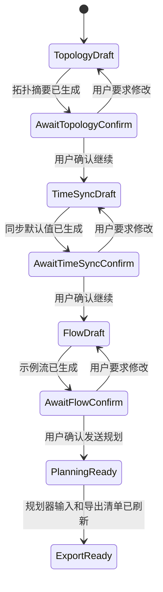
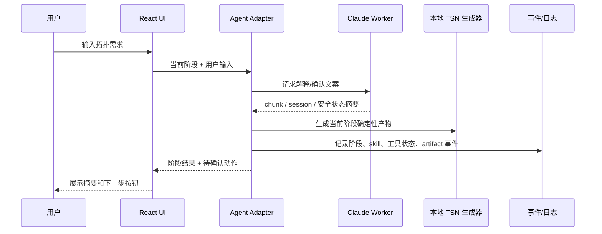
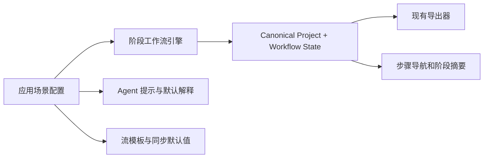

# feat: 完善 TSN Agent 分阶段交互工作流

## Summary

把当前“一次性生成拓扑、流和导出文件”的 TSN Agent MVP，演进为可分阶段推进、可确认、可观察工具调用的工作流。计划不做规范差距展示；重点是让左上角步骤导航真正对应拓扑、时间同步、建立流和发送规划等阶段，并让用户能看到 Agent、阶段 skill、可用工具/MCP 状态摘要和导出动作的过程。

阶段流程需要预留轻量应用场景配置模型（`ScenarioConfig`）：舰载/箭载 TSN 只是未来 8 个应用场景中的一个典型，阶段名称、默认值、模板和术语应能按场景切换，而不是写死到单一场景里。

---

## Problem Frame

当前应用已有对话、fake/Claude agent、artifact bundle、诊断日志和步骤导航外观，但生成行为仍偏一次性：用户输入一次后，右侧直接出现完整草案，Agent 很少在阶段之间请求用户确认。日志也主要服务开发排障，用户还不能清楚看到阶段 skill、可用工具/MCP 状态和导出动作。

这会削弱需求文档里“逐步转换成项目目录”“阶段 skill”“解释默认值和生成决策”的产品目标，也让左上角的“拓扑/时钟同步/流量”导航条停留在视觉占位。

同时，后续产品不是只服务单个“舰载/箭载”规范场景，而是要支持多个 TSN 应用场景。当前阶段如果把默认拓扑、流模板、阶段文案和参数解释直接写进通用代码，未来扩展其他场景时会重复改核心流程。

---

## Requirements

- R1. 工作流必须拆成清晰阶段，至少包括拓扑、时间同步、建立流、发送规划/导出准备，并让 UI 步骤导航反映当前阶段。
- R2. Agent 不应在首次输入后无条件一次性完成全部产物；关键阶段完成后必须向用户展示摘要，并支持用户确认继续、要求修改或回退。
- R3. 每个阶段必须能保留阶段产物、阶段状态和用户确认状态，便于会话恢复和后续继续。
- R4. 阶段 skill、工具/MCP 可用状态摘要和导出动作必须以用户可理解的事件出现在执行步骤或日志中，而不只保留在内部诊断里。
- R5. 真实 Claude bridge 可以继续使用确定性本地逻辑生成 canonical project，但必须将 Claude 回复、阶段事件和可观测执行事件统一合并成可展示时间线。
- R6. fake agent 路径必须模拟同样的阶段事件和确认行为，保证 Web 测试和无 Claude 环境下体验一致。
- R7. 计划必须保持新手入口简单：阶段确认以摘要和建议动作为主，不引入专家参数编辑器。
- R8. 现有 NED、React Flow、规划器输入和 manifest 导出必须保持兼容；分阶段工作流不应破坏当前项目目录交付边界。
- R9. 阶段工作流必须预留应用场景配置模型，支持未来多个 TSN 场景配置各自的阶段文案、默认值、流模板和术语，而不是把舰载/箭载场景规则写死。
- R10. 第一版只需要内置一个默认通用 TSN 配置和一个典型场景配置占位；不要求一次性实现全部 8 个场景。

**Origin actors:** A1 TSN 新手用户，A2 Claude Agent，A3 TSN skills，A4 规划器，A5 INET 仿真流程

**Origin flows:** F1 从自然语言拓扑意图创建新项目，F2 引导式流模板选择，F3 步骤快照和回退，F5 项目目录交付

**Origin acceptance examples:** AE1 拓扑生成，AE2 控制流模板，AE3 快照回退，AE4 规划器输出识别

---

## Scope Boundaries

- 不做“规范差距检查视图”或规范 gap report 展示。
- 不实现完整 gPTP、TAS、CBS、PSFP、FRER 配置导出。
- 不放开任意 Bash/Edit/Write 工具权限；本轮只展示可用工具/MCP 状态摘要和应用内阶段事件，不解析真实 `tool_use/tool_result` 细节。
- 不运行真实外置规划器；“发送规划”阶段先生成或刷新 `flow_plan_1.json` 并明确它是规划器输入。
- 不新增专家参数表单；用户修改仍通过对话或阶段确认动作进入。
- 不一次性建完 8 个应用场景；本计划只建立轻量场景配置模型和最小默认/典型配置。
- 不让场景配置变成插件系统、复杂规则引擎或远程加载机制；先保持为可测试的本地 typed config。

### Deferred to Follow-Up Work

- 真实规划器执行和 `flow_plan_result_1.json` 解析：单独计划。
- 完整阶段 skill 系统或可插拔 skill marketplace：单独计划。
- 真实 Claude SDK `tool_use/tool_result` 和 MCP tool 调用解析：等只读工具实际启用后单独计划。
- INET 行为仿真配置导出：依赖后续模型和仿真计划。

---

## Context & Research

### Relevant Code and Patterns

- `src/domain/canonical.ts` 当前只定义 canonical project、topology、flows 和 `simulationHints`，缺少阶段工作流状态。
- `src/project/project-state.ts` 和 `src/project/snapshots.ts` 已有 `ProjectStep` 与快照机制，但当前 step 只有 `topology | flow-template | export`，未接入主 UI 会话流。
- `src/agent/fake-agent.ts` 已产生 `AgentEvent[]`，包含 `tsn-topology`、`tsn-flow-template`、`tsn-export`，适合扩展为阶段事件源。
- `src/agent/agent-adapter.ts` 已支持 fake/Claude 双模式、streaming chunk、diagnostic logging 和 resume context，是合并 Claude 文本与确定性阶段产物的边界。
- `src-node/claude-agent-worker.mjs` 当前对 Claude Agent SDK 设置 `tools: []`、`allowedTools: []`、`disallowedTools: ["Bash", "Edit", "Write"]`，不会产生真实工具调用；本轮只需要把该状态以安全摘要展示给用户。
- `src/app/App.tsx` 已有左侧 stepper、执行步骤列表、诊断日志抽屉和 artifact 面板，但 stepper 状态是硬编码的，执行步骤只显示最终 `agentEvents`。
- `docs/plans/2026-05-20-002-feat-session-diagnostics-logs-plan.md` 已建立诊断日志方向：compact streaming、不保存 raw stdout/stderr、不保存敏感配置。

### External References

- Claude Agent SDK TypeScript `query()` 返回 `assistant`、`user`、`result`、`system`、`stream_event` 等消息；本轮只依赖初始化和流式文本中的安全摘要，不实现真实 tool call/result 解析。

---

## Key Technical Decisions

- **阶段状态进入会话模型，而不是只存在于 UI。** 用户切换会话或重启后应能恢复当前阶段、已确认阶段和待确认动作。
- **确定性产物仍由本地逻辑生成。** Claude 文本负责解释、追问和确认；canonical project、bundle 和 planner input 继续由本地模块生成，降低不可重复风险。
- **阶段推进采用明确确认。** 阶段完成后进入 `waiting_confirmation`，用户确认后才进入下一阶段；“直接生成”可以作为显式快速路径，而不是默认行为。
- **用户可见事件和诊断日志分层。** 执行步骤显示可理解的阶段、skill、artifact 和工具状态摘要；诊断日志保留 run id、耗时、chunk 统计和错误摘要。
- **工具/MCP 可见性先做摘要，后续再解析调用。** 第一阶段展示可用状态和应用内阶段事件；仍禁止写文件和 shell 修改类工具。
- **步骤导航是状态入口。** 左上角 stepper 不只是装饰，应显示阶段状态，并允许查看每个阶段摘要、产物和下一步动作。
- **应用场景通过 ScenarioConfig 注入差异。** 通用阶段引擎只认识阶段、产物和确认动作；舰载/箭载等场景差异通过场景配置提供默认值、术语和模板，不散落在 UI、agent prompt 和 exporter 里。
- **先做轻量场景配置，不做规则引擎。** 本计划只需要本地 typed config、选择/持久化和测试；复杂场景插件、远程加载或用户自定义配置后置。

---

## Open Questions

### Resolved During Planning

- 是否展示规范差距：不展示。规范文档只作为后续领域背景，不作为本计划的 UI 功能。
- 下一阶段主线：交互式分阶段 Agent、确认点、可观测执行事件和步骤导航功能化。
- 多场景适配方式：预留应用场景配置模型，第一版只内置默认通用配置和一个典型场景配置占位。

### Deferred to Implementation

- 哪些 MCP 工具第一批允许、如何展示真实 tool call/result：后续启用只读工具时单独确认。

---

## High-Level Technical Design

> *This illustrates the intended approach and is directional guidance for review, not implementation specification. The implementing agent should treat it as context, not code to reproduce.*

---

## Implementation Units

### U1. 定义应用场景配置模型

**Goal:** 建立轻量 `ScenarioConfig` 配置模型，避免把舰载/箭载典型场景写死到通用 TSN Agent 流程里。

**Requirements:** R7, R9, R10

**Dependencies:** None

**Files:**
- Create: `src/domain/scenario-config.ts`
- Create: `src/domain/scenario-config.test.ts`
- Modify: `src/domain/topology-factory.ts`
- Test: `src/domain/topology-factory.test.ts`

**Approach:**
- 定义 `ScenarioConfig` 本地 typed config，第一版只包含 id、显示名称、阶段标签、基础默认值、流模板列表和术语映射。
- 提供 `generic-tsn` 默认配置，确保现有 MVP 行为不依赖具体舰载/箭载场景。
- 提供一个 `aerospace-onboard` 或类似命名的典型场景配置占位，用于承载前面规范文档中的默认术语和模板方向，但不做规范差距展示。
- session/workflow state 只保存 scenario config id，不复制完整配置对象；canonical/exporter 不需要读取场景配置。

**Patterns to follow:**
- `src/domain/canonical.ts` 的纯类型定义风格。
- `src/domain/topology-factory.ts` 的默认值集中定义方式。

**Test scenarios:**
- Happy path：未指定场景时使用 `generic-tsn` 配置，现有拓扑生成行为保持兼容。
- Happy path：指定典型场景配置时，阶段标签、默认说明和流模板文案来自该配置。
- Edge case：未知 config id 回退到默认配置，并产生可解释的 warning 或 fallback 标记。
- Edge case：config id 持久化到 session/workflow state 后可恢复，不要求保存完整配置对象。

**Verification:**
- 后续场景可以优先通过新增配置接入；如未来场景需要新增字段，应集中调整 `ScenarioConfig`，不复制阶段引擎。

---

### U2. 定义阶段工作流状态模型

**Goal:** 建立可持久化的阶段状态，使拓扑、时间同步、建立流和发送规划不再只是 UI 文案。

**Requirements:** R1, R2, R3, R7, R9

**Dependencies:** U1

**Files:**
- Modify: `src/project/project-state.ts`
- Modify: `src/project/snapshots.ts`
- Test: `src/project/project-state.test.ts`
- Test: `src/domain/topology-factory.test.ts`

**Approach:**
- 将阶段枚举扩展为 `topology`、`time-sync`、`flow-template`、`planning-export` 一类稳定值。
- 为会话或项目状态增加当前阶段、阶段状态、确认状态、阶段摘要和可用动作。
- 阶段显示名、默认说明和可用动作文案从当前 `ScenarioConfig` 解析，而不是硬编码在 UI 中。
- 保持 `CanonicalTsnProjectV0` 的导出兼容；阶段状态可以在 project/session 包装层，不强迫所有 exporter 读取。
- 将现有 snapshot 和 stage export 概念接入阶段状态，而不是只作为独立工具函数存在。

**Patterns to follow:**
- `src/project/project-state.ts` 的小型纯函数风格。
- `src/project/snapshots.ts` 的 structured clone 和显式错误处理。

**Test scenarios:**
- Happy path：新项目初始化后当前阶段为拓扑，状态为待生成或当前。
- Happy path：不同场景配置下同一阶段 ID 保持稳定，但展示标签和提示文案不同。
- Happy path：拓扑阶段确认后推进到时间同步阶段，拓扑阶段标记为已确认。
- Edge case：尝试跳过未确认阶段时保持当前阶段不变并返回可解释错误。
- Edge case：恢复旧 session payload 中没有阶段状态时，能派生出兼容默认状态。
- Integration：快照保存和恢复时同时恢复阶段状态和 active snapshot。

**Verification:**
- 阶段状态可被纯逻辑测试覆盖，不依赖 React 或 Tauri。
- 旧的 canonical/exporter 测试仍能通过。

---

### U3. 拆分确定性阶段执行器

**Goal:** 把当前 fake agent 的一次性生成改为按阶段生成产物和阶段事件，同时保留一键快速路径的可能性。

**Requirements:** R1, R2, R5, R6, R8, R9

**Dependencies:** U1, U2

**Files:**
- Modify: `src/agent/fake-agent.ts`
- Modify: `src/agent/agent-adapter.ts`
- Test: `src/agent/fake-agent.test.ts`
- Test: `src/agent/agent-adapter.test.ts`

**Approach:**
- 引入阶段请求语义：用户输入在不同阶段代表不同动作，例如生成拓扑、确认同步默认值、建立示例流、刷新规划器输入。
- fake agent 输出每一阶段的 `AgentEvent[]`、阶段摘要和待确认动作，不再默认一次完成所有 artifact。
- 阶段执行器读取 `ScenarioConfig` 中的默认文案、流模板和提示，不把舰载/箭载术语写进通用执行器。
- Agent adapter 保持“Claude 文本 + 本地产物”组合模式，但返回值需要带当前阶段执行结果。
- 对“确认/继续/直接生成”做显式识别：确认只推进一个阶段，直接生成才允许连续跑完多个阶段。

**Execution note:** 先用 fake agent 测试锁定阶段行为，再接入 Claude adapter。

**Patterns to follow:**
- `runFakeTsnAgent()` 当前的 deterministic result 生成方式。
- `hasExplicitTopologyIntent()` 和 continuation intent 的轻量解析风格。

**Test scenarios:**
- Happy path：拓扑输入只生成拓扑阶段结果，并返回“等待确认继续到时间同步”。
- Happy path：用户确认后生成时间同步默认摘要，不生成最终导出文件。
- Happy path：用户继续确认到建立流阶段后，生成一条控制流模板。
- Happy path：在典型场景配置下，建立流阶段使用该配置的控制流模板文案和默认说明。
- Happy path：发送规划阶段生成 `flow_plan_1.json`、NED、React Flow JSON 和 manifest。
- Edge case：用户在时间同步阶段重新输入拓扑规模时，系统回到拓扑阶段并更新后续状态。
- Integration：Claude 模式下最终 artifact 仍来自本地阶段执行器，Claude 回复只影响展示文本。

**Verification:**
- Web/fake 环境可以完整走完多阶段流程。
- 现有“一句话生成”测试更新后仍能验证最终导出能力，但需要通过阶段确认或显式快速路径完成。

---

### U4. 设计用户可见事件时间线

**Goal:** 统一展示 Agent、阶段 skill、工具/MCP 状态摘要、artifact 和阶段确认事件，让执行步骤面板能解释“刚刚发生了什么”。

**Requirements:** R4, R5, R6

**Dependencies:** U2, U3

**Files:**
- Modify: `src/agent/fake-agent.ts`
- Modify: `src/diagnostics/diagnostic-log.ts`
- Modify: `src/diagnostics/app-diagnostics.ts`
- Test: `src/diagnostics/app-diagnostics.test.ts`
- Test: `src/diagnostics/diagnostic-log-repository.test.ts`
- Test: `src/agent/fake-agent.test.ts`

**Approach:**
- 扩展 `AgentEventKind`，覆盖 `stage-start`、`stage-result`、`confirmation-required`、`skill-result`、`tool-availability`、`artifact` 等用户可见类别。
- 每个事件包含阶段、标题、简短内容、可选工具/MCP 名称、状态和时间戳。
- 用户可见事件应经过脱敏和摘要化，不直接展示 raw stdout/stderr、完整环境变量或凭证。
- 诊断日志继续保留更细节的 run id、duration、chunk stats；执行步骤列表读取用户可见事件。
- 不在本单元解析真实 Claude SDK `tool_use/tool_result` 内容块；没有启用工具时也应显示“工具访问未启用”一类安全状态。

**Patterns to follow:**
- `src/diagnostics/diagnostic-log.ts` 的脱敏和截断策略。
- `docs/plans/2026-05-20-002-feat-session-diagnostics-logs-plan.md` 的 compact logging 决策。

**Test scenarios:**
- Happy path：fake agent 在拓扑阶段产生 stage start、skill result、confirmation required 事件。
- Happy path：artifact 刷新时产生 artifact 事件且包含文件用途摘要。
- Happy path：真实 Claude 工具未启用时，执行步骤能显示安全的工具状态摘要，而不是空白或误导性成功。
- Edge case：事件 details 中出现 token/password 字样时展示值被脱敏。
- Error path：阶段执行失败时产生 error/warn 类用户可见事件，同时写入诊断日志。

**Verification:**
- 执行步骤面板和诊断日志使用同一批安全摘要规则。
- 会话保存后 agent events 可恢复并保持排序。

---

### U5. 实现阶段确认与导航 UI

**Goal:** 让左上角 stepper 和右侧工作台真正表现阶段流程，并提供确认、修改、回退和继续动作。

**Requirements:** R1, R2, R3, R7, R9

**Dependencies:** U1, U2, U3, U4

**Files:**
- Modify: `src/app/App.tsx`
- Modify: `src/app/App.css`
- Test: `src/app/App.test.tsx`

**Approach:**
- stepper 状态从项目阶段状态派生，显示当前、已确认、待确认、锁定、错误等状态。
- stepper 标签和阶段摘要文案从当前 `ScenarioConfig` 读取；通用配置和典型场景配置可以有不同展示文案。
- 在对话区或右侧阶段摘要区显示当前阶段结果和下一步动作，例如“确认拓扑并进入时间同步”“修改拓扑”“跳过到导出快速路径”。
- 用户点击确认按钮时提交明确阶段动作，而不是要求用户手写“继续”。
- 执行步骤面板按阶段分组显示事件；工具/MCP 状态摘要以简短可读形式出现。
- 保持右侧数据只读，修改仍通过对话和阶段动作进入。

**Patterns to follow:**
- 当前 `App.tsx` 的 session persistence 和 optimistic assistant message 处理。
- `DiagnosticsDrawer` 的过滤/空状态处理方式。

**Test scenarios:**
- Covers AE1. Happy path：输入拓扑需求后，stepper 显示拓扑待确认，右侧有拓扑摘要和确认按钮。
- Happy path：切换或创建不同场景配置的会话时，stepper 使用对应场景文案，但阶段推进逻辑不变。
- Happy path：确认拓扑后，stepper 进入时间同步阶段，流量和导出仍未完成。
- Covers AE2. Happy path：确认建立流后，流量列表显示一条控制流模板。
- Covers AE3. Happy path：用户从阶段摘要要求修改拓扑时，后续阶段状态被重置或标记需重新生成。
- Edge case：没有 project 时 stepper 显示等待状态，不出现不可用的确认按钮。
- Integration：执行步骤面板显示 stage、skill、tool availability 和 artifact 事件。

**Verification:**
- 用户无需手写“继续”也能完成完整阶段流程。
- UI 上不会暗示已完成未确认的阶段。

---

### U6. 调整规划发送入口与导出展示

**Goal:** 把规划器输入和项目导出暴露为明确的“发送规划/导出准备”阶段动作，避免 UI 过早暗示已经完成规划。

**Requirements:** R1, R2, R8

**Dependencies:** U3, U5

**Files:**
- Modify: `src/app/App.tsx`
- Test: `src/export/exporters.test.ts`
- Test: `src/project/project-exporter.test.ts`
- Test: `src/app/App.test.tsx`

**Approach:**
- 保持现有 bundle/exporter 生成逻辑，避免引入 partial project 生命周期。
- UI 只在“发送规划/导出准备”阶段暴露保存/导出动作，并明确 `flow_plan_1.json` 是规划器输入而不是规划器结果。
- `flow_plan_result_1.json` 仍只作为外部 observed planner output，不在本阶段生成。
- artifact 事件应说明每个文件用途，并进入用户可见事件时间线。

**Patterns to follow:**
- `createArtifactBundle()` 当前统一生成 manifest 的方式。
- `src/project/export-manifest.ts` 对 planner output 的 external guard。

**Test scenarios:**
- Happy path：建立流阶段前不会显示“规划已发送”或“导出已完成”的成功状态。
- Happy path：发送规划阶段生成现有 5 个 artifact，并保持 manifest purpose 不变。
- Edge case：没有流模板时请求发送规划，应提示先完成建立流阶段。
- Integration：保存项目仍通过现有 `exportProjectBundle()` 路径，不改变安全路径保护。

**Verification:**
- 现有导出文件内容兼容，下游 planner input 和 INET 最小文件仍可生成。
- UI 将“发送规划”和“保存项目文件”区分清楚。

---

### U7. 更新会话恢复和最小持久化

**Goal:** 确保阶段状态、用户确认、场景配置 id、用户可见事件和当前待办动作在会话切换后可恢复。

**Requirements:** R3, R4, R5, R9

**Dependencies:** U4, U5

**Files:**
- Modify: `src/sessions/session-repository.ts`
- Test: `src/sessions/session-repository.test.ts`

**Approach:**
- session payload 保存阶段工作流状态和用户可见事件。
- session payload 保存 scenario config id，并在读取旧会话时回退到默认配置。
- 复制会话时复制阶段状态和已生成产物，但清除 Claude resume session id，保持现有行为。
- 诊断日志筛选、tool/MCP 专用过滤和更细的复制策略后置；本轮只保证会话恢复不丢阶段进度。

**Patterns to follow:**
- `redactSessionForStorage()` 的敏感信息脱敏。
- `src/sessions/session-repository.ts` 当前旧 payload 兼容处理。

**Test scenarios:**
- Happy path：切换会话后恢复当前阶段和待确认动作。
- Happy path：切换到不同场景配置的会话后，恢复对应场景文案和阶段摘要。
- Happy path：复制会话后保留阶段摘要和 agent events，但不复用 Claude session id。
- Edge case：旧 session payload 没有阶段字段时能正常打开。

**Verification:**
- 多会话操作不会丢失阶段进度或显示过期工具事件。

---

### U8. 扩展 E2E 与最小文档

**Goal:** 用测试和文档固定新的分阶段交互契约，避免回退成一次性生成。

**Requirements:** R1-R10

**Dependencies:** U5, U6, U7

**Files:**
- Modify: `e2e/specs/smoke.spec.ts`
- Modify: `README.md`
- Create: `docs/staged-agent-workflow.md`

**Approach:**
- Web E2E 使用 fake agent 跑通拓扑输入、确认拓扑、确认时间同步、建立流、发送规划、查看执行步骤和保存导出。
- README 更新当前产品行为：分阶段推进、执行事件可见、规划器输入边界。
- 新文档说明阶段语义、事件种类、确认动作和不支持的专家参数/真实规划器边界。
- `ScenarioConfig` 只在阶段工作流文档中作为一节说明，等第二个真实场景落地后再单独拆文档。

**Test scenarios:**
- Happy path：E2E 从一句拓扑输入一路确认到导出文件列表出现。
- Happy path：E2E 或组件测试能证明场景配置文案显示在阶段导航/摘要中。
- Happy path：E2E 能看到至少一个 skill 事件和一个 artifact 事件。
- Edge case：未完成流阶段时导出按钮或发送规划动作不可用。

**Verification:**
- 文档、UI 文案和测试场景对“分阶段”使用同一套阶段名称。

---

## System-Wide Impact

- **Interaction graph:** 用户输入不再直接等于完整项目导出；它会驱动阶段动作，阶段动作再触发本地产物生成和事件记录。
- **Error propagation:** 阶段失败应停留在当前阶段，写入用户可见事件和诊断日志，不应静默生成后续 artifact。
- **State lifecycle risks:** 阶段状态、project、bundle、agent events 和 snapshots 必须一致；修改早期阶段后，后续阶段要重置或标记过期。
- **ScenarioConfig lifecycle risks:** session 只保存场景配置 id；配置重命名或未知时必须可回退，不应导致项目无法打开。
- **API surface parity:** fake agent、Claude adapter、Tauri event bridge、session persistence 都需要理解新事件类型。
- **Integration coverage:** 单元测试覆盖阶段纯逻辑，App 测试覆盖确认和 UI 状态，E2E 覆盖完整用户路径。
- **Unchanged invariants:** canonical/exporter 的已交付文件边界保持不变；敏感信息不入库、不展示 raw stdout/stderr 的约束保持不变。

---

## Risks & Dependencies

| Risk | Mitigation |
|------|------------|
| 分阶段流程让新手感觉步骤变多 | 提供明确确认按钮和“直接生成完整草案”的显式快速路径，但默认仍展示阶段摘要 |
| 工具/MCP 状态摘要泄露敏感信息或过多噪音 | 只显示名称、状态和脱敏摘要；完整 raw 输出不入库 |
| 阶段状态与 project/bundle 不一致 | 用阶段推进纯函数和测试固定状态转换；修改早期阶段时重置后续阶段 |
| 场景配置模型过度设计 | 第一版限制为本地 typed config，不做插件系统、规则引擎或远程加载 |
| 单一典型场景规则污染通用流程 | 阶段引擎只读取 `ScenarioConfig`，典型场景规则只放在场景配置中 |
| 当前测试假设一次性生成 | 更新测试为阶段确认路径，并保留显式快速路径测试 |

---

## Documentation / Operational Notes

- README 需要说明当前 Agent 会分阶段推进，不会默认执行真实规划器或完整仿真配置。
- `docs/staged-agent-workflow.md` 应成为后续实现和测试阶段行为的基准文档。
- `docs/staged-agent-workflow.md` 中应包含 `ScenarioConfig` 小节，说明场景配置负责文案、默认值和模板，核心阶段引擎保持场景无关。
- 调试执行事件时，先查看执行步骤面板，再查看诊断日志抽屉中的 agent 事件摘要。

---

## Sources & References

- **Origin document:** [docs/brainstorms/2026-05-20-tsn-agent-tauri-ned-requirements.md](../brainstorms/2026-05-20-tsn-agent-tauri-ned-requirements.md)
- Background gap analysis: [docs/brainstorms/2026-05-20-tsn-agent-rocket-tsn-spec-gap-analysis.md](../brainstorms/2026-05-20-tsn-agent-rocket-tsn-spec-gap-analysis.md)
- Related plan: [docs/plans/2026-05-20-001-feat-tsn-agent-tauri-mvp-plan.md](2026-05-20-001-feat-tsn-agent-tauri-mvp-plan.md)
- Related plan: [docs/plans/2026-05-20-002-feat-session-diagnostics-logs-plan.md](2026-05-20-002-feat-session-diagnostics-logs-plan.md)
- Related code: `src/agent/fake-agent.ts`
- Related code: `src/agent/agent-adapter.ts`
- Related code: `src-node/claude-agent-worker.mjs`
- Related code: `src/app/App.tsx`
- Related code: `src/project/project-state.ts`
- Related code: `src/diagnostics/diagnostic-log.ts`
