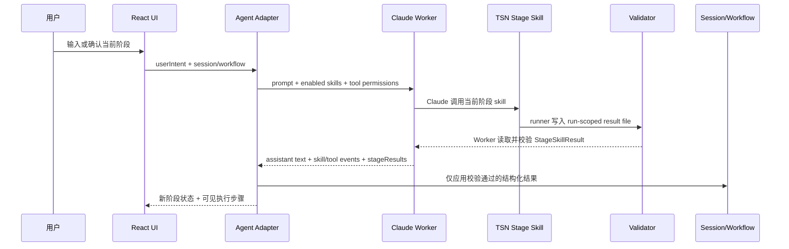
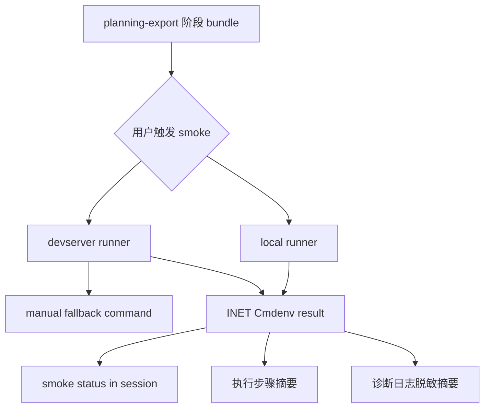
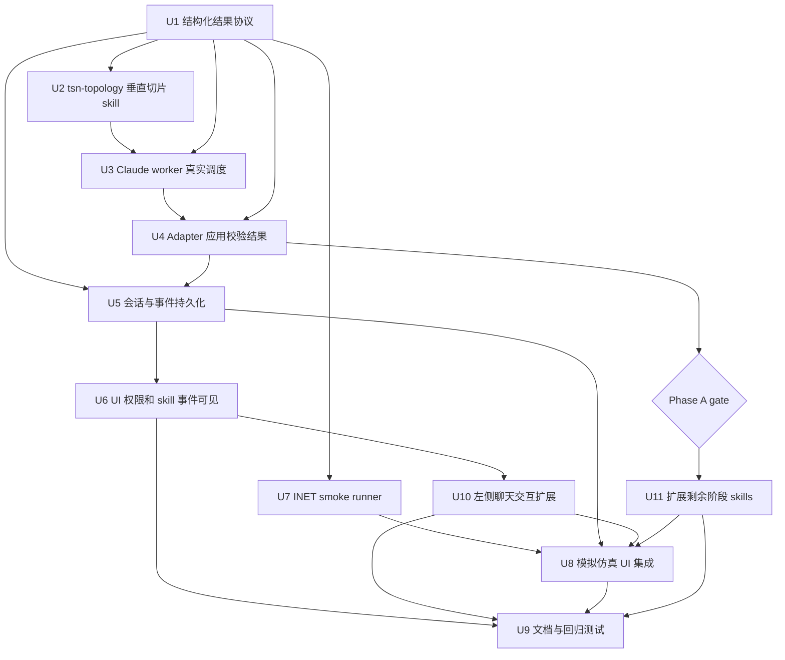

# feat: 接入真实阶段 skills 和 INET smoke 验证

## Summary

把现有“本地确定性生成器 + skill 风格事件”升级为真实 Claude Agent 阶段 skill 调度。第一步只打通 `tsn-topology` 垂直切片：Claude 调用项目级 skill，skill 通过 runner 写出结构化结果，worker 校验后回传，右侧工程状态只应用通过校验的结果。该链路稳定后，再扩展 `tsn-time-sync`、`tsn-flow-planning`、`tsn-inet-export`，并在“模拟仿真”阶段接入本机/devserver INET smoke 验证。

---

## Problem Frame

当前 UI 已经有四阶段工作流、执行步骤和 artifact 面板，但真实 Claude 路径仍主要输出左侧文本，右侧工程数据来自本地 fake/deterministic 结果；这会让用户看到的 skill 事件和实际执行不一致。最终阶段也只生成仿真输入文件，没有把 devserver 上已有的 INET 环境纳入可点击验证链路。

本计划承接现有分阶段工作流，不重新设计主流程；重点补齐“Claude 真调用阶段 skills、结构化产物校验、工具权限可见、INET smoke 验证回传”这几段缺口。

---

## Requirements

- R1. Claude Agent 必须能够启用并调用项目级 TSN 阶段 skills，而不是只展示带 `skillName` 的模拟事件。
- R2. 阶段 skills 至少覆盖 `tsn-topology`、`tsn-time-sync`、`tsn-flow-planning`、`tsn-inet-export`，并与稳定阶段 ID `topology`、`time-sync`、`flow-template`、`planning-export` 对齐。
- R3. 每个阶段 skill 必须产出结构化结果和校验报告；应用只接受通过 schema/validator 的结果进入 canonical project、bundle、会话状态或验证状态。
- R4. Claude 可以解释、追问和编排，但不能只凭自由文本修改右侧工程状态。
- R5. `tsn-topology` 的新主链路必须面向 canonical TSN、NED、React Flow 和规划器输入；旧 Qunee 输出只能作为兼容参考或可选产物。
- R6. Claude Agent 可以正常开放 `Bash`、`Edit`、`Write` 等 Claude Code 工具权限；应用必须把本轮启用的工具权限、工具调用和脱敏摘要展示给用户。
- R7. 模拟仿真阶段必须区分“仿真输入文件已生成”和“INET smoke 验证已运行/通过/失败/超时”。
- R8. INET smoke 验证必须支持本机 runner 和 devserver runner；跨机器验证不能把 tmux session 当作长期产品接口。
- R9. INET smoke 只承诺运行导出的 `network.ned` 和 `omnetpp.ini` 到 `sim-time-limit`，不能声称已验证完整 TSN 行为、确定性时延、gPTP、TAS/GCL 或业务流效果。
- R10. skill/tool/MCP、artifact、校验和 smoke 结果必须进入用户可见执行步骤，同时诊断日志继续只保存脱敏摘要。
- R11. 左侧聊天必须同步扩展为阶段化交互入口，展示阶段摘要、追问、确认/修改动作、工具权限提示、关键 skill/tool 进展和 smoke 结果通知，而不是只展示一次性 assistant 文本。
- R12. 真实 skill 接入必须先完成 `tsn-topology` 最小垂直切片并通过测试，再扩展剩余阶段 skills、devserver smoke 和更完整 UI 体验。
- R13. 面向大陆部署的用户界面、聊天消息、按钮、toast、执行步骤标题、诊断抽屉和错误提示不得出现 `Claude`、`Claude Code` 等供应商敏感词；用户可见层统一使用“智能助手”“Agent”“智能助手运行时”“工具权限”等中性表述。

**Origin actors:** A1 TSN 新手用户，A2 Claude Agent，A3 TSN skills，A5 INET 仿真流程，A7 INET smoke runner

**Origin flows:** F6 分阶段确认和工具可见，F8 真实阶段 skill 调度，F9 INET smoke 验证

**Origin acceptance examples:** AE10 工具事件可见，AE12 结构化 skill 结果校验，AE13 canonical-first 拓扑 skill，AE14 工具权限与脱敏摘要可见，AE15 devserver INET smoke 验证，AE16 左侧聊天阶段交互

---

## Scope Boundaries

- 不改变现有四阶段稳定 ID；用户可见文案继续是“拓扑、时间同步、流量规划、模拟仿真”。
- 不展示“规范差距”页面，也不把箭载/舰载 TSN 写成唯一核心流程。
- 不把旧 `tsn-topology/` Qunee 契约作为新应用主链路；旧目录可保留为参考或兼容输出来源。
- 不执行外置规划器，不生成假的 `flow_plan_result_1.json`、GCL、TAS 或 interface 摘要。
- 不把 INET smoke 解释成完整仿真；它只验证最小 NED/INI 可加载运行。
- 不把 tmux `inet` session 作为产品协议；devserver runner 应通过明确命令、上传/定位目录和结果回传实现。
- 不保存 Claude Code 凭证、本机密钥、SSH 私钥内容、完整 stdout/stderr 或大段原始 prompt/context。
- 不把场景配置做成插件系统；本计划只确保新 skills 继续使用现有 `ScenarioConfig`，不扩展未来 7 个场景。
- 不把左侧聊天做成完整日志终端；聊天只呈现用户决策需要看到的摘要、确认点和结果通知，详细事件仍在执行步骤/诊断日志中查看。
- 不把 manual smoke 做成与 local/devserver 并列的一等模式；manual 只是在本机或 devserver 配置不可用时展示可复制命令和前置条件。
- 不在用户可见文案中暴露底层供应商名称；技术文档、代码标识、SDK 包名、内部命令名和开发者注释可以保留真实名称，但必须经过展示层脱敏后进入 UI。

### Deferred to Follow-Up Work

- 完整规划器执行、`flow_plan_result_1.json` 解析和仿真回写：单独计划。
- gPTP、TAS/GCL、CBS、FRER 或确定性时延仿真配置生成：单独计划。
- 远程 runner 的凭证管理 UI、连接池和多环境配置中心：等 smoke runner 验证路径稳定后再做。
- 旧 Qunee 输出的正式兼容导出开关：只有存在实际消费者时再规划。

---

## Context & Research

### Relevant Code and Patterns

- `src-node/claude-agent-worker.mjs` 当前通过 `@anthropic-ai/claude-agent-sdk` 调用 Claude，但 `tools: []`、`allowedTools: []`、`disallowedTools: ["Bash", "Edit", "Write"]`，且 prompt 明确禁止读文件和工具调用。
- `node_modules/@anthropic-ai/claude-agent-sdk/sdk.d.ts` 显示 SDK 支持 `skills`、`tools`、`allowedTools`、`disallowedTools`、`permissionMode`、`toolAliases` 和 `canUseTool`；`skills` 是上下文过滤，不是安全沙箱。
- `src/agent/agent-adapter.ts` 当前先运行 `runFakeTsnAgent()` 得到确定性 project/bundle/workflow，再把 Claude 回复作为左侧文本合并；真实 Claude 输出还不是右侧状态来源。
- `src/agent/fake-agent.ts` 已有 `AgentEventKind`、阶段事件和 `skillName` 字段，适合作为用户可见时间线模型的起点，但目前是本地模拟事件。
- `src/project/project-state.ts` 已有 `WorkflowState`、`WorkflowStageState`、`recordStageResult()` 和 `confirmCurrentStage()`，但还没有阶段 skill 校验结果和 smoke 验证状态。
- `src/sessions/session-repository.ts` 持久化 messages、Claude session id、agentEvents、workflow、project、bundle，需要扩展保存脱敏后的 skill/smoke 结果。
- `src-tauri/src/commands.rs` 已有 Node worker 子进程、超时、stdout/stderr 读取、Tauri event 和诊断日志脱敏模式，可复用到 INET runner。
- `src/export/artifact-bundle.ts` 当前导出 `network.ned`、`omnetpp.ini`、`react-flow-topology.json`、`flow_plan_1.json`、`manifest.json`；`flow_plan_1.json` 是规划器输入。
- `docs/diagnostics-log-contract.md` 已规定诊断日志不保存 raw stdout/stderr、完整 prompt/context、凭证和敏感配置。
- `docs/testing.md` 已记录 devserver 手动命令：`/home/zhang/.local/bin/inet -u Cmdenv -f omnetpp.ini -n .`。
- `tsn-topology/SKILL.md` 当前产出 `topology.json`、`topo_feature.json`、`data-server.json`、MAC 转发表 JSON/HTML，主契约服务 Qunee 和历史 demo，不匹配当前 canonical/NED/React Flow 主链路。

### Institutional Learnings

- 未发现 `docs/solutions/` 可复用项目学习文档。

### External References

- Claude Agent SDK 本地类型定义：`skills` 可指定启用的 skills，`tools` 可使用 Claude Code 默认 preset 或显式工具列表，`permissionMode` 支持 `default`、`acceptEdits`、`bypassPermissions`、`plan`、`dontAsk`、`auto`。
- INET/OMNeT++ 当前项目手动验证路径使用 `inet -u Cmdenv -f omnetpp.ini -n .`，适合作为 smoke runner 的最小命令形态。

---

## Key Technical Decisions

- **真实 skill 结果优先于 Claude 文本。** Claude 的自由文本只用于左侧解释和追问；右侧 project、bundle、workflow 和 smoke 状态必须来自结构化结果和 validator。
- **先做 `tsn-topology` 垂直切片。** 第一阶段只要求拓扑 skill 完整跑通：用户输入、Claude 调用 skill、runner 写结构化结果、worker 读取校验、adapter 应用右侧状态、UI 展示事件。剩余三个阶段等这条链路稳定后按同一 contract 扩展。
- **结构化结果通过 run-scoped result path 回传。** Worker 为每次调用创建一次性结果路径并通过环境变量传给 stage runner；skill 只能让 runner 把 `StageSkillResult` 写到该路径。Worker 读取并校验该文件后，把 `stageResults` 放进 `run_claude_agent` 返回值；adapter 不解析 assistant 自由文本或 tool output 来改工程状态。
- **状态来源收敛到 workflow stage。** 每阶段最近一次 validation/skill 摘要保存在 `workflow.stages[stageId]`，`agentEvents` 只作为 append-only 时间线；session 不再新增并行的通用 `stageResults` map，避免同一阶段结果出现多个权威来源。
- **新增项目级 skills，不直接改旧 Qunee skill 为主链路。** 在新 skill 目录中实现 canonical-first `tsn-topology`，旧 `tsn-topology/` 保持参考价值，避免破坏历史消费者。
- **阶段 skill 共享一个结构化结果协议。** 协议采用统一 envelope + per-stage discriminated payload：公共字段覆盖 stage、skill name、status、summary、validation 和 safe event summary；拓扑、时间同步、流量规划、导出/smoke 的业务字段各自独立，避免做成过宽的可选字段容器。
- **Claude 工具权限正常开放并显式告知用户。** 真实 Claude 路径启用 `Bash`、`Edit`、`Write` 等工具能力；首次真实运行前在聊天区做简短告知，执行步骤展示“本轮工具权限已开启”和每次工具调用的脱敏摘要，诊断日志只保存摘要。本计划不承诺 Claude 工具沙箱隔离，后续若需要更严格执行边界再单独规划。
- **fake agent 保留为 fallback，而不是伪装成外部 skill。** Web/E2E、Claude 不可用或结构化结果缺失时可以走本地确定性路径，但事件文案要标识为本地 fallback/本地模块。
- **INET runner 放在 Tauri 后端。** 外部进程、超时、devserver 调用和日志截断应在 Rust 命令边界处理，前端只调用命令并展示结果。命令执行使用结构化 argv，不拼 shell 字符串。
- **devserver v1 使用明确 SSH/SCP transport。** 跨机器 smoke 通过本机 OpenSSH 客户端上传导出 bundle 到用户配置的远端基目录下的 per-run 目录，执行固定 INET 命令并回传截断摘要；tmux 只用于开发者观察，不作为产品协议。
- **smoke result 是会话状态，不是导出 artifact 的替代。** 它应可恢复、可展示、可重复运行，但不写成伪规划结果，也不改变 `flow_plan_1.json` 语义。
- **左侧聊天和执行步骤分层展示。** 聊天负责阶段推进、确认/修改、追问和关键结果通知；执行步骤负责更细的 skill/tool/artifact 事件，避免左侧被日志噪声淹没。
- **默认界面隐藏运行时术语。** 左侧聊天和主按钮只展示阶段结果、验证结论和用户下一步动作；skill/tool/MCP/validator 细节默认进入执行步骤和可展开详情。
- **用户可见文案使用中性名称。** 因需要部署到大陆，聊天、执行步骤、诊断抽屉、按钮、toast 和错误提示不能出现 `Claude`、`Claude Code` 等供应商词汇。底层仍可用真实 SDK/命令名，展示前统一脱敏为“智能助手”“Agent”“智能助手运行时”。
- **继续使用 `ScenarioConfig` 命名。** 后续场景差异都通过已有场景配置模型表达，避免继续扩散不清晰的抽象命名。

---

## Open Questions

### Resolved During Planning

- Claude 是否开放 `Bash/Edit/Write`：开放，按正常 Claude Code 能力使用；产品侧负责告知用户和脱敏摘要。
- 新拓扑 skill 是否沿用旧 Qunee 输出为主：不沿用；新主链路 canonical-first，旧输出只作为参考或兼容。
- INET 验证是否等同完整仿真：不是，只做 NED/INI smoke。
- devserver 第一版 transport：使用本机 OpenSSH/SCP 上传导出 bundle 到远端 per-run 目录，执行固定 INET 命令并回传结构化摘要；配置缺失时只展示 manual fallback 命令。

### Deferred to Implementation

- Claude SDK 消息中不同版本的 `tool_use/tool_result` 事件具体字段：实现时用 characterization 测试锁定当前 SDK 输出，不在计划中假装字段已完全确定。
- `.claude/skills` 是否能被 Tauri 打包后的 worker 自动发现：实现时验证；若发现路径不稳定，worker 必须显式传入 skills 或复制到可发现目录。

---

## Output Structure

```text
.claude/
  skills/
    tsn-topology/SKILL.md
    tsn-time-sync/SKILL.md            # Phase B
    tsn-flow-planning/SKILL.md        # Phase B
    tsn-inet-export/SKILL.md          # Phase B
src/
  agent/
    stage-skill-contract.ts
    stage-skill-contract.test.ts
  simulation/
    inet-smoke.ts
    inet-smoke.test.ts
src-node/
  stage-skills/
    tsn-stage-runner.mjs
    tsn-stage-runner.test.mjs
  dist/
    tsn-stage-runner.mjs
src-tauri/src/
  inet_runner.rs
src-tauri/
  tauri.conf.json
```

该结构是计划级目标形态，不要求执行时逐字照搬；如果实现发现更贴合现有模块边界的文件名，可以保持同等职责后调整。

---

## High-Level Technical Design

> *This illustrates the intended approach and is directional guidance for review, not implementation specification. The implementing agent should treat it as context, not code to reproduce.*





---

## Phased Delivery

### Phase A: `tsn-topology` Vertical Slice Gate

先只交付一个真实拓扑 skill 的闭环：

1. `StageSkillResult` contract 和 validator。
2. `.claude/skills/tsn-topology/SKILL.md`。
3. `tsn-stage-runner` 写入 worker 提供的 run-scoped result path。
4. Worker 读取并校验 result file，把 `stageResults` 返回给 adapter。
5. Adapter 只应用校验通过的拓扑结果，失败时保留旧工程状态。
6. UI 执行步骤展示一次真实 skill/tool/validation 事件。

Phase A 完成前，不扩展剩余三个 skills，也不把 INET smoke 做成 UI 主流程，以免在结果回传链路未稳定时扩大修改面。

### Phase B: Remaining Stage Skills

在 Phase A 通过单元测试和一次真实 Claude 手动验收后，再按同一协议扩展 `tsn-time-sync`、`tsn-flow-planning`、`tsn-inet-export`。这些 skills 只复用已验证的 runner/result path/validator 机制，不引入第二套回传方式。

### Phase C: INET Smoke Integration

最后接入本机和 devserver smoke。UI 只提供一个主动作“运行 INET smoke 验证”，系统根据配置选择 local 或 devserver；配置缺失或运行失败时展示 manual fallback 命令。manual 不保存为独立 runner mode。

---

## Implementation Units



### U1. 定义阶段 skill 结构化结果协议

**Goal:** 为四个阶段建立统一的输入、输出、校验和事件模型，让 Claude skill 的结果可以被应用安全地解析、验证和持久化。

**Requirements:** R2, R3, R4, R10; F8; AE12

**Dependencies:** None

**Files:**
- Create: `src/agent/stage-skill-contract.ts`
- Create: `src/agent/stage-skill-contract.test.ts`
- Modify: `src/agent/fake-agent.ts`
- Modify: `src/project/project-state.ts`
- Test: `src/agent/fake-agent.test.ts`
- Test: `src/project/project-state.test.ts`

**Approach:**
- 定义 `StageSkillResult`、`StageSkillValidationReport`、`StageSkillEvent` 等 typed contract，覆盖成功、失败、需要追问、validator error 和 fallback。
- 使用统一 envelope + per-stage discriminated payload：公共字段显式携带稳定 stage id、skill name、schema version、summary、validation status、safe event summary；阶段业务字段通过 `payload.kind` 区分。
- Phase A 只实现 topology payload，允许返回完整 canonical project 或可验证的 project patch；时间同步、流量规划和导出 payload 先保留类型占位，不在第一阶段实现业务逻辑。
- `WorkflowStageState` 增加最近 skill result/validation 摘要，作为每阶段“最新状态”的唯一权威来源；`agentEvents` 只保留 append-only 时间线，不新增并行 `stageResults` map。
- fake agent 的事件保留测试能力，但事件文案改为“本地模块/fallback”，避免继续伪装为真实外部 skill。

**Execution note:** 先写 contract 单元测试，再改 fake/workflow 使用方；这个模型会成为后续多个单元共同依赖。

**Patterns to follow:**
- `src/project/project-state.ts` 的纯函数状态转换。
- `src/agent/fake-agent.ts` 的 `AgentEvent` 用户可见摘要结构。
- `docs/diagnostics-log-contract.md` 的脱敏和摘要边界。

**Test scenarios:**
- Happy path：`tsn-topology` 返回 schema version、stage、canonical project 和 `validation.ok=true` 时，contract parser 返回 typed success。
- Happy path：拓扑 payload 中包含 canonical/NED/React Flow/planner input 所需字段时，validator 允许 adapter 应用结果。
- Edge case：未知 stage id、未知 skill name、缺少 validation 或 schema version 不匹配时被拒绝。
- Error path：`validation.ok=false` 时返回可展示失败摘要，但不得产生可应用的 project/bundle patch。
- Integration：fake fallback 事件仍能进入执行步骤，但状态中标记为 fallback/local，而不声称真实 Claude 调用了 skill。

**Verification:**
- 后续任一阶段 skill 的输出都能通过同一解析入口进入 adapter。
- workflow/session 中只保存结构化摘要，不保存完整 stdout/stderr 或敏感上下文。

---

### U2. 新增 `tsn-topology` canonical-first 项目级 skill

**Goal:** 创建 Claude 可发现的拓扑阶段 skill，让真实 Claude Agent 先在一个阶段内完整跑通“skill 调用 -> runner 生成/校验 -> 结构化结果回传”的闭环，并把旧 Qunee 拓扑 skill 从主链路中解耦。

**Requirements:** R1, R2, R5, R6, R12; F8; AE12, AE13, AE14

**Dependencies:** U1

**Files:**
- Create: `.claude/skills/tsn-topology/SKILL.md`
- Create: `src-node/stage-skills/tsn-stage-runner.mjs`
- Create: `src-node/stage-skills/tsn-stage-runner.test.mjs`
- Modify: `package.json`
- Modify: `src-tauri/tauri.conf.json`
- Test: `src-node/stage-skills/tsn-stage-runner.test.mjs`

**Approach:**
- 在项目级 `.claude/skills` 下先建立 `tsn-topology`，frontmatter 使用明确的 `name` 和拓扑阶段触发描述。
- skill 文档只描述拓扑阶段职责、输入摘要、期望结构化输出和校验要求，不要求 Claude 直接手写复杂 JSON。
- 提供一个项目内 `tsn-stage-runner`，供 skill 通过工具调用生成/校验结构化结果；runner 复用现有 domain/exporter 逻辑，避免在 skill 文档里复制业务规则。
- Runner 必须支持 `--stage topology`、`--input <json>`、`--result-path <path>` 或等价参数，把 `StageSkillResult` 写入 worker 提供的 run-scoped result path。
- 新 `tsn-topology` 以 canonical project 为主输出，派生 NED、React Flow 和 planner input 所需字段；旧 `tsn-topology/` 仅作为历史参考，不作为新 skill 的唯一依赖。
- `package.json` 增加 runner 构建/测试入口；Tauri 打包配置需要把 `.claude/skills/tsn-topology/**` 和 `src-node/dist/tsn-stage-runner.mjs` 作为 resource 或 worker 可访问文件纳入。
- skill 明确告知 Claude：可以使用 `Bash/Edit/Write` 等已开放工具，但最终进入应用状态的只能是 runner/validator 通过的结构化结果。

**Patterns to follow:**
- `tsn-topology/SKILL.md` 中“LLM 解析 + 确定性 builder/validator”的职责分离思路。
- `src/domain/topology-factory.ts` 和 `src/export/artifact-bundle.ts` 的确定性生成路径。
- `src/domain/scenario-config.ts` 的场景文案和默认值来源。

**Test scenarios:**
- Covers AE12. Happy path：stage runner 接收拓扑意图“4 个交换机，每个交换机连接 5 个端系统”后输出 canonical-first 结果和 `validation.ok=true`。
- Covers AE13. Happy path：新拓扑 skill 的结构化输出包含 canonical/NED/React Flow/planner input 所需字段，不要求 `data-server.json` 成为主输出。
- Edge case：runner 收到未知 stage 或 malformed input 时输出失败报告，不写入应用状态。
- Error path：runner 校验失败时返回 validation errors，Claude skill 最终回复应包含失败摘要而不是伪成功。
- Integration：`tsn-topology` 能被 worker 指定 skill 名称发现或显式启用；打包路径在 dev 和 packaged 模式下都有明确来源。

**Verification:**
- Claude 可看到 `tsn-topology`，且该 skill 指向同一结构化结果协议和 runner。
- 旧 Qunee skill 不再决定当前应用主产物。

---

### U3. 让 Claude worker 启用真实 skills 和工具权限事件

**Goal:** 修改 Node worker，使真实 Claude 调用时启用 TSN stage skills、开放正常 Claude Code 工具权限，并把 session、文本 chunk、tool/skill 事件和权限状态摘要传回 Tauri/前端。

**Requirements:** R1, R2, R6, R10; F6, F8; AE10, AE14

**Dependencies:** U1, U2

**Files:**
- Modify: `src-node/claude-agent-worker.mjs`
- Modify: `src-node/claude-agent-worker.test.mjs`
- Modify: `src-tauri/src/commands.rs`
- Modify: `src-tauri/tauri.conf.json`
- Test: `src-node/claude-agent-worker.test.mjs`
- Test: `src-tauri/src/commands.rs`

**Approach:**
- Phase A 只启用 `tsn-topology` skill；将 worker 的 SDK options 从禁用工具改为启用该 skill，并使用 Claude Code 默认工具能力或显式包含 `Read`、`Grep`、`Glob`、`Bash`、`Edit`、`Write` 等工具。
- Worker 每次调用创建 run-scoped result path，并通过环境变量或 prompt 明确传给 Claude/skill；runner 写入后，worker 读取 result file、执行 U1 validator，并把 `stageResults` 数组放入 `run_claude_agent` 返回值。
- 移除 prompt 中“不要读取文件、不要调用工具、不要修改文件”的旧限制，改为“可使用工具，但必须向用户说明权限状态，工程状态只接受结构化校验结果”。
- 在 worker 开始时 emit `tool-availability` 事件，列出本轮启用的 tools、skills、permission mode、result path 是否已创建和是否 resume。
- 使用 `permissionMode: "dontAsk"` 或等价配置表达“本轮按用户授权直接运行”，但不使用 `bypassPermissions` 来制造无法审计的路径；工具权限仍在 UI 首次提示和执行步骤里透明展示。
- 扩展 SDK message 解析，捕获可获得的 tool use/tool result/MCP/skill 事件，统一转成脱敏 `AgentEvent` 摘要；字段差异通过 characterization 测试锁定。
- Rust bridge 继续负责子进程超时、stdout/stderr 行读取和 Tauri event 转发；新增事件 kind 不应破坏现有 chunk/session/done 处理。
- 诊断日志保存工具名称、stage、状态、耗时、截断摘要，不保存完整参数、完整输出或凭证。
- Dev 和 packaged 模式都必须能定位 `.claude/skills` 和打包后的 runner；路径解析失败时返回可展示错误并走 fallback，不假装真实 skill 已运行。

**Execution note:** 先用 worker 单元测试固定 SDK options 和事件归一化，再调整 prompt，避免真实 Claude 路径无意回到“只会聊天”。

**Patterns to follow:**
- `src-node/claude-agent-worker.mjs` 的 `onEvent` JSON line 输出。
- `src-tauri/src/commands.rs` 的 `log_worker_event`、redaction 和 timeout 模式。
- `src/diagnostics/app-diagnostics.ts` 的摘要化思路。

**Test scenarios:**
- Covers AE10. Happy path：worker options 含 TSN skills，且工具权限摘要事件列出 `Bash/Edit/Write` 已启用。
- Covers AE12. Happy path：runner 写入 result file 后，worker 校验并在返回值中包含 topology `stageResults`，adapter 不需要解析 assistant text。
- Covers AE14. Happy path：工具调用事件被归一化为工具名、状态、stage/skill、截断摘要，不包含完整参数或敏感 token。
- Edge case：result path 未写入或 JSON malformed 时，worker 返回 validator failure 摘要并保留 assistant text，不产生可应用结果。
- Edge case：Claude SDK 返回未知 message type 时不崩溃，只记录忽略摘要。
- Error path：Claude worker 失败或超时时，Rust bridge 仍返回脱敏错误，前端可 fallback。
- Integration：Tauri event payload 新增 tool/skill kind 后，现有 chunk streaming 仍能显示。

**Verification:**
- 真实 Claude 路径不再配置 `tools: []` 或 `disallowedTools: ["Bash", "Edit", "Write"]`。
- worker 返回值中有明确 `stageResults` 字段；右侧状态更新不依赖 Claude 文本解析。
- 用户可见执行步骤能看到本轮启用工具权限和真实工具事件摘要。

---

### U4. 让 agent adapter 应用通过校验的 skill 结果

**Goal:** 将右侧工程状态从“先 fake 后合并 Claude 文本”改为“真实 Claude 结构化结果优先，fake 只做 fallback”，确保 Claude skill 的产物真正驱动 project/workflow/bundle。

**Requirements:** R1, R3, R4, R5; F8; AE12, AE13

**Dependencies:** U1, U3

**Files:**
- Modify: `src/agent/agent-adapter.ts`
- Modify: `src/agent/agent-adapter.test.ts`
- Modify: `src/agent/fake-agent.ts`
- Test: `src/agent/agent-adapter.test.ts`
- Test: `src/agent/fake-agent.test.ts`

**Approach:**
- `runTsnAgent()` 在 Tauri/Claude 模式下不再无条件把 `runFakeTsnAgent()` 结果作为最终工程状态；fake 结果只用于 conversation context、preview 或失败回退。
- Claude worker 返回 `stageResults` 后，adapter 只从该字段读取结构化结果，先通过 U1 parser/validator 校验，再应用到 current session 的 project/workflow/bundle。
- 校验失败时，保留旧工程状态并展示失败摘要；只有 Claude 不可用或没有结构化结果时，才使用经 U1 contract 标记/校验的本地 fallback。
- 阶段确认类输入仍可走本地 deterministic boundary，但事件文案需说明这是工作流状态推进，不是假装外部 skill 调用。
- `sanitizeClaudeAssistantText()` 的职责收窄为防止错误阶段文案；不能再覆盖掉结构化成功结果。
- Phase A 只允许 topology result 更新右侧 canonical project 和拓扑 stage；其他阶段若收到结构化结果，在 Phase B 前只记录为未启用/未应用摘要。

**Patterns to follow:**
- `normalizeSessionForDeterministicRun()` 和 `repairSessionTopologyFromMessages()` 的旧 session 修复边界。
- `project-state.ts` 的 `recordStageResult()`、`confirmCurrentStage()` 状态转换。
- `fake-agent.ts` 当前按阶段生成 assistantText/events 的 fallback 体验。

**Test scenarios:**
- Covers AE12. Happy path：Claude 返回校验通过的拓扑 stage result 时，adapter 使用该 canonical project 更新右侧状态。
- Covers AE12. Error path：Claude 返回 `validation.ok=false` 时，右侧 project 不更新，执行步骤显示失败摘要。
- Covers AE13. Happy path：拓扑结果来自 canonical-first result，不依赖 Qunee `topology.json`。
- Edge case：Claude 只返回 assistant text、没有结构化结果时，adapter 使用 fallback 并标识为 fallback。
- Edge case：Claude 返回非当前阶段 result 时，adapter 拒绝应用并显示阶段不匹配摘要。
- Integration：resume session 时，conversation context 仍以当前 workflow/project 为准，不把历史冲突拓扑重新带回右侧状态。

**Verification:**
- 真实 Claude 成功路径下，右侧 project/workflow 能追溯到某个通过校验的 stage skill result。
- fake 模式测试仍稳定，且不会误导用户“已调用真实外部 skill”。

---

### U11. 在 Phase A 通过后扩展剩余阶段 skills

**Goal:** 在 `tsn-topology` 垂直切片证明可行后，用同一 runner/result path/validator 机制补齐时间同步、流量规划和模拟仿真导出阶段 skills。

**Requirements:** R1, R2, R3, R4, R6, R11, R12; F6, F8; AE10, AE12, AE14, AE16

**Dependencies:** U1, U2, U3, U4

**Files:**
- Create: `.claude/skills/tsn-time-sync/SKILL.md`
- Create: `.claude/skills/tsn-flow-planning/SKILL.md`
- Create: `.claude/skills/tsn-inet-export/SKILL.md`
- Modify: `src-node/stage-skills/tsn-stage-runner.mjs`
- Modify: `src-node/stage-skills/tsn-stage-runner.test.mjs`
- Modify: `src/agent/stage-skill-contract.ts`
- Modify: `src/agent/stage-skill-contract.test.ts`
- Modify: `src-tauri/tauri.conf.json`
- Test: `src-node/stage-skills/tsn-stage-runner.test.mjs`
- Test: `src/agent/stage-skill-contract.test.ts`

**Approach:**
- 复用 Phase A 的 result path 回传方式，不新增第二种从 Claude 文本或 tool output 解析业务状态的路径。
- `tsn-time-sync` 只产出当前 MVP 可承诺的同步摘要和后续 gPTP 元数据占位，不假装已经生成完整 gPTP 配置。
- `tsn-flow-planning` 产出用户描述流量的 planner input 增量，并保留 `flow_plan_1.json` 是规划器输入的语义。
- `tsn-inet-export` 产出 bundle 准备状态和 smoke 入口状态，不生成假的规划器输出、GCL 或 interface 摘要。
- 每个新增 skill 都必须在 dev 和 packaged 模式下可发现或显式启用；打包配置与 U2 保持一致。

**Patterns to follow:**
- U2 的 `tsn-topology` skill 结构。
- U3 的 worker result path 回传和事件归一化。
- `src/domain/scenario-config.ts` 的场景文案和默认模板来源。

**Test scenarios:**
- Covers AE12. Happy path：三个新增阶段各自写入合法 `StageSkillResult`，worker 返回 `stageResults`，adapter 可校验。
- Covers AE16. Happy path：时间同步阶段不会把流量规划需求误提示为已进入下一阶段；流量需求可记录但等待当前阶段确认。
- Error path：任一新增 stage validator 失败时，右侧状态不更新，聊天和执行步骤显示未应用原因。
- Edge case：`planning-export` 阶段确认后标记完成，不再次触发导出造成确认循环。

**Verification:**
- 四个阶段 skills 都使用同一个结构化结果协议和同一个 worker 回传通道。
- 扩展剩余阶段没有重新引入“本地 fake 结果伪装成真实 skill”的事件文案。

---

### U5. 持久化 skill、工具权限和 smoke 状态摘要

**Goal:** 扩展会话模型，保存用户可恢复的 stage skill 结果摘要、工具权限状态和 INET smoke 验证状态，同时遵守诊断日志脱敏边界。

**Requirements:** R3, R6, R7, R10; F6, F8, F9; AE10, AE14, AE15

**Dependencies:** U1, U4

**Files:**
- Modify: `src/sessions/session-repository.ts`
- Modify: `src/sessions/session-repository.test.ts`
- Modify: `src/diagnostics/app-diagnostics.ts`
- Modify: `docs/diagnostics-log-contract.md`
- Test: `src/sessions/session-repository.test.ts`

**Approach:**
- 每阶段最近一次 skill result 摘要、validation status 和是否 fallback 写入 `workflow.stages[stageId]`；不在 `TsnSession` 中新增并行的通用 `stageResults` map。
- 继续让 `agentEvents` 作为用户可见时间线；持久化前对 content/details 做 redaction 和长度截断。
- `TsnSession` 只增加必要的非阶段状态：最近导出目录/文件摘要 `lastExport`，以及最近 INET smoke 摘要 `inetSmoke`。
- 诊断日志 contract 增加 `tool`/`skill`/`simulation` 类摘要，或者在现有 `agent`/`artifact`/`system` 下明确这些事件如何保存。
- Browser localStorage 和 Tauri SQLite 使用同一 redaction 路径，避免 Web/E2E 与桌面行为分叉。
- 复制会话时保留历史 stage result 摘要，但新会话后续 smoke 运行结果应独立更新。

**Patterns to follow:**
- `redactSessionForStorage()` 当前 messages/events 脱敏模式。
- `sessionToStoredSession()` 的 payload 聚合方式。
- `docs/diagnostics-log-contract.md` 的“不写入内容”边界。

**Test scenarios:**
- Happy path：保存含 workflow stage skill 摘要、工具权限摘要和 smoke status 的 session 后，重新读取仍能恢复执行步骤状态。
- Covers AE14. Error path：含 token、Authorization header 或私钥样式文本的工具摘要被 redaction 后再持久化。
- Edge case：旧 session 没有 stage results/smoke status 时可正常 normalize。
- Integration：复制会话后，source session 与 copy 的 smoke status 更新互不影响。

**Verification:**
- session payload 不包含完整 stdout/stderr、完整工具参数或敏感凭证。
- 重启应用后仍能看到最近阶段 skill/工具/smoke 摘要。
- 同一阶段“最新结果”只从 `workflow.stages[stageId]` 读取，时间线事件不作为状态权威来源。

---

### U6. 更新 UI 展示真实权限、skill 和工具事件

**Goal:** 让用户在执行步骤和右侧面板中清楚看到本轮 Claude 开放了哪些工具权限、调用了哪些 stage skills、校验是否通过，以及当前状态是否来自 fallback。

**Requirements:** R6, R10, R13; F6, F8; AE10, AE14

**Dependencies:** U3, U5

**Files:**
- Modify: `src/app/App.tsx`
- Modify: `src/app/App.css`
- Modify: `src/app/App.test.tsx`
- Test: `src/app/App.test.tsx`
- Test: `e2e/specs/smoke.spec.ts`

**Approach:**
- 执行步骤面板新增工具权限摘要块，展示本轮是否启用 Claude Code 默认工具、`Bash/Edit/Write`、MCP/tool 状态和 fallback 标识。
- `skill-start`、`skill-result`、`tool-use`、`tool-result`、`validation-result`、`smoke-result` 在 UI 中有明确图标/状态，不混成普通日志文本。
- 聊天和执行步骤采用明确分流：聊天只显示阶段摘要、阻塞问题、确认/修改动作、首次工具权限告知、validator 拒绝和 smoke 完成通知；执行步骤显示完整的 skill/tool/MCP/artifact/validation 时间线。
- 失败或 validator 拒绝时，右侧保持旧工程状态，并在步骤中显示“未应用到工程状态”的原因。
- 当 fake/web fallback 运行时，UI 用“本地 fallback”或“本地模块”文案，避免和真实 Claude skill 调用混淆。
- UI 可见文案统一使用“智能助手”“Agent”“工具权限”等中性名称；即使底层返回含供应商名称的 chunk、错误或日志摘要，也必须经过展示层脱敏后再进入聊天、执行步骤或诊断抽屉。
- 保持右侧 tab 当前顺序原则：节点详情、链路详情、导出文件、执行步骤；导出和 smoke 动作仍只在合适阶段显示。
- 首次启用真实 Claude 工具时，聊天区显示简短权限告知，用户继续发送后才开始本轮真实调用；用户可选择走本地 fallback，不要求配置复杂安全策略。

**Patterns to follow:**
- `src/app/App.tsx` 现有 `CONFIG_TABS`、agent events 渲染和阶段导航。
- `src/app/App.css` 当前紧凑工作台风格，避免新增大块营销式说明。
- `lucide-react` 图标按钮使用方式。

**Test scenarios:**
- Covers AE10. Happy path：真实工具事件进入 session 后，执行步骤显示工具名、stage、状态和脱敏摘要。
- Covers AE14. Happy path：UI 明确显示 `Bash/Edit/Write` 已启用，不把权限信息藏在诊断抽屉里。
- Covers R13. Happy path：聊天、执行步骤、诊断抽屉和错误提示中不出现 `Claude`、`Claude Code`，底层供应商词汇被展示层替换为中性名称。
- Error path：validator 失败事件显示为错误状态，右侧拓扑/流量不被替换。
- Edge case：fake fallback 事件显示为本地 fallback，而不是 `Claude 调用了 tsn-topology`。
- Accessibility：权限提示、validator 错误和 smoke 结果使用 `aria-live` 或等价可访问通知；禁用按钮有明确 disabled semantics。
- Integration：点击 React Flow 节点/链路后仍切换到对应详情 tab，不受新增事件面板影响。

**Verification:**
- 普通用户不用打开内部诊断日志，也能理解本轮 agent 做了什么、用了哪些工具、哪些结果被应用。

---

### U10. 同步扩展左侧聊天内容和交互控件

**Goal:** 让左侧聊天成为阶段化 Agent 工作流的主交互入口，能承载追问、阶段确认、修改请求、工具权限提示和仿真结果通知，而不是只显示最终 assistant 文本。

**Requirements:** R6, R10, R11, R13; F6, F8, F9; AE10, AE14, AE15, AE16

**Dependencies:** U3, U5, U6

**Files:**
- Modify: `src/app/App.tsx`
- Modify: `src/app/App.css`
- Modify: `src/app/App.test.tsx`
- Modify: `src/sessions/session-repository.ts`
- Test: `src/app/App.test.tsx`
- Test: `e2e/specs/smoke.spec.ts`

**Approach:**
- 将 assistant message 从单一文本扩展为可呈现阶段状态的聊天内容：阶段摘要、等待确认、需要用户补充的问题、已记录的修改意图和结果通知。
- 聊天区显示简短工具权限提示，例如“本轮智能助手已启用 Bash/Edit/Write，详情见执行步骤”，但不把完整 tool log 展开到聊天中。
- 阶段等待确认时，输入框上方/消息下方的确认与修改动作应和 workflow state 一致，避免“还在时间同步却提示进入流量规划”的问题回归。
- 用户在 `waiting_confirmation` 状态提出修改时，当前阶段进入重新运行/待更新状态，确认动作暂时禁用；成功 rerun 后更新当前阶段结果，并重置依赖该阶段的下游阶段。
- 当 tool/skill validator 失败时，聊天消息说明“未应用到工程状态”的原因，并引导用户修改需求或重试。
- 当 INET smoke 完成时，左侧追加一条结果通知，包含通过/失败/超时和一句范围声明；详细日志仍链接到执行步骤。
- 保持自然语言入口可用：用户仍可直接输入“确认”“改成 4 台交换机”“跑一下仿真”等，聊天动作只是降低常见操作成本。
- 聊天区域不显示大段 tool/MCP 日志；这类细节只用一行摘要和“查看执行步骤”入口。

**Patterns to follow:**
- `src/app/App.tsx` 当前 `ChatMessage` 渲染、`handleSubmit()` 和阶段确认入口。
- `src/project/project-state.ts` 的 current stage/status 作为聊天动作显示的唯一来源。
- `src/sessions/session-repository.ts` 的 message 持久化和脱敏路径。

**Test scenarios:**
- Covers AE16. Happy path：拓扑 skill 校验通过后，左侧聊天显示拓扑摘要和确认/修改动作，不提前提示进入流量规划。
- Happy path：时间同步阶段收到用户提前输入的视频流/控制流需求时，聊天说明已记录流需求但仍等待同步确认。
- Covers AE14. Happy path：真实 Claude 工具权限开启时，聊天显示简短权限提示，并指向执行步骤查看详情。
- Covers R13. Happy path：流式 chunk、最终 assistant 文本和失败 fallback 文案进入聊天前都经过供应商名称脱敏。
- Covers AE16. Error path：validator 失败时，聊天显示失败摘要，右侧 project 不更新，确认按钮不可推进到下一阶段。
- Covers AE16. Edge case：用户在拓扑等待确认时输入“改成 4 台交换机，每台 3 个端系统”，确认按钮禁用到拓扑 rerun 完成，最终右侧和聊天摘要都显示 4x3。
- Covers AE15. Integration：用户触发 INET smoke 后，左侧聊天在结果返回时追加通过/失败/超时通知。
- Edge case：恢复旧 session 时，聊天动作按钮根据 workflow status 重建，不依赖最后一条文本猜测。

**Verification:**
- 用户只看左侧聊天也能知道当前阶段、是否等待确认、是否需要修改、工具权限是否开启，以及 smoke 是否返回结果。
- 详细工具和日志内容仍主要在执行步骤/诊断日志中，不污染聊天主线。

---

### U7. 实现 INET smoke runner 域模型和 Tauri 命令

**Goal:** 在 Tauri 后端提供可重复调用的 INET smoke 验证能力，支持本机和 devserver runner，并在配置不可用时提供 manual fallback 命令。

**Requirements:** R7, R8, R9, R10; F9; AE15

**Dependencies:** U1

**Files:**
- Create: `src/simulation/inet-smoke.ts`
- Create: `src/simulation/inet-smoke.test.ts`
- Create: `src-tauri/src/inet_runner.rs`
- Modify: `src-tauri/src/lib.rs`
- Modify: `src-tauri/src/commands.rs`
- Test: `src/simulation/inet-smoke.test.ts`
- Test: `src-tauri/src/inet_runner.rs`

**Approach:**
- 定义 `InetSmokeRequest` 和 `InetSmokeResult`：mode、export directory、command summary、status、exit code、duration、stdout/stderr 摘要、log excerpt、started/finished timestamps。
- 本机模式执行可配置 `inet` 命令，工作目录固定为导出目录，基础命令形态为结构化 argv：`inet`, `-u`, `Cmdenv`, `-f`, `omnetpp.ini`, `-n`, `.`。
- devserver 模式第一版固定为本机 OpenSSH/SCP transport：上传当前导出 bundle 到用户配置的远端基目录下 per-run 目录，执行固定 INET argv，回传 exit/status/stdout/stderr 截断摘要，最后尽力清理临时目录。
- devserver 配置只保存 host alias、remote base dir、inet executable path 等非密钥字段；SSH 私钥内容不进入应用配置，依赖用户本机 ssh-agent/known_hosts。
- manual fallback 只生成可复制命令和预期工作目录，不执行外部进程，不作为可持久化 runner mode，用于本机 INET 或 devserver 凭证未配置时的降级说明。
- Rust 命令负责路径校验、超时、子进程 kill、stdout/stderr 截断、secret redaction 和状态码归一化；禁止通过 shell 拼接任意命令字符串。
- smoke result 不修改 artifact 内容，只更新 session smoke 状态和执行步骤。

**Execution note:** 先写 command builder 和 redaction 测试，再接入真实进程执行；真实 devserver 验证作为手动验收，不进入默认 CI。

**Patterns to follow:**
- `src-tauri/src/project_writer.rs` 的危险目录/路径防护思路。
- `src-tauri/src/commands.rs` 的子进程超时和行读取模式。
- `docs/testing.md` 现有 devserver INET 命令。

**Test scenarios:**
- Covers AE15. Happy path：local mode 对导出目录生成正确 command summary，并能解析 exit 0 为 passed。
- Covers AE15. Error path：非 0 exit code 返回 failed，包含截断后的关键日志摘要。
- Covers AE15. Error path：超过 timeout 后 kill 子进程并返回 timeout。
- Covers AE15. Error path：devserver SSH/SCP 配置缺失或连接失败时返回 failed/config_error，并给出 manual fallback 命令。
- Edge case：缺少 `network.ned` 或 `omnetpp.ini` 时直接返回 failed，不执行 INET。
- Edge case：export directory 指向危险目录或不存在时被拒绝。
- Integration：devserver 返回的 result shape 与 local mode 一致，UI 不需要分支解析；manual fallback 只作为 result 的 `nextAction` 或 help text。

**Verification:**
- 默认测试不依赖真实 INET；devserver 上可用导出目录手动或配置后运行 smoke 并返回结构化结果。

---

### U8. 将 INET smoke 验证接入模拟仿真阶段 UI

**Goal:** 在 `planning-export` 阶段之后提供可见的 INET smoke 验证入口和结果展示，区分“文件已生成”和“验证已通过/失败/超时”。

**Requirements:** R7, R8, R9, R10; F9; AE15

**Dependencies:** U5, U7, U10

**Files:**
- Modify: `src/app/App.tsx`
- Modify: `src/app/App.css`
- Modify: `src/app/App.test.tsx`
- Modify: `e2e/specs/smoke.spec.ts`
- Modify: `src/project/project-exporter.ts`
- Test: `src/app/App.test.tsx`
- Test: `e2e/specs/smoke.spec.ts`

**Approach:**
- 只有 `planning-export` 阶段生成 bundle 后，导出文件 tab 才显示 smoke 验证入口。
- 若 export directory 已写盘，提供“运行 INET smoke 验证”动作；未写盘时提示先保存/选择目录。
- UI 主路径只提供一个“运行 INET smoke 验证”动作；系统根据配置选择 local 或 devserver，配置缺失或失败时展示 advanced/fallback 区域和可复制 manual 命令。
- smoke 运行中禁用重复点击，完成后把结果写入 session、执行步骤和右侧状态视图。
- 结果文案明确：“这只验证 NED/INI 可加载运行，不代表完整 TSN 行为仿真通过。”
- failed/timeout 结果必须给出下一步动作：重试、切换 runner 配置、查看执行步骤详情或复制 manual 命令。
- 如果用户在左侧自然语言要求“启动仿真/跑 devserver”，agent 可触发同一 smoke action 或引导用户点击，不再回复“当前完全不支持”。

**Patterns to follow:**
- `src/app/App.tsx` 现有 export directory、save/open directory 流程。
- `src/project/project-exporter.ts` 的 Tauri/browser 分支。
- `src/app/App.test.tsx` 当前对阶段门禁和 artifact 面板的测试。

**Test scenarios:**
- Covers AE15. Happy path：规划导出阶段 bundle 已存在且导出目录有效时，用户点击 smoke 按钮后显示 running，再显示 passed/failed。
- Covers AE15. Edge case：未保存导出目录时，smoke 按钮不可执行或提示先保存。
- Error path：runner 返回 failed/timeout 时，UI 展示错误摘要但不删除 bundle。
- Error path：runner 配置缺失时，UI 不弹出复杂配置流程，先展示 manual fallback 命令和配置入口。
- Integration：左侧“启动仿真”请求在规划导出阶段能引导或触发 smoke，不再丢失已配置的视频/控制流信息。
- Integration：E2E 在 fake runner 下验证 smoke 结果进入执行步骤和右侧状态。

**Verification:**
- 用户能从 UI 明确区分导出文件清单和 INET smoke 验证结果。
- 仿真结果回来后会通知当前会话，而不是静默丢失。

---

### U9. 更新文档和回归测试矩阵

**Goal:** 把真实 stage skills、工具权限可见和 INET smoke 验证写入项目文档，并建立后续 `ce-work` 的验收矩阵。

**Requirements:** R1-R13; F6, F8, F9; AE10, AE12, AE13, AE14, AE15, AE16

**Dependencies:** U1-U8, U10, U11

**Files:**
- Modify: `docs/staged-agent-workflow.md`
- Modify: `docs/diagnostics-log-contract.md`
- Modify: `docs/testing.md`
- Modify: `AGENTS.md`
- Test: `npm test` coverage references across changed units
- Test: `npm run build`
- Test: `npm run e2e`
- Test: `npm run cargo:test`

**Approach:**
- `docs/staged-agent-workflow.md` 更新为真实 skills + fallback 的现状说明，移除“当前不会启用 Bash/Edit/Write”的过时表述。
- 文档明确 Phase A 先交付 `tsn-topology` 垂直切片，剩余阶段 skills 和 INET smoke 按 Phase B/C 接入，避免新窗口误以为要一次性完成全部范围。
- `docs/diagnostics-log-contract.md` 增加 tool/skill/smoke 摘要的字段边界和不保存内容。
- `docs/testing.md` 增加 fake runner、local runner 单元测试、devserver 手动验收说明。
- `AGENTS.md` 更新新窗口接手重点：真实 skills、开放工具权限需告知用户、用户可见文案不能出现供应商敏感词、左侧聊天必须同步阶段动作、INET smoke 只是最小加载运行验证。
- 最终回归覆盖前端、Node worker、Rust runner、session 持久化和 E2E 主流程。

**Patterns to follow:**
- 现有文档的中文、repo-relative path 和阶段术语风格。
- `AGENTS.md` 项目初始化上下文的简短约束写法。

**Test scenarios:**
- Documentation expectation：文档中不再说真实 Claude 永远禁用 `Bash/Edit/Write`。
- Documentation expectation：文档明确真实工具权限是“告知 + 摘要 + 可 fallback”，不是应用承诺的完整沙箱。
- Documentation expectation：文档明确用户可见文案使用中性名称，不出现 `Claude`、`Claude Code` 等供应商敏感词。
- Documentation expectation：文档明确 `flow_plan_1.json` 仍是规划器输入，不因 smoke 验证变成规划器输出。
- Documentation expectation：文档明确左侧聊天和执行步骤的分层职责，避免把工具日志全部塞进聊天。
- Documentation expectation：文档明确 devserver runner 通过 SSH/SCP 固定命令执行，tmux 不是产品接口。
- Integration：默认测试命令覆盖 fake/web 路径，不要求真实 Claude 凭证或真实 INET。
- Manual verification：devserver INET smoke 有明确命令、前置条件和成功/失败判读方式。

**Verification:**
- 新窗口可从 `AGENTS.md` 和 docs 理解当前真实 skill/smoke 边界。
- 默认测试通过，devserver smoke 有可复现手动验收路径。

---

## System-Wide Impact

- **Interaction graph:** 用户输入会进入 Claude worker、stage skills、adapter、workflow/session、左侧聊天和 UI steps；smoke 入口会进入 Tauri runner、session、聊天通知、UI steps 和 diagnostics。
- **Error propagation:** skill validator 失败不更新右侧工程状态；Claude worker 失败走 fallback；INET runner 失败/超时只更新 smoke status，不删除 bundle。
- **State lifecycle risks:** 同一阶段多次运行需要覆盖最近 result 摘要，但保留时间线事件；会话复制后 smoke 状态独立更新。
- **API surface parity:** Web/fake、Tauri/Claude、Tauri/smoke 三条路径都要返回同一类 `AgentEvent`/result shape，避免 UI 分支爆炸。
- **Integration coverage:** 单元测试证明 parser/runner；App/E2E 证明阶段门禁、工具事件和 smoke 结果实际可见；Rust 测试证明命令超时和 redaction。
- **Unchanged invariants:** 稳定阶段 ID 不变；`flow_plan_1.json` 仍是规划器输入；导出安全目录边界不放松；诊断日志不保存敏感原文。

---

## Risks & Dependencies

| Risk | Mitigation |
|------|------------|
| Claude SDK 不同版本的 tool/skill 事件字段变化 | 用 worker characterization 测试归一化当前 SDK 输出；未知事件安全忽略并记录摘要。 |
| 开放 `Bash/Edit/Write` 后用户误以为应用会自动保护所有写入 | UI 明确展示权限已启用；session/diagnostics 只负责告知和脱敏，不宣称沙箱隔离。 |
| 新 `.claude/skills` 或 runner 在 Tauri 打包后不可发现 | Phase A 必须验证 dev 和 packaged 路径；`tauri.conf.json` 打包 skills 与 `src-node/dist/tsn-stage-runner.mjs`，路径失败时明确 fallback。 |
| 旧 Qunee skill 与新 canonical skill 名称冲突 | 新项目级 skill 作为应用主链路；旧目录保留参考，必要时通过路径/命名避免 discovery 冲突。 |
| devserver runner 依赖本机 SSH/路径配置 | 使用明确 OpenSSH/SCP transport 和固定远端基目录；配置缺失时展示 manual fallback 命令；默认测试只覆盖命令构建和结果解析，真实 devserver 作为手动验收。 |
| INET smoke 被误读为完整仿真 | UI、文档和结果模型都标明只验证 NED/INI 最小加载运行。 |

---

## Documentation / Operational Notes

- `docs/staged-agent-workflow.md` 需要从“skill 风格事件”更新为“真实 skill + fallback”模型。
- `docs/testing.md` 需要区分默认 CI、fake smoke runner、本机 INET 和 devserver 手动验收。
- `docs/diagnostics-log-contract.md` 需要补充工具权限、工具调用和 smoke result 摘要字段。
- `AGENTS.md` 需要提示后续窗口：真实 Claude 可以开放 `Bash/Edit/Write`，但必须告知用户；不要把 smoke 当完整仿真。
- devserver 第一版不依赖 tmux session；tmux 只作为开发者观察或排障工具。

---

## Sources & References

- **Origin document:** `docs/brainstorms/2026-05-20-tsn-agent-tauri-ned-requirements.md`
- Existing staged workflow plan: `docs/plans/2026-05-20-003-feat-staged-agent-workflow-plan.md`
- Current workflow doc: `docs/staged-agent-workflow.md`
- Diagnostics contract: `docs/diagnostics-log-contract.md`
- Test notes and INET command: `docs/testing.md`
- Claude worker: `src-node/claude-agent-worker.mjs`
- Agent adapter: `src/agent/agent-adapter.ts`
- Fake/fallback agent: `src/agent/fake-agent.ts`
- Workflow state: `src/project/project-state.ts`
- Session persistence: `src/sessions/session-repository.ts`
- Artifact bundle: `src/export/artifact-bundle.ts`
- Tauri command bridge: `src-tauri/src/commands.rs`
- Existing historical topology skill: `tsn-topology/SKILL.md`
- Claude Agent SDK local types: `node_modules/@anthropic-ai/claude-agent-sdk/sdk.d.ts`
