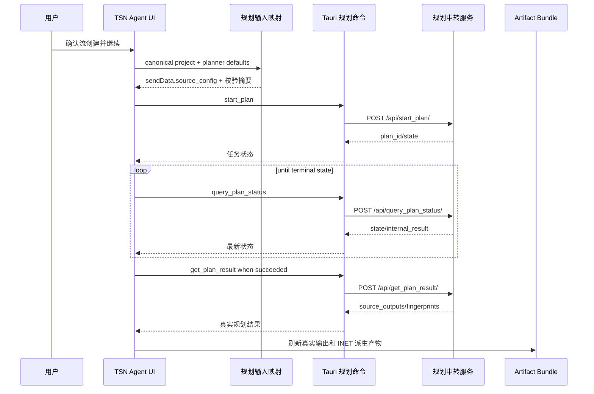
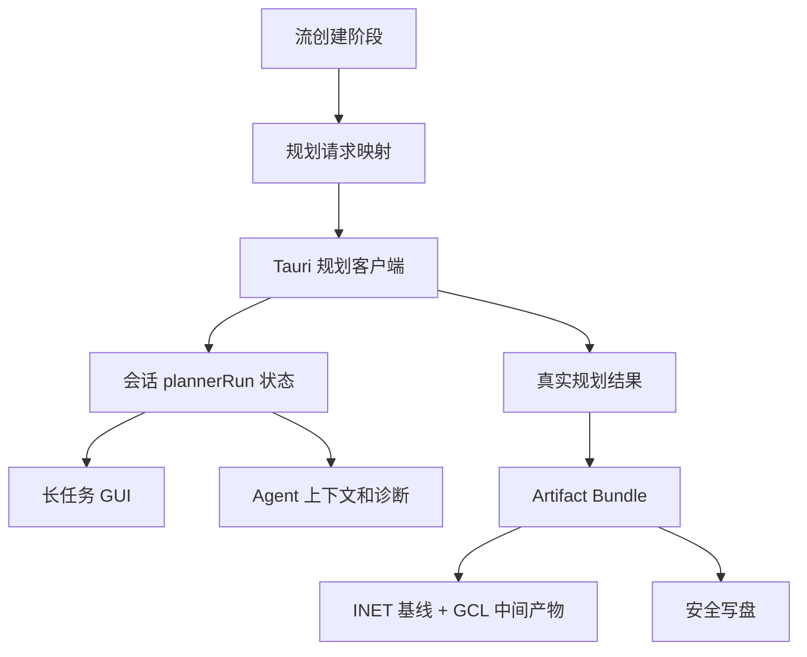

# feat: 对接 TSN 规划中转服务

## Summary

实现一条完整的真实规划闭环：继续用现有阶段流创建 canonical flows，在 `planning-export` 阶段把拓扑、流和规划参数提交给规划中转服务，持久化任务状态，轮询并展示长任务进展，成功后保留真实规划输出，并基于当前可被 INET 使用的 `omnetpp.ini`、`traffic.ini`、`network.ned` 输出形态追加可追溯的规划结果派生产物。

---

## Problem Frame

MVP 目前只生成 `planner/flow_plan_1.json`，没有执行真实规划，也不能展示 `solution_json`、门控表或任务生命周期。规划中转服务是异步任务接口，用户需要在 GUI 中看见任务启动、等待、失败、停止和结果读取，而不是把外部规划隐藏在静态导出文件之后。

---

## Requirements

- R1. 保持稳定阶段 ID：`topology`、`time-sync`、`flow-template`、`planning-export`。
- R2. `flow-template` 只负责从自然语言生成和确认流，未确认前不能提交真实规划。
- R3. `planning-export` 负责真实规划执行、等待、结果读取和仿真输入刷新。
- R4. 规划请求必须生成 `sendData.mode=time-trigger` 和 `source_config` 下的节点、流、路径、链路输入。
- R5. 当前 canonical 缺失的规划必填字段必须有默认来源，并在 GUI 或 artifact 中可解释。
- R6. 提交前必须校验节点、流、链路 ID 唯一性和引用完整性。
- R7. Base URL 第一版必须是配置项，默认 `http://100.78.48.43:18080`。
- R8. 任务生命周期必须覆盖 `running`、`busy`、`succeeded`、`failed`、`cancelled`、`not_found` 等状态。
- R9. 用户必须能看到 `plan_id`、运行时长、最近状态、错误摘要和停止入口。
- R10. 停止任务必须明确提示“停止当前运行任务”的接口语义。
- R11. 只有 `succeeded` 后才能读取并保存真实规划结果。
- R12. 成功结果必须保留 `solution_json`、`tsnlight_plan_cfg_json` 和 `output_fingerprints`，并标记为真实外部观测输出。
- R13. 门控调度摘要必须展示链路、区间、门控状态和承载流 ID。
- R14. INET 基线输出必须继续沿用当前可用的 `omnetpp.ini`、`traffic.ini`、`network.ned` 形态。
- R15. 当存在真实规划结果时，必须导出可追溯的 GCL/TAS 中间产物或转换说明，不能伪造完整可运行 TAS 配置。
- R16. 会话必须持久化当前规划任务状态和结果摘要，应用重启后能恢复查看。
- R17. 执行步骤和诊断日志必须记录规划任务事件，诊断只保存脱敏摘要。

**Origin actors:** A1 TSN 新手用户, A2 Agent, A3 TSN Agent 应用, A4 规划中转服务, A5 INET 仿真消费者
**Origin flows:** F1 创建或修改流, F2 启动真实规划任务, F3 等待、轮询和停止, F4 读取结果并回写项目产物
**Origin acceptance examples:** AE1 流创建不自动提交, AE2 提交前输入映射和校验, AE3 长任务等待, AE4 busy 处理, AE5 成功后真实输出, AE6 INET 可追溯派生产物, AE7 停止语义和诊断摘要

---

## Scope Boundaries

- 第一版仅覆盖 API 文档承诺的 `time-trigger`/ST 规划闭环。
- 不实现服务端排队、多用户归属校验或任务所有权隔离。
- 不解释硬件寄存器配置业务含义，只保留和展示源码快照。
- 不声称完成完整 TSN 行为仿真；INET 输出目标是保持当前 UDP traffic 基线可用，并追加规划结果追溯产物。
- 不把场景逻辑写死为箭载/舰载；默认值走通用 planner defaults 或场景配置扩展点。
- 不在第一版做完整设置页；Base URL 先作为配置项默认测试地址，后续再开放 GUI 修改。

### Deferred to Follow-Up Work

- 完整 INET TAS/GCL 可运行配置：需要确认目标 INET 版本的 gate schedule 参数格式后单独接入。
- 认证、TLS 和多环境配置 UI：生产化前单独补安全和设置体验。
- 多任务队列和任务归属隔离：需要服务端能力配合，不在本次客户端对接中实现。

---

## Context & Research

### Relevant Code and Patterns

- `src/domain/canonical.ts` 已有节点、链路、流、端点、周期、帧长、PCP、路径、IP/MAC、UDP port 和链路速率，是规划输入映射的主要来源。
- `src/export/planner-exporter.ts` 当前输出旧 MVP `stream_info` 形态，需要新增中转服务 `sendData.source_config` 形态，不能把旧文件误认为真实规划请求。
- `src/export/artifact-bundle.ts` 当前集中生成 NED、`omnetpp.ini`、`traffic.ini`、React Flow、planner input 和 manifest，适合扩展真实规划结果 artifact。
- `src/export/inet-traffic-exporter.ts`、`src/export/ini-exporter.ts`、`src/export/ned-exporter.ts` 已经生成当前可被 INET 使用的三类文件。
- 用户提供的本地 INET 样例确认当前可用输出形态是 `omnetpp.ini` include `traffic.ini`，`traffic.ini` 使用 `UdpSourceApp`/`UdpSinkApp`，`network.ned` 使用 `TsnDevice`、`TsnSwitch` 和 `EthernetLink`。
- `src/project/project-state.ts` 已有阶段状态、确认和 action 概念，可以扩展规划任务状态而不改稳定阶段 ID。
- `src/sessions/session-repository.ts` 把 session payload 整包 JSON 持久化到 localStorage/SQLite，规划任务状态可先进入 session payload，不需要新增 SQLite 表。
- `src/app/App.tsx` 已有 Agent 长任务等待条、流列表、节点/链路详情、artifact 分组和执行步骤面板，适合增加规划任务专用状态面板。
- `src-tauri/src/project_writer.rs` 已校验 `planner-output` 必须是 observed external output，适合沿用真实结果写盘边界。

### Institutional Learnings

- 当前仓库没有 `docs/solutions/`。
- AGENTS.md 明确约束：`flow_plan_1.json` 是规划器输入，不得伪造 `flow_plan_result_1.json`、GCL 或 interface 摘要；只有 `planning-export` 阶段生成 bundle 后才允许刷新/保存仿真输入。

### External References

- 本计划不依赖外部文档检索；接口契约以 `docs/prototypes/TSN 规划中转服务 API 对接文档_20260522.html` 为准。

---

## Key Technical Decisions

- **真实 HTTP 调用走 Tauri command。** 默认规划服务地址不是 localhost，而当前 Tauri CSP 只允许有限连接；Rust command 能避开浏览器 CSP，同时让诊断和错误边界更集中。
- **Web/E2E 使用可注入 TypeScript 客户端模拟。** 浏览器模式没有 Tauri command，测试应通过 deterministic mock 覆盖状态生命周期，不阻塞本地 UI 验证。
- **规划输入新增中转服务形态，不替换旧语义名称。** `flow_plan_1.json` 继续是输入 artifact，但内容迁移为新 `sendData.source_config` 结构；真实输出另写 `planner/flow_plan_result_1.json`。
- **规划任务状态挂在 session payload。** 当前 session 已整包持久化，先不改 SQLite schema，降低迁移风险。
- **默认规划参数放在 planner defaults 层。** 节点 policing、`qbv_or_qch`、`qci_enable`、`st_queues`、`macrotick`、`delay_para` 属于规划器契约默认值，不应污染 canonical core；后续可由 `ScenarioConfig` 覆盖。
- **INET 输出保持现有可运行基线。** `omnetpp.ini`、`traffic.ini`、`network.ned` 不因规划结果而破坏；GCL/TAS 第一版以中间产物和转换说明追加，等待 INET gate schedule 格式确认后再转为运行配置。
- **停止任务是用户显式动作。** 因接口不做归属校验，不能在 busy 或切换会话时自动停止远端任务。

---

## Open Questions

### Resolved During Planning

- Base URL 第一版策略：作为配置项提供，默认 `http://100.78.48.43:18080`。
- 节点级默认参数位置：第一版放在 planner defaults 层，保留后续场景覆盖扩展点。
- INET 消费规划结果方式：先保持当前 UDP traffic 基线，新增可追溯 GCL/TAS 中间产物；不立即声称生成完整可运行 TAS 配置。
- 长任务状态持久化方式：放入 session payload，沿用现有 localStorage/SQLite payload 存储。

### Deferred to Implementation

- Rust HTTP 客户端最终依赖选择：实现时在最小依赖和 Tauri runtime 可用性之间确认。
- 规划轮询间隔和超时提示阈值：实现时根据 UI 体验与测试可控性设置，不写死在需求层。
- GCL/TAS 中间产物文件名和细节字段：实现时保持来源可追溯即可，避免承诺未验证的 INET 运行语义。

---

## Output Structure

    planner/
      flow_plan_1.json
      flow_plan_result_1.json          # 真实规划成功后生成，observed external
      planner_request_1.json           # 可选，提交给中转服务的请求快照
    simulation/
      inet/
        omnetpp.ini
        traffic.ini
        planner-gcl.json               # 可追溯 GCL/TAS 中间产物
        planner-gcl-notes.md           # 转换说明和单位待确认说明
        tsnagent/
          generated/
            network.ned
    workspace/
      react-flow-topology.json
    manifest.json

---

## High-Level Technical Design

> *This illustrates the intended approach and is directional guidance for review, not implementation specification. The implementing agent should treat it as context, not code to reproduce.*

---

## Implementation Units

### U1. 建立规划器契约类型和默认参数

**Goal:** 定义中转服务请求、响应、任务状态、规划结果和默认参数类型，让后续映射、客户端、session 和 UI 使用同一套契约。

**Requirements:** R4, R5, R6, R7, R8, R11, R12, R17

**Dependencies:** None

**Files:**
- Create: `src/planner/planner-contract.ts`
- Create: `src/planner/planner-defaults.ts`
- Test: `src/planner/planner-contract.test.ts`

**Approach:**
- 定义 `PlannerTaskState`、通用响应包装、start/query/result/stop 响应、`PlannerRunState` 和 `PlannerResultSnapshot`。
- 提供默认 Base URL 常量，优先从构建时配置读取，缺省为测试环境地址。
- 提供 planner defaults：节点参数、链路参数、路径参数默认值，并明确单位待确认字段保持源码值。
- 提供轻量 normalization，确保旧 session 没有 planner 状态时能安全打开。

**Patterns to follow:**
- `src/project/project-state.ts` 的 workflow 类型和 normalize 模式。
- `src/domain/scenario-config.ts` 的默认配置常量模式。

**Test scenarios:**
- Happy path: 默认 Base URL 未配置时返回测试环境地址。
- Happy path: 默认节点、链路、路径参数包含 API 必填字段。
- Edge case: 旧 session 没有 planner 状态时 normalization 返回 idle 状态。
- Error path: 未知任务 state 被保留为 failed/unknown 可诊断状态，而不是抛出导致 session 无法打开。

**Verification:**
- 后续模块可以只依赖 `src/planner/planner-contract.ts` 类型，不重复声明 API 字段。

### U2. 生成中转服务规划请求并替换旧 planner input 形态

**Goal:** 从 canonical project 生成 `sendData.source_config` 请求体，覆盖节点、流、路径、链路输入和提交前校验。

**Requirements:** R4, R5, R6, R14

**Dependencies:** U1

**Files:**
- Modify: `src/export/planner-exporter.ts`
- Test: `src/export/exporters.test.ts`
- Test: `src/domain/topology-factory.test.ts`

**Approach:**
- 将 `exportPlannerInput(project)` 迁移为中转服务输入结构，保持 artifact 名 `planner/flow_plan_1.json`。
- 节点映射使用 canonical `numericId`、节点类型、端口数和 planner defaults。
- 流映射使用 canonical `numericId`、端点 numericId、周期、帧长、路径数量和候选路径。
- 路径映射使用 route link numericId、延时/抖动、IP/MAC/UDP port、协议号和默认的冗余/flag/delay/mask。
- 链路映射使用 canonical link numericId、端点 numericId、端口 index、速率和 defaults。
- 校验重复 ID、缺失端点、缺失链路、空流、空路径，并返回用户可理解错误。

**Execution note:** Add characterization coverage for current planner input expectations before changing exporter shape, then update tests to the new API contract.

**Patterns to follow:**
- `src/export/planner-exporter.ts` 现有 route/node numeric ID 派生。
- `src/domain/validation.ts` 的 canonical 引用校验风格。

**Test scenarios:**
- Covers AE2. Happy path: 两交换机项目加控制流后导出 `sendData.mode=time-trigger` 和三类 `source_config` 数组。
- Happy path: `flow_feature[].path[].route` 中每个 ID 都存在于 `topo_feature[].link_id`。
- Happy path: node `node_type` 对交换机和端系统分别映射为接口要求的值。
- Edge case: `dst_node` 和 `src_node` 使用数字 ID 而不是 string node id。
- Error path: flow 引用不存在链路时抛出包含 flow id 和 link id 的错误。
- Error path: project 没有 flow 时阻止提交规划请求。

**Verification:**
- `planner/flow_plan_1.json` 内容与 API 文档请求示例同形，且不再是旧 `stream_info` 根结构。

### U3. 增加真实规划服务客户端和 Tauri command

**Goal:** 在 Tauri 侧实现 start/query/result/stop HTTP 调用，并在 Web/E2E 中保留可 mock 的 TypeScript 客户端边界。

**Requirements:** R7, R8, R10, R11, R12, R17

**Dependencies:** U1, U2

**Files:**
- Create: `src/planner/planner-client.ts`
- Create: `src-tauri/src/planner_client.rs`
- Modify: `src-tauri/src/lib.rs`
- Modify: `src-tauri/Cargo.toml`
- Test: `src/planner/planner-client.test.ts`
- Test: `src-tauri/src/planner_client.rs`

**Approach:**
- TypeScript client 暴露 `startPlan`、`queryPlanStatus`、`getPlanResult`、`stopPlan`，Tauri 环境调用 invoke，非 Tauri 环境允许注入 mock 或返回明确不可用错误。
- Rust command 接收 Base URL 和请求体，拼接接口路径，设置合理超时，解析 JSON 响应并原样返回结构化值。
- HTTP 业务响应统一以 `err_code` 和 `data.state` 判断，HTTP 非 200 或 JSON 解析失败转成可诊断错误。
- 不保存凭证，不加入认证头；Base URL trim 并拒绝空值。

**Patterns to follow:**
- `src/project/project-exporter.ts` 的 Tauri/browser 边界。
- `src-tauri/src/project_writer.rs` 的 command 请求/响应结构和错误字符串风格。
- `src/agent/agent-adapter.ts` 的 fallback 和诊断边界。

**Test scenarios:**
- Happy path: Tauri client start/query/result/stop 分别调用正确 command 名和 payload。
- Happy path: Rust URL 拼接对有无 trailing slash 的 Base URL 都生成正确路径。
- Error path: 空 Base URL 返回用户可理解错误。
- Error path: HTTP 非成功、无效 JSON、缺失 `data` 时返回错误摘要。
- Error path: `getPlanResult` 在非 succeeded state 时不被客户端包装成成功结果。

**Verification:**
- Tauri command 可独立 cargo test；前端单测可不依赖真实网络完成。

### U4. 持久化规划任务状态并接入阶段工作流

**Goal:** 将规划任务状态和结果摘要挂入 session/workflow，保证应用重启、会话切换和阶段确认都不丢失真实规划进展。

**Requirements:** R1, R2, R3, R8, R16, R17

**Dependencies:** U1, U3

**Files:**
- Modify: `src/sessions/session-repository.ts`
- Modify: `src/project/project-state.ts`
- Modify: `src/agent/fake-agent.ts`
- Test: `src/project/project-state.test.ts`
- Test: `src/sessions/session-repository.test.ts`
- Test: `src/agent/fake-agent.test.ts`

**Approach:**
- 在 `TsnSession` 增加可选 `plannerRun`，保存 Base URL、request summary、`plan_id`、state、timestamps、duration、internal result、error summary 和 result snapshot summary。
- normalization 为旧 session 补 idle/no-task 状态。
- `planning-export` 阶段进入 current 后不再只刷新静态 bundle；在 fake 模式中仍可使用确定性模拟状态，真实模式由 UI 触发客户端。
- 最终阶段确认仍只确认当前草案完成，不再次触发规划提交，避免确认循环。

**Patterns to follow:**
- `normalizeWorkflowState()` 对旧 payload 的兼容。
- `runFakeTsnAgent()` 的 deterministic staged workflow。
- `redactSessionForStorage()` 的脱敏保存。

**Test scenarios:**
- Covers AE1. Flow stage waiting_confirmation 时 session 没有 plannerRun submitted 状态。
- Covers AE3. plannerRun running 状态保存后，重新读取 session 仍有 plan id 和 state。
- Happy path: final planning stage confirmed 后不重新提交规划任务。
- Edge case: 旧 localStorage payload 没有 plannerRun 时正常打开。
- Error path: 保存 session 时 planner error message 被脱敏。

**Verification:**
- 会话复制、切换、删除不破坏 plannerRun 数据边界；旧 session 仍能打开。

### U5. 实现规划任务控制器和长任务 GUI

**Goal:** 在 App 中提供启动、轮询、停止、读取结果和状态展示，让用户能有效等待真实规划任务。

**Requirements:** R2, R3, R8, R9, R10, R11, R13, R16, R17

**Dependencies:** U3, U4

**Files:**
- Modify: `src/app/App.tsx`
- Modify: `src/app/App.css`
- Test: `src/app/App.test.tsx`

**Approach:**
- 在 `planning-export` current 状态显示规划任务面板：服务地址、提交按钮、状态、运行时长、最近更新时间、错误摘要、停止按钮。
- 启动时先生成并校验 planner request，再调用 start；running 时保存 `plan_id` 并开始轮询。
- 轮询直到 terminal state；succeeded 后自动读取 result 并刷新 session/bundle；failed/cancelled/not_found 停止轮询并展示摘要。
- busy 时展示 running plan id、运行时长和建议，不创建本地成功任务。
- stop 按钮只在用户显式点击时调用，并提示停止语义；返回状态记录到执行步骤。
- 规划任务等待条与 Agent 等待条区分：Agent 可以已完成，但规划任务仍 running。

**Patterns to follow:**
- `AgentRunStatusBar` 的长任务状态表达。
- artifact tab 的刷新/保存按钮门禁。
- `logDiagnostic()`、`artifactBundleSummary()` 的诊断摘要。

**Test scenarios:**
- Covers AE3. start 返回 running 后，GUI 显示 plan id、运行时长和等待状态，并持续允许查看拓扑/流列表。
- Covers AE4. start 返回 busy 后，不生成 planner output，显示当前 running plan 和处理入口。
- Covers AE7. 点击停止后调用 stop，展示取消/无运行任务/失败状态，并记录执行步骤。
- Error path: start 请求失败时，GUI 显示错误，session 保持可重试状态。
- Edge case: 轮询期间切换 session，不把旧任务结果写入当前会话。
- Edge case: component unmount 或 session 删除时停止本地轮询，不调用远端 stop。

**Verification:**
- 用户能在没有 Agent streaming 的情况下看到规划任务仍在运行；任务终态与 artifact 刷新一致。

### U6. 保留真实规划结果并生成 artifact

**Goal:** 成功读取规划结果后，将源码输出快照、指纹、门控摘要和请求快照纳入 artifact bundle，标记真实外部观测结果。

**Requirements:** R11, R12, R13, R15, R17

**Dependencies:** U1, U3, U4

**Files:**
- Modify: `src/export/artifact-bundle.ts`
- Modify: `src/export/artifact-classification.ts`
- Modify: `src/project/export-manifest.ts`
- Modify: `src-tauri/src/project_writer.rs`
- Test: `src/export/exporters.test.ts`
- Test: `src/project/project-exporter.test.ts`
- Test: `src-tauri/src/project_writer.rs`

**Approach:**
- `createArtifactBundle` 接收可选 planner result/context，用于追加 `planner/flow_plan_result_1.json`、`planner/planner_request_1.json`、规划摘要 artifact。
- `flow_plan_result_1.json` 只在真实 result snapshot 存在时生成，purpose 为 `planner-output`，`observedExternal=true`。
- 保留 `solution_json`、`tsnlight_plan_cfg_json`、`output_fingerprints` 原始结构，不改造成自定义结果。
- artifact classification 将真实输出显示为“外部观测输出”，请求快照显示为“规划器输入/请求快照”。
- manifest/Rust writer 继续拒绝未标记 observedExternal 的 planner output。

**Patterns to follow:**
- `src-tauri/src/project_writer.rs` 的 observed planner output 校验。
- `src/project/export-manifest.ts` 的 `withObservedPlannerResult()` 约束。
- `src/export/artifact-classification.ts` 的分组和 roleLabel 派生。

**Test scenarios:**
- Covers AE5. 有 succeeded result 时 bundle 包含 observed `planner/flow_plan_result_1.json` 和指纹内容。
- Covers AE5. 没有 succeeded result 时 bundle 不包含 planner output。
- Happy path: manifest files 包含 observedExternal true，Rust writer 校验通过。
- Error path: planner-output artifact 未标记 observedExternal 时写盘失败。
- Edge case: solution_json 为 object 或 array 时都原样保留。

**Verification:**
- 应用不再需要任何伪造结果；artifact 列表能区分输入、请求快照和真实输出。

### U7. 生成规划结果到 INET 的可追溯中间产物

**Goal:** 在不破坏当前 INET UDP 基线的前提下，把 GCL/TAS 结果转换成可追溯 artifact，作为后续可运行 gate schedule 的输入基础。

**Requirements:** R14, R15

**Dependencies:** U6

**Files:**
- Create: `src/export/inet-gcl-exporter.ts`
- Modify: `src/export/artifact-bundle.ts`
- Test: `src/export/exporters.test.ts`
- Modify: `docs/staged-agent-workflow.md`

**Approach:**
- 当前 `omnetpp.ini`、`traffic.ini`、`network.ned` 输出保持与本地 INET 样例同形。
- 新增 `simulation/inet/planner-gcl.json`，内容按链路 ID 归档 GCL entries，并附带对应 canonical link、flow、state、interval、plan id 和 source artifact 信息。
- 新增 `simulation/inet/planner-gcl-notes.md`，说明单位待确认、当前没有接入可运行 TAS gate schedule、如何追溯到 `flow_plan_result_1.json`。
- 不把 `gcl_entries[].interval` 隐式换算为秒或 tick；保留源码值。
- 如果某条 GCL 引用未知 link 或 stream，保留原始 ID 并在 notes 中列出 unresolved 引用。

**Patterns to follow:**
- `src/export/inet-traffic-exporter.ts` 的 deterministic 排序和错误信息风格。
- 用户提供的当前 INET 基线输出：`omnetpp.ini` include `traffic.ini`，traffic 只负责 UDP source/sink。

**Test scenarios:**
- Covers AE6. succeeded result 包含 link 0 的 GCL entries 时，`planner-gcl.json` 能追溯 link、stream、state、interval 和 plan id。
- Covers AE6. `planner-gcl-notes.md` 标明单位待确认并指向真实规划输出。
- Happy path: 没有 planner result 时不生成 GCL 中间产物。
- Edge case: GCL 引用未知 stream id 时保留 unresolved 条目，不抛弃原始结果。
- Error path: malformed `solution_json` 不破坏 UDP traffic/NED/omnetpp 基线，而是在 notes 或诊断中记录无法转换。

**Verification:**
- INET 基线三件套与当前样例保持一致；新增规划结果产物只在真实结果存在时出现。

### U8. 扩展 GUI 展示规划输入、任务和结果摘要

**Goal:** 让用户在流、拓扑、artifact 和执行步骤中看到规划所需参数、任务进度和结果摘要。

**Requirements:** R5, R9, R13, R16, R17

**Dependencies:** U2, U5, U6, U7

**Files:**
- Modify: `src/app/App.tsx`
- Modify: `src/app/App.css`
- Test: `src/app/App.test.tsx`

**Approach:**
- 流列表增加规划相关字段展示：端点、period、frame size、latency、jitter、PCP、UDP port、redundant/default marker。
- 节点/链路详情增加数字 ID、端口 index、规划默认参数摘要、ST queue 和 macrotick。
- artifact 面板展示 `planner/flow_plan_1.json` 是请求输入，`planner/flow_plan_result_1.json` 是真实外部输出，GCL 中间产物是 INET 追溯数据。
- 执行步骤新增规划任务事件类型的文案：启动、轮询、busy、停止、读取结果、刷新 artifact。
- 结果摘要展示 link id、GCL entry 数、涉及 flow id，不解释寄存器业务含义。

**Patterns to follow:**
- 现有 flow route 高亮和 node/link detail 面板。
- 现有 artifact grouping 和 `observedExternal` 标签。
- 面向用户文案避免供应商敏感词。

**Test scenarios:**
- Covers AE1. 流创建阶段显示周期、帧长、端点、路径、PCP、时延/抖动，且没有规划任务。
- Covers AE3. 规划 running 时 topology canvas 和 flow table 仍可查看。
- Covers AE5. succeeded 后 artifact tab 显示真实 planner output 和 GCL 中间产物。
- Covers AE6. GCL 摘要显示链路、区间、状态和 stream id。
- Edge case: 没有规划结果时不显示空的 GCL 表格或伪造完成状态。

**Verification:**
- GUI 明确区分流创建、规划执行、结果输出和 INET 基线文件。

### U9. 更新 Agent/fake agent 和诊断事件

**Goal:** 让 fake/E2E 和真实 Agent 路径都能表达规划阶段的新语义，不提前宣称后续阶段已完成。

**Requirements:** R1, R2, R3, R8, R16, R17

**Dependencies:** U4, U5, U6

**Files:**
- Modify: `src/agent/fake-agent.ts`
- Modify: `src/agent/fake-agent.test.ts`
- Modify: `src/agent/agent-adapter.ts`
- Test: `src/agent/fake-agent.test.ts`

**Approach:**
- fake agent 在 `planning-export` 阶段输出“准备提交规划/仿真输入”语义，不再只说静态导出清单。
- 快速路径可以生成 deterministic artifact，但必须保持文本区分 `flow_plan_1.json` 是输入，真实结果只来自 planner result。
- `buildConversationContext` 增加 plannerRun 摘要，提示真实 Agent 不要宣称未完成的规划结果。
- 诊断日志记录规划任务的脱敏摘要：plan id、state、duration、err_code、artifact paths、fingerprints hash，不记录完整原始大 JSON。

**Patterns to follow:**
- `agent-adapter.ts` 的阶段边界提示。
- `app-diagnostics.ts` 的 artifactBundleSummary。
- `fake-agent.test.ts` 的 staged workflow 测试。

**Test scenarios:**
- Happy path: fake planning stage 文案不声称已有 GCL，除非注入真实/模拟 result。
- Happy path: conversation context 包含 plannerRun state 和 plan id 摘要。
- Error path: Agent fallback 不覆盖已有 plannerRun/result。
- Edge case: quick generate 仍能完成四阶段，但 planner output 不伪造。

**Verification:**
- 真实 Agent 和 fake Agent 都遵守“输入不是输出”的导出边界。

### U10. 端到端验证和文档更新

**Goal:** 用单元、UI、Rust 和 E2E 覆盖完整规划闭环，并更新用户/开发文档说明真实规划器边界。

**Requirements:** R1-R17

**Dependencies:** U1-U9

**Files:**
- Modify: `docs/staged-agent-workflow.md`
- Modify: `docs/testing.md`
- Modify: `docs/diagnostics-log-contract.md`
- Test: `src/app/App.test.tsx`
- Test: `src/export/exporters.test.ts`
- Test: `src/project/project-state.test.ts`
- Test: `src-tauri/src/planner_client.rs`

**Approach:**
- 文档更新阶段语义：`flow-template` 是流创建，`planning-export` 是真实规划执行与仿真输入准备。
- 测试文档说明 planner client 默认测试地址、mock 策略和真实服务 smoke 入口。
- 诊断日志契约补充规划任务可记录字段和禁止保存字段。
- 补充 E2E 或 App test 覆盖一条 running -> succeeded -> result -> artifact 刷新的用户路径。

**Patterns to follow:**
- `docs/staged-agent-workflow.md` 现有阶段文档。
- `docs/diagnostics-log-contract.md` 的脱敏字段约束。
- `src/app/App.test.tsx` 的用户路径测试风格。

**Test scenarios:**
- Integration: 用户完成拓扑、时间同步、流创建后，启动 mock 规划任务，轮询到 succeeded，artifact tab 出现真实 planner output 和 GCL 中间产物。
- Integration: busy 响应路径不会刷新 planner output。
- Integration: stop 响应路径进入 cancelled/no_running_plan 状态并保留诊断摘要。
- Regression: `npm run build`、`npm test`、`npm run e2e`、`npm run cargo:test` 覆盖不回归。

**Verification:**
- 计划范围内的 workflow、export、session、UI、Tauri 命令和文档都有对应测试或验证说明。

---

## System-Wide Impact

- **Interaction graph:** flow stage、planning-export stage、session repository、artifact bundle、Tauri command、App UI、diagnostics 都会参与规划任务状态。
- **Error propagation:** API 业务错误、HTTP 错误、JSON 解析错误和校验错误都应回到 plannerRun error summary，并进入诊断摘要。
- **State lifecycle risks:** 轮询期间会话切换、删除、应用关闭可能导致 stale result 写入错误会话；实现需用 session id / plan id guard。
- **API surface parity:** browser 模式、Tauri 模式、fake agent、真实 Agent 都必须遵守同一阶段语义。
- **Integration coverage:** 单元测试不足以证明 UI 生命周期，至少需要 App test 覆盖 start -> poll -> result -> artifact。
- **Unchanged invariants:** 稳定阶段 ID 不变；`flow_plan_1.json` 仍是输入；没有真实 result 时不生成 `flow_plan_result_1.json` 或 GCL artifact。

---

## Risks & Dependencies

| Risk | Mitigation |
|------|------------|
| 规划服务长时间运行导致 UI 看似卡住 | 独立 plannerRun 状态和运行时长，不依赖 Agent streaming 状态 |
| stop 接口停止非当前会话任务 | 停止只能由用户显式触发，并在 UI 文案中提示接口语义 |
| 新请求结构与 API 细节不完全一致 | 按 API 文档字段写单元测试，并保留请求快照 artifact 便于排查 |
| INET TAS/GCL 格式未确认导致错误仿真语义 | 第一版只追加可追溯中间产物，不宣称完整可运行 gate schedule |
| 会话切换时旧轮询写入当前会话 | 每次异步更新校验 session id 和 plan id |
| Rust HTTP 依赖增加 CI 构建风险 | 选择 Tauri/Rust 生态常用 HTTP 客户端，加入 cargo test 和 CI 验证 |

---

## Documentation / Operational Notes

- `docs/staged-agent-workflow.md` 需要明确“流量规划”里的流创建与真实规划执行边界。
- `docs/testing.md` 需要说明真实规划服务 smoke 与 mock 测试的区别。
- `docs/diagnostics-log-contract.md` 需要补充 plannerRun 可记录字段和脱敏限制。
- 发布前需要在真实测试地址跑一次手动 smoke：start -> query -> get result；若服务不可达，记录为环境不可用而不是代码测试失败。

---

## Sources & References

- **Origin document:** [docs/brainstorms/2026-05-22-tsn-planner-service-integration-requirements.md](../brainstorms/2026-05-22-tsn-planner-service-integration-requirements.md)
- API contract: [docs/prototypes/TSN 规划中转服务 API 对接文档_20260522.html](../prototypes/TSN%20规划中转服务%20API%20对接文档_20260522.html)
- Current workflow docs: [docs/staged-agent-workflow.md](../staged-agent-workflow.md)
- Canonical model: `src/domain/canonical.ts`
- Planner exporter: `src/export/planner-exporter.ts`
- INET exporters: `src/export/ini-exporter.ts`, `src/export/inet-traffic-exporter.ts`, `src/export/ned-exporter.ts`
- Artifact bundle and manifest: `src/export/artifact-bundle.ts`, `src/project/export-manifest.ts`, `src-tauri/src/project_writer.rs`
- Session persistence: `src/sessions/session-repository.ts`, `src-tauri/src/session_store.rs`
- Main UI: `src/app/App.tsx`
