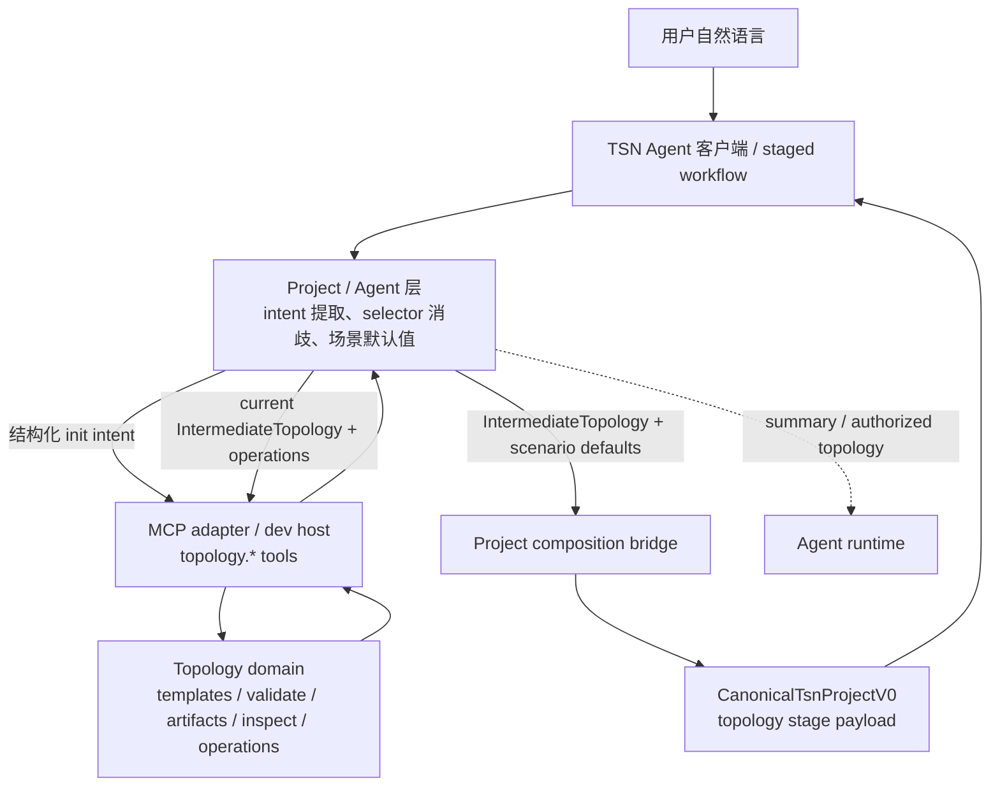
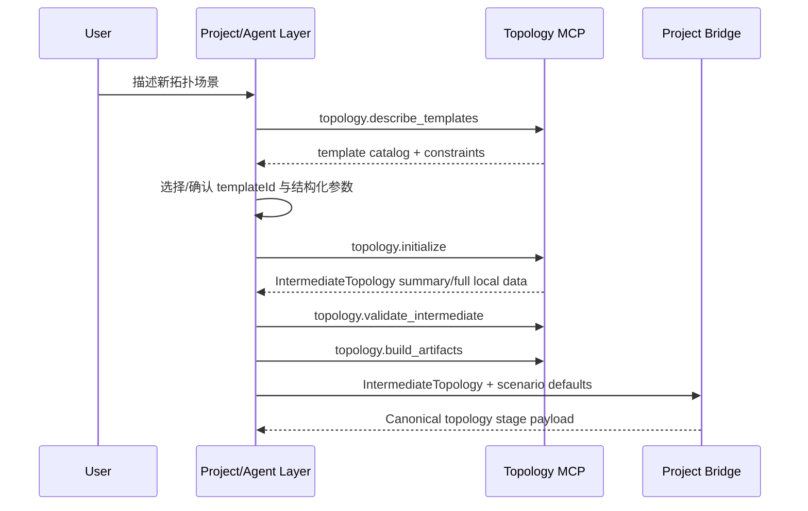
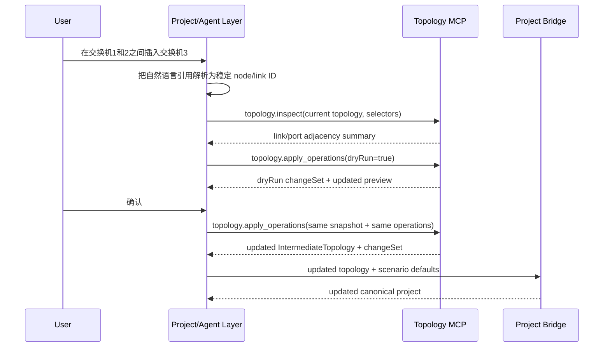

# feat: 增加确定性拓扑 MCP 服务

## 摘要

把拓扑初始化、校验、artifact 构建、只读查询和结构化节点/链路 operations 收敛到一个确定性的 topology domain，并通过 MCP adapter/dev host 暴露给 Agent 运行时。P0 不做自然语言理解、不调用大模型、不生成完整 TSN project、不导出 HTML；project composition、场景默认值、flow/time-sync/simulation 仍留在应用层。

该计划覆盖 P0 可落地路径：先建立版本化 `IntermediateTopology` 契约和确定性工具实现，再桥接现有 staged workflow；生产级 Tauri sidecar、Node-free、多 MCP server 进程治理和完整拓扑编辑 UI 作为后续决策门推进。

---

## 问题框架

当前拓扑能力分散在 `tsn-topology/` 参考 skill、`.claude/skills/tsn-topology`、`src-node/stage-skills/tsn-stage-runner.ts` 和 `src/domain/topology-factory.ts` 中。几个位置都带有 builder、validator、默认模板、端口分配或 artifact 规则，导致同一个拓扑问题很难判断是 Agent 语义解析、拓扑领域规则、project composition，还是导出层出错。

MCP 服务化的目标不是让拓扑阶段更“智能”，而是把固定规则变成可复用、可快照测试、可被客户端和 Agent 共同调用的稳定服务边界。这样从 0 初始化拓扑、对已有拓扑插入交换机、构建 legacy JSON artifact、验证端口冲突等行为都能用确定 fixture 复现，不依赖 prompt、模型、临时目录写盘或工具权限。

---

## 需求

**领域边界**

- R1. Topology MCP P0 只提供 `topology.*` 能力；不得包含 project、workflow、export、time sync、flow planning、simulation 或 `generate_project`。
- R2. P0 工具只接受结构化输入：`IntermediateTopology`、`TopologyInitIntent`、artifact JSON 或结构化 topology operations；不得直接接受自然语言 prompt。
- R3. P0 工具不得调用大模型、Agent SDK、外部语义解析服务或网络服务。
- R4. `IntermediateTopology` 是 topology domain 的权威事实契约，必须版本化、可快照、可 round-trip；P0 不要求 `topologyId`、`revision` 或服务端持久状态句柄。
- R5. `topology.render_mac_table_html` 和 MAC 表 HTML artifact 不进入 MCP，也不再由拓扑迁移路径生成。

**工具行为**

- R6. P0 必须提供 `topology.describe_templates`、`topology.initialize`、`topology.inspect`、`topology.describe_artifacts`、`topology.validate_intermediate`、`topology.build_artifacts`、`topology.validate_artifacts`。
- R7. `topology.apply_operations` P0 覆盖插入交换机 tracer subset：`link.delete`、`node.add`、`link.add`、`dryRun`、原子校验、确定性 changeSet；完整 node/link CRUD 延后到 P1。
- R8. 初始化路径和编辑路径必须分离：无当前拓扑时走模板发现和 `topology.initialize`；已有拓扑时才走 `topology.inspect` 与结构化 operations。
- R9. 所有工具必须返回结构化成功结果或结构化错误 envelope，错误至少包含 code、message、path、severity、details、retryable、requiresUserClarification。
- R10. 工具响应必须有 summary/full 数据边界：Agent-facing 默认 summary；完整拓扑、端口表、MAC 表、full artifact 和 full changeSet 只在本地 project/client 层或显式 full 模式使用。

**确定性和安全边界**

- R11. 相同输入必须得到相同输出；MCP 响应不得包含随机 ID、当前时间、进程 ID、绝对路径或耗时等会破坏快照的字段。
- R12. `apply_operations` 必须先完整校验再原子应用；失败时不得返回半应用后的拓扑。
- R13. 新增节点、链路、端口和布局必须由调用方显式提供，或由明确的确定性 allocation/layout strategy 推导。
- R14. P0 必须定义资源上限，覆盖节点数、链路数、端口数、operation 数、artifact 大小、JSON 深度和执行超时；超限返回结构化 `LIMIT_EXCEEDED`。
- R15. 诊断日志只能记录 allowlist 摘要，不能记录完整 prompt、端口映射、MAC 表、完整 artifact、完整 changeSet 或敏感工程数据。

**集成边界**

- R16. `src/domain/topology-factory.ts` 迁移后只保留自然语言意图解析、场景默认值读取和 canonical project composition 映射，不再承载 builder、validator、template 或 edit 规则。
- R17. `.claude/skills/tsn-topology` 保留为迁移期薄指引或 shim，只说明何时调用 MCP、如何传递结构化 intent/selector、如何整理阶段摘要；不得继续维护独立拓扑规则。
- R18. Project/Agent 层负责自然语言 selector resolution、歧义澄清、`topologyId` 管理、dryRun snapshot 保存和确认重放；Topology MCP 保持无状态。
- R19. Project composition bridge 必须在 MCP 之外，把 `IntermediateTopology` 和场景默认值合成 `CanonicalTsnProjectV0` 或 topology stage payload。
- R20. Agent runtime 必须能通过固定 MCP server name/tool name 发现并调用 topology 工具；客户端若直接调用，也必须经过同一 domain 契约或薄包装层，不能复制 builder 逻辑。

**测试和打包**

- R21. P0 测试必须能在无网络、无模型、无 Agent 会话环境中运行，覆盖每个 topology 工具的确定性 fixture。
- R22. P0 兼容 fixture 必须覆盖当前 `tsn-topology/` 参考样例、`.claude/skills/tsn-topology` 迁移样例和 TSN Agent canonical topology 样例。
- R23. P0 必须提供 dev/test 可运行的 MCP adapter 或 dev host；生产 Tauri sidecar、Node-free 和多 MCP server 生命周期治理进入 P1/production decision gate。

---

## 范围边界

### P0 范围内

- 版本化 `IntermediateTopology`、初始化 intent、selector、operation、error envelope、summary/full response 和资源上限契约。
- 确定性 topology domain package，包含模板目录、初始化、校验、artifact 构建、artifact 校验、inspect、插入交换机 tracer subset。
- MCP adapter/dev host，让 Agent runtime 和集成测试能以 MCP 工具方式调用同一套 topology domain。
- Project composition bridge 和现有 staged workflow 的最小接入，确保拓扑阶段仍输出合法 `CanonicalTsnProjectV0`。
- 迁移期 skill 瘦身：保留指引，移除 HTML 导出路径，停止把 skill builder/validator 当作事实来源。
- 确定性 fixture 和快照测试矩阵。

### 后续工作

- P1 完整 node/link CRUD，包括 `node.update`、`node.delete`、`link.update` 及完整 flow impact 语义。
- 更多行业模板，例如 industrial line/ring、automotive zonal、aerospace dual-plane、rail ladder ring、substation station/process bus、proAV tree。
- 完整拓扑编辑 UI、dryRun/confirm 图形化状态机和客户端 runtime 状态矩阵。
- 生产级 Tauri sidecar 打包、Node-free runtime、sidecar 签名/hash 校验、私有 IPC 或 loopback capability token。
- 生产 packaging security gate：若选择共享 host，必须绑定 private IPC 或 localhost-only、使用每会话随机 capability token、做来源校验并拒绝外部网络访问；sidecar 必须从固定随包路径启动，禁止从 `PATH`、全局 Node 或用户可写路径解析，签名或 hash 校验失败时 fail closed。
- `time_sync.*`、`flow.*`、`simulation.*` 等其他 MCP domain。

### 范围外

- 在 topology MCP 中做自然语言理解、模板推荐、用户澄清、project generation、阶段推进、会话保存、文件导出或仿真运行。
- 让 MCP 服务端保存长期 topology handle、artifact handle、dryRun 状态或 project state。
- 把 `flow_plan_1.json`、`network.ned`、`omnetpp.ini` 生成逻辑迁入 topology MCP。
- 继续生成或导出 MAC 表 HTML。

---

## 上下文与调研

### 本地代码

- `src/domain/canonical.ts` 已定义当前 `CanonicalTsnProjectV0`、`TsnNode`、`TsnLink` 和 `TopologyIntent`；它是 project 层契约，不应直接成为 MCP 编辑输入。
- `src/domain/topology-factory.ts` 当前同时承担自然语言解析、模板构建、端口/布局、时间戳和 project composition，需要拆出确定性 topology domain 后保留 project 层职责。
- `src-node/stage-skills/tsn-stage-runner.ts` 当前 `runTopologyStage` 直接调用 `createProjectFromIntent`，`runTopologyStageFromSkillOutput` 导入 legacy skill output；迁移后应改为通过 topology domain/bridge 生成阶段 payload。
- `src-node/claude-agent-worker.mjs` 当前只启用 skill 和通用工具，没有 MCP server 配置；需要把 topology MCP tools 加入 Agent runtime 的稳定工具面。
- `.claude/skills/tsn-topology/SKILL.md` 当前仍描述独立 builder、validator、HTML renderer 和五份 artifact；迁移后应变成薄指引。
- `tsn-topology/tools/topology-builder.js`、`validate-topology.js`、`validate-mac-forwarding-table.js` 是现有规则来源，可作为迁移语义和 fixture 来源，但不宜直接作为长期 CommonJS 黑盒依赖。
- `src-tauri/tauri.conf.json` 当前 bundle 仍包含 topology skill builder、validator 和 HTML renderer 资源；迁移完成后需要移除 HTML renderer，并为未来 MCP host 打包留出清晰边界。
- `package.json` 已有 `build:worker` 用 esbuild 打包 Node worker 与 stage runner；P0 可以沿用这个模式构建 MCP dev host，但若直接导入 MCP SDK，需要显式加入项目依赖。

### 外部参考

- Context7 查询的 MCP TypeScript SDK 文档显示，当前推荐模式是使用 `McpServer` 注册 tool，并通过 `StdioServerTransport` 连接；stdio server 启动日志应写 stderr，避免污染协议流。
- Context7 查询的 Tauri v2 文档显示，生产 sidecar 通常需要配置 `bundle.externalBin`、shell capability 和随包二进制路径；当前项目尚未接入 shell plugin，因此 P0 不把生产 sidecar 作为第一版验收条件。

### 项目约束

- `AGENTS.md` 明确 `tsn-topology/` 是独立 skill 仓库/参考目录，不要默认把它纳入根项目修改范围；本计划把它当作迁移参考和 fixture 来源，而不是主要改造对象。
- 当前仓库未发现 `docs/solutions/`，没有可复用的内部 solution 记录。

---

## 关键技术决策

- KTD1. **Shared topology domain first, MCP adapter second:** P0 先实现可被普通单元测试直接调用的 topology domain，再用 MCP adapter/dev host 暴露同一能力。这样客户端本地包装层和 Agent MCP 工具不会各自复制规则。
- KTD2. **Port semantics into TypeScript instead of importing legacy CJS as the core:** `tsn-topology/tools` 可以提供规则和 fixtures，但长期事实来源应迁到 TypeScript domain，避免 ESM/CJS、stdio CLI、临时文件和 stdout 契约继续定义产品行为。
- KTD3. **`IntermediateTopology` stays smaller than project:** MCP 只关心 nodes、links、ports、template metadata、diagnostics 和 topology artifact；project id、createdAt/updatedAt、flows、simulationHints、stage status 由 project composition bridge 管理。
- KTD4. **No server-side topology state in P0:** dryRun/confirm 通过调用方保存 current topology snapshot 和 operations 来重放，MCP 工具保持纯函数式行为。这减少了 Tauri、Agent SDK 和测试进程之间共享状态的复杂度。
- KTD5. **Agent MCP summary 与受限 full topology 通道分离:** Agent-facing MCP adapter 默认 summary；只有 `initialize` / `apply_operations` 在显式 `topologyFullAllowed` 时返回 full `IntermediateTopology`，用于继续传给后续工具或 stage runner。full artifact、端口表、MAC 表和 full changeSet 只进入本地 project/client storage，不进入 Agent 对话或诊断。
- KTD6. **Stage workflow remains project-owned:** 拓扑 MCP 只返回 topology result；`recordStageResult()`、阶段确认、flow-template 和 planning-export 门禁不迁入 MCP。
- KTD7. **Production packaging is a decision gate:** P0 交付 dev/test MCP host 和共享 domain；是否做 stdio sidecar、Tauri-managed host 或 shared package + adapter 的生产形态，等 topology domain 稳定后再决策。
- KTD8. **P0 不承诺 packaged desktop MCP 可用:** P0 的真实 Agent MCP 集成只在 dev/test host 路径启用；打包桌面应用若没有生产 MCP host resolution，必须 fail closed 或回退到本地域/stage-runner 路径，不能默认启动不可用 dev host。

---

## 高层技术设计

### 组件边界



### 从 0 初始化



### 现有拓扑编辑



### 数据边界

| 触达面 | 默认载荷 | 完整载荷归属 |
|---|---|---|
| Agent MCP response | 工具状态、计数、warning/error summary、必要本地引用 | 不默认返回 |
| Client local wrapper | 可选择 full topology、artifact、changeSet | project/session storage |
| Diagnostics | tool name、schema version、状态、错误码、limit 类型、耗时 bucket | 不记录敏感 full data |
| Export layer | `network.ned`、`omnetpp.ini`、React Flow、planner input | existing export modules |

P0 明确使用两条数据通道：Agent MCP tool response 默认承载 summary；`initialize` / `apply_operations` 可在显式授权时返回 full `IntermediateTopology`，用于无服务端状态的工具组合和 stage runner 输入。本地 stage runner、fake agent 和 client wrapper 仍可通过同一 topology domain package 获取 full 数据，再交给 project bridge。任何请求 full artifact、端口表、MAC 表或 full changeSet 的 Agent-facing MCP 调用都应返回 `FORBIDDEN_RESPONSE_MODE`。

### MCP 工具命名映射

| Registry tool name | Agent allowedTools name |
|---|---|
| `topology.describe_templates` | `mcp__tsn_topology__topology_describe_templates` |
| `topology.initialize` | `mcp__tsn_topology__topology_initialize` |
| `topology.inspect` | `mcp__tsn_topology__topology_inspect` |
| `topology.describe_artifacts` | `mcp__tsn_topology__topology_describe_artifacts` |
| `topology.validate_intermediate` | `mcp__tsn_topology__topology_validate_intermediate` |
| `topology.build_artifacts` | `mcp__tsn_topology__topology_build_artifacts` |
| `topology.validate_artifacts` | `mcp__tsn_topology__topology_validate_artifacts` |
| `topology.apply_operations` | `mcp__tsn_topology__topology_apply_operations` |

---

## 输出结构

```text
src/topology/
  intermediate.ts
  tool-result.ts
  limits.ts
  templates.ts
  initialize.ts
  validate.ts
  artifacts.ts
  inspect.ts
  operations.ts
  project-bridge.ts
  __fixtures__/
src-node/mcp/
  tsn-topology-server.ts
  topology-tools.ts
docs/topology-mcp.md
```

这棵目录树表达预期形态。实现时如果发现更小的文件分组更贴合代码，可以调整具体文件名，但边界应保持不变：topology domain 位于 `src/topology`，MCP transport 位于 `src-node/mcp`，project composition bridge 位于 MCP server 之外。

---

## 实施单元

下文测试场景中的 `AE*` 均指 origin requirements 文档中的 Acceptance Examples；本计划自己的验收场景使用 `A*` 编号。

### U1. 定义拓扑契约

**目标:** 建立 P0 的版本化 topology domain 契约，让后续 initializer、validator、operations、MCP adapter 和 project bridge 都使用同一数据模型。

**需求:** R1, R2, R4, R9, R10, R11, R14, R15

**依赖:** 无

**文件:**
- Create: `src/topology/intermediate.ts`
- Create: `src/topology/tool-result.ts`
- Create: `src/topology/limits.ts`
- Test: `src/topology/intermediate.test.ts`
- Test: `src/topology/tool-result.test.ts`

**方案:**
- 定义 `IntermediateTopology`、node、port、link、template metadata、diagnostics、summary/full response、structured error envelope 和 limit constants。
- limit constants 必须覆盖最大节点数、链路数、端口数、operation 数、模板参数规模、artifact 字节数、JSON 深度和执行超时；生产并发、队列长度和 `BUSY` 语义保留到 P1/production host。
- 保持 schema 与 project 层解耦：不要求 `topologyId`、`revision`、project timestamps、flows 或 simulation hints。
- 定义稳定排序规则和 deterministic diagnostics 规则，禁止响应对象包含当前时间、进程 ID、绝对路径、耗时原值等快照不稳定字段。
- 明确 node type 映射：P0 canonical bridge 支持 `switch` 和 `endSystem`；legacy `server` fixture 可进入 artifact/compatibility 校验，但转换到 canonical project 时必须有显式处理或结构化错误。

**执行提示:** 先写契约和失败用例，再实现 schema helpers，避免后续工具各自扩展私有字段。

**参考模式:**
- `src/domain/canonical.ts` 的显式 TypeScript interface 风格。
- `src/agent/stage-skill-contract.ts` 的 schemaVersion 和 structured result 边界。

**测试场景:**
- 合法 P0 intermediate topology 通过 schema/helper 校验。
- 不支持的 `schemaVersion` 返回 structured error。
- 缺失 node ID、重复 link ID、非法端口引用能定位到稳定 path。
- diagnostics helper 不接受绝对路径、当前时间或未 allowlist 的字段。
- `server` 节点在 compatibility schema 中可被表达，但 canonical bridge 支持范围外时可被后续单元明确拒绝。

**验收方式:** 契约测试能作为后续工具测试的公共 fixture 基础。

### U2. 迁移模板初始化和 artifact 规则

**目标:** 把现有拓扑初始化、模板目录、intermediate 校验和 legacy JSON artifact 构建迁入确定性 TypeScript domain。

**需求:** R3, R5, R6, R8, R11, R14, R21, R22

**依赖:** U1

**文件:**
- Create: `src/topology/templates.ts`
- Create: `src/topology/initialize.ts`
- Create: `src/topology/validate.ts`
- Create: `src/topology/artifacts.ts`
- Create: `src/topology/__fixtures__/generic-line.json`
- Create: `src/topology/__fixtures__/generic-ring.json`
- Create: `src/topology/__fixtures__/aerospace-redundant.json`
- Test: `src/topology/templates.test.ts`
- Test: `src/topology/initialize.test.ts`
- Test: `src/topology/validate.test.ts`
- Test: `src/topology/artifacts.test.ts`

**方案:**
- 实现 `describeTemplates`，P0 包含 `generic-line`、`generic-ring`、`aerospace-redundant`，返回参数 schema、默认值、约束、适用场景标签和示例。
- 实现 `initializeTopology`，只接受结构化 `templateId` 和参数，不做自然语言解析或模板推荐。
- 从 `tsn-topology/tools/topology-builder.js` 和当前 `topology-factory` 迁移确定性布局、端口、MAC/IP、artifact 构建语义；避免长期通过 CLI/stdout 调用 builder。
- `buildArtifacts` 只返回 JSON data/text 和摘要，不写文件，不生成 HTML。
- `describeArtifacts` 返回 artifact 类型、计数、大小摘要和确定性诊断摘要，不返回 full artifact 原文。
- `validateArtifacts` 覆盖 `topology.json`、`topo_feature.json`、`data-server.json`、`mac-forwarding-table.json` 的 schema、引用和一致性。

**执行提示:** 对每个模板先落 golden fixture，再实现，确保重复运行输出完全一致。

**参考模式:**
- `tsn-topology/tools/topology-builder.js` 的端口唯一性、MAC/IP 派生、layout 和 MAC forwarding table 规则。
- `src/domain/topology-factory.test.ts` 的 line/ring/aerospace 业务样例。

**测试场景:**
- Covers AE3. `generic-ring` 输入 4 个交换机、每个 2 个终端，每次输出相同节点、链路、端口和环形连接。
- Covers AE3a. `describeTemplates` 返回 P0 模板目录、默认值、约束和示例，不根据自然语言推荐。
- `generic-line` 默认交换机互联链路数为 `N-1`，终端接入链路数为 `N*M`。
- `aerospace-redundant` 迁移当前 7/9 网卡样例，保持双归属和主干链路语义。
- 非法模板 ID、交换机数越界、终端数越界、非法速率返回 structured error。
- Covers AE1 / AE7. `buildArtifacts` 返回四份 JSON artifact，不包含 `.html` artifact。
- `describeArtifacts` 对四份 legacy JSON 返回类型、计数、大小摘要和诊断摘要。
- Covers AE15. 超过节点、链路、端口、operation 数、模板参数规模、artifact 字节数、JSON 深度或执行超时时返回 `LIMIT_EXCEEDED`。

**验收方式:** `npm test` 中 topology domain fixture 可以在无网络、无模型、无 Agent 会话下运行。

### U3. 实现 inspect 和 operations

**目标:** 提供只读拓扑查询和 P0 插入交换机 tracer subset 的结构化编辑能力。

**需求:** R7, R8, R9, R10, R11, R12, R13, R14, R18, R21

**依赖:** U1, U2

**文件:**
- Create: `src/topology/inspect.ts`
- Create: `src/topology/operations.ts`
- Create: `src/topology/__fixtures__/insert-switch-before.json`
- Create: `src/topology/__fixtures__/insert-switch-after.json`
- Test: `src/topology/inspect.test.ts`
- Test: `src/topology/operations.test.ts`

**方案:**
- `inspectTopology` 支持按稳定 node/link ID、类型过滤和邻接/端口占用查询；非唯一 selector 返回 `AMBIGUOUS_SELECTOR`，full 候选详情只给本地 full 模式。
- `applyTopologyOperations` 对一批 operations 先校验再应用，P0 支持 `link.delete`、`node.add`、`link.add` 和 `dryRun`。
- 新增节点/链路顺序按 operation 追加，未变更项保持原顺序，删除项移除，更新项在 P1 再引入。
- `dryRun: true` 与 apply 使用同一校验和计算逻辑；区别只在 result metadata，由调用方保存 snapshot/operations 并确认重放。
- changeSet 包含 added/removed/updated nodes、links、released/allocated ports 和 flow impact 所需 link 摘要，但不修改 flows。

**执行提示:** 插入交换机成功路径和失败路径都先用 fixture 固化，再写 operation engine。

**参考模式:**
- `src/project/project-state.ts` 的确认前状态保护理念，但不要把 workflow 状态迁入 topology domain。
- `tsn-topology/tools/validate-topology.js` 的端口冲突和引用完整性校验。

**测试场景:**
- Covers AE4. 在 `sw1` 和 `sw2` 之间执行 `[link.delete, node.add, link.add, link.add]`，dryRun 返回预期 updated preview、changeSet 和端口释放/占用。
- Covers AE4. 用户确认后用同一 current topology snapshot 和同一 operations apply，得到与 dryRun preview 一致的 updated topology。
- Covers AE5. 缺少目标端口、引用不存在节点、重复 ID 时返回 structured error，且不返回半应用结果。
- 非 P0 operation，例如 `node.delete`、`node.update`、`link.update`，返回结构化 `UNSUPPORTED_OPERATION`；“删除仍被链路引用的节点”语义放入 P1 完整 CRUD 范围。
- Covers AE6. 同一输入重复运行，updated topology、changeSet、warnings 和响应 diagnostics 保持一致。
- Covers AE11 / AE13. `inspect` 对稳定 ID 查询成功，对显示名或非唯一 selector 返回歧义错误和 summary/full 分层候选。

**验收方式:** operations 快照测试证明 P0 编辑路径是纯函数式、确定性的。

### U4. 增加 project bridge 并重构 topology factory

**目标:** 在 topology MCP 外部建立 `IntermediateTopology` 与当前 project/stage payload 的转换边界，并把 `topology-factory` 降级为 project composition 层。

**需求:** R16, R18, R19, R21, R22

**依赖:** U1, U2, U3

**文件:**
- Create: `src/topology/project-bridge.ts`
- Modify: `src/domain/topology-factory.ts`
- Modify: `src-node/stage-skills/tsn-stage-runner.ts`
- Modify: `src-node/stage-skills/tsn-stage-runner.test.ts`
- Modify: `src/domain/topology-factory.test.ts`
- Test: `src/topology/project-bridge.test.ts`

**方案:**
- 增加 `canonicalTopologyToIntermediate`、`intermediateToCanonicalTopology` 和必要的 `legacyArtifactsToIntermediate`。
- `createProjectFromIntent` 仍可保留自然语言解析和场景默认值读取，但拓扑构建必须委托 `initializeTopology` 和 bridge。
- project bridge 负责 project id、name、createdAt/updatedAt、simulationHints、flows 空置/保留规则和 scenario defaults。
- stage runner 的 topology 阶段通过 topology domain 生成 project payload；legacy skill output import 路径保留为兼容/迁移测试，但不再是主路径。
- 处理 `server` legacy fixture：若 canonical project 当前不支持 server，bridge 返回清晰 structured error 或显式映射策略，不静默丢失节点。

**执行提示:** 先加 round-trip characterization tests，再改 `topology-factory`，防止现有 staged workflow 行为漂移。

**参考模式:**
- `src/domain/scenario-config.ts` 的场景默认值来源。
- `src/domain/validation.ts` 的 canonical project 校验边界。
- `src-node/stage-skills/tsn-stage-runner.ts` 的 `StageSkillResult` 输出契约。

**测试场景:**
- Covers AE12. 现有 canonical line/ring/aerospace 样例转 intermediate 再转回 canonical，拓扑节点/链路语义保持。
- Covers AE16. 当前 project 没有 topology 时，project 层通过模板目录和场景默认值形成 init intent，不用 operations 拼初始拓扑。
- Covers AE17. `initialize` 或 `apply_operations` 结果通过 bridge 合成合法 `CanonicalTsnProjectV0`，且 staged workflow 只推进 topology 阶段。
- `topology-factory` 仍能解析用户文本中的交换机数量、每交换机终端数、ring/line 和 aerospace edit request。
- `server` legacy artifact 转换到 canonical 不支持路径时返回可定位错误。

**验收方式:** 现有 topology factory 与 stage runner 测试更新后仍覆盖通用和箭载场景；新增 bridge tests 覆盖 round-trip。

### U5. 增加 MCP adapter 和 dev host

**目标:** 用 MCP TypeScript SDK 暴露 topology domain 工具，并提供 dev/test 可运行 host。

**需求:** R1, R2, R3, R6, R9, R10, R20, R23

**依赖:** U1, U2, U3

**文件:**
- Create: `src-node/mcp/topology-tools.ts`
- Create: `src-node/mcp/tsn-topology-server.ts`
- Test: `src-node/mcp/topology-tools.test.ts`
- Modify: `package.json`
- Modify: `package-lock.json`
- Modify: `scripts/verify-skills.mjs`

**方案:**
- 把 domain functions 包装成 MCP tools，tool name 固定为 `topology.describe_templates`、`topology.initialize`、`topology.inspect` 等；server name 固定为 `tsn_topology`。
- 通过 zod 或 MCP SDK 兼容 schema 定义输入；所有 handler 调用共享 error/result envelope。
- 在 MCP adapter ingress 层增加 payload size、JSON depth、handler timeout/AbortSignal 和 process-level failure mapping；超大或超深输入不能绕过 domain limit 变成裸异常、断连或 OOM。
- dev host 使用 stdio transport，启动日志写 stderr，不污染 MCP stdout 协议。
- `@modelcontextprotocol/sdk` 如被正式导入，必须加入 `dependencies`，不能只依赖 transitive install。
- `build:worker` 或新增 build script 打包 MCP dev host，测试不依赖真实 Agent SDK。

**参考模式:**
- `src-node/stage-skills/tsn-stage-runner.ts` 的 Node-side TypeScript bundling 方式。
- Context7 MCP TypeScript SDK 文档中的 `McpServer` + `StdioServerTransport` 注册模式。

**测试场景:**
- MCP tool registry 包含 P0 工具，不包含 project/workflow/export/time sync/flow 或 HTML renderer。
- MCP tool registry 显式包含 `topology.describe_artifacts`，并有对应 handler 测试。
- MCP registry tool name 与 Agent allowedTools fully-qualified name 按“工具命名映射”表逐项断言，避免 dot/underscore 映射漂移。
- 每个 tool handler 对合法 fixture 返回 structured result。
- 每个 tool handler 对非法输入返回 structured errors，不抛出裸异常或 stdout 文本契约。
- 超大 payload、过深 JSON、handler timeout 和 process-level failure 都映射为结构化错误或可诊断 `call_failed`，并有 dev host 黑盒测试。
- Agent-facing MCP handler 只允许 `initialize` / `apply_operations` 在 `topologyFullAllowed=true` 时返回 full topology；其他 full 请求返回 `FORBIDDEN_RESPONSE_MODE`。
- summary 模式不返回 full artifact、full port table、MAC 表或 full changeSet。
- dev host 可被测试进程启动并完成一次 template catalog/ping 类 fixture 调用。

**验收方式:** MCP adapter tests 不需要模型、网络或 Tauri；tool handler 与 domain tests 共用 fixture。

### U6. 集成 Agent runtime 和 skill shim

**目标:** 让真实 Agent 路径优先使用 topology MCP 工具，并把旧 topology skill 改为薄指引。

**需求:** R5, R17, R18, R20, R23

**依赖:** U4, U5

**文件:**
- Modify: `src-node/claude-agent-worker.mjs`
- Modify: `src-node/claude-agent-worker.test.mjs`
- Modify: `.claude/skills/tsn-topology/SKILL.md`
- Modify: `.claude/skills/tsn-topology/tools/run-topology-skill.js`
- Modify: `src-tauri/tauri.conf.json`
- Modify: `scripts/verify-skills.mjs`

**方案:**
- Agent SDK options 增加 topology MCP server 配置和 allowed tools，系统提示说明拓扑规则必须通过 MCP/domain 结构化结果落地。
- Agent MCP 工具用于生成可展示摘要和结构化诊断；初始化和 operations 链路可显式返回 full topology 作为后续结构化输入。stage result 仍必须由 stage runner 写入，不能从对话文本解析 full payload。
- `.claude/skills/tsn-topology/SKILL.md` 删除独立 builder/validator/HTML 导出说明，改成 Agent 使用 MCP 的指引：初始化路径、已有拓扑 edit 路径、selector resolution、stage runner 结果边界。
- 停止在集成路径生成 `mac-forwarding-table.html`；若保留 `run-topology-skill.js` 作为迁移兼容入口，也只能输出四份 JSON artifact 或转调新 domain。
- `tauri.conf.json` 不再 bundling HTML renderer；P0 若运行在 packaged desktop 且没有生产 MCP host resolution，真实 Agent MCP 路径必须 fail closed 或使用本地域/stage-runner 回退，不能尝试从 `PATH` 或 dev path 启动 MCP host。后续生产 MCP host 资源等到 packaging decision gate 再加入。
- 真实 Agent 失败恢复仍走 stage result recovery，不把 MCP full payload 写进诊断日志。

**执行提示:** 先调整 worker tests 验证 MCP 配置和 allowed tools，再修改 skill 文案，避免出现文档要求和 runtime 能力不一致。

**参考模式:**
- `src-node/claude-agent-worker.mjs` 当前 `stageRunnerInput`、audit log 和 retry prompt 组织方式。
- `docs/diagnostics-log-contract.md` 的脱敏诊断要求。

**测试场景:**
- Worker options 包含 `tsn_topology` MCP server 和固定 topology tool names。
- Worker options 同时断言 registry tool names 与 `mcp__tsn_topology__...` allowedTools fully-qualified names。
- packaged desktop 环境缺少 production MCP host resolution 时，worker 不尝试启动 dev host，并返回可诊断的 unavailable/fail-closed 摘要。
- Worker prompt 不再要求 Agent 手写 legacy intermediate 或调用 HTML renderer。
- Skill verification 通过，且 skill 文档不再出现 `topology.render_mac_table_html` 或 `mac-forwarding-table.html` 作为产物要求。
- 旧 skill 兼容入口若仍存在，成功输出不包含 HTML artifact。
- MCP call failure 被记录为脱敏 `call_failed` 摘要，不记录 full topology 原文。

**验收方式:** Worker/skill tests 能证明 Agent-facing path 已经切到 MCP contract。

### U7. 增加客户端 runtime 摘要和本地包装层

**目标:** 为现有客户端和测试提供 topology MCP 可用性摘要与本地调用包装层，但不在 P0 实现完整图编辑 UI。

**需求:** R10, R15, R18, R20, R23

**依赖:** U4, U5

**文件:**
- Create: `src/topology/topology-service.ts`
- Modify: `src/agent/agent-adapter.ts`
- Modify: `src/agent/fake-agent.ts`
- Modify: `src/app/App.tsx`
- Modify: `src/app/App.test.tsx`
- Modify: `src/diagnostics/diagnostics-contract.ts`

**方案:**
- 增加薄本地 wrapper，让 Web/fake agent 和 Tauri/real agent 都通过同一 topology domain contract 获取 deterministic result。
- 提供 P0 runtime availability summary：`available`、`unavailable`、`call_failed`；完整状态矩阵和重试 UI 留到 P1。
- 在执行步骤/诊断摘要中展示工具可用状态和调用摘要，不展示 full artifact、端口表或完整 changeSet。P0 状态表必须说明 `available`、`unavailable`、`call_failed` 和初始未探测状态在执行步骤、诊断摘要、stage gating 和用户动作上的行为。
- fake agent 改用 topology domain/bridge 生成 topology stage result，保持 E2E 稳定。
- P0 不做完整图形化编辑器，但必须提供最小 dryRun/confirm 体验：在现有聊天或阶段确认区域展示 added/removed links、allocated/released ports、flow impact 摘要；提供确认和取消；若 current topology 与 dryRun snapshot 不一致，禁用确认并要求重新 dryRun。
- 对 `AMBIGUOUS_SELECTOR` 提供最小候选选择体验：在现有聊天或步骤面板展示候选显示名、类型、邻接摘要和稳定 ID 摘要；用户选择后重新 dryRun，取消时保持当前拓扑不变。
- full artifact、端口占用、MAC 表和 dryRun changeSet 只保存在本地 project/session storage；dryRun full 数据默认会话内保存，取消确认、关闭会话或删除项目时清理，诊断日志和 Agent 上下文不得保存这些敏感 full 数据。full topology 仅作为结构化工具输入/输出短链路使用。

**参考模式:**
- `src/agent/fake-agent.ts` 当前 deterministic staged workflow。
- `src/diagnostics/*` 和 `src/ui/diagnostics/DiagnosticsDrawer.tsx` 的脱敏摘要模式。
- `src/project/project-state.ts` 的阶段确认与 request changes 状态。

**测试场景:**
- Web/fake agent topology 阶段通过 topology domain 生成与现有场景等价的 canonical project。
- real agent adapter 能汇总 MCP runtime 为 `available`、`unavailable` 或 `call_failed`。
- 用户只说“帮我建一个 TSN 网络”时，Project/Agent 层基于 `ScenarioConfig` 与 `topology.describe_templates` 生成带默认值说明的可确认拓扑草案；缺少会改变拓扑类别的关键参数且无默认值时进入澄清状态。
- 最小 dryRun/confirm UX 覆盖确认、取消、校验失败、歧义失败和 stale-topology 重新预览。
- 歧义候选选择覆盖多候选展示、选择、取消和不调用 `apply_operations` 的失败路径。
- runtime availability summary 覆盖 `available`、`unavailable`、`call_failed` 和初始未探测状态的用户可见行为。
- full 数据生命周期测试覆盖取消确认、关闭会话、删除项目后的清理，以及诊断/Agent 上下文不含 full 数据。
- 诊断日志不包含 full artifact、MAC 表、端口映射或完整 changeSet。
- UI 执行步骤能展示 MCP 工具可用/失败摘要，不提前推进 flow-template 或 planning-export。

**验收方式:** React/unit tests 覆盖 fake path 和诊断摘要；P0 不要求完整 browser edit workflow。

### U8. 补齐确定性测试矩阵和文档

**目标:** 把迁移后的测试、文档和开发验证路径补齐，让后续实现者能稳定迭代和调试。

**需求:** R21, R22, R23

**依赖:** U1, U2, U3, U4, U5, U6, U7

**文件:**
- Create: `docs/topology-mcp.md`
- Modify: `docs/staged-agent-workflow.md`
- Modify: `docs/testing.md`
- Modify: `src/export/exporters.test.ts`
- Modify: `src-node/stage-skills/tsn-stage-runner.test.ts`
- Modify: `tests/e2e` or existing E2E topology tests if affected

**方案:**
- 记录 P0 topology MCP contract、工具列表、summary/full 数据边界、初始化 vs operations 两条路径、dryRun/confirm 责任划分和生产 packaging decision gate。
- 把旧 `tsn-topology/` fixture、`.claude/skills/tsn-topology` fixture、canonical project fixture 收敛到新的 compatibility 测试。
- 增加 fixture precedence/equivalence 规则：canonical project 拓扑字段优先用于 stage payload；reference `tsn-topology/` 用于 legacy artifact 兼容；冲突字段必须显式记录为规范化、兼容保留或结构化失败，不能为通过快照保留多套事实。
- 增加 P0 调试闭环验收：分别注入 selector 歧义、invalid intermediate、artifact 引用不一致、bridge 不支持 `server`、MCP `call_failed` 等失败 fixture，断言诊断摘要能标出失败层级和错误码，同时不泄露 full artifact、端口表或完整 changeSet。
- 保持 exporter 测试边界：`network.ned`、`omnetpp.ini`、React Flow、planner input 仍由 export/project 层生成，不迁入 topology MCP。
- 更新测试文档，明确哪些测试不需要网络/模型/Agent 会话，哪些集成测试需要 Tauri 或真实 Agent runtime。

**参考模式:**
- `docs/testing.md` 的现有命令说明方式。
- `docs/staged-agent-workflow.md` 的 staged workflow 约束。

**测试场景:**
- Covers AE7. 枚举 MCP 工具和 artifact 输出时不存在 HTML。
- Covers AE8. dev/test host 启动失败、不可用、调用失败都有可断言摘要。
- Covers AE9. topology stage 不提前完成 flow-template 或 planning-export。
- Covers AE10. P0 topology tests 在无网络、无模型、无 Agent 会话下通过。
- P0 调试闭环 fixture 能把失败归因到 selector-resolution、intermediate validation、artifact validation、project bridge 或 MCP runtime 层级。
- Exporter tests 继续证明 `flow_plan_1.json` 是 planner input，不伪造 planner output、GCL 或 simulation result。

**验收方式:** 文档和测试矩阵能指导实现者运行 `npm test`、`npm run build`、相关 E2E/Tauri 验证；新增 docs 不把 topology MCP 描述成 project generator。

---

## 系统影响

- **Agent runtime:** 从 prompt/skill 规则驱动转向 MCP tool contract；失败定位会更清楚，但需要维护 MCP server 配置和 allowedTools。
- **Client workflow:** topology 阶段仍由 staged workflow 管理；P0 只引入 domain/service bridge 和运行时摘要，不改变四阶段确认门禁。
- **Project model:** canonical project 继续存在，但 topology fact source 前移到 `IntermediateTopology`；project composition 负责时间戳、flows、simulation hints 和场景默认值。
- **Security and privacy:** summary/full 边界和诊断 allowlist 会减少敏感拓扑数据进入模型上下文或日志的概率。
- **Packaging:** P0 不承诺生产 sidecar；但实现要避免把 dev host 形态写死成未来唯一方案。

---

## 验收场景

- A1. 从 0 初始化：用户描述 4 个交换机、每台 2 个端系统的环形网络，Project/Agent 层先查询模板目录，再调用 `topology.initialize`，每次得到相同 initial `IntermediateTopology`，MCP 不接收自然语言、不推荐模板。
- A2. 已有拓扑插入交换机：当前 `sw1` 与 `sw2` 存在直连链路，调用方经 `inspect` 得到端口占用，再用 `[link.delete, node.add, link.add, link.add]` dryRun 和 apply，得到一致 updated topology 和 changeSet。
- A3. 歧义引用：用户说“交换机 1”但当前存在多个显示名候选时，Project/Agent 层必须先澄清；MCP 收到非唯一 selector 时返回 `AMBIGUOUS_SELECTOR`，不猜测。
- A4. Artifact 构建：合法 intermediate topology 构建四份 legacy JSON artifact；结果不包含 HTML，不写文件系统。
- A5. 超限保护：节点数、链路数、端口数、operation 数、模板参数规模、JSON 深度、artifact 大小或执行超时超限时返回 `LIMIT_EXCEEDED`，不返回半构建结果。
- A6. Stage bridge：topology tool result 经 bridge 生成合法 `CanonicalTsnProjectV0`，只推进 topology 阶段，不伪造 flow planning、planning export 或 simulation output。
- A7. 数据边界：Agent-facing summary 不包含 full artifact、MAC 表、完整端口占用或 full changeSet；这些数据只留在本地 full 模式或 project/client storage。

---

## 风险与依赖

- **MCP SDK packaging drift:** 当前 `@modelcontextprotocol/sdk` 可能已在 `node_modules` 中出现但未列入 `package.json`。实现时必须显式依赖并确认实际导入路径，避免依赖 transitive package。
- **Legacy semantic drift:** 直接重写 builder/validator 可能引入细微差异。缓解方式是先用旧 skill 和 canonical 样例建立 golden fixture，再迁移实现。
- **`server` node compatibility:** legacy skill 支持 `server`，canonical project 当前只支持 `switch` / `endSystem`。P0 必须显式决定 bridge 行为，不能静默丢弃。
- **Agent SDK MCP configuration unknowns:** 当前 worker 使用 `@anthropic-ai/claude-agent-sdk`，实际 MCP config 字段需要按 SDK 当前版本验证。计划要求先测试配置对象，不把运行时字段名写死到文档之外。
- **Tauri production packaging:** P0 dev host 不等于生产 sidecar。进入发布打包前必须单独验证 sidecar 路径、签名/hash、每会话 capability token、来源校验、拒绝外部网络访问、Node-free 和多 server 策略。
- **UI scope creep:** 拓扑 operations 容易诱发完整图编辑器需求。P0 只做 domain、bridge 和摘要；完整编辑 UI 作为 P1。

---

## 文档和运维说明

- `docs/topology-mcp.md` 应成为实现后的 topology contract 说明，包含工具列表、输入输出模式、错误 envelope、资源限制和数据边界。
- `docs/staged-agent-workflow.md` 需要说明 topology stage 现在通过 topology domain/bridge 生成 canonical project，但阶段确认和后续 flow/export 门禁不变。
- `docs/testing.md` 需要增加 topology MCP fixture 测试说明，区分无模型单元测试、MCP dev host 测试、真实 Agent runtime 集成测试和 Tauri packaging 验收。
- 生产 packaging 决策应单独形成后续 plan 或 ADR，比较 stdio packaged server、Tauri-managed host、shared package + adapter 三种形态，并把 private IPC/localhost-only、每会话 capability token、来源校验、固定随包路径、禁止 `PATH` 解析和 fail-closed 校验列为验收项。

---

## 验证策略

- 领域层: `src/topology/*.test.ts` 覆盖 schema、templates、initialize、validate、artifacts、inspect、operations 和 limits。
- Bridge-level: `src/topology/project-bridge.test.ts`、`src/domain/topology-factory.test.ts`、`src-node/stage-skills/tsn-stage-runner.test.ts` 覆盖 canonical round-trip 和 staged payload。
- MCP-level: `src-node/mcp/topology-tools.test.ts` 覆盖 tool registry、handler inputs、summary/full result 和 structured errors。
- Agent/client-level: `src-node/claude-agent-worker.test.mjs`、`src/agent/fake-agent.ts` 相关测试、`src/app/App.test.tsx` 覆盖 MCP availability summary 与 staged UI 门禁。
- Regression: 继续运行 `npm run build`、`npm test`；触及 Tauri command 或 packaging 时再运行 `npm run cargo:test` 和相关 E2E。

---

## 来源

- 需求来源: `docs/brainstorms/2026-05-27-tsn-topology-mcp-requirements.md`
- Architecture visualization: `docs/brainstorms/2026-05-27-tsn-topology-mcp-architecture.html`
- Current project contracts: `src/domain/canonical.ts`, `src/domain/topology-factory.ts`, `src/domain/validation.ts`
- Current staged workflow integration: `src-node/stage-skills/tsn-stage-runner.ts`, `src/agent/agent-adapter.ts`, `src-node/claude-agent-worker.mjs`
- Current skill rules and legacy tools: `.claude/skills/tsn-topology/SKILL.md`, `tsn-topology/tools/topology-builder.js`, `tsn-topology/tools/validate-topology.js`
- Current packaging boundary: `src-tauri/tauri.conf.json`, `package.json`
- External docs checked via Context7: MCP TypeScript SDK docs and Tauri v2 sidecar documentation
