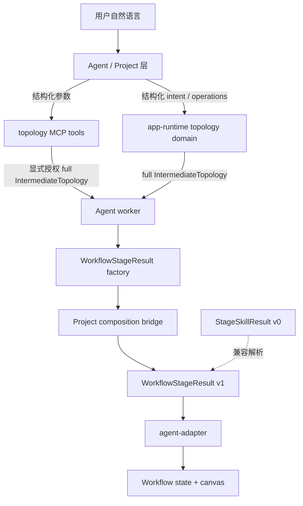
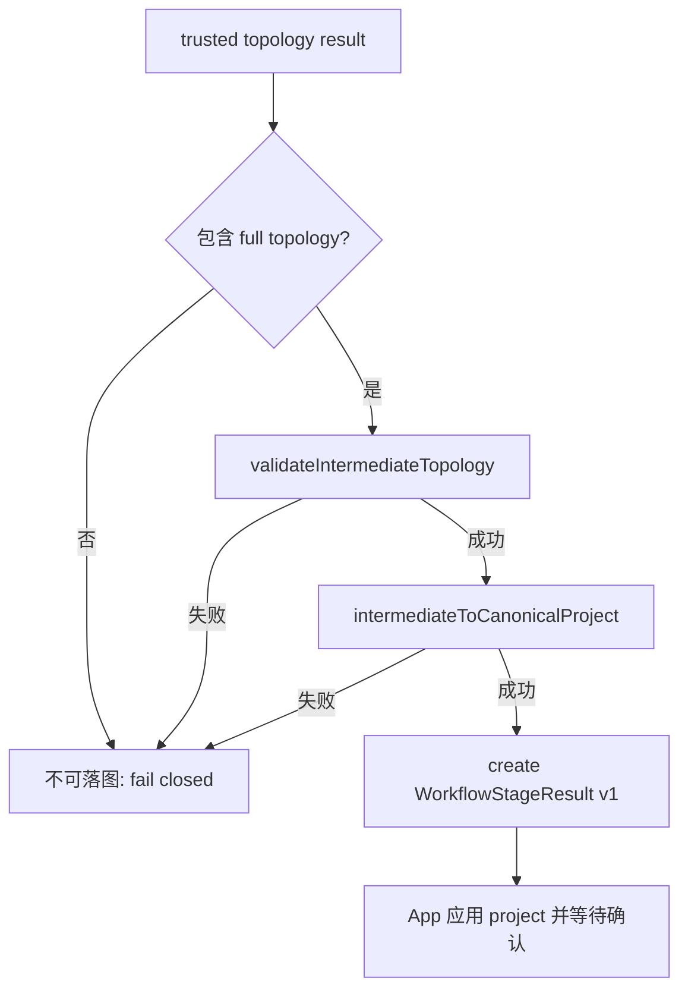
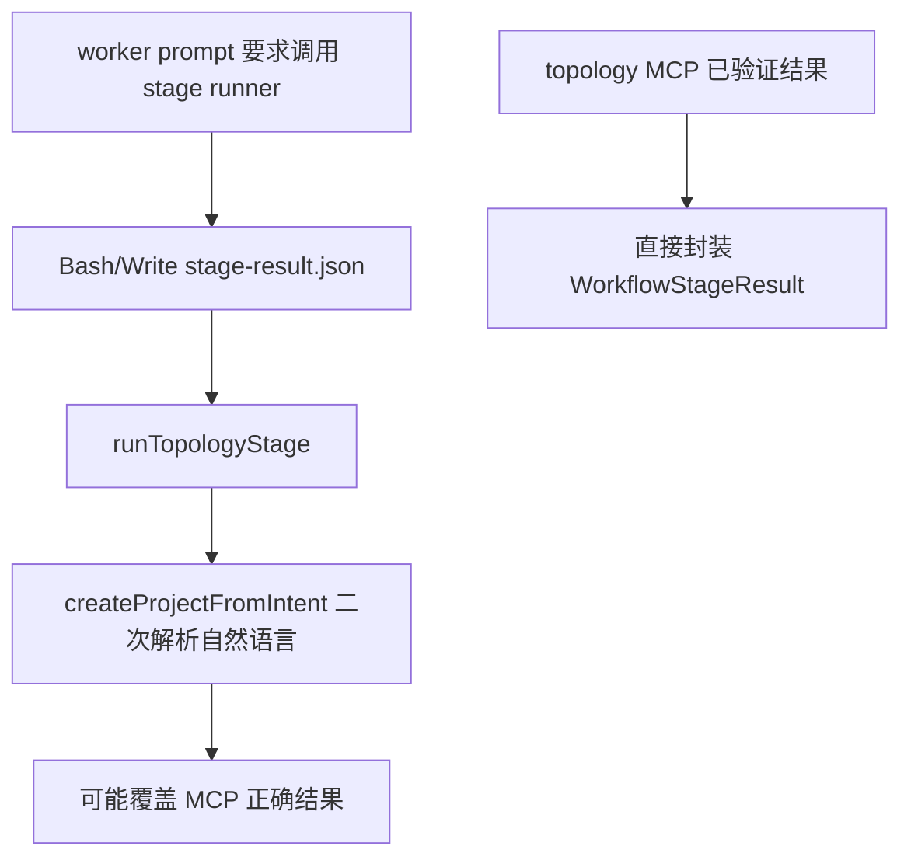

# refactor: 让拓扑阶段直接消费 MCP 结果

## 摘要

把 topology 阶段的成功事实来源从“大模型调用 stage runner 写文件”改为“topology MCP 已生成并校验的结构化结果”。`StageSkillResult` 命名和契约同步迁移为 `WorkflowStageResult`，用 `producer` 描述结果来源；旧的 `StageSkillResult` v0 仅作为兼容输入保留，不再作为新主链路。

这份计划聚焦当前已经暴露的问题：用户要求 4 个交换机、每个交换机 2 个端系统时，MCP 已正确生成 4+8 拓扑，但 stage runner 又重新解析自然语言并回退到默认 5/台，最终让 App 展示 4+20 的错误拓扑。

---

## 问题框架

当前拓扑主链路里有两个事实来源：`topology.initialize` / `topology.apply_operations` 能生成确定性 `IntermediateTopology`，但 `src-node/claude-agent-worker.mjs` 仍要求大模型调用 `src-node/stage-skills/tsn-stage-runner.ts` 写入 `stage-result.json`。`runTopologyStage()` 会重新调用 `createProjectFromIntent()`，把自然语言再解析一次，然后生成另一个 canonical project。

这个设计和 topology MCP 的目标冲突。MCP 已经承担确定性初始化、校验和 artifact 构建时，stage runner 不应再解释拓扑规模、模板和连接方式。它最多只能作为旧结果兼容或非 topology 阶段的临时迁移工具。

命名上也有误导：`StageSkillResult` 让人以为 App 阶段结果必须来自大模型 skill。新的边界应该是：

- `Skill`：给大模型看的能力说明。
- `MCP Tool`：确定性领域服务接口。
- `WorkflowStageResult`：App 接受、校验和落地的阶段结果信封。

下文把“可被拓扑阶段落地的结构化结果”统一称为 **trusted topology result**：它只能来自两类路径：一是 topology MCP 在显式 `responseMode: "full"` 且 `topologyFullAllowed: true` 的本地组合路径返回的 full `IntermediateTopology`，二是 app-runtime 直接调用同一 topology domain 契约得到的 full `IntermediateTopology`。模型文本、summary-only MCP 响应、artifact 构建成功、`createProjectFromIntent()` 生成的 canonical project 都不是 trusted topology result。

---

## 需求

**事实来源**

- R1. topology 阶段的可落地结果必须来自已校验的 trusted topology result，不能由 stage runner 再基于自然语言重建拓扑。
- R2. 从 0 初始化拓扑时，成功依据是 `topology.initialize` 返回 full `IntermediateTopology` 且 `topology.validate_intermediate` 通过；已有拓扑编辑时，成功依据是 `topology.apply_operations` 返回 full updated `IntermediateTopology` 且校验通过。
- R3. artifact 构建或校验成功可以作为 topology 阶段证据记录，但不能替代 full topology；App 落图仍需要可转换为 `CanonicalTsnProjectV0` 的 topology payload。
- R4. 若本轮没有可用的 trusted topology result，拓扑阶段必须 fail closed，保留当前工程或不落图，不得 fallback 到默认拓扑。

**契约命名**

- R5. 新结果契约命名为 `WorkflowStageResult`，schema version 使用 `tsn-agent.workflow-stage-result.v1`。
- R6. 新契约使用 `producer` 描述来源，不再要求 `skillName`。`producer.type` 至少支持 `mcp`、`local-runtime`、`legacy-skill`；topology success result 不允许使用 `fallback` producer。
- R7. 旧 `StageSkillResult` v0 只能作为兼容输入解析，解析后归一化为 `WorkflowStageResult`。新公开 API、新写入字段、新事件和新文档不得继续把阶段结果称为 skill result；旧 session 字段或旧 fixture 中的 `skillResult` / `skill-result` 只能在兼容 normalizer 中读取。

**Agent 与 worker**

- R8. topology 阶段的 worker prompt 不再要求大模型调用 `node tsn-stage-runner --stage topology`，也不再把 stage runner 文件路径作为 topology 成功条件。
- R9. worker 必须能从 trusted topology result 合成 `WorkflowStageResult`，并把它随 `run_claude_agent` response 返回给前端。
- R10. topology 阶段 repair/retry 逻辑不再提示“必须调用 stage runner”；如果缺少可应用的 topology result，应明确提示缺少 trusted topology result。
- R11. topology 阶段默认工具权限应收敛到 MCP 和必要的只读上下文能力；不能为了 stage runner 保留 `Bash`/`Write` 作为主路径要求。

**应用集成**

- R12. `agent-adapter`、workflow state、执行日志和 UI 事件文案应使用“阶段结果”“工具结果”或“拓扑结果”，避免把 MCP/domain 结果展示为“skill 结果”。
- R13. `applyStageResults()` 语义应迁移为应用 `WorkflowStageResult`，同时兼容旧 v0 stage result 和旧 session。
- R14. flow planning 现有路径不在本计划中重做为 MCP，也不在本计划中迁移目录；本计划只要求 topology 阶段不再依赖 stage runner 主链路。flow planning 若仍使用现有 runner，应保留原位并通过文档标记为后续清理。

**回归验证**

- R15. 必须加入回归测试：输入“`双平面冗余，四个交换机，每个交换机两个端系统`”时，若 topology MCP 返回 4 个交换机、8 个端系统，最终 App 应应用 12 个节点的拓扑，而不是 stage runner 重新解析得到 24 个节点。
- R16. 必须验证缺失 trusted topology result 时不会自动 fallback 到本地默认拓扑。
- R17. 必须验证旧 `StageSkillResult` v0 仍可被读取、归一化和应用，避免已有测试 fixture 或旧 session 断裂。

---

## 关键技术决策

- KTD1. **trusted topology result 是 topology 阶段事实来源。** 只要 full topology 通过校验，worker/app 就能合成阶段结果；stage runner 不参与 topology 规则判断。
- KTD2. **结果信封和生产者解耦。** `WorkflowStageResult` 表示 App 工作流阶段结果；`producer` 表示来源。这样 topology 可以来自 MCP 或 app-runtime domain，flow planning 暂时来自 local runtime，旧 skill 输出也能作为 legacy producer 兼容。
- KTD3. **worker 合成结果，而不是要求模型写文件。** 大模型可以调用 MCP 或返回解释文本，但结构化落地只能由 worker 根据 trusted topology result 或 app-runtime allowlist 的实际调用结果生成。若 SDK 消息流无法稳定提供 full MCP `tool_result`，实现不得让模型复述 full topology，也不得从 summary 文本反解析；应改走 app-runtime 直接调用 topology domain，或 fail closed。
- KTD4. **legacy v0 parse-only。** `StageSkillResult` v0 不再作为新输出格式；兼容层只负责把旧对象转换为 v1，方便渐进迁移。
- KTD5. **不要把中文数字解析当成核心修复。** `matchTargetCount()` 可以后续增强，但 topology MCP 正确生成后不应被任何自然语言二次解析覆盖；当前 4+8 变 4+20 的根因是双事实来源。
- KTD6. **flow planning 暂不扩大到 MCP 重构或目录迁移。** 本计划只保证 topology 阶段摆脱 stage runner；flow planning 继续沿用现有确定性路径，后续再单独决定是否迁到 MCP domain 或中性 runtime 模块。

---

## 高层技术设计

### 新数据流

### topology 阶段成功判定

### 旧链路要删除的依赖

---

## 范围边界

### 范围内

- 新增 `WorkflowStageResult` v1 契约和 v0 兼容归一化。
- 让 topology 阶段从 trusted topology result 合成 workflow stage result。
- 移除 topology 阶段 prompt、retry、测试中的 stage runner 主路径要求。
- 更新 agent adapter、诊断日志、事件和文档命名，减少 “skill result” 误导。
- 保留旧 session / 旧测试 fixture 的兼容读取能力。
- 覆盖当前 4+8 被覆盖成 4+20 的回归场景。

### 后续工作

- 将 flow planning 正式迁移为 MCP domain 或独立 deterministic local runtime。
- 完全删除所有 `stage-skills` 目录和 runner CLI，前提是 flow planning 已完成替代路径。
- 增强自然语言数字解析，例如“两个”“每台三台终端”等表达；这属于防御性改进，不是本计划的主修复。
- 从 SDK tools 层移除 `claude_code` preset，改为显式 app-runtime allowlist；本计划只清理 topology 阶段对 `Bash`/runner 的依赖。

### 范围外

- 不重做 topology MCP tool 本身的模板、operations 或 artifact 规则。
- 不把 `generate_project` 加回 topology MCP。
- 不改 `network.ned`、`omnetpp.ini` 或 flow planning 导出逻辑。
- 不要求本次一次性删除旧 `.claude/skills/tsn-topology`；它可以继续作为 MCP 使用指引存在。

---

## 实施单元

### U1. 引入 WorkflowStageResult v1 契约

**目标:** 用中性的 workflow stage 命名替代 skill 命名，并保留旧 v0 兼容。

**需求:** R5, R6, R7, R13, R17

**依赖:** 无

**文件:**

- `src/agent/workflow-stage-result.ts`
- `src/agent/stage-skill-contract.ts`
- `src/agent/agent-adapter.ts`
- `src/agent/agent-adapter.test.ts`

**方案:** 新增 `WorkflowStageResult`、`WorkflowStageSummary`、`WorkflowStageProducer`、`parseWorkflowStageResult()`、`validateWorkflowStageResult()` 和 `summarizeWorkflowStageResult()`。`producer` 替代 `skillName`，例如 topology MCP 结果使用 `{ type: "mcp", name: "tsn_topology", tool: "topology.initialize" }`。旧 `stage-skill-contract.ts` 暂时保留为兼容 shim，导出旧名称但内部调用 v1 归一化；后续可删除。validator 必须拒绝 `stage = "topology"` 且 `status = "success"` 且 `producer.type = "fallback"` 的结果。

**遵循模式:** 继续沿用 `src/agent/stage-skill-contract.ts` 里的 runtime parsing、canonical project validation 和 summary 提取方式，但新 schema 不再校验 `skillName`。

**测试场景:**

- Happy path：v1 topology result 包含 `producer.type = "mcp"` 和合法 project 时，parse/validate 成功。
- Compatibility：旧 v0 `StageSkillResult` 带 `skillName: "tsn-topology"` 时被归一化为 `WorkflowStageResult`，producer 为 `legacy-skill` 或兼容映射。
- Error path：v1 success result 但 `validation.ok = false` 时失败。
- Error path：topology / flow-template result payload 缺少 canonical project 时失败。

**验证:** 新旧 result fixture 都能通过 adapter 测试；新代码路径不再需要直接读取 `skillName` 来判断来源。

### U2. 增加 topology MCP 结果到阶段结果的封装器

**目标:** 从已校验的 `IntermediateTopology` 或 topology MCP full result 生成 `WorkflowStageResult`，不再重新解析自然语言。

**需求:** R1, R2, R3, R4, R15, R16

**依赖:** U1

**文件:**

- `src/agent/topology-workflow-stage-result.ts`
- `src/topology/project-bridge.ts`
- `src/topology/intermediate.test.ts`
- `src/agent/topology-workflow-stage-result.test.ts`

**方案:** 新增 factory，输入为 trusted topology result、`scenarioConfigId`、project metadata 和 producer evidence。topology 新主链路只接受 full `IntermediateTopology`，不接受 `userIntent` 或任意 canonical project 作为 builder 输入。factory 先调用 `validateIntermediateTopology()`，再调用 `intermediateToCanonicalProject()`，最后输出 `WorkflowStageResult`。如果为了旧 session 兼容需要读取 canonical project，只能走 `legacy-skill` producer 的 v0 normalizer，不能作为 topology MCP/domain success 主路径。

`summary` 来自 MCP summary 和 project counts；`safeEventSummary` 使用实际 project 节点/链路计数；producer 记录具体 tool，例如 `topology.initialize` 或 `topology.apply_operations`。

**遵循模式:** 复用 `src/topology/project-bridge.ts` 的 `intermediateToCanonicalProject()` 和 `src/domain/validation.ts` 的 canonical project 校验。

**测试场景:**

- Happy path：`aerospace-redundant` full topology 包含 4 个交换机、8 个端系统时，生成的 project 为 12 个节点，且 workflow result summary 与计数一致。
- Regression：同一用户文本即使会被 `createProjectFromIntent()` 误解析为 20 个端系统，factory 也只使用 MCP topology，最终仍是 8 个端系统。
- Error path：MCP result 只有 summary、没有 full topology，且没有 app-runtime full domain result 时，factory 返回不可应用错误，不生成默认 project。
- Error path：full topology 校验失败时，result status 为 failed 或返回结构化错误，不落图。

**验证:** 当前截图对应场景可以用 fixture 重放，确认最终结果来自 MCP topology 而不是自然语言 parser。

### U3. 改造 worker：捕获 MCP 成功结果并停止要求 topology stage runner

**目标:** 让 `run_claude_agent` 直接返回由 MCP 结果合成的 workflow stage result；删除 topology 阶段对 `stage-result.json` 和 runner repair 的强依赖。

**需求:** R1, R2, R8, R9, R10, R11, R15, R16

**依赖:** U1, U2

**文件:**

- `src-node/claude-agent-worker.mjs`
- `src-node/claude-agent-worker.test.mjs`
- `src-node/mcp/topology-tools.ts`
- `src/topology/tool-result.ts`

**方案:** 先增加 characterization test，固定当前 Agent SDK 消息里 `tool_use` / `tool_result` 的可解析 shape，证明 worker 能否拿到 `topology.initialize` 和 `topology.apply_operations` 的 full result payload。若可稳定捕获，则扩展 worker 的 SDK message traversal，在已有 `extractOperationTraceEvents()` 附近捕获 topology MCP `tool_result` JSON；实现时只接受显式 `responseMode: "full"` 且 `topologyFullAllowed: true` 的 `ok: true` full topology result，并结合 `topology.validate_intermediate` 的成功结果作为证据。

若 characterization test 证明 SDK 消息流只能稳定提供摘要或脱敏 trace，worker 不得从模型文本、operation trace 或 summary 反解析拓扑。此时 topology 阶段应改为 app-runtime 显式调用 topology domain：模型或 project 层只负责产生结构化初始化 intent / operations，worker 在 allowlist 内调用同一 domain 契约获取 trusted topology result，再合成 `WorkflowStageResult`。

worker prompt 中 topology 阶段不再要求调用 stage runner，也不再要求读取 `TSN_AGENT_STAGE_RESULT_PATH` 作为成功标志。repair prompt 从“必须调用项目 stage runner”改成“缺少可应用的 trusted topology result”。如果本轮没有捕获到或生成可应用 result，worker 返回空 stageResults，让前端 fail closed。

**遵循模式:** 复用当前 audit timeline、operation trace 和 recovered result 机制，但 recovered 条件改为 `hasRecoverableWorkflowStageResult()`。

**测试场景:**

- Happy path：模拟模型调用 `mcp__tsn_topology__topology_initialize` 返回 full topology，worker 不写 `stage-result.json` 也能返回一个 topology workflow stage result。
- Regression：模拟 MCP 返回 4+8，且 stage runner 如果运行会得到 4+20；worker 结果必须是 4+8。
- Characterization：模拟真实 SDK `tool_result` shape，证明 full MCP payload 可捕获；若 shape 不含 full payload，测试应覆盖 app-runtime domain fallback 或 fail-closed，而不是 summary 反解析。
- Error path：模型只返回文字，没有 trusted topology result 时，worker 不触发 runner retry，最终没有可应用 stage result。
- Error path：MCP 请求 full artifact 或 full changeSet 被拒绝时，worker 记录结构化失败摘要，不落图。
- Permission surface：topology 阶段 prompt 和 tests 中不再出现 `node tsn-stage-runner --stage topology` 作为必需命令。

**验证:** worker 单测能证明 topology stage 不依赖 Bash runner；diagnostic audit 中仍能看到 MCP 工具调用摘要。

### U4. 改造 agent adapter 和 workflow 应用层命名

**目标:** 前端应用阶段结果时使用 workflow stage 语义，UI 和诊断不再把 MCP 结果称为 skill result。

**需求:** R5, R6, R7, R12, R13, R16, R17

**依赖:** U1

**文件:**

- `src/agent/agent-adapter.ts`
- `src/agent/agent-adapter.test.ts`
- `src/project/project-state.ts`
- `src/project/project-state.test.ts`
- `src/ui/diagnostics/DiagnosticsDrawer.tsx`
- `src/app/App.tsx`
- `src/app/App.test.tsx`

**方案:** 把 `applyStageResults()` 重命名或封装为 `applyWorkflowStageResults()`。内部使用 v1 parser，同时兼容 v0。workflow state 新写入字段使用 `stageResult`，旧 session 中的 `skillResult` 只在 normalize 时读取并迁移为 `stageResult`。

新增事件 kind 使用 `workflow-stage-result` 或现有 `stage-result`；旧 `skill-result` 事件只作为历史事件读取兼容，不作为新 MCP/domain 成功路径输出。UI 文案改为“拓扑工具结果”或“阶段结果”。

**遵循模式:** 保留 `recordStageResult()` 的阶段确认语义：topology 成功后仍进入 `waiting_confirmation`，不会提前推进 flow-template 或 planning-export。

**测试场景:**

- Happy path：adapter 接收 v1 MCP producer topology result 后应用 project，workflow topology 进入 `waiting_confirmation`。
- Compatibility：adapter 接收旧 v0 `StageSkillResult` 后仍能应用，旧 session 不破。
- Error path：没有 workflow stage result 时首轮 topology 不落图，assistant text 明确不会 fallback 到默认拓扑。
- UI wording：执行日志和事件内容不再出现“skill 结果”作为 MCP 成功结果的主文案。

**验证:** App 仍能展示拓扑、等待确认，并保留现有 workflow 门禁。

### U5. 退役 topology stage runner 主链路

**目标:** 删除或废弃 topology 主流程中的 stage runner，避免后续 agent 继续把它当成成功条件。

**需求:** R1, R4, R8, R10, R11, R14

**依赖:** U2, U3, U4

**文件:**

- `src-node/stage-skills/tsn-stage-runner.ts`
- `src-node/stage-skills/tsn-stage-runner.test.mjs`
- `src-node/claude-agent-worker.mjs`
- `package.json`
- `scripts/verify-skills.mjs`
- `.claude/skills/tsn-topology/SKILL.md`
- `docs/topology-mcp.md`

**方案:** 移除 `runTopologyStage()` 自然语言 builder 路径，保留 legacy skill output importer 仅用于迁移测试或显式 compat，不再被 worker prompt 调用。flow planning 仍沿用当前 CLI/runner 文件，不在本计划内迁移；只在文档或代码注释中标记它是后续清理对象，避免为了 topology 修复扩大改动面。

`.claude/skills/tsn-topology` 只保留 MCP 使用指引，不再要求写 `stage-result.json`。`build:worker` 不应因为 topology stage runner 退役而丢失 MCP server bundle。

**遵循模式:** 遵守 `AGENTS.md` 中对 `tsn-topology/` 独立参考目录的边界；本计划只改项目内 `.claude/skills/tsn-topology` 和 runtime 代码，不默认修改独立参考仓库。

**测试场景:**

- Static behavior：worker prompt 不再包含 topology stage runner 命令形态。
- Runtime behavior：topology 阶段缺少 trusted topology result 时 fail closed，而不是调用 `runTopologyStage()` 生成默认 project。
- Compatibility：legacy skill output importer 若保留，必须通过显式测试证明它不会在普通 topology 主链路自动触发。
- Build integration：worker bundle 仍包含 topology MCP server bundle，移除 runner 后打包入口不报错。

**验证:** 源码中 topology 主路径不再把 `createProjectFromIntent(userIntent)` 作为落图条件。

### U6. 更新文档、诊断和架构说明

**目标:** 让文档和可视化架构与新边界一致，避免未来换 agent 时继续沿用 stage runner 思路。

**需求:** R5, R6, R7, R8, R12, R14

**依赖:** U1, U3, U5

**文件:**

- `docs/topology-mcp.md`
- `docs/brainstorms/2026-05-27-tsn-topology-mcp-requirements.md`
- `docs/brainstorms/2026-05-27-tsn-topology-mcp-architecture.html`
- `docs/testing.md`
- `docs/staged-agent-workflow.md`

**方案:** 更新文档中的阶段结果命名和拓扑阶段时序图。明确 trusted topology result 是事实来源，`WorkflowStageResult` 是 App 信封，skill 只作为 agent 指引。HTML 架构图重点展示：prompt -> MCP/app-runtime domain -> worker 捕获或生成 trusted topology result -> workflow stage result -> App，而不是 prompt -> stage runner -> stage-result file。

**测试场景:** Test expectation: none -- 文档改动本身不新增 runtime 行为；由 U1-U5 的测试覆盖契约。

**验证:** 文档中不再把 `topology.apply_operations` 或 `topology.initialize` 的成功结果描述为必须经过 stage runner 才能落地。

### U7. 加强端到端回归覆盖

**目标:** 用当前真实问题作为验收样例，防止后续再次出现 MCP 正确但二次解析覆盖的情况。

**需求:** R1, R4, R15, R16, R17

**依赖:** U1-U5

**文件:**

- `src/agent/agent-adapter.test.ts`
- `src-node/claude-agent-worker.test.mjs`
- `src/topology/project-bridge.test.ts`
- `src/topology/initialize.test.ts`
- `docs/testing.md`

**方案:** 增加一组聚焦回归：

- worker 层：MCP initialize full result 为 4+8 时，返回 stage result 为 12 节点。
- adapter 层：接收该 result 后右侧 project 为 4 个交换机、8 个端系统。
- fail closed：没有 trusted topology result 时不落图，不使用 fake/local default 覆盖。
- legacy：旧 v0 result 仍被兼容应用。

不要把“修中文数字解析”作为唯一断言；测试应证明即使自然语言 parser 会误判，trusted topology result 仍是最终事实来源。

**遵循模式:** 使用现有 Vitest 单元测试风格和 fake Tauri invoke mocks，避免依赖真实模型、网络或人工会话。

**测试场景:**

- Regression：`双平面冗余，四个交换机，每个交换机两个端系统` + trusted topology result 4+8 -> App project 4+8。
- Negative：同一文本无 trusted topology result -> App 不落图，提示缺少可应用结构化结果。
- Compatibility：旧 stage result fixture -> 正常应用或被清晰拒绝。
- Audit：执行日志记录 producer 为 `mcp:tsn_topology` 或 `local-runtime:topology-domain`，不记录 full topology、端口表或 MAC 表。

**验证:** 该组测试能在无模型、无网络、无真实 Tauri sidecar 下稳定运行。

---

## 验收示例

- A1. Given 用户输入“`双平面冗余，四个交换机，每个交换机两个端系统`”，when worker 通过显式授权 MCP full mode 或 app-runtime topology domain 得到 4 个交换机、8 个端系统的 full topology 且校验通过，then worker 生成 topology `WorkflowStageResult`，App 展示 12 个节点，不再展示 24 个节点。
- A2. Given 模型只返回中文说明但没有 trusted topology result，when worker 完成本轮，then App 保持当前工程或不落图，并提示没有可应用结构化结果。
- A3. Given 旧 session 或测试 fixture 仍含 `schemaVersion: "tsn-agent.stage-skill-result.v0"` 和 `skillName`，when adapter 读取结果，then 它被兼容归一化为 v1 summary 或被结构化拒绝，不造成未捕获异常。
- A4. Given topology MCP artifact build 成功但 worker 没有拿到 trusted topology result，when App 尝试落图，then 不生成 canonical project；artifact 成功只能作为证据，不能替代 topology payload。
- A5. Given 日志和 UI 展示 MCP topology 成功，then 文案使用“拓扑工具结果”或“阶段结果”，不把 MCP/domain 结果描述成大模型 skill 的产物。

---

## 风险与依赖

- **SDK message shape 风险:** worker 需要从 Agent SDK 消息里捕获 MCP tool result。实现时要先用 characterization test、现有 audit 和单测 fixture 明确可解析 shape；如果 SDK 不稳定，应优先在 app-runtime 层执行 topology domain 调用，而不是让模型复制结果或从 summary 反解析。
- **兼容风险:** 大量测试和 UI 字段仍使用 `skillName` / `skillResult`。计划通过 v0 shim 和渐进命名迁移降低风险，避免一次性破坏旧 session。
- **flow planning 暂存风险:** `src-node/stage-skills/tsn-stage-runner.ts` 同时承载 flow planning。若直接删除文件会扩大范围；本计划只退役 topology path，不迁移 flow planning 目录。
- **诊断敏感数据风险:** MCP full topology 可能包含端口、MAC、IP 等工程数据。worker 和诊断日志只能记录摘要，full payload 只用于本地 project composition。

---

## 资料来源

- `docs/brainstorms/2026-05-27-tsn-topology-mcp-requirements.md`
- `docs/plans/2026-05-28-001-feat-deterministic-topology-mcp-service-plan.md`
- `docs/topology-mcp.md`
- `src-node/claude-agent-worker.mjs`
- `src-node/stage-skills/tsn-stage-runner.ts`
- `src/agent/stage-skill-contract.ts`
- `src/agent/agent-adapter.ts`
- `src/topology/project-bridge.ts`
- `src-node/mcp/topology-tools.ts`
