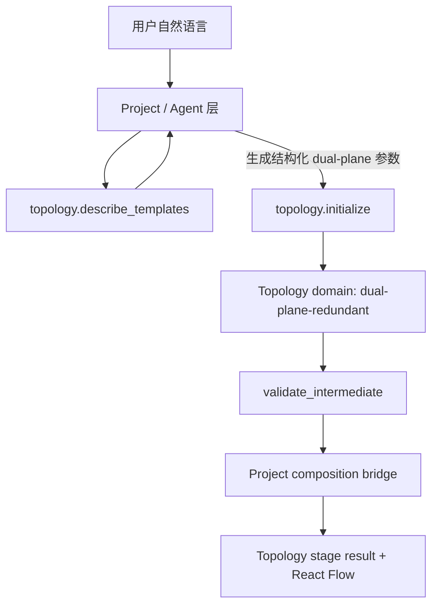

# feat: 重构双平面拓扑模板契约

## 摘要

把现有 `aerospace-redundant` 参考拓扑从公开 topology MCP 模板目录中移除，新增一个收窄后的 `dual-plane-redundant` 模板。该模板不接收 `endSystemsPerSwitch` 这类 UI/语义层 shortcut，而是接收由 Project/Agent 层整理并校验过的结构化双平面参数：显式交换机、交换机分组、端系统接入分配、双归属规则、平面内骨干连接和平面间桥接策略。MCP 只负责确定性生成、校验和返回 `IntermediateTopology`。

---

## 问题框架

当前实现把三个概念混在了一起：`aerospace-onboard` 场景配置、`aerospace-redundant` 拓扑模板、以及针对 7 个网卡参考图的硬编码端系统分布。用户输入“4 个交换机，每个交换机 2 个端系统”时，大模型把端系统总数传成 4；MCP 按当前契约生成了 4 个端系统，但这不是用户期望的 8 个端系统。问题不是 MCP 算错，而是公开模板契约让模型必须猜参数语义。

新的边界应当是：Topology MCP 维护所有拓扑模板和生成规则；Project/Agent 层负责从自然语言、场景默认值和用户确认中形成结构化参数。MCP 不需要知道“每个交换机几个端系统”这句话，它只需要收到“有哪些交换机、有哪些端系统、端系统接入到哪些主/备交换机、交换机之间如何形成两套平面”的确定输入，然后稳定生成拓扑。

### 当前实现状态

本计划落地后的公开 `topology.describe_templates` 目录只应返回当前可新建模板。`generic-line` / `generic-ring` 继续作为基础 smoke 模板保留；`dual-plane-redundant` 已作为通用双平面/双归属模板加入；`aerospace-redundant` 不再公开，也不作为新建、repair 或默认 fixture 的成功路径。

| 模板 ID | 当前状态 | 规则 |
|---|---|---|
| `generic-line` | 当前可用，使用 `switchCount` / `endSystemsPerSwitch` | 通用简化模板，不承载双平面语义 |
| `generic-ring` | 当前可用，使用 `switchCount` / `endSystemsPerSwitch` | 通用简化模板，不承载双平面语义 |
| `dual-plane-redundant` | 当前可用 | 通用双平面/双归属模板，必须传显式节点、分组和 A/B 接入 |
| `aerospace-redundant` | 已移除 | 不在 public catalog 中；旧 ID 只作为错误测试输入 |

---

## 需求

**模板目录**

- R1. 从 `topology.describe_templates` 公开目录中移除 `aerospace-redundant` / `aerospace-redundant-reference` 或任何等价参考拓扑模板。
- R2. 新增 `dual-plane-redundant` 作为 P0 双平面/双冗余拓扑模板，由 topology MCP 维护参数 schema、默认约束、示例和确定性生成规则；P0 只覆盖 A/B 两平面、成对 switch group、显式端系统双归属、`line` / `ring` 平面内骨干，以及 `none` / `paired` 跨平面桥接。
- R3. MVP 尚未上线，不保留 `aerospace-redundant` 旧 session 兼容路径；该模板 ID 必须从公开目录、初始化入口、fake/session repair fallback 和默认 fixture 中移除。若调用方显式传入该 ID，`topology.initialize` 必须返回结构化错误，不得生成拓扑。

**参数契约**

- R4. `dual-plane-redundant` 不得把 `endSystemsPerSwitch` 作为模板参数；这个值如果来自用户自然语言，应由 Project/Agent 层换算成明确的 `switches`、`switchGroups`、`endSystems` 和接入分配。
- R5. 模板必须支持 Project/Agent 层传入显式 `switches`、`switchGroups` 和 `endSystems`。每台交换机必须声明 `id`、`plane`、`groupId` 和端口容量或可推导的端口容量；每个端系统必须声明主接入和备接入。
- R6. 模板 P0 必须支持比“每个交换机挂 N 个端系统”更明确的双平面连接策略，但范围收窄到可测试集合：成对 A/B switch group、端系统按 group 双归属、平面内 `line` / `ring` 骨干，以及 `none` / `paired` 跨平面桥接。`mesh`、`custom pairs`、多级 aggregation/core、非对称平面和每平面多 access switch 进入后续模板扩展。
- R7. 模板必须区分“两个物理平面”和“端系统双归属”两个概念：双平面描述交换机骨干冗余，双归属描述端系统接入冗余。二者可同时存在，但不是同一个字段。
- R8. 参数 schema 必须让大模型能够先调用 `topology.describe_templates` 得知可用枚举、字段含义、required/optional、数组 item shape、引用关系和完整示例，再生成 `topology.initialize` 参数；`describe_templates` 不应只返回自然语言描述。
- R8a. 文档和测试必须区分“当前可调用模板”和“目标/已废弃模板”；`topology.describe_templates` 的 public catalog 只返回当前可调用模板。实现完成后不得在 public catalog 中展示 `aerospace-redundant`；文档中的 `dual-plane-redundant` 示例不得作为可调用示例发布，直到 catalog 实际返回该模板 ID 和 schema。

**确定性行为**

- R9. 相同 `dual-plane-redundant` 输入必须得到相同节点、链路、端口、坐标和摘要。
- R10. MCP 必须校验交换机实体、交换机分组、端系统接入、端口容量、端口占用、链路重复、平面内连接、跨平面桥接和关键字段缺失。
- R11. 如果模型传入的接入规则不完整或歧义，例如端系统只声明数量但没有接入到哪些交换机，MCP 必须返回结构化错误，不得猜测用户意图。
- R12. P0 不支持 `attachmentPlan` 或其他压缩展开参数。调用方必须传入显式端系统和主备接入；如果后续支持压缩参数，必须作为独立增量定义 schema、余数分配、group 映射、主备选择和错误路径。

**集成边界**

- R13. `src/domain/topology-factory.ts` 和 fake/session repair 路径必须删除旧 `aerospace-redundant` 参考拓扑 fallback，不得在任何新建、确认、继续或修复路径中生成该参考拓扑。
- R14. `aerospace-onboard` 场景可以继续存在，但它只能提供业务语义、默认场景和提示词上下文；拓扑初始化必须通过 `dual-plane-redundant` 或其他 MCP 公开模板完成。
- R15. 本计划不重写 flow 阶段；但拓扑阶段回归测试必须确保新建双平面 topology stage result 不包含引用不存在节点的 flow 或阶段 payload。旧 flow 模板硬编码节点问题作为独立 follow-up 处理。
- R16. `project-bridge` 不得根据旧模板 ID 自动把 project 命名为“箭载双冗余拓扑”；项目命名应来自场景配置、用户输入或通用模板元数据。

**测试**

- R17. 必须新增测试覆盖“4 个交换机，每个交换机 2 个端系统”的模型展开结果：Project/Agent 层传给 MCP 的是 4 个交换机、8 个端系统和明确双归属接入，MCP 返回 12 个节点。
- R18. 必须新增测试覆盖 4 个交换机、20 个端系统、每端系统双归属到 A/B 平面的拓扑，确认它不依赖 `endSystemsPerSwitch` 参数。
- R19. 必须新增错误测试：只传 `endSystemsPerSwitch`、只传端系统总数但没有接入分配、端系统主备接入同一平面、端口不足、缺少必填 `backbone` 或 `crossPlaneLinks`、端系统引用不存在的 switch。
- R20. 必须更新 MCP schema 测试，确认 `topology.initialize` 不再用 `z.unknown()` 暴露模板参数，而是至少对 `dual-plane-redundant` 的关键字段做结构化校验。
- R21. MCP 文档必须明确 `topologyFullAllowed` 只是显式 opt-in，不是鉴权。当前安全边界是能否启动并访问本机 MCP 进程；capability token、签名/hash、private IPC 或 localhost-only 属于生产 sidecar 后续设计。
- R22. MCP 文档必须区分 artifact 的 ingress 和 egress：`build_artifacts` 从 `IntermediateTopology` 返回 summary；`describe_artifacts` / `validate_artifacts` 只适合调用方已经持有 artifact 对象时使用。外部模型侧不应把完整 artifact/MAC 表作为主链路 tool arguments 传入。

---

## 建议的 `dual-plane-redundant` 参数规则

这个 schema 是计划中的方向性契约，具体字段名实现时可以小幅调整，但语义不应退回 `endSystemsPerSwitch`。

```ts
type DualPlaneRedundantParams = {
  dataRateMbps: 10 | 100 | 1000 | 10000;
  planes: [
    { id: "A"; name?: string },
    { id: "B"; name?: string }
  ];
  switches: Array<{
    id: string;
    name?: string;
    plane: "A" | "B";
    groupId: string;
    role?: "access";
    portCount?: number;
  }>;
  switchGroups: Array<{
    id: string;
    name?: string;
    planeSwitches: {
      A: string;
      B: string;
    };
  }>;
  endSystems: Array<{
    id: string;
    name?: string;
    groupId: string;
    attachment: {
      primary: { switchId: string; plane: "A" | "B" };
      backup: { switchId: string; plane: "A" | "B" };
    };
  }>;
  backbone: {
    mode: "line" | "ring";
    withinPlane: boolean;
  };
  crossPlaneLinks: {
    mode: "none" | "paired";
  };
  allocation?: {
    idPrefix?: {
      switch?: string;
      endSystem?: string;
      link?: string;
    };
    portStrategy: "first-free";
    layoutStrategy: "dual-plane-grid";
  };
};
```

### 模型应如何把自然语言转成参数

用户说“4 个交换机，每个交换机 2 个端系统，双平面冗余”时，Project/Agent 层可以先把它解释为：

- 交换机：4 台，构成 2 个双平面 switch group，每个 group 有 A/B 两台交换机。
- 端系统：8 个，因为“每个交换机 2 个端系统”是语义 shortcut，需要由模型展开。
- 接入：每个端系统双归属到某个 group 的 A/B 交换机。
- 骨干：如果用户没有明确说 `line` 或 `ring`，Project/Agent 层必须按场景默认策略选择并在阶段摘要中暴露默认值，或请求用户确认；MCP 只执行已给定的 `backbone.mode`。
- 跨平面桥接：必须显式传入 `crossPlaneLinks.mode`。`none` 表示 A/B 平面隔离但端系统双归属；`paired` 表示每个 switch group 内 A/B 交换机有成对跨平面链路。

展开后的 MCP 参数应表达为显式 `switches`、`switchGroups` 和 `endSystems`。MCP 可以校验这个结构，但不从自然语言计算 8。

### 双平面与双冗余的处理

本计划采用如下工程语义：

- **双平面:** 至少存在两个可区分的交换机平面，通常是 A/B，两套平面内骨干可以独立连通。
- **双归属:** 一个端系统同时接入两个不同故障域，通常是 A/B 平面各一台交换机。
- **双冗余:** 泛指上面一种或两种冗余能力；在模板参数里不作为单独拓扑结构，而是由 `planes`、`switches`、`switchGroups`、`attachment`、`backbone` 和 `crossPlaneLinks` 组合表达。

---

## 关键技术决策

- KTD1. **公开模板由 MCP 统一维护。** Project/Agent 层只能通过 `topology.describe_templates` 发现模板，不再在 `topology-factory`、stage runner、fake agent 或 skill 中维护第二套参考拓扑。
- KTD2. **删除参考拓扑，而不是重命名。** `aerospace-redundant` 当前承载的是特定 7 网卡图例，不应以 `aerospace-redundant-reference` 继续暴露；保留它只会让模型继续选错。
- KTD3. **MCP 参数接收结构化拓扑意图，不接收自然语言 shortcut。** `endSystemsPerSwitch`、`每台交换机连接 N 个端系统`、`左侧三个右侧两个` 都属于 Project/Agent 层的语义归一化来源，不是 MCP 模板核心字段。大模型可以参与提取，但进入 MCP 前由 Project/Agent 层拥有和校验结构化初始化参数。
- KTD4. **P0 双平面模板以成对故障域建模。** `planes`、`switches`、`switchGroups`、端系统主备接入、平面内骨干和跨平面连接是比“每交换机端系统数量”更稳定的参数。P0 只承诺成对 A/B access group；更复杂的多级或非对称双平面拓扑进入后续模板扩展。
- KTD5. **本期不实现压缩展开参数。** `attachmentPlan` 或 `endSystemsPerGroup` 这类压缩输入可以减少模型枚举成本，但必须单独定义 schema、展开规则和 fixture；本计划先用显式端系统接入消除当前语义歧义。
- KTD6. **不引入旧模板兼容层。** 由于 MVP 未上线，没有需要迁移的历史会话；本计划直接删除 `aerospace-redundant` 的旧参考模板、fixture、repair fallback 和公开类型，不新增任何旧模板类型或旧模板转换器。旧 ID 只作为错误测试输入存在。
- KTD7. **文档必须分清当前能力和废弃模板。** 当前可执行示例应使用实时 catalog 中真实存在的模板；`dual-plane-redundant` 已可作为当前主链路示例，`aerospace-redundant` 只能作为错误测试或历史背景出现。
- KTD8. **`topologyFullAllowed` 不是安全授权。** 它只是允许 full topology 返回的显式 opt-in flag；真正的鉴权、token 和进程隔离必须留在生产 sidecar 决策中处理。

---

## 高层技术设计



初始化链路的职责分配：

| 层级 | 职责 | 不做什么 |
|---|---|---|
| Project/Agent | 从自然语言提取数量、角色、连接意图；查询模板目录；生成并校验结构化参数；必要时向用户确认 | 不维护拓扑 builder |
| Topology MCP | 维护机器可读模板 schema；确定性生成 nodes/links/ports/layout；校验结构化输入 | 不理解自然语言、不生成 project |
| Project bridge | 把 `IntermediateTopology` 合成 `CanonicalTsnProjectV0` 和阶段结果 | 不改写拓扑规则 |
| Flow/time-sync | 基于实际拓扑生成后续阶段草案 | 不属于本计划实现范围 |

外部模型调用时的数据边界：

| 数据 | 请求侧 | 响应侧 |
|---|---|---|
| `IntermediateTopology` | 可作为 `inspect`、`validate_intermediate`、`apply_operations` 输入 | 仅 `initialize` / `apply_operations` 在 `responseMode: "full"` 且 `topologyFullAllowed: true` 时返回 |
| Artifact 对象 | 不作为模型主链路输入；仅本地 runtime 已持有 artifact 时传给 `describe_artifacts` / `validate_artifacts` | 不返回 full artifact；`build_artifacts` 只返回 summary |
| 端口占用表 / full changeSet | 不作为外部模型输入 | 不返回；full changeSet 在 MCP wrapper 中剥离 |

---

## 范围边界

### 范围内

- 新增 `dual-plane-redundant` 模板目录项、参数类型、初始化逻辑、校验和 fixture。
- 从公开 MCP 模板目录移除 `aerospace-redundant`。
- 改造 Project/Agent 参数归一化和提示，使新建双平面拓扑走 `dual-plane-redundant`。
- 删除新建、确认、继续、repair/fallback 路径中对旧 7 网卡参考拓扑的依赖。
- 更新测试，覆盖大模型展开后的 4+8、4+20 和非法参数场景。

### 后续工作

- 增加更细的 `attachmentPlan` / `endSystemsPerGroup` 压缩参数，前提是其展开规则足够明确并有 fixture。
- 处理 flow 阶段旧 `nic5`、`nic6`、`nic7` 硬编码和默认流选择策略。
- 为工业、车载、电力、轨交等场景增加基于 `dual-plane-redundant` 的场景级参数预设。
- 把 flow/time-sync 也迁移成独立 MCP domain。

### 范围外

- 不让 MCP 直接接受自然语言 prompt。
- 不把 `generate_project` 加回 topology MCP。
- 不保留旧 `aerospace-redundant` session 兼容转换器；MVP 没有线上历史数据，本计划不做旧会话迁移。
- 不重做完整拓扑编辑 CRUD；本计划只处理初始化模板契约。
- 不重写 flow/time-sync 阶段语义。
- 不在本计划中实现生产 sidecar 鉴权、capability token、HTTP transport 或跨机器共享。

---

## 实施单元

### U1. 重定义模板 ID 和公开目录

- **目标:** 删除公开 `aerospace-redundant`，加入 `dual-plane-redundant`。
- **需求:** R1, R2, R3, R8, R8a
- **文件:**
  - `src/topology/intermediate.ts`
  - `src/topology/templates.ts`
  - `src/topology/templates.test.ts`
  - `src-node/mcp/topology-tools.test.ts`
- **方案:** 将公开 `TopologyTemplateId` 收敛为当前可新建模板集合，不引入单独的旧模板类型。公开 catalog 不包含 `aerospace-redundant`。新增 layout 值 `dual-plane`。`describeTemplates()` 返回 `generic-line`、`generic-ring`、`dual-plane-redundant`。删除旧模板相关默认 fixture 或把它改成显式错误测试输入。
- **测试场景:**
  - `describeTemplates()` 不包含 `aerospace-redundant`。
  - `dual-plane-redundant` catalog 包含机器可读 schema、完整 4+8 示例、`planes`、`switches`、`switchGroups`、`endSystems`、`backbone`、`crossPlaneLinks` 的参数说明。
  - 显式调用旧 `aerospace-redundant` 返回结构化错误，不存在任何转换成功路径。
  - MCP allowed tool 不变，工具行为变更只体现在模板目录和 initialize 参数。

### U2. 实现 `dual-plane-redundant` 初始化器

- **目标:** 让 MCP 根据显式双平面参数生成确定性 `IntermediateTopology`。
- **需求:** R4, R5, R6, R7, R9, R10, R11, R12
- **文件:**
  - `src/topology/initialize.ts`
  - `src/topology/initialize.test.ts`
  - `src/topology/validate.ts`
  - `src/topology/limits.ts`
- **方案:** 新增 `DualPlaneRedundantParams` 类型和 `createDualPlaneRedundantTopology()`。节点顺序按显式 `switches`、switch groups、plane A/B、end systems 稳定排列；链路顺序先端系统接入，再平面内 backbone，再 cross-plane。端口使用 `first-free` 确定性分配；若 `switch.portCount` 缺失，则按该 switch 的接入链路数、骨干链路数和跨平面链路数推导最小端口容量。布局使用 `dual-plane-grid`：A/B 平面上下两行，group 沿 X 轴排列，端系统放在对应 group 外侧或中间轨道。
- **测试场景:**
  - 2 个 switch group、每组 A/B 两台交换机、8 个端系统双归属，返回 12 个节点。
  - 2 个 switch group、20 个端系统，节点和链路数量稳定，端口无冲突。
  - `backbone.mode = "line"` 时 A 平面和 B 平面各自形成 group 间链路。
  - `backbone.mode = "ring"` 且至少 3 个 switch group 时，A/B 平面各自形成闭环；不足 3 个 group 时返回结构化错误或明确降级规则。
  - `crossPlaneLinks.mode = "none"` 时 A/B 平面隔离但端系统仍可双归属。
  - `crossPlaneLinks.mode = "paired"` 时每个 group 内 A/B switch 有跨平面桥接。
  - 显式 `portCount` 小于所需端口数时返回端口不足错误。
  - 重复运行同一输入结果完全相等。

### U3. 强化 MCP 输入 schema

- **目标:** 降低模型误传参数的空间，让错误尽早变成结构化 validation。
- **需求:** R8, R10, R11, R20, R21
- **文件:**
  - `src-node/mcp/topology-tools.ts`
  - `src-node/mcp/tsn-topology-server.ts`
  - `src-node/mcp/topology-tools.test.ts`
  - `src/topology/tool-result.ts`
- **方案:** 保留 MCP 工具名，但 `topology.initialize` 的输入 schema 不再使用 `z.unknown()` 作为主要约束。至少对 `templateId`、`params`、`responseMode`、`topologyFullAllowed` 和 `dual-plane-redundant` 关键字段做 zod 校验。`topology.describe_templates` 返回与 zod schema 同步的机器可读 schema 或等价 JSON schema 摘要。校验失败返回现有 error envelope。文档和测试必须把 `topologyFullAllowed` 表述为 full topology opt-in，而非鉴权。
- **测试场景:**
  - 传 `endSystemsPerSwitch` 到 `dual-plane-redundant` 返回 `INVALID_TEMPLATE_PARAM` 或 schema 错误。
  - 显式传 `templateId: "aerospace-redundant"` 到 `topology.initialize` 返回 `UNKNOWN_TEMPLATE_ID` 或 `UNSUPPORTED_TEMPLATE_ID`，不生成新拓扑。
  - 缺少 `endSystems[].attachment` 返回可定位路径。
  - `primary` 和 `backup` 指向同一平面时返回结构化错误。
  - 端系统引用不存在的 switchId 返回结构化错误。
  - 缺少 `backbone` 或 `crossPlaneLinks` 返回结构化错误；`crossPlaneLinks.mode = "none"` 是合法成功路径。
  - `topologyFullAllowed: true` 只允许 `initialize` / `apply_operations` 返回 full topology；不能暴露 full artifact、端口占用表或完整 changeSet。

### U4. 实现 Project/Agent 参数归一化边界

- **目标:** 新建双平面拓扑时，Project/Agent 层把自然语言 shortcut 展开成显式 `dual-plane-redundant` 参数，而不是把 `endSystemsPerSwitch` 或旧模板 ID 传给 MCP。
- **需求:** R4, R8, R13, R14, R17, R18
- **文件:**
  - `src/domain/topology-factory.ts`
  - `src/domain/topology-factory.test.ts`
  - `src/domain/scenario-config.ts`
  - `src/domain/scenario-config.test.ts`
  - `src/agent/fake-agent.ts`
- **方案:** 定义 Project/Agent 层的 deterministic normalizer：输入自然语言解析结果和场景默认值，输出显式 `switches`、`switchGroups`、`endSystems`、`backbone` 和 `crossPlaneLinks`。大模型可以参与提取，但进入 MCP 前必须由 Project/Agent 层持有结构化参数并能记录默认值来源。未说明 backbone 时，按场景配置选择默认并在阶段摘要中暴露，或返回需要澄清；该规则必须有测试矩阵。
- **测试场景:**
  - “4 个交换机，每个交换机 2 个端系统，双平面冗余”最终应用 4 个交换机、8 个端系统。
  - “4 个交换机，每个交换机 5 个端系统，双平面冗余”最终应用 4 个交换机、20 个端系统。
  - `aerospace-onboard` 场景仍能展示场景文案，但拓扑模板 ID 为 `dual-plane-redundant`。
  - 未声明 backbone 时，`generic-tsn` 与 `aerospace-onboard` 的默认或澄清行为稳定可断言。
  - Project/Agent 层不会把 `endSystemsPerSwitch` 作为 MCP 参数传入。

### U5. 删除旧参考模板 fallback 和 repair 覆盖风险

- **目标:** 移除旧 `aerospace-redundant` repair/fallback 生成路径，确保新的 MCP 成功结果不会被历史推导逻辑覆盖。
- **需求:** R3, R13, R15, R16
- **文件:**
  - `src/sessions/session-topology-repair.ts`
  - `src/sessions/session-repository.test.ts`
  - `src/agent/agent-adapter.ts`
  - `src/agent/agent-adapter.test.ts`
  - `src/topology/project-bridge.ts`
  - `src/topology/project-bridge.test.ts`
- **方案:** 删除或改写以 `project-aerospace-redundant`、`metadata.templateId = "aerospace-redundant"`、7 网卡参考拓扑为默认结果的 repair/fallback。session repair 必须检测 trusted MCP topology stage result，存在时不得重新从历史消息推导 topology；不存在可信拓扑时应失败闭合或等待重新初始化，而不是合成旧参考图。`project-bridge` 的默认 project id/name 不再根据旧模板 ID 写入新结果。
- **测试场景:**
  - 新建、确认、继续路径不会生成 `project-aerospace-redundant`。
  - 新建路径显式传旧 template ID 时返回结构化错误，不生成新拓扑。
  - 继续/确认消息不会触发 session repair 把 MCP 结果覆盖成旧参考拓扑。
  - 新建双平面 topology stage result 不包含引用不存在节点的 flow 或阶段 payload。

### U6. 文档和 Agent 指引

- **目标:** 让后续实现者、调试者和 Agent prompt 都以新边界为准。
- **需求:** R1-R22
- **文件:**
  - `docs/topology-mcp.md`
  - `docs/tsn-topology-status.md`
  - `docs/topology-mcp-implementation-report.html`
  - `docs/brainstorms/2026-05-27-tsn-topology-mcp-requirements.md`
  - `.claude/skills/tsn-topology/SKILL.md`
  - `.claude/skills/tsn-topology/docs/rules.md`
- **方案:** 更新文档中关于双平面模板的描述：删除参考拓扑，说明 P0 双平面模板、参数归一化职责、机器可读 schema、完整 4+8 示例、错误示例和从 0 初始化路径。skill 只保留“查询模板目录、生成结构化参数、调用 MCP、不要传自然语言 shortcut”的薄指引。
- **测试场景:**
  - 文档不再把 `aerospace-redundant` 列为新建模板。
  - 文档包含模板状态矩阵，明确 `generic-line` / `generic-ring` 是当前简化模板，`dual-plane-redundant` 是当前可用双平面模板，`aerospace-redundant` 已移除。
  - 文档明确 `endSystemsPerSwitch` 是 Project/Agent 层可解析的自然语言概念，不是 MCP 模板参数。
  - 当前使用指南中的可执行示例只使用实时 catalog 中存在的模板；双平面示例必须展示显式参数，不得使用数量 shortcut。
  - 文档说明 `crossPlaneLinks.mode = "none"` 是合法隔离平面，`paired` 是显式跨平面桥接。
  - 文档明确 artifact 工具的 request/response 边界，不鼓励外部模型传入 full artifact。

---

## 验收示例

- AE1. Given 用户说“4 个交换机，每个交换机 2 个端系统，双平面冗余”，when Project/Agent 层调用 `topology.describe_templates` 后生成 `dual-plane-redundant` 参数，then MCP 收到 4 个 switch、8 个 end systems、明确 A/B 接入分配，并返回 12 个节点的 topology。
- AE2. Given 调用方直接把 `{ endSystemsPerSwitch: 2 }` 放进 `dual-plane-redundant.params`，when 调用 `topology.initialize`，then MCP 返回结构化错误，提示该字段不是模板参数。
- AE3. Given 端系统声明 primary 和 backup 都接到 A 平面，when 初始化，then MCP 返回错误，指出双归属没有跨故障域。
- AE4. Given `backbone.mode = "ring"` 且有 3 个 switch group，when 初始化，then A 平面和 B 平面各生成闭环骨干链路，结果可重复。
- AE5. Given 调用方传入 `templateId = "aerospace-redundant"`，when 调用 `topology.initialize`，then MCP 返回结构化错误；when 查询 `topology.describe_templates`，then catalog 不包含该模板，也不提供旧会话兼容路径。
- AE6. Given 调用方传入 `crossPlaneLinks.mode = "none"`，when A/B 平面内骨干和端系统双归属都合法，then MCP 成功生成隔离双平面拓扑；given 缺少 `crossPlaneLinks` 字段，then MCP 返回结构化错误。
- AE7. Given Agent 只拿到 `topology.describe_templates` 的返回，when 生成 4+8 双平面初始化参数，then catalog 中的机器可读 schema 和完整示例足以让参数通过 `topology.initialize` schema 校验。
- AE8. Given 当前使用指南面向外部模型，when 展示 `dual-plane-redundant` 初始化，then 示例必须与实时 catalog 一致，且参数里不得包含 `endSystemsPerSwitch`、`switchCount` 或 `endSystemCount` shortcut。
- AE9. Given 调用方请求 full payload，when 没有设置 `topologyFullAllowed: true`，then MCP 返回 `FORBIDDEN_RESPONSE_MODE`；when 设置该 flag，then 它只允许 full topology 返回，不代表安全鉴权，也不能返回 full artifact 或完整 changeSet。

---

## 风险与依赖

- RISK1. 大模型仍可能传不完整参数。缓解方式是强化 `describe_templates` 的机器可读 schema、完整示例、zod schema 和结构化错误，让失败可恢复，而不是 MCP 猜测。
- RISK2. 旧测试可能大量依赖 `aerospace-redundant`。缓解方式是删除旧兼容测试或改成错误测试；新建路径、fake agent、fixture、session repair 和 MCP 测试全部迁到 `dual-plane-redundant`。
- RISK3. 双平面默认骨干策略可能影响用户预期。缓解方式是让 Project/Agent 层在用户未说明 `line` / `ring` 时使用场景默认或请求确认，并在阶段摘要中暴露默认值；MCP 只执行已给定策略。
- RISK4. Flow 阶段旧硬编码节点会在拓扑修正后暴露更多问题。缓解方式是本计划只保证 topology stage result 不引入 invalid flow 引用；默认 flow 选择策略作为独立 follow-up。
- RISK5. 文档如果继续保留旧目标/未来措辞，外部模型会误以为 `dual-plane-redundant` 不可用。缓解方式是使用模板状态矩阵，并要求所有当前使用指南以实时 `describe_templates` 返回为准。

---

## 资料与代码参考

- `docs/brainstorms/2026-05-27-tsn-topology-mcp-requirements.md`
- `docs/plans/2026-05-28-001-feat-deterministic-topology-mcp-service-plan.md`
- `src/topology/templates.ts`
- `src/topology/initialize.ts`
- `src/topology/intermediate.ts`
- `src-node/mcp/topology-tools.ts`
- `src/domain/topology-factory.ts`
- `src/domain/scenario-config.ts`
