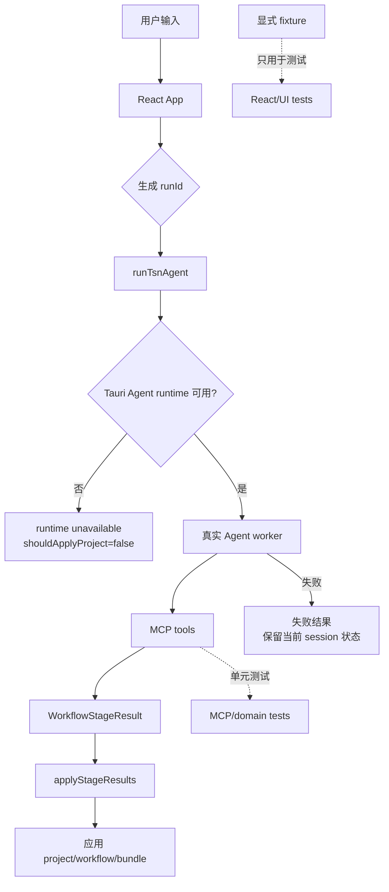
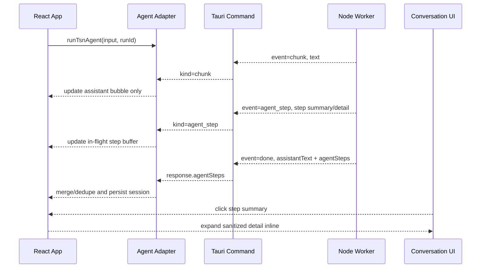
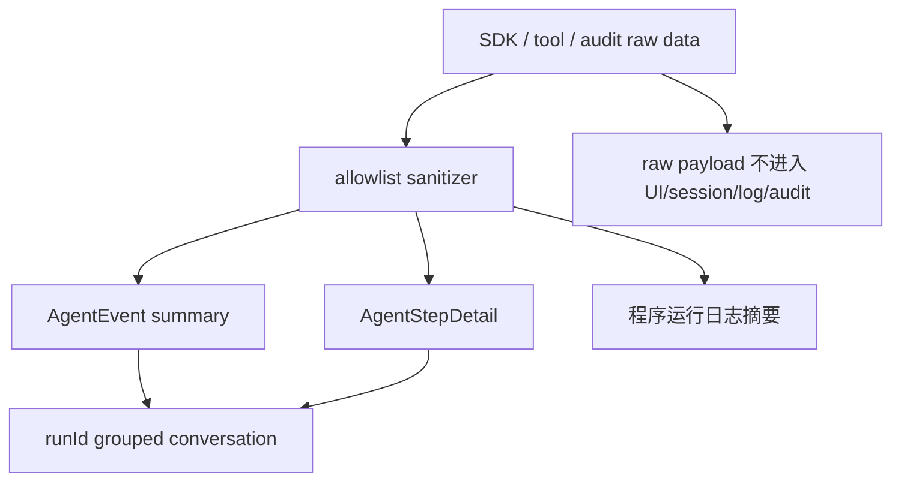

# feat+refactor: 移除 fake agent 运行时并整合 Agent 步骤摘要与日志体验

## Summary

本计划把两件高度耦合的事整合为一次落地：

1. **移除 fake agent 作为产品运行路径、Web 自动生成路径和真实 Agent 失败 fallback。** 运行时失败明确失败，确定性能力由 MCP/domain 单元测试覆盖，React/UI 测试使用显式 fixture，完整 E2E 使用真实 Agent 与 MCP 服务参与。
2. **整合 Agent 会话步骤与运行日志体验。** 主会话流展示业务回复和本轮步骤摘要，点击步骤摘要在会话内展开脱敏详情；侧栏“执行日志”改名为“日志”，定位为程序运行日志。

合并理由：两件事共用 `src/agent/agent-types.ts`、`src/agent/agent-adapter.ts`、`src/sessions/session-repository.ts`、`src/app/App.test.tsx`、`docs/testing.md`、`docs/diagnostics-log-contract.md`；UX 改造（runId、agent_step、步骤详情）必须建立在 fake agent 不再作为产品/fallback 路径的契约之上，分两次落地会让 adapter 协议来回改两遍。

本计划不建设通用 tracing 系统、不承诺完整细粒度 SDK tool trace 解析、不改变 topology MCP/阶段确认/project/bundle/plannerRun 业务行为。

---

## Problem Frame

**fake agent 当前承担的多重职责。**

- `src/agent/fake-agent.ts` 同时是自然语言模拟器、staged workflow 解释器、确定性单测目标和 Web 环境的“看起来能跑”的运行时；
- `src/agent/agent-adapter.ts` 先跑一遍 deterministic fake result，再在 Web/fake mode/失败 fallback 中返回 fake/fallback 结果；
- 真实 Agent 失败时 fallback 到 fake 结果，会让用户误以为请求成功，只是结果由另一套逻辑生成；
- 单元测试、本地域测试、UI 夹具测试和 Agent/MCP E2E 都依赖同一个“假智能助手”，导致测试目标混乱。

**会话呈现层把工具 trace 当对话正文。**

- worker 中 `extractOperationTraceEvents()` 生成文本 trace，通过 `emitOperationTrace()` 作为 `chunk` 发送，并由 `prependOperationTrace()` 拼进最终 assistantText；
- 主会话流同时承载自然语言回复、工具调用、工具结果和阶段 trace，信息密度高、顺序难扫，长内容被截断；
- 底部“执行步骤”和侧栏“执行日志”割裂，用户需要在“对话/执行步骤/执行日志”之间反复切换；
- “执行日志”命名误导用户把它当业务步骤记录。

**目标体验。**

- 缺少 Agent runtime 或真实 Agent 失败时 fail closed，系统显示错误并保留当前状态，不生成“看似成功”的本地项目；
- 用户在主会话流里看到当前 run 的 A/B/C/D 步骤摘要，点击在该步骤下方展开脱敏详情；
- 侧栏“日志”只展示 runtime、MCP、session、artifact、耗时、计数和错误等程序层信息；
- React/UI 测试使用显式命名 fixture；完整 E2E 通过真实 Agent 调 MCP 服务验证。

---

## Requirements

### 运行时边界

- **R1.** `runTsnAgent()` 不再调用 `runFakeTsnAgent()`，也不再返回 `mode: "fake"`。
- **R2.** Web/non-Tauri 环境不得自动生成拓扑或项目；缺少 Tauri Agent runtime 时返回明确的“智能助手运行时不可用”结果，不应用新 project/bundle。错误结果必须附带"下载桌面版" CTA（链接由 `VITE_DESKTOP_DOWNLOAD_URL` 提供；缺失时回退到 README 说明页），让 Web 不是死胡同。
- **R3.** 真实 Agent 调用失败时只保留当前 session 已有的 project/workflow/bundle，并返回错误说明；不生成新的默认拓扑或本地 fallback project。
- **R4.** `VITE_TSN_AGENT_MODE=fake` 不再作为产品能力保留；测试需要 fixture 时在测试层显式 mock。
- **R5.** 阶段推进、确认、导出门禁仍以 `WorkflowState`、`WorkflowStageResult`、project/bundle 为权威来源，不由测试 fixture 或运行日志推导。
- **R36.** Run 完整性不变量。
  - **Stall-timer 而非总时长：** worker 在 `stallTimeoutMs`（默认 90s，env `TSN_AGENT_STALL_TIMEOUT_MS` 配置）内若无任何 chunk/agent_step 推进，adapter 才合成 `kind: "agent_run_aborted"`、`status: "aborted"` 步骤并按 `AgentFailurePreservedStateResult` 终止；总时长上限沿用 Rust 端 `CLAUDE_BRIDGE_SYNC_TIMEOUT`（300s）。stall-timer 在收到 chunk 或 agent_step 时 reset。
  - **职责划分：** watchdog 由 adapter（U3b）创建终态步骤；session-repository normalize（U1）只迁移**跨 session 重启**残留的 pending 步骤（即没经过 watchdog 终态的旧 run），避免与 watchdog 重复创建。
  - **并发锁定：** 同一 session 内禁止并发 run——提交按钮在 pending 期间锁死。多窗口场景视为未来 follow-up，第一版假设单窗口。
- **R37.** 历史 fake-mode session 不强制重写其 project/bundle，但打开时在 `Session.metadata.legacyFakeOrigin = true`（schema 由 U1 在 session-repository normalize 中定义）；UI 在主会话顶部展示**可操作的提示卡**："本会话由旧本地模式生成，建议新开会话验证"——提供 **"复制需求新开会话"** 主操作按钮（生成新 session 并 prefill 原始 user message）和 **"我知道了"** 关闭按钮；关闭状态写入 `Session.metadata.legacyOriginAck = true`，相同 session 不再提示。继续推进阶段时按 R5 走真实 Agent，不信任旧 project 作为权威状态。

- **R6.** 将 `AgentEvent`、`AgentEventKind`、Agent result 等通用契约从 `src/agent/fake-agent.ts` 抽离到独立 `src/agent/agent-types.ts`，避免 session、adapter、UI 继续依赖 fake agent 模块。
- **R7.** Agent result 必须表达三种运行状态：真实 Agent 成功、真实 Agent 失败但保留当前状态、运行时不可用；后两者都不得伪装成生成成功。
- **R8.** `AgentEvent` 作为摘要时间线，保留 `id`、`kind`、`title`、`content`、`status`、`stage`、`skillName`、`createdAt`，并新增最小关联字段 `runId`、`traceId`、`sequence`、`toolUseId?`、`detailRef?`。`AgentEvent` 不保存 `children`、`diagnosticLogIds` 或完整 raw payload。
- **R9.** `AgentStepDetail` 只保存脱敏字段：`traceId`、`runId`、`toolUseId?`、`toolName?`、`inputSummary?`、`outputSummary?`、`errorSummary?`、`durationMs?`、`counts?`、`status`。
- **R10.** 同一个 `toolUseId` 在主会话流和持久化中只对应一个逻辑步骤：`tool_use` 创建 pending 步骤，`tool_result` 尽力更新为 success/error；缺失 `toolUseId` 或无法配对时显示独立未配对步骤；同一 run 内未配对步骤上限 30 条，超出时聚合为"其余 N 个未配对调用"。`traceId` 由 worker 生成稳定 UUID；不要把 `toolUseId` 直接当 `traceId`。
- **R11.** Worker、Tauri command、agent adapter、session repository 和 UI 共用同一套最小事件/详情契约，避免一边显示摘要、一边丢失详情。
- **R12.** `buildStageRunnerInput()`、conversation context 和 stage result application 不再依赖 deterministic fake result；改为只从当前 session、workflow、user intent 和真实 stage result 构造。

### 主会话与运行模型

- **R13.** 主会话流只展示用户需要阅读的自然语言回复、阶段摘要、确认提示和 Agent 步骤摘要，不再内联展示 `[工具]`、`[工具结果]`、`[文件]` 等操作 trace（旧 session 的清洗策略见 R27）。
- **R14.** 流式输出保留首 chunk 等待体验，但工具 trace 不作为普通 assistant 文本追加。
- **R15.** 每次用户请求生成一个 `runId`，用户消息、步骤摘要、assistant 回复、错误结果和相关日志都带同一个 `runId`。
- **R16.** 主会话流按 run 派生：用户消息 → 本轮步骤摘要组 → assistant 阶段摘要/确认提示；步骤编号采用数字 `1`/`2`/`3`（避免与阶段名混淆），run 内 reset；历史 run 默认保留摘要，不抢占当前 run 焦点。
- **R17.** Agent 步骤摘要必须作为主会话流的一部分展示，至少包含顺序、阶段、类型、状态、标题、短摘要和时间。
- **R18.** 点击某个步骤摘要后，在该步骤下方展开详情；第一版同一时间只展开一个步骤。窄屏沿用同一折叠详情，不引入第二种抽屉交互。
- **R19.** 步骤详情只展示脱敏摘要字段（工具名、输入摘要、输出摘要、错误摘要、`runId`、`traceId`、`toolUseId`、耗时、必要计数），不展示完整 raw payload。
- **R20.** 会话恢复后，步骤摘要和已保存详情仍可查看；旧 session 没有详情字段时优雅降级为摘要展示。
- **R21.** 底部配置区不再提供“执行步骤”作为独立主页签；步骤查看入口来自主会话流中的步骤摘要。

### 日志改名与隐私边界

- **R22.** 侧栏入口和抽屉标题从“执行日志”改为“日志”；副标题/空态说明体现“程序运行日志”定位。
- **R23.** 日志保存 runtime 连接、MCP 调用、session、artifact、耗时、计数和错误等开发排障摘要；日志不承担普通用户理解业务步骤的主入口。
- **R24.** 完整 prompt、完整 conversation context、raw stdout/stderr、完整 topology/changeSet/artifact、raw tool payload、凭证和请求头不得进入主会话流、步骤详情、普通日志或 worker audit 文件。
- **R25.** 步骤详情、日志和 worker audit 的摘要生成使用 allowlist sanitizer，未在 allowlist 内的 key 一律 drop（fail-closed），不做"截断后保留"。已知必须 drop 的字段示例：`prompt`、`conversationContext`、`messages`、`content`、`stdout`、`stderr`、`env`、`headers`、`cookie`、`authorization`、`full`、`topology`、`changeSet`、`artifact`。Sanitizer 在 dev 构建中保留 dropped key 名称列表（仅 key 名，不含值）作为元数据 `__droppedKeys`，便于发现新字段被静默丢；生产构建只保留 dropped key 计数。`agent_step` 单事件 payload ≤ 16KB（含 sanitize 后），单 run 总步骤 ≤ 200，超限时 worker 用聚合摘要替代并把事件状态标 `truncated`。
- **R26.** 诊断日志只记录运行时不可用、真实 Agent 调用失败、MCP/stage result 摘要等程序信息，不保存 raw prompt、raw tool payload 或完整 artifact。
- **R38.** Worker audit JSON 路径限定为 `<app_data_dir>/agent-runs/{sessionId}/{runId}.json`；POSIX 文件 mode 设为 `0600`（Windows 走等效 ACL）；按 session 保留最近 20 个 run，超出自动轮转；audit 文件不随 session export，需要复制时由用户显式 `导出运行 audit` 动作触发并提示。失败追加的 error step 也必须先过 sanitizer 再写入 session 和 audit。
- **R27.** 旧 session 中已内联的 `[工具]`、`[工具结果]`、`[文件]` trace 行，在打开 session 时一次性 normalize 写回脱敏版本，并在渲染主会话时再次清洗作为兜底（避免 export/backup 时残留旧 raw trace）。Normalize 失败时回退到 render-only 清洗并记入诊断日志。

### 用户可见文案

- **R28.** 用户可见文案使用“智能助手”“Agent”“智能助手运行时”等中性名称，不暴露底层供应商名。
- **R29.** 真实 Agent、fixture/UI smoke 和错误结果的用户可见文案都必须继续经过供应商名脱敏。Vendor 词表至少包含：`anthropic`、`Anthropic`、`Claude`、`claude-*`（模型名通配）、`api.anthropic.com`、`x-request-id`、`x-anthropic-*`、SDK 错误体内的 `model`/`request_id` 字段。Redactor 应用于：主会话错误气泡、`AgentStepDetail.errorSummary`、诊断日志 message、worker audit error 字段。

### 测试策略

- **R30.** 删除或迁移 `src/agent/fake-agent.test.ts` 中的 staged workflow 覆盖；拓扑生成/修改/模板/校验/project bridge 由 `src/topology/*.test.ts`、`src-node/mcp/topology-tools.test.ts`、`src/domain/topology-factory.test.ts`、`src/project/project-state.test.ts` 覆盖。
- **R31.** `src/app/App.test.tsx` 不再调用 `runFakeTsnAgent()`；React 测试使用显式命名 fixture，例如 `createTopologyWaitingConfirmationResult()`、`createAgentFailurePreservedStateResult()`、`createRuntimeUnavailableResult()`。
- **R32.** `src/agent/agent-adapter.test.ts` 不再验证 fake 模式；改为验证 runtime unavailable、真实 Agent stage result 应用、失败保留状态、诊断日志和 final response 合并去重。
- **R33.** 完整 E2E 必须有真实 Agent 和 MCP 服务参与；仍保留快速 UI smoke 时必须命名为 fixture/UI smoke，不能称作完整 E2E。
- **R34.** 现有 topology MCP、阶段确认、project/bundle/plannerRun 行为不因本计划改造改变。

### 文档

- **R35.** 更新 `docs/testing.md`、`docs/diagnostics-log-contract.md`、`docs/staged-agent-workflow.md`、`docs/topology-mcp.md`，移除“fake agent 是默认测试/回退路径”的描述，明确三层输出（主会话流、步骤详情、日志）的契约，并补充人工测试路径。

---

## Scope Boundaries

### 本计划包含

- 删除 fake agent 在产品运行时、Web 运行时和真实 Agent 失败 fallback 中的职责。
- 抽离通用 Agent contract（types + step detail + sanitizer），让 session/adapter/UI 不再从 `src/agent/fake-agent.ts` import。
- 改造 worker 事件通道：trace 由 `chunk` 改为 `agent_step`，audit 隐私边界对齐。
- 改造 adapter：fail closed + run 模型 + final response 作为持久化权威源。
- 将当前 fake agent 单元测试迁移为 MCP/domain/project-state 测试。
- 用显式 fixture 重写 React/UI 测试，并把步骤摘要嵌入主会话流，支持点击展开。
- 将“执行日志”UI 文案改为“日志”，并把内容边界收敛为程序运行日志；worker audit 纳入同一隐私边界。
- 建立 fixture/UI smoke 与 real-agent E2E 的命名边界。
- 更新文档（testing、diagnostics-log-contract、staged-agent-workflow、topology-mcp）。

### 本计划不包含

- 新增 topology MCP 能力、拓扑模板或双平面规则。
- 重新设计 TSN 拓扑、流量规划、仿真导出业务逻辑。
- 建设完整 tracing 系统、远程 telemetry 或日志导出包。
- 展示未脱敏 raw tool payload、完整 prompt/context、完整大 JSON。
- 对每个 MCP server 做专门详情 renderer，例如 topology operation diff 可视化。
- 日志与步骤详情的双向跳转或诊断包导出（第一版只共享 `runId` / `traceId` 作为排障定位）。
- ~~在本计划中决定所有桌面 E2E 工具选型~~ **已决定：** real-agent E2E 使用 Tauri 原生 `tauri-test` + `cargo test` 打通 Rust 侧 `run_claude_agent` 命令路径；不引入 Playwright desktop / tauri-driver。详见 U8。

### Deferred to Follow-Up Work

- 多 run 聚合视图、按工具名/阶段的高级过滤和全文搜索。
- 用户显式导出诊断包。
- 对每个 MCP server 的专门详情 renderer。
- 更完整的 SDK `tool_use/tool_result` 细粒度解析；第一版只做 best-effort 摘要化。

---

## Key Technical Decisions

- **运行时 fail closed。** 缺少 Agent runtime 或真实 Agent 失败时，系统显示错误并保留当前状态，不生成“看似成功”的本地项目。
- **fixture 不是 agent。** 测试可以有确定性 fixture，但 fixture 是命名数据构造器，只服务单元/组件/UI smoke，不解析自然语言，也不模拟完整 Agent。
- **MCP/domain 对自己的确定性负责。** topology 初始化、节点/链路 CRUD、模板目录、校验、project bridge 等固定逻辑由 MCP/domain 测试覆盖，不通过 fake agent 间接证明。
- **完整 E2E 包含真实 Agent。** 产品级端到端验证覆盖“用户自然语言 → 真实 Agent → MCP 工具 → stage result → UI/session/project”链路；fixture smoke 只验证 UI 不坏。
- **adapter 只负责真实 Agent 编排和结果应用。** `src/agent/agent-adapter.ts` 不再先跑一遍 deterministic result，不再把 deterministic result 作为 stage result fallback。
- **保留状态是安全恢复，不是 fallback。** 失败时保留已有 session 状态（project/workflow/bundle 不动）。
- **生成默认拓扑是要删除的 fallback。** 失败后系统不得创建任何新的 default project/topology；没有现有 project 时就保持没有，UI 提示用户重试。
- **Run 完整性 watchdog。** worker 异常/通道丢失/超时由 adapter 兜底合成 `agent_run_aborted` 步骤；session 恢复时把仍 pending 的步骤迁移为 `unknown`；不允许同 session 并发 run。详见 R36。
- **Web fail-closed 但不留死胡同。** Web/non-Tauri 环境必须 fail-closed，但错误结果带"下载桌面版" CTA，避免用户进入无下一步状态。详见 R2。
- **历史 fake-mode session 标记。** 不重写已生成的 project/bundle，但打 `legacyFakeOrigin` 标记并在主会话顶部提示。详见 R37。
- **Sanitizer 可观测性。** dev 构建保留 dropped key 名称列表作为元数据，避免新字段被静默丢；生产仅保留计数。详见 R25。
- **MVP 先做垂直切片。** 第一版只解决主会话降噪、run 分组步骤摘要、可展开脱敏详情、日志改名和隐私边界；完整 tracing、专门 renderer、双向日志关联推迟。
- **`AgentEvent` 仍是摘要时间线，不是工程状态权威来源。** 阶段结果仍以 `workflow.stages[stageId]` 为准，工程文件仍以 project/artifact 状态为准，日志仍以 diagnostics 为准。
- **步骤详情独立于 `AgentEvent`。** `AgentEvent` 保留稳定摘要和 `detailRef`/`traceId`；详情使用 `AgentStepDetail` 保存已脱敏字段。
- **`done` response 是持久化权威源。** worker 内存累计规范化后的 `agentSteps`，流式 emit 只服务运行中体验；`done` stdout 和 Tauri response 返回 `agentSteps`，adapter 用 final response 合并去重后保存 session。
- **一个 `toolUseId` 对应一个逻辑步骤。** `tool_use` 创建 pending，`tool_result` 尽力更新同一步骤；缺失配对时按独立 best-effort 步骤展示。
- **主会话按 `runId` 派生展示。** App 在创建本轮用户/assistant 消息前生成 `runId`，传给真实 Agent 或测试 fixture；同一 run 的消息、步骤、错误和日志通过 `runId` 归属。
- **详情交互固定为会话内折叠。** 同一时间只展开一个步骤，避免桌面/移动端两套交互分叉。
- **日志 UI 标题改为“日志”，副标题说明“程序运行日志”。** 内部 `diagnostics` 命名可保留，避免不必要大重命名。
- **隐私边界以 allowlist 为准。** 步骤详情、日志、worker audit 都只能保存允许字段的摘要、计数、状态和 id；禁止 raw-bearing key 直接落盘。
- **旧 session 显示时清洗历史 trace。** 新契约不追溯强制迁移所有旧数据，但渲染主会话时必须隐藏或清洗历史 `[工具]` trace 行。

---

## High-Level Technical Design

---

## Implementation Units

### U1. 定义 Agent contract 与 step 详情契约（含 sanitizer）

**Goal:** 明确 `AgentEvent` 摘要、`AgentStepDetail` 详情、ID 语义和 allowlist sanitizer，把 Agent 通用类型从 fake-agent 抽离，避免 worker/Tauri/adapter/UI 各自发明字段。

**Requirements:** R6, R7, R8, R9, R10, R11, R19, R24, R25, R28, R29

**Dependencies:** None

**Files:**

- Add: `src/agent/agent-types.ts`
- Add: `src/test/agent-result-fixtures.ts`
- Modify: `src/sessions/session-repository.ts`
- Test: `src/sessions/session-repository.test.ts`

**Approach:**

- 把 `AgentEventKind`、`AgentEvent`、Agent result 基础字段从 `src/agent/fake-agent.ts` 迁到 `src/agent/agent-types.ts`。
- 将 `TsnAgentResult.mode` 从 `"claude" | "fake"` 改为三态 union，建议命名：`AgentSuccessResult`（真实 Agent 成功）、`AgentFailurePreservedStateResult`（失败保留当前 session）、`AgentRuntimeUnavailableResult`（运行时不可用）。adapter 和 adapter.test.ts 使用这三个具名类型做类型判断和断言；最终字段名可在实现阶段结合现有调用点微调。
- 在 `AgentEvent` 上只增加最小关联字段：`runId`、`traceId`、`sequence`、`toolUseId?`、`detailRef?`。不增加 `children`、`diagnosticLogIds`、raw payload。
- 定义 `AgentStepDetail` 类型，只保存已脱敏字段。
- ID 词汇表：`runId` 表示一次用户请求/Agent run；`traceId` 表示一个逻辑步骤；`toolUseId` 只用于 tool call/result 配对；`sequence` 用于 run 内稳定排序。
- 定义 `sanitizeAgentStepDetail()` helper，使用 allowlist 字段生成摘要，默认丢弃 raw-bearing key。
- 在 `src/test/agent-result-fixtures.ts` 提供命名 fixture builder：`createTopologyWaitingConfirmationResult()`、`createAgentFailurePreservedStateResult()`、`createRuntimeUnavailableResult()`，以及可展开步骤的 builder。
- `session-repository` normalize 时接受旧事件缺少新字段；旧 assistant message 中的 `[工具]` 行渲染时由 U6 隐藏/清洗。
- **U1 → U4 过渡兼容：** `src/agent/fake-agent.ts` 在 U1 中继续保留，但只 re-export `src/agent/agent-types.ts` 中的 `AgentEvent`、`AgentEventKind` 等类型，避免 U2/U3 build 期间出现循环依赖；U4 完成 fake-agent.ts 删除后这些 re-export 自然消失。

**Test scenarios:**

- 旧 session payload 中的 `agentEvents` 能 normalize 成新类型，缺失字段降级。
- adapter result 类型不需要 fake mode 也能覆盖成功、失败保留和 runtime unavailable。
- fixture builder 生成的 stage/tool/artifact 事件都有可展开详情。
- `sanitizeAgentStepDetail()` 对 `prompt`、`conversationContext`、`stdout`、`stderr`、`headers`、`authorization`、`full.topology` 等字段默认丢弃。**Allowlist 出现字段限定为：** `traceId`、`runId`、`toolUseId`、`toolName`、`status`、`inputSummary`、`outputSummary`、`errorSummary`、`durationMs`、`counts`、`createdAt`。未列出的 key 一律 drop（fail-closed），不做"截断后保留"。例如 `full.topology` 整体 drop；只有派生的 `counts.nodes` / `counts.links` 可保留为数值。
- 供应商名出现在 fixture detail、真实 detail 或错误结果时，用户可见内容被脱敏。

**Verification:**

- `rg "from \"../agent/fake-agent\"" src` 在非测试文件中无命中。
- 类型层面不要求每个旧 `AgentEvent` 都有详情；新事件有稳定 ID 和最小详情。

---

### U2. 改造 worker 事件通道与 audit 隐私边界

**Goal:** worker 不再把 operation trace 作为 `chunk` 写入对话，而是 best-effort 生成 `agent_step` 摘要事件，并通过 final response 权威回传；worker audit JSON 对齐 allowlist 边界。

**Requirements:** R13, R14, R24, R25, R26, R34

**Dependencies:** U1

**Files:**

- Modify: `src-node/claude-agent-worker.mjs`
- Modify: `src-node/claude-agent-worker.test.mjs`
- Modify: `src-tauri/src/commands.rs`
- Test: `src-node/claude-agent-worker.test.mjs`

**Approach:**

- `extractOperationTraceEvents()` 的输出从“文本 trace”调整为 `agent_step` draft；第一版只复用现有可稳定获得的工具名、摘要、状态、`toolUseId`。
- `emitOperationTrace()` 不再调用 `onEvent({ event: "chunk" })`；改为流式发送 `event: "agent_step"`。
- worker 在内存中累计规范化后的 `agentSteps`；`done` stdout 和 Tauri `run_claude_agent` response 都返回 `agentSteps`。
- `prependOperationTrace()` 不再把工具 trace 拼入最终 assistantText；最终回复只包含模型自然语言和必要阶段结果文案。
- 对有 `toolUseId` 的 call/result 尽力合并为一个逻辑步骤；缺失配对时保留独立 best-effort 步骤。
- Tauri `ClaudeWorkerEvent` 识别 `agent_step`，通过前端 event bridge 发送 `kind: "agent_step"`，并在 final response 中保留 `agentSteps`。
- worker audit JSON 只保存摘要、计数、状态、fingerprint 和短 id；不保存完整 prompt、完整 conversation context、raw stdout/stderr、raw tool payload、完整 topology/changeSet/artifact。

**Test scenarios:**

- operation trace 产生 `agent_step`，包含 `runId`、`traceId`、`sequence`、工具名和摘要。
- `done` response 返回与流式事件可去重的 `agentSteps`。
- 同一 `toolUseId` 的 call/result 在 final `agentSteps` 中合并为一个逻辑步骤。
- 工具失败时步骤状态为 error，摘要包含脱敏错误。
- 最终 `assistantText` 不包含 `[工具]`、`[工具结果]`、`[文件]` 前缀。
- `latest.json` 或 audit 输出不包含完整 prompt/context/raw payload。
- topology MCP、阶段确认、project/bundle/plannerRun 相关字段仍从原有 stage/project/artifact 路径返回，不被 `agent_step` 替代。

**Verification:**

- 真实 Agent 运行时，聊天气泡不再出现工具 trace；即使流式事件丢失，final response 仍能保存步骤摘要。

---

### U3a. Adapter fail-closed 与三态结果

**Goal:** `src/agent/agent-adapter.ts` 只编排真实 Agent、stage result 应用和失败保留状态，不再生成 deterministic fake result。无 `runId`、`agent_step`、UI 派生逻辑——纯后端三态契约。

**Requirements:** R1, R2, R3, R5, R7, R12, R32, R34, R37

**Dependencies:** U1, U2

**Files:**

- Modify: `src/agent/agent-adapter.ts`
- Modify: `src/agent/agent-adapter.test.ts`
- Test: `src/agent/agent-adapter.test.ts`

**Approach:**

- 删除 `runFakeTsnAgent()` 调用、`deterministicResult`、`preserveResult` 和 `shouldUseDeterministicOnly()` 对最终结果的影响。
- non-Tauri 或 Agent runtime 不可用时返回 `AgentRuntimeUnavailableResult`：`shouldApplyProject=false`，assistantText "智能助手运行时不可用"，附带 R2 的 "下载桌面版" CTA（链接由 `VITE_DESKTOP_DOWNLOAD_URL` 注入）。
- 真实 Agent 抛错时返回 `AgentFailurePreservedStateResult`，`failureReason: "agent_error"`，assistantText "智能助手返回错误，已保留当前状态"。
- Watchdog stall-timer 超时时返回 `AgentFailurePreservedStateResult`，`failureReason: "stall_timeout"`，assistantText "运行长时间未推进，已中止；可以重试或简化请求"。
- 真实 Agent 成功返回但 stage result 缺失或非法时（"软失败" shadow path）：归类为 `AgentFailurePreservedStateResult`，`failureReason: "no_stage_result"`，记录 `applyStageResults()` rejection summary 到诊断日志；不创建 fallback project。
- 已有 project/workflow/bundle 在所有失败状态下原样保留，没有已有 project 时不创建默认 project。
- `buildEmptySessionContext()` 从 "fake 结果摘要" 改为 "空项目/当前 workflow 提示"；`buildStageRunnerInput()` 从当前 session/workflow 构造，不依赖 fake result。
- 历史 fake-mode session 在 normalize 阶段打 `legacyFakeOrigin: true`（R37）；adapter 推进时按 R5 走真实 Agent，不信任旧 project 作为权威状态。
- 诊断日志消息从 "已回退本地模式" 改为 "请求失败，已保留当前状态"。
- 错误体经 R29 vendor redactor 处理后才进入 `assistantText` 和 `errorSummary`。

**Test scenarios:**

- non-Tauri 环境调用 `runTsnAgent()` 返回 `AgentRuntimeUnavailableResult`，assistantText 含 CTA 链接占位。
- 真实 Agent 成功 + 合法 stage result：adapter 应用 project/workflow。
- 真实 Agent 成功 + 无效/缺失 stage result：不生成 fallback project，记录 rejection。
- 真实 Agent 抛错 + session 有 project：保留原 project/workflow/bundle。
- 真实 Agent 抛错 + session 无 project：结果不含新 project/bundle。
- 错误体含 "anthropic" / "Claude" 时，`assistantText` 与 `errorSummary` 中 vendor 词被脱敏。
- 打开 `legacyFakeOrigin` 标记的 session 时，adapter 推进仍调用真实 Agent，不信任旧 project。
- 诊断日志不再出现 "fake 模式" "回退本地模式" 文案。

**Verification:**

- `rg "runFakeTsnAgent\\(" src/agent/agent-adapter.ts` 无命中。
- adapter 测试覆盖三态结果各自的字段约束。

---

### U3b. Tauri event 通道与 agent_step listener

**Goal:** 扩展 Tauri `ClaudeAgentEventPayload` 承载结构化 `agent_step`；adapter 收到 chunk 和 agent_step 走不同路径；不改 UI 派生逻辑（留给 U3c/U6）。

**Requirements:** R11, R20, R36

**Dependencies:** U1, U2, U3a

**Files:**

- Modify: `src/agent/agent-adapter.ts`
- Modify: `src-tauri/src/commands.rs`
- Modify: `src/sessions/session-repository.ts`
- Test: `src/agent/agent-adapter.test.ts`
- Test: `src/sessions/session-repository.test.ts`

**Approach:**

- 扩展 `ClaudeAgentEventPayload` 增加 `step: Option<serde_json::Value>` 字段，承载结构化 step payload；保留 `text/session_id/kind` 现有字段。U2 worker 端的 step envelope 走该字段。Rust 端 serde 配置 `default` 容错，未知 kind 不报错而是 forward。
- `listenToClaudeChunks()` 拆为 `listenToRunEvents()`，根据 `kind` 分发到 `onChunk(text)` 或 `onAgentStep(payload)` 两个 callback。
- 收到 `chunk` 仅更新 pending assistant 气泡（沿用 U3a 行为）；收到 `agent_step` 仅 push 到 in-flight step buffer，不追加 assistant 文本。
- adapter 提供 watchdog（R36）：发起 run 后 60s 内未收到 `done` 时合成 `agent_run_aborted` step 并按 `AgentFailurePreservedStateResult` 终止。
- session-repository normalize 时把仍 `pending` 的步骤迁移为 `unknown`/`aborted`，避免 session 恢复后出现永远 pending 的孤儿步骤。

**Test scenarios:**

- Tauri 转发 `agent_step` 事件被 adapter 区分进 step buffer，不污染 assistantText。
- Tauri 接收到未知 `kind` 不 panic，原样丢给前端日志。
- watchdog 在 60s 内未收到 done 时合成 `agent_run_aborted` step。
- session 恢复时把旧 pending 步骤标为 `unknown`。
- `agent_step` 单事件超过 16KB 时被 worker 标记 `truncated`（与 U2 协同验证）。

**Verification:**

- adapter 不再有 single-event listener 串入多种数据类型。
- Tauri 单测覆盖 envelope 反序列化与 forward 行为。

---

### U3c. App 层 runId 派生与 final response 合并去重

**Goal:** App 在创建本轮消息前生成 `runId`，把消息、流式步骤、final response 步骤按 `runId/traceId/toolUseId/sequence` 合并去重；同 session 并发 run 锁死。

**Requirements:** R15, R16, R20, R32, R34, R36

**Dependencies:** U1, U2, U3a, U3b

**Files:**

- Modify: `src/app/App.tsx`
- Modify: `src/sessions/session-repository.ts`
- Test: `src/app/App.test.tsx`
- Test: `src/sessions/session-repository.test.ts`

**Approach:**

- App 在创建本轮 pending user/assistant message 前生成 `runId`（crypto.randomUUID），传给 `runTsnAgent`；同一 `runId` 写入本轮两条消息和所有 step 事件。
- 运行完成后，以 final response `agentSteps` 为持久化权威源，与 in-flight step buffer 按 `runId, traceId, toolUseId, sequence` 去重合并；流式作为 fallback 权威源——若 `done` 解析失败，把 in-flight buffer 落地为权威，并标 `partial=true`。
- **跨 trust boundary 再 sanitize：** worker 是 Node 子进程，npm 供应链不在本 app 信任域内；adapter 把 final response 的 `agentSteps` 落 session 前必须再跑一次 `sanitizeAgentStepDetail()` + `redactVendorNames()`，把可能被注入的 raw-bearing key 兜底去掉。
- 失败但已收到部分步骤时仍保存这些步骤并追加错误步骤（已过 sanitizer & redactor）。迟到事件按 `runId` 归属，不写入当前可见 run。
- 旧 session 没有 `runId` 时按 `createdAt` 降级排序，不尝试重建完整 run。
- 同 session 提交按钮在 pending 期间锁死（防止并发 run 互相覆盖 in-flight buffer）。

**Test scenarios:**

- 用户消息、assistant 回复和 steps 共享同一 `runId`。
- session 保存 assistantText 和 agentEvents/detail，二者内容不重复。
- 同一 `traceId` 重复到达时只保存一次。
- `done` 解析失败时 in-flight buffer 作为 fallback 权威源，run 标 `partial=true`。
- 切换 session 后旧 run 迟到事件不写入新 session 当前 run。
- pending 期间再次点击提交无效（按钮锁死）。
- 阶段确认仍能推进，project/bundle/plannerRun 仍按原行为生成或保留。

**Verification:**

- 主会话可按 run 派生步骤摘要；session 恢复后步骤归属稳定。

---

### U4. 删除 fake-agent 模块并下沉确定性单测

**Goal:** 删除 `src/agent/fake-agent.ts` 作为自然语言模拟器，把它承载的确定性断言下沉到 MCP/domain/project-state 测试。

**Requirements:** R4, R5, R12, R30, R34

**Dependencies:** U1, U3a

**Files:**

- Delete: `src/agent/fake-agent.ts`
- Delete or replace: `src/agent/fake-agent.test.ts`
- Modify: `src/topology/initialize.test.ts`
- Modify: `src/topology/operations.test.ts`
- Modify: `src/topology/inspect.test.ts`
- Modify: `src/topology/intermediate.test.ts`
- Modify: `src/topology/templates.test.ts`
- Modify: `src/topology/artifacts.test.ts`
- Modify: `src/topology/project-bridge.test.ts`
- Modify: `src/topology/tool-result.test.ts`
- Modify: `src-node/mcp/topology-tools.test.ts`
- Modify: `src/domain/topology-factory.test.ts`
- Modify: `src/project/project-state.test.ts`

**Approach:**

- **覆盖等价 gate（前置）：** 在删除 `src/agent/fake-agent.ts` 之前，必须先在本 Unit 的 Approach 文档里产出一份"原 it → 新位置"映射表（每个 it 标注"迁移到 X / 故意删除（属于真实 Agent E2E）"），并通过 PR 内 reviewer check off。
- 按映射表把 fake-agent 测试拆分：拓扑规模/模板/双平面规则进入 topology/MCP 测试；阶段确认和 workflow 门禁进入 project-state 测试；导出 bundle 进入 exporter/artifact 测试。
- 删除自然语言"继续/确认/改成 N 台"等模拟智能助手行为的测试；这些属于真实 Agent E2E 或 prompt/skill 层，不属于确定性单元测试。
- 对仍需要保留的 domain parser 覆盖，直接测试 `parseTopologyIntent()` 或 MCP 工具输入输出，不绕过 fake agent。
- 同步更新 `docs/topology-mcp.md` 移除 "fake agent 作为 topology bridge" 的描述（属于本 Unit，避免延后到 U9）。

**Test scenarios:**

- topology MCP 初始化模板的节点/链路/端口 summary 稳定。
- topology operations 对节点/链路增删改查的合法、缺参、歧义、重复 ID 场景稳定。
- project-state 对 waiting confirmation、confirm、request changes、final stage completion 的状态转换稳定。
- exporter/artifact 对已验证 project 生成 bundle 稳定。

**Verification:**

- `rg "runFakeTsnAgent" src` 无命中。
- `rg "VITE_TSN_AGENT_MODE" src` 无命中。
- 映射表中所有 "迁移" 类条目对应的新测试存在且通过；"故意删除" 类条目在 PR description 显式列出。

---

### U5. 用显式 fixture 重写 React/UI 测试

**Goal:** 保留快速 UI 行为测试，但不通过 fake agent 解析自然语言生成结果；测试名描述 UI 状态。

**Requirements:** R28, R29, R31, R34

**Dependencies:** U1, U3a, U3c

**Files:**

- Modify: `src/test/agent-result-fixtures.ts`
- Modify: `src/app/App.test.tsx`
- Modify: `vitest.config.ts` if fixture aliases or setup changes are needed

**Approach:**

- App tests mock `runTsnAgent()` 时直接返回 fixture；测试名描述 UI 状态（"拓扑待确认""Agent 失败保留状态""运行时不可用"），不描述 fake agent 行为。
- 对长时间运行、streaming chunk、日志入口、步骤摘要展开等 UI 行为继续用 deferred promise 和 fixture 控制。
- fixture 允许复用 domain/project builder，但不接收自然语言并解析成拓扑。
- 增加 fixture 用例覆盖：含 `runId` + 多步骤的成功结果、含错误步骤的失败保留结果、runtime unavailable 结果。
- **vitest setup 强制 mock：** 在 `vitest.config.ts` 或全局 setup 中默认让 `runTsnAgent` 抛错，强制每个测试显式选择 fixture；防止漏 mock 时悄悄走 runtime unavailable 路径让断言假阳性。

**Test scenarios:**

- 用户提交输入后，UI 显示运行中状态，fixture resolve 后展示拓扑待确认。
- runtime unavailable result 不创建拓扑，不开启导出成功状态。
- failure preserved result 保留已有拓扑和 workflow，并显示错误说明。
- 步骤摘要/日志 UI 使用 fixture 事件渲染，不依赖真实 Agent 或 fake agent。

**Verification:**

- `rg "runFakeTsnAgent\\(" src` 在测试中无命中。
- 所有 React 测试通过且不依赖 `src/agent/fake-agent.ts`。

---

### U6. 主会话流嵌入步骤摘要并支持展开详情

**Goal:** 移除底部独立"执行步骤"页签，把步骤摘要按 run 放入主会话流，支持点击展开脱敏详情；定义事件→destination 路由表与步骤卡状态机；并在打开旧 session 时一次性 normalize 写回脱敏版本（兜底配 render-time 清洗）。

**Requirements:** R2, R13, R16, R17, R18, R19, R20, R21, R27, R34, R37

**Dependencies:** U1, U2, U3a, U3b, U3c

**Files:**

- Modify: `src/app/App.tsx`
- Modify: `src/app/App.css`
- Test: `src/app/App.test.tsx`

**Approach:**

- 从 `CONFIG_TABS` 中移除 `steps` 页签。
- 主会话流按 run 渲染：用户消息 → 步骤摘要组 → assistant 回复/确认卡片。当前 run 展示步骤摘要；历史 run 折叠为"本轮 N 个步骤"摘要并带时间戳（如 "12:34 第 3 轮 (4 个步骤, 1 个错误)"）；失败 run 默认展开摘要（不展开详情）方便回看。
- 步骤摘要卡片展示 run 内编号（数字 1/2/3，而非字母——避免和阶段 letter 冲突）、状态、阶段、类型、标题和一行摘要；长文本截断。
- 点击步骤摘要后在该步骤下方展开详情；同一时间只展开一个步骤。再次点击关闭，点击其他步骤切换（自动关闭上一个）。详情字段化展示：概览、工具名、输入摘要、输出摘要、错误摘要、时间、耗时、`runId`、`traceId`、`toolUseId`。
- 无详情的旧事件显示摘要内容和"该步骤没有保存更多详情"降级状态。
- **旧 session 一次性 normalize：** 在 session 打开路径中把 assistant message 里历史 `[工具]` / `[工具结果]` / `[文件]` trace 行重写为脱敏版本写回 session JSON（R27）；normalize 失败时仅 render-time 清洗作为兜底并写诊断日志。
- **历史 fake-mode session 提示条：** 当 session 含 `legacyFakeOrigin: true` 时（R37），主会话顶部展示一次性提示条 "本会话由旧本地模式生成，建议新开会话验证"。
- **Runtime unavailable CTA：** 错误结果在主会话中作为独立卡片渲染，包含 "下载桌面版" CTA（来自 R2 的 `VITE_DESKTOP_DOWNLOAD_URL`）。
- 可访问性：步骤摘要使用 button；`aria-expanded` 和 `aria-controls` 指向详情区域；Enter/Space 打开；Escape 关闭并把焦点还给触发按钮；运行中新增步骤使用 `aria-live="polite"`；触摸目标不小于 36px；长摘要 wrap，详情 JSON/文本有 max-height 和 scroll；展开新步骤时触发 `scrollIntoView({ block: "nearest" })` 锁住视口，关闭旧步骤时把焦点还给原触发按钮。

**Step-card state machine（必须覆盖）：**

| 状态 | 触发 | 视觉 | 可点击 |
| --- | --- | --- | --- |
| `pending` | 收到 `tool_use` 未配对 `tool_result` | 灰底 + 旋转点 spinner | 可（展开看输入摘要） |
| `streaming` | 收到部分 `tool_result` 还在累计 | 灰底 + 进度条 | 可 |
| `success` | 配对 `tool_result` 成功 | 默认风格 + ✓ | 可 |
| `error` | 配对 `tool_result` 失败 | 红边 + 错误图标 | 可（详情显示 errorSummary） |
| `no-detail`（legacy） | 旧事件无 `detailRef`/`traceId` | 默认 + 灰色 "无详情" badge | 可（详情显示降级提示） |
| `orphan` | 仅 `tool_result` 无 `tool_use` | 默认 + 黄色 "未配对" badge | 可 |
| `aborted` | watchdog 合成（R36）或 session 恢复迁移 | 灰底 + 中止图标 | 可（详情显示 "本步骤未完成"） |

**Event → destination routing：**

| 事件类型 | 主会话气泡 | 步骤摘要卡 | 步骤详情 | 程序运行日志 | worker audit |
| --- | --- | --- | --- | --- | --- |
| Assistant 自然语言文本 | ✅ | — | — | — | 摘要 |
| 阶段确认提示 | ✅（卡片） | — | — | — | 摘要 |
| `tool_use` / `tool_result` | — | ✅ | ✅ | — | 摘要 |
| Runtime unavailable | ✅（错误卡 + CTA） | — | — | ✅（错误） | 摘要 |
| Agent 抛错（失败保留） | ✅（错误卡） | ✅（追加 error 步骤） | ✅（errorSummary） | ✅（错误） | 摘要 |
| MCP 警告 / sanitizer rejection | — | — | — | ✅ | 摘要 |
| Watchdog 合成 aborted（R36） | — | ✅（aborted 步骤） | ✅（提示未完成） | ✅ | 摘要 |
| Run 完成总览 | — | — | — | ✅（runId/stepCount/errorCount） | 完整 audit |

**Test scenarios:**

- 主会话流展示本轮多条步骤摘要，点击第一条后在下方展开详情。
- 同一 `toolUseId` 的 call/result 在主会话流显示为一张逻辑步骤卡。
- 失败步骤在摘要和详情中都有 error 状态。
- 七态步骤卡（pending/streaming/success/error/no-detail/orphan/aborted）各自的视觉与展开行为可测试。
- Runtime unavailable 在主会话出现独立错误卡 + "下载桌面版" CTA 链接。
- `legacyFakeOrigin: true` 的 session 在主会话顶部显示提示条。
- 旧 session 事件没有详情时，详情区显示降级提示。
- 打开旧 session 时一次性 normalize：assistant message 中的 `[工具]` 行被写回脱敏版本（session JSON 内容变化可断言），并在 render 时再做兜底清洗。
- normalize 失败回退路径走 render-only 清洗并写诊断日志。
- 超长输出只在详情中显示截断摘要，布局不被撑开。
- Accessibility：`aria-expanded`、`aria-controls`、Escape 焦点回退、`aria-live="polite"` 行为；展开新步骤时 `scrollIntoView` 行为；触摸目标 ≥ 36px。
- 窄屏下详情不遮挡输入框和主拓扑画布；扩展时滚动视口锁定。
- 底部配置区不再出现"执行步骤"页签。
- 阶段确认提示仍贴近对应 assistant 回复。

**Verification:**

- 用户可以直接在会话流完成“扫摘要 → 点 A → 看 A 详情 → 点 B → 看 B 详情”操作。

---

### U7. 重命名"执行日志"为"日志"，落实 audit 存储/保留边界

**Goal:** 把面向用户的"执行日志"改名为"日志"，文案明确是程序运行日志；日志和步骤详情共享 `runId` / `traceId` 用于排障，但不互相反向索引。同时落实 worker audit 的路径/文件 mode/保留策略（R38）。

**Requirements:** R22, R23, R24, R25, R26, R34, R38

**Dependencies:** U2, U3a

**Files:**

- Modify: `src/app/App.tsx`
- Modify: `src/ui/diagnostics/DiagnosticsDrawer.tsx`
- Modify: `src/diagnostics/diagnostic-log.ts`
- Modify: `src/diagnostics/app-diagnostics.ts`
- Modify: `src-tauri/src/commands.rs`（新增 `export_run_audit`）
- Modify: `src-tauri/tauri.conf.json`（capability 加 `dialog:default`）
- Test: `src/app/App.test.tsx`
- Test: `src/ui/diagnostics/DiagnosticsDrawer.test.tsx`
- Test: `src/diagnostics/app-diagnostics.test.ts`

**Approach:**

- 将 `WorkspaceToolRail`、`workspacePanelLabel()`、抽屉标题、空态和测试断言中的"执行日志"改为"日志"。
- 抽屉副标题或空态说明使用"程序运行日志"。
- 日志筛选保留当前结构，用户可见标签收敛为"全部 / 运行时 / Agent / 会话 / 文件 / 错误"或等价文案。
- 日志条目标题采用程序语义，例如"运行完成 · 7 个步骤 · 1 个错误"，避免复用业务阶段标题作为主标题。
- 日志 details 可增加轻量 run summary：`runId`、`stepCount`、`errorStepCount`、`traceIds`、`droppedKeysCount`（来自 sanitizer R25）；不保存完整 step detail，不保存 `diagnosticLogIds` 反向索引。
- 保持 `DiagnosticLogEntry.details` 最大长度、深度和敏感 key 脱敏规则，并迁移到 allowlist 方向。
- **Audit 边界落实（R38）：** 在 `app-diagnostics.ts` 或 `claude-agent-worker.mjs` 落实 worker audit 路径 `<app_data_dir>/agent-runs/{sessionId}/{runId}.json`，POSIX `0o600` / Windows 等效 ACL；按 session 保留最近 20 条 run，超出自动轮转最旧一条；export session 时不附带 audit。
- **历史 audit 迁移：** 旧版 `{timestamp}-{runId}.json` 和 `latest.json` 在 worker 启动时一次性 migrate 到新 `{runId}.json` schema（含旧 timestamp prefix 解析），`latest.json` 仅作为软链/复制保留 1 个 run 周期后删除；migration 失败不阻塞写入，记录诊断日志。
- **`export_run_audit` Tauri command：** Files 列表新增 `src-tauri/src/commands.rs`。命令签名 `export_run_audit({ sessionId: String, runId: String, destination: PathBuf })`；`sessionId`/`runId` 必须匹配 UUID-like 正则（拒绝 `..`/`/`/`\\`/NUL），canonicalize 后路径必须落在 `<app_data_dir>/agent-runs/` 下；`destination` 走 `tauri-plugin-dialog` save dialog 强制用户选目录（不接受 renderer 传入裸路径）；复制前再过一遍 sanitizer + 弹窗显示"将导出 N 个步骤摘要，0 raw payload"提示。UI affordance：在日志抽屉中每条 Agent run 完成记录右侧加 "导出 audit" 链接按钮（U7 Files 中 `DiagnosticsDrawer.tsx` 负责）。
- 同步更新 `docs/diagnostics-log-contract.md`：明确"日志"为程序运行日志、步骤详情/audit 同走 allowlist sanitizer、audit 路径/mode/保留策略（属于本 Unit）。

**Test scenarios:**

- 工具栏按钮显示"日志"，抽屉标题显示"日志"，副标题或空态说明"程序运行日志"。
- Agent run 完成日志包含 step count 摘要，不包含 raw tool payload。
- 日志详情展示 `runId` / `traceId`，用户可和步骤详情对应。
- details 中嵌套对象超过深度时仍被截断或摘要化。
- 工具失败摘要可在日志详情看到，但凭证和 raw stderr 不出现。
- 现有 session/artifact/planner 日志仍能按筛选器展示。
- topology/project/planner 行为不因日志改名改变。
- worker audit JSON 写入路径符合 R38；文件 mode 0600（POSIX 测试）。
- 21 个 run 之后第 1 个被轮转删除（保留 20 条）。
- session export 不附带 audit 目录；`export_run_audit` 调用时 sessionId/runId 非法字符（`..`、`/`、`\\`、NUL）被拒绝；destination 必须走 save dialog，renderer 传入裸路径被拒绝；导出文件再次过 sanitizer。
- dev 构建下 sanitizer 把 dropped key 列表写入 `DiagnosticLogEntry.details.__droppedKeys`；生产构建只有 `droppedKeysCount`。开发者用此发现新字段被静默丢；非用户可见。
- 旧版 `{timestamp}-{runId}.json` / `latest.json` 在 worker 启动时一次性迁移到新 `{runId}.json` schema；迁移失败不阻塞新写入。

**Verification:**

- 会话步骤解释用户流程，日志解释程序运行上下文；两者数据边界清晰。

---

### U8. 划分 fixture/UI smoke 与 Tauri 原生 real-agent E2E

**Goal:** 让"完整 E2E"名实一致：Playwright/Vite Web 继续承担 fixture/UI smoke；real-agent E2E 通过 Tauri 原生 `cargo test` + `tauri::test::mock_builder` 直接调用 `run_claude_agent` 命令路径。**重要边界：** `mock_builder` 是 in-process MockRuntime，不具备真实 WebView 和 sidecar lifecycle 的完整等价；它能 cover Rust command 内部逻辑 + 真实 Node sidecar 拉起 + 真实 SDK 调用（前提是 `find_worker_path` 能解析到 dev 构建的 worker 路径，且本地有 `ANTHROPIC_API_KEY`），但**测不到 JS 端 adapter 的 stall-timer/runId 派生/前端事件路由**——这部分由 U5 React 测试 + 手动 UI 验证兜底。不引入 tauri-driver / Playwright desktop。

**Requirements:** R33, R34

**Dependencies:** U2, U3a, U3b, U3c, U5

**Files:**

- Modify: `package.json`（新增 `e2e:ui-smoke`、`e2e:real-agent` 两个脚本）
- Modify: `playwright.config.ts`（保留并明确为 UI smoke）
- Modify: `src-tauri/Cargo.toml`（`[dev-dependencies]` 加入 `tauri = { version = "2", features = ["test"] }`，与运行时 dep 对齐而非 `*`）
- Add: `e2e/specs/ui-smoke.spec.ts`（重命名当前 smoke）
- Add: `src-tauri/tests/real_agent_e2e.rs`（cargo 集成测试，用 `tauri::test::mock_builder` 调用 `run_claude_agent`）
- Add: `e2e/fixtures/*.json` if UI smoke uses stored fixture state
- Add: `docs/testing.md` 的 real-agent 章节（属于本 Unit）

**Approach:**

- `npm run e2e:ui-smoke` 沿用 Playwright + Vite，仅验证 fixture/UI 渲染、步骤摘要点开、日志入口、Runtime unavailable CTA 渲染。
- `npm run e2e:real-agent` 调 `cargo test --test real_agent_e2e -- --ignored`；测试用 `tauri::test::mock_builder()` 构建 app + 注册 `run_claude_agent` 命令，构造请求参数，断言：
  - worker 通过 Node sidecar 拉起；
  - SDK 真实调用走 `ANTHROPIC_API_KEY`（仅本地 / CI secret 注入）；
  - stage result 应用，project/bundle 落到 `app_data_dir`；
  - audit 写入符合 R38 路径与 mode；
  - error path 下 vendor 词被 redactor 脱敏。
- 凭证策略：`ANTHROPIC_API_KEY` 通过 OS keychain / CI secret store 注入（绝不入仓）；测试默认带 `--ignored`，无 key 时跳过并打印 skip reason；测试结束自动 `unset` 环境变量。
- **泄露防护机制：** (1) test 入口设 `std::panic::set_hook` 在 panic message 上跑 vendor+key regex 替换；(2) 测试运行时设 `RUST_BACKTRACE=0`；(3) test runner 包装 stdout+stderr 通过 sanitizer 才落到 CI artifact；(4) CI 步骤跑一次 grep 验证 artifact 不含 key 前缀，命中则 fail job。
- 不在本 Unit 引入 Playwright desktop harness 或 tauri-driver；当真实 Agent E2E harness 稳定后 `npm run e2e` 指向 `cargo test --test real_agent_e2e`，在此之前文档明确 `e2e:ui-smoke` 不是完整产品 E2E。
- **CI 节奏：** real-agent E2E 在 main 分支 nightly 跑（CI 注入 `ANTHROPIC_API_KEY`），PR 上默认 skip；merge 前依赖最近一次 nightly 绿作为 ship gate。

**Test scenarios:**

- `e2e:ui-smoke`：fixture 打开页面、步骤摘要点开详情、日志入口、Runtime unavailable CTA 可见。
- `e2e:real-agent` 成功路径：真实 Agent + MCP → 主会话出现拓扑待确认。
- `e2e:real-agent` 失败路径：Agent 抛错 → UI 显示错误且不生成 default project，vendor 词被脱敏。
- `e2e:real-agent` 凭证缺失 → 测试跳过 + 打印 skip reason；不会 panic 把 env 印出来。
- audit 文件路径与 mode 符合 R38（POSIX 检查；Windows 用 ACL 等效检查或 skip）。

**Verification:**

- `npm run e2e:ui-smoke` 不依赖真实 Agent；`npm run e2e:real-agent` 在本地配置齐全时跑通完整链路。
- 不引入 tauri-driver / Playwright desktop 依赖。

**Verification:**

- `npm run e2e:ui-smoke` 不依赖真实 Agent；`npm run e2e:real-agent` 在本地配置齐全时可跑通完整链路。

---

### U9. Cross-cutting 文档同步与回归 grep

**Goal:** 收尾 cross-cutting 文档（主要是 testing + staged-agent-workflow），并跑全局 grep 兜底；topology-mcp.md 已并入 U4、diagnostics-log-contract.md 已并入 U7，避免文档抢跑。

**Requirements:** R35

**Dependencies:** U1–U8

**Files:**

- Modify: `docs/testing.md`
- Modify: `docs/staged-agent-workflow.md`

**Approach:**

- `docs/testing.md` 区分 deterministic MCP/domain tests、fixture/UI smoke（Playwright）、real-agent E2E（cargo + tauri-test），并补充人工测试路径（真实 Agent 输出、fixture/UI smoke、会话步骤摘要点击详情、日志脱敏、旧 session trace 一次性 normalize 写回）。
- `docs/staged-agent-workflow.md` 说明工具/MCP 调用是步骤详情事件，不是 assistant 对话正文。
- 历史已完成计划保留原始上下文；本计划取代 2026-06-01-001 和 2026-05-29-002。
- 跑全局 grep 兜底验证（见 Validation 小节）。

**Test scenarios:**

- `rg -n "fake agent|runFakeTsnAgent|VITE_TSN_AGENT_MODE|回退本地模式" docs src` 只剩历史归档上下文或无命中。
- 当前 active 计划不再要求实现 fake agent 步骤详情或 fake fallback。
- 用户可见文案仍使用中性名称。

**Verification:**

- 后续实现者能从文档判断什么进入主会话流、什么进入步骤详情、什么进入日志和 audit。

---

## Acceptance Examples

- **AE1.** 给定浏览器 Web 环境没有 Tauri runtime，当用户输入"我需要 4 个交换机，每个交换机连接 2 个端系统"时，系统返回"智能助手运行时不可用"错误卡，附带"下载桌面版" CTA 链接；不生成拓扑、不新增 project、不标记阶段完成。
- **AE2.** 给定桌面环境中真实 Agent 调用 topology MCP 成功，当 MCP 返回合法 stage result 时，UI 展示对应拓扑并进入“拓扑待确认”，结果不经过 fake agent。
- **AE3.** 给定已有会话中有一个已验证拓扑，当真实 Agent 返回 401（错误体含 "anthropic" / 模型名）或 worker 异常时，UI 保留原拓扑，错误卡和诊断日志中 vendor 词被脱敏（变成 "智能助手运行时返回授权失败"），不生成新的默认拓扑。
- **AE4.** 给定无 project 的新会话，当真实 Agent 失败时，结果不包含 project/bundle，用户需要修复运行时后重试。
- **AE5.** 给定 React 组件测试需要验证拓扑待确认 UI，当测试 mock `runTsnAgent()` 时，它返回命名 fixture，而不是调用自然语言 fake agent。
- **AE6.** 给定真实 Agent 调用了 `topology.initialize`，当工具调用和工具结果返回时，聊天气泡只显示“拓扑已生成/等待确认”类自然语言；主会话流本轮步骤组出现一条或多条步骤摘要；点击后能看到工具名、输入摘要、输出摘要和状态。
- **AE7.** 给定同一个 `toolUseId` 先返回调用、后返回结果，当用户查看主会话流时，则只看到一个逻辑步骤；步骤状态从 pending 更新为 success/error，详情中分字段展示调用和结果摘要。
- **AE8.** 给定某个工具结果失败，当用户查看主会话流中的步骤摘要时，则失败步骤标红或标为 error，详情中展示脱敏错误摘要；主对话不出现 raw error 或完整 stderr。
- **AE9.** 给定连续两轮用户请求，当用户查看会话时，则每轮步骤按自己的 `runId` 分组，1/2/3 数字编号在 run 内重置，旧 run 折叠为"12:34 第 2 轮 (4 个步骤, 1 个错误)"标题，旧 run 的步骤不会混入当前 run。
- **AE10.** 给定旧 session 中只有 `AgentEvent.title/content`，当用户打开步骤详情时，则步骤摘要仍可显示，详情区域显示无更多详情的降级状态。
- **AE11.** 给定旧 assistant message 中已有 `[工具]` / `[工具结果]` 行，当用户打开该 session 时，则一次性 normalize 把 session JSON 内的 trace 行重写为脱敏版本（导出/备份不再泄露原 trace），并在 render 层做兜底清洗。
- **AE12.** 给定日志中包含 agent run 完成记录，当用户打开“日志”抽屉时，则能看到程序运行日志摘要、step count 和 `runId` / `traceId`，但看不到完整 prompt、完整 context、raw stdout/stderr 或完整 topology/changeSet。
- **AE13.** 给定用户完成一次真实 Agent 请求或 fixture/UI smoke 请求，当用户查看底部配置区时，则看不到“执行步骤”页签；当用户查看侧栏工具时，则看到“日志”而不是“执行日志”。
- **AE14.** 给定拓扑阶段等待确认，当用户确认继续时，则阶段推进、project/bundle/plannerRun 行为与改造前一致。
- **AE15.** 给定 `cargo test --test real_agent_e2e --ignored` 在本地配置 `ANTHROPIC_API_KEY` 后运行，则测试覆盖 Tauri command → worker → MCP → stage result → audit；缺少 key 时测试 skip 并打印 skip reason，不 panic 把 key 印出来；`npm run e2e:ui-smoke` 不依赖真实 Agent，明确标记为 fixture/UI smoke。
- **AE16.** 给定 worker 在 run 中途无任何 chunk/agent_step 推进超过 `stallTimeoutMs`（默认 90s），当 watchdog 触发时，则 adapter 合成 `kind=agent_run_aborted, status=aborted` 步骤、`AgentFailurePreservedStateResult` with `failureReason="stall_timeout"`、用户看到"运行长时间未推进"消息；session 恢复时仍 pending 的步骤迁移为 `unknown`（与 watchdog 创建的 aborted 步骤不冲突）。
- **AE17.** 给定 `Session.metadata.legacyFakeOrigin: true`，当用户打开该 session 时，则主会话顶部出现可操作提示卡（"复制需求新开会话" 主操作按钮 + "我知道了" 关闭按钮）；点击 "我知道了" 写入 `Session.metadata.legacyOriginAck = true` 并不再提示；点击 "复制需求新开会话" 创建新 session 并 prefill 原始 user message；继续推进阶段时仍调用真实 Agent，旧 project 不被信任为权威状态。
- **AE18.** 给定一个 session 运行了 21 个 run，当查看 `<app_data_dir>/agent-runs/{sessionId}/` 时，则只剩 20 个 `{runId}.json`（最旧一条已被轮转），文件 mode 0600；session export 不附带 audit 目录；执行 `export_run_audit` 时再次过 sanitizer 并提示用户。

---

## System-Wide Impact

- **Agent runtime:** 移除 fake agent 运行路径；Worker event 协议新增 `agent_step`，并在 final response 中返回 `agentSteps`；旧 `chunk/session/done` 语义保持。
- **Agent contract:** `AgentEvent`、`AgentEventKind` 和 Agent result 移出 fake-agent 模块；result 由 mode 字段表达三种状态。
- **Session payload:** `agentEvents` 保持摘要时间线，详情通过独立 `AgentStepDetail` 保存最小脱敏字段；旧 session 字段优雅降级。
- **UI information architecture:** 会话、步骤详情、日志三层职责更清楚，减少“对话/执行步骤/执行日志”三个入口之间的重复；底部“执行步骤”页签下线。
- **Privacy boundary:** 脱敏从“诊断日志写入”前移到“步骤详情生成”和“worker audit 输出”阶段；allowlist sanitizer 是统一入口。
- **Testing:** 单元测试覆盖 MCP/domain/project-state；React 测试使用显式 fixture；UI smoke 与 real-agent E2E 命名解耦；worker/Tauri bridge 用共享 fixture 锁住 `agent_step` envelope。

### Authoritative Sources

| Data type | Authoritative source | Notes |
| --- | --- | --- |
| Stage result | `workflow.stages[stageId]` | 推进/确认/导出门禁的唯一权威源（R5） |
| Engineering state (拓扑/流量规划/导出) | `project` / `artifact` | UI 展示和导出 bundle 的权威源 |
| Step summary timeline | `session.agentEvents` (AgentEvent) | 仅摘要 + `detailRef`，不存 raw payload（R8） |
| Step detail | `session.agentStepDetails` (AgentStepDetail, keyed by `traceId`) | 仅 allowlist 字段；UI 通过 `AgentEvent.detailRef` 查找；缺失时显示降级提示（R9, R20） |
| Program logs | `DiagnosticLogEntry` | 程序运行日志；不承担业务步骤主入口（R23） |
| Run persistence authority | Worker `done` response 的 `agentSteps` | 流式 `agent_step` 仅服务运行中体验；持久化以 final response 为准（KTD） |
| User-visible copy | 中性名称 + 脱敏 sanitizer | 不暴露供应商名（R28, R29） |

---

## Risks & Dependencies

只保留实施期才能验证的真实风险；已经是设计原则（fail-closed、allowlist、final response 权威源等）的项不再以 Risk 形式重复。

| Risk | Impact | Mitigation |
| --- | --- | --- |
| 真实 Agent E2E 依赖凭证和桌面 runtime | `cargo test --test real_agent_e2e` 在 CI 上不稳定或泄露 key | 单独命令 + `--ignored` gate；凭证从 CI secret store / keychain 注入；cargo 输出经 sanitizer；测试结束 unset env；详见 U8 |
| adapter helper 大量依赖 deterministic result | 移除 fake 时漏改 helper 导致保留状态语义破损 | 先抽类型契约（U1），再 U3a fail-closed + U3b/U3c 渐进改造；adapter test 锁住三态结果字段 |
| worker → Tauri → adapter 事件协议漂移 | 流式 step 与 final response 字段名/语义不一致 | 共享 JSON fixture 覆盖 `agent_step` envelope（U2 + U3b）；watchdog（R36）兜底 |
| U4 删除 fake-agent.test.ts 缺等价覆盖 gate | 不可逆地丢失边界状态覆盖 | U4 前置"原 it → 新位置映射表"作为 PR reviewer check-off |
| Tauri `tauri-test` 与现有 cargo workspace 集成阻力 | U8 cargo 集成测试 setup 超期 | 先用 mock_builder 跑最小 `run_claude_agent` 调用 smoke；真实 SDK 调用作为本地 `--ignored` |
| 业务行为被 UI/日志改造影响 | 阶段确认 / 导出 / plannerRun 退化 | R34 回归覆盖；AE14 验收；U6 explicitly 测试阶段确认仍贴近 assistant 回复 |
| 旧 session 一次性 normalize 可能破坏既有 message 内容 | 用户首次打开升级时看到内容丢失 | normalize 失败回退到 render-only 清洗并写诊断日志；增加 normalize 单测覆盖典型 trace 行模板 |

---

## Validation

**实施前 / 实施中可跑：**

- `npm run build`
- `npm test`
- `npm run cargo:test`
- `rg -n "runFakeTsnAgent|VITE_TSN_AGENT_MODE|mode: \"fake\"|回退本地模式" src docs`
- `rg -n "\\[工具\\]|\\[工具结果\\]|\\[文件\\]" src/app`
- `rg -n "执行日志" src`

**本计划落地后可跑：**

- `npm run e2e:ui-smoke`（Playwright + fixture）
- `cargo test --test real_agent_e2e --ignored`（需要本地 `ANTHROPIC_API_KEY` 和桌面运行时；CI 默认 skip）
- 人工验收：打开旧 session 看主会话顶部 `legacyFakeOrigin` 提示；触发 `export_run_audit` 看 sanitizer 提示；查看 `<app_data_dir>/agent-runs/` 验证 R38 路径/mode/保留

---

## Documentation / Operational Notes

文档更新与代码改造同 PR 落地，避免 git revert 时 docs 撒谎。各 doc 由对应 Unit 负责：

- `docs/diagnostics-log-contract.md`：由 **U7** 同步—步骤详情和 worker audit 不得保存完整 prompt/context/raw stdout/stderr/raw tool payload；"日志"是程序运行日志；audit 路径/mode/保留策略。
- `docs/topology-mcp.md`：由 **U4** 同步—移除 fake agent 作为 topology bridge 的说明，改成 MCP/domain service + Agent adapter。
- `docs/staged-agent-workflow.md`：由 **U9** 同步—工具/MCP 调用是步骤详情事件，不是 assistant 对话正文。
- `docs/testing.md`：由 **U9** 同步—区分 deterministic MCP/domain tests、fixture/UI smoke（Playwright）、real-agent E2E（cargo + tauri-test）；补充人工测试路径（runtime unavailable CTA、`legacyFakeOrigin` 提示、步骤摘要展开详情、audit 轮转）。

---

## Sources & Research

- 合并来源 A：`docs/plans/2026-06-01-001-refactor-remove-fake-agent-runtime-plan.md`
- 合并来源 B：`docs/plans/2026-05-29-002-feat-agent-step-summary-detail-plan.md`
- Related completed plan: `docs/plans/2026-05-26-001-feat-workspace-tool-detail-panels-plan.md`
- Related workflow plan: `docs/plans/2026-05-20-003-feat-staged-agent-workflow-plan.md`
- Diagnostics contract: `docs/diagnostics-log-contract.md`
- Workflow doc: `docs/staged-agent-workflow.md`
- `src/agent/fake-agent.ts` 当前承载 staged workflow、自然语言拓扑解析、确认/继续语义和事件生成。
- `src/agent/agent-adapter.ts` 当前先运行 deterministic fake result，并在 Web、fake mode、部分边界指令和失败路径中返回 fake/fallback 结果。
- `src/app/App.test.tsx` 当前通过 `runFakeTsnAgent()` 驱动多数 UI 行为测试。
- `src/agent/agent-adapter.test.ts` 当前覆盖 fake mode 和失败 fallback，需要改成 runtime unavailable / failure preserved state。
- `src-node/claude-agent-worker.mjs` 已有 `extractOperationTraceEvents()`、`emitOperationTrace()`、`prependOperationTrace()` 和 audit 输出路径。
- `src-tauri/src/commands.rs` 当前只识别 worker stdout event 中的 `chunk`、`session`、`done`，并把 `chunk` 继续通过 `claude-agent-event` 发给前端。
- `src/ui/diagnostics/DiagnosticsDrawer.tsx` 已有日志列表和详情面板，可作为“日志”改名后的基础结构。
- `playwright.config.ts` 当前 E2E 运行在 Vite Web server，不具备 Tauri `invoke("run_claude_agent")` 能力。
