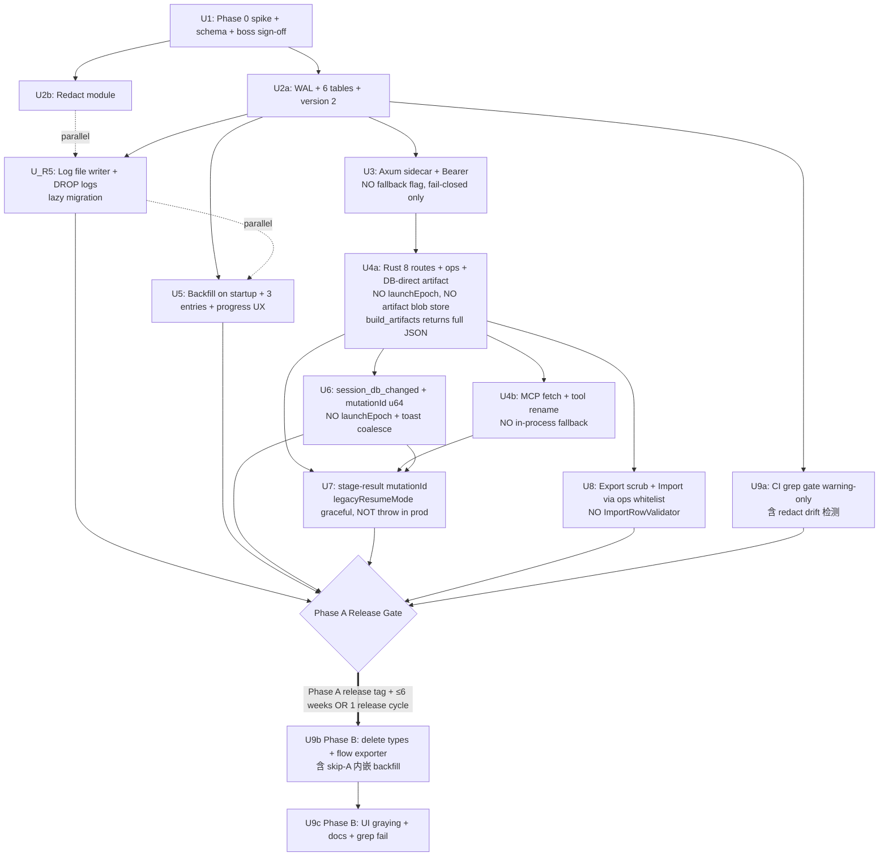

# refactor 重构 topology MCP 到 single-DB 领域事实源

## Overview

把 topology MCP 的权威事实源从内存中的 `IntermediateTopology` + `CanonicalTsnProjectV0` 双层模型迁到**单 SQLite (`tsn-agent.db`) 领域表**。Tauri Rust 持有所有 sqlx 连接，通过 **127.0.0.1 loopback HTTP + per-launch Bearer token** 暴露领域级 RPC，MCP server 仍是 Agent SDK stdio child，但 tool handler 通过 sidecar 写 DB。**Phase A** 上线新表 + axum sidecar + backfill + 文件日志 writer + UI 事件契约；**Phase B**（Phase A release tag 发出后 ≤6 周**或**至少经历 1 个完整 release 周期，以**先到者**为准，必须开 Phase B PR）一次性删除 `IntermediateTopology` + `CanonicalTsnProjectV0` 在生产代码路径 + flow-dependent 导出（`planner-exporter` / `inet-traffic-exporter` / `inet-gcl-exporter` / `ini-exporter` 中 flow 部分 / `artifact-bundle` 中 flow 部分），boss 在 P1 重新构建。`CanonicalTsnProjectV0` 的 Rust 私有副本仅 Phase A backfill 模块内保留，Phase B 与生产路径副本一并删除。

**Phase A 期间 boss 个人调试影响**：4 阶段 workflow 中 `flow-template` / `planning-export` 两阶段在 Phase A 期间不可用（boss 自己也受影响），boss 在 plan 启动前必须 sign-off 接受这个代价；如果在 Phase A 期间 boss 确认需要使用 flow 调试，整个 plan 必须 pause 并回评估 fallback 方案（保留 in-process flow exporter 仅供 read-only debug，代价是 Phase B 删除工作量增加）。

**关键的 brainstorm fidelity**（v3 回退 v2 过度修复）：
- `build_artifacts` 仍是 P0 唯一不走 summary 的工具，**返回完整 4 件套 JSON**（与 brainstorm v3 R9/line 127 一致）；不引入 artifact_store 表 + 物化 blob
- Import 走与 `apply_operations` **同款 ops 白名单**（新增 insert-only ops variant，brainstorm R19 字面一致），不创建独立 `ImportRowValidator` 形成 drift
- mutationId 用 in-process atomic u64 counter 即可，**不引入 launchEpoch**（token immutable invariant 已经排除 sidecar 部分重启，launchEpoch 是为不会发生的场景建机制）
- 不引入 `TSN_AGENT_USE_SIDECAR=false` fallback flag；sidecar bind 失败 = fail-closed panic + 友好错误页 + 引导重装上一个 release（沿用 Tauri 安装包 rollback 作为唯一应急路径，**不在生产代码里维护 dual-stack**）

Plan 入口需要 boss 提供 4 件套对应表的字段草案（U1 pre-condition）。

## Problem Frame

`IntermediateTopology`（domain）↔ `CanonicalTsnProjectV0`（app/UI）↔ legacy 5 件套（导出）三层之间 bridge 转换让调试时定位事实源层级困难。本次重构是**工程偏好**（消除多份事实源），不是某个具体 incident 驱动。session 数据从 `payload TEXT` JSON blob 变成结构化领域表后可 SQL 查询。session 分享通过 "Export Session" 命令解决，不引入 per-session 物理文件复杂度。（see origin: `docs/brainstorms/2026-06-03-session-db-mcp-requirements.md` 反转理由段）

## Requirements Trace

> **U1 Schema Draft 修正 (2026-06-03)**：参考 CDT 工程 (`docs/plans/2026-06-03-001-schema-draft.md`)，实际 4 件套 = **topology.json + topo_feature.json + node.json + flow_plan_<id>.json**（不是 brainstorm v3 R1 原列的 4 件套）。P0 = **3 件套**（topology + topo_feature + node，**新增 node.json**），P0 表数 6 → **15** (3 topology + 1 topo_feature + 11 node 派生)。`data-server.json` 是上游 Qunee 源数据不在 4 件套；`mac-forwarding-table.json` CDT 不生成，已删除。

直接对齐 brainstorm v3 R1-R22 + R5a + R20a-g：

- **R1-R4**: DB 结构与边界（**3 件套对应 15 张表** + session_id 列 + 删 `diagnostic_logs` 表 → 文件日志，由 **U_R5** 落地）
- **R5 + R5a**: 日志移到 `<app-config>/logs/sess-<id>/agent-run-<runId>.jsonl` + 字段 allowlist 继承（**U_R5**；R5a 仅在 U8 默认行为"不打包日志"中体现）
- **R6-R9**: MCP 工具契约（`tsn_topology` 名保留、env 注入 sessionId、`validate_intermediate→topology.validate`、**`build_artifacts` 仍返完整 4 件套 JSON**）
- **R10-R12**: 事务与一致性（sqlx Transaction + 单 session 1 个写 tx + 5s timeout）
- **R13-R16**: RPC 通道与安全（axum 127.0.0.1 IPv4 only + `OsRng` token + `setup()` 同步起 + UI 走 Tauri command + `session_db_changed` 事件 + mutationId 缓存补漏）
- **R17-R19**: 复现与导出（**canonical byte-equal** spike + Export/Import Session 命令；Export 必须 scrub `sessions.payload` blob；**Import 走 ops 白名单**）。注：原文件 byte-equal 不可能（CDT JSON 含 4-space indent 等格式化细节）；R17 实际语义是 RFC 8785 canonical form byte-equal（Spike A 已在 BFE fixture 验证）
- **R20a-R20g**: Migration Phase A/B 时序
- **R21-R22**: 安全约束（fail-closed + 继承既有 `diagnostic_store` allowlist + redact 模块集中）

## Scope Boundaries

直接继承 brainstorm v3 Scope Boundaries：

- 不做 UI 状态数据库化、不做 per-session 物理文件、不做 staging 表、不让 MCP 直开 sqlite、不让 MCP 拼 SQL、不让 LLM 在 args 传 sessionId
- P0 期间停掉 flow-dependent 导出（boss 在 P1 重新构建）
- 不在 P0 铺 flow / time-sync domain（P1）
- 不防同机器恶意本地用户（已显式接受）
- 沿用旧 brainstorm 边界：不做 NLU / generate_project / HTML 导出 / workflow 推进
- **不暴露 Bearer token 给 webview JS 上下文**
- **不引入 in-process fallback 路径**（sidecar bind 失败 = fail-closed panic）
- **不引入 artifact_store 物化 blob 表**（build_artifacts 仍返完整 JSON）
- **不引入独立 ImportRowValidator**（Import 复用 ops 白名单）
- **不引入 launchEpoch**（token immutable 已排除部分重启）

## Context & Research

### Relevant Code and Patterns

**DB 与连接池**
- `src-tauri/src/session_store.rs:179-204` — `connect_app_database` `max_connections=1`，须升级到 ≥4（**sqlx 0.8 默认已 WAL**，见 Spike C report）
- `src-tauri/src/db.rs:1-51` — `DATABASE_URL = "sqlite:tsn-agent.db"` 相对路径**与** `connect_app_database` 绝对路径**实际指向同一 db**（Spike C 已验证：`_sqlx_migrations` + `sessions` 共存于同一文件，plugin 智能解析相对路径到 `app_config_dir`）
- `src-tauri/src/diagnostic_store.rs:136-146` — `DiagnosticStore.pool()` 委托 `connect_app_database`
- **Schema versioning**: `tauri-plugin-sql` 用 `_sqlx_migrations` 表（标准 sqlx migrate），**不用 PRAGMA `user_version`**；U2a 新表走 plugin migration version 2 entry

**MCP 工具统一入口**
- `src-node/mcp/topology-tools.ts:162-196` — `runAgentFacing(callback, args, options)` 是 8 handler 统一壳

**Worker spawn**
- `src-tauri/src/commands.rs:111-144` — worker per-prompt one-shot；payload JSON argv；env 默认继承 parent
- `src-node/claude-agent-worker.mjs:48-57` — `mcpServers.tsn_topology` 需加 env 字段
- `src-node/claude-agent-worker.mjs:1117-1155` `extractTopologyWorkflowStageResults` — 改 mutationId
- `src-node/claude-agent-worker.mjs:1508-1514` + `src/sessions/session-repository.ts:315-321` — Node/TS redact 副本

**UI 事件 listener 模板**
- `src/agent/agent-adapter.ts:240-256` — `listenToClaudeChunks` 是唯一 Tauri event listen 先例

**CanonicalTsnProjectV0 引用面**（Phase B 范围）
- 类型定义 `src/domain/canonical.ts`、`src/domain/validation.ts`
- bridge `src/topology/project-bridge.ts:32-120`
- UI `src/app/App.tsx`；export `src/export/*.ts`；agent/session 多文件

**topology artifacts**
- `src/topology/artifacts.ts:1-584` (584 行) — Rust 端需要重写该算法用于 sidecar route，是 U4a 内最重的 sub-task（独立子单元 U4a-2 跟踪）

**Phase A/B 先例**
- `docs/plans/2026-05-21-001-feat-real-stage-skills-inet-smoke-plan.md:207-228`

### Institutional Learnings

- `docs/adr/0001-local-sqlite-session-store.md` — 数据放置边界
- `docs/diagnostics-log-contract.md` — allowlist 来源；R5 文件写出层显式继承
- `docs/plans/2026-06-01-002-feat-agent-runtime-and-session-experience-plan.md` U3b — `listenToRunEvents` + watchdog 模板
- `docs/plans/2026-05-28-002-refactor-topology-stage-result-boundary-plan.md` KTD3 — "worker 合成结果"

### External References

- **axum 0.8.9** + **sqlx 0.8.6** + **Tauri 2** + **@anthropic-ai/claude-agent-sdk 0.3.160** + **@modelcontextprotocol/sdk 1.29.0**
- Agent SDK 已知 env 透传 bug ([#28332](https://github.com/anthropics/claude-code/issues/28332))；必须显式 `env: { TSN_AGENT_*, PATH, HOME, SystemRoot(Win), APPDATA(Win), LANG }` + `delete CLAUDECODE`
- 127.0.0.1 literal ([Claude Code #44844](https://github.com/anthropics/claude-code/issues/44844))；Node fetch 强制 `family: 4`
- `VACUUM INTO` (SQLite ≥3.27.0)；先 sub-tx `UPDATE sessions SET payload='{}'` → VACUUM INTO → rollback sub-tx → 输出 .db 不带 blob
- `secrecy::SecretString` Debug `[REDACTED]` + zeroize on drop
- Tauri events bugs ([#2323](https://github.com/tauri-apps/tauri/issues/2323) / [#8177](https://github.com/tauri-apps/tauri/issues/8177)) — mutationId ring buffer + invoke catch-up
- Bearer constant-time: 自定义 `axum::middleware::from_fn` + `subtle::ConstantTimeEq`，**不用** tower-http `ValidateRequestHeaderLayer::bearer`
- SQLite Import 安全: 文件大小 ≤10MB + `PRAGMA trusted_schema=OFF + cell_size_check=ON + integrity_check` + 仅 SELECT 6 张白名单表

## Key Technical Decisions

| 决策 | 选择 | 理由 |
|---|---|---|
| Storage 形态 | 单 db + `session_id` 列 | brainstorm v3 已定 |
| DB ownership | Tauri Rust 单 writer + WAL + `max_connections≥4` | 现 max_connections=1 与 sidecar 并发冲突 |
| RPC 通道 | axum 0.8 loopback HTTP + Bearer + IPv4 literal | brainstorm v3 已定 |
| **Bearer token 暴露面** | **仅 Rust→Node spawn env**；UI 永远不接触 | 防 webview JS 攻击面 |
| Bearer 比较 | 自定义 `axum::middleware::from_fn` + `subtle::ConstantTimeEq` | tower-http builtin 非常量时间 |
| **Token immutability** | token 应用生命周期内 immutable；sidecar panic = Tauri panic + 友好错误页 + 引导用户重装上一个 release | 无 in-process fallback；不留 dual-path 维护债 |
| RPC 负载 | 领域级 JSON RPC，SQL 全在 Rust | 防 SQL 注入 |
| **`build_artifacts` 响应** | 返完整 4 件套 JSON（与 brainstorm R9/line 127 字面一致） | 是 P0 唯一不走 summary 的工具；agent 实际不会大量 call build_artifacts；不引入新表 + 缓存失效问题 |
| P0 范围 | topology only + 停 flow-dependent 导出 | flow domain 整体 P1 |
| 事务模型 | sqlx `pool.begin() → Transaction` | 标准 |
| 并发上限 | 单 session 1 个写 tx + per-session 1 个 dryRun pending + 5s op timeout | 简化 v2 的"三个 throttle"为基础两条；compress test threshold 提高到 85%+ rejection |
| Canonical 处理 | Phase A backfill 模块内私有 Rust 副本；Phase B 删除（与生产路径副本一并） | Backfill 不可避免依赖 canonical 解析 |
| 复现单元 | Export Session: sub-tx scrub payload + `VACUUM INTO` | 防 Export 泄漏 |
| **Import 校验** | **走与 apply_operations 同款 ops 白名单**（新增 insert-only ops variant）+ 10MB 文件大小 + `PRAGMA integrity_check / cell_size_check=ON / trusted_schema=OFF` + 6-table 白名单 | 与 brainstorm R19 字面一致；避免独立 validator drift |
| 日志 | 文件 + session-scoped jsonl + 字段 allowlist 共享配置 + CI gate 防漂移 | 沿用 R5/R22 |
| MCP server 命名 | 维持 `tsn_topology` | P0 仅 topology |
| session_id 注入 | spawn-env，不可被 LLM 在 args 传 | 防伪造 |
| UI 读路径 | Tauri command + sqlx in-process | 零 RPC 开销 |
| UI 刷新机制 | `app_handle.emit_to("main", ...)` + mutationId 缓存 + Tauri command `get_topology_mutations_since(sessionId, lastSeen)` | mutationId 是 in-process atomic u64；token immutable 已排除 sidecar 部分重启，**不需要 launchEpoch** |
| Sidecar 启动 | `setup()` 同步起 + IPv4 only + bind 失败 fail-closed panic | 无 in-process fallback |
| 401 阈值 | 3 次（仅 worker 自身请求） | 防外来无 token 请求触发自杀 |
| Phase A→B 时序 | **Phase A release tag 发出后 ≤6 周 OR 至少 1 个完整 release 周期（以先到者为准）** | 简化 v2 的 AND 措辞为单一时间约束 |

## Open Questions

### Resolved During Planning

- axum 0.8.9 / sqlx 0.8.6 / Tauri 2 / Agent SDK 0.3.160 / MCP SDK 1.29.0 — 已锁版本
- **DB 路径合并** — Spike C 验证：plugin migration 与 `connect_app_database` 同 db（不需要二选一）
- **Schema versioning 机制** — Spike C 验证：`tauri-plugin-sql` 用 `_sqlx_migrations` 表，**不用 PRAGMA `user_version`**；U2a 走 plugin migration version 2 entry
- **WAL 升级** — Spike C 验证：sqlx 0.8 默认 `journal_mode=Wal`，dev db 已经是 WAL；U2a 真正改动是 `busy_timeout=5000` + `max_connections=4` + `application_id` + 新表 schema
- **`mcpServers.tsn_topology.env` 字段** — Spike B 验证：Node `child_process.spawn` 显式 env **REPLACE** 不是 merge；U4b 必须显式声明 `env: { TSN_AGENT_*, PATH, HOME, SystemRoot, APPDATA, LANG }`，**不能依赖默认透传**
- **CLAUDECODE 处理** — Spike B 验证：CLAUDECODE 会随 default-inherit 透传；U4b 必须在 SDK spawn 前 `delete process.env.CLAUDECODE`
- **Node IPv4 fetch** — Spike C 验证：`127.0.0.1` literal in URL 足够（macOS 直接 work）；`node:undici` 在 Node 24 不暴露，无法用 Agent dispatcher；可选在 worker 启动入口加 `dns.setDefaultResultOrder('ipv4first')` 作 Windows 防御
- Backfill 执行点 — 应用启动一次性
- `session_db_changed` 粒度 — domain 级 mutationId
- MCP handler 选项 — Rust 端 DB-direct artifact build
- Spike A 失败时 fallback — boss 在 spike report PR 内做三选 (a)(b)(c)
- **build_artifacts 响应形态** — 完整 4 件套 JSON（v2 的 handle 方案已撤回）
- **token 暴露面** — 仅 spawn env
- **fallback 策略** — fail-closed panic + 引导重装上一个 release（v2 的 USE_SIDECAR flag 已撤回）
- **Import 校验机制** — ops 白名单复用（v2 的独立 validator 已撤回）
- **launchEpoch** — 不引入（token immutable 已排除场景）

### Deferred to Implementation

- topology 4 件套 → DB 列映射草案（boss 在 U1 入口前提供；卡 Phase 0 prerequisite）
- Phase B 删除 PR 的具体 release tag 编号
- `session_db_changed` watchdog 超时具体值（沿用 60s）
- axum bind 失败 panic 中文文案
- Export Session UX（文件选择对话框、覆盖确认）
- 灰掉 flow exporter 的 UI copy + tooltip 文案（U9c）+ 具体版本号
- backfill 失败 session UI 3 入口（retry/delete/view）的 layout / primary action / 错误码 → 用户文案 mapping
- "topology updated" toast burst coalescing（建议 800ms debounce）
- U_R5 一次性 migration → lazy migration 决策（见 U_R5 内）

## High-Level Technical Design

> 本节用流程图描述意图，是 review 用的方向性指引。

### 数据流（Phase A 上线后）

```
React UI ──invoke("query_topology", sessionId)──> Tauri Rust (sqlx in-process)
React UI <──Tauri event "session_db_changed" {sessionId, domain, mutationId}── Rust
React UI ──invoke("get_topology_mutations_since", {sessionId, lastSeen})──> Rust

Agent SDK spawn MCP server (stdio child)
  with env: TSN_AGENT_SESSION_ID, TSN_AGENT_DB_RPC_URL, TSN_AGENT_DB_RPC_TOKEN
            + PATH, HOME, SystemRoot, APPDATA, LANG
            (delete CLAUDECODE before spawn)

MCP tool handler ──fetch(http://127.0.0.1:<port>/db/topology/...)──> axum sidecar
                                                                       ↓
                                                              sqlx Transaction
                                                              ops whitelist enum
                                                              5s op timeout
                                                              commit → push mutationId
                                                                → app.emit_to("main", ...)

Sidecar bind 失败 = Tauri panic + 友好错误页 + 引导重装 ≤Phase A 前 release
（不存在 fallback flag；不在生产代码维护 dual-stack）
```

### Phase A → Phase B 时序

```
[U1] 3 spikes + boss schema 草案 + boss sign-off "Phase A 期间个人 flow 调试受影响"
       ↓
Phase A (1 release)
[U2a] WAL + schema 升级 + version 2     [U2b] Redact 模块 (并行)
       ↓                                          ↓
[U3] axum sidecar + Bearer (NO endpoint exposure)
       ↓
[U4a] Rust sidecar 8 routes + ops whitelist + DB-direct artifact build
  - U4a-1: sidecar handlers + ops enum + token + ring buffer (无 launchEpoch)
  - U4a-2: artifacts.ts → Rust 端重写 + Spike A baseline byte-equal 回归
       ↓
[U4b] MCP server fetch + tool rename + responseMode=full 删除
       ↓
[U_R5] 文件 writer + DROP diagnostic_logs (lazy migration)
       ↓
[U5] Backfill on startup (3 入口 UX)
       ↓
[U6] session_db_changed + mutationId u64 + UI hook (无 launchEpoch)
       ↓
[U7] stage-result mutationId trusted signal + legacyResumeMode 检查 (graceful, not throw)
       ↓
[U8] Export scrub payload + Import 走 ops 白名单 insert-only variant
       ↓
[U9a] CI grep gate (warning-only)
       ↓
[Phase A Release Gate] cargo:test + npm test + e2e + 真实 Claude + DB inspect
       ↓
RELEASE Phase A
─────────────────────────────────────────────────────────────────
[Phase A release tag 后 ≤6 周 OR 1 个完整 release 周期，以先到者为准]
─────────────────────────────────────────────────────────────────
Phase B
[U9b] 删除 IntermediateTopology + Canonical + flow exporter + backfill 副本
[U9c] UI 灰态 + 文档同步 + CI grep gate fail mode
       ↓
RELEASE Phase B
```

## Implementation Units

### Phase 0 — Spike + Schema 草案

- [ ] **U1: 三个 spike + 4 件套 schema 草案 + Spike A escalation criteria + Phase A 个人调试影响 sign-off**

**Goal:** Phase A 前置技术验证 + boss schema 草案 + Spike A 失败时三选决策路径 + boss 显式签字接受"Phase A 期间个人 flow 调试受限"。

**Requirements:** Origin Resolve Before Planning

**Dependencies:** Boss 在 U1 启动前提供 4 件套对应表的字段清单草案

**Files:**
- Create: `tmp/spike-byte-equal-roundtrip/` / `tmp/spike-mcp-env-passthrough/`
- Create: `docs/plans/2026-06-03-001-schema-draft.md`
- Create: `docs/plans/2026-06-03-001-spike-a-report.md`
- Update: 本 plan 顶部 Overview — 加 boss sign-off 段（在 boss 同意后落地）

**Approach:**
- **Spike A (canonical byte-equal)**: ✅ **已通过 (2026-06-03)** — BFE fixture (4 nodes / 2 links / sparse node) 在 15 张 P0 表 round-trip 后 canonical byte-equal 一致；见 `docs/plans/2026-06-03-001-spike-a-report.md`。建议后续提供 1-2 个更密集 fixture (含 gcl/psfg) 做 diversity 覆盖，但**不阻塞 U2a 启动**
- **Spike A escalation**（time-boxed）:
  - Pass: 三 fixture 全 byte-equal → 进 Phase A
  - 第 1 次 fail：boss 在 1 周内 PR 选 (a) 调 schema 加 ORDER BY 辅助列 / (b) 接受 SC 降级 "语义等价 + planner_exporter 字节 accept" / (c) 取消重构
  - (a) 重跑后再 fail：boss 在另 1 周内仅从 (b)(c) 选；(a) 不再可选
- **Spike B (env 透传)**: echo MCP server dump env；验证 `TSN_AGENT_*` + OS-specific (`PATH/HOME/SystemRoot/APPDATA/LANG`)；spawn 实际 fs/sqlite IO 的 MCP child 覆盖 ENOENT
- **Spike C (WAL + Node IPv4)**: dev 机 WAL 升级跑 e2e；验证 plugin migration vs `connect_app_database` 是否同 db；Windows IPv6 环境 Node fetch `family: 4`
- **Boss sign-off**: boss 在 U1 完成时显式 acknowledge "Phase A 期间 4 阶段 workflow 后两阶段不可用，自己也接受这个代价"——签字写进本 plan Overview

**Test scenarios:**
- Spike A 三 fixture pass / partial pass / fail 时序协议
- Spike B 三个 env 变量 + OS-specific 集 + CLAUDECODE 处理
- Spike C WAL 升级 + IPv4 fetch on Windows

**Verification:**
- 三 spike report PR；boss 在 Spike A PR 内决策（time-boxed 1 周）
- `docs/plans/2026-06-03-001-schema-draft.md` 已 land
- boss sign-off 签字段落出现在本 plan 顶部 Overview

---

### Phase A — 上线新机制

- [ ] **U2a: DB schema (plugin migration v2) + busy_timeout + max_connections + application_id**

**Goal:** main db `connect_app_database` 加 `busy_timeout=5000` + `max_connections(4)` + `application_id`；通过 `tauri-plugin-sql` migration version 2 新增 6 张 topology 表。**WAL 已是 sqlx 0.8 默认（Spike C 验证）**，本 unit 不再做 WAL 升级。

**Requirements:** R1-R4, R20a (部分)

**Dependencies:** U1

**Files:**
- Modify: `src-tauri/src/db.rs` — `migrations()` 追加 version 2 entry `create_p0_domain_tables`（含 **15 张 P0 表**的 `CREATE TABLE IF NOT EXISTS` + `PRAGMA application_id = 0x54534E01`；表列表见 `docs/plans/2026-06-03-001-schema-draft.md`：3 张 topology (`topology_nodes/links/refs`) + 1 张 topo_feature (`topo_feature_links`) + 11 张 node 派生 (`nodes` + `nodes_oss_cfg/sdu_table_cfg/gcl_cfg/time_cfg/psfg_stream_filters/psfg_flow_meters/psfg_stream_gates/frer_cfg/array_cfg/object_cfg`)）；扩 `SESSION_SCHEMA_SQL` safety-net 同步含新 15 表（与 plugin migration 幂等）
- Modify: `src-tauri/src/session_store.rs` — `connect_app_database` `max_connections(4)` + 启动时 `PRAGMA busy_timeout=5000`（**保留 sqlx 默认 WAL，可选 explicit 声明做 invariant**）
- Test: 新 6 表 CREATE TABLE IF NOT EXISTS 命中 + plugin migration v2 apply + `_sqlx_migrations` 含 v1+v2

**Approach:**
- Plugin migration mechanism: `tauri-plugin-sql` 用 `_sqlx_migrations` 表（标准 sqlx migrate），不用 PRAGMA `user_version`。`db.rs::migrations()` 返回数组追加 v2 entry 即可
- `connect_app_database` 内 PRAGMA 顺序：`busy_timeout=5000` → 跑 SESSION_SCHEMA_SQL safety-net（CREATE IF NOT EXISTS 幂等）
- `application_id` 通过 v2 migration 内 `PRAGMA application_id` 设置（v1 dev db 升级到 v2 时自动 set）
- 既有 dev db (`_sqlx_migrations` 含 v1) 升级路径：plugin 自动跑 v2 migration 时 IF NOT EXISTS 兼容已有数据

**Test scenarios:**
- Happy: fresh db 启动后 `_sqlx_migrations` 含 v1+v2、含 **15 张新 P0 表** + 既有 sessions/app_state/diagnostic_logs + `application_id = 0x54534E01`
- Edge: 已有 v1 db 升级 → `_sqlx_migrations` 加一行 v2；既有表数据不动；新 15 表创建
- Edge: 应用反复启动 → plugin migration 幂等（不重复跑 v2）
- Edge: FK 约束验证 — 删除 sessions 行级联删除 15 张表中该 session 数据
- Error: disk full → plugin migration 错误，下次启动 retry（plugin 内置）

**Verification:** `cargo test` 全绿 + `sqlite3 ~/Library/.../tsn-agent.db "SELECT version, description FROM _sqlx_migrations"` 含 v1+v2 两行 + `PRAGMA application_id` = 0x54534E01 + `PRAGMA busy_timeout` = 5000 + `.tables` 显示 15 张 P0 表

---

- [ ] **U2b: Redact 模块抽取（并行）**

**Goal:** 抽 `src-tauri/src/redaction.rs` 合并 Rust 两副本；shared allowlist 为 U_R5 file writer ready。

**Requirements:** R22

**Dependencies:** 无（并行 U2a）

**Files:**
- Create: `src-tauri/src/redaction.rs` + tests
- Modify: `diagnostic_store.rs` + `commands.rs` 删副本，`pub use crate::redaction::*`
- Modify: `src-tauri/src/lib.rs` — `mod redaction`

**Approach:**
- 三 pub fn：`redact_secrets` / `redact_error` / `redact_token_like_word`
- sensitive_keys 集中：`api_key|apikey|token|secret|password|claude_api_key|authorization` + base64url 32B token 字面值过滤（防 `TSN_AGENT_DB_RPC_TOKEN` 字面进日志）
- Node/TS 副本由 U9a CI gate 检测 drift

**Test scenarios:**
- 既有 Rust 两副本所有 case
- token-like 字符串 + Bearer 头 + 32B base64url
- 中文替换 `Claude → 智能助手`

**Verification:** `cargo test redaction` 全绿 + 字节级与抽前一致

---

- [ ] **U3: Axum sidecar + Bearer + Tauri lifecycle（无 fallback flag）**

**Goal:** Tauri `setup()` 内同步起 axum 127.0.0.1 IPv4 random port + SecretString token；自定义 from_fn constant-time Bearer middleware；占位 8 route + graceful shutdown。**Sidecar bind 失败 = fail-closed panic（不留 fallback flag）**；token 仅 Rust→Node spawn env，不暴露 UI。

**Requirements:** R13, R14, R15 (R21 fail-closed 体现于 bind 失败 panic)

**Dependencies:** U2a

**Files:**
- Modify: `src-tauri/Cargo.toml` — 加 axum 0.8 / tower 0.5 / tower-http 0.6 (features `["request-id", "trace"]`，不要 `validate-request`) / tokio-util 0.7 / secrecy 0.10 / subtle 2；扩 tokio features
- Create: `src-tauri/src/topology_sidecar.rs` — bind + custom Bearer middleware + CancellationToken + SidecarHandle
- Create: `src-tauri/src/topology_sidecar_routes.rs` — 8 route 占位 (501)
- Modify: `src-tauri/src/lib.rs` — `mod topology_sidecar`；`setup()` 同步 mint token + bind + `app.manage(SidecarHandle)`；`run()` 接 `RunEvent::Exit` cancel
- Modify: `src-tauri/src/commands.rs::run_claude_agent` — spawn worker 时 payload + env 注入 `{ sidecar_url, sidecar_token }`（直接，不暴露独立 Tauri command）
- Test: bind / auth / shutdown / 401 / constant-time / panic on bind fail

**Approach:**
- `bind("127.0.0.1:0")`；失败 panic 中文 "拓扑 sidecar 服务启动失败，建议重装上一个 release 或检查端口占用"
- token: `SecretString::new(OsRng.gen::<[u8;32]>().to_base64url())`；自定义 Debug `[REDACTED]`
- Custom middleware:
  ```
  middleware::from_fn(|State<Arc<SecretString>>, req, next|:
    presented = req.headers().get("Authorization")
                 .strip_prefix("Bearer ")
    if presented.is_some() && subtle::ConstantTimeEq::ct_eq(...)
    then next.run(req).await else 401 redacted body)
  ```
- 8 route 占位 501；U4a 接 sqlx
- `tauri::async_runtime::spawn` 起 axum + CancellationToken
- `RunEvent::Exit` 同步 cancel；不允许 in-process recover

**Test scenarios:**
- Happy: GET 带 Bearer → 200/501；无 Bearer → 401
- Edge: 错误 Bearer → 401，constant-time path
- Edge: token Debug 输出 `[REDACTED]`
- Edge: panic backtrace 不含 token 字面
- Error: bind 失败 → panic 中文（**没有 fallback 路径**）
- Integration: worker 拿到 url+token 调通

**Verification:** `cargo test topology_sidecar` + 手动 curl 401/200

---

- [ ] **U4a: Rust sidecar 8 routes + ops whitelist + DB-direct artifact build**

**Goal:** sidecar 8 route 接 sqlx Transaction；ops 白名单 enum (含 Phase A 全部 ops variant + Import insert-only variant 占位)；5s op timeout；ring buffer (mutationId u64，**无 launchEpoch**)；**build_artifacts 返完整 4 件套 JSON**（与 brainstorm R9 字面一致）。

**子单元跟踪**（同一 Implementation Unit 内 sub-tasks，但 PR 可分 2 个）：
- U4a-1: sidecar handlers + ops enum + token bucket + ring buffer + Tauri RPC wiring（基础设施，~1 周）
- U4a-2: `src/topology/artifacts.ts` (584 行) Rust 端重写 → byte-equal 与 Spike A baseline 比对（重 sub-task，~1 周）

**Requirements:** R10, R11, R12, R20a (部分)

**Dependencies:** U3

**Files:**
- Modify: `src-tauri/src/topology_sidecar_routes.rs` — 8 route 接 sqlx
- Create: `src-tauri/src/topology_ops.rs` — `enum TopologyOp { LinkDelete{id}, NodeAdd{...}, LinkAdd{...}, InsertNode{...}, InsertLink{...}, InsertPort{...}, InsertFeature{...}, InsertDataServer{...}, InsertMacEntry{...} }`（Phase A ops + Import insert-only variant）
- Create: `src-tauri/src/topology_mutation_buffer.rs` — ring buffer cap 1024 `{ sessionId, domain, mutationId, ts }`
- Create: `src-tauri/src/topology_artifacts_rust.rs` — `buildTopologyJson / buildTopoFeature / buildDataServer / buildMacForwardingTable` Rust 重写 (parallel to artifacts.ts)
- Modify: `src-tauri/Cargo.toml` — 加 `serde_json_canonicalizer = "0.4"`
- Test: 8 route + ops 白名单 + 5s timeout
- Test (stress): 1000 ops/1s → **≥85% rejected**（v3 提高阈值，v2 的 50% 过宽）
- Test (byte-equal regression): Spike A 通过的 3 fixture 经 sidecar build_artifacts 字节级与 baseline 一致

**Approach:**
- ops 白名单 enum derive serde + match 穷举；非 enum op → 400 INVALID_OPERATION
- 跨 session_id 防御：handler 校验 body sessionId 在 sessions 表 + 写表 `WHERE session_id=?` 限定；试图写 sessions/app_state → 400 FORBIDDEN_OPERATION
- 5s op timeout: `tokio::time::timeout(Duration::from_secs(5), ...)`；超时 422 TIMEOUT
- per-session: **同时只 1 个写 tx in-flight + 同时只 1 个 dryRun pending**（简化 v2 三个 throttle）
- `build_artifacts` route：
  - sqlx query rebuild 4 件套 → `serde_json_canonicalizer` 序列化 → **直接 JSON body 返回**（与 brainstorm 一致）
  - **不引入 topology_artifacts 表 / 不引入 query_topology_artifact Tauri command / 不存 blob**
  - response 体积 50-200KB 对 MCP stdio 通道可接受；agent prompt 设计不会让 agent 把 build_artifacts JSON 反复回放（worker 端 stage capture 只保留 summary，不保留 full artifact 进 agent context）
- ring buffer: mutationId u64 in-process atomic counter；每次 commit push；overflow 丢最早；UI catch-up 用 `(sessionId, lastSeen)` 拉，超出 buffer 范围返 `{ outOfRange: true, latest }` → UI 全量 refetch
- Rust 端 artifacts 算法翻译：U4a-2 是独立工作量，建议先实现 `topology.json`（最简）跑通 Spike A baseline 比对，再扩 `topo_feature.json` / `data-server.json` / `mac-forwarding-table.json`（含 BFS）

**Test scenarios:**
- Happy: `topology.initialize` / `apply_operations` dryRun+apply / `build_artifacts` 返 4 件套 JSON 字节级 OK
- Happy: ring buffer push + Tauri command catch-up
- Edge: dryRun 内 op 失败 → tx rollback + 422
- Edge: build_artifacts 返完整 JSON（不是 handle）
- Edge: 跨 session_id → 422 FORBIDDEN_OPERATION
- Edge: 5s timeout → 422 TIMEOUT
- Edge: ring buffer overflow → `outOfRange: true`
- Stress: 1000 ops/1s → ≥85% rejected (token-bucket-equivalent via single-writer-tx + 5s timeout)
- Integration (byte-equal): Spike A baseline fixture 经 sidecar build_artifacts 字节级一致

**Verification:**
- `cargo test topology_sidecar_routes` + stress + byte-equal regression
- Spike A 3 fixture 字节级 OK

---

- [ ] **U4b: MCP server fetch + tool rename + responseMode 删除**

**Goal:** `runAgentFacing` callback → HTTP fetch；删 `responseMode/topologyFullAllowed`；`validate_intermediate → topology.validate`；env 校验。**无 in-process fallback，sidecar 不通就 fail**。

**Requirements:** R6, R7, R8, R9

**Dependencies:** U4a

**Files:**
- Modify: `src-node/mcp/topology-tools.ts` — `runAgentFacing` 改 `fetchSidecar`；删 responseMode；**build_artifacts 透传完整 4 件套 JSON**（与 v3 brainstorm 一致）
- Modify: `src-node/mcp/tsn-topology-server.ts` — 启动 env 校验缺失 exit 1
- Create: `src-node/mcp/sidecar-client.ts` — `fetchSidecar(route, body, abortMs=15000)`；`AbortSignal.timeout` + Bearer + 强制 `family: 4`
- Modify: `src/topology/topology-service.ts` — `validate_intermediate → topology.validate`
- Modify: `src-node/claude-agent-worker.mjs` — `mcpServers.tsn_topology.env` **必须显式声明**（Spike B 验证：Node `child_process.spawn` 显式 env REPLACE 不是 merge）含 `{ PATH, HOME, ...(SystemRoot ? { SystemRoot } : {}), ...(APPDATA ? { APPDATA } : {}), ...(LANG ? { LANG } : {}), ...(LC_ALL ? { LC_ALL } : {}), TSN_AGENT_SESSION_ID, TSN_AGENT_DB_RPC_URL, TSN_AGENT_DB_RPC_TOKEN }`；spawn 前 **`delete process.env.CLAUDECODE`**（Spike B 验证：默认会透传）；可选 worker startup 加 `dns.setDefaultResultOrder('ipv4first')` 作 Windows 防御；**删除 v1 in-process buildXxxArtifacts 直接调用 path**（不留 fallback）
- Modify: agent system prompt — 删除 responseMode 要求

**Approach:**
- sidecar fetch 失败时 MCP 返 `failResult({ errors: [{code: "SIDECAR_UNAVAILABLE", retryable: false}] })`；用户感知 + 引导重装
- 不留 dual-path

**Test scenarios:**
- Happy: 8 工具 fetch 通
- Edge: env 缺失 → exit 1 中文
- Edge: sidecar 不通 → `SIDECAR_UNAVAILABLE` 不 retryable
- Integration: 真实 Claude topology e2e

**Verification:** `npm test mcp/topology-tools` + e2e

---

- [ ] **U_R5: 文件日志 writer + 删 diagnostic_logs + shared allowlist + lazy migration**

**Goal:** brainstorm R5 落地——`diagnostic_store.append_*` 改写 jsonl 文件；继承 U2b redact；**lazy migration**：启动只 DROP 表 + 标记 legacy_migration_pending，UI 端用户首次打开旧 session 时按需读残留数据；避免 splash 卡分钟级。

**Requirements:** R5, R5a, R22, R24

**Dependencies:** U2a (db.rs version bump), U2b (redact)

**Files:**
- Modify: `src-tauri/src/diagnostic_store.rs` — `append_*` 改写文件；`list/clear` 改 fs；`pub use crate::redaction::*`
- Modify: `src-tauri/src/db.rs` — `SESSION_SCHEMA_SQL` 删 `diagnostic_logs`；`migrations()` version 3 含 `DROP TABLE IF EXISTS diagnostic_logs`（**lazy**：不导出 legacy 数据，直接丢弃；如果 boss 需要历史日志保留，需在 Spike B 后明确决策）
- Modify: `src-tauri/src/session_store.rs::remove_session` — `clear_logs_for_session_fs(app, ...)`
- Modify: `src/diagnostics/diagnostic-log-repository.ts` — UI command 名不变，返回值改 jsonl entries
- Create: `src-tauri/src/log_file_writer.rs` — jsonl writer + 单 session 总大小限制 10MB
- Test: write/read/redact path；单 session 上限 fail；session remove 清 fs

**Approach:**
- jsonl path: `<app-config>/logs/sess-<id>/agent-run-<runId>.jsonl`
- redact: 每条 entry 前过 `redaction::redact_secrets`
- **lazy migration 决策**：直接 DROP 表丢弃 legacy 数据是激进选择；plan 默认这条；如果 boss 反对，加 alternative：`session_backfill_state` 表加 `legacy_logs_dropped_at` 字段记录丢弃时间戳；UI 端 settings 加"导出旧诊断日志"按钮（在 Phase A 结束前由用户自行触发，超时则丢弃）。**当前默认丢弃**——理由：诊断日志是脱敏摘要，不是用户数据；丢弃风险小；如果 boss 不同意可在 U_R5 实施前回 brainstorm
- backfill 期间日志直接写新文件 path（不需要 in-flight 数据迁移）

**Test scenarios:**
- Happy: agent run 写多条 jsonl + 字段 allowlisted
- Happy: 升级路径 — version 2→3 直接 DROP 表，不卡 splash
- Edge: 单 session >10MB → 拒绝 append + 中文错误
- Edge: token/API key → 被 redact
- Integration: `remove_session` 删 fs

**Verification:**
- `cargo test log_file_writer` 全绿
- `sqlite3 ~/Library/.../tsn-agent.db ".tables"` 不含 diagnostic_logs
- splash 启动延迟与 backfill 持平（不被 logs migration 额外拉长）

---

- [ ] **U5: 应用启动 backfill + 失败 session UX**

**Goal:** Tauri `setup()` 内 schema_migration 后、sidecar 起前一次性 backfill；失败 session UI disabled + retry/delete/view 3 入口；splash 显示 progress (N/M)。

**Requirements:** R20b, R20c, R21

**Dependencies:** U2a, U3

**Files:**
- Create: `src-tauri/src/topology_backfill.rs` + `topology_backfill_canonical_legacy.rs`（CanonicalTsnProjectV0 Rust 私有副本，仅 backfill；U9b 删）
- Modify: `src-tauri/src/db.rs` — `session_backfill_state(session_id PK, state, error_code, attempted_at)`
- Create: `src-tauri/src/session_recovery_command.rs` — `retry_backfill(sessionId)` + `view_session_payload(sessionId) → String`
- Modify: `src-tauri/src/session_store.rs::list_sessions` — 注入 backfillState + backfillError
- Modify: `src-tauri/src/lib.rs` — `setup()` 顺序 schema_migration → backfill (progress emit) → sidecar
- Modify: `src/app/App.tsx` — splash 显示 progress (N/M)；failed session 显示 disabled + 3 按钮（retry primary blue / view secondary text link / delete destructive red with confirm modal）+ tooltip 错误码 + aria-disabled
- Test: 三类失败 + retry + delete 同步清 state + 100 session backfill 延迟 baseline

**Approach:**
- backfill 每 session 单独 tx；progress 用 Tauri event `backfill_progress { current, total }` UI splash 订阅显示 "正在迁移 N/M 会话"
- 三类失败码：`PAYLOAD_NOT_JSON / CANONICAL_SCHEMA_INVALID / CONSTRAINT_VIOLATION:<table>`
- `retry_backfill`：重跑 backfill，state 改回 pending
- `view_session_payload`：返 redacted payload TEXT
- `remove_session`（既有）+ 同步 DELETE session_backfill_state
- failed session 不阻塞其他 session 正常使用

**Test scenarios:**
- Happy: 3 个 session backfill 全 ok
- Edge: 三类失败码
- Edge: retry → state ok
- Edge: panic-safe surrogate UTF-16 → fail_parse 不 crash
- Edge: 100 session backfill 启动总耗时 < 30s（实测 baseline；如超过则推 lazy）
- Integration: UI 3 按钮 + aria-disabled + 中文 + delete confirm modal

**Verification:**
- `cargo test topology_backfill session_recovery_command` 全绿
- `npm run e2e backfill-failure.spec.ts` 通过
- splash UX 手动验收

---

- [ ] **U6: UI 事件契约 + mutationId + UI hook**

**Goal:** Tauri event `session_db_changed` (`emit_to("main", ...)`) + Tauri command catch-up；**mutationId u64 in-process atomic 已足够，不引入 launchEpoch**；React hook 含 toast burst debounce。

**Requirements:** R16

**Dependencies:** U4a

**Files:**
- Modify: `src-tauri/src/topology_sidecar_routes.rs` — apply commit 后 `app.emit_to("main", "session_db_changed", { sessionId, domain, mutationId })`
- Create: `src-tauri/src/topology_mutations_command.rs` — `get_topology_mutations_since(sessionId, lastSeen)`；`lastSeen < buffer_start` → `{ outOfRange: true, latest }`
- Create: `src/agent/listen-to-session-db-changes.ts`
- Create: `src/app/hooks/use-session-db-listener.ts` — mount invoke + listen + 60s watchdog；**"topology updated" toast 加 800ms debounce + coalesce**（"N 处更新"而非 N 个 toast）
- Modify: `src/app/App.tsx` — `useSessionDbListener({ sessionId, onChange })`；React Flow refetch + edge highlight + coalesced toast
- Test: hook unit / e2e / burst coalesce (10 个 mutation 内 1s → 1 个 toast)

**Approach:**
- event payload `{ sessionId, domain, mutationId }`，<256B
- mutationId u64 atomic counter；进程重启清零（与 ring buffer in-process 一致）
- UI 端：mount 全量 → listen 增量；event 内 mutationId 比 lastSeen+1 大 → invoke catch-up；60s 无 event 也 catch-up
- toast：800ms debounce 内收到多个 mutation → 合并 "拓扑已更新 (N 处)"；3s 自动消失；`aria-live="polite"`

**Test scenarios:**
- Happy: agent run → React Flow 重渲 + coalesced toast
- Happy: mount 全量
- Edge: event 在 listener 前到达 → mount 补漏
- Edge: ring buffer overflow → 全量 refetch
- Edge: 10 个 mutation 1s 内 → 1 个 toast
- Edge: 60s watchdog
- Edge: aria-live screen reader 不 spam

**Verification:** `cargo test topology_mutations_command` + `npm test use-session-db-listener` + e2e

---

- [ ] **U7: stage-result mutationId trusted signal + legacyResumeMode graceful**

**Goal:** worker 改接 mutationId + summary；resume 兼容明示；**production runtime 旧 path 走 legacyResumeMode graceful UI 提示而非 throw**（CI 测试期 throw 仅用于早发现，prod 不 crash）。

**Requirements:** R9

**Dependencies:** U4a, U4b, U6

**Files:**
- Modify: `src-node/claude-agent-worker.mjs` — 删 `responseMode === "full"` 检查；新检查 `{summary, mutationId}`；resume 历史 tool_result 含 responseMode:full → 标 `legacyResumeMode=true`，stageResults 不带；prompt 加"该 session 是升级前历史，需重新提交意图"
- Modify: `src/agent/topology-workflow-stage-result.ts` — 签名 `{ mutationId, sessionId, summary, producer }`；不 import `intermediateToCanonicalProject`
- Modify: `src/agent/workflow-stage-result.ts` — payload 含 mutationId；project hydrate 来源 `query_topology`
- Modify: `src-tauri/src/commands.rs::handle_worker_line` — 识别新格式
- Modify: `src/agent/agent-adapter.ts` — final response 后调 `query_topology`；旧 hydrate path 用 **`legacyResumeMode` guard** 检查后 graceful UI 提示 "该会话由旧版本创建，请重新输入意图"；**仅在 test 模式 throw `LEGACY_HYDRATE_REMOVED` for early detection**，生产代码 path 是 graceful return early
- Test: 新 / 旧 fixture + resume 路径 + legacyResumeMode graceful path

**Approach:**
- 旧 path enforcement：
  - test 环境（`import.meta.vitest` 或 `NODE_ENV === "test"`）：throw `LEGACY_HYDRATE_REMOVED` for fail-loud
  - 生产环境：`legacyResumeMode` 检查 → 显示 UI 提示 + 写 diagnostic log + 不调旧 hydrate，避免 worker crash
- 这样既保证 CI test 早发现 dead path，又保证 prod 用户不撞 unhandled rejection

**Test scenarios:**
- Happy: 新 tool_result → success
- Happy: agent-adapter 拿 query_topology hydrate
- Edge: 旧 tool_result + resume → legacyResumeMode + UI 提示
- Edge: test 环境旧 path → throw `LEGACY_HYDRATE_REMOVED`
- Edge: 生产环境旧 path → graceful return + 用户提示，**不 crash**
- Integration: 真实 resume e2e（升级前 session）

**Verification:** `npm test claude-agent-worker + topology-workflow-stage-result` + e2e 含 resume

---

- [ ] **U8: Export Session (scrub payload) + Import Session (走 ops 白名单)**

**Goal:** Export `VACUUM INTO` 前 sub-tx scrub payload；**Import 把外部 .db 转 InsertOp 走 ops 白名单 insert-only variant**（brainstorm R19 字面一致）+ 10MB + integrity_check + cell_size_check + trusted_schema=OFF + 6-table 白名单。**不创建独立 ImportRowValidator**。

**Requirements:** R5a, R18, R19

**Dependencies:** U2a, U4a (ops 白名单 enum **复用**，含 insert-only variant)

**Files:**
- Create: `src-tauri/src/session_export.rs`
- Create: `src-tauri/src/session_import.rs`
- Modify: `src-tauri/src/topology_ops.rs` — 加 InsertOp variant (U4a 已含占位，本 unit 落实)
- Modify: `src-tauri/src/lib.rs` — 注册 Export/Import command
- Modify: `src/app/App.tsx` — Export/Import 按钮（含 progress indicator + success toast + failure modal + overwrite confirmation + 中文文案）
- Test: round-trip + 攻击 case + Export `.db` 不含 payload blob

**Approach:**
- Export scrub:
  ```
  BEGIN;
    UPDATE sessions SET payload='{}' WHERE id=?;
    VACUUM INTO '/target/path.db';
  ROLLBACK;  -- main db payload 恢复；输出 .db 已是 scrubbed 状态
  ```
- Export 之后 `std::fs::set_permissions(path, mode 0600)` (Unix) / Windows ACL only owner
- Import:
  1. 文件大小 ≤10MB
  2. sqlx 打开 + `PRAGMA integrity_check`（pass）+ `cell_size_check=ON` + `trusted_schema=OFF`
  3. `PRAGMA application_id` + `user_version` 校验
  4. SELECT 仅 6 张白名单表 + sessions 1 行
  5. 每行转 `TopologyOp::InsertNode { ... } / InsertLink { ... } / ...` (复用 U4a ops 白名单 enum)
  6. 单 sqlx Transaction 内跑 ops 序列；任一 op 校验失败 → tx rollback + 中文错误
- 这避免 v2 独立 ImportRowValidator 形成的 drift——schema 变更时只需更新一处 `TopologyOp` enum，ops 白名单 + Import 同步生效

**Test scenarios:**
- Happy: export 3 表 → .db 内 payload = `{}` (scrubbed)
- Happy: round-trip 6 表行数一致
- Edge: import .db >10MB → FILE_TOO_LARGE
- Edge: integrity_check 失败 → CORRUPT_SOURCE
- Edge: application_id 不匹配 → INVALID_DB_SOURCE
- Edge: 跨 session_id row → ops 白名单层级直接拒（不需要独立 validator）
- Edge: 攻击者塞额外 app_state 表 → SELECT 仅白名单 6 表，自动忽略
- Edge: UI overwrite confirmation
- Error: VACUUM 中途 disk full → main db 不变
- Integration: e2e + UX progress

**Verification:**
- `cargo test session_export session_import` 全绿
- `sqlite3 exported.db "SELECT payload FROM sessions"` = `{}`
- `npm run e2e export-import-session.spec.ts` 通过

---

- [ ] **U9a: CI grep gate（Phase A warning-only）**

**Goal:** Phase A 期间 land warning-only CI gate，含 redact drift 检测；Phase B U9c 升 fail 模式。

**Requirements:** R20d (CI gate 提前), R22 (redact 漂移防护)

**Dependencies:** 无（与 U2-U8 并行）

**Files:**
- Create: `scripts/check-no-legacy-types.sh`
- Modify: `.github/workflows/ci.yml`

**Approach:** 脚本检测 (a) legacy 类型名 + responseMode:"full" + topologyFullAllowed；(b) redact 函数名跨多处定义；warning-only 模式仅打 warning 不 fail；`SCAN_MODE=fail` 升 fail（U9c 时切换）

```bash
LEGACY_HITS=$(git grep -nE 'IntermediateTopology|CanonicalTsnProjectV0|intermediateToCanonicalProject|canonicalTopologyToIntermediate|responseMode\s*:\s*"full"|topologyFullAllowed' \
  -- 'src/' ':(exclude)*.test.*' ':(exclude)src-tauri/src/topology_backfill*')
REDACT_DUPES=$(git grep -lE 'redactSecrets|redact_secrets|redact_token_like_word' -- src/ src-tauri/ src-node/ | sort -u)
if [ "$SCAN_MODE" = "warn" ]; then exit 0; else
  if [ -n "$LEGACY_HITS" ] || [ $(echo "$REDACT_DUPES" | wc -l) -gt 2 ]; then exit 1; fi
fi
```

**Test scenarios:**
- Phase A 含 IntermediateTopology → warn 不 fail
- Phase B mock `SCAN_MODE=fail` + 遗留 → exit 1
- Edge: redact 多副本检测

**Verification:** CI 首跑 warning 但绿；mock fail 模式 exit 1

---

### Phase A Release Gate（不是 IU，是 release 验收 checklist）

- ✅ `npm run build` + `cargo:test` + `npm test` + `npm run e2e` 全绿
- ✅ 手动验收 4 交换机/每台 2 端系统 → DB `topology_nodes` 行数 = 12
- ✅ Inspect sidecar: `curl http://127.0.0.1:<port>/` 401（无 token）；UI DevTools 无法获取 token
- ✅ **Sidecar bind 失败模拟**：手动占用端口后启动 → Tauri panic 中文 + 友好错误页（**没有 fallback path**）
- ✅ Backfill 验证：dev 机 ≥80% 历史 session backfill 成功；失败 session UI 显示 3 入口
- ✅ Export → Import round-trip 字节级一致；Export .db `payload='{}'`
- ✅ Stress test：1000 ops/1s **≥85% rejected**（v3 提高阈值）
- ✅ Spike A baseline byte-equal 在生产路径上仍成立
- ✅ Release notes 中文："流量规划暂下线"+ Phase B 回归版本号（boss 在 release 时决定）+ "升级前请打开 app 完成 backfill"（防 skip-A 路径数据丢失）+ Phase B 倒计时启动

---

### Phase B — 删除旧类型（Phase A release tag + ≤6 周 OR 1 个完整 release 周期，先到者）

- [ ] **U9b: 删除 IntermediateTopology / CanonicalTsnProjectV0 / flow exporter / backfill 副本**

**Goal:** 一次性删除 v1 旧路径。

**Requirements:** R20d, R20e, R20f, R20g

**Dependencies:** Phase A release tag + 时序条件

**Files:**
- Delete: `src/topology/intermediate.ts` / `validate.ts` / `project-bridge.ts`
- Delete: `src/domain/canonical.ts` / `validation.ts`
- Delete: `src/export/planner-exporter.ts` / `inet-traffic-exporter.ts` / `inet-gcl-exporter.ts` / `artifact-bundle.ts`
- Delete: `src-tauri/src/topology_backfill.rs` / `topology_backfill_canonical_legacy.rs`
- Modify: `src/export/ini-exporter.ts` / `ned-exporter.ts` / `react-flow-exporter.ts`（解 canonical 依赖）
- Modify: agent / session / project 共 9 文件解 canonical type imports
- Modify: `src-tauri/src/lib.rs` — 删 backfill 调用
- Modify: `src-tauri/src/db.rs` — version bump 到 4
- Modify: `src-node/claude-agent-worker.mjs` — 移除任何残留 v1 import

**Approach:**
- 本 PR 仅删除；CI grep gate Phase A 期间已 warning，Phase B 转 fail 通过本 PR
- 删除顺序：UI → exporter → agent/session → 类型定义 → backfill module
- Phase B 启动检测：若 `sessions.payload` 非空 + 新表为空（skip-A 用户）→ Tauri 启动期内嵌**轻量 backfill 路径**（从 Phase A backfill 模块复制一份只读副本到 Phase B），跑完即丢；**不依赖用户读 release notes**

**Test scenarios:**
- Happy: `npm run build` 全绿
- Happy: `SCAN_MODE=fail ./scripts/check-no-legacy-types.sh` 返回 0
- Happy: 真实 Claude topology e2e
- Edge: mock skip-A 用户（v0.2 → Phase B 直升）→ Phase B 内嵌 backfill 路径自动跑 → 旧 session 可用

**Verification:** CI grep gate fail mode 全绿 + 自动化测试全绿 + skip-A 路径 e2e

---

- [ ] **U9c: UI 灰态 + tooltip + 文档同步 + CI gate fail mode**

**Goal:** UI 灰掉 flow-dependent 入口 + 完整文档同步 + CI grep gate 升级 fail。

**Requirements:** R20f (UI), R20g, R5a

**Dependencies:** U9b

**Files:**
- Modify: `src/app/App.tsx` — 流量规划入口 + planner 导出 aria-disabled + tooltip + inline banner（具体版本号，由 boss 在 release 时决定）
- Modify: `.github/workflows/ci.yml` — `SCAN_MODE=fail`
- Modify: `docs/brainstorms/2026-05-27-tsn-topology-mcp-requirements.md` — deprecation header
- Modify: `AGENTS.md` / `docs/topology-mcp.md` / `docs/staged-agent-workflow.md` — 同步

**Approach:**
- aria-disabled + inline banner "流量规划暂时下线，预计 v0.X 回归"（"v0.X" 在 release 时具体化）
- 保留 stage ID 不变（AGENTS.md 约束）

**Test scenarios:**
- Happy: UI 灰态 + banner 中文
- Edge: 屏幕阅读器 / 键盘 nav 可用
- Integration: 文档 grep IntermediateTopology 仅在 deprecation header 出现

**Verification:** 手动 UI 验收 + grep 检查

---

## Implementation Units 依赖图



注：`==` 双线箭头为 release-时序 gap；`-.parallel.-` 虚线为可并行；其余实线为 code dep。

## System-Wide Impact

- **Interaction graph:**
  - 新 Tauri command：`query_topology` / `get_topology_mutations_since` / `export_session` / `import_session` / `retry_backfill` / `view_session_payload`；**取消** v2 的 `get_topology_sidecar_endpoint` 和 `query_topology_artifact`
  - Tauri event `session_db_changed` 限定 `emit_to("main", ...)` + `backfill_progress`（splash 用）
  - Node worker env 注入；spawn 前 `delete CLAUDECODE`
  - MCP 启动校验 env 缺失 exit 1
  - sqlx pool 共享
- **Error propagation:**
  - sidecar fail-closed：bind 失败 panic + 友好错误页 + 引导重装；**无 in-process fallback**
  - sidecar HTTP 错误 → MCP `failResult({errors})` → Agent tool_result `isError: true`
  - backfill 失败 → 阻塞该 session + UI 3 入口
  - emit 失败 → mutationId 仍在 ring buffer → mount/watchdog 补漏
- **State lifecycle risks:**
  - `payload TEXT` 列 Phase A/B 均保留（向后兼容查看）；SC "事实源 = 1" 语义为 "writable 事实源 = 1"
  - mutationId u64 in-process counter；进程重启清零（**无 launchEpoch**）
  - axum panic → fail-closed
  - 部分 backfill 完成 → `session_backfill_state` 跟踪
- **API surface parity:**
  - 8 topology tool business 语义不变
  - `topology.validate_intermediate → topology.validate` breaking rename
  - `responseMode: "full"` / `topologyFullAllowed` 移除
  - **`build_artifacts` 返完整 4 件套 JSON**（与 brainstorm v3 R9 字面一致）
- **Integration coverage:**
  - mutationId e2e；backfill 失败 3 入口 e2e；Export → Import round-trip e2e；1000 ops/1s stress（≥85% reject）；resume e2e（legacyResumeMode graceful）；skip-A 用户路径 e2e
- **Unchanged invariants:**
  - `sessions` / `app_state` schema 不变
  - 4 阶段稳定 ID 不变；Phase A 期间 flow-template / planning-export aria-disabled + inline banner
  - `tsn_topology` MCP server name + allowedTools 前缀保留
  - token 应用生命周期 immutable（sidecar 不在进程内 recover）

## Risks & Dependencies

| Risk | Mitigation type | Mitigation |
|---|---|---|
| byte-equal spike 失败 | engineering | ✅ Spike A 已通过 (BFE fixture canonical byte-equal)；time-boxed escalation 未触发 |
| Agent SDK env 透传 bug | engineering | U1 Spike B 验；强制 env: {} + delete CLAUDECODE |
| WAL 升级既有 db 兼容 | engineering | U1 Spike C 验；WAL 升级是**单向门**，rollback 需重装 + 备份恢复 |
| plugin_migration vs connect_app_database 路径不同 | engineering | U1 Spike C 验后选一条 |
| Tauri event 高频 emit crash | engineering | payload ≤256B + `emit_to("main", ...)` + mutationId ring buffer |
| 127.0.0.1 vs localhost IPv6 (Win) | engineering | IPv4 literal + Node fetch `family: 4` |
| Bearer token panic backtrace 泄漏 | engineering | SecretString Debug `[REDACTED]` |
| **Bearer token rotation 引入 401 lockout 误触** | invariant | token 应用生命周期 immutable；sidecar panic = Tauri panic + 重装上一个 release（**无 in-process fallback**） |
| Tower-http bearer 非常量时间 | engineering | 自定义 from_fn + `subtle::ConstantTimeEq` |
| 同机器恶意本地用户 | accepted | origin Scope Boundaries 已显式接受 |
| Token 暴露给 webview JS | engineering | 取消 sidecar endpoint command；token 仅 Rust→Node env |
| 5s timeout 过紧 | engineering | U10 验收前实测；stress test ≥85% reject |
| **Phase A → Phase B 延期** | governance | 时序条件 = ≤6 周 OR 1 完整 release 周期（先到者）；超时必须 boss sign-off 延期 + 更新 plan；U9a CI gate Phase A 期间 warning-only 提供持续压力 |
| **Phase A 上线后无 rollback** | engineering | Tauri 安装包 rollback（重装上一个 release）作为唯一 emergency 路径；**不维护 in-process dual-stack** |
| **Phase B 跳过 Phase A 用户数据丢失** | engineering | Phase B Tauri 启动期内嵌 backfill 路径（从 Phase A 复制只读副本到 Phase B PR）自动跑；**不依赖用户读 release notes** |
| `build_artifacts` 完整 JSON 进 agent context | accepted | brainstorm v3 已论证此 trade-off；agent 不会高频 call build_artifacts；worker stage capture 仅保留 summary 不保留 full artifact 进 agent context |
| Import 外部 .db 解析层 CVE | engineering | 10MB + `integrity_check` + `cell_size_check=ON` + `trusted_schema=OFF` + 6 表白名单 + ops 白名单复用 |
| Export .db 含未 redact payload blob | engineering | sub-tx UPDATE payload='{}' → VACUUM INTO → rollback |
| Redact 4 处副本漂移 | engineering | U2b Rust 端抽；U9a 脚本检测多副本定义 |
| App.tsx 2189 行 | scope | U6 抽 useSessionDbListener；为 task #44 留口 |
| flow-dependent UI 灰掉用户困惑 | communication + boss sign-off | U1 boss sign-off "Phase A 期间个人接受 flow 调试受限"；U9c inline banner + 版本号 + release notes |
| CLAUDECODE 嵌套 session 拒绝 | engineering | spawn 前 delete + Spike B 验 |
| LLM-DoS | engineering | per-session 1 写 tx + 1 dryRun pending + 5s timeout；stress ≥85% reject |
| U_R5 启动 migration 卡 splash | engineering | lazy migration: DROP TABLE 直接丢弃 legacy 数据；若 boss 反对，备选"导出旧日志"UI 按钮 |
| U4a Rust 重写 artifacts.ts (584 行 BFS 等算法) | engineering | U4a-2 独立子任务跟踪；Spike A baseline 字节级比对作为 gate |
| U7 prod 端 throw 风险 | engineering | legacyResumeMode 检查 → graceful UI 提示而非 throw；test 期 throw for fail-loud |
| Phase A 期间 boss 个人 flow 调试受限 | governance | U1 boss sign-off 接受；如 Phase A 期间确认需要使用 → plan pause 重评估 |

## Documentation / Operational Notes

按 Phase 分组：

**[Phase A 上线时]**
- Release notes 中文：流量规划暂下线 + 回归版本号 + **必读 "请打开 app 完成 backfill"** + WAL 升级是单向门（备份建议）
- 监控：启动失败率、backfill 失败率、Tauri event 丢失率、stress test baseline

**[Phase B 上线时]**
- AGENTS.md / topology-mcp.md / staged-agent-workflow.md 同步（U9c）
- 旧 brainstorm deprecation header（U9c）
- Release notes：flow planning 回归 + skip-A 用户自动 backfill 说明
- CI grep gate 升级 fail

**[Plan 完成后]**
- `docs/solutions/` 沉淀：byte-equal spike + env 透传 spike + Phase A→B 节奏（boss 用 ce:compound）

## Sources & References

- **Origin:** [docs/brainstorms/2026-06-03-session-db-mcp-requirements.md](../brainstorms/2026-06-03-session-db-mcp-requirements.md)
- **Spike B report (env passthrough):** [docs/plans/2026-06-03-001-spike-b-report.md](./2026-06-03-001-spike-b-report.md) — confirms `mcpServers.env` must be explicit + delete CLAUDECODE
- **Spike C report (WAL + plugin migration + IPv4):** [docs/plans/2026-06-03-001-spike-c-report.md](./2026-06-03-001-spike-c-report.md) — WAL already default, plugin migration uses `_sqlx_migrations` not `user_version`, plugin + connect_app_database same db, 127.0.0.1 IPv4 literal works
- **U1 Schema draft:** [docs/plans/2026-06-03-001-schema-draft.md](./2026-06-03-001-schema-draft.md) — CDT-derived schema (15 P0 tables); revises plan v3 R1 (4-piece set now = topology + topo_feature + node + flow_plan; data-server/mac-forwarding dropped)
- **Spike A report (canonical byte-equal):** [docs/plans/2026-06-03-001-spike-a-report.md](./2026-06-03-001-spike-a-report.md) — ✅ PASS on BFE fixture; schema NULLABLE corrections noted (topology_nodes.node_type / topology_links.name / nodes base_info columns)
- **CDT JSON analysis (source):** `/Users/jiabozhang/Documents/Develop/TSN-BIT/CDT/docs/analysis/json-generation-analysis.html`
- **CDT BFE fixture (source for Spike A):** `~/Library/Application Support/FPGA_CDT/files/bfe/`
- **Superseded:** [docs/brainstorms/2026-05-27-tsn-topology-mcp-requirements.md](../brainstorms/2026-05-27-tsn-topology-mcp-requirements.md)（Phase B U9c 加 deprecation header）
- **Phase A/B 模板:** [docs/plans/2026-05-21-001-feat-real-stage-skills-inet-smoke-plan.md](./2026-05-21-001-feat-real-stage-skills-inet-smoke-plan.md):207-228
- **UI event 模板:** [docs/plans/2026-06-01-002-feat-agent-runtime-and-session-experience-plan.md](./2026-06-01-002-feat-agent-runtime-and-session-experience-plan.md) U3b
- **数据放置 ADR:** [docs/adr/0001-local-sqlite-session-store.md](../adr/0001-local-sqlite-session-store.md)
- **日志契约:** [docs/diagnostics-log-contract.md](../diagnostics-log-contract.md)
- **External docs:** axum 0.8.9 / sqlx 0.8.6 / Tauri 2 / @anthropic-ai/claude-agent-sdk 0.3.160 ([env bug #28332](https://github.com/anthropics/claude-code/issues/28332), [CLAUDECODE #573](https://github.com/anthropics/claude-agent-sdk-python/issues/573)) / @modelcontextprotocol/sdk 1.29.0 / SQLite WAL + VACUUM INTO / secrecy / serde_json_canonicalizer (RFC 8785) / Tauri events bugs ([#2323](https://github.com/tauri-apps/tauri/issues/2323) / [#8177](https://github.com/tauri-apps/tauri/issues/8177)) / IPv4 literal ([#44844](https://github.com/anthropics/claude-code/issues/44844))
