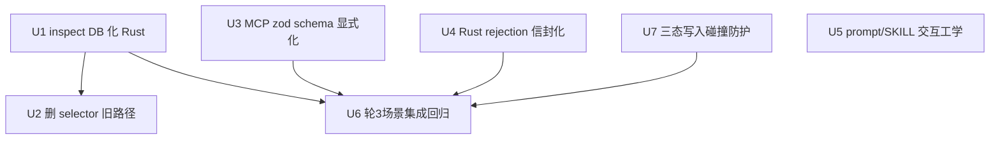

# fix: agent 增量拓扑编辑链路修复

## Overview

让 agent 真正能做「在 SW-1 和 SW-2 之间插入一台交换机」这类增量拓扑编辑。当前链路断裂:agent 查不到拓扑细节(inspect 失效)→ 猜不出操作格式(schema 不可发现)→ 被迫整表重建(用户的节点被重命名)。修复分三层:inspect 改为 DB-backed 全量 rows、apply_operations schema 显式化 + 错误可读化、worker prompt 交互工学修订。

## Problem Frame

真机日志复盘(session-a5f5f3a0,2026-06-05,5 轮 43 次工具调用)坐实三个根因。该 session 的失败链:轮 3 用户提出「SW-1/SW-2 之间插一台交换机」→ agent 猜 6 种 selector 格式全部空转 + 2 次 apply 格式 422 → 轮 4 选项编号漂移(用户答「2」被重新解释)→ 轮 5 退化为 `initialize` 整表重建(原节点全部重命名)。

1. **inspect 在 DB 世界里是坏的**:`topology_sidecar_routes.rs` 的 inspect 路由在 agent 不传 `topology` 参数时只返回 count 摘要(`selectedNodeIds` 恒空)。selector 匹配只在传入完整 topology JSON 时工作 —— 这是 Phase A 旧语义;Phase B 后拓扑权威在 SQLite P0 表,agent 上下文没有 topology JSON 可传。agent 拿不到 `imac`/`link_seq`,无法构造 apply_operations batch。
2. **apply_operations 格式不可发现**:MCP inputSchema 是 `operations: z.unknown()`,模型发明了 `{"kind":"insert-switch"}`(两次);Rust 端 serde 反序列化失败返回 axum 裸 422 "Unprocessable Entity",无任何格式提示。
3. **交互工学**:AskUserQuestion 在 `permissionMode: "dontAsk"` 下被拒(浪费一轮);agent 提供 sidecar 做不到的选项(纯中继不接端系统),用户选了才说不支持;选项编号跨轮漂移;确认碎片化(轮 1 问 3 个问题、轮 2 又问 2 个)。

selector 语义无法平移到 DB 的根本原因:`selector_matches_node` 匹配 canonical 的 string `id`("sw1")/`name`/`type` 字段,P0 表只有 `imac`/`sync_name`/`node_type`,string id 不存在。

> 规模记法约定:`A×B` = switchCount × endSystemsPerSwitch;节点数 = A × (1 + B)。如 4×5 → 24 节点,12×24 → 300 节点(会被 compute 校验拦截,见 Open Questions)。

## Requirements Trace

- R1. agent 调一次 inspect 即可获得当前会话完整拓扑细节(每个节点的 imac/类型/坐标/syncType 原文、每条链路的 link_seq/两端 imac/stylesJson 原文),足以构造 insert-switch batch。
- R2. agent 提交格式错误的 operations 时,在 MCP 层即收到可读的格式说明(合法 op 列表 + 字段要求),不再得到裸 422。
- R3. 绕过 MCP 直连 sidecar 的非法 JSON 也收到结构化错误信封(纵深防御)。
- R4. 「SW-1/SW-2 之间插一台交换机」场景端到端可走通:inspect → 构造 `[link_delete, node_add, link_add×2]` → apply_operations → mutationId,不再退化为整表重建。
- R5. agent 不再调用 AskUserQuestion;给用户的选项编号跨轮稳定(数字编号,沿用 R16 惯例);不提供后端做不到的选项;一轮聚焦一个决策点。

## Scope Boundaries

- 不引入新依赖(不用 axum-extra 的 WithRejection;手动 extractor 方案)。
- 不改 mutationId 契约、P0 表 schema、stage result 协议。
- 不做 insert-switch 高层 sidecar 路由(原子 ops + 全量 inspect 足够;若实测仍不稳再考虑,见 Deferred)。
- 不动 initialize / describe_templates / artifacts 系列工具的行为(initialize 的整表重建语义保留,用于「从 0 生成」与「换模板」)。
- node_add / link_add 的幂等重放语义(v0.3.2)保留,本 plan 在其上叠加三态碰撞防护(见 Unit 7 / Key Technical Decisions);node_update / node_delete 已有的目标存在性与防护语义不变。

## Context & Research

### Relevant Code and Patterns

- `src-tauri/src/topology_sidecar_routes.rs` — inspect 路由(L337 起,含 Phase A count fallback);`structured_error` / `ok_summary` 信封 helper;apply_operations 的 `MAX_OPERATIONS_PER_REQUEST = 32`。
- `src-tauri/src/topology_compute.rs` — `inspect_topology` + `selector_matches_node/link` + `selector_failure` + `InspectRequestBody` + `InspectSummary`(待删的旧路径)+ compute 校验常量 `MAX_NODES=200 / MAX_LINKS=600`(initialize/validate 强制,即拓扑规模的真实天花板)。
- `src-tauri/src/topology_query_command.rs` — `query_topology` 的 P0 行读取 SQL 与 row shape(`TopologyNodeRow`/`TopologyLinkRow`),inspect DB 读取直接复用此模式。
- `src-node/mcp/topology-tools.ts` — `initializeInputSchema()` 是 rich zod schema 的现成范本(dual-plane params,测试断言 `inputSchema.properties`);inspect/apply 当前是 `z.unknown()` 的遗留。既有测试 `inspect forwards topology + selectors`(topology-tools.test.ts L135)在本 plan 后语义失效,需随 U3 删改。
- `src-node/mcp/tsn-topology-server.ts` — `registerTool` 直接消费 zod shape:SDK 会生成 JSON schema 给模型并运行时校验(校验只在 registerTool/Client 调用路径生效;`runTopologyTool` 直通 handler 绕过 zod —— U3 端到端测试必须走 Client 路径)。
- `src-tauri/src/topology_ops.rs` — `TopologyOp` enum 五个 variant 的字段定义(zod schema 必须 1:1 镜像;serde `tag="op", rename_all="snake_case"`,字段 camelCase)。`node_add.syncType` 是必填的 legacy JSON 串(如 `{"_classPath":"Q.Graphs.exchanger2"}`),模型无法凭空构造。
- `src-node/claude-agent-worker.mjs` — `buildSystemPromptForStage` + `buildPrompt`(交互规则落点);`permissionMode: "dontAsk"`;`disallowedTools: []`(AskUserQuestion 硬禁的落点);buildPrompt 回复要求已用编号 1-8,新增规则需避免编号冲突。
- `.claude/skills/tsn-topology/SKILL.md` — 「已有拓扑编辑路径」段需同步;L40「P0 不支持 node.delete/node.update」与代码事实矛盾(v0.3.2 已实现),需勘误。
- 错误信封契约:`docs/topology-mcp.md:88-104`(code/message/path/severity/details/retryable/requiresUserClarification 七字段)。注意:Rust `structured_error` 实际只输出 4 字段(ok/code/message/retryable),与 docs 七字段长期不符 —— 既有漂移,U4 沿用 4 字段形态(不改 Rust 信封结构),文档勘误归 U5。

### Institutional Learnings

- 仓库无 `docs/solutions/`;惯例是 plan 内 Institutional Learnings 段。
- **数字选项编号惯例**(plan 2026-06-01-002 R16/AE9):选项用数字、每轮重置、不用字母(与阶段名冲突)。轮 4 的编号漂移正是违反此惯例的后果。
- 真机日志是最好的 agent 工学测试:本 plan 的验收用轮 3 场景重放。

### External References

- 无(zod / axum / sqlx 在 repo 内均有充分先例,跳过外部研究)。

## Key Technical Decisions

- **inspect 契约:全量 rows、无 selector**(boss 拍板,2026-06-05):响应携带该会话全部 nodes(imac/syncName/nodeType/syncType/x/y/insertOrder)+ links(linkSeq/name/srcImac/dstImac/stylesJson)。理由:P0 表没有 string id,selector 语义无法平移;模型擅长读数据、不擅长猜 DSL(轮 3 六连空是实证);拓扑规模的真实天花板是 compute 校验 `MAX_NODES=200`(initialize 生成时强制,超限模板参数被拒),200 节点全量 rows ≈ 15KB,可控。inspect 出向不设独立上限是**有意决策**:数据只能经 initialize(≤200 节点)与 apply_operations(单批 ≤32 op)进入,出向规模有界。selector/adjacency 代码整体删除,单路径。
- **原文复制参照:stylesJson(links)与 syncType(nodes)都随 rows 原文返回**:模型构造新 link_add 时参考既有 stylesJson 格式(leftLabel/rightLabel/speed);构造新 node_add 时**复制邻近同类节点的 syncType 原文**(legacy `_classPath` JSON 串模型无法凭空构造)。给原文比给文档更可靠。
- **格式校验前移到 MCP zod schema**:`registerTool` 的 SDK 校验让模型在不打 HTTP 的情况下就收到字段级错误;Rust 端手动 extractor(`Json<Value>` + `serde_json::from_value`)作纵深防御,失败时返回 `INVALID_OPERATION` 信封(沿用 `structured_error` 既有 4 字段形态)并列出合法 op 形态。不引 axum-extra。SDK 校验失败回传形态已定论(见 Open Questions):isError:true 可读文本,主路径成立。
- **AskUserQuestion 双层禁用**:`disallowedTools: ["AskUserQuestion"]` 硬禁(结构性保证)+ prompt 规则(省掉模型尝试浪费的 turn)。单靠 prompt 与本 plan 自己「模型不读 SKILL.md」的论证矛盾。
- **写入碰撞防护:三态写入**(boss 拍板,2026-06-05,document-review P0 finding):v0.3.2 的纯 UPSERT 使「幂等重放(同值)」与「碰撞覆盖(异值)」不可区分 —— 模型选了已占用 imac 会静默覆盖现有节点。node_add/link_add 改三态:目标不存在 → 插入;存在且同值 → no-op(保留幂等重放);存在且异值 → 报 `IMAC_TAKEN`/`LINK_SEQ_TAKEN`。实现形态用 `INSERT ... ON CONFLICT DO NOTHING` + `rows_affected==0` 时 SELECT 读回比对(写决策保持原子,消除 SELECT-then-INSERT 的 TOCTOU 窗口;review pass 2 修正)。**同值比较只针对模型实际提供的字段**(absent 的 optional 字段不参与异值判定 —— 防 LLM 重试时省略 nodeType/name 触发假阳性);x/y 用 Rust f64 直比(initialize 坐标全为精确可表示值,round-trip 无损,前提显式化)。`IMAC_TAKEN` 的错误信息必须给出路:「修改已有节点属性请用 node_update;新增节点请换未占用 imac(先 inspect)」—— 防模型在「移动节点」场景被推向重复插入。
- **三态写入的边界(review pass 2,adversarial)**:它只防同 key 碰撞。timeout-retry 时模型若**重新生成** batch 并改用不同 linkSeq,两条新 link_add 是全新主键 → 平行链路静默增殖,三态无感。TSN 域里同端点对平行链路是合法形态(dual-plane 双平面),不能用 DUPLICATE_LINK 全局拦截 —— 缓解走 prompt(U5 规则:重试必须复用原 batch 的 imac/linkSeq,不要重新分配)+ U6 负向测试固化此已知边界。
- **zod union 暴露全部 5 个操作**(boss 拍板,2026-06-05):node_update/node_delete 代码已实现且带防护语义,藏着没有意义;「把 sw2 移到右边」类需求经 node_update 直接可达。两份 agent 文档的「P0 不支持」陈述由 U5 勘误。
- **不做 insert-switch 高层路由**:R1+R2 修复后,原子 ops 的组合(4 ops)对模型可达;保持工具面最小。
- **prompt 规则进 worker 而非 SKILL.md 为主**:轮 3 显示模型未读 SKILL.md(无 Skill 调用);system prompt / buildPrompt 是必达通道,SKILL.md 同步但作为次级。

## Open Questions

### Resolved During Planning

- selector 是否保留:不保留(见 Key Technical Decisions;boss 拍板全量 rows)。
- 规模上限:拓扑规模的真实天花板是 compute 校验 `MAX_NODES=200 / MAX_LINKS=600`(initialize 强制;12×24 模板参数会被拦截,实际可产生的拓扑 ≤200 节点)。inspect 出向不设独立上限,理由见 Key Technical Decisions。
- 信封形态:`INVALID_OPERATION` 沿用 `structured_error` 4 字段(与 LIMIT_EXCEEDED 等既有错误一致);docs 七字段契约与 Rust 实现的既有漂移在文档同步时勘误,不在本 plan 改 Rust 信封结构。
- SDK zod 校验失败回传形态(已从 SDK 源码定论,review pass 2):SDK `validateToolInput` throw `McpError` 后被 CallTool handler catch 包成 `{isError:true, content:[{type:"text", text:"Input validation error: ..."}]}` —— 模型拿到可读文本,主路径成立,**不需要** handler 内 safeParse 兜底。副作用:zod 层错误是 isError 纯文本、sidecar/rejection 层是 `{ok:false,...}` JSON,模型需容忍两种错误形态(见 System-Wide Impact)。

### Deferred to Implementation

- Rust 手动 extractor 的具体形态(`Json<Value>` 两段式 vs `axum::extract::rejection` 拦截):以改动最小、信封一致为准,实施时定。
- inspect 响应里 nodes/links 的字段命名最终以 `query_topology` 的 serde camelCase 输出对齐(实施时直接镜像,避免两套命名)。
- 轮 3 重放的断言粒度(产物 batch 是否逐字段断言):写测试时按可维护性取舍。


### Deferred Features(后续评估,不在本 plan)

- insert-switch 高层 sidecar 路由:原子 ops 实测仍不稳时再考虑。
- `topology.validate` / `build_artifacts` 仍接受 topology JSON 入参,与 DB 权威不匹配(模型没有 topology JSON 可传)—— 与本 plan 同病但使用频率低,记入 TODOS 评估。

## High-Level Technical Design

> *方向性示意,非实现规范。*

```
修复后的增量编辑数据流(轮 3 场景):

  用户:"SW-1 和 SW-2 之间加一台交换机"
        │
        ▼
  agent ──inspect(无参数)──▶ sidecar ──SELECT──▶ P0 表
        ◀─{nodes:[{imac:100,syncName:"1",nodeType:"switch",syncType:"{\"_classPath\":...}",...}×24],
           links:[{linkSeq:0,srcImac:100,dstImac:101,stylesJson:"..."}×23]}──
        │  模型在 rows 里自己找到 sw1=imac100、sw2=imac101 之间的 linkSeq,
        │  并复制邻近交换机的 syncType / 链路的 stylesJson 作为新行参照
        ▼
  agent ──apply_operations(zod 校验通过)──▶ sidecar
          [{op:"link_delete",linkSeq:N},
           {op:"node_add",imac:124,syncName:"...",x:…,y:…,syncType:"<复制>",insertOrder:24},
           {op:"link_add",linkSeq:23,srcImac:100,dstImac:124,stylesJson:"<参照>"},
           {op:"link_add",linkSeq:24,srcImac:124,dstImac:101,stylesJson:"<参照>"}]
        ◀─{ok:true,summary:{mutationId:M}}──(幂等重放安全 + 碰撞防护,见 U7)
        ▼
  worker 捕获 mutationId → stage result → UI 画布增量更新(无重命名)

  格式错误的双层拦截:
  模型发明错误格式 ──▶ MCP SDK zod 校验 ──▶ 字段级错误直接回给模型(不打 HTTP)
  直连非法 JSON   ──▶ Rust 手动 extractor ──▶ INVALID_OPERATION 信封 + 合法 op 列表
```

## Implementation Units



- [x] **Unit 1: inspect 路由改为 DB-backed 全量 rows**

**Goal:** agent 一次 inspect 拿到构造 ops batch 所需的全部细节。

**Requirements:** R1, R4

**Dependencies:** 无

**Files:**
- Modify: `src-tauri/src/topology_sidecar_routes.rs`(inspect 路由重写;`InspectRequest` 收敛为仅 `session_id`)
- Test: `src-tauri/src/topology_sidecar.rs`(tests 模块,oneshot 路由测试;既有 inspect count 摘要测试随响应 shape 变化重写)

**Approach:**
- 删除 count fallback 与 topology/selectors 分支;统一从 P0 表 SELECT(SQL 与排序镜像 `topology_query_command.rs`:nodes 按 insert_order,links 按 link_seq)。
- 响应 `ok_summary`:`{sessionId, nodeCount, linkCount, nodes:[...], links:[...]}`,nodes 含 syncType 原文,字段 camelCase 与 `query_topology` 一致。
- 空拓扑会话返回空数组(非错误)。

**Patterns to follow:** `topology_query_command.rs` 的行读取与 serde 输出;routes 内既有 `ok_summary` 用法。

**Test scenarios:**
- Happy path:seed 3 节点 2 链路 → inspect 返回完整 rows,顺序正确,字段 camelCase(断言 imac/syncName/syncType/linkSeq/srcImac/stylesJson 取值)。
- Edge case:空拓扑会话 → `nodes:[] links:[]`,ok:true。
- Error path:未知 sessionId → 既有 `require_session` 422 行为不变。
- Happy path:auth(带 token 200,已有测试模式覆盖,确认不回归)。
- 测试基建:全量 rows 响应体超过既有测试惯用的 `to_bytes(.., 4096)` 上限;本 unit 新断言、**重写的既有 inspect count 测试**、以及 U6 的读取统一用宽裕上限(如 65536)。

**Verification:** 路由测试绿;手动 curl 同 shape 可选。

- [x] **Unit 2: 删除 selector 旧路径**

**Goal:** 单路径;selector/adjacency 死代码清零,grep gate 不受影响。

**Requirements:** R1(收尾)

**Dependencies:** Unit 1

**Files:**
- Modify: `src-tauri/src/topology_compute.rs`(删 `inspect_topology`/`InspectRequestBody`/`InspectSummary`/`InspectAdjacency`/`selector_matches_*`/`selector_failure`/`build_port_usage`(已确认无其他调用方)+ 对应 tests)
- Modify: `src-tauri/src/topology_sidecar_routes.rs`(删 `compute_inspect` import)

**Approach:** `INVALID_SELECTOR`/`SELECTOR_NOT_FOUND`/`AMBIGUOUS_SELECTOR` 错误码随之消失;`docs/topology-mcp.md` 的错误码勘误归属 U5(其 Files 已列该文档)。

**Test scenarios:**
- 删除 `topology_compute.rs` tests 模块内所有引用 `inspect_topology`/`selector_*` 的用例(含断言 `AMBIGUOUS_SELECTOR` 等错误码的用例)—— 只删生产函数不删测试会直接编译失败。验收 = cargo 全绿 + 编译零 dead_code 警告。

**Verification:** cargo test 全绿;`cargo build` 无 dead_code warning。

- [x] **Unit 3: MCP 层 schema 显式化**

**Goal:** 模型从工具定义即知 op 格式;格式错误在 MCP 层被 SDK 拦截并给出字段级反馈。

**Requirements:** R2, R4

**Dependencies:** 无(与 U1 并行)

**Files:**
- Modify: `src-node/mcp/topology-tools.ts`(apply_operations 的 `operations` 改 `z.array(z.discriminatedUnion("op", [...]))`,字段 1:1 镜像 `TopologyOp` 的 serde 形态:`op` 值 snake_case、字段名 camelCase;`dryRun: z.boolean().optional()`;inspect 的 inputSchema 收敛为空对象;description 同步新语义)
- Test: `src-node/mcp/topology-tools.test.ts`(**删除/重写既有 `inspect forwards topology + selectors` 用例**(L135)→ 改断言 inspect 仅转发 sessionId、inputSchema 不再含 topology/selectors 键;新增 schema 校验用例)

**Approach:**
- 以 `initializeInputSchema()` 为范本写 `applyOperationsInputSchema()`。
- `node_add` 的 `syncType`/`insertOrder`/`nodeType` 标注 required(nodeType 在 Rust 端虽 Option,zod 层收紧消除 absent 歧义 —— inspect 返回的行总有非 NULL nodeType 可复制);description 提示「新节点的 syncType/nodeType 复制 inspect 返回的同类节点原文;新 imac/linkSeq 需避开已占用值(先 inspect);**修改已有节点属性用 node_update,node_add 仅用于新增 imac**」。
- `.max(32)` 与 sidecar `MAX_OPERATIONS_PER_REQUEST` 对齐。
- discriminatedUnion 暴露全部 5 个 variant(node_add/node_update/node_delete/link_add/link_delete;boss 拍板,文档勘误归 U5)。
- 实测确认 SDK zod 校验失败时回给模型的形态是结构化错误(而非 throw);若不符,handler 内补 safeParse 兜底并更新 Open Questions。

**Test scenarios**(分两类,review pass 2:`runTopologyTool` 直通 handler 绕过 zod,端到端必须走 Client 路径):
- Schema 单测(直接对 `applyOperationsInputSchema()` 构造的 z.object 做 safeParse):
  - Happy path:合法 insert-switch batch 解析通过。
  - Error path:`{"kind":"insert-switch"}`(轮 3 真实错误输入)被拒,issues 含 op 字段提示。
  - Error path:`op:"node_add"` 缺 `imac` / 缺 `syncType` / 缺 `nodeType` 被拒。
  - Edge case:33 个 operations 被 `.max(32)` 拒绝。
- Client 端到端(`createTsnTopologyMcpServer` + InMemoryTransport + `client.callTool`,沿用既有 L334 用例模式):
  - Integration:非法 op 经 SDK 校验返回 `isError:true` 且 content text 含「Invalid arguments」+ op 提示 —— 这是「不打 HTTP 收到字段级错误」机制的唯一真实覆盖路径。
- Registry:`TOPOLOGY_MCP_ALLOWED_TOOLS` 映射不回归;inspect schema 为空对象(不含 topology/selectors 键)。

**Verification:** vitest topology-tools 套件绿。

- [x] **Unit 4: Rust JSON rejection 信封化(纵深防御)**

**Goal:** 绕过 MCP 的非法 JSON 也得到结构化错误 + 合法 op 列表。

**Requirements:** R3

**Dependencies:** 无(与 U1/U3 并行)

**Files:**
- Modify: `src-tauri/src/topology_sidecar_routes.rs`(apply_operations 改收 `Json<Value>`,`serde_json::from_value::<ApplyOpsRequest>` 失败 → `structured_error(422, "INVALID_OPERATION", "<serde 错误> | 合法 op: node_add/node_update/node_delete/link_add/link_delete,字段见工具 schema", false)`)
- Test: `src-tauri/src/topology_sidecar.rs`(tests)

**Approach:** 仅 apply_operations 路由做两段式解析(其他路由请求体简单,误用概率低);错误 message 一行内、面向模型可读;沿用 `structured_error` 既有 4 字段形态(ok/code/message/retryable),不改信封结构(docs 七字段契约的既有漂移由 U5 文档勘误说明)。

**Test scenarios:**
- Error path:POST `{"sessionId":"s1","operations":[{"kind":"insert-switch"}]}` → 422 + `code:"INVALID_OPERATION"` + message 含 `node_add`(不再是裸 "Unprocessable Entity")。
- Happy path:合法 batch 行为与现状一致(mutationId 正常 mint,既有测试不回归)。

**Verification:** cargo 路由测试绿。

- [x] **Unit 5: worker prompt + SKILL.md + 文档同步(交互工学)**

**Goal:** 消除轮 2-4 的交互浪费:硬禁 AskUserQuestion、选项可落地、编号稳定、一轮一个决策点、闲聊不空转工具;同步两份 agent-facing 文档与代码事实。

**Requirements:** R5

**Dependencies:** 无(语义上配合 U1/U3 的新工具描述)

**Files:**
- Modify: `src-node/claude-agent-worker.mjs`(`buildSystemPromptForStage` + `buildPrompt` 的结构化指引段;`disallowedTools: ["AskUserQuestion"]`)
- Modify: `.claude/skills/tsn-topology/SKILL.md`(「已有拓扑编辑路径」改为:inspect 全量 → 在 rows 中定位 imac/linkSeq → 构造原子 ops;删 selector 指引;**勘误 L40「P0 不支持 node.delete/node.update」**——两者已实现且带防护语义)
- Modify: `docs/topology-mcp.md`(删 `AMBIGUOUS_SELECTOR` 等 selector 错误码、补 `INVALID_OPERATION`;勘误「node.delete/node.update 返回 UNSUPPORTED_OPERATION」段;注明错误信封实际 4 字段形态)
- Test: `src-node/claude-agent-worker.test.mjs`(buildPrompt 文案断言更新)

**Approach:** prompt 增量规则(精炼,各一句):
1. 不要调用 AskUserQuestion(已硬禁;运行环境无终端 UI),需要用户决策时在中文回复里列数字编号选项;
2. 选项编号用数字、跨轮保持指代稳定,采纳过的编号不复用为新含义(沿用 R16 惯例);
3. 只提供当前工具/模板能落地的选项;
4. 一轮聚焦一个决策点,有合理默认值时给默认并允许一句话确认;
5. 用户的简短确认(如「速率够用」)不需要调用工具,直接推进;
6. 增量修改优先用 inspect+apply_operations,不要用 initialize 重建已确认的拓扑(会重排命名);
7. 不要把 inspect 返回的 rows / stylesJson / syncType 原文复述进中文回复(沿用既有「不复述完整 changeSet」边界);
8. apply_operations 超时重试时必须**逐字节复用上一次的同一 batch**(相同 imac/linkSeq),不要重新分配 —— 重新分配 linkSeq 会产生重复平行链路(三态防护对不同 key 无感,见 U7 边界)。

新增规则措辞需与 worker.test.mjs 既有 `not.toContain` 断言交叉核对,且避免与 buildPrompt 既有「回复要求」编号 1-8 冲突。

**Test scenarios:**
- Happy path:buildPrompt 输出包含「不要调用 AskUserQuestion」「inspect」「不要用 initialize 重建」等新指引(文案断言,3-4 个关键短语)。
- Happy path:**改写既有断言** worker.test.mjs 的 `expect(disallowedTools).toEqual([])` → `toEqual(["AskUserQuestion"])`(精确断言必须更新而非新增,否则套件红)。
- Happy path:既有 prompt 断言(`tsn_topology MCP 工具`/`trusted topology result` 等)不回归;新文案不触发既有 `not.toContain` 断言。

**Verification:** vitest worker 套件绿。

- [x] **Unit 6: 轮 3 场景端到端回归**

**Goal:** 把真机失败场景(轮 3 提出、轮 5 退化重建)固化为自动化回归:insert-switch 全流程在路由层可走通,且原节点身份保持不变。

**Requirements:** R4

**Dependencies:** Unit 1, 3, 4, 7

**Files:**
- Test: `src-tauri/src/topology_sidecar.rs`(tests:`insert_switch_via_inspect_then_apply_round_trip`)

**Approach:** 路由层 oneshot 序列:initialize(4×5)→ inspect 全量 → 从响应中程序化定位 sw1-sw2 链路的 linkSeq 与两端 imac(模拟模型行为)→ 构造 `[link_delete, node_add, link_add×2]`(node_add 的 syncType 复制自既有交换机行)→ apply_operations → 断言 mutationId 递增、节点数 25、链路数 24、**原有 24 节点的 imac/syncName 逐一保持不变**(这正是轮 5 整表重建破坏的性质)。

**Test scenarios:**
- Integration:上述全流程(读取响应体用宽裕 `to_bytes` 上限,见 U1)。
- Edge case:对插入后的拓扑再次 inspect → 新交换机与两条新链路出现在 rows 中。
- Error path:故意用已占用 imac 重发 node_add(异值)→ `IMAC_TAKEN`,message 含 node_update 指引,原节点不变(U7 防护在路由层可见)。
- Known-boundary(负向,固化三态防护的边界):重放 insert-switch batch 但两条 link_add 改用新 linkSeq → 整批成功且产生平行链路(数据库视角合法;此即 U5 prompt 规则 8 存在的原因,测试注释指回该规则)。

**Verification:** cargo test 绿;该测试在 U1 之前的代码上必然失败(inspect 拿不到 rows)。**边界声明**:本测试证明的是机制(apply 路径保持节点身份),「agent 实际选择 apply 而非 initialize」的用户可见性质由 U5 prompt 规则 + ship 后真机重放共同覆盖(见 Risks)。

- [x] **Unit 7: 写入碰撞防护(三态写入)**

**Goal:** 模型选用已占用 imac/linkSeq 时收到明确错误而非静默覆盖现有节点;幂等重放语义保持不变;错误信息引导模型选对 op。

**Requirements:** R4(数据安全前提)

**Dependencies:** 无(与 U1/U3/U4 并行;在 v0.3.2 的 UPSERT 语义上改造)

**Files:**
- Modify: `src-tauri/src/topology_ops.rs`(node_add/link_add 改三态写入;`OpError` 增 `ImacTaken`/`LinkSeqTaken` variant,code `IMAC_TAKEN`/`LINK_SEQ_TAKEN`,422 不可重试;**更新 apply_op 头部幂等约定注释**——现文写死「使用 UPSERT」,与新行为矛盾)
- Test: `src-tauri/src/topology_ops.rs`(tests 模块)

**Approach:**
- 原子形态:`INSERT ... ON CONFLICT DO NOTHING`;`rows_affected==1` → 插入成功;`rows_affected==0` → SELECT 读回现有行比对 —— 同值 → no-op(幂等重放),异值 → 报错。写决策由数据库原子完成,比对只读,无 TOCTOU 窗口。
- **同值比较只针对模型实际提供的字段**:absent 的 optional 字段(node 的 nodeType、link 的 name)不参与异值判定;提供的字段逐一比对(node:syncName/x/y/syncType/insertOrder + 提供时的 nodeType;link:srcImac/dstImac/stylesJson + 提供时的 name)。x/y 用 f64 直比(initialize 坐标全为精确可表示值,JSON/REAL round-trip 无损)。
- `IMAC_TAKEN` 错误信息含 op 选择指引:「imac=X 已存在;修改其属性请用 node_update,新增节点请换未占用 imac(先 inspect)」。`LINK_SEQ_TAKEN` 同理。
- 既有 `insert_switch_batch_replay_is_retry_safe` 回归测试必须继续通过(重放=同值=no-op);逐一核对 ops tests 无用例依赖「node_add 异值覆盖」语义(有则随本 unit 改写)。

**Patterns to follow:** link_add 的悬空校验 SELECT(v0.3.2)是读回比对的同形先例;`ON CONFLICT DO NOTHING` 是对既有 `DO UPDATE` 的最小改写。

**Test scenarios:**
- Happy path:新 imac 插入成功(rows_affected=1)。
- Happy path:同值重放 → no-op,整批重放回归测试不回归。
- Happy path:重放时省略 optional 字段(nodeType absent,存量行 nodeType="switch")→ 仍判同值 no-op(假阳性回归,review pass 2)。
- Error path:已占用 imac + 异值(x/y 不同)→ `IMAC_TAKEN`,message 含 `node_update` 指引,事务回滚,原节点完好。
- Error path:已占用 linkSeq + 异值 → `LINK_SEQ_TAKEN`。
- Edge case:node_update 不受影响(目标必须存在的语义不变)。

**Verification:** cargo ops 测试绿;v0.3.2 重放回归测试不回归;apply_op 注释与新语义一致。

## System-Wide Impact

- **Interaction graph:** inspect 响应 shape 变化的消费方只有 agent(模型);worker 的 trusted 提取只看 apply_operations/initialize 的 `summary.mutationId`,不受影响。UI 读路径走 `query_topology` Tauri command,与 inspect 路由无耦合。
- **API surface parity:** `topology.validate` / `build_artifacts` 仍接受 topology JSON 参数(模型现在没有 topology JSON 可传 —— 既有事实,见 Deferred Features)。
- **Error propagation:** 新增 `INVALID_OPERATION`(rejection)与 `IMAC_TAKEN`/`LINK_SEQ_TAKEN`(U7)沿用 `structured_error` 4 字段形态;`INVALID_SELECTOR` 系列错误码消失,`docs/topology-mcp.md` 勘误归属 U5。模型面对的错误形态有两种:zod 层 isError 纯文本、sidecar 层 `{ok:false,...}` JSON —— 已知不一致,均可读,接受现状。
- **Unchanged invariants:** mutationId 契约、stage result schema、P0 表结构、initialize 整表重建语义不变。apply_operations 的**同值幂等重放**不变;**同 key 异值写从 UPSERT 静默覆盖改为报错**(U7,有意的 behavioral break,不在「不变」之列)。
- **Integration coverage:** U6 的路由层全流程测试覆盖「inspect → 构造 → apply」的跨层组合(zod 端由 U3 vitest、serde 端由 U6 cargo **各自**守护;两端共用同一 insert-switch batch 形态作为 fixture 以防漂移)。

## Risks & Dependencies

| Risk | Mitigation |
|------|------------|
| 全量 rows 在大拓扑下撑大模型上下文 | 真实天花板 = compute `MAX_NODES=200` ≈15KB;一次性读取;U5 prompt 规则 7 禁止复述 rows 进对话 |
| 模型选用已占用的 imac/linkSeq | U7 三态写入:异值碰撞报 `IMAC_TAKEN`/`LINK_SEQ_TAKEN` 不落库;同值重放保持幂等;错误信息含 node_update 出路 |
| 重试时模型重新分配 linkSeq → 平行链路增殖(三态对不同 key 无感) | TSN 域平行链路合法(dual-plane),不能全局拦截;U5 prompt 规则 8(重试逐字节复用原 batch)+ U6 负向测试固化边界;残余风险接受 |
| 模型仍构造错误 batch(逻辑错,非格式错) | v0.3.2 幂等 + 悬空校验保证悬空/越界 batch 不落库且错误可读;U5 prompt 引导「先 inspect 再操作」 |
| zod schema 与 Rust serde 漂移 | U3 测试用轮 3 真实错误输入断言;U3(zod 端)与 U6(serde 端)用同一 batch fixture 各自断言 |
| prompt 修订引发既有行为回归 | worker 既有 prompt 断言保留 + 新文案与 `not.toContain` 交叉核对;真机回归(ship 后 boss 实测轮 3 场景) |

## Sources & References

- 真机日志:`~/Library/Application Support/com.tsnagent.app/agent-runs/session-a5f5f3a0-*/`(5 轮复盘)
- 根因代码:`src-tauri/src/topology_sidecar_routes.rs`(inspect count fallback)、`src-node/mcp/topology-tools.ts`(z.unknown)
- 相关 plan:`docs/plans/2026-06-03-001-refactor-topology-mcp-single-db-domain-plan.md`(Phase A/B 背景)
- 选项编号惯例:plan 2026-06-01-002 R16/AE9
