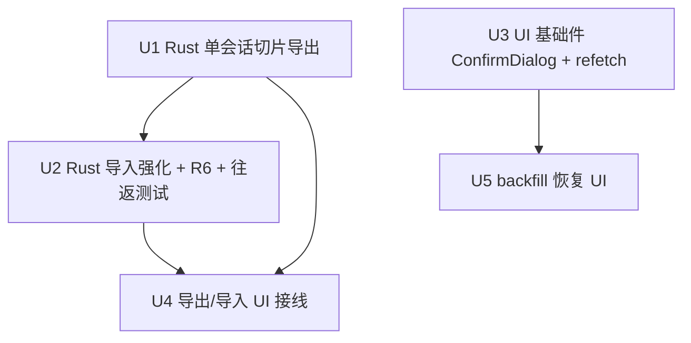

# feat: 会话导出/导入 UI + Backfill 失败恢复 UX

## Overview

把两组已就绪但 UI 无入口的 Rust 命令接到用户面前:会话导出/导入(`export_session`/`import_session`)与 backfill 失败恢复(`retry_backfill`/`list_backfill_failures`/`view_session_payload`)。硬前置:当前导出是整库 `VACUUM INTO`(隐私泄漏 + 导入端拒绝多 session DB,**导出的文件根本导不回去**),且 scrub 非事务(restore 失败永久丢 payload)——必须先重写为单会话切片导出。出处:TODOS.md 两个 P1(adversarial 2026-06-04)。

## Problem Frame

- **导出导不回去**:`VACUUM INTO` 复制整库;`import_session` 的单 session 校验(`SELECT ... LIMIT 2`,>1 行即拒)直接拒绝这种文件。功能从未真正闭环。
- **导出有数据风险**:scrub(`UPDATE payload='{}'` → VACUUM → restore)三步无事务;restore 失败时主库 payload 已是 `{}` 且永久丢失;并发 save 可读到 `{}`。
- **失败会话不可见**:backfill 失败的会话在 UI 与空会话完全相同(badge 只看 `topologyMutationId`);恢复命令齐备但用户无从触达。
- **retry 是隐形数据销毁**:`retry_backfill` → walker `DELETE FROM topology_nodes/links/refs` + 从 payload 重建——MCP 增量编辑(apply_operations 写入)全部丢失,且无任何确认。

## Requirements Trace

- R1. 导出产物是**单会话切片**(仅该会话的 sessions 行 + P0 表行;payload 置 `'{}'`),能被 `import_session` 接受,导出↔导入真往返;导出过程**主库零写入**(scrub/restore 路径删除)。
- R2. 导出 UI:save 对话框 → 导出 → 成功反馈(含「在 Finder 中显示」);agent 运行中禁用导出;已存在文件由 Rust 接受覆盖(OS 对话框已是用户确认点)。
- R3. 导入 UI:open 对话框 → 校验失败以可读文案呈现 → id 冲突自动生成新 id 重试一次 → 成功后会话列表刷新并选中新会话。
- R4. 失败会话在列表带显式失败标记;可查看错误详情(error_code 映射为可读文案)与 payload(截断 + 滚动);retry 前确认弹窗(该会话有 P0 行时强警告「增量修改将丢失」);retry 后失败列表/badge/画布三处同步。
- R5. 导入上限校验:行数对齐 compute 上限(nodes ≤200 / links ≤600),关闭 inspect 出向 DoS 的 import 缺口(TODOS P2 折入,boss 拍板)。
- R6. 导入的会话带终态 backfill 状态:`mark_pending_for_all_sessions` 只看 backfill_state 缺行,导入会话(payload `'{}'`)每次启动都会经历 pending→completed 的无谓循环(walker 对 `'{}'` 直接 `mark_completed`,topology_backfill.rs:168——**不会**失败也不会删行,但循环本身多余且依赖该分支语义永不变化)——导入事务内写 `completed_walker` 行,消除循环并对 walker 语义变化免疫。

## Scope Boundaries

- 不做 ops 白名单收敛(import 改走 apply_op 路径)——TODOS P2 保留,本 plan 仅在 import 头注释**追认偏离**(boss 拍板:只折入上限校验)。
- 不做 retry 合并策略(diff 重建结果与现状)——确认弹窗方案(boss 拍板)。
- 导出**不含聊天记录**:payload 置 `'{}'` 延续 2026-06-03 plan U8 的防泄漏决策(导出物只含拓扑工程数据)。这是显式产品边界,如需「含对话的会话备份」是另一个 feature。
- 不引入新依赖:`@tauri-apps/plugin-dialog`(2.7.1)与 `tauri-plugin-dialog`(Rust)均已安装注册,只缺 capability 与前端调用;`tauri-plugin-opener` 已注册(reveal 用)。
- 不动 mutationId 契约、P0 表 schema、walker 的 DELETE+重建语义本身。
- backfill 相关**不新增任何 Tauri 事件**(含 TODOS 里提的 `backfill_progress`):启动 walker 在 setup 内同步完成于窗口创建之前,事件没有有效接收窗口;失败列表是查询型 UI(mount invoke + retry resolve 回调已覆盖全部刷新时机)。TODOS 该行随本 plan 勾销时注明此结论。

## Context & Research

### Relevant Code and Patterns

- `src-tauri/src/session_export.rs` — 现 VACUUM INTO + scrub 三步(L68-105,restore 失败即丢 payload);`apply_owner_only_permissions` 0600 保留;4 个既有测试随重写全部重写。
- `src-tauri/src/session_import.rs` — 接受格式校验链(10MB / `integrity_check` / `application_id 0x54534E01` / 单 session LIMIT 2 / id 冲突拒绝 + `new_session_id` 参数已支持);`copy_table!` 宏逐表 INSERT SELECT;**tests 的 `produce_export_db`(L350-374)就是单会话导出的现成蓝图**——U1 落地后 U2 测试改用真实导出函数构造 fixture(真往返)。
- `src-tauri/src/db.rs` — `safety_net_schema_sql()` 完整建表 SQL,导出新库直接用;`application_id` 写入位置需确认随建库设置(import 校验它)。
- `src-tauri/src/topology_backfill.rs` — `mark_pending_for_all_sessions`(L39-54)SQL 无 payload 过滤(R6 根因);`run_walker_for_pending_sessions`(L135);`mark_completed`(L374,`INSERT ... ON CONFLICT DO UPDATE` 形态,U2 复用);`BackfillStateRow` shape(session_id/state/error_code/attempted_at);walker 调用点在 `lib.rs` setup(有 AppHandle,emit 落点)。
- `src-tauri/src/lib.rs` — `invoke_handler` 注册(L89-117,命令已全注册);`session_db_changed` emit 模式(L67-82,`emit_to("main", ...)` + fallback);`tauri_plugin_dialog::init()` 已注册(L31)。
- `src-tauri/capabilities/default.json` — 已有 `dialog:allow-open`,**缺 `dialog:allow-save`**(导出对话框必需)。
- `src/app/App.tsx` — SessionToolPanel 会话列表(L845-900,badge 逻辑 `topologyMutationId ? "配置草案" : "空会话"`);**无 modal 组件**(stage-confirmation div 是唯一近似物);`handleNewSession`/`handleSelectSession` 是「invoke 后刷新列表+选中」的参考模式。
- `src/sessions/session-repository.ts` — `StoredSession` shape(无 backfill 状态字段);`list()` 刷新入口。
- `src/app/hooks/use-topology-snapshot.ts` + `use-session-db-listener.ts` — invoke + listen 双轨模式;**未暴露命令式 refetch**(U3 补)。
- `src/agent/listen-to-session-db-changes.ts` — 事件监听器范本(新建 backfill 事件监听镜像它)。
- `src/app/App.test.tsx` — `vi.mock` invoke/listen 按 command 分支的测试模式;新 invoke 加分支即可。

### Institutional Learnings

- **INSERT OR REPLACE 触发 CASCADE 清空子表**(plan 2026-06-03 ship P0):import 写 sessions 必须用普通 INSERT(现状如此,冲突已被前置拒绝);U1 导出写独立新库无此语境,但 implementer 不得在任何 sessions 写入处使用 REPLACE。
- **数字选项编号惯例**(R16/AE9):确认弹窗按钮文案明确动词(「重建」「取消」),不用字母编号。
- **写库动作必须一步闭环**(initialize 教训):导入成功 = 数据落库 + state 行写入同一事务,不依赖后续步骤补状态。

### External References

- 无(Tauri dialog/opener、sqlx、React 模式仓库内均有先例)。

## Key Technical Decisions

- **单会话切片导出 = 新建空 DB + `safety_net_schema_sql()` + 双连接逐表 `INSERT ... SELECT ... WHERE session_id = ?`**:双连接定案(ATTACH 是连接级操作,sqlx 池下不可靠——`session_export.rs:156` 的 `max_connections(1)` 正为此;`session_import.rs:86-90` 已是双连接蓝图);源库直接复用 SessionStore 既有 pool(只读 SELECT)。导出文件天然只含目标会话;主库全程只读 → scrub/restore 路径及其全部竞态**整体删除**。`PRAGMA application_id` 随 `safety_net_schema_sql` 在新库执行写入(db.rs:242 末行即是,import 端校验它)。sessions 行的 payload 列在 INSERT SELECT 的列清单里用字面量 `'{}'` 替换(原子,不在导出库上二次 UPDATE)。
- **覆盖语义 = 写临时文件 + 原子 rename**(boss 拍板接受覆盖;review 修正实现形态):写 `{target}.tmp` → 成功后 `fs::rename` 替换(同分区原子)→ 失败只删 `.tmp`,**用户的旧备份全程不动**。直接 remove+create 的窗口会在导出失败时销毁用户唯一备份。rename 前对 target 做 `symlink_metadata` 检查拒绝 symlink(镜像 `project_writer.rs:210-215` 既有模式)。
- **导出/导入表清单共享常量**:定义 `const`(表名+列清单)单一事实源;import 的 5 张主表 `copy_table!` 宏调用**重构为 for 循环遍历该常量**(仿照其 10 张子表既有的循环+match 模式——宏无法迭代 const),export 侧遍历同一常量。防两端漂移:导出写了 import 不收的表 = 静默丢数据。
- **id 冲突自动新 id**(boss 拍板):UI 捕获「目标 session 已存在」错误后静默用 `createId("session")` 作 `newSessionId` 重试一次;二次失败才报错。
- **retry 确认弹窗**(boss 拍板;review 简化):新建轻量 ConfirmDialog(U5 retry 确认用);文案固定为强警告「将从原始数据重建,该会话现有拓扑数据将被替换」——不做 P0 行数条件判定:failed 会话的 P0 行恒为 0(failed_parse 不进 DELETE;failed_constraint 事务回滚),条件分支是不可达路径。
- **R6 = 导入事务内写 `completed_walker`**:UPSERT SQL **内联**在 import 事务中(`mark_completed` 签名是 `&SqlitePool`,不接受事务——5 行 SQL 内联比跨模块改泛型签名改动更小);与行复制同事务提交、同事务回滚。不改 `mark_pending_for_all_sessions` 的 SQL。
- **上限校验位置在 import 事务内、复制前**:`SELECT COUNT(*)` 源库 nodes/links,超 200/600 即整体拒绝;**直接 `use crate::topology_compute::{MAX_NODES, MAX_LINKS}`**(已是 pub,同 crate)——禁止复制魔法数字。
- **字段级大小上限**(security review 补强):行数限不住单字段炸弹(10MB 文件可装 1 行 9MB 的 styles_json,经 inspect 直达模型上下文)。import 复制循环中对 TEXT 字段加字节上限(styles_json/sync_type ≤4KB、ref_json/各 cfg_json/spec_json/entry_json ≤64KB、mac_address/ip ≤64B),超限整体拒绝;styles_json 额外做 JSON 结构校验(必须 parse 为 object)。styles_json 内容级注入面(prompt injection)显式 defer 至 TODOS P2(ops 白名单收敛),plan 注记。
- **不新增任何 Tauri 事件**(review 修正:原 walker-done 事件设计是死代码——`lib.rs` setup 内 `block_on` 同步跑 walker,窗口尚不存在,`emit_to("main")` 必然丢失;retry 是 await 型 invoke 不需要事件):启动期 walker 结果由 hook mount 时 invoke `list_backfill_failures` 获得(setup 同步完成在窗口创建前,mount 时数据已就绪);retry 后由 invoke resolve 回调刷新。
- **画布刷新走命令式 refetch**:walker/retry 不走 mutation buffer(设计不变),`use-topology-snapshot` 返回值改为 `{snapshot, refetch}`;retry 当前会话后 UI 显式调用。**调用点适配**(App.tsx 现有 `topologySnapshot` 直接赋值用法)随 U3 一并改,避免类型断裂。

## Open Questions

### Resolved During Planning

- 导出含不含聊天记录:不含(payload 置 `'{}'`,延续 U8 防泄漏决策);sessions 的 `title`/`project_name` **有意保留**(导入后用户需要识别会话,无机密内容)——U1 实现注释显式声明,防未来 reviewer 误判为遗漏。
- 导入会话与启动 walker 的关系(review 修正了初稿误判):walker 对 `'{}'` payload 直接 `mark_completed`(topology_backfill.rs:168),**不会**误标失败、不会删行;R6 的真实价值 = 消除每次启动的无谓 pending→completed 循环 + 对该分支语义未来变化免疫。
- flow-analyzer 的「retry 后子表错位」疑虑:不成立——MCP ops 只写 topology_nodes/links 两表,walker 事务性重建,同 payload 下 imac 映射(100+insert_order by numericId)确定;其余 P0 子表只由 walker 自己写。
- 强警告条件判定(P0 行数>0)是不可达路径:failed 会话 P0 行恒 0(failed_parse 不进 DELETE;failed_constraint 回滚)→ 弹窗固定强警告文案,删条件分支。
- ATTACH vs 双连接:**双连接定案**(ATTACH 是连接级操作与 sqlx 池语义冲突;import 已有蓝图;源库复用既有 pool)。
- `mark_completed` 复用形态:签名是 `&SqlitePool` 不接受事务 → R6 的 UPSERT **内联**进 import 事务(5 行 SQL)。
- 上限常量:直接 `use crate::topology_compute::{MAX_NODES, MAX_LINKS}`(pub 已确认),无注释锚定后门。
- dialog/opener 基建:plugin 双端已装已注册;capability 需补 **`dialog:allow-save` + `opener:allow-reveal-item-in-dir`** 两条(feasibility 读 acl-manifests 坐实)。

### Deferred to Implementation

- 导出文件默认名(如 `{title}-{date}.tsn.db`)与 save 对话框 filter:实施时按 dialog API 形态定。
- `view_session_payload` 截断阈值:**Rust 层 redact 后截断**(如 64KB)再返回——IPC 有界且 redaction 看完整文本;UI 端滚动容器 + 复制全部按钮,具体阈值写 UI 时按渲染表现取值。

## Implementation Units

- [x] **Unit 1: Rust 单会话切片导出(重写 session_export.rs)**

**Goal:** 导出产物 = 仅含目标会话的合法 import 输入;主库零写入;接受覆盖。

**Requirements:** R1, R2(覆盖语义)

**Dependencies:** 无

**Files:**
- Modify: `src-tauri/src/session_export.rs`(整体重写导出实现;保留 0600 权限逻辑)
- Modify: `src-tauri/src/session_import.rs`(表清单提取为共享常量,export 引用——或常量落 `db.rs`,取依赖方向更顺者)
- Test: `src-tauri/src/session_export.rs`(tests 模块重写)

**Approach:**
- 写临时文件 `{target}.tmp`:新建空 DB(双连接,目标连接 `create_if_missing`)→ 执行 `safety_net_schema_sql()`(含 `PRAGMA application_id`,db.rs:242;DROP IF EXISTS 段对空库幂等无害)→ 遍历共享表清单 `INSERT ... SELECT ... WHERE session_id = ?`(源 = SessionStore 既有 pool,只读),sessions 行的 payload 列在 SELECT 列清单用字面量 `'{}'`(title/project_name 有意保留,注释声明)→ 0600 → `fs::rename(tmp, target)` 原子替换。
- rename 前 `symlink_metadata` 检查 target,symlink 即拒绝(镜像 `project_writer.rs:210-215`)。
- 删除 scrub/restore 全部代码与「目标文件已存在」拒绝;失败只删 `.tmp`,**用户既有备份文件全程不动**。

**Patterns to follow:** `session_import.rs` 双连接(L86-90)与 `produce_export_db` 测试 helper;`db::safety_net_schema_sql()`;`project_writer.rs` symlink guard。

**Test scenarios:**
- Happy path:seed 两个会话(各带 P0 行)→ 导出 A → 打开导出文件断言:仅 1 行 sessions 且 id=A、payload=`'{}'`、title 保留、A 的 nodes/links 行数正确、B 的数据不存在、application_id 正确。
- Happy path:导出后主库 A 的 payload 与导出前逐字节一致(零写入断言)。
- Edge:目标文件已存在 → 覆盖成功(旧内容被替换)。
- Error(备份安全):构造导出中途失败(如 session 不存在但目标已有旧文件)→ 旧文件内容原样保留,无 `.tmp` 残留。
- Error:target 是 symlink → 拒绝,symlink 指向的文件未被修改。
- Error:目标路径不可写 → 报错且无残留半成品。
- 权限:导出文件 0600(沿用既有断言)。

**Verification:** cargo 导出测试绿;旧 scrub/restore 测试删除。

- [x] **Unit 2: Rust 导入强化 — 上限校验 + R6 + 真往返测试**

**Goal:** 导入有规模上限;导入会话免疫启动 walker 误伤;导出↔导入真往返被测试固化。

**Requirements:** R5, R6, R1(往返验收)

**Dependencies:** Unit 1

**Files:**
- Modify: `src-tauri/src/session_import.rs`(上限校验 + 事务内写 `completed_walker` + 头注释追认 ops 白名单偏离[TODOS P2 保留项] + tests)
- Test: `src-tauri/src/session_import.rs`

**Approach:**
- 5 张主表的 `copy_table!` 宏调用重构为 for 循环遍历共享表清单常量(仿照既有 10 张子表的循环+match 模式),export 侧(U1)遍历同一常量。
- 复制前对源库 `SELECT COUNT(*)`:nodes/links 超 `crate::topology_compute::{MAX_NODES, MAX_LINKS}` → 拒绝(错误信息含实际行数与上限)。
- 字段级上限(复制循环内,security review):styles_json/sync_type ≤4KB、ref_json/cfg_json/spec_json/entry_json ≤64KB、mac_address/ip ≤64B,超限整体拒绝;styles_json 加 JSON 结构校验(parse 必须为 object)。
- 行复制完成后、同一事务内:**内联** `INSERT INTO session_backfill_state (...,'completed_walker',...) ON CONFLICT DO UPDATE`(`mark_completed` 签名是 `&SqlitePool` 不接受事务,内联 5 行 SQL 而非跨模块改泛型)。
- 头注释追加:「ops 白名单收敛保留为 TODOS P2,当前 copy_table 直接 INSERT 为追认现状;styles_json 内容级注入面同 deferred」。

**Test scenarios:**
- Integration(真往返):seed 会话 → **调 U1 真实导出函数** → 导入(newSessionId)→ 断言 P0 行数/内容一致——替代手写 `produce_export_db` fixture。
- Integration(R6 回归):导入后跑 `mark_pending_for_all_sessions` + `run_walker_for_pending_sessions` → 导入会话 state 为 `completed_walker` 且**未经历 pending 循环**(导入时已写入)、P0 行原样保留。
- Integration(R6 事务联动):构造行复制失败(如 FK violation)→ 整体回滚后 `session_backfill_state` 也无该会话行(同事务验证)。
- Error:源库 nodes 201 行 → 拒绝,主库无残留。
- Error:源库 links 601 行 → 拒绝。
- Error(字段炸弹):单行 styles_json 5KB → 拒绝;styles_json 为 JSON 数组(非 object)→ 拒绝。
- Happy:200/600 整上限通过。
- 既有校验链(10MB/integrity/application_id/多 session/id 冲突)不回归。

**Verification:** cargo 导入测试绿;真往返用例存在且使用 U1 真实导出。

- [x] **Unit 3: UI 基础件 — ConfirmDialog 组件 + use-topology-snapshot 暴露 refetch**

**Goal:** 给 U5 retry 确认提供弹窗;给 retry 后的画布刷新提供命令式入口。

**Requirements:** R4(支撑)

**Dependencies:** 无(与 U1/U2 并行)

**Files:**
- Create: `src/ui/confirm-dialog.tsx`(轻量受控组件:title/body/确认按钮文案/danger 样式/onConfirm/onCancel;无三方依赖)
- Create: `src/ui/confirm-dialog.test.tsx`
- Modify: `src/app/hooks/use-topology-snapshot.ts`(返回值改 `{snapshot, refetch}`;refetch 函数体已存在于 hook 内部 useCallback,改返回形态并使其 return Promise 以支持 await)
- Modify: `src/app/App.tsx`(**调用点适配**:`topologySnapshot` 直接赋值改解构——返回类型变更不随 U3 落地会让 App.tsx 编译断裂,必须同单元改)
- Test: `src/app/hooks/use-topology-snapshot.test.ts`(refetch 用例追加)

**Approach:** ConfirmDialog 样式沿用 App.css 既有变量;焦点落确认/取消由实现自定,Escape 关闭。refetch 复用 hook 内部既有加载路径,stale 响应守卫(requestSeq)对 refetch 同样生效。

**Patterns to follow:** App.tsx `stage-confirmation` 的视觉语言;hook 测试的 invokeMock 模式。

**Test scenarios:**
- Happy:onConfirm/onCancel 各自触发且只触发一次。
- Happy:refetch 调用后 snapshot 更新(invokeMock 第二次返回不同行数)。
- Edge:refetch 与 session 切换竞争 → 旧响应被 requestSeq 丢弃(沿用既有竞态测试模式)。

**Verification:** vitest 新组件/hook 用例绿。

- [x] **Unit 4: 导出/导入 UI 接线**

**Goal:** 用户从会话列表完成导出与导入全流程,错误可读,成功有着落。

**Requirements:** R2, R3

**Dependencies:** Unit 1(覆盖语义)、Unit 2(错误形态)

**Files:**
- Modify: `src-tauri/capabilities/default.json`(增 `dialog:allow-save` + `opener:allow-reveal-item-in-dir`——opener 插件已注册但 reveal 无 capability 会 IPC 报错,feasibility 读 acl-manifests 坐实)
- Modify: `src/app/App.tsx`(SessionToolPanel:会话项「导出」入口 + 面板级「导入」入口;agent 运行中禁用导出/导入;流程编排)
- Create: `src/app/session-transfer.ts`(导出/导入编排:dialog 调用、invoke、id 冲突自动重试、错误文案映射——独立纯函数便于测试)
- Test: `src/app/session-transfer.test.ts`、`src/app/App.test.tsx`(入口渲染 + 禁用态断言)

**Approach:**
- 导出:`save({ defaultPath, filters })` → 取消即静默返回 → `invoke("export_session")` → 成功 toast/提示含「在 Finder 中显示」(`tauri-plugin-opener` reveal)。
- 导入:`open({ filters })` → `invoke("import_session")` → 错误分类:「目标 session 已存在」→ 自动 `createId("session")` 重试一次;「超过 … 字节上限」→ 格式化 MB 文案;「application_id 不匹配 / 完整性校验失败」→ 统一「不是有效的 TSN Agent 导出文件」;上限拒绝 → 透传行数信息。
- 导入成功:`repository.list()` → 更新列表 → 选中新会话(参照 `handleNewSession` 序列);新会话 payload 为 `'{}'`、拓扑经 query_topology 拉取(P0 行已在)。
- `isAgentRunning` 时导出/导入入口禁用 + title 提示。

**Patterns to follow:** `handleNewSession`/`handleSelectSession` 的 invoke→刷新→选中序列;App.test 的 command 分支 mock。

**Test scenarios:**
- Happy(session-transfer 单测):导出编排在 save 返回路径后调对 invoke 参数;save 取消 → 不 invoke。
- Happy:导入 id 冲突错误 → 自动带 newSessionId 重试一次成功;二次仍冲突 → 报错不再重试。
- Error 文案:三类 Rust 错误 → 各自映射文案(字节上限→MB、完整性→可读、行数上限→透传)。
- Happy(App.test):列表渲染导出/导入入口;`isAgentRunning=true` 时 disabled。
- Integration(App.test):导入成功路径 → list 被重新拉取且新会话被选中(invokeMock 序列断言)。

**Verification:** vitest 全绿;手动:真机导出→导入往返(ship 后 boss 验收)。

- [x] **Unit 5: Backfill 失败恢复 UI**

**Goal:** 失败会话可见、可诊断、可安全重试;三处状态(列表/badge/画布)在 retry 后一致。

**Requirements:** R4

**Dependencies:** Unit 3(ConfirmDialog、refetch)

**Files:**
- Modify: `src-tauri/src/topology_backfill.rs`(`view_session_payload` 改为 redact 后截断到上限再返回——IPC 有界,redaction 看完整文本)
- Create: `src/app/hooks/use-backfill-failures.ts`(mount 时 invoke `list_backfill_failures` + retry 后命令式重拉;**无事件依赖**——启动 walker 在 setup 同步完成于窗口创建前,mount 时数据已就绪)
- Modify: `src/app/App.tsx`(列表 badge join 失败状态;失败详情区:error_code 映射文案 + `view_session_payload` 展示 + 复制全部;retry 按钮 → ConfirmDialog(固定强警告文案)→ `invoke("retry_backfill")` → 成功后:重拉失败列表 + `repository.list()` + 当前会话则 `refetch()` 画布;`isAgentRunning` 时 retry 禁用)
- Test: `src/app/hooks/use-backfill-failures.test.ts`、`src/app/App.test.tsx`(badge/确认/刷新断言)、`src-tauri/src/topology_backfill.rs`(截断测试)

**Approach:**
- error_code 映射:`PAYLOAD_NOT_JSON`→「原始数据不是合法 JSON」、`CANONICAL_SCHEMA_INVALID*`→「原始数据缺少必需字段」、`CONSTRAINT_VIOLATION*`→「数据写入冲突」;未知码透传原文。
- 失败 badge 优先级高于「空会话/配置草案」。
- 弹窗固定文案「将从原始数据重建,该会话现有拓扑数据将被替换」(强警告,无条件分支——failed 会话 P0 行恒 0,见 Open Questions);按钮按 R16 惯例动词化(「重建」「取消」)。

**Patterns to follow:** `use-topology-snapshot` 的 invoke + Tauri runtime 守卫模式;App.test 的 command 分支 mock。

**Test scenarios:**
- Happy(hook):mount 拉取失败列表;retry 后重拉。
- Happy(App):失败会话 badge 显示且与空会话区分;详情展示映射文案;payload 长文本被截断容器包裹。
- Happy(Rust):`view_session_payload` 对超长 payload 返回截断结果且 redaction 先于截断生效(构造 payload 含 secret 在截断点之后 → 不出现在返回值;含 secret 在截断点之内 → 已被打码)。
- Integration(App):点 retry → ConfirmDialog 出现(文案含「重建」)→ 确认 → invoke 调用 → 失败列表与 sessions 重拉、当前会话画布 refetch 被调用(mock 断言)。
- Edge:retry 的是当前打开会话 → refetch 触发;非当前会话 → 不触发 refetch。
- Edge:failed 会话 P0 行数为 0 的事实断言(固化「弹窗无条件分支」的前提;若未来出现带 P0 行的 failed 路径,此测试先红)。
- Edge:`isAgentRunning=true` → retry 按钮禁用。
- Error:retry invoke 失败 → 错误文案展示,弹窗关闭,状态不变。

**Verification:** vitest 全绿 + cargo 截断测试绿;手动:造一个 failed session(payload 写坏)走完恢复流(ship 后 boss 验收)。

## System-Wide Impact

- **Interaction graph:** 导出路径与 agent/sidecar 完全解耦(主库只读);导入与 retry 写 P0 表但不走 mutation buffer(既有设计),UI 刷新全部显式编排(list/refetch),不影响 `session_db_changed` 链路。
- **Error propagation:** Rust `Result<T,String>` 中文/结构化错误 → U4/U5 的文案映射层是唯一翻译点;映射未覆盖的码透传原文(不静默)。
- **State lifecycle risks:** 导入 = 行复制 + `completed_walker` 同事务(R6);导出失败清理半成品文件;retry 期间 agent 并发被 UI 禁用挡住(`isAgentRunning` guard,Rust 层无锁——接受,桌面单用户)。
- **API surface parity:** agent(MCP)无导出/导入/retry 工具——本 plan 不加(用户操作型功能;若未来要 agent 可达,另立 plan)。
- **Unchanged invariants:** mutationId 契约、P0 schema、walker DELETE+重建语义、`mark_pending_for_all_sessions` SQL 均不动;import 的既有校验链全保留。
- **Integration coverage:** U2 真往返(export→import)与 R6(import→walker 全跑)是跨层生死线,均为 cargo 集成测试;UI 三处同步由 App.test mock 序列断言。

## Risks & Dependencies

| Risk | Mitigation |
|------|------------|
| 导出失败销毁用户旧备份(覆盖窗口) | tmp + 原子 rename:失败只删 .tmp,既有文件全程不动(U1);专项测试 |
| 导出 target 被替换为 symlink | `symlink_metadata` 检查拒绝(镜像 project_writer 既有模式,U1) |
| 导出/导入表清单漂移(导出写了 import 不收的表) | 共享常量单一事实源 + 主表循环重构(U1/U2);真往返测试兜底 |
| 导入字段级炸弹(10MB 文件单字段 9MB 直达模型上下文) | TEXT 字段字节上限 + styles_json 结构校验(U2);内容级注入面 defer TODOS P2 并注记 |
| 导入会话每次启动经历无谓 pending 循环 | R6:同事务写 `completed_walker` + 回归测试(U2);注:walker 对 '{}' 本就不删行,风险是循环与未来语义变化 |
| retry 清掉 MCP 增量 | 确认弹窗固定强警告文案(boss 拍板);残余风险接受(用户已确认) |
| retry/导出与 agent 并发写 | UI `isAgentRunning` 禁用入口;Rust 层无锁为已知边界(桌面单用户) |
| ConfirmDialog 新组件引发既有布局回归 | 组件独立挂载(portal/绝对定位),App.test 既有断言全跑 |
| session_backfill_state 孤儿行(删会话后失败行残留出现在恢复列表) | 残余接受:retry 报「session 不存在」可读错误;DDL 加 CASCADE 属 schema 变更,记 TODOS 评估 |

## Sources & References

- TODOS.md P1×2(adversarial codex #1/#2、claude P0#3,2026-06-04)+ P2 折入项(boss 拍板 2026-06-05)
- 产品背景:`docs/brainstorms/2026-06-03-session-db-mcp-requirements.md`(Export/Import 产品意图)、`docs/plans/2026-06-03-001-*.md` U8/U5(原设计与防泄漏决策)
- 根因代码:`src-tauri/src/session_export.rs`(VACUUM INTO + scrub)、`src-tauri/src/topology_backfill.rs:39-54`(pending 标记无 payload 过滤)
- flow 分析:13 gaps(9 must-handle)全部映射进 U1-U5 的 Approach/Test scenarios
