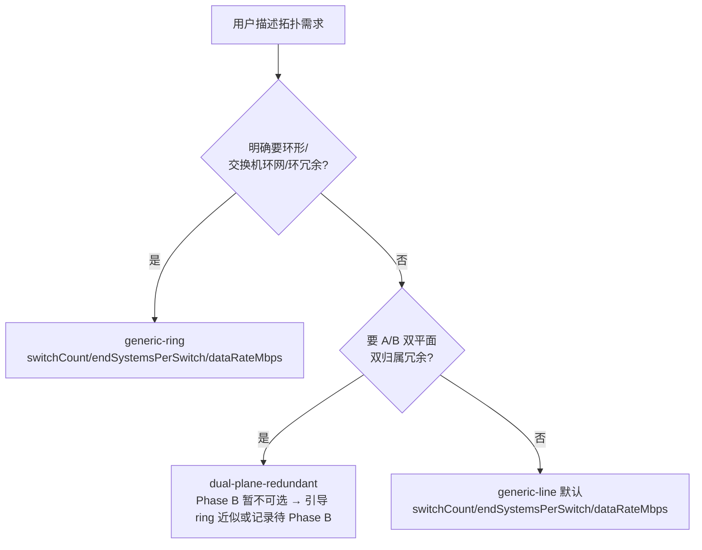

# refactor: topology 参数事实源收口 + skill 兼容清理

## 摘要

确立 Rust 确定性 compute（`src-tauri/src/topology_compute.rs` 的 `describe_templates`）为 topology 模板/参数的唯一文档化事实源，把 `.claude/skills/tsn-topology/` 收窄成「场景选择指引 + 指向 MCP 的指针」，删除与之重复或已失效的 legacy builder 脚本闭包和 `rules.md` 兼容遗留段。

## 问题背景

同一套 topology 参数知识（节点类型枚举、速率白名单、MAC/IP 派生、坐标布局、四份 JSON 契约）当前在三处各存一份：Rust `topology_compute.rs`（权威实现）、skill `docs/rules.md`（15.9KB 规则参考）、`tools/topology-builder.js`（20.5KB legacy 脚本，含自带的 `NODE_TYPES`/`SPEED_ENUM` 常量）。`rules.md` 顶部自述"供 `topology-builder.js`/`validate-topology.js`/`validate-mac-forwarding-table.js` 与 `SKILL.md` 参照"——其中三个 builder/validator 脚本在 Phase B 后已不在生产工作流（拓扑由 MCP 8 个工具驱动），它们承载的规则随之变死，且与 `topology_compute.rs` 的实现构成 drift 风险。同时 `SKILL.md` 缺少「何时选 line/ring/dual-plane」的场景决策指引——这正是 skill 该承担、却缺位的部分。

来自 2026-06-09 `/ce-ideate` 主线 A（grounding 已确认：会话 topology **数据**早已是 sidecar P0 三表唯一源，无多文件夹读取裂缝；真正待收口的是上述**参数知识**层）。

---

## 需求

**事实源收口**

R1. topology 模板/参数的唯一文档化事实源是 MCP `describe_templates`（`topology_compute.rs`）；skill 不再自带一份参数字段、默认值、上下限定义。

R2. `docs/rules.md` 收窄为"领域语义参考"——保留 Agent 理解用户意图所需的语义（节点类型中文映射、显示名 `SW-N`/`ES-N` 约定、默认互联意图、速率参考值），删除全部 builder 产物规则（MAC/IP 派生公式、canonical key 顺序、四份 JSON 字段契约、中间表示契约、校验清单）。

**skill 清理**

R3. 删除 legacy builder 脚本闭包（`topology-builder.js` / `run-topology-skill.js` / `validate-topology.js` / `validate-mac-forwarding-table.js`）及 `.DS_Store`。

R4. `SKILL.md` 删除"兼容脚本"段，在初始化路径补「场景→模板」决策树（line/ring 选择 + 自然语言→参数映射），并标注 `dual-plane-redundant` 为 Phase B 暂不可选。

R5. `SKILL.md` 约定 skill 不复述参数字段，字段定义以 `describe_templates` 返回为准。

**删除安全（下游同步）**

R6. 同步 `src-tauri/tauri.conf.json` bundle resources 与 `commands.rs` 的 `tauri_bundle_includes_all_stage_skill_resources` 测试，移除对四个已删脚本的引用；保留 `SKILL.md` / `package.json` / `docs/rules.md` / `tsn-flow-planning` 的打包与断言。

R7. 本轮不改 MCP 生成逻辑：`describe_templates`（含 `dual-plane-redundant` descriptor）与 `initialize` 的 line/ring 行为保持不变。

---

## 关键技术决策

KTD1. **dual-plane 口径 = 保留 `describe_templates` 返回 + 决策树标 Phase B。** 不改 MCP 的 describe/initialize：`describe_templates` 继续列出 `dual-plane-redundant`，`initialize` 继续在 Phase A 拒绝它，矛盾在 `SKILL.md` 决策树用文案消化（标注"暂不可选"）。理由：用户决定；最小改动，不雪藏已实现的 descriptor。

KTD2. **四脚本整体删除，无保留子集。** `topology-builder.js` 是核心，另外三个 `require('./topology-builder')`，构成自洽闭包；全仓除 `tauri.conf.json` 打包映射、`commands.rs` 对应断言、历史 docs 外无任何生产代码引用。删除判据沿用 audit P1#2（commit `4bd0290`）：死且与 MCP 实现重复制造 drift 才删，并清理因之变死的下游（此处是打包映射 + 断言）。

KTD3. **`rules.md` 走整体重写，而非逐段删补。** 文件约 60% 是 builder 产物规则（顶部即声明"供 builder/validator 参照"）；builder 删后这些变死且与 `topology_compute.rs` 重复。保留的领域语义（§1.1 节点类型、§10 显示名映射、§4.1 默认互联意图）需重新组织并在顶部加参数源声明，整体重写比打补丁干净。

KTD4. **不动会话 topology 数据路径。** ce-ideate grounding 确认数据已是 sidecar P0 三表（`topology_nodes`/`links`/`refs`）唯一源；本 plan 只收口"模板参数知识"这一层，不触碰数据读写、前端 `src/topology/`、或 MCP 工具表面。

---

## 高层技术设计

收口后的事实源职责边界——参数与生成归 MCP，场景与领域语义归 skill：

| 关注点 | 收口后归属 | 落点 |
|---|---|---|
| 模板参数 schema（字段/默认/上下限） | MCP（唯一源） | `topology_compute.rs` `describe_templates` |
| 拓扑生成（坐标/MAC/链路/canonical/校验） | MCP（唯一源，内部实现） | `topology_compute.rs` |
| 模板选择（line/ring/dual-plane 何时用） | skill | `SKILL.md` 决策树 |
| 自然语言→参数映射 | skill | `SKILL.md` 决策树 |
| 领域语义（节点类型中文名、显示名 `SW-N`/`ES-N`、默认互联意图） | skill | `docs/rules.md`（精简后） |
| 四份 JSON 契约 / MAC 派生公式 / 中间表示 / 校验清单 | 删除（builder 产物，已死） | — |

`SKILL.md` 初始化路径要补的「场景→模板」决策树形态：

---

## 实现单元

### U1. 删除 legacy builder 脚本闭包并同步打包配置与断言

- **Goal:** 移除四个 legacy builder/validator 脚本 + `.DS_Store`，同步 `tauri.conf.json` bundle resources 与 `commands.rs` 断言测试。
- **Requirements:** R3, R6
- **Dependencies:** 无
- **Files:**
  - 删 `.claude/skills/tsn-topology/tools/topology-builder.js`
  - 删 `.claude/skills/tsn-topology/tools/run-topology-skill.js`
  - 删 `.claude/skills/tsn-topology/tools/validate-topology.js`
  - 删 `.claude/skills/tsn-topology/tools/validate-mac-forwarding-table.js`
  - 删 `.claude/skills/tsn-topology/.DS_Store`
  - 修改 `src-tauri/tauri.conf.json`（移除四脚本的 bundle resource 映射）
  - 修改 `src-tauri/src/commands.rs`（test `tauri_bundle_includes_all_stage_skill_resources`）
  - `.gitignore`（追加 `.DS_Store`，防回归）
- **Approach:** 四脚本是自洽闭包，全删。`tauri.conf.json` 保留 `SKILL.md`/`package.json`/`docs/rules.md`/`tsn-flow-planning/SKILL.md` 的映射；`commands.rs` 测试相应保留这些断言、移除四脚本断言。原有 `render-mac-forwarding-html.js` 与 `tsn-topology-server.mjs` 的 NOT-contains 断言保留。
- **Patterns to follow:** audit P1#2（commit `4bd0290`）删兼容物 + 清理变死下游断言的范式。
- **Test scenarios:**
  - `tauri_bundle_includes_all_stage_skill_resources` 通过：断言 `tauri.conf.json` 含 `SKILL.md`/`package.json`/`docs/rules.md`/`tsn-flow-planning/SKILL.md`，不再断言四脚本。
  - 防回归：新增断言 `tauri.conf.json` NOT contains `topology-builder.js`（确认打包面收窄）。
  - 全量 `cargo test` 绿，确认无其它引用断裂。
- **Verification:** `npm run build:worker` 与 app 启动不报缺脚本；`cargo test` 绿；`rg` 确认 `src/`、`src-node/`、`src-tauri/` 生产代码无四脚本引用（仅历史 docs 残留，不动）。

### U2. 重写 rules.md 为精简领域语义参考，参数指向 describe_templates

- **Goal:** 把 `rules.md` 从"builder 产物规则全集"收窄为"Agent 场景理解所需的领域语义"，顶部声明参数 schema 以 MCP `describe_templates` 为准。
- **Requirements:** R1, R2
- **Dependencies:** U1（脚本删后 `rules.md` 顶部"供 builder 参照"的定位失效，重写时一并改）
- **Files:** 修改 `.claude/skills/tsn-topology/docs/rules.md`
- **Approach:**
  - 保留并重组（领域语义/场景指引）：节点类型枚举 + 中文映射 + 缩写前缀（原 §1.1）；显示名 `SW-N`/`ES-N` 映射约定 + "网卡=端系统"语义（原 §10）；默认互联**意图**（"N 交换机 M 端系统"默认交换机线型互联，原 §4.1）；速率白名单作为参考值（原 §4）。
  - 删除（builder 产物规则，已死 + 与 `topology_compute.rs` 重复）：ID 体系细节、MAC/IP 派生公式、`topology.json`/`topo_feature.json`/`data-server.json`/`mac-forwarding-table.json` 四份契约、坐标布局公式、中间表示契约、校验清单、所有 canonical key 顺序。
  - 顶部新声明：模板参数 schema、默认值、上下限以 `mcp__tsn_topology__topology_describe_templates` 返回为准；拓扑生成（坐标/MAC/链路/校验）由 `topology_compute.rs` 确定性实现，skill 不重复定义。
- **Patterns to follow:** 单一事实源原则（见 origin: `docs/plans/2026-06-03-001-refactor-topology-mcp-single-db-domain-plan.md`）。
- **Test scenarios:** Test expectation: none — skill 文档内容变更，无运行时行为。人工核对：保留/删除清单逐项落实，顶部参数源声明就位。
- **Verification:** `rg` 确认 `rules.md` 不再含 MAC 派生公式、canonical key、四份 JSON 契约、中间表示、校验清单；保留节点类型与显示名语义；顶部含参数源声明。

### U3. SKILL.md 补场景→模板决策树 + 删兼容脚本段 + 约定不复述参数

- **Goal:** 在 `SKILL.md` 初始化路径补「场景→模板」决策树（含 dual-plane Phase B 标注），删除已死的"兼容脚本"段，明确 skill 不复述参数。
- **Requirements:** R4, R5, R7
- **Dependencies:** U1（兼容脚本段引用的脚本已删）
- **Files:** 修改 `.claude/skills/tsn-topology/SKILL.md`
- **Approach:**
  - 删"兼容脚本"段（含 `run-topology-skill.js` 与四份 JSON 列表）。
  - 在初始化路径补决策树（形态见 高层技术设计）：
    - `generic-line`（默认）：用户描述"N 台交换机线型/串联，每台接 M 端系统"或未指定形态 → `switchCount=N`, `endSystemsPerSwitch=M`, `dataRateMbps=速率`。
    - `generic-ring`：用户明确要环形/交换机环网/环形冗余 → 同参数。
    - `dual-plane-redundant`：Phase B 暂不可选——`describe_templates` 会列出它但 `initialize` 当前拒绝；用户要 A/B 双平面双归属冗余时，说明暂未开放，引导用 `generic-ring` 近似或记录需求待 Phase B。
    - 自然语言→参数映射示例：「4 个交换机每个接 5 个端系统」→ `generic-line`, `switchCount=4`, `endSystemsPerSwitch=5`；「航天双环冗余」→ `generic-ring`。
  - 约定：参数字段名/默认值/上下限以 `describe_templates` 返回为准，skill 不复述字段定义。
- **Patterns to follow:** `SKILL.md` 已是 shim 自我定位（删 `responseMode` 字段的范本，现 line 15）。
- **Test scenarios:** Test expectation: none — skill 指令内容变更，无运行时行为。人工核对：决策树覆盖 line/ring/dual-plane(Phase B) + 映射示例齐全 + 无脚本段残留 + "参数以 describe_templates 为准"约定就位。
- **Verification:** `SKILL.md` 含三模板决策树（dual-plane 标 Phase B）；无"兼容脚本"段、无 `run-topology-skill.js` 引用；含不复述参数约定。

---

## 范围边界

**不动（本轮明确不碰）：**

- MCP `topology_compute.rs` 的 `describe_templates` / `initialize` 生成逻辑（KTD1/KTD4）。
- 会话 topology 数据路径——已是 sidecar P0 三表唯一源。
- 前端 `src/topology/`、topology MCP server 工具表面。
- 历史 docs（`docs/brainstorms/`、`docs/plans/`）对四脚本的引用——属历史记录。

**Deferred to Follow-Up Work：**

- dual-plane Phase B 实现（让 `initialize` 支持 `dual-plane-redundant`）——本轮只在决策树标注，不实现。
- import 第二写路径走 ops 白名单（`session_import.rs` 直 INSERT topology 子表，audit R19 deferred）。

---

## 风险与依赖

- **rules.md 误删 Agent 仍需的领域语义**（中）：若重写时删掉显示名 `SW-N`/`ES-N` 映射，Agent 在"已有拓扑编辑"路径定位节点会错。缓解：U2 明确保留该约定；`SKILL.md:34` 已有一份显示名映射作双保险。
- **.DS_Store 回归**（低）：macOS 可能重新生成。缓解：U1 追加 `.gitignore`。
- **依赖顺序**：U2/U3 依赖 U1（脚本删除）以保持文档与文件一致；三者可同一 PR 落地。

---

## 来源 / 研究

- `src-tauri/src/topology_compute.rs:92-196` — `describe_templates` 三模板 descriptor 与参数（`generic_distributed_params`: `switchCount` 1-12 / `endSystemsPerSwitch` 1-24 / `dataRateMbps`）。
- `src-tauri/src/commands.rs:712-735` — `tauri_bundle_includes_all_stage_skill_resources` 断言测试。
- `src-tauri/tauri.conf.json:39-42` — 四脚本 bundle resource 映射。
- `.claude/skills/tsn-topology/docs/rules.md:3` — 顶部"供 builder/validator 参照"定位。
- `.claude/skills/tsn-topology/SKILL.md:42-51` — 待删的"兼容脚本"段。
- audit P1#2 commit `4bd0290` — 删兼容物 + 清理变死下游断言的判据范本。
- origin: `docs/plans/2026-06-03-001-refactor-topology-mcp-single-db-domain-plan.md` — 单一事实源决策来源。
