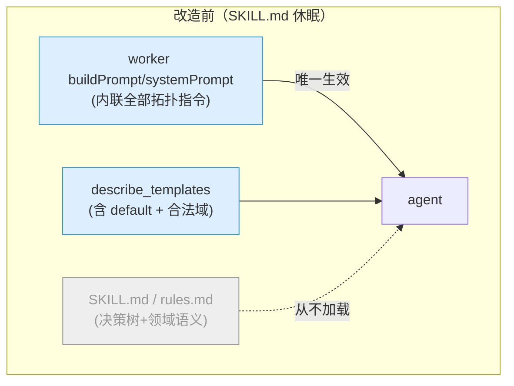

# refactor: 让 SKILL.md 成为可编辑的 agent 指引事实源

## Summary

让 worker 每次运行都把 `.claude/skills/tsn-topology/SKILL.md` 正文注入 agent 的 system prompt（编辑即生效），删除 `buildPrompt`/`buildSystemPromptForStage` 中与之重复的领域指引，把拓扑指引按三层职责收口：worker 骨架守安全、SKILL.md 守可调指引+参数默认、`describe_templates` 守参数合法域；并据此把 Skill 面板收口为单一指引编辑器 + 只读合法域展示。

---

## Problem Frame

ce-debug 已确诊（High）：app 的 Skill 面板把 `SKILL.md` 呈现为"可编辑、会保存生效"，但实测编辑它（清空 / 加探针 `[SKILL-PROBE-v1]`）对 agent 行为**零影响**。

根因在 SDK 语义：`skills: ["tsn-topology"]`（`src-node/claude-agent-worker.mjs:103`）是渐进式披露 —— SKILL.md 的 body 只在 agent 主动调用 `Skill` 工具时才进上下文。而 worker 把全部拓扑操作指令内联进了 system prompt（`buildSystemPromptForStage:317-319`）和 user prompt（`buildPrompt:321-384`），agent 靠内联指令 + `tsn_topology` MCP 工具即可闭环，从无动机调用 skill → 永不读 SKILL.md。研究确认（SDK v0.3.145 类型定义 + 官方 modifying-system-prompts）：SDK **没有**让 skill body 常驻的开关，稳定注入只能走 `systemPrompt`。

后果：拓扑指引散在三处（SKILL.md 决策树 / `docs/rules.md` 语义 / worker `buildPrompt`），真正生效的是 worker `buildPrompt`，且默认互联规则在三处重复。PR #20（`docs/plans/2026-06-09-001`）收口了 `rules.md` ↔ `topology_compute.rs`，但漏了 worker `buildPrompt` 这真正生效的第三处。按 boss 定位，Skill 面板是面向终端用户的调参功能，"编辑生效"的承诺当前是失真的。

---

## Requirements

**指引生效机制**

- R1. 在 app 编辑并保存 `SKILL.md` 后，下一次 agent 运行的行为反映该编辑（编辑即生效、可观测）。**验收口径**：dev 形态可验收；release 形态 SKILL.md 是只读 Resource、编辑即生效不成立（已知限制，见 Scope Boundaries / Risks）。(origin R1)
- R2. worker 把 `SKILL.md` 正文注入 agent 的 system prompt；删除 `buildPrompt`/`buildSystemPromptForStage` 中与 SKILL.md 重复的领域指引段。(origin R2)

**三层职责与不可改边界**

- R3. worker 骨架保留一组用户不可覆盖的系统约束：必须经 MCP 工具落地拓扑、固定阶段顺序、不自编拓扑 JSON、不写 stage-result。即便 SKILL.md 被清空或写入相反指令，骨架约束仍生效 —— 其中"不自编 JSON 落地 / 不写 stage-result"由工具白名单 + trusted-signal 提取器在代码层强制（非仅靠 prompt 文字）。(origin R3)
- R4. `describe_templates` 为参数合法域（类型/上下限/枚举）唯一源，不可被 skill 覆盖；合法域在 `topology_compute.rs` 内单一定义，`describe_templates` 与 `initialize` 校验共用。(origin R4)
- R5. 参数默认/推荐值归 `SKILL.md`、用户可调；`describe_templates` 不再返回 `default` 字段；`initialize` 不再保留兜底默认。(origin R5)
- R6. `docs/rules.md` 的领域语义并入 `SKILL.md` 可编辑指引面后，删除该文件，不再作为独立休眠文档。(origin R6)

**面板**

- R7. Skill 面板编辑面收口为单一指引编辑器（`SKILL.md` 为唯一可编辑事实源）。(origin R7)
- R8. 面板视觉区分"可编辑指引"与"只读参数合法域（来自 MCP 合法域）"。(origin R8)
- R9. 精简面板元数据展示（保留有用项，去冗余）。(origin R9)

---

## Key Technical Decisions

- KTD1. **注入形态 = 自定义字符串 `systemPrompt` 拼接（非 preset、非数组）。** worker 保持现有自定义字符串 `systemPrompt` 形态，在 `buildSystemPromptForStage` 内把骨架常量与读盘的 `SKILL.md` 正文用一个固定 sentinel 分隔拼成单个字符串（形如 `${骨架}\n\n<<<SKILL_GUIDANCE>>>\n${读盘正文}`）；每次 worker 启动（= 每次 agent 运行）读盘一次 → 编辑下次运行生效。理由：SDK `skills` 是上下文过滤器、无 force-load；顶层无 `appendSystemPrompt`，唯一稳定注入点是 `systemPrompt`。**不选 `string[]` 形态** —— 它会让 `summarizeSdkOptionsForAudit`→`redactSecrets`（只接受字符串，`:593`/`:1320`）在每次运行抛 TypeError，并使 worker 测试的 `toContain` 子串断言失效（数组语义变元素全等）；字符串拼接保留这两处现状、改动最小，与 boss 在 brainstorm 确认的"保持自定义字符串形态"一致。sentinel 分隔让单测仍能切出骨架段/注入段分别断言。**不选** `claude_code` preset+append —— 不引入 preset 的额外编码指令。system prompt 遵从度高于 user prompt（见 Sources）。

- KTD2. **三层职责边界。** worker 骨架（systemPrompt 的安全约束 + buildPrompt 的不可改部分）守安全/正确性，不随 SKILL.md 变化；SKILL.md 守可调指引 + 参数默认（注入生效）；`describe_templates` 守参数合法域。删除 worker 中与 SKILL.md 重复的**领域**指引（默认互联规则 `buildPrompt:382`、显示名映射 `buildPrompt:358`、`buildPrompt:345` 的"skill 仅作 MCP 使用指引"措辞），**保留**骨架安全约束（R3 四条）。判据：领域知识 → 移交 SKILL.md；安全/正确性约束 → 留 worker。**两点细化**：(a) R3 的"不自编 JSON 落地 / 不写 stage-result"在代码层已被工具白名单（agent 无 Write 工具）+ trusted-signal 提取器（`extractTopologyWorkflowStageResults`/`extractTrustedTopologyMutation` 只认 MCP 工具结果的 `mutationId`）强制，prompt 骨架文字是辅助而非唯一防线；"必须走 MCP / 阶段顺序"仅 prompt 强制，写坏 SKILL.md 的后果是 agent 空转（不产出拓扑）而非产出非法拓扑。(b) "已有拓扑用 `inspect`+`apply_operations`、`initialize` 仅用于从 0 生成/换模板"是**正确性**约束（误用 initialize 会重排已确认拓扑 = 不可逆数据损失），按本判据留在 worker 骨架的一行不变式；SKILL.md 只承载该流程的可调细节（如何定位节点、构造原子 ops）。

- KTD3. **默认值归属反转 + initialize 缺参报错。** `describe_templates_catalog` 移除 `default` 字段，只留 `type`/`minimum`/`maximum`/枚举（合法域）；推荐默认值写入 SKILL.md（agent 读后显式传 `initialize`）。`initialize` 的 `normalize_*` 移除兜底默认 —— 缺参时返回 `INVALID_TEMPLATE_PARAM` + `requires_clarification`，不再静默填 `4`/`2`/`1000`。合法域 `minimum`/`maximum` 在 `topology_compute.rs` 内提取为单一常量，catalog 与 `initialize` 校验共用，消除当前 catalog（`:200-203`）↔ initialize（`:280-293`）的双硬编码。这反转了 PR #20 在 rules.md 写的"默认值以 describe_templates 为准"（该措辞随 rules.md 删除而消解）。

- KTD4. **rules.md 并入并删除。** `docs/rules.md` 的领域语义（节点类型/显示名映射/默认互联场景/链路速率参考）并入 SKILL.md 可编辑指引面；删除 `docs/rules.md`，同步移除 `tauri.conf.json` 的 rules.md bundle 映射。理由：R6 + 单路径，消除休眠文档与第三处重复。

- KTD5. **面板只读合法域数据源 = 新增 tauri command。** `describe_templates_catalog()` 是纯 Rust 函数，新增一个 tauri command 直接暴露其合法域给前端，无需经 sidecar / token。前端面板只读区据此渲染。理由：合法域单一 Rust 源，前端零重复声明，避免前端硬编码 min/max。数据本质仍是 `describe_templates` 的 catalog（满足 origin R8"来自 MCP"语义——同一事实源）；选 tauri command 而非前端直连 sidecar，因前端已有 `invoke` 通路、而 sidecar 需 token 前端不持有。

- KTD6. **面板信息架构（像素级 deferred）。** 编辑面收口为单一 `SKILL.md` 指引编辑器，旁置只读"参数合法域"区（消费 KTD5 command），精简元数据 detail-grid。本计划只定信息架构，像素级视觉布局 deferred。

---

## High-Level Technical Design

三层职责与注入数据流（改造前 → 改造后）：



```mermaid
flowchart TB
  subgraph after["改造后（三层各守一摊）"]
    skel["worker 骨架\n安全/正确性约束(R3)"]:::skel
    skill["SKILL.md\n可调指引 + 参数默认"]:::skill
    mcp["describe_templates\n参数合法域(min/max/enum)"]:::mcp
    skel -->|system prompt 骨架段| sp["system prompt"]
    skill -->|每次运行读盘拼接(KTD1)| sp
    sp --> agent["agent"]
    agent -->|显式传参| init["initialize"]
    mcp -->|合法域校验| init
    mcp -->|tauri command(KTD5)| panel["Skill 面板只读区"]
    skill -->|编辑器| panel
  end
  classDef skel fill:#fde,stroke:#c69;
  classDef skill fill:#dfd,stroke:#6c6;
  classDef mcp fill:#def,stroke:#39c;
```

注：图为方向性结构示意，非实现规格。骨架与 SKILL.md 同处 system prompt，但骨架段为代码常量、SKILL.md 段为读盘内容 —— 用户编辑只改后者。

---

## Implementation Units

### U1. worker 注入 SKILL.md 并删除重复领域指引

- **Goal**：让 SKILL.md 正文每次运行注入 system prompt（编辑即生效），移除 worker 内联的重复领域指引，保留骨架安全约束。
- **Requirements**：R1, R2, R3
- **Dependencies**：无（与 U2 并行；建议与 U2 同批落地，以便用真实重构后的指引观测注入效果）
- **Files**：`src-node/claude-agent-worker.mjs`、`src-node/claude-agent-worker.test.mjs`
- **Approach**：
  - 在 `buildSystemPromptForStage`（`:317-319`）内把骨架常量与读盘 `SKILL.md` 正文（`<cwd>/.claude/skills/tsn-topology/SKILL.md`）用固定 sentinel 拼成单个字符串（KTD1）；读盘失败时降级为仅骨架段并记一条诊断日志（不崩）。systemPrompt 仍是字符串，`summarizeSdkOptionsForAudit`/`redactSecrets`（`:593`/`:1320`）无需改动。
  - 从 `buildPrompt`（`:339-383`）删除与 SKILL.md 重复的**领域**指引：默认互联公式（`:382`）、显示名映射规则（`:358`）、`:345` 的"skill 仅作 MCP 使用指引"措辞。**保留**骨架安全约束（必走 MCP、阶段序、不自编 JSON、不写 stage-result）、结构化结果回传机制，以及"已有拓扑用 inspect+apply_operations、initialize 仅用于从 0 生成/换模板"这一行正确性不变式（KTD2(b)）。
  - **保留** `buildAllowedToolsForStage`（`:309-315`）现有显式 `"Skill"`：它虽为弃用写法但无害，移除会触发 `scripts/verify-skills.mjs` 的 `workerAllowsSkill` 校验失败（需改其正则），与本计划目标无关，不在本范围清理。
- **Patterns to follow**：现有 `systemPrompt` 字符串拼接形态；现有诊断日志写法（per-session jsonl）。
- **Test scenarios**：
  - Covers AE1. system prompt 字符串在 sentinel 之后包含 SKILL.md 中一条可观测标记（测试用临时 SKILL.md 或 stub 读盘）→ 断言注入发生且位于注入段。
  - Covers AE3（prompt 层）。即使注入的 SKILL.md 正文为空 / 含"不用 MCP 直接输出 JSON"，sentinel 之前的骨架段仍含安全约束（必走 MCP / 不写 stage-result）。
  - Covers AE3（机制层，强）。构造"agent 在 assistantText 里输出整份拓扑 JSON、不调任何 MCP 工具"的 mock SDK 消息流 → 断言 `extractTopologyWorkflowStageResults` 返回空、最终无 `WorkflowStageResult` 落地（R3 不可逆落地的真实保证）。
  - 重写 `claude-agent-worker.test.mjs:603-634`："builds a TSN-specific prompt" 当前硬断言 buildPrompt 含默认互联/显示名映射等字符串 —— 改为断言这些**已移出** buildPrompt，且骨架约束仍在 system prompt。
  - 确认 `claude-agent-worker.test.mjs:88-91` 的 systemPrompt `toContain` 子串断言仍通过（字符串形态、骨架文本保留）。
  - 读盘失败（SKILL.md 不存在）→ 不抛异常，system prompt 退化为仅骨架。
- **Verification**：worker 单测全绿；真机改 SKILL.md 后新会话 agent 行为可见变化。

### U2. SKILL.md 重构为可调指引事实源

- **Goal**：把 SKILL.md 变成承载领域语义 + 参数默认 + 场景决策树的单一可编辑指引，并入 rules.md 内容。
- **Requirements**：R5, R6
- **Dependencies**：无
- **Files**：`.claude/skills/tsn-topology/SKILL.md`
- **Approach**：
  - 并入 `docs/rules.md` 领域语义：节点类型与显示名映射、默认互联**场景映射**（线型/环形→对应模板）、链路速率参考。**只承载"场景→模板"映射，不复述链路数生成公式**（`N*M+(N-1)` 等生成规则属 `topology_compute.rs`，沿用 rules.md 现有"本文件不定义生成细节"的声明 —— 避免把 `buildPrompt:382` 的误导从 worker 挪进 SKILL.md）。
  - 写入推荐参数默认（如 `switchCount` 缺省 4、`endSystemsPerSwitch` 缺省 2、`dataRateMbps` 缺省 1000），明确标注"agent 须显式传给 initialize"。
  - 保留场景→模板决策树（generic-line/generic-ring；dual-plane 标 Phase B 暂不可选）与"已有拓扑编辑"的可调流程细节（如何用 inspect 定位、构造原子 ops）；其中"不用 initialize 重建"的正确性不变式由 worker 骨架兜底（KTD2(b)）。
  - 顶部声明"参数合法域（类型/上下限/枚举）以 `describe_templates` 为准，本文件不复述合法域"，与 KTD3 一致。
  - 同步改写当前 SKILL.md 中与本计划矛盾/悬空的句子：`:24`/`:31`（现写"默认值…以该返回为准""缺省按 describe_templates 默认"）改为默认值归 SKILL.md（KTD3 反转）、仅合法域以 describe_templates 为准；`:37`"…见 `docs/rules.md`"指针随内容并入后删除；`:48` 的"不用 initialize 重建"完整规则**裁剪为流程细节**，把该正确性不变式的权威表述留给 worker 骨架（KTD2(b)），避免同一规则在 SKILL.md 与骨架双写、且 SKILL.md 这份可被用户改坏。
- **Patterns to follow**：当前 SKILL.md 决策树结构；rules.md 既有领域语义文字。
- **Test scenarios**：Test expectation: none —— 纯指引内容，无现有测试断言 SKILL.md 正文；正确性由 U1 的注入测试 + 真机验收覆盖。
- **Verification**：`npm run build:worker`（含 `verify:skills`）通过 frontmatter `name` 与禁词校验。

### U3. 删除 docs/rules.md 并同步 bundle 配置

- **Goal**：移除已并入的 rules.md，保持构建/打包一致。
- **Requirements**：R6
- **Dependencies**：U2（内容并入后才能删）
- **Files**：`.claude/skills/tsn-topology/docs/rules.md`（删除）、`src-tauri/tauri.conf.json`、`src-tauri/src/commands.rs`、`scripts/verify-skills.mjs`
- **Approach**：
  - 删除 `docs/rules.md`。
  - 移除 `tauri.conf.json` `bundle.resources` 中 rules.md 的 `../...rules.md` → `...rules.md` 映射（否则打包指向不存在文件而失败）。
  - 删除 `commands.rs` 的 `tauri_bundle_includes_all_stage_skill_resources` 测试中对 `../.claude/skills/tsn-topology/docs/rules.md` 的 `assert!(tauri_config.contains(...))` 断言（保留 SKILL.md / package.json / flow-planning 三条断言），否则 `cargo:test` red。
  - 复核 `verify-skills.mjs`：它遍历实际存在的 skill 文件并校验各自在 bundle 中有映射；删文件后无需改逻辑，但确认无对 rules.md 的硬编码引用残留。
- **Patterns to follow**：PR #20 删脚本时同步 tauri.conf.json + verify-skills 的既有做法（见 `docs/plans/2026-06-09-001`）。
- **Test scenarios**：
  - `verify-skills.mjs` 运行通过（无 rules.md 后不报缺映射、也不报多余映射）。
  - `cargo:test` 全绿：`tauri_bundle_includes_all_stage_skill_resources` 去掉 rules.md 断言后通过。
  - `npm run build`（tauri 资源解析）不因缺失资源失败。
- **Verification**：`npm run build:worker` + `npm run cargo:test` + 本地打包资源校验通过。

### U4. describe_templates 合法域收口 + initialize 缺参报错

- **Goal**：把参数合法域收为 Rust 单一常量源、catalog 移除 default、initialize 缺参报错。
- **Requirements**：R4, R5
- **Dependencies**：无（与 U1/U2 并行）
- **Files**：`src-tauri/src/topology_compute.rs`、`src-node/mcp/topology-tools.ts`
- **Approach**：
  - 提取 `switchCount`/`endSystemsPerSwitch` 的 `minimum`/`maximum`（及 `dataRateMbps` 枚举）为模块常量。
  - `describe_templates_catalog`（`:198-214`）的 generic params 移除 `default` 字段，改引用合法域常量；`initialize` 的 `normalize_*`（`:280-293`、`:348`）移除兜底默认参数、改用同一常量做边界校验，缺参/`null` → 返回 `INVALID_TEMPLATE_PARAM` + `requires_clarification`（沿用现有越界错误的 details 形态）。这消除当前 Rust 内 catalog↔normalize 的双硬编码。
  - **第三处合法域 = MCP 层 zod**（`topology-tools.ts` `initializeInputSchema` 的 `.min(1).max(12)`/`.max(24)`）。本计划**不删除** zod 的 MCP 层早失败校验（属已有功能，删除需授权 —— 见 Open Questions），而是显式声明"zod 上下限与 Rust 常量为有意双写"并加一条 drift 测试守二者一致；模板枚举（zod 放行 dual-plane / Rust 拒绝）同样确认有测试覆盖、本计划不加剧漂移。注意 zod 的 generic 参数为 `.optional()`，**缺参不会被 zod 早失败拦截**、会下到 Rust 才返回 `requires_clarification`（zod 早失败只覆盖越界）；本计划接受此现状（让 zod 对缺参变 required 属行为变更、需授权）。
  - 复核 `topology.initialize` inputSchema 是否声明 default；若有，去除以与 Rust 一致（`describe_templates` inputSchema 为 `{}` 不变）。
- **Patterns to follow**：现有 `normalize_integer_param` 越界错误（`INVALID_TEMPLATE_PARAM` + `minimum/maximum/actual` + `requires_clarification`）。
- **Test scenarios**：
  - Covers AE2. `switchCount` 超出 `[1,12]` → `initialize` 返回 `INVALID_TEMPLATE_PARAM`（既有 `switchCount:200` 越界测试改为校验来自共享常量）。
  - 缺参（不传 `switchCount`）→ 返回 `requires_clarification`，**不**静默用 4。
  - `describe_templates_catalog` 返回的 generic params **不含** `default` 字段、含 `minimum`/`maximum`/`type`（新增断言）。
  - 所有依赖兜底默认、调用 `initialize_topology` 不带显式参数的现有 Rust 测试（`initialize_generic_line_produces_chain_topology`、`initialize_generic_ring_closes_loop` 及同类）逐一改为显式传参，仍得 `N*M+(N-1)`/环形 `N*M+N`；排查避免缺参用例意外触发 `requires_clarification` 而 red。
  - `describe_templates_includes_all_three_templates` 仍通过（templateCount=3 不变）。
  - zod↔Rust 合法域 drift 测试：MCP 层 zod 的 `12`/`24` 与 Rust 合法域常量一致（防将来单边改动漂移）。
- **Verification**：`npm run cargo:test` 全绿。

### U5. 新增 tauri command 暴露参数合法域

- **Goal**：给前端一条只读拉取参数合法域的通路。
- **Requirements**：R4, R8
- **Dependencies**：U4（合法域形态稳定后再暴露）
- **Files**：`src-tauri/src/commands.rs`、`src-tauri/src/lib.rs`（注册 handler）、`src/skills/skill-file-service.ts`（或新增 service 方法）
- **Approach**：新增 command（命名遵循现有 `topology_*` / `*_skill_*` 约定）直接返回 `describe_templates_catalog()` 的合法域投影（或整个 catalog，前端取合法域字段）；前端 service 加 `invoke` 包装，非 Tauri 运行时 fail-closed。
- **Patterns to follow**：`skill_files.rs` 的 command + `commands.rs` 注册模式；`skill-file-service.ts` 的 Tauri/Web 双态包装（`:52-77`）。
- **Test scenarios**：
  - command 返回结构含三模板的合法域字段（Rust command 单测或复用 catalog 测试）。
  - 前端 service：Tauri 运行时调 `invoke` 并解析；非 Tauri 运行时返回 unavailable / 不崩（mock）。
- **Verification**：`cargo test` + 前端 service 单测通过。

### U6. Skill 面板信息架构简化

- **Goal**：编辑面收口为单一 SKILL.md 编辑器 + 只读合法域区 + 精简元数据。
- **Requirements**：R7, R8, R9
- **Dependencies**：U5（只读区数据源）
- **Files**：`src/ui/skills/SkillFilePreview.tsx`、`src/app/components/workspace-tools/index.tsx`、相邻 `SkillFilePreview.test.tsx` / `workspace-tools.test.tsx`
- **Approach**：
  - 编辑面以 `SKILL.md` 为唯一可编辑文件；多文件列表收口（tsn-topology 现仅剩 SKILL.md + package.json，rules.md 已删）。
  - 布局（IA 级，像素级仍 deferred）：可编辑指引编辑器在上、只读"参数合法域"区在下（纵向堆叠、线性阅读；R8）。
  - 只读态（打包/Resource，`editable===false`）：不展示"看起来能改却不保存"的禁用编辑器，改为只读预览 + 明确标注"出厂只读指引（发版应用不可编辑）"，落实 Risks 中的 release 只读义务。
  - 只读合法域区消费 U5 command，需有 loading 占位与失败态文案（与现有 `isLoadingContent`/`error` 模式一致）；非 Tauri 运行时该区隐藏或显示不可用。
  - 空 `SKILL.md`：编辑器正常显示空内容 + 一句静态提示"清空将使 agent 失去领域指引，下次运行生效"（不阻塞保存；"恢复默认"入口仍 deferred）。
  - 保存反馈：可编辑态保存成功给一次明确确认（当前实现仅静默退出编辑态），失败沿用 `error` 态。
  - 精简 `detail-grid`（R9）：保留 Skill ID / 状态 / 可写性；移除"阶段 / 输入 / 输出 / 最近运行 / 备注"五项。
- **Patterns to follow**：现有 `SkillFilePreview` 列表+预览/编辑结构、状态徽章；`master-detail-layout`。
- **Test scenarios**：
  - 默认选中并可编辑 SKILL.md；保存调 `write_skill_file`，成功给确认、失败保留 draft（扩展现有保存测试覆盖单文件面）。
  - 只读合法域区：command 成功渲染 min/max/枚举且不可编辑；loading 显示占位；command 失败显示错误文案；非 Tauri 运行时不可用。
  - 只读态（readonly）显示"出厂只读指引"只读预览，而非禁用编辑器。
  - 空 SKILL.md 显示空内容 + 静态提示，不报错、可保存。
  - detail-grid 仅剩 Skill ID / 状态 / 可写性三项。
- **Verification**：`npm test`（vitest）相关组件测试全绿。

---

## Scope Boundaries

### 本次范围内
- 全部 origin 范围：注入机制、三层收口、rules.md 并入并删除、面板信息架构简化。
- 注入只动 system prompt 一侧；user prompt 主体（会话上下文/结构化输入/交互规则中非重复部分）保留。

### Deferred to Follow-Up Work
- **打包构建的终端用户可编辑性**：dev 下 skill 目录可写、编辑即生效；打包应用里 skill 文件是只读 Resource（`skill_files.rs` 标 `writable:false`），终端用户改不了。让"终端用户调参"在发版应用成立需要"可写副本"机制（首次启动复制 skill 到可写目录、worker 与编辑器都指向该副本）—— 本计划按更小改动**标记为已知限制并 deferred**，不实现可写副本。面板在只读态下如实显示不可编辑（U6 已覆盖）。
- **SKILL.md 写坏/清空后的"恢复默认指引"入口**：三层模型下领域知识移交 SKILL.md，用户清空它会让 agent 失去领域指引（骨架仅保安全）。一个"恢复出厂指引"按钮可缓解，deferred。
- **tsn-flow-planning skill 注入**：worker 同时启用 `tsn-flow-planning`（同样休眠），但当前 worker 只服务拓扑阶段（非拓扑阶段由 adapter 本地拦截），其 SKILL.md 注入在当前路径不可达，不在本计划范围。
- **`buildAllowedToolsForStage` 弃用 `"Skill"` 清理**：移除会牵动 `verify-skills.mjs` 的 `workerAllowsSkill` 正则，与本计划目标无关，另案。

### Outside this product's identity（沿用 origin）
- dual-plane Phase B 实现（让 `initialize` 支持 dual-plane）。
- import 第二写路径走 ops 白名单（audit R19）。
- Skill 面板像素级视觉布局/设计。

---

## Risks & Dependencies

- **清空/写坏 SKILL.md 的失败分级。** 失"领域语义"（显示名映射、链路速率）→ 影响可读性、可恢复；失"工具编排正确性"（误用 initialize 重建已确认拓扑）→ 不可逆数据损失。后者已由 worker 骨架一行不变式兜底（KTD2(b)、U1），不依赖 deferred 的"恢复默认"入口。
- **prompt-only 骨架约束的边界。** "必须走 MCP / 阶段顺序"仅靠 prompt 强制，写坏 SKILL.md 会让 agent 空转（表现为不产出拓扑，非产出非法拓扑）；落地正确性由工具白名单 + trusted-signal 提取器保证、不受 SKILL.md 影响（R3、KTD2(a)）。
- **release 只读使 R1 核心承诺仅 dev 成立（重要）。** 发版应用 SKILL.md 是只读 Resource、`write_skill_file` 拒绝保存，且 worker 读到的是出厂副本 —— "终端用户调参"在 release 形态零成立。本计划按更小改动接受该限制、不实现可写副本（见 Scope Boundaries）；U6 须在只读态明确告知"出厂只读指引"而非给一个改了不保存的编辑器。要让 release 也成立需把可写副本机制升级入范围（boss 决策点）。
- **worker 测试硬断言重写（`:603-634`）。** 移出 buildPrompt 内联领域指引必然打破其字符串断言；U1 须同步改为"已移出 + 骨架保留"的断言。注意 systemPrompt 保持字符串形态，故 `:88-91` 的 `toContain` 子串断言不受影响（仍命中保留的骨架文本）。
- **MCP 层 zod 第三源 drift + 缺参不在 zod 早失败覆盖内。** 合法域历史上在 Rust catalog / Rust normalize / MCP zod 三处声明；U4 收口 Rust 双写并加 zod↔Rust drift 测试，但 zod 仍独立持有上下限（保留 MCP 早失败功能），改上限须同改两处。且 zod 的 generic 参数为 `.optional()`，**缺参不会在 zod 早失败**、会一路下到 Rust 才报 `requires_clarification`（zod 早失败只覆盖越界、不覆盖缺参）。
- **SDK 版本依赖。** `systemPrompt` 字符串形态语义依赖 `@anthropic-ai/claude-agent-sdk@0.3.145`；升级 SDK 时需复核注入位置仍有效。
- **PR #20 措辞反转。** rules.md 中"默认值以 describe_templates 为准"随 rules.md 删除消解，无需单独回改其它文档。

---

## Open Questions

- **MCP 层 zod 是否应彻底交出上下限校验给 Rust（zod 仅留 `type`/`optional`），让合法域真正单源？** 这会移除 MCP 层"不打 HTTP 即早失败"的现有功能（删功能需授权）。本计划默认**保留** zod 校验 + drift 测试守一致（U4）；若需单源，再升级 U4 范围。

---

## Sources / Research

- SDK 注入机制（决定性，本会话研究）：`@anthropic-ai/claude-agent-sdk@0.3.145` 类型定义 `node_modules/@anthropic-ai/claude-agent-sdk/sdk.d.ts`（`skills` 语义 `:1742-1764` 为上下文过滤器、仅 frontmatter 进 system prompt；`systemPrompt` 四态 `:1789-1850`（`string` / `string[]` / preset / preset+append 均可用，KTD1 选 `string` 拼接以避开 `string[]` 对 `redactSecrets` 的崩溃），顶层无 `appendSystemPrompt`；`settingSources` 不加载 SKILL.md body）。`redactSecrets:1320` 只接受字符串、`summarizeSdkOptionsForAudit:593` 在每次运行调用它。官方文档 [modifying-system-prompts](https://code.claude.com/docs/en/agent-sdk/modifying-system-prompts)（system prompt 遵从度高于 user message、append 可缓存）、[Agent Skills overview](https://platform.claude.com/docs/en/agents-and-tools/agent-skills/overview)（渐进式披露三级）。
- worker 现状：`src-node/claude-agent-worker.mjs`（`buildSystemPromptForStage:317-319`、`buildPrompt:321-384`、`:382` 默认互联、`:358` 显示名、`:345` skill 措辞、`skills:103`、`settingSources:96`、`buildAllowedToolsForStage:309-315` 含弃用 `"Skill"`；R3 代码层防线 `extractTopologyWorkflowStageResults:915`、`extractTrustedTopologyMutation:1025`）。
- 参数源：`src-tauri/src/topology_compute.rs`（`describe_templates_catalog:92-214`，generic params default/min/max `:198-214`；`initialize` `normalize_*` `:280-293`、`:348`）。
- 编辑器/面板：`src-tauri/src/skill_files.rs`（dev root 可写 `:172-209`、`write_skill_file:123-157`）、`src/ui/skills/SkillFilePreview.tsx`、`src/app/components/workspace-tools/index.tsx`（`SkillToolPanel:413-478`）、`src/skills/skill-file-service.ts`。
- 回归网：`src-node/claude-agent-worker.test.mjs:603-634`（buildPrompt 字符串硬断言）、`topology_compute.rs` 链路数测试、`scripts/verify-skills.mjs` + `src-tauri/tauri.conf.json` bundle 映射。
- 前置：PR #20 / `docs/plans/2026-06-09-001-refactor-topology-skill-source-of-truth-plan.md`（本计划反转其默认值归属措辞）。
