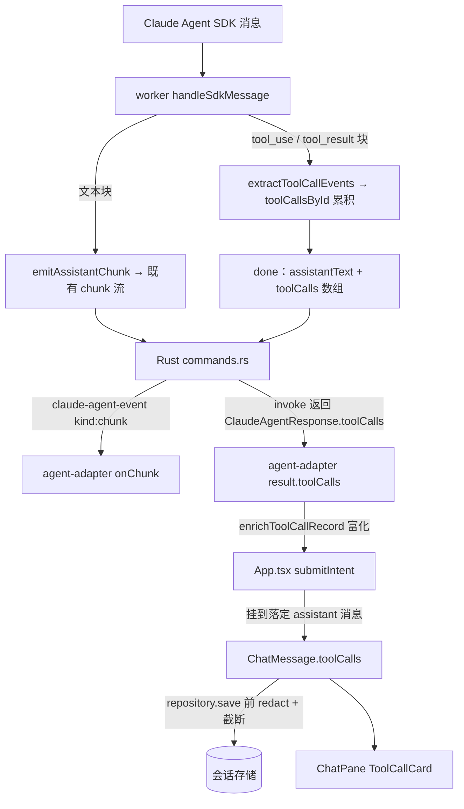

# feat: chat 工具调用内联可折叠卡片（入参/出参）

## Summary

把 chat 里 agent 的工具调用从拍平文本行换成对话流内联的可折叠卡片：折叠态一行（状态 + 友好名 + 一句摘要），展开看**完整入参 + 完整出参**。toolCalls 随 worker 的 `done` 结果一次性返回、挂在 assistant 消息上、随会话持久化。历史纯文本会话原样渲染、不回溯。

> 简化说明：本计划已按"只想看每个工具的入参/出参 + 展示好看"收口，刻意不做分级详情（关键字段抽取 / 超大白名单 / 查看原始）、不做实时事件流、不做"运行中"态。详见 Scope Boundaries。

---

## Problem Frame

当前 worker 把每个工具调用拍平成 `[工具] name: args` / `[工具结果] name 已返回：summary` 文本行（`summarizeInput` 140 字符 / `summarizeToolResult` 180 字符在**源头截断**），经 `emitOperationTrace` 当作 `chunk` 发出、`prependOperationTrace` 拼进 `assistantText` 顶部，最终整段落进 `ChatMessage.content`，`ChatPane` 原样渲染成一面文本墙。结果：工具名带 `mcp__tsn_topology__` 冗余前缀、无结构、不可折叠，完整 args/result 在摘要后即丢弃，前端拿不到完整入参/出参。

---

## High-Level Technical Design

工具调用不新增事件通路：worker 累积结构化记录，随既有 `done` 出口一次性返回；自然语言仍走既有 `chunk` 流。两者最终落到同一条 assistant 消息（卡片成块渲染在正文之上）。

关键不变量：`toolCalls` 只流向 UI，**绝不回流** `buildConversationContext` / agent prompt —— 保持"完整大结果不入 agent 对话"硬规则。worker 保留 `operationTraceLines` 仅供内部 audit，但不再 `prependOperationTrace` 进 `assistantText`。

---

## Key Technical Decisions

- KTD1. **卡片挂在 `ChatMessage.toolCalls` 上（解决 OQ4），渲染为正文上方一组卡片。** 不另起独立事件流/关联存储。worker 固定"先调完工具再生成中文回复"（origin worker `executionInstructions`），卡片成块在自然语言之前展示符合真实时序。
- KTD2. **toolCalls 只随 `done` 结果返回，一次性渲染，不新增实时事件通路。** 状态只有 `success` / `error`（从完成的 tool_result 推导），不做"运行中"态。理由：用户核心诉求是"看到入参/出参"，实时逐张冒出价值有限却要新增 Tauri 事件 kind + 监听 + upsert 整套跨层机制。
- KTD3. **每张卡片显示完整入参 + 完整出参，不做分级详情。** 砍掉关键字段抽取 / 超大白名单 / "查看原始"。存储侧仅加一个统一截断上限（常量）兜底特大结果，超长则存截断版 + 截断提示（重开看到截断版）。
- KTD4. **领域富化逻辑在前端 TS，worker 只透传原始数据。** worker 累积 `{id, name(原始), status, args(完整), result(完整)}`；友好名去前缀、通用一句话摘要、截断兜底都在 `src/agent/tool-call-record.ts`。`.mjs` 改动最小、领域逻辑集中可单测。
- KTD5. **新会话彻底停止往 `message.content` 塞 `[工具]` 文本（解决 OQ3）。** worker 不再 `prependOperationTrace` 进 `assistantText`；`operationTraceLines` 仅保留给 audit。老会话照旧渲染历史文本，`sessionPreview` 与 `summarizeMessageForContext` 的 `[工具]` 过滤保留做向后兼容。
- KTD6. **展开/折叠为组件内瞬态、不持久化（解决 OQ2）。** 每次默认折叠；展开态用 `ToolCallCard` 内 `useState`。
- KTD7. **存储红 action 用 stringify→redactSecrets→parse 处理结构化值。** `redactSecrets` 只吃 string（既有约束），`toolCalls` 不能直接传入；按 worker 既有 `redactJsonValue` 同款模式处理，避开记忆中 `string[] 会崩 redactSecrets` 的坑。展示红 action 复用既有 `redactProviderNamesInValue`（已支持递归结构化值）。

---

## Requirements

来自 origin（`docs/brainstorms/2026-06-09-tool-call-display-requirements.md`），按本计划收口后的关注点分组。R6/R8 的"分级详情 / 超大精细控制"已按用户再确认降级，见 Scope Boundaries。

**展示**
- R1. 工具调用在 chat 对话流内联渲染为可折叠卡片，默认折叠。
- R2. 折叠态一行：状态（成功 / 失败）+ 友好工具名（去冗余前缀）+ 一句摘要。
- R3. 展开看详情：完整入参 + 完整出参。
- R4. 多张卡片折叠时构成清晰可扫的步骤概览。
- R5. 所有工具展开均显示完整 args + 完整 result（特大结果按统一上限截断，附截断提示）。

**持久化与兼容**
- R7. 卡片 + 完整 args + result 持久化进会话（特大截断），重开 / 历史会话可见。
- R9. 历史纯文本会话保持原样渲染，不回溯解析。

**范围**
- R10. 覆盖所有工具类型（MCP / Bash / Skill / Read），统一去冗余前缀。
- R11. 新结构化卡片取代新会话的 `[工具]` 内联文本；assistant 自然语言内容保留。

---

## Implementation Units

### U1. `ToolCallRecord` 类型与领域助手

**Goal**：定义原始记录与富化记录的类型契约，以及友好名 / 通用摘要 / 截断兜底的纯函数。整条通路的基础。

**Requirements**：R2, R5, R10。

**Dependencies**：无。

**Files**：
- `src/agent/tool-call-record.ts`（新建）
- `src/agent/tool-call-record.test.ts`（新建）

**Approach**：
- `RawToolCall`（worker 累积、随 done 返回的形状）：`{ id, name, status: "success"|"error", args?, result? }`。
- `ToolCallRecord`（富化后，挂 `ChatMessage`）：在 raw 之上加 `friendlyName`、`summary`；`result` 可能被截断（见下）。
- `toFriendlyToolName(name)`：匹配 `mcp__<server>__<tool>` → 取 `<tool>` 段、首个 `_` 换 `.`（`topology_initialize`→`topology.initialize`，`topology_apply_operations`→`topology.apply_operations`）；非 MCP 工具（Bash/Read/Skill/Write/Edit）原样返回。
- `buildToolSummary(record)`：折叠态一句话，**通用**实现（不按工具家族建注册表）：从 args/result 探测最显著的字符串字段或给计数/长度提示；失败时给错误摘要前缀。
- `truncateResultForStorage(result, limit)`：序列化超 `limit`（常量，初定 16KB）时返回 `{ truncated: true, preview: 截断字符串 }`，否则原样。
- `enrichToolCall(raw)`：组合 friendlyName + summary，产出 `ToolCallRecord`（展示用，不截断；截断只在存储层 U5 调用）。

**Patterns to follow**：worker 既有 `summarizeToolResultContent` 的字段探测风格；`workflow-stage-result.ts` 的纯函数 + 同名 `.test.ts` 组织。

**Test scenarios**：
- `toFriendlyToolName`：`mcp__tsn_topology__topology_initialize`→`topology.initialize`；`mcp__tsn_topology__topology_apply_operations`→`topology.apply_operations`；`Bash`/`Read`/`Skill` 原样；空/未知名安全兜底。Covers R10。
- `buildToolSummary`：covers R2 —— topology / Bash / Read 各产出一行非空摘要；`status:"error"` 给失败摘要。
- `truncateResultForStorage`：小结果原样；超 limit 大结果（artifact 样例）返回 `truncated:true` + 截断 preview；`undefined` 结果原样。
- `enrichToolCall`：success 记录产出 friendlyName + summary + 完整 result；error 记录 status 正确。

### U2. worker 累积 toolCalls 并随 done 返回

**Goal**：worker 为每个 tool_use/tool_result 累积原始记录，随 `done`（及 `runClaude` 返回）携带 `toolCalls`；停止把 trace 文本拼进 `assistantText`。

**Requirements**：R3, R5, R10, R11。

**Dependencies**：U1（原始记录字段契约）。

**Files**：
- `src-node/claude-agent-worker.mjs`
- `src-node/claude-agent-worker.test.mjs`

**Approach**：
- 新增 `extractToolCallEvents(message, toolUseNamesById)`：与既有 `extractOperationTraceEvents` 并行遍历 `collectContentBlocks`：tool_use 块缓存 `{id, name, args: block.input}`；tool_result 块产出终态 `{id: tool_use_id, name, status: success/error(复用 isFailedToolResult), result: extractJsonFromToolResultBlock(block) ?? 原始 content}`。
- 在 `handleSdkMessage` 各分支调用，upsert 进 `toolCallsById` Map（tool_use 建条、tool_result 补 result/status）。
- `runClaude` 返回与 CLI `done` 出口增加 `toolCalls: [...toolCallsById.values()]`。
- **KTD5 落地**：`finalAssistantText` 不再 `prependOperationTrace`（line 295 直接用 `assistantText`）；错误恢复路径（line 245-248）同样去掉拼接；停止 `emitOperationTrace` 往 `onEvent` 发 `chunk`（trace 仅入 `operationTraceLines`/audit）。

**Patterns to follow**：既有 `extractOperationTraceEvents` 的 block 遍历、`toolUseNamesById` 名称回填、`isFailedToolResult` 判错、`extractJsonFromToolResultBlock` 解析。

**Execution note**：先为"done 携带 toolCalls + assistantText 不含 trace"写失败的 worker 测试再实现。

**Test scenarios**：
- 单工具 tool_use+tool_result → `done.toolCalls` 含一条，原始 name + 完整 args + 完整 result + `status:"success"`。Covers R3/R5。
- 失败 tool_result（`is_error`/exit code）→ `status:"error"`。
- 多工具一轮 → `done.toolCalls` 含全部、按 id 去重无重复。Covers R10。
- covers R11 —— `assistantText` 不含 `[工具]`/`[工具结果]` 前缀（断言不再 `prependOperationTrace`）。
- audit：`operationTraceLines` / audit `toolCalls` 仍记录（回归，不破坏既有 audit 测试）。

### U3. Rust 透传 `toolCalls`（done → response）

**Goal**：Rust 把 `done` 的 `toolCalls` 带进 `ClaudeAgentResponse` 返回给 invoke 调用方。无新增事件 kind。

**Requirements**：R7。

**Dependencies**：U2（done 字段契约）。

**Files**：
- `src-tauri/src/commands.rs`

**Approach**：
- `ClaudeWorkerEvent` 与 `ClaudeAgentResponse` 各增加 `#[serde(default)] tool_calls: Vec<serde_json::Value>`（`camelCase` 映射 `toolCalls`）。
- `handle_worker_line` 的 `"done"` 分支把 `parsed.tool_calls` 写进 `*response`。chunk/session/emit 路径不变。

**Patterns to follow**：既有 `ClaudeAgentResponse` 的 `stage_results` 字段（同款 `#[serde(default)] Vec<serde_json::Value>` 透传）。

**Test scenarios**：
- Test expectation：本单元为薄字段透传，与既有 `stage_results` 同构；以 U4/U6 前端集成测试覆盖契约，`cargo build` 通过即可 —— 原因：Rust 侧 `done` 解析无独立单测脚手架，既有测试集中在 topology/db 模块。

### U4. agent-adapter 读取 toolCalls

**Goal**：adapter 把 invoke 返回的 `toolCalls` 富化进 `TsnAgentResult`。

**Requirements**：R3, R5, R7, R10。

**Dependencies**：U1, U3。

**Files**：
- `src/agent/agent-adapter.ts`
- `src/agent/agent-adapter.test.ts`
- `src/agent/agent-types.ts`（`TsnAgentResult` 加 `toolCalls?: ToolCallRecord[]`）

**Approach**：
- `ClaudeAgentResponse` 接口加 `toolCalls?: unknown[]`。
- `runTsnAgent` 成功路径：`toolCalls: (claude.toolCalls ?? []).map(enrichToolCall)` 进返回值。
- 本地边界 / 失败路径 `toolCalls` 缺省空数组（这些路径不调 worker、无工具调用）。
- 诊断打点可加 `toolCallCount`。

**Patterns to follow**：既有 `runTsnAgent` 对 `claude.stageResults` 的消费与 `logAgent` 打点。

**Test scenarios**：
- invoke 返回 `toolCalls` → `result.toolCalls` 为富化数组（含 friendlyName/summary）。Covers R7/R10。
- 本地边界路径 / 失败路径 → `result.toolCalls` 为空数组、不抛错。
- 空/缺失 `claude.toolCalls` → 空数组兜底。

### U5. `ChatMessage` schema 扩展与存储红 action / 截断

**Goal**：`ChatMessage` 增加 `toolCalls?`；落盘时对 args/result 红 action、对特大 result 截断；读路径向后兼容老 payload。

**Requirements**：R5, R7, R9。

**Dependencies**：U1。

**Files**：
- `src/sessions/session-repository.ts`
- `src/sessions/session-repository.test.ts`

**Approach**：
- `ChatMessage` 加 `toolCalls?: ToolCallRecord[]`（可选，老消息为 `undefined`）。
- `redactSessionForStorage`：对每条 message 的 `toolCalls`：先对 `result` 调 `truncateResultForStorage`（KTD3 特大截断），再按 KTD7 用 `JSON.parse(redactSecrets(JSON.stringify(record)))` 整条红 action。
- `storedSessionToSession` / `normalizeSession`：老 payload 无 `toolCalls` → 保持 `undefined`，不报错（R9 向后兼容）。
- `BrowserSessionRepository` 与 `SqliteSessionRepository` 共用 `redactSessionForStorage`，无需各自改动。

**Patterns to follow**：worker `redactJsonValue`（stringify→redact→parse）；既有 `redactSessionForStorage` 对 `messages`/`agentEvents` 的 map 红 action；`normalizeSession` 兜底风格。

**Test scenarios**：
- 含 `toolCalls` 的 session 落盘再读回 → 普通记录完整保留 result；特大 result 落盘版被截断（`truncated:true`）。Covers R5/R7。
- args/result 内含密钥样例（`sk-ant-...` / `"token":"..."`）→ 落盘后被红 action 且不抛错（验证结构化红 action 路径，KTD7 防回归）。
- 老 payload（message 无 `toolCalls`）读回 → `toolCalls` 为 `undefined`，session 正常加载。Covers R9。
- `agentEvents` / `content` 既有红 action 行为不变（回归）。

### U6. submitIntent 把 toolCalls 挂到落定消息

**Goal**：App 在 run 结束时把 `result.toolCalls` 挂到 finalized assistant 消息，随会话保存。

**Requirements**：R1, R7, R11。

**Dependencies**：U4, U5。

**Files**：
- `src/app/App.tsx`
- 既有 App 集成测试位（若存在则扩展）

**Approach**：
- `submitIntent` 终态 `nextSession`：finalized message 在写 `content` 同时写 `toolCalls: result.toolCalls`（与 `result.assistantText` 一并落定），`repository.save`（U5 在保存层红 action/截断）。
- 无需 onChunk 改动、无需实时 upsert（KTD2 一次性渲染）。

**Patterns to follow**：既有 `submitIntent` 终态 `nextSession` 落定（`messages.map` 替换 assistantMessage）与 `stampAgentEvents` 风格。

**Test scenarios**：
- run 结束 → finalized 消息 `toolCalls` 来自 `result.toolCalls`，随 `nextSession` 持久化。Covers R1/R7。
- 失败 run / 本地边界 run（无 toolCalls）→ 消息正常落定、不挂卡片、不报错。

### U7. `ToolCallCard` 组件与 ChatPane 渲染（好看的重点）

**Goal**：新增可折叠工具卡片组件，`ChatPane` 在 assistant 正文上方成块渲染；默认折叠，展开看完整入参/出参。视觉打磨集中在此单元。

**Requirements**：R1, R2, R3, R4, R5, R9。

**Dependencies**：U1, U6。

**Files**：
- `src/app/components/chat-pane/tool-call-card.tsx`（新建）
- `src/app/components/chat-pane/tool-call-card.test.tsx`（新建）
- `src/app/components/chat-pane/index.tsx`
- 对应全局样式文件（沿用项目 CSS 约定）

**Approach**：
- `ToolCallCard({ record })`：折叠态一行 = 状态图标（成功/失败）+ `record.friendlyName` + `record.summary`；点击切换 `useState` 展开（KTD6 瞬态）。
- 展开态：分"入参 / 出参"两段，JSON 友好展示（缩进、等宽、可滚动）；`result.truncated` 时显示截断版 + "结果已截断"提示。
- 视觉（"好看"）：状态色、等宽 JSON 区、折叠/展开过渡、卡片间距与对话气泡协调；多卡片折叠时形成紧凑步骤列表。
- 展示红 action：对 args/result 用既有 `redactProviderNamesInValue` 处理后再渲染。
- `ChatPane` `messages.map`：assistant 消息若 `message.toolCalls?.length`，在 `
{content}
` 之前渲染 `toolCalls.map(r => <ToolCallCard>)`；老消息无 `toolCalls` → 只渲染既有 `
`（R9 原样）。
- 可访问性：折叠按钮 `aria-expanded`、卡片状态 `aria-label`。

**Patterns to follow**：`chat-pane/index.tsx` 既有 `Step`/`AgentWaitingIndicator` 子组件与 `redactProviderNamesForDisplay` 用法；项目无既有 disclosure 组件，用标准 `useState` + `aria-expanded`（不引依赖）；样式沿用 `chat-pane` 既有 className 风格（全局 CSS，非 CSS Modules）。

**Test scenarios**：
- 折叠态渲染状态 + 友好名 + 摘要一行；点击展开显示入参 + 出参两段。Covers R1/R2/R3/R5。
- 多卡片折叠 → 一组可扫步骤概览（断言 N 张折叠卡）。Covers R4。
- `result.truncated` → 展开显示截断提示。Covers R5。
- 失败记录 → 显示失败状态样式。Covers R2。
- assistant 消息无 `toolCalls`（老会话）→ 只渲染正文、无卡片、不报错。Covers R9。

### U8. 文本消费端向后兼容核对

**Goal**：确认两个读 `message.content` 的文本消费端在"新会话无 trace 文本 / 老会话有 trace 文本"两种情形都正确，且都不读 `toolCalls`。

**Requirements**：R9, R11。

**Dependencies**：U2（content 不再含 trace）。

**Files**：
- `src/app/components/workspace-tools/index.tsx`（`sessionPreview`）
- `src/agent/agent-adapter.ts`（`summarizeMessageForContext`）
- 对应既有测试（如有）

**Approach**：
- `sessionPreview`：新会话 content 是干净自然语言（不以 `[工具]` 开头）→ 直接返回；老会话仍可能 `[工具]` 开头 → 既有跳过逻辑保留。无需改逻辑，补/核对测试。
- `summarizeMessageForContext`：新 content 无 trace 行 → 过滤变 no-op；老 content 仍过滤 `[工具]`/`[Skill]`/`[文件]` 行。保留过滤做兼容。
- 二者均**不读 `toolCalls`** —— 确保工具记录不回流 agent 上下文（KTD1 不变量）。

**Patterns to follow**：既有 `sessionPreview` 注释约定、`summarizeMessageForContext` 行过滤。

**Test scenarios**：
- `sessionPreview`：新会话返回最近自然语言；老会话（`[工具]` 开头）跳过 trace 行回退自然语言。Covers R9/R11。
- `summarizeMessageForContext`：新 content 原样保留；老 content 过滤 trace 行。
- Test expectation：若两处均无逻辑改动，则为回归断言，确认契约不被 U2 破坏。

---

## Scope Boundaries

### Deferred for later
- **分级详情**：关键字段抽取、超大结果白名单/阈值、"查看原始"按需展开（origin R6/R8）。本计划按用户再确认降级为"完整入参/出参 + 统一截断兜底"；若以后特大表需要精细控制再恢复。
- **实时显示**：工具卡片在 agent 运行过程中逐张冒出、"运行中"态。本计划一次性渲染。
- 卡片内搜索 / 过滤、复制单个工具结果、与诊断抽屉联动跳转。
- 超大原始结果的独立持久化 / 懒加载。

### Deferred to Follow-Up Work
- worker 侧 `operationTraceLines` / `emitOperationTrace` 的彻底清理（本计划停止其 `chunk` 发送与 `prependOperationTrace`，保留 audit 用途；待卡片通路稳定后再评估是否完全移除 trace 文本生成）。

### 本次不做
- 不改 agent 实际行为、不改工具本身、不动"完整大结果不入对话"硬规则 —— 只改展示与存储。
- 不回溯迁移历史会话。

### Outside this product's identity
- 诊断抽屉是日志系统，本功能是对话内展示，二者不合并。

---

## Risks & Dependencies

- **结构化红 action 漏网（高优先核对）**：`toolCalls` 的 args/result 可能含密钥；`redactSecrets` 只吃 string，必须走 KTD7 的 stringify→redact→parse，否则密钥可能明文落盘。U5 测试用密钥样例守这条。
- **特大结果落盘体积**：每条工具 result 入会话 payload；统一截断上限（U1 `truncateResultForStorage`）兜底，避免 topology artifact 撑大 localStorage/SQLite payload。
- **trace 移除对 conversation context 的影响**：`buildConversationContext` 经 `summarizeMessageForContext` 读 content。新 content 无 trace 行，过滤变 no-op，语义不变；U8 守此回归。
- **依赖**：worker→Rust→adapter 的 `done.toolCalls` 字段需 U2/U3/U4 一致；U1 类型是全链路单一事实源。

---

## Acceptance Examples

来自 origin，按本计划收口后映射到实现单元。

- AE1. **Covers R1/R2/R4。** agent 连续调几个工具 → chat 显示几张折叠卡片，每张一行（如 `✓ topology.initialize · 24 节点 / 23 链路`），扫一眼知道做了哪几步。（U1 摘要 + U6 落定 + U7 渲染）
- AE2. **Covers R3/R5。** 点开一张普通工具卡片 → 看到完整入参 + 完整返回 JSON。（U7）
- AE3. **Covers R5。** 点开 topology 构建卡片 → 看到完整 artifact JSON；若超过截断上限，显示截断版 + "结果已截断"提示。（U1 截断 + U5 落盘 + U7）
- AE4. **Covers R7。** 关掉会话再打开 → 卡片仍在、入参/出参仍可看（特大为截断版）。（U5 持久化 + U7）
- AE5. **Covers R9。** 打开历史纯文本会话 → 原样显示旧文本，不崩、不强行变卡片。（U5 兼容 + U7 兜底 + U8）

---

## Sources / Research

本会话只读调查的数据流 grounding（repo-relative）：
- worker：`src-node/claude-agent-worker.mjs` —— 截断 `summarizeInput:1176` / `summarizeToolResult:1225`；trace 形成 `extractOperationTraceEvents:909-937`；`emitOperationTrace` 发 chunk `:223-232`；`prependOperationTrace` 拼 content `:295` / `:1318-1323`；`runWorker.onEvent` 写 stdout `:1368-1374`；done 出口 `:1387`；`extractJsonFromToolResultBlock:1007-1036`；`isFailedToolResult:1137-1160`。
- 事件类型：`src/agent/agent-types.ts:24-43`（`AgentEvent` 无 args/result；`TsnAgentResult`）。
- Rust 透传：`src-tauri/src/commands.rs` —— `ClaudeWorkerEvent`/`ClaudeAgentResponse` `:40-65`；`handle_worker_line` done 分支 `:430-475`（既有 `stage_results` 字段是 toolCalls 的同构模板）。
- adapter：`src/agent/agent-adapter.ts` —— `runTsnAgent:55-205`（`claude.stageResults` 消费 `:140-144`）；`summarizeMessageForContext:698-713`。
- 会话存储：`src/sessions/session-repository.ts` —— `ChatMessage:10-15`；`redactSessionForStorage:260-275`（`redactSecrets` 只吃 string `:330-336`）；`storedSessionToSession:289-310`；`normalizeSession:312-320`。
- 编排：`src/app/App.tsx submitIntent:106-216`（终态落定 `:174-186`）。
- 渲染：`src/app/components/chat-pane/index.tsx:71-88`（整段渲染 content）。
- 文本消费端：`src/app/components/workspace-tools/index.tsx` `sessionPreview:220-238`。
- 既有可复用：`src/ui/display-redaction.ts` `redactProviderNamesInValue`（递归红 action 结构化值，展示用）；worker `redactJsonValue`（stringify→redact→parse，KTD7 模板）。
- 现有"完整大结果不入对话"原则：`.claude/skills/tsn-topology/SKILL.md` 回复边界 + worker 截断设计。
- 测试运行：`vitest run`（覆盖 `src` 的 `.test.ts(x)` 与 `src-node` 的 `.test.mjs`）。
