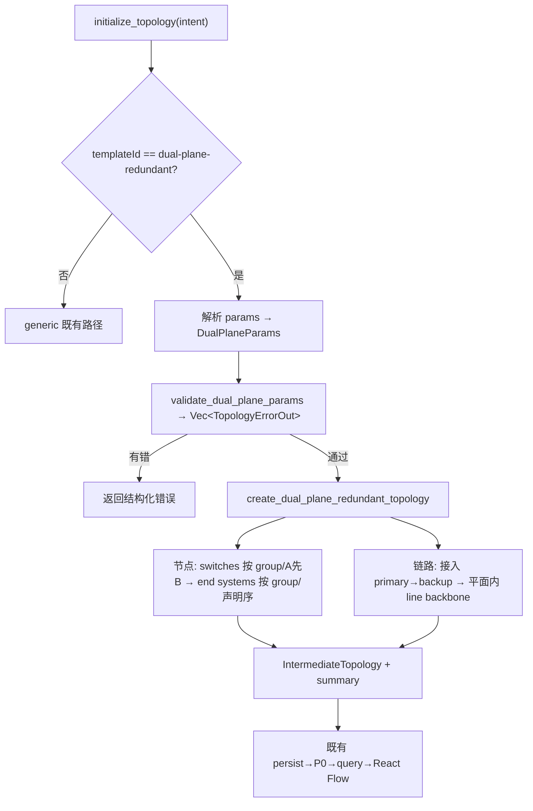

# feat: dual-plane-redundant 拓扑生成（宇航双平面单跳/双跳）

## Summary

在 Rust 拓扑域补上 `dual-plane-redundant` 的生成逻辑：`topology.initialize` 不再拒绝该模板，而是按显式 dual-plane 参数（planes / switches / switchGroups / endSystems / backbone / crossPlaneLinks）确定性生成 `IntermediateTopology`。范围收窄到 aerospace-minimal（`backbone=line` + `crossPlaneLinks=none` + 端系统双归属），同步把 catalog descriptor 与 MCP zod 收窄到这一合法域，并解禁 SKILL 决策树。

---

## Problem Frame

`dual-plane-redundant` 当前"声明但拒绝"：descriptor（`src-tauri/src/topology_compute.rs` `dual_plane_descriptor`）、MCP zod（`src-node/mcp/topology-tools.ts` 的 `dualPlaneParamsSchema`）、SKILL 决策树条目都已就位（旧计划 `2026-05-29-001` 的 U1/U3/U6 产物），但 `initialize_topology` 对它直接返回 `INVALID_TEMPLATE_PARAM`（Phase A 边界，生成逻辑被推迟）。本计划完成被推迟的生成逻辑（旧计划 U2），重定位到当前 Rust 架构——旧计划的 TS 路径（`src/topology/initialize.ts` 等）已被 2026-06-03 重构删除。

宇航文档《TSN典型组网测试方案》的双平面单跳（6 端系统 + 2 交换机）和双跳（4 端系统 + 4 交换机，平面 A: E1→SW1→SW3→E3 / 平面 B: E1→SW2→SW4→E3）用同一套 dual-plane 参数表达：单跳 = 1 个 switchGroup，双跳 = 2 个 group + 平面内 `line` 骨干。本计划只解锁"拓扑可建模"；802.1AS/Qbv/CB 配置与下发导出（time-sync/flow-template/planning-export 阶段）不在本次范围。

---

## Key Technical Decisions

- KTD1. **新建 dual-plane 生成器，校验先行。** 在 `topology_compute.rs` 新增 `create_dual_plane_redundant_topology(params)` 与 `validate_dual_plane_params(value)`，镜像 `create_generic_distributed_topology` 的风格但消费结构化参数。`initialize_topology` 的 dual-plane 分支改为 解析 → 校验 → 生成。复用 `IntermediateTopology` / `IntermediateNode` / `IntermediateLink` DTO、`create_ports` / `create_link` / `derive_mac_address` helper、`TopologyErrorOut` 错误信封、`sort_nodes_by_numeric_id` 确定性排序。
- KTD2. **端口分配是新建逻辑，不套用 generic 的定偏移方案。** generic 用 `switch_interconnect_port_offset = end_systems_per_switch` 的固定偏移，前提是每台 switch 接入数相同；dual-plane 每台 switch 承接 不定数量接入链路（可能跨 group）+ 平面内骨干链路，固定偏移不成立，需 first-free 端口分配（按 KTD3 序逐链路取下一个空闲端口）。**保持轻量**：first-free 就是每个节点维护一个"下一个空闲端口"游标（如 `HashMap<&str, usize>`），不要引入独立的 `PortAllocator` struct/trait 抽象。
- KTD3. **确定性排序显式规范（origin R5）。** 节点序 = switches（按 group 顺序、A 平面先于 B），再 end systems（按 group、再声明序）；链路序 = 接入链路（每 ES 先 primary 后 backup）→ 平面内 backbone（按平面 A/B、group 序）。numeric_id 按此序递增，落 `sort_*` 后稳定。**节点序是载荷身份来源**：`persist_initialized_topology` 按 numeric_id 排序后派生 `imac = 100 + 序号`，序不稳则设备身份不稳。端口（first-free）与坐标（grid）均按 KTD3 序迭代，故 R5 的端口/坐标确定性是 KTD3 的推论而非独立保证。
- KTD4. **advertise 收窄到已实现合法域（origin KD2）。** descriptor `backbone.mode` 仅 `line`、`crossPlaneLinks.mode` 仅 `none`、`backbone.withinPlane` 固定 `true`；zod 同步收窄。`initialize` 仍对 `ring`/`paired` 保留结构化拒绝作防御兜底（正常不会传入）。
- KTD5. **显示名沿用 numericId 派生（origin KD4）。** 生成器设的 `node.name` 仅 IntermediateTopology 内部用；persist（`persist_initialized_topology`）写 `sync_name = numeric_id`、丢弃 `name`，UI 渲染 `${prefix}-${syncName}`（即 SW-N / ES-N）。不改 P0 持久化、不追求文档 E1-E6 字面名。
- KTD6. **`allocation` / `switches[].role` 被忽略，生成器用确定性默认。** 端口 first-free、布局 A/B 双行 grid。这两个字段 zod `.strict()` 仍接受（旧 schema 遗留），但生成器不消费——Rust serde 不声明它们、靠默认忽略多余键即可，无需在 struct 里建死字段，也不删 zod（删会改 schema 面、徒增风险）。

---

## Requirements

来自 origin（`docs/brainstorms/2026-06-09-dual-plane-topology-generation-requirements.md`）。

- R1. `topology.initialize` 对 `dual-plane-redundant` 按显式参数确定性生成 `IntermediateTopology`，不再返回 `INVALID_TEMPLATE_PARAM`。
- R2. 支持 `backbone.mode=line`（`withinPlane=true`）+ `crossPlaneLinks.mode=none` + 端系统主备双归属；单跳=1 group，双跳=≥2 group（平面内 line 骨干按 group 级联），端系统可分属不同 group。
- R3. `backbone.mode=ring` / `crossPlaneLinks.mode=paired` 返回结构化"暂未实现"错误（防御兜底）。
- R4. 输入交叉校验返回可定位结构化错误：switchGroup 须引用一台 A + 一台 B switch；端系统 primary/backup 须跨平面**且不同 switch**；引用须存在；端口不足；缺必填 `backbone`/`crossPlaneLinks`。
- R5. 确定性：相同参数得到完全相同 nodes/links/ports/coordinates/summary（按 KTD3 规范序）。
- R6. 实现落 Rust 拓扑域，复用限于 DTO/错误信封/确定性契约/MAC-IP helper；交叉校验层与端口分配为新建。
- R7. SKILL 决策树解禁（删"暂不可选" + 加场景映射，不写字段说明）；descriptor + zod 收窄到 line/none/withinPlane:true。

---

## High-Level Technical Design

`initialize_topology` 的 dual-plane 分支数据流（U1）：

校验项（U1，R4）与"暂未实现"兜底（R3）都在 `validate_dual_plane_params` 内，返回 `Vec<TopologyErrorOut>`，与 `initialize_topology` 现有 `Result<_, Vec<TopologyErrorOut>>` 签名一致。

---

## Implementation Units

### U1. dual-plane 校验 + 生成（Rust initialize 分支）

**Goal**：`topology.initialize` 对 `dual-plane-redundant` 解析结构化参数、交叉校验、确定性生成 `IntermediateTopology`，替换现有拒绝分支。

**Requirements**：R1, R2, R3, R4, R5, R6。

**Dependencies**：无。

**Files**：
- `src-tauri/src/topology_compute.rs`（新增 DualPlaneParams serde 结构、`validate_dual_plane_params`、`create_dual_plane_redundant_topology`；改 `initialize_topology` dual-plane 分支；更新 `:1841` 附近的"dual-plane 被拒"测试；内联 `#[cfg(test)]` 测试）
- `src-tauri/src/topology_sidecar.rs`（grep 其 `#[cfg(test)]` 区是否有 dual-plane initialize 断言 `INVALID_TEMPLATE_PARAM` 的集成测试，有则更新/删除）
- `src-tauri/src/topology_intermediate.rs`（仅在需要新 helper 时；优先复用既有 `create_ports`/`create_link`/`derive_mac_address`/`sort_*`）

**Approach**：
- 新增 serde 结构**只声明被消费的字段**：`planes`(A/B)、`switches`{id,plane,groupId,portCount?}、`switchGroups`{id,planeSwitches{A,B}}、`endSystems`{id,groupId,attachment{primary{switchId,plane},backup{switchId,plane}}}、`backbone`{mode,withinPlane}、`crossPlaneLinks`{mode}。用 `#[serde(default)]` + 缺字段在校验层报错（不靠 serde 失败）。**不声明 `allocation`/`role`/`name` 这些 zod `.strict()` 仍接受但生成器不消费的字段，也不要用 `deny_unknown_fields`** —— serde 默认忽略多余键，既无死字段又不与 zod 产生 accept/reject drift（KTD6）。
- `validate_dual_plane_params`（R4/R3）：返回 `Vec<TopologyErrorOut>`（空=通过）。逐项：缺 `backbone`/`crossPlaneLinks` → 错；`backbone.mode != line` 或 `crossPlaneLinks.mode != none` → "暂未实现"结构化错误（R3）；`withinPlane != true` → 错；每个 group 的 `planeSwitches.A`/`.B` 必须引用存在且 plane 对应的 switch；每个 ES 的 primary/backup `switchId` 必须存在、`plane` 不同、`switchId` 不同；端口容量（若 `portCount` 给定）≥ 该 switch 实际接入+骨干链路数。错误用 `TopologyErrorOut::new(code, msg, "$.params....").with_details(...).requires_clarification()`，路径精确到字段。
- `create_dual_plane_redundant_topology`（R2/R5）：按 KTD3 序生成。switch 节点（group 序、A 先 B，numeric_id 递增）；ES 节点（group 序、声明序）；接入链路（每 ES：primary 链路再 backup 链路，first-free 取端口）；平面内 line 骨干（每平面按 group 序，相邻 group 的同平面 switch 连一条，first-free 端口）。位置用 A/B 双行 grid（A 上行 / B 下行，group 沿 X）。`metadata.template_id = "dual-plane-redundant"`、`layout = "dual-plane"`。
- `initialize_topology` dual-plane 分支：删除 `:274-288` 的 INVALID_TEMPLATE_PARAM 返回，改为 `parse → validate → generate`，组装 `InitializeSummary`。
- 更新现有断言"dual-plane 被拒绝"的 Rust 测试（adversarial reviewer 指出约在 `topology_compute.rs` 测试区）：改为断言单跳/双跳成功 + 保留 ring/paired 仍被拒的用例。

**Patterns to follow**：`create_generic_distributed_topology`（节点/链路/端口构建、numeric_id 递增、position 计算）；`normalize_integer_param`/`normalize_data_rate`（错误信封 + path + details 风格）；`IntermediateTopology` switch/end_system count helper；`sort_nodes_by_numeric_id`/`sort_links_by_numeric_id`。

**Execution note**：校验与生成先写失败的 Rust 单测（按 AE1-5）再实现。U1 体量较大，分两次提交保持 diff 可审：(1) serde 结构 + `validate_dual_plane_params` + 校验测试（AE3-AE5）；(2) `create_dual_plane_redundant_topology` + 生成测试（AE1-AE2）+ initialize 分支改写。

**Test scenarios**（内联 Rust `#[cfg(test)]`）：
- Covers AE1. 单跳：1 group（sw1=A、sw2=B）、6 ES 各 primary=sw1/backup=sw2、line/none → 8 节点（2 switch + 6 ES）、12 条接入链路（每 ES 2 条）、单 group 无 backbone 链路；`switch_count()==2`、`end_system_count()==6`。
- Covers AE2. 双跳：2 group（g1: sw1/sw2、g2: sw3/sw4）、E1/E2 接 g1、E3/E4 接 g2、line within-plane → 平面 A 生成 sw1→sw3 骨干、平面 B 生成 sw2→sw4 骨干；断言存在 ES(g1)→sw1→sw3→ES(g2) 同平面连通路径；节点/链路计数稳定。
- Covers AE3. ES primary/backup 同平面 → 结构化错误；primary/backup 同 switch（不同 plane 声明）→ 结构化错误。
- Covers AE4. `backbone.mode=ring` → "暂未实现"错误；`crossPlaneLinks.mode=paired` → "暂未实现"错误；均不生成。
- Covers AE5. group 只引用一个平面 / ES 引用不存在 switchId / 缺 `backbone` / 缺 `crossPlaneLinks` / 显式 `portCount` 不足 → 各自可定位结构化错误（断言 error path）。
- **输出完整性（高价值，端口分配护栏）**：把单跳/双跳生成结果喂 `validate_intermediate_topology`，断言 `report.ok`——sidecar initialize 路径不复验、persist 只查 node-id 不查端口存在/唯一，first-free 分配若有 off-by-one/重复端口会静默落库、只在后续 `build_artifacts` 才暴露；本断言提前拦截。镜像既有 `validate_intermediate_passes_for_initialize_output` 测试。
- R5 确定性：同一参数生成两次，nodes/links/ports/positions 完全相等（含 numeric_id 序与坐标）；并断言无两个节点共享相同 `(x, y)`（防 grid 退化成堆叠，渲染层无 auto-layout、直接吃持久化坐标）。

**Verification**：`cargo build` + `cargo test --manifest-path src-tauri/Cargo.toml` 通过；单跳/双跳用例产出预期节点/链路计数与连通性；ring/paired 与非法输入返回结构化错误。

### U2. descriptor + MCP zod 收窄到已实现合法域

**Goal**：catalog descriptor 与 MCP zod 只 advertise 本次实现的合法域（`backbone.mode=line`、`crossPlaneLinks.mode=none`、`withinPlane=true`），避免 SKILL 解禁后 agent 照 describe_templates 生成 ring/paired 撞运行时拒绝。

**Requirements**：R7（descriptor/zod 收窄部分）, R3。

**Dependencies**：U1（生成已实现，收窄才诚实）。

**Files**：
- `src-tauri/src/topology_compute.rs`（`dual_plane_descriptor`：`backbone.mode` itemShape 改 `"line"`、`crossPlaneLinks.mode` 改 `"none"`、`withinPlane` 标 `"true (fixed)"`）
- `src-node/mcp/topology-tools.ts`（`dualPlaneParamsSchema`：仅两处实际变更——`backbone.mode` `z.enum(["line","ring"])`→`z.literal("line")`、`crossPlaneLinks.mode` `z.enum(["none","paired"])`→`z.literal("none")`；`withinPlane` 已是 `z.literal(true)` 无需动；`allocation`/`role` 不动，避免改 schema 面）
- `src-node/mcp/topology-tools.test.ts`（更新/补 zod 测试）

**Approach**：descriptor 是 JSON 字面，改 itemShape 字符串即可；zod 把那两个 `z.enum([...])` 换 `z.literal(...)`。已核：仓库无 dual-plane 专属 catalog↔zod drift 守护测试（`mcp_zod_legal_domain_matches_rust_constants` 只覆盖 generic 的 switchCount/endSystemsPerSwitch 上下限），故无额外期望要同步。注释标注 ring/paired 待实现时 re-advertise。

**Patterns to follow**：`dual_plane_descriptor` 既有 itemShape 写法；`topology-tools.ts` 既有 `z.literal`/`z.enum` 用法。

**Test scenarios**：
- zod 接受 `backbone.mode=line` / `crossPlaneLinks.mode=none`；拒绝 `ring` / `paired`（schema 层早失败）。
- descriptor catalog 的 dual-plane 条目 `backbone.mode` 不再含 `ring`、`crossPlaneLinks.mode` 不再含 `paired`。
- 若有 catalog↔zod drift 守护测试：仍通过。

**Verification**：`npx vitest run src-node/mcp/topology-tools.test.ts` + `cargo test` 通过；`describe_templates` 返回的 dual-plane 合法域与 zod、与 U1 实现三者一致。

### U3. SKILL 决策树解禁 dual-plane

**Goal**：tsn-topology SKILL 决策树解禁 `dual-plane-redundant`，引导宇航双平面场景选用它。

**Requirements**：R7（SKILL 解禁部分）。

**Dependencies**：U1, U2（生成已可用 + descriptor/zod 已收窄后才解禁，避免 SKILL 指向仍 advertise ring/paired 的契约误导 agent）。

**Files**：
- `.claude/skills/tsn-topology/SKILL.md`

**Approach**：仅两处改动——删除 dual-plane 条目里"（Phase B，暂不可选）/ 当前拒绝它 / 引导用 generic-ring 近似"措辞；加一行场景映射"宇航双平面验收（单跳/双跳）→ dual-plane-redundant"。不写 `switches`/`switchGroups`/`endSystems` 字段说明（合法域仍以 `describe_templates` 为准）。

**Patterns to follow**：SKILL.md 既有"场景 → 模板"决策树条目格式。

**Test scenarios**：`Test expectation: none -- 纯指引文档改动，无行为代码`。人工核对：SKILL 不再说 dual-plane 暂不可选、不复述参数合法域。

---

## Scope Boundaries

### 范围内
- aerospace-minimal dual-plane 生成（`line` + `none` + 双归属）+ 输入交叉校验 + dual-plane 端口分配 + descriptor/zod 收窄到已实现合法域 + SKILL 决策树解禁。

### Deferred for later
- `backbone=ring` 骨干、`crossPlaneLinks=paired` 跨平面桥接（实现时需 re-advertise descriptor/zod）。**前向注记**：后续 802.1CB FRER 落地前需确认是否依赖 cross-plane `paired` 还是 `none`+双归属即可——若依赖 `paired` 会 re-open 本生成逻辑。
- `attachmentPlan` / `endSystemsPerGroup` 压缩展开参数。
- 工业/车载/电力等场景级 dual-plane 参数预设。

### 本次不做
- 802.1AS per-node 同步配置、802.1Qbv 门控、802.1CB FRER、5 跳线性 ends-only 形态（ideation idea 2/3/4/5，各自独立推进）。
- 改 P0 持久化以支持显式显示名（KTD5：沿用 numericId 派生）。
- offset/jitter/丢包测量（T10 测试仪职责）。

### Outside this product's identity
- 本软件 = TSN 控制器（规划+配置+监控）；流量测量不并入。

---

## Risks & Dependencies

- RISK1. **端口分配 / 确定性回归**：dual-plane 端口是新建 first-free 逻辑，易与既有 generic 定偏移混淆。缓解：KTD3 规范序 + R5 确定性单测（同输入两次全等）。
- RISK2. **双跳连通性被弱断言放过**：AE2 必须断言跨 group 同平面路径存在（不只计数），否则生成器可能把 ES 全堆一个 group 仍过测。U1 测试已显式要求路径断言。
- RISK3. **catalog↔zod↔实现三处合法域 drift**：U2 同步收窄三处；若有 drift 守护测试需同步期望。
- 依赖：`IntermediateTopology` DTO、persist→P0→query→React Flow 既有链路不变（生成的节点/链路走既有渲染，无前端改动）。

---

## Acceptance Examples

来自 origin，映射到实现单元。

- AE1. **单跳**（U1）：1 group（sw1=A、sw2=B）、6 ES 双归属、line/none → 8 节点 + 每 ES 两条接入链路，单 group 无 backbone；可重复。
- AE2. **双跳**（U1）：2 group、E1/E2 接 g1、E3/E4 接 g2、line within-plane → 平面 A SW1→SW3、平面 B SW2→SW4 骨干；断言跨 group 同平面路径；计数稳定、可重复。
- AE3. ES primary/backup 同平面或同 switch → 结构化错误（U1）。
- AE4. `ring` / `paired` → "暂未实现"结构化错误，不生成（U1）；U2 后正常不会传入（catalog/zod 已收窄）。
- AE5. group 单平面 / ES 引用不存在 switch / 缺 backbone 或 crossPlaneLinks → 各自结构化错误（U1）。

---

## Sources / Research

- origin：`docs/brainstorms/2026-06-09-dual-plane-topology-generation-requirements.md`；设计源 `docs/plans/2026-05-29-001-feat-dual-plane-topology-template-plan.md`；宇航场景 `docs/prototypes/TSN典型组网测试方案_20260527.docx`；`docs/ideation/2026-06-09-aerospace-topology-support-ideation.md`。
- `src-tauri/src/topology_compute.rs` —— `initialize_topology`（入口 + dual-plane 拒绝分支）、`create_generic_distributed_topology`（生成样板）、`normalize_integer_param`/`normalize_data_rate`（错误信封风格）、`dual_plane_descriptor`（catalog）、`validate_intermediate_topology`（输出校验）、`TopologyErrorOut` builder。
- `src-tauri/src/topology_intermediate.rs` —— `IntermediateTopology`/`IntermediateNode`/`IntermediateLink` DTO、`create_ports`/`create_link`/`derive_mac_address`/`sort_nodes_by_numeric_id`。
- `src-tauri/src/topology_sidecar_routes.rs` —— `persist_initialized_topology`（写 `sync_name=numeric_id`、丢 name → KTD5 依据）。
- `src-node/mcp/topology-tools.ts` —— `dualPlaneParamsSchema`（zod union，待收窄）。
- `.claude/skills/tsn-topology/SKILL.md` —— 决策树 dual-plane 条目（待解禁）。
- 测试：`cargo test --manifest-path src-tauri/Cargo.toml`（Rust 内联）+ `vitest run`（TS zod）。
