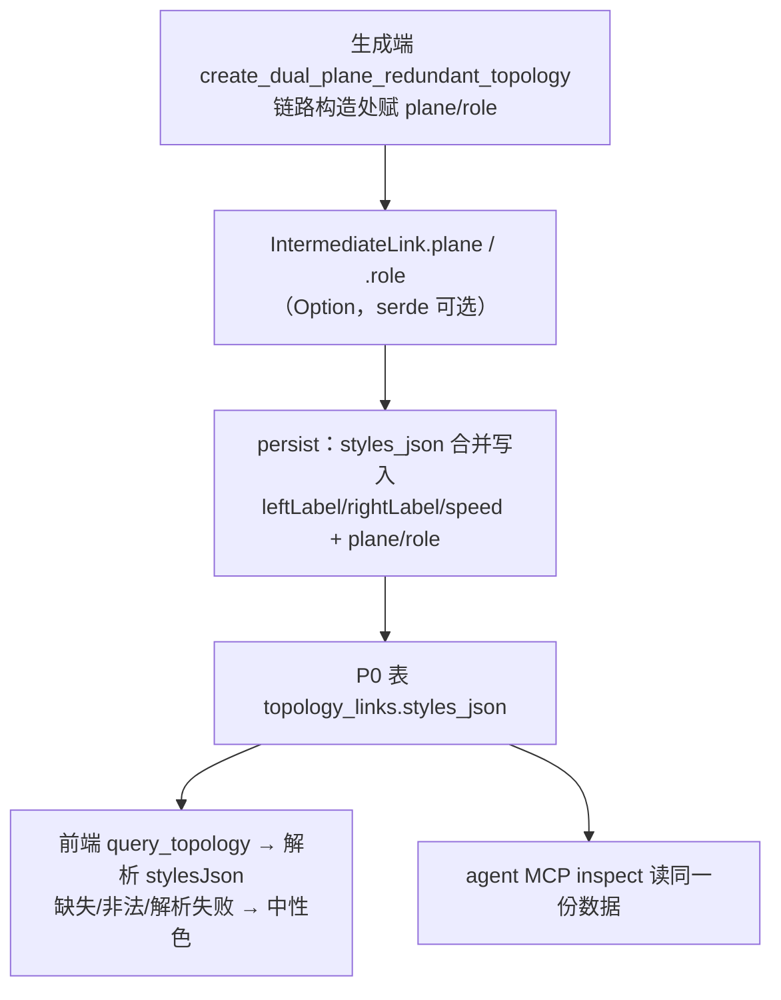

# feat: 双平面拓扑画布对标规范图

## Summary

让双平面拓扑画布复刻规范参考图：Rust 生成端按组数分支布局（单跳三明治、双跳两平面行 + ES 左右外端）、端口 P0 起编全模板统一、链路平面语义经 stylesJson 落库；前端改 smoothstep 正交折线、平面 A 蓝 / B 红配色、四向 handle 几何选边、端口号标注在连线两端。存量数据一律不迁移。

## Problem Frame

当前 dual-plane 生成把全部 ES 挤在单行 `y=-60` 且 70px 间距小于节点实宽（必然重叠），单跳/双跳共用一个投影；前端默认 bezier + 每节点仅左右各一个 handle，曲线绕行交叉；平面归属不落库、端口号已落库但前端零消费。验收者拿规范图对照画布时结构对不上（see origin: docs/brainstorms/2026-06-10-topology-canvas-spec-alignment-requirements.md）。

---

## Requirements

承接 origin R1-R12，按关注组分述（编号与 origin 一致）：

**布局生成（Rust）**
- R1. 单跳（1 组）：SW 同行居中；ES 按组内声明序前半上行、后半下行夹住 SW 行。
- R2. 双跳/多组：平面 SW 各一行；ES 按 group 前半挂左、后半挂右（奇数中位归左），y 对齐 primary 所在平面行；同组同主平面多 ES 沿外端水平堆叠。
- R3. 任意两节点不重叠：ES 间距常量 ≥ 180px，组列宽随行内 ES 数扩展；常量作为测试断言依据。
- R4. 既有约束保持：节点序不变（imac 身份源）、同参坐标全等、整数坐标；确定性测试扩展覆盖新形态。

**端口命名**
- R5. 端口 id P0 起编，全模板统一（含 generic-line/ring 新生成）；节点端口与链路标签同步；存量保持 p1 不升级。

**链路语义（Rust → DB）**
- R6. 链路 stylesJson 携带 plane（A/B/无）与 role（access/backbone）：生成端在中间链路上以可选字段携带，persist 合并写入。

**画布渲染（前端）**
- R7. plane 缺失、非法或 stylesJson 解析失败 → 中性色 `#a8b0c0`，不报错、不迁移。
- R8. edge 用 smoothstep 正交折线替代默认 bezier。
- R9. 平面配色 A 蓝 / B 红，独立 token（`--plane-a` / `--plane-b`），不复用 `--info` / `--error` / `--accent`。
- R10. 四向 handle，纯函数按相对方位选边：跨行（y 不同）一律垂直、同行水平。
- R11. 端口号渲染在连线两端近节点处（数据 = stylesJson leftLabel/rightLabel），随偏移平移、不与节点框重叠。
- R12. 汇入同一 handle 的多条边以确定性偏移错开。

---

## Key Technical Decisions

- **布局按 `switch_groups.len()` 分支**：1 组走单跳三明治投影，多组走双平面行投影。规范文档本身是两套画法，分支是贴近规范（see origin Key Decisions）。
- **「前半」= ceil(n/2)**：奇数 ES 上行多一台；n=1 时仅上行，不视为违反夹心。补齐 origin 未定义的奇数切分，进确定性测试。
- **P0 改名只动 `create_ports` 的 `id` 字段**（`p{i+1}` → `P{i}`）与 dual-plane `next_port` 闭包（`p{value+1}` → `P{value}`）；`name`（eth{i}）与 `index` 不动。`validate_link_values` 的端口引用校验天然保证两处命名点不一致时测试即红。
- **plane/role 用 `Option<String>` 加在 `IntermediateLink`**：serde `default + skip_serializing_if`（metadata 已有同款模式），additive 不 bump schemaVersion；`validate_intermediate` 无 `deny_unknown_fields`，旧 JSON 反序列化不受影响。MCP zod 的 `.strict()` 只锁 apply_operations 入参且 stylesJson 是不透明字符串，无阻碍。
- **R11 双端端口标注需要 thin custom edge**：React Flow 内置 edge 仅支持单个中心 label；自定义 `TsnLinkEdge` 内部仍调 `getSmoothStepPath`（保 smoothstep 形态与 offset），用 `EdgeLabelRenderer` 在源/目端点附近渲染两个端口标签。这是需求里「offset 通道不够再升级」缺口在规划期即触发——升级原因是标签而非偏移。
- **offset 确定性键**：同一 handle 上的边按 linkSeq 升序取序数 × 固定步长（如 12px），两次渲染视觉全等。同行（两端同 y）的共走廊直线边对 smoothstep 的 offset 参数不敏感（无拐弯路径不受其影响），错开机制改用 `getSmoothStepPath` 的 centerY 位移：按序数向行外偏移制造绕行拐弯，同时避开中间节点框。
- **配色经 edge className 而非 inline style**：按平面给 edge 设 `plane-a` / `plane-b` / `plane-neutral` className，stroke 规则写在 App.css 既有 `.react-flow__edge-path` 基础规则与 `.selected` / `.flow-highlighted` 规则之间——内联 `style.stroke` 会在 CSS 优先级上压过无 `!important` 的选中态规则，className + 级联顺序天然保证选中时回到 `--accent`。测试断言 className。
- **配色 token 候选值**：`--plane-a: #1d5fa8`（蓝）、`--plane-b: #c0392b`（红）、中性复用 `#a8b0c0`。真机验收可调。

---

## High-Level Technical Design

两种投影（坐标为方向示意，最终常量以实现为准）：

```text
单跳（1 组，6 ES + 2 SW）              双跳（2 组，4 ES + 4 SW）
ES-1   ES-2   ES-3      ← 上行 ceil(n/2)    ES-2 ─┐               ┌─ ES-4
  \    |  \  /  |                                  ├ SW-B1 ── SW-B2 ┤   ← 平面B行
   SW-1      SW-2        ← SW 同行居中             │   ×交叉接入×    │
  /    |  /  \  |                                  ├ SW-A1 ── SW-A2 ┤   ← 平面A行
ES-4   ES-5   ES-6      ← 下行其余             ES-1 ─┘               └─ ES-3
                                              （ES y 对齐 primary 平面行，
                                                组1 在左、组2 在右）
```

平面语义数据流（R6/R7/R9 链路）：



---

## Implementation Units

### U1. 端口 P0 起编全模板统一

- **Goal**: 所有生成端端口 id 从 P0 起编，节点端口与链路标签一致。
- **Requirements**: R5
- **Dependencies**: 无
- **Files**: `src-tauri/src/topology_intermediate.rs`（`create_ports`）、`src-tauri/src/topology_compute.rs`（dual-plane `next_port` 闭包、generic 链路端口引用、既有测试夹具）
- **Approach**: `create_ports` 的 `id` 改 `P{i}`（0 起）；`next_port` 改 `P{value}`；generic line/ring 若有独立端口字符串构造处同步改。`validate_link_values` 端口引用校验作为一致性护栏。存量数据不动。
- **Patterns to follow**: 既有确定性测试的夹具更新方式（`topology_compute.rs` tests 模块）。
- **Test scenarios**:
  - Covers AE3（部分）：单跳 initialize 后任一节点首端口 id 为 `P0`；链路 leftLabel/rightLabel 与节点端口 id 同前缀同起编。
  - generic-line 与 generic-ring 新生成端口同为 P0 起编。
  - generic-ring initialize 输出通过 `validate_intermediate_topology` 且 report ok（镜像既有 generic-line 的 validate 兜底测试；ring 闭环块有独立端口字面量，漏改时该断言即红）。
  - 既有确定性测试（同参两次全等）夹具更新后全绿。
- **Verification**: `cargo test` 全绿，含 P0 起编断言。

### U2. dual-plane 布局重写（按组数分支投影）

- **Goal**: 单跳三明治 / 双跳两平面行 + ES 左右外端，无重叠、确定性、整数坐标。
- **Requirements**: R1, R2, R3, R4
- **Dependencies**: 无（与 U1 同文件，建议顺序执行避免冲突）
- **Files**: `src-tauri/src/topology_compute.rs`（`create_dual_plane_redundant_topology` 坐标分支 + 布局常量 + tests）
- **Approach**: 引入整数布局常量（`ES_PITCH = 180`、行 y 值、组列距随行内 ES 数反推）。单跳分支：SW 同行按平面序排列；ES ceil(n/2) 上行、其余下行，行内对称展开。双跳分支：平面 A/B 各一行；ES 按 group 声明序前半左、后半右（奇数中位左），y 取 primary 所在平面行，同组同主平面多 ES 沿外端向外按 ES_PITCH 堆叠。只改 position 赋值，节点生成/排序循环不动（KTD3 imac 身份源）。
- **Patterns to follow**: 现有 `create_generic_distributed_topology` 的整数坐标算术风格；确定性测试 `topology_compute.rs:2707` 附近的断言形态。
- **Test scenarios**:
  - Covers AE1：单跳 6ES+2SW —— SW1/SW2 同 y；ES-1..3 上行、ES-4..6 下行；任意两节点 x 或 y 距 ≥ 常量（无重叠）。
  - Covers AE2：双跳 4ES+4SW 2 组 —— 平面 A 行 / 平面 B 行；组 1 ES 在左、组 2 在右；y 对齐各自 primary 平面行；同组同主平面双 ES 沿外端堆叠不重叠。
  - 3 组：前半左、后半右、中位组归左，确定性。
  - 奇数 ES（如 5 台）：上行 3 台、下行 2 台；n=1 仅上行。
  - Covers AE5：同参两次 initialize 坐标全等且无两节点同坐标。
- **Verification**: `cargo test` 全绿，新形态断言齐备。

### U3. 链路平面语义落库

- **Goal**: IntermediateLink 携带可选 plane/role，persist 合并进 styles_json。
- **Requirements**: R6
- **Dependencies**: 无
- **Files**: `src-tauri/src/topology_intermediate.rs`（`IntermediateLink` 结构体）、`src-tauri/src/topology_compute.rs`（`create_link` 签名 + dual-plane 链路构造赋值；generic 置 None）、`src-tauri/src/topology_sidecar_routes.rs`（persist styles_json 合并 + tests）、`src-node/mcp/topology-tools.ts`（link_add 的 stylesJson describe 文案补 plane/role 提示）
- **Approach**: `plane: Option<String>`、`role: Option<String>`，serde `default + skip_serializing_if`。dual-plane `link_pairs` 构造处可零成本得平面（接入边 = 对端 SW 的 plane，role=access；骨干边 = 所属平面，role=backbone）。persist 的 `json!` 仅在 Some 时加键，其余字段不变。
- **Patterns to follow**: `IntermediateTopologyMetadata` 的可选字段 serde 模式；`persist_writes_logical_node_name_for_display` 测试形态（topology_sidecar_routes.rs）。
- **Test scenarios**:
  - dual-plane persist 后链路 styles_json 含 `plane:"A"|"B"` 与 `role:"access"|"backbone"`，且 leftLabel/rightLabel/speed 保留。
  - 接入边 plane 与对端 SW 平面一致；骨干边 role 为 backbone。
  - generic-line persist 后 styles_json 无 plane/role 键（断言键不存在——plane=None 路径不得写入 null 值键）。
  - 旧 IntermediateTopology JSON（无新字段）反序列化成功（additive 回归）。
- **Verification**: `cargo test` 全绿。

### U4. 前端边渲染语义化

- **Goal**: smoothstep + 平面配色 + 容错回退 + 同 handle 确定性偏移。
- **Requirements**: R7, R8, R9, R12
- **Dependencies**: U3（plane 数据源；中性回退保证无数据也可渲染）
- **Files**: `src/app/components/workspace-pane/index.tsx`、`src/app/App.css`、`src/app/components/workspace-pane/workspace-pane.test.tsx`
- **Approach**: `topologySnapshotToReactFlow` 解析每条 link 的 stylesJson（try/catch；缺失/非法/解析失败 → 中性）；edge 设 smoothstep 几何与平面 className（`plane-a` / `plane-b` / `plane-neutral`，见 KTD——不用 inline `style.stroke`，否则压过选中态规则）；同 handle 边按 linkSeq 序数 × 步长生成 offset。App.css 增 `--plane-a: #1d5fa8`、`--plane-b: #c0392b` 与三条 plane stroke 规则（置于 `.selected` 规则之前）。
- **Patterns to follow**: 现有 `topologySnapshotToReactFlow` 映射结构；App.css 既有 token 定义区（line 18-19 附近）。
- **Test scenarios**:
  - Covers AE4（部分）：stylesJson 缺 plane / 含非法 plane / 非 JSON 字符串 → 边样式为中性色且不抛错。
  - plane A 边 className 为 `plane-a`，plane B 为 `plane-b`，无平面为 `plane-neutral`。
  - 汇入同一 handle 的多条边 offset 互不相同且两次渲染相同（确定性）。
  - Covers AE4（部分）：存量链路（leftLabel:"p1"、无 plane 字段）渲染为中性 className，且标签数据原值透传（不映射、不过滤）。
- **Verification**: `npm test` 全绿。

### U5. 四向 handle + 双端端口标注

- **Goal**: 几何选边纯函数 + P0 端口号上画布。
- **Requirements**: R10, R11
- **Dependencies**: U2（新布局下选边才有意义）、U4（edge 构造同文件）
- **Files**: `src/app/components/workspace-pane/index.tsx`（TsnTopologyNode 四向 handle、选边纯函数、`TsnLinkEdge` 自定义 edge）、`src/app/App.css`、`src/app/components/workspace-pane/workspace-pane.test.tsx`
- **Approach**: TsnTopologyNode 四边各放带 id 的 source+target handle，沿用现有 `.tsn-node .react-flow__handle` 6×6 样式与默认居中定位，无需额外 CSS。选边纯函数（输入两端 DB 坐标）：y 不同 → 垂直（上节点 bottom ↔ 下节点 top）；y 相同 → 水平（左 right ↔ 右 left）。`TsnLinkEdge` 内部 `getSmoothStepPath`：跨行边接 U4 的 offset；同行共走廊边改用 centerY 位移（KTD——offset 对同 y 直线无效），位移量按序数向行外偏移并绕开中间节点框。`EdgeLabelRenderer` 在源/目端点附近渲染 leftLabel/rightLabel（10px mono，距节点边界约 12px、沿 R12 偏移同轴平移）；标签值原样显示（新数据 P0、存量 p1）。
- **Patterns to follow**: React Flow 官方 custom edge + EdgeLabelRenderer 模式（@xyflow/react 12.x）；现有 `.tsn-node` CSS。
- **Test scenarios**:
  - Covers AE3：新生成拓扑边两端显示 P0 起编端口标签，与 stylesJson 值一致。
  - Covers AE4（部分）：存量链路标签显示 p1 原值。
  - 跨行边 sourceHandle/targetHandle 为垂直对；同行边为水平对；纯函数同输入同输出。
  - 单跳长距边（ES-1→SW-2）不选水平 handle（防穿行断言：跨行一律垂直）。
  - 同行共走廊场景（双跳同组同主平面堆叠 ES、3 组中位组）：外侧节点的边带非零 centerY 位移、与内侧边路径不共线（防直线重叠与穿节点）。
- **Verification**: `npm test` 全绿；真机目检画布与规范图结构对齐（最终由 boss 验收）。

---

## System-Wide Impact

- **agent 可见面**：inspect 返回的链路 stylesJson 新增 plane/role 键；agent 按 link_add 工具提示「抄既有链路 stylesJson 当格式参照」时可能把 A 平面样式抄给 B 平面新链路——前端按 R7 容错（非法/错值不报错），工具描述文案在 U3 同步更新提示该字段语义。SKILL.md 无需改（约定不复述 stylesJson 形状）。
- **端口命名面**：P0 起编影响所有模板新生成数据与 DB styles_json 中的端口字符串；legacy artifacts 导出的 leftLabel/rightLabel 取自端口 index（`legacy_port_number`），index 不动故导出产物不变。节点端口与链路标签由 `validate_link_values` 保证一致；agent 经 inspect 看到的端口号与画布显示一致（命名一致性是本次变更的动机之一）。
- **渲染面**：edge 类型与 handle 变更对所有拓扑（含 generic 模板与存量数据）生效——generic 横排的同 y 水平直连边在 smoothstep 下退化为直线，与 bezier 同形，视觉无回归（AE4 的中性色检查覆盖该路径）；存量 dual-plane 旧坐标 + 新渲染的组合由 AE4 验收。

---

## Scope Boundaries

承接 origin：TSN 控制器节点不入图（已否决）；泳道背景带/图例与 AABB 质量门形式化为后续增量；存量拓扑不迁移不 relayout（旧坐标、p1 命名保持，重新生成才获得新形态）；generic-line/ring 布局不动（U1 仅改其端口命名）；不做节点拖拽、不引前端布局库。

### Deferred to Follow-Up Work

- generic-ring 环形布局修复（ideation idea 7）。
- 平面泳道 + 图例（idea 5）、布局质量门契约（idea 4）。

---

## Risks & Dependencies

- **generic 测试夹具更新面**：P0 改名波及既有断言，遗漏即测试红（自暴露，低险）。
- **新旧端口命名并存**：旧会话 p1、新生成 P0 同屏可能出现（origin 已接受，AE4 验收）。
- **smoothstep 偏移的视觉效果**：测试只能断言 offset 互异，走线美观需真机确认；若同走廊分离不足，升级路径已在 `TsnLinkEdge` 内（调 offset 步长或路径参数）。
- **legacy artifacts 导出**：端口查找 `unwrap_or(0)` 静默回退——P0 改名后节点端口与链路标签同源生成，校验（initialize 复验）先于导出，不受影响；实现时保持该顺序。

---

## Sources & Research

- origin：`docs/brainstorms/2026-06-10-topology-canvas-spec-alignment-requirements.md`（含 doc-review 11 处修订）
- 诊断与外部研究：`docs/ideation/2026-06-10-topology-canvas-layout-ideation.md`（AFDX 蓝/红惯例、React Flow smoothstep/多 handle/EdgeLabelRenderer 零依赖路径、硬约束清单）
- 代码定位：`src-tauri/src/topology_intermediate.rs:154`（create_ports）、`src-tauri/src/topology_compute.rs:968-1105`（dual-plane 生成）、`:2399+`（dual-plane 测试）、`src-tauri/src/topology_sidecar_routes.rs:299`（persist styles_json）、`src/app/components/workspace-pane/index.tsx:202-255`（React Flow 映射与节点组件）
- 规范参考图：`docs/prototypes/TSN典型组网测试方案_20260527.docx` 图 4-1（单跳）、双跳组网图
