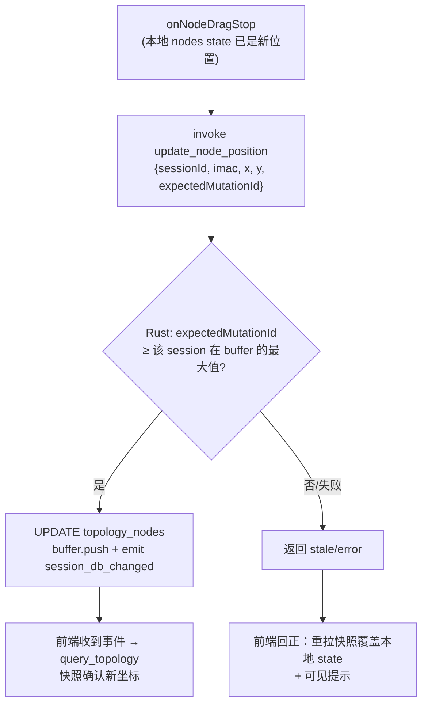

# feat: 拓扑画布交互与连线重做（floating 贝塞尔 + 节点拖动）

## Summary

连线改为 floating 贝塞尔（边吸附节点边框、handle 圆点消失、含中心重合退化兜底），节点开放拖动并经新增 Tauri command 持久化坐标（mutationId 比对拒绝陈旧写、失败回滚提示），生成端给堆叠 ES 加纵向错位。移除上一轮的正交走廊/绕行机制。

## Problem Frame

正交折线在真机暴露同 handle 出口共线重叠、handle 圆点形似端口、节点锁死三个问题（see origin: docs/brainstorms/2026-06-11-topology-canvas-interaction-requirements.md）。origin 已裁决：floating 贝塞尔 + 拖动持久化 + 隐藏 handle；写坐标通道因 sidecar Bearer token 仅在 Rust 内存流转的安全设计，定为新增 Tauri command。

---

## Requirements

承接 origin R1-R12（编号一致）：R1 floating 贝塞尔 + 退化兜底；R2 无 handle 圆点、默认点击热区；R3 平面配色与选中态保留；R4 双端端口标签跟随；R5 拖动持久化（整数化、agent 同源、重开不丢）；R6 重新生成覆盖手拖（不保护）；R7 拖动至写入确认期间本地坐标优先；R8 堆叠 ES 纵向错位（既有约束保持、y 对齐断言放宽）；R9 光标反馈/禁多选/拖毕选中；R10 失败回滚 + 可见提示；R11 与 initialize 交错时重建优先（陈旧写丢弃）；R12 仅首次加载 fitView。

---

## Key Technical Decisions

- **写坐标命令复用 mutation buffer + session_db_changed 既有通知链**：`topology_mutation_buffer.push()` 铸单调 mutationId、emit 与 sidecar mutation 同构的事件——前端快照刷新、agent catch-up 无需新机制（see origin Dependencies）。
- **R11 陈旧写检测用 mutationId 比对（per-session、严格小于）**：前端 `useSessionDbListener` 已接收每次变更的 mutationId；拖动开始时记录最近值，写入时随请求携带，Rust 端与**该 session 在 buffer 中的最大 mutationId**比对，`expected < session_max` 才拒绝（相等放行；重启清零后首拖不误拒）。禁用 `since().latest`——那是跨 session 全局值，会被其他 session 的 mutation 误触发 NACK；用 `since(sessionId, 0)` 末项推导（记录被逐出时回退 0，fail-open）。
- **拖动用本地 nodes state + 受控同步**：React Flow 标准模式——快照派生初始 nodes，`onNodesChange` 应用拖动位移，`onNodeDragStop` 持久化；拖动中收到的快照缓存到拖动结束后再应用（R7）。`fitView` 从静态 prop 改为初载一次调用（R12）。
- **Floating 边按官方示例移植交点数学**：`useInternalNode` 取节点实时几何，计算边框上朝向对端的交点，`getBezierPath` 连接；两中心重合/包含时分母为零产 NaN——兜底回退中心直连（origin R1）。节点保留一对隐形 handle（React Flow 边合法性要求），CSS 不可见。
- **堆叠错位由双线段几何测试驱动，不预设常量**：纯垂直错位在本布局几何下无解——primary 线越过内侧节点盒近端边缘需要大偏移，而 backup 跨平面线避开同一节点盒要求小偏移，两约束无交集（评审实算证实，且节点 126px 宽带来的边缘衰减使中心点验算失真）。U2 改为：堆叠 ES 在既有 x 外推（ES_PITCH×k）基础上叠加 y 错位，方向与幅度在实现期由几何测试推导——测试同时断言外侧 ES 的 primary 与 backup 两条线段对所有同 lane 内侧节点盒的间隙 ≥ 阈值，常量取让断言成立的最小整数值。
- **回滚提示复用 `.transfer-notice.error` 既有样式**：挂在 `.topology-stage` 内底部居中，文案「位置保存失败，已恢复」，3 秒自动消失；不新建 toast 体系。

---

## High-Level Technical Design

拖动持久化数据流（R5/R7/R10/R11）：

Floating 边锚点（R1）：每条边独立计算「源节点边框 ∩ 指向目标中心的射线」与对侧交点，贝塞尔连接两交点；端口标签锚在交点外侧。节点重叠时交点数学退化 → 中心直连。

---

## Implementation Units

### U1. Rust：update_node_position 命令

- **Goal**: 前端可持久化节点坐标，带陈旧写拒绝与变更通知。
- **Requirements**: R5, R11
- **Dependencies**: 无
- **Files**: `src-tauri/src/topology_position_command.rs`（新建，含 tests）、`src-tauri/src/lib.rs`（注册 + 模块声明）
- **Approach**: 入参 `{ sessionId, imac, x, y, expectedMutationId }`（x/y 整数）。校验：行存在（`UPDATE ... WHERE session_id AND imac`，rows=0 → 错误）；`expectedMutationId < 该 session 在 buffer 的最大 mutationId`（严格小于，per-session 推导见 KTD）→ 返回 stale 错误不写。成功后 `buffer.push(session, "topology")` + emit `session_db_changed`（镜像 sidecar mutation 的 emit 形态）。
- **Patterns to follow**: `src-tauri/src/topology_query_command.rs`（command 形态/State 注入）、`src-tauri/src/topology_sidecar_routes.rs` 的 buffer push + emit 链、`topology_mutation_buffer.rs` API。
- **Test scenarios**:
  - 正常更新：写入后 SELECT 返回新坐标；buffer 长度 +1。
  - Covers AE2（后端半）：更新后 query_topology 快照含新坐标。
  - 陈旧拒绝：先经 buffer.push 推进该 session 的 mutationId，再以旧 expectedMutationId 调用 → stale 错误且坐标未变。
  - 其他 session 推进 mutationId 不触发本 session 的 stale 误拒（per-session 语义）。
  - Covers AE5（后端半）：DB 写入失败（如表锁/约束错误的可注入场景）→ 返回 Err，坐标未更新、buffer 未推进。
  - 未知 imac → 错误；非当前 session 不受影响。
- **Verification**: `cargo test` 全绿，新命令在 invoke_handler 注册。

### U2. Rust：堆叠 ES 纵向错位

- **Goal**: 同 lane 堆叠 ES 错位，floating 直线不穿内侧节点。
- **Requirements**: R8
- **Dependencies**: 无
- **Files**: `src-tauri/src/topology_compute.rs`（lane 堆叠 y 计算 + tests）
- **Approach**: 多组分支的 lane 游标处，在既有 x 外推（ES_PITCH×k）基础上给第 k 台叠加 y 错位（k=0 保持严格对齐平面行）；错位方向与幅度按 KTD 由几何测试推导——先写双线段间隙断言（红），再调常量到绿，取最小可行整数。整数算术，节点序/确定性不变。
- **Execution note**: 先写失败的几何间隙测试再实现常量（测试驱动错位取值）。
- **Patterns to follow**: 既有布局常量风格（ES_PITCH 等）。
- **Test scenarios**:
  - Covers AE3：构造同组同主平面双 ES，断言外侧 ES 的 **primary 与 backup 两条**中心连线段对所有同 lane 内侧节点盒（126×56 估值）的最小距离 ≥ 16px（双线段几何断言，常量由此推导）。
  - 既有 `dual_plane_two_hop_layout_matches_spec_projection` 的 y 严格相等断言改为：k=0 ES 对齐平面行、k>0 ES 偏移非零且行内 x 间距仍 ≥ 180。
  - 确定性双跑 + 坐标唯一性对三种布局分支仍全绿。
- **Verification**: `cargo test` 全绿。

### U3. 前端：floating 贝塞尔边替换正交机制

- **Goal**: 连线吸附边框、曲线渲染、退化兜底、标签/配色保留；移除走廊/绕行/四向 handle 选边。
- **Requirements**: R1, R2, R3, R4
- **Dependencies**: 无（与 U4 同文件群，先行）
- **Files**: `src/app/components/workspace-pane/tsn-floating-edge.tsx`（新建：交点数学 + NaN 兜底 + 双端标签）、`src/app/components/workspace-pane/topology-flow.ts`（映射简化：移除 pickHandleSides/corridor/detour/ords，edge 仅 {id, source, target, type, className, data:{leftLabel,rightLabel}}）、`src/app/components/workspace-pane/index.tsx`（节点改一对隐形 handle、edgeTypes 换新）、删除 `src/app/components/workspace-pane/tsn-link-edge.tsx`、`src/app/App.css`（handle 隐藏、tsn-port-label 保留）、`src/app/components/workspace-pane/workspace-pane.test.tsx`
- **Approach**: 移植官方 Floating Edges 交点算法为纯函数 `floatingEdgeAnchors(sourceNode, targetNode)`（输入节点 position+尺寸，输出两交点与朝向）；重合/包含时回退两中心连线。`TsnFloatingEdge` 用 `useInternalNode` 取实时几何（拖动跟随），`getBezierPath` 出路径，`EdgeLabelRenderer` 在交点外侧 14px 渲染标签；组件读 `selected` prop 把选中态注入标签 className（`.tsn-port-label` 选中变 `--accent`，与边同步）。隐形 handle CSS：`width/height 0、border 0、background transparent、pointer-events none`（不用 opacity——避免 hover 高亮残留）。plane className 与选中态边色 CSS 不动。
- **Patterns to follow**: React Flow 官方 Floating Edges 示例（@xyflow/react 12.x）；既有 `parseLinkStyles`/`planeClassName` 保留不动。
- **Test scenarios**:
  - 纯函数 `floatingEdgeAnchors`：水平/垂直/对角节点对的交点落在节点边框上（数值断言）；中心重合输入返回有限坐标（NaN 兜底，Covers AE4 退化半句）。
  - Covers AE1（数据半）：映射输出无 sourceHandle/targetHandle、type 为新边、className 三态保留、标签透传。
  - Covers AE4（存量半）：缺 plane 字段链路映射输出中性 className；含 p1 端口标签的链路 leftLabel/rightLabel 原值透传。
  - 既有 corridor/detour/pickHandleSides 测试删除。
- **Verification**: `npm test` 全绿；`npm run build` 通过。

### U4. 前端：节点拖动 + 持久化 + 视口

- **Goal**: 拖动交互全链路：本地 state、持久化、乐观窗口、失败回滚、光标、选中、视口。
- **Requirements**: R5, R6, R7, R9, R10, R11, R12
- **Dependencies**: U1（命令）、U3（边跟随拖动）
- **Files**: `src/app/components/workspace-pane/index.tsx`（nodes 本地 state + onNodesChange + onNodeDragStop + fitView onInit 化 + 禁多选框选 + 拖毕选中 + 回滚提示）、`src/app/App.tsx`（use-topology-snapshot 新输出 lastMutationId/refresh 经 props 传入 WorkspacePane）、`src/app/hooks/use-topology-snapshot.ts`（暴露最近 mutationId + 提供 refresh）、`src/app/App.css`（grab/grabbing 光标）、`src/app/components/workspace-pane/workspace-pane.test.tsx`、`src/app/hooks/use-topology-snapshot.test.ts`
- **Approach**: nodes 从快照派生进本地 state（useEffect 同步）。**pending 坐标 overlay**：dragStart 起为被拖节点维护 pending 坐标，任何到达快照（含拖动中暂存、拖毕应用的）合并时以 overlay 覆盖该节点位置，直到写入成功的事件链确认或 NACK 回正才清除——避免「拖毕应用缓存快照→弹回旧坐标→确认后再跳回」的往返跳变（R7 全窗口）；详情面板坐标同样优先读 overlay（拖毕即显示新坐标）。`onNodeDragStop`：坐标四舍五入整数 → invoke `update_node_position`（带拖动开始时记录的 mutationId）；stale/失败 → 清 overlay、重拉快照覆盖本地 + `.transfer-notice.error` 提示（R10/R11）。`nodesDraggable` 开启、`selectionOnDrag` 关、`multiSelectionKeyCode` 置空（R9）；拖毕将该节点置为选中。`fitView` prop 移除，改 `onInit` 调用一次（R12）。光标用精确选择器避免波及 Controls 按钮：`.topology-canvas .react-flow__node { cursor: grab }`、`.topology-canvas .react-flow__node.dragging { cursor: grabbing }`。已知 nil 路径：listener outOfRange 回调空数组时本地 mutationId 可能过期——接受一次性 NACK 回正自愈，注释说明。
- **Patterns to follow**: React Flow 受控 nodes + `applyNodeChanges` 标准模式；`use-topology-snapshot.ts` 既有 listener/catch-up 结构。
- **Test scenarios**:
  - Covers AE2：模拟 dragStop → invoke 以整数坐标与记录的 mutationId 调用；mock 成功后快照刷新含新坐标。
  - Covers AE5：mock invoke 拒绝（stale/错误）→ 触发快照重拉（回正）且提示状态置位。
  - R7：拖动中到达的快照不立即覆盖本地位置，拖毕后应用。
  - R9：multiSelection/selectionOnDrag 配置断言；dragStop 后选中态为该节点。
  - R12：fitView 不作为 prop 常驻（仅初载触发一次）。
- **Verification**: `npm test` 全绿；真机拖动流畅、刷新不跳、重开保持（boss 验收）。

---

## Assumptions

- 自主模式推断（origin 未明示）：错位方向与幅度由 U2 几何测试推导（间隙阈值 16px 初值，真机可调）；回滚提示复用 `.transfer-notice.error` 从简实现；React Flow `useInternalNode` 提供拖动中实时几何（@xyflow/react 12.10.2 实装确认导出）。

---

## Scope Boundaries

承接 origin：不做画布编辑（拉线/增删节点）、不做自动重排、不做碰撞检测（重叠由 R1 兜底保证不崩）；泳道/图例/ring 修复仍为后续增量；agent run 进行中不禁用拖动（R11 陈旧拒绝兜底交错）。

### Deferred to Follow-Up Work

- 多窗口场景的坐标变更广播（当前单窗口假设）。
- 拖动网格吸附（origin 默认不吸附）。

---

## System-Wide Impact

- **通知链**：用户拖动产生的 mutation 与 agent mutation 在 buffer/事件上同构（domain "topology"），既有消费方（快照刷新、catch-up）无需区分来源；新增消费语义是「mutation 不再全部来自 agent」。
- **agent 视角**：agent 会话中途用户拖动会改变 inspect 返回的坐标——agent 空间认知以最新 inspect 为准，与既有「坐标权威在 DB」一致，SKILL.md 无需改。
- **渲染面**：floating 边对所有拓扑（generic 模板、存量数据）生效；任意坐标适用（R1 兜底），无模板特例。

---

## Risks & Dependencies

- **mutation buffer 进程内重启清零**：重启后 expectedMutationId 从 0 重新累计，前端持有的旧值可能大于 buffer 当前值——比对方向取「请求值 < buffer 当前值才拒绝」，重启后首拖不会被误拒；实现时加注释。
- **拖动中 agent 高频 mutation**：快照暂存策略只保位置不回跳，链路增删仍会在拖毕集中应用——视觉跳变可接受（罕见场景）。
- **既有测试契约变更面**：U2 放宽 y 对齐断言、U3 删除走廊/选边测试——属预期收缩，确定性/唯一性护栏保留。
- **已知窄窗口（origin 登记，接受）**：agent node_add 超时重放遇同节点用户拖动会误判碰撞。

---

## Sources & Research

- origin：`docs/brainstorms/2026-06-11-topology-canvas-interaction-requirements.md`（含 doc-review 12 处修订与通道选型裁决）
- 机制核验：`src-tauri/src/topology_mutation_buffer.rs`（push/since、单调 id）、`src-tauri/src/lib.rs`（invoke_handler 注册面）、`src/app/hooks/use-topology-snapshot.ts` + `src/agent/listen-to-session-db-changes.ts`（session_db_changed → query_topology 刷新链）、`src-tauri/src/topology_sidecar_routes.rs`（mutationId mint + emit 形态）
- React Flow：官方 Floating Edges 示例与 `getBezierPath`/`useInternalNode`（@xyflow/react ^12.8.5，context7 文档核验）
- 上轮交付（被部分替换）：`docs/plans/2026-06-10-002-feat-topology-canvas-spec-alignment-plan.md`
