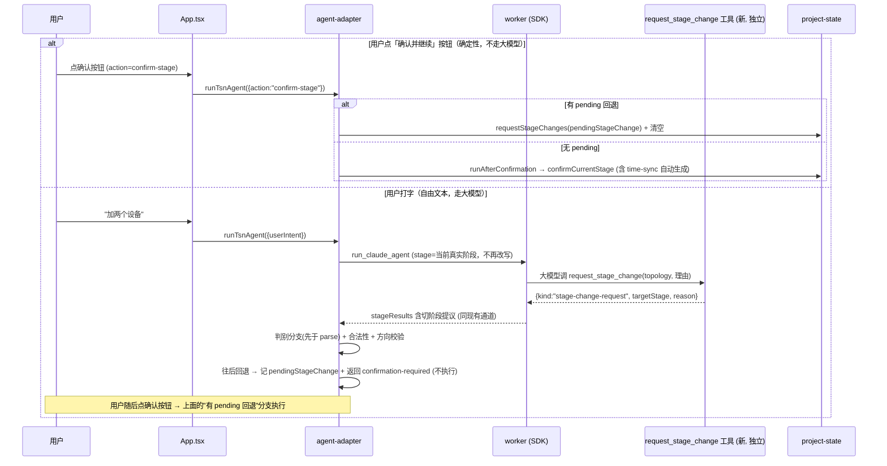

# refactor: stage 切换意图判断改用大模型 + 独立切阶段工具

## Summary

把 stage 切换的意图判断从正则关键词改为大模型判断 + 工具驱动。新增一个**独立于四个阶段**的「请求切阶段」工具（SDK in-process 自定义工具）暴露给大模型。大模型读懂用户意图后调用该工具，工具调用经现有 stageResults 回传通道传回应用层，应用层**校验合法性后执行**（复用 `requestStageChanges` / `confirmCurrentStage`）。删除现有所有正则意图判断（`hasTopologyChangeIntent` / `isBoundaryProgressionIntent` / `isSimulationExecutionIntent`）。「确认并继续」按钮保留**确定性推进**（不经大模型，boss 决策）；只有用户打字的自由文本才走大模型判断。往后回退（会重置后续阶段）先确认后执行；往前推进只走确认按钮，大模型不能用该工具前进。

---

## Problem Frame

当前 stage 切换的意图判断依赖正则关键词匹配（`src/agent/agent-adapter.ts:621` 的 `hasTopologyChangeIntent` 只匹配 `交换机|端系统|终端|网卡|拓扑|switch|topology`，`isBoundaryProgressionIntent` 靠固定确认词表）。用户说「加两个设备」这类自然表达不含关键词 → 匹配不到 → 跨阶段修改请求被当成当前阶段输入处理，答非所问（see origin）。

这是 boss 明确担心的脆弱点：用关键词猜意图不可靠。

---

## 文档审查决议（2026-06-16）

ce-doc-review 四审查员（coherence / feasibility / scope-guardian / adversarial）查出原计划若干会导致 bug 的实施缺口，已逐条核对源码确认属实，并据此修订本计划：

1. **删正则会切断"非拓扑阶段把输入交给大模型"的唯一通路**（feasibility，已核对）。源码事实：`runLocalBoundaryProgression`（agent-adapter.ts:236）对 time-sync/灰阶段**提前返回、根本不调大模型**；唯一把非拓扑输入路由给大模型的就是 `hasTopologyChangeIntent` 正则——它命中时把 `effectiveWorkflow` 改写成 topology 再调大模型（:109-114），且发给 worker 的 `stageRunnerInput.stage` 也变成 `topology`。而 worker 的 `extractTopologyWorkflowStageResults` 在 `stage !== "topology"` 时**硬返回 `[]`**（claude-agent-worker.mjs:1162）。所以新「切阶段」工具的提取**绝不能沿用拓扑提取的 stage 门槛**，否则在最需要它的阶段直接失灵。→ 见 U2。
2. **「切阶段信号」不是可信凭证**（adversarial）。拓扑的 mutationId 来自 sidecar 数据库响应、大模型无法伪造（claude-agent-worker.mjs:1268-1289）；而「切阶段」工具的 targetStage 是大模型自己填的参数，原样回声。所以**安全全靠应用层校验**，不能把它描述成「与 mutationId 同款信任边界」误导实施者。→ 见 KTD2、U3。
3. **stageResults 通道会把非拓扑结果直接拒掉**（feasibility + scope-guardian）。`applyStageResults`（:429-431）对 `stage !== "topology"` 立即 reject；`parseWorkflowStageResult` 对非拓扑 stage 直接抛错（workflow-stage-result.ts:84-87），且有严格 schemaVersion。切阶段信号必须做成**独立形状**，在 `parseWorkflowStageResult` **之前**用判别分支识别。→ 见 U3。
4. **同轮同时出现拓扑结果 + 切阶段请求的顺序现在就要定死**（adversarial）。`applyStageResults` 命中第一个拓扑结果就 `return`（:463-469），丢弃其余。规则：**先记录拓扑结果、再处理切阶段请求**，不留到实施期临场拍。→ 见 U3。
5. **切到「暂下线」阶段是死胡同**（feasibility）。flow-template / planning-export 当前暂下线（parseWorkflowStageResult 对 flow-template 抛错）。切阶段的合法目标**只允许有真实处理的阶段（topology、time-sync）**。→ 见 U3。
6. **确认按钮卡死风险 + 正向推进无安全网**（adversarial + feasibility）。今天「确认并继续」按钮发 `submitIntent("继续")`，靠正则确定性推进；删正则后会变成走大模型，大模型可能只回话不触发→卡住。**boss 决策：按钮保留确定性推进（不经大模型），只有打字才走大模型。** 同时，正向推进只走按钮、大模型不能用切阶段工具前进——这一并消除了"大模型把含糊话误判成确认而擅自前进"的风险。→ 见 KTD3、KTD4、U4。
7. **灰阶段下线提示 / time-sync 自动生成的保留方式**（coherence + scope-guardian + adversarial）。这两个「阶段处理」今天混在 `runLocalBoundaryProgression` 里、由正则反推触发。改后由**确认按钮的确定性推进路径**（`runAfterConfirmation`，它在进入 time-sync 时已调 `runTimeSyncStage`、进入灰阶段时已内联下线提示）承载；输入侧的 `createStageOfflineResult` / `createSimulationUnsupportedResult` 随正则一并删除（仿真未支持改由现有 prompt + `sanitizeClaudeAssistantText` 输出兜底）。→ 见 KTD4、U4。
8. **SDK in-process 工具已确认可用**（feasibility）。`@anthropic-ai/claude-agent-sdk` 0.3.145 导出 `createSdkMcpServer()` + `tool()`，U1 直接用 in-process 形态，省去再 spawn 一个进程。→ 见 KTD1、U1。
9. **Grounding 行号修正**（coherence）：`runTsnAgent` 在 :60（非 :149-232，:149 起是 try 块）；`WORKFLOW_STEPS` 定义在 `src/domain/scenario-config.ts:1`（project-state.ts 只是 import）。→ 已在 Grounding 修正。

---

## Key Technical Decisions

### KTD1：「切阶段」能力承载在独立 SDK in-process 工具，独立于四个阶段

boss 决策：这个能力**独立于四个阶段**，不属于拓扑服务。形态**已定为 SDK in-process 自定义工具**（`@anthropic-ai/claude-agent-sdk` 的 `createSdkMcpServer()` + `tool()`，0.3.145 已确认导出），只暴露「请求切阶段」工具，**不连 sidecar DB**（切阶段是 workflow 状态操作，不是拓扑数据操作）。in-process 形态比独立 stdio MCP server 省一个进程，且与既有 stdio 的 `tsn_topology` 解耦。这与 origin ideation 的「编排层独立于 stage」结论一致——是 boss 最初设想的「root 管流转」的正确落地形态（代码层编排，非可写 skill）。

### KTD2：切阶段信号是「大模型可控的提议」，不是可信凭证；安全全在应用层

切阶段信号走与拓扑 stageResults **同一条回传通道**（worker 从工具结果提取 → 随 `claude.stageResults` 回传 → `applyStageResults` 消费），但**性质不同**：targetStage 由大模型在工具参数里填，应用层只是原样收到一个「提议」。所有正确性约束（合法性、破坏性确认）都在应用层代码强制（KTD3），提取层不提供任何防伪。实施措辞不得称其为 trusted-signal。

### KTD3：切换合法性、破坏性确认、重置后续，全部代码硬守

大模型只提议；执行与约束在代码层：
- **合法性校验**：targetStage 必须 ∈ `WORKFLOW_STEPS`，且只允许**有真实处理的阶段**（topology、time-sync）——不允许切到暂下线的 flow-template / planning-export，不允许越界乱跳。
- **方向约束**：切阶段工具只用于**往后回退**（targetStage 索引 ≤ 当前阶段索引）。往前推进只走「确认并继续」按钮（确定性），大模型不能用该工具前进——这消除了正向误判风险。target == 当前阶段 → 视为无操作。
- **破坏性回退确认**：回退会让 `requestStageChanges` 把后续阶段重置为 locked、清空确认。应用层不立即执行，而是把 `pendingStageChange = targetStage` 记到 workflow 上、返回 confirmation-required 事件（「切回 X 会让后续阶段重做，确认吗」）。用户点「确认并继续」按钮时执行 pending 回退并清空。**复用同一个确认按钮**：按钮含义是「执行待确认动作」——有 pending 回退就执行回退，否则就正常推进下一阶段。
- 同轮同时有拓扑结果与切阶段请求时：**先记录拓扑结果、再处理切阶段请求**（见 U3）。

### KTD4：删正则，确定性「阶段处理」改由确认按钮路径承载

`runLocalBoundaryProgression`（agent-adapter.ts:236）里混了**意图判断**（确认推进、拓扑回退、仿真拦截——全删）和**阶段处理**（time-sync 进入自动生成、灰阶段进入下线提示——保留）。改法：
- **删**：`hasTopologyChangeIntent`、`isBoundaryProgressionIntent`、`isSimulationExecutionIntent`（:608-623）三个正则函数；`runLocalBoundaryProgression` 的自由文本意图分支；灰阶段拓扑回退改写（:109-114）；输入侧 `createSimulationUnsupportedResult` / `createStageOfflineResult`（随分支删除变死代码）。
- **保留并改由确认按钮触发**：`runAfterConfirmation`（:263）——它在确认推进进入 time-sync 时已调 `runTimeSyncStage`（自动生成摘要）、进入灰阶段时已内联下线提示。time-sync 自动生成与灰阶段下线提示都在这条确定性路径上，不会丢。
- **仿真未支持**：输入侧拦截删除后，由现有 system prompt（claude-agent-worker.mjs:388「没有接入仿真 runner」）+ 输出侧 `sanitizeClaudeAssistantText`（:633 `isUnsupportedSimulationClaim`）兜底（二者已存在）。代价是仿真请求会多走一轮大模型——与 boss 接受的「所有输入走大模型」一致。

---

## High-Level Technical Design

切阶段信号流（新）：

对比现状：现在是 `agent-adapter` 用正则在调大模型**之前**拦截判断意图；改后变成大模型判断意图、通过工具产提议、代码在大模型返回**之后**消费并校验后执行；确认推进与回退执行都由确定性按钮触发。

---

## Implementation Units

### U1. 新建独立「请求切阶段」SDK in-process 工具

**Goal**：提供一个独立于四阶段的工具，让大模型表达「想回到哪个阶段修改」。

**Requirements**：KTD1、KTD2。

**Dependencies**：无。

**Files**：
- `src-node/claude-agent-worker.mjs` —— 用 `createSdkMcpServer()` + `tool()` 定义 `request_stage_change` 工具（参数 `{ targetStage: string, reason?: string }`），工具 handler 返回结构化提议 `{ kind: "stage-change-request", targetStage, reason }`（作为 tool_result content）。**不连 sidecar、不写任何状态、不做合法性判断**（合法性在 U3）。
- 对应 `.test`（worker 或新建 mcp 测试文件，遵循现有 worker 测试组织）。

**Approach**：in-process 工具，注册方式区别于现有 stdio 的 `tsn_topology`（后者用 `command`/`args`，in-process 用携带 live instance 的 `McpSdkServerConfigWithInstance`）。工具命名需确认实际 SDK 工具名形态（`mcp__<server>__<tool>` 前缀），供 U2 提取匹配。

**Test scenarios**：
- 调 `request_stage_change` 的 handler 返回含 `kind:"stage-change-request"` + targetStage + reason 的结构化结果（happy path）。
- targetStage 为任意字符串都原样返回（合法性不在这层；边界）。
- 工具 handler 不触发任何 sidecar HTTP / 文件写（隔离验证：独立于拓扑 DB 与状态）。

**Verification**：大模型能在对话中调用该工具并拿到结构化返回。

### U2. worker 注册新工具 + 全阶段提取切阶段提议

**Goal**：worker 把新工具纳入白名单（**所有阶段**），并从其 tool_result 提取切阶段提议，随 stageResults 回传——**不沿用拓扑提取的 `stage==="topology"` 门槛**。

**Requirements**：KTD2、审查决议 1。

**Dependencies**：U1。

**Files**：
- `src-node/claude-agent-worker.mjs` —— `buildAllowedToolsForStage`（:375）加入新工具名（该函数本就不按 stage 区分，新工具在所有阶段可用）；`sdkOptions.mcpServers`（:127）合并 in-process server；新增 `extractStageChangeRequests(message, toolUseNamesById)` 提取函数（**不接 stageRunnerInput.stage 门槛**，仿 `extractTopologyWorkflowStageResults`:1161 的 tool_result 遍历但去掉 stage 限制）；新增 `captureStageChangeRequests` 并入 `handleSdkMessage` 的各 message 分支（仿 `captureTopologyStageResults`:230），push 到同一 `capturedStageResults`。
- 对应 `.test`。

**Approach**：提取只认 `request_stage_change` 工具的 tool_result（用 `toolUseNamesById` 映射工具名，与 mutationId 提取同款边界——大模型在自然语言里写「切到拓扑」但没调工具则不产生提议）。注意这只保证「提议来自工具调用」，不保证 targetStage 可信（KTD2）。

**Test scenarios**：
- 新工具在 `buildAllowedToolsForStage` 返回的白名单内（happy path）。
- `request_stage_change` 的 tool_result 被提取为切阶段提议——**当 `stageRunnerInput.stage` 是 time-sync / flow-template 等非拓扑阶段时也能提取**（回归审查决议 1，关键断言）。
- 大模型自然语言里写「切到拓扑」但没调工具 → 不产生切阶段提议（边界）。
- 非 `request_stage_change` 的工具结果不被误提取（边界）。

**Verification**：大模型在非拓扑阶段调切阶段工具后，`claude.stageResults` 里出现切阶段提议。

### U3. 应用层消费切阶段提议 + 合法性/方向校验 + 破坏性确认（pending）

**Goal**：`applyStageResults` 在 parse 之前识别切阶段提议，校验合法性与方向，往后回退记 pending 并返回待确认。

**Requirements**：KTD2、KTD3、审查决议 2/3/4/5。

**Dependencies**：U2。

**Files**：
- `src/agent/agent-adapter.ts` —— `applyStageResults`（:411）开头先把 `input.stageResults` 分流：判别 `kind === "stage-change-request"` 的为切阶段提议（**在 `parseWorkflowStageResult` 之前**，避免被 :429 / parse 拒掉）；其余按现有拓扑路径处理。规则：**先处理拓扑结果（记录 mutation），再处理切阶段提议**（不再命中拓扑就无条件 return；改为继续处理切阶段提议）。新增切阶段提议处理：合法性（target ∈ {topology, time-sync}）+ 方向（target 索引 ≤ 当前索引；target==当前→无操作；target>当前→拒绝）；往后回退 → 在返回的 workflow 上记 `pendingStageChange = target`、产 confirmation-required 事件，**不立即执行** `requestStageChanges`。
- `src/project/project-state.ts` —— `WorkflowState` 增加可选字段 `pendingStageChange?: WorkflowStep`；`normalizeWorkflowState` 透传该字段；可加纯函数 `isLegalStageSwitchTarget(target, current)`。
- `src/agent/agent-adapter.ts` `runTsnAgent` —— 接受 `request.action === "confirm-stage"`：若 `workflow.pendingStageChange` 存在 → `requestStageChanges(pending)` 并清空 pending（确定性，不调大模型）；否则若状态 waiting_confirmation → `runAfterConfirmation`。
- `src/agent/agent-types.ts` —— `TsnAgentRequest` 增加可选 `action?: "confirm-stage"`。
- 对应 `.test`。

**Approach**：合法性 = `WORKFLOW_STEPS.indexOf(target) >= 0 && target ∈ {topology, time-sync}`。方向 = `indexOf(target) <= indexOf(current)`。破坏性 = `indexOf(target) < indexOf(current)`（回退）。确认复用同一「确认并继续」按钮（U4 接线）：按钮触发的 confirm-stage 动作优先消费 pendingStageChange。

**Test scenarios**：
- 切阶段提议 target=topology、当前 flow-template → 合法回退 → 返回 workflow 带 `pendingStageChange=topology` + confirmation-required，**不立即重置后续**（happy path / 破坏性）。
- 随后 `runTsnAgent({action:"confirm-stage"})` 且 pendingStageChange 存在 → `requestStageChanges(topology)`，后续阶段重置 locked、pending 清空（integration）。
- 无 pending 时 `runTsnAgent({action:"confirm-stage"})` 且 waiting_confirmation → `runAfterConfirmation`（推进，含进入 time-sync 自动生成）（happy path / 推进）。
- target 非法（不在 WORKFLOW_STEPS，或是 flow-template/planning-export 暂下线阶段）→ 拒绝、保持原状态、产 reject 事件（error path / 审查决议 5）。
- target > 当前（试图用工具前进）→ 拒绝（方向约束）。
- 同轮既有拓扑结果（current=topology）又有切阶段提议 → 先记录拓扑、再处理提议，终态确定（integration / 审查决议 4）。
- 切阶段提议形状不被 `parseWorkflowStageResult` 拒掉（回归审查决议 3：判别分支在 parse 之前）。

**Verification**：用户在灰阶段说「加两个设备」→ 大模型调 request_stage_change(topology) → 返回待确认（带 pending）→ 用户点确认 → 正确回退到拓扑并重置后续。

### U4. 删除 agent-adapter 正则意图判断 + 确认按钮接线

**Goal**：移除所有正则意图判断，确认按钮走确定性 action，自由文本全走大模型。

**Requirements**：KTD4、审查决议 6/7。

**Dependencies**：U3（先有新通路与 action 处理，再删旧正则，避免中间态无法切阶段/确认）。

**Files**：
- `src/agent/agent-adapter.ts` —— 删除 `hasTopologyChangeIntent`、`isBoundaryProgressionIntent`、`isSimulationExecutionIntent`（:608-623）；删除 `runLocalBoundaryProgression` 的自由文本意图分支（保留确认 action 与 `runAfterConfirmation`，已在 U3 重构进 `runTsnAgent` 的 action 处理）；删除灰阶段拓扑回退改写（:109-114，`effectiveWorkflow` 直接用 `workflow`，发给 worker 的 stage 用真实当前阶段）；删除输入侧 `createSimulationUnsupportedResult`、`createStageOfflineResult`（变死代码）。
- `src/app/App.tsx` —— `onConfirm`（:418）从 `submitIntent("继续")` 改为携带 `action:"confirm-stage"` 的确定性确认调用（不发自由文本「继续」）。需要一个轻量确认提交路径（复用 submitIntent 的会话保存逻辑，但走 `runTsnAgent({action:"confirm-stage", ...})`，不显示一条「继续」用户消息或显示一条更合适的系统提示——实施时定）。
- 对应 `.test`（删针对正则的测试，新增/调整 action 推进 + 阶段处理保留的测试）。

**Test scenarios**：
- 点确认按钮（confirm-stage）在 topology waiting_confirmation → 推进进入 time-sync 且**自动生成摘要**（回归：阶段处理没丢）。
- 点确认按钮推进进入灰阶段 → 仍显示下线提示（回归：阶段处理没丢）。
- 用户打字「确认」→ 不再被正则识别，走大模型路径（行为变更验证）。
- 灰阶段下用户打字自由文本 → 走大模型（不再有输入侧 offline 短路）。
- 删除后所有自由文本输入都进入大模型路径，确认动作走确定性 action（happy path）。

**Verification**：删除正则后，确认按钮推进可靠、time-sync 自动生成与灰阶段提示不变；意图判断全部经大模型；按钮不卡。

### U5. system prompt 加切阶段工具使用规则

**Goal**：告诉大模型固定阶段顺序、切阶段工具只用于回退、前进由用户点确认。

**Requirements**：KTD3、KTD4。

**Dependencies**：U1。

**Files**：
- `src-node/claude-agent-worker.mjs` —— `SYSTEM_PROMPT_SKELETON`（:388）补规则文字：用户想回到拓扑/时间同步修改时调 `request_stage_change(目标阶段, 理由)`；前进到下一阶段由用户点「确认并继续」，你不要用该工具前进；回退会让后续阶段重做。**与既有「拓扑确认后必须进入时间同步」「固定阶段顺序」措辞统一**（明确：前进=确认按钮，回退=工具）避免矛盾指引。保持字符串拼接（origin 注意：string[] 会崩 redactSecrets）。规则放代码骨架（不可编辑），不放 SKILL.md。

**Approach**：规则是指引而非约束执行——执行正确性由 U3 代码校验保证。

**Test scenarios**：纯 prompt 文字，行为正确性由 U3 代码校验测试覆盖；加一条「骨架字符串包含切阶段规则关键句」的存在性断言防回归。

**Verification**：大模型在合适时机调用切阶段工具的准确率（人工/真机观察，非单测）。

---

## Scope Boundaries

### 不做（本次）
- 不改各阶段内部处理逻辑——time-sync 仍自动生成摘要、灰阶段仍提示。
- 不做「每阶段验证 gate」（独立、更大的话题，见 `docs/ideation/2026-06-16-skill-stage-verification-ideation.html`）。
- 不让大模型用切阶段工具往前推进（前进只走确认按钮）。

### Deferred to Follow-Up Work
- flow-template / planning-export 上线后，是否允许切到这两个阶段（当前作为合法目标排除）。
- 大模型切阶段判断准确率的真机调优（prompt 措辞迭代）。

---

## Open Questions（留实施期验证）

- `request_stage_change` in-process 工具的实际 SDK 工具名形态（`mcp__<server>__<tool>` 前缀的确切字符串），决定 U2 提取的工具名匹配字面值——U1 落地后即可确认。
- App.tsx 确认按钮的确定性提交路径细节：是否在聊天里显示一条用户消息、pending 回退确认的文案——U4 实施时定（不影响状态正确性）。

---

## Risks & Dependencies

- **回归风险（最高）**：删 `runLocalBoundaryProgression` 时误删阶段处理触发 → time-sync 变空、灰阶段提示丢失。缓解：阶段处理已收口到确认按钮的 `runAfterConfirmation` 路径，U4 回归测试覆盖「确认推进进入 time-sync 自动生成」「进入灰阶段下线提示」。
- **顺序依赖**：U4（删旧）必须在 U3（建新通路 + action 处理）之后，避免中间态无法切阶段/确认。
- **性能/成本**：所有自由文本输入（含打字确认）走大模型，延迟+成本增加（boss 已接受）；确认按钮走确定性路径不增成本。
- **误判**：大模型判断错由 U3 代码安全网兜底（合法性 + 方向约束 + 破坏性确认）；正向推进只走按钮，无大模型正向误判面。

---

## Grounding（关键文件，行号已核对）

- `src/agent/agent-adapter.ts` —— `runTsnAgent`（:60）、本地边界路由 `runLocalBoundaryProgression`（:236）、灰阶段拓扑回退改写（:109-114）、`runAfterConfirmation`（:263）、`runTimeSyncStage`（:302）、`createSimulationUnsupportedResult`（:344）、`createStageOfflineResult`（:363）、`applyStageResults`（:411，:429 非拓扑 reject、:463 命中即 return）、意图正则（:608-623）、`sanitizeClaudeAssistantText`（:633）。
- `src/project/project-state.ts` —— `confirmCurrentStage`（:135）、`requestStageChanges`（:179，回退重置后续为 locked）、`getNextWorkflowStep`（:225）、`normalizeWorkflowState`（:59）。
- `src/domain/scenario-config.ts` —— `WORKFLOW_STEPS`（:1）。
- `src/agent/workflow-stage-result.ts` —— `parseWorkflowStageResult`（:74，:84-87 非拓扑/flow-template 抛错，严格 schemaVersion）、类型定义。
- `src-node/claude-agent-worker.mjs` —— `buildAllowedToolsForStage`（:375）、`sdkOptions`/`mcpServers`（:111-140）、`captureTopologyStageResults`（:230）、`extractTopologyWorkflowStageResults`（:1161，:1162 stage 门槛）、`extractTrustedTopologyMutation`（:1271）、`SYSTEM_PROMPT_SKELETON`（:388）。
- `src/app/App.tsx` —— 确认按钮 `onConfirm`（:418）、`submitIntent`（:108）；`src/app/components/chat-pane/index.tsx`（:117「确认并继续」按钮）。
- origin：`docs/brainstorms/2026-06-16-llm-stage-switch-intent-requirements.md`；ideation：`docs/ideation/2026-06-16-skill-stage-verification-ideation.html`。
