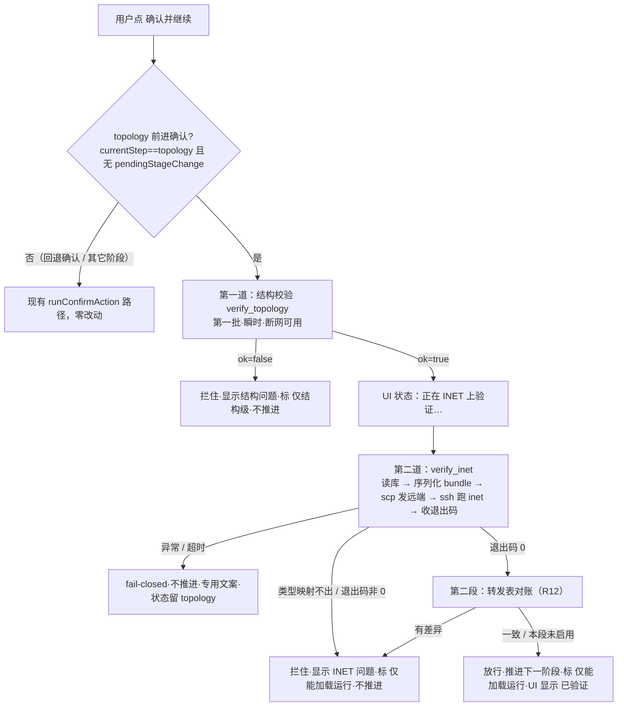

# feat: 拓扑阶段接远端 INET 真验（第二批，接 boss 的远端 INET 主机）

> 给 boss 的一句话：第一批的「确认并继续」只在本机查了拓扑结构对不对；这一批在它后面**紧接着**把你的拓扑发到你那台远端机器上、用 INET 真跑一遍——能跑起来才放行进下一步。结构校验过 → 自动连远端 INET 验证（对话框显示「正在 INET 上验证…」）→ 跑得起来标「仅能加载运行」、放行；跑不起来就拦住、说哪里不对。再往后做一步「把 INET 自己算的转发路径跟我们算的逐条对一遍」。远端跑要联网、有几秒到几十秒耗时；断网时第一批结构校验仍然即时可用。

---

> **⚠️ 范围调整（2026-06-18，boss 决定）**：INET 验证在拓扑阶段只能做「加载冒烟」、增量小，还拖慢确认要联网；INET 的真价值是**有流量后的仿真**（时延/调度），属**流量规划阶段**。故 INET 验证从拓扑阶段过关闸**撤出**，挪到流量规划阶段（那个阶段重建时再接）。
> - **拓扑阶段**：只保留第一批的**本地结构校验闸**（连通/端口/孤立/可达，瞬时、断网可用）；INET 那道闸的前端接入（U4 串接 + U5「验证中」状态 + chat-pane inetVerifying）**已撤回**，相关测试同步删/改。
> - **INET 能力代码**（U1 `inet_bundle` 序列化 / U2 `inet_remote` 远端执行器 / U3 `verify_inet` 命令，及真机验过的链路、`MacForwardingTableConfigurator` 对账路径）**原样保留**，作为流量规划阶段的现成基础。
> - 下文按"接拓扑阶段"写的部分（尤其 U4/U5 及 HTD 串行闸图）作为历史决策保留，**落地以本 note 为准**。

---

## Summary

第一批在离开拓扑阶段前插了一道**本地结构校验**过关闸（`verify_topology` 命令，瞬时、断网可用）。本批在它**之后串第二道闸**：结构校验通过后，应用本体（Rust 侧）把库内拓扑序列化成一个 INET 能读的 **inet-bundle**（`network.ned` + `omnetpp.ini` + `manifest.json`），通过系统 `ssh`/`scp` 发到远端 INET 主机、跑 `inet -u Cmdenv -f omnetpp.ini -n .`、按退出码判定「能否加载运行」，结论标 `loadability_only` 口径。两道闸都过才推进；远端验证有耗时，全程在对话框显示「验证中 / 已验证 / 未通过」状态。第二段再做转发表对账：让 INET 自己生成转发表，与我方从库行 BFS 算的逐条 diff，差异定位到「交换机 × 目的」的出端口。执行全部在 Rust 侧、shell 出系统 `ssh`/`scp`（复用既有 `commands.rs` 的结构化 argv / 超时 / 进程组杀 / 脱敏纪律），**不引入新依赖**；远端登录走**免密**，应用不存密码。

---

## Problem Frame

**现状**：第一批结构校验只能保证「图论上结构完整、转发可达」，无法保证这套拓扑能被真正的 INET/OMNeT++ 仿真器加载运行——节点类型映射、NED 语法、端口连接、INET 版本兼容等问题，只有真跑一遍才暴露。

**本批解决**：把库内拓扑序列化成 INET bundle、发到远端真跑一遍加载冒烟，作为离开拓扑阶段的第二道过关闸（串在结构校验之后）；并把 INET 自算的转发表与我方算的对账，抓出两边不一致的转发出端口。结论如实标 `仅能加载运行` 口径——能加载运行 ≠ 时延/调度已保证。

**为什么执行放在 Rust 侧、不交给大模型 worker**：worker 被系统提示词明确告知「没有接入仿真 runner」；验证通过与否是确定性工程判断、必须可复现可硬守，沿用既有信任纪律——sidecar/命令读库算结论、走既有可信信号通道，**不重建「让大模型回传结构化结果」的协议**（这是 05-21-001 被删的根因，see origin: R4）。

---

## Requirements（追溯到 origin）

- **R9** 序列化 inet-bundle：库内拓扑 → `tsnagent/generated/network.ned`（package `tsnagent.generated`，`TsnSwitch`/`TsnDevice`/`EthernetLink`/`ethg++` 连接）+ `omnetpp.ini`（最小可加载）+ `manifest.json`（schema `tsn-agent.export-manifest.v0`）。验证与未来导出共用同一布局。
- **R10** 节点类型→INET 模块映射：交换机→`TsnSwitch`、端系统→`TsnDevice`；命名 `sw{N}`/`es{sw}_{n}`（从库内 `sync_name` + `node_type` + 连线归属推导）。映射不出来→`unmappable_node_type`，在发 INET 前就报、不产坏 NED。
- **R11** 远端加载 smoke：发到远端 INET 主机跑 `inet -u Cmdenv -f omnetpp.ini -n .`，以退出码判定「能否加载运行」；口径标 `loadability_only`。
- **R12** 转发表对账：INET 自生成转发表 vs 我方 BFS 逐条 diff（terraform-plan 式），不一致处定位到「交换机 × 目的」的出端口。
- **R13** 阶段无关通道：远端验证通道不绑拓扑阶段，后续 time-sync/flow 阶段可复用同一「序列化 + 发送 + 跑 + 回收」管线。
- **通用 R1-R4/R7/R8**（第一批已立、本批延续）：过关闸触发不过则拦（R1）；口径标签（R2，本批 `loadability_only`）；一句中文结论 + 问题清单（R3）；走既有可信信号、不重建大模型回传协议（R4）；算不出/跑不起来判不过关（R7 风格）。

验收覆盖 origin 的 **AE6（INET 能加载）/ AE7（转发对账出差异）/ AE8（类型映射缺失先报）**。

---

## Key Technical Decisions

### KTD1：执行放 Rust 侧、shell 出系统 `ssh`/`scp`，不引入新依赖
远端验证（序列化 → 发送 → 跑 → 回收）做成 Rust 侧能力，**不走 Node worker**：worker 被系统提示词硬性告知「无 runner、不能声称已 SSH 执行」（`src-node/claude-agent-worker.mjs`），且验证是确定性的、不经大模型。Rust 侧原生读库（`store.pool`，与 `verify_topology` 同款），用 `std::process::Command` shell 出**系统** `ssh`/`scp` 二进制（不加 `ssh2`/`openssh`/`russh` 等 crate；`reqwest` 当前无 TLS feature，亦不依赖它做传输）。复用 `commands.rs::run_claude_agent_blocking` 已验证的纪律：结构化 argv（绝不拼 shell 串）、二进制绝对路径探测（GUI 不继承 PATH，像 `resolve_node_command` 那样找 `ssh`/`scp`）、`#[cfg(unix)] process_group(0)` + `libc::kill(-pgid, SIGKILL)` / `#[cfg(windows)] taskkill /F /T /PID`、超时轮询、行读取线程、输出脱敏。**好处**：DB 原生读、复用进程纪律零新基建、保持 trusted-signal 单源、避开「worker 跑 dist 产物需 build:worker」陷阱。

### KTD2：inet-bundle 从库行直接序列化，不复用 `build_artifacts` / `build_legacy_*`
现有 `topology_compute.rs::build_topology_artifacts` / `build_legacy_mac_forwarding_table` 吃的是**请求体里的内存 `IntermediateTopology`**（带结构化 `ports[]`/`port.index`），且为私有函数、不读库。库行没有结构化 `ports[]`，但 `styles_json` 的 `leftLabel`/`rightLabel` 带**每端端口标签**（持久化时从 `port_id` 写入，第一批 `link_ports_paired` 已在读）——足够派生连接。因此本批从库行**自建**序列化所需的中间表示（与第一批 `topology_verify.rs` 从库行自建邻接同思路），不强行复用那套内存格式函数。`ethg++` 门由 U1 在发出连接时**统一按发出顺序分配**（成为门号的唯一真源，供 R12 对账，见 KTD7）；节点命名用**纯数字全局序号**（`sw{N}` / `es{N}`），**不依赖端系统挂哪个/几个交换机**——多挂（双平面）端系统照常唯一命名、不判 unmappable（boss 已定本批支持双平面）。

### KTD3：两级串行过关闸——结构（瞬时）过了才跑 INET（远端·耗时），都过才放行
拓扑阶段「确认并继续」的前进确认（`action==="confirm-stage" && currentStep==="topology" && !pendingStageChange`）下：先跑第一批结构校验（瞬时）；`ok=false` 拦在结构级、不进 INET。结构 `ok=true` → **紧接着**跑 INET 验证（远端、异步、耗时）→ 退出码 0 标 `loadability_only` 放行；失败则拦在 INET 级。回退确认（`pendingStageChange`）/ 非 topology 阶段**完全不触发**，行为零回归（延续第一批 KTD3）。INET 验证是异步耗时步骤，必须把「验证中」状态推给 UI（见 KTD5、U4/U5）。`verify_inet` 调用异常/超时**在确认分支内 try/catch、fail-closed**：不推进、`currentStep` 留 topology、专用文案，不冒泡到 `App.tsx` 通用 catch。

### KTD4：可复用的是远端**传输层**（R13），verify_inet 命令本身是 topology 专用
真正阶段无关、可被后续阶段复用的是 `inet_remote` **传输层**（发送 + 跑 + 回收 + 脱敏 + 注入防护），它不含任何阶段语义。`verify_inet(sessionId)` 命令本身**是 topology 专用**——它读 `topology_nodes`/`topology_links`、产 topology bundle、标 `loadability_only`；后续 time-sync/flow 阶段会有各自的命令（如 `verify_time_sync`），各自序列化各自的 INET 内容，**复用同一 `inet_remote` 传输层**，而非复用 `verify_inet`。R13「阶段无关通道」即指这层传输管线（这也是 `inet_remote` 单独成模块的理由——它有明确的跨阶段复用面，非投机抽象）。

### KTD5：口径 `loadability_only`，结论形状复用第一批
退出码 0 只代表「NED/INI 能加载并跑到 `sim-time-limit`」，**不代表**时延/调度/gPTP/TAS。复用第一批 `VerifyResult{ok, caliber, errors}` 形状与前端 `verification` 回显字段（`caliberLabel` 已有「仅能加载运行」映射）；新增 `CALIBER_LOADABILITY_ONLY` 常量，**与第一批 `CALIBER_STRUCTURAL_ONLY` 并列放在 `topology_verify.rs`**（口径常量集中一处）。`caliber` 当前是 `&'static str`（每次返回一个固定常量），INET 命令返回该常量即可，无需把字段改成动态枚举。「绿」永远带 `仅能加载运行` 标签出现，杜绝「跑通=时延有保证」误读。

### KTD6：免密登录，应用不存密码；每次 run 独立远端临时目录、跑完清理
远端登录靠主机侧 `ssh-agent`/`known_hosts`（开发阶段经 Tailscale `100.104.38.106` 用户 zhang），**SSH 密钥内容永不进应用配置**；应用只存：主机地址、远端基目录、`inet` 启动器路径。本期主机固定一台、配置集中在一处常量/简单设置（多主机管理、UI 配置项 deferred；boss 说将来可能改本机，故配置点要可换但本期不做 UI）。每次验证用一个独立远端临时目录（避免并发/残留串味），跑完 best-effort 清理。所有 host/路径/远端输出经既有脱敏路径处理后才入日志/界面。

### KTD7（R12）：对账先比「下一跳邻居」，出端口号以 U1 门分配为唯一真源
第一批 `topology_verify.rs` 只算「可达性」、没算出端口。R12 的「我方 FDB」在**库行上自算每交换机×目的的首跳**——但**出端口号不另起一套**：INET 的 `ethg++` 门按 NED 连线顺序编号，与我方任意标签体系不同，硬比会冒假差异、把好拓扑误拦。故对账**先比下一跳是哪个邻居节点（`sync_name`）**，再用 **U1 序列化时的门分配（唯一真源，见 KTD2）**把邻居换算成门号去对 INET——杜绝纯编号差异的假阳性。**防漂移**：我方首跳逻辑与第一批可达逻辑共享测试 fixture、断言可达性一致（沿用第一批 KTD2 纪律；注意第一批无出端口输出可对照，故出端口对账靠 U1 门分配这一真源，而非靠跨 BFS 对照）。INET **怎么导出它自算的转发表**是执行期未知数（origin 亦留作执行期定），列入 Open Questions、先给候选（见 U6）。

### KTD8：库内可控值进 NED/ini/远端命令前必须校验/转义（注入防护）
库内值（`styles_json.speed`、节点 `name`/`sync_name`、远端临时目录名）是用户/agent 可控的，**绝不原样拼**进 NED/ini 文本或远端命令串：
- **链路速率**：`styles_json.speed` 必须解析为正有限数值且在合理范围（如 1–100000 Mbps），否则回退契约默认或报 `invalid_link_speed`，绝不把原始串拼进 `datarate=`。
- **NED 标识符**：节点模块名只用安全字符（`^[a-zA-Z][a-zA-Z0-9_]*$`）；本批用 `sw{N}`/`es{N}` 的**纯数字全局序号**派生（不混入 `sync_name`/`name` 原文），从源头杜绝标识符注入；命名产出非法标识符 → `unmappable_node_type`、不产 NED。
- **远端目录名**：只许 `[a-zA-Z0-9_-]`、用随机源（uuid/getrandom，**不用时钟**避免碰撞）生成；传给 `ssh`/`scp` 的路径走 argv 或单引号 quote、**不嵌进命令串**；`rm -rf` 目标用正则约束（形如 `<基目录>/run-<hex>`），杜绝删错目录。

---

## High-Level Technical Design

两级串行过关闸控制流（仅 topology 阶段前进确认）：



> Phase 1（未含 U6 对账）时，F 的退出码 0 **直接到 J、不经 I**；I 仅在 Phase 2（U6）落地后接入。

远端执行数据流（传输层可复用，KTD4）：

```
库内拓扑(topology_nodes/links, sync_name 键)
   → [U1] 序列化：自建中间表示 → network.ned + omnetpp.ini + manifest.json（本地临时目录）
   → [U2] scp 发到远端独立临时目录 → ssh 'cd <dir> && ~/.local/bin/inet -u Cmdenv -f omnetpp.ini -n .'
   → 收 退出码 + stdout/stderr（+ 第二段：INET 自生成 FDB）
   → best-effort 清理远端临时目录
   → [U3] 判定 → VerifyResult{ok, caliber:"loadability_only", errors[]}
   → [U6] （第二段）我方库行自算 FDB ⟷ INET FDB 逐条 diff → 差异并入 errors
```

口径/结论形状（与第一批共用）：`{ ok, caliber, errors:[{code, message_zh, ref}] }`，本批 `caliber = "loadability_only"`。

---

## Output Structure

inet-bundle 布局（本批生成的本地临时产物，schema 与未来导出共用）：

```
<本地临时目录>/
├── tsnagent/
│   └── generated/
│       └── network.ned        # package tsnagent.generated; TsnAgentNetwork extends TsnNetworkBase
├── omnetpp.ini                # network=tsnagent.generated.TsnAgentNetwork; sim-time-limit; cmdenv-interactive=false; cmdenv-express-mode=true; *.eth[*].bitrate=default(...)
└── manifest.json              # schema tsn-agent.export-manifest.v0：{schema, sessionId, sourceMutationId, caliber, files[]}
```

新增 Rust 模块（flat-module，注册进 `lib.rs`）：

```
src-tauri/src/
├── inet_bundle.rs        # U1：库行 → bundle 文件内容（纯函数 + #[cfg(test)]）
├── inet_remote.rs        # U2：ssh/scp shell-out（结构化 argv/超时/进程组杀/脱敏/清理）
└── inet_verify_command.rs# U3：verify_inet 编排命令（读库→序列化→远端跑→判定→VerifyResult）；U6 对账并入
```

> 模块切分是 scope 声明，实现期可微调；各单元 `Files:` 为准。

---

## Implementation Units

### Phase 1 — 能在 INET 加载运行（独立可验收 AE6/AE8）

### U1. inet-bundle 序列化核心（Rust 纯函数，新模块）
**Goal**：从库行（节点 `sync_name`/`name`/`node_type`；连线 `src/dst_sync_name`/`styles_json`）生成 `network.ned` + `omnetpp.ini` + `manifest.json` 三个文件内容（字符串），纯函数、可单测、不碰网络。
**Requirements**：R9, R10, R8/R2（caliber 透传给 manifest）。
**Dependencies**：无。
**Files**：`src-tauri/src/inet_bundle.rs`（新建，含 `#[cfg(test)]`）、`src-tauri/src/lib.rs`（加 `mod inet_bundle;`）。
**Approach**：
- 入参 = 节点行与连线行集合（调用方读库传入，便于纯函数单测），外加 `sessionId` 与当前 `mutationId`（写 manifest）。
- **类型映射（R10）**：`switch`→`TsnSwitch`、`endSystem`→`TsnDevice`；`server` 初判→`TsnDevice`（按 `topology_compute` 既有口径，server 是被动终端设备——执行期确认，见 Open Questions）；**`node_type` 为 NULL/未知/无法映射 → 不生成 NED、返回 `unmappable_node_type` 错误**（带节点引用），与第一批 `unknown_node_role` 一致、绝不产坏 NED。
- **命名（R10）**：交换机 `sw{N}`、端系统 `es{N}`，`N` 为**纯数字全局序号**（按 `sync_name`/枚举序）。**不依赖端系统挂哪个/几个交换机**——多挂（双平面）端系统照常唯一命名、不判 unmappable（boss 已定本批支持双平面）。命名只用安全字符、不混入 `name`/`sync_name` 原文（见 KTD8）。
- **NED（取自 `docs/ned-contract.md`，真机证实）**：`package tsnagent.generated;` + 四条 import（`inet.networks.base.TsnNetworkBase` / `inet.node.ethernet.EthernetLink` / `inet.node.tsn.TsnDevice` / `inet.node.tsn.TsnSwitch`）；`network TsnAgentNetwork extends TsnNetworkBase`；交换机/端系统模块声明；连线用 `a.ethg++ <--> EthernetLink { datarate = <speed>Mbps; } <--> b.ethg++`，`<speed>` 取 `styles_json.speed`、**先校验为正有限数值/合理范围再拼**（否则回退契约默认或报 `invalid_link_speed`，见 KTD8）；`ethg++` 门**按连线发出顺序分配**，此顺序即门号唯一真源（R12 对账据此，见 KTD7）。NED `parameters` 段含 `*.eth[*].bitrate = default(<...>Mbps);`（**真机确认：bitrate 在 NED 此处、非 omnetpp.ini**）；`connections` 段用 `allowunconnected`（**真机样例确认**：容忍未连端口、避免 NED 编译失败）。
- **omnetpp.ini（最小可加载，真机已 EXIT=0 验证）**：`network = tsnagent.generated.TsnAgentNetwork`、`sim-time-limit`、`cmdenv-interactive = false`、`cmdenv-express-mode = true`（`*.eth[*].bitrate` 设在 NED `parameters` 段、不在此）。**本批不 include `traffic.ini`、不产业务流**——真机已确认无业务流也能加载跑到 sim-time-limit。
- **manifest.json**：沿用真机样例 v0 字段名 `{ schemaVersion: "tsn-agent.export-manifest.v0", projectId/sessionId, generatedAt, files: [{path, purpose, label}] }`，**新增顶层 `caliber: "loadability_only"` 与 `sourceMutationId`**（v0 为顶层 + files 数组，加顶层字段不破坏既有消费）；`files` 列 `network.ned`（purpose `simulation-inet`）与 `omnetpp.ini`。
- **更新 `docs/ned-contract.md`（本单元必做）**：注明验证 bundle 用精简临时布局（无 `simulation/inet/` 前缀、不含 `traffic.ini`），契约里的导出路径 / `traffic.ini` 只适用将来的导出 skill——消除文档与本批漂移。
**Patterns to follow**：第一批 `topology_verify.rs` 从库行自建邻接、`VerifyError{code, message_zh, ref}` 形状；`docs/ned-contract.md` 的模块名/import/ini key。
**Test scenarios**：
- Covers AE8：含 `node_type` 为 NULL / 未知值的节点 → 返回 `unmappable_node_type`、不产 NED。
- 合法星型/线型拓扑 → 产出三文件；NED 含 package + 四 import + `TsnAgentNetwork extends TsnNetworkBase` + 每节点正确模块类型 + 每连线 `ethg++ <--> EthernetLink{datarate} <-->`。
- 交换机→`TsnSwitch`、端系统→`TsnDevice`、server→`TsnDevice`（或确认后的口径）映射正确。
- 命名：`sw{N}` / `es{N}` 全局序号唯一、稳定（含多交换机骨干）。
- `styles_json.speed` → `EthernetLink{datarate=...}`；缺 speed 走契约默认。
- omnetpp.ini 含 `cmdenv-interactive=false`、`cmdenv-express-mode=true`、`network=tsnagent.generated.TsnAgentNetwork`；NED `parameters` 段含 `*.eth[*].bitrate=default(...)`、`connections` 段含 `allowunconnected`。
- manifest `schemaVersion` 等 v0 字段齐全、新增 `caliber="loadability_only"`、`sourceMutationId` 透传。
- 双平面：端系统同时连两个交换机 → 正常产 NED、模块名唯一、**不**判 unmappable。
- 链路速率非法（非数字 / 负数 / 超大）→ 回退契约默认或 `invalid_link_speed`，原始串不进 `datarate=`。
- 命名（纯数字全局序号）产出的 NED 标识符均合法、不混入 `name`/`sync_name` 原文。
**Verification**：cargo test 覆盖以上；纯函数对给定行集合产出确定文本。

### U2. 远端执行器：`ssh`/`scp` shell-out（新模块，复用 commands.rs 纪律）
**Goal**：把 U1 产物写本地临时目录、`scp` 到远端独立临时目录、`ssh` 跑 `inet -u Cmdenv -f omnetpp.ini -n .`、收退出码与 stdout/stderr、best-effort 清理远端目录；带超时与进程组杀。
**Requirements**：R11（传输+跑+回收）、R13（通道阶段无关）、R4（可信信号纪律）。
**Dependencies**：U1。
**Files**：`src-tauri/src/inet_remote.rs`（新建，含 `#[cfg(test)]`）、`src-tauri/src/lib.rs`（`mod inet_remote;`）。可能在一处集中远端主机配置常量（host/远端基目录/inet 路径）。
**Approach**：
- 复用 `commands.rs::run_claude_agent_blocking` 模式：**结构化 argv**（`scp` 传文件、`ssh` 跑命令，绝不拼 shell 串；远端命令用 `cd <dir> && <inet 路径> -u Cmdenv -f omnetpp.ini -n .` 作为 `ssh` 的单个远端命令参数）；**二进制绝对路径探测**（GUI 不继承 PATH，像 `resolve_node_command` 找本机 `ssh`/`scp`，留 `TSN_AGENT_SSH_PATH` 类覆盖）；**超时轮询**（远端 `opp_env`/nix 首跑可能慢，超时给足，如 60–120s，可配）；**进程组杀**（`#[cfg(unix)] process_group(0)`+`libc::kill(-pgid,SIGKILL)` / `#[cfg(windows)] taskkill /F /T /PID`）；**脱敏**：现有 `redact_secrets` 只挡 `key=值`/token 式密钥、**挡不住裸的主机 IP/用户名**——故 INET 输出入日志/界面前，先把配置的主机地址、用户名、远端基目录前缀**定向替换为占位符**（`[remote-host]`/`[remote-dir]`），再过既有 `redact_error`；**截断在替换之后**做，避免截断点切在敏感串中间。
- 免密（KTD6）：不传密码、不读密钥内容；靠 `ssh-agent`/`known_hosts`。`ssh`/`scp` argv **显式加 `-o StrictHostKeyChecking=yes -o BatchMode=yes`**（防 MITM + 防非交互进程被密码提示挂起）；主机指纹未登记时回明确「无法连接远端 INET 主机」、不静默降级（需一次性 `ssh-keyscan` 预录，记入 Open Questions）。每次 run 用独立远端临时目录 `<远端基目录>/run-<hex>`（随机源生成、只含 `[a-zA-Z0-9_-]`，见 KTD8）；路径走 argv 或单引号 quote、不嵌命令串；跑完 `ssh rm -rf` best-effort 清理、目标受正则约束（杜绝删错目录）。
- 返回结构化结果：退出码 + 截断/脱敏后的输出尾部（供 U3 判定与错误文案）。
**Patterns to follow**：`src-tauri/src/commands.rs`（argv/`resolve_node_command`/`process_group`/`libc::kill`/`taskkill`/`spawn_line_reader`/超时轮询）；脱敏走 `crate::redaction` 既有路径。
**Test scenarios**：
- argv 构造：`scp`/`ssh` 参数为结构化数组、含 `-o StrictHostKeyChecking=yes -o BatchMode=yes`、正确远端目录与 inet 命令，绝无 shell 串拼接（断言参数向量）。
- 超时：模拟久不返回 → 触发进程组杀、返回超时错误（mock/可注入的命令运行器；不真连远端）。
- 退出码透传：给定子进程退出码 → 原样带回。
- 脱敏：输出含主机 IP / 用户名 / 远端目录 → 经定向替换 + `redact_error` 后才出现在返回文本（裸主机串不外泄）；截断发生在替换之后。
- 远端目录名只含 `[a-zA-Z0-9_-]`、由随机源生成（不含时钟、不可注入）；`rm -rf` 目标匹配 `<基目录>/run-<hex>` 正则。
- 清理：成功/失败路径都发起远端临时目录清理（best-effort，失败不阻断主结果）。
- 跨平台杀进程分支 `#[cfg(unix)]`/`#[cfg(windows)]` 各自编译通过（mirror commands.rs 既有测试）。
**Verification**：cargo test 全绿（远端调用经可注入运行器 mock，不依赖真机）；真机冒烟单独在 U3/验收做。
**Execution note**：把「拼 argv / 判退出码 / 超时杀」与「真起 ssh 子进程」解耦（运行器 trait 或函数指针可注入），让逻辑可单测、真连留给集成验收。

### U3. `verify_inet` 编排命令（读库→序列化→远端跑→判定→VerifyResult）
**Goal**：暴露应用层可调的 `verify_inet(sessionId)`：读库 → U1 序列化 → U2 远端跑 → 按退出码 + 类型映射结果判定 → 返回 `VerifyResult{ok, caliber:"loadability_only", errors}`。
**Requirements**：R11, R7（跑不起来判不过关）、R2/R8（caliber）、R13（命令阶段无关）。
**Dependencies**：U1, U2。
**Files**：`src-tauri/src/inet_verify_command.rs`（新建；或并入 `topology_query_command.rs`，含 `#[cfg(test)]`）、`src-tauri/src/lib.rs`（`invoke_handler` 注册 `verify_inet`）。新增 `CALIBER_LOADABILITY_ONLY` 常量（`topology_verify.rs` 或就近）。
**Approach**：
- `#[tauri::command] async fn verify_inet(state, app, request{ sessionId })`，`store.pool(&app)` 读 `topology_nodes`/`topology_links`（与 `verify_topology` 同款读路径）。
- 调 U1 序列化：若 `unmappable_node_type` → 直接返回 `ok=false` + 该错误，**不发 INET**（AE8）。
- 调 U2 远端跑（U2 以 `RemoteRunner` trait + 默认 `SshRunner` 实现暴露，`verify_inet` 收该 runner 作参数，便于单测注入 mock、真连留集成）：退出码 0 → `ok=true`、`caliber="loadability_only"`、errors 空。**区分两类不过关**（错误码不同，供 U4/U5 分文案）：远端不可达 / 超时 / SSH 失败 → `inet_unreachable`（环境问题）；退出码非 0（NED/INI 真跑不起来）→ `inet_load_failed`（含截断的 INET 输出尾部，原始细节收进可展开处，R3）。
- 命令本身不绑阶段（KTD4）：入参只有 sessionId；topology 闸在 U4 接它。
**Patterns to follow**：第一批 `verify_topology`（`topology_query_command.rs` 读路径 + `lib.rs` 注册 + serde camelCase `VerifyResult`）。
**Test scenarios**：
- 类型映射失败 → `ok=false`、errors 含 `unmappable_node_type`、**未发起远端调用**（断言 RemoteRunner 未被调）。
- 远端退出码 0 → `ok=true`、`caliber="loadability_only"`、errors 空。
- 远端退出码非 0 → `ok=false`、错误码 `inet_load_failed`、errors 含中文结论 + 输出尾部、`caliber="loadability_only"`。
- 远端超时 / 不可达 / SSH 失败 → `ok=false`、错误码 `inet_unreachable`、「校验暂时无法运行」类文案（与拓扑错区分）。
- 注入缝：mock RemoteRunner → 断言不真起 ssh 子进程。
- 不存在的 session：按既有错误风格处理、不崩。
**Verification**：cargo test 全绿（U2 运行器注入 mock）；命令在 `invoke_handler` 注册。

### U4. 串行过关闸接入 + 异步「验证中」状态贯通
**Goal**：拓扑前进确认时，结构校验过 → **紧接着**跑 `verify_inet`，两道都过才推进；INET 验证耗时，期间向 UI 暴露「验证中」状态；失败/异常 fail-closed 不推进。其它阶段确认 / carry-intent / 回退确认零回归。
**Requirements**：R1, R3, R4。
**Dependencies**：U3。
**Files**：`src/agent/agent-adapter.ts`（`runTsnAgent` 的 `confirm-stage` 分支，结构校验通过后接 INET）、`src/agent/agent-types.ts`（如需在结果带「验证阶段/进行中」标记）、`src/project/project-state.ts`（如需「INET 验证中」工作流态）、对应 `*.test.ts`。
**Approach**：
- 闸条件不变（`action==="confirm-stage" && currentStep==="topology" && !pendingStageChange`）。结构校验 `ok=true` 后，调 `await invoke("verify_inet",{sessionId})`，**整段包在确认分支 try/catch、fail-closed**（异常 → 不推进、`currentStep` 留 topology、专用文案、不冒泡 App.tsx 通用 catch）。
- `verify_inet` `ok=false` → 不推进、`assistantText` 据错误码分文案：`inet_load_failed` = 「拓扑跑不起来」+ 问题清单（标 `仅能加载运行`、可修复语气）；`inet_unreachable` = 「校验暂时无法运行、远端连不上、工程保持原状」（环境问题，**不**说拓扑错）。`ok=true` → 走现有 `runConfirmAction` 推进，推进摘要首行追加「已在 INET 验证通过（仅能加载运行）」，不另发消息。
- **「验证中」状态（载体已定）**：`verify_inet` 在 `runTsnAgent` 内被 await，而 `runTsnAgent` 全程处于 `isAgentRunning=true`（确认按钮、输入框、发送按钮已据此 disabled——可行性已核实），故确认按钮在 INET 验证那几十秒**已自动锁定、不会并发**。本单元据此**复用 `isAgentRunning`**（不新增状态载体），只让状态文案在 INET 阶段显示「正在 INET 上验证…」（见 U5），结果回来照常解锁。
- 回退确认（`pendingStageChange`）/ 非 topology 阶段：完全不触发 INET，零改动。
**Execution note**：先写「结构过但 INET 不过 → 不推进 + 回显结论」「INET 异常 → fail-closed 不卡输入框」的失败测试，再接。
**Patterns to follow**：第一批 U3 的结构闸接入（`agent-adapter.ts` confirm 分支 + fail-closed try/catch + 推进摘要并入）；现有 carry-intent / `pendingStageChange` 分支。
**Test scenarios**：
- Covers AE6：结构过 + INET `ok=true` → 推进到下一阶段，摘要含「已在 INET 验证通过（仅能加载运行）」，无额外消息。
- 结构过 + INET `ok=false`（`inet_load_failed`）→ 不推进（currentStep 仍 topology）、assistantText 含 INET 问题清单 + `仅能加载运行` 标签 + 「拓扑跑不起来」语气。
- 错误码分流：`inet_unreachable` → 「校验暂时无法运行」文案、**不**说拓扑错、不套「验证未通过」红 header；`inet_load_failed` → 「拓扑跑不起来」可修复文案；二者措辞/视觉不同。
- 结构 `ok=false` → **不进 INET**（断言 `verify_inet` 未被调）、停在结构级（第一批行为不变）。
- fail-closed：`verify_inet` invoke reject（区别于 ok=false）→ 不推进、专用文案、输入框不残留「继续」、不复用通用 agent 失败文案。
- 回归（P1 守护）：带 `pendingStageChange` 的回退确认 → `verify_topology` 与 `verify_inet` 均不被调、carry-intent 正常。
- 回归：time-sync 等非 topology 阶段前进确认 → 不调 INET、行为与现状一致。
- 「验证中」态：发起 INET 时 UI 进入验证中（确认按钮 disabled），结果回来后退出该态。
**Verification**：vitest 全绿；坏 bundle 被挡、好 bundle 放行；第一批结构闸/回退/切阶段测试零回归。

### U5. 对话框验证状态显示（验证中 / 已验证 / 未通过）
**Goal**：把 INET 验证的「进行中 / 通过 / 未通过」状态清晰呈现在对话框；通过/未通过都带 `仅能加载运行` 口径标签；未通过与普通建议视觉可区分（沿用第一批拦截信号）。
**Requirements**：R2, R3（boss 明确要状态显示）。
**Dependencies**：U4。
**Files**：`src/app/components/chat-pane/index.tsx`（验证中指示 + INET 结论渲染 + 口径 chip）、`src/app/App.css`（验证中态样式，复用既有 chip/状态行 token）、对应 `*.test.tsx`。
**Approach**：
- **验证中**：INET 远端跑期间，在 `AgentRunStatusBar` / 状态行显示「正在 INET 上验证…（最长约 N 秒）」（复用既有 agent-run 运行态视觉，按钮已由 `isAgentRunning` 锁定，见 U4），不在消息列表追加新消息——与第一批结构通过不追加消息一致。
- **未通过（两类区分）**：`inet_load_failed`（拓扑真跑不起来）沿用第一批 `msg-verify-block` 可区分外观（错误色边 / 「验证未通过」标题行）+ 内联 `仅能加载运行` chip（`caliberLabel` 已有该映射）+ 问题清单逐条 + 「请修改拓扑后重新点确认」引导，可修复语气；`inet_unreachable`（远端连不上）**用中性「暂时无法验证」外观、不套「验证未通过」红 header**（否则误导 boss 去改一个没问题的拓扑），文案指向检查网络 / 远端、工程保持原状。
- **通过**：并进推进摘要首行「已在 INET 验证通过（仅能加载运行）」，chip 同款内联，不另发消息（U4 已定）。
- 文案全程直白中文。
**Patterns to follow**：第一批 U4 的 `msg-verify-block` / `caliber-chip` / `verify-header`（`chat-pane/index.tsx` + `App.css`）；既有 agent-run 状态行。
**Test scenarios**：
- 验证中态渲染：状态行出现「正在 INET 上验证…（最长约 N 秒）」、确认按钮 disabled。
- 未通过渲染（`inet_load_failed`）：一句话结论 + 内联「仅能加载运行」chip + 问题清单 + 引导句，容器与普通 `msg-agent` 视觉可区分。
- 未通过渲染（`inet_unreachable`）：中性「暂时无法验证」外观、不套「验证未通过」红 header、指向检查网络 / 远端。
- 通过渲染：推进摘要含「已在 INET 验证通过（仅能加载运行）」，无脱离标签的裸「绿勾」（延续 AE5），无额外独立消息。
- 文案不含「失败/出错」等系统故障措辞（与 agent 运行失败区分）。
**Verification**：vitest 全绿；真机：远端跑时显示验证中、坏 bundle 拦截可读、好 bundle 放行进下一阶段。

### Phase 2 — 转发表对账（AE7）

### U6. 转发表对账：库行自算 FDB ⟷ INET 自生成 FDB 逐条 diff
**Goal**：让 INET 自己生成转发表、提取出来，与我方从库行 BFS 自算的转发表逐条对比，差异定位到「交换机 × 目的」的出端口，并入 INET 验证结论。
**Requirements**：R12。
**Dependencies**：U1（bundle/远端跑产物）、U3（执行器拿 INET 输出）。
**Files**：`src-tauri/src/inet_verify_command.rs`（对账并入判定）、可能 `src-tauri/src/inet_bundle.rs` 或 `topology_verify.rs`（库行自算首跳出端口）、`#[cfg(test)]`。
**Approach**：
- **我方 FDB（库行自算）**：在库行邻接上 BFS 算「每交换机对每目的的**首跳邻居**」；对账时把邻居经 **U1 的 `ethg++` 门分配（唯一真源，见 KTD7）**换算成门号去对 INET，不另起编号体系，杜绝纯编号假差异。
- **INET 自算 FDB（机制已真机确认）**：在 bundle 挂 INET 内置 `MacForwardingTableConfigurator`——它**纯拓扑、用最短路**为所有交换机算转发表（**不需要业务流**，文档原话「based on the automatically discovered network topology … shortest path algorithm」；TSN showcases 已在用）。注意 TsnSwitch 默认 `learner=RelayInterfaceLearner`（学习式），挂 configurator 时按 showcases 配法让 configurator 接管 / 关学习。**剩余执行期细节**：怎么把 configurator 算好的表 dump 回来解析（`printState()` 已存在 / 读 `forwardingTable` 参数 / 结果文件）——在远端定。
- **对账**：terraform-plan 式逐条 diff，不一致项产「交换机 X 到目的 Y：我方出端口 a，INET 出端口 b」式中文差异（R3），并入 `verify_inet` 的 errors；有差异 → `ok=false`。（两边都是最短路，对账主要抓多路径 tie-break / 端口映射差异。）
- **防漂移**：库行自算 FDB 与第一批可达逻辑共享测试 fixture、断言可达性一致（KTD7 / 第一批 KTD2 纪律）。
**Patterns to follow**：第一批共享-fixture 跨 BFS 一致性测试；`topology_compute.rs` 的首跳出端口语义（`find_first_egress_port`）作为「我方出端口」编号参考；INET `MacForwardingTableConfigurator` + TSN showcases（`showcases/tsn/{trafficshaping/timeawareshaper, gatescheduling/eager}`）的配法。
**Test scenarios**：
- Covers AE7：构造已知拓扑，我方 FDB 与（夹具模拟的）INET FDB 某「交换机×目的」出端口不一致 → diff 精确定位该条、`ok=false`、错误文案含双方出端口。
- 两边一致 → 对账通过、不增 errors。
- INET FDB 提取解析：给定一份样例 INET 转发表输出 → 正确解析成「交换机×目的→出端口」结构（解析器单测，不依赖真机）。
- 库行自算 FDB 与第一批可达逻辑共享 fixture 一致性（防漂移）。
**Verification**：cargo test 全绿（INET 输出用样例夹具）；真机：用 boss 远端主机验证选定的 FDB 提取机制确实能跑通、对账对齐。
**Execution note**：先在远端确定 INET FDB 提取机制（Open Question）再写解析；解析器与 diff 逻辑可纯单测，真连留集成验收。

---

## Scope Boundaries

**本批做**：U1-U6 = inet-bundle 序列化（R9）、类型映射 + 预检（R10）、远端加载冒烟（R11）、阶段无关执行通道（R13）、串在结构校验后的两级过关闸 + 验证状态显示（R1/R3）、转发表对账（R12）。对应 R9-R13 + 延续 R1-R4/R7/R8，验收 AE6-AE8。分两段：Phase 1（U1-U5，能加载运行）/ Phase 2（U6，对账）。

### Deferred to Follow-Up Work（后续）
- **业务流 / traffic.ini**：本批最小可加载 ini 不产 UDP source/sink；契约里的 `traffic.ini` 业务流层属后续 `inet-export` 扩展。
- **更高级别验证**：gPTP 收敛 / TAS·GCL 调度 / 可调度性（`schedulability` 口径占位、本批不实现）。
- **远端主机可配置化 / 多主机 / 凭据管理 / UI 配置项**：本批固定 boss 一台、配置集中常量；多主机与界面配置后续（boss：将来可能改本机）。
- **time-sync / flow 阶段复用通道**：通道本批做成阶段无关（KTD4），但只在 topology 接触发点；其它阶段实际接入属后续。
- **MAC 表发规划器**：现算转发表当前不外发；规划/导出阶段开启后再接。

### 明确不做（非目标）
- 不在桌面应用内打包 INET/OMNeT++（始终跑在外部主机）。
- 不引入 Rust SSH crate（shell 出系统 `ssh`/`scp`）。
- 不存 SSH 密码/密钥内容于应用配置（免密登录）。
- 不重建「大模型回传结构化验证结果」协议（05-21-001 被删根因）；验证由 Rust 确定性算、走既有可信信号。
- 不冒充可调度性证明：INET 加载冒烟只标 `仅能加载运行`。
- 单路径不双轨。

---

## System-Wide Impact

- **确认流程**：在第一批结构闸**之后**串第二道 INET 闸，仅影响 topology 阶段前进确认（`!pendingStageChange`）；回退确认、time-sync/flow 确认、carry-intent、`request_stage_change`（PR #26/#34）零回归——U4 测试显式守护。
- **新的耗时/联网依赖**：topology 推进现在依赖远端可达 + INET 跑完（几秒到几十秒）；断网/远端不可达时无法推进（fail-closed），但第一批结构校验仍断网即时。boss 已接受此副作用。
- **新进程外调用**：应用首次 shell 出 `ssh`/`scp`（此前只 spawn Node worker）；复用 `commands.rs` 进程纪律，跨平台杀进程分支沿用既有。
- **worker 不变**：执行在 Rust 侧，worker 无新职责，避开 `build:worker` dist 陷阱。

---

## Risks & Dependencies

- **R-改到确认流程**（高关注）：confirm 分支刚被 PR #26/#34 + 第一批改过。缓解：复用第一批闸的严格条件与 fail-closed 写法；U4 专门加回退/非 topology/carry-intent 零回归测试。
- **R-远端环境耗时/不稳**：`opp_env`/nix 首跑慢、网络抖动 → 超时/误拦。缓解：超时给足且可配；fail-closed 文案区分「校验暂时无法运行」（环境问题）与「拓扑跑不起来」（真不过关）；远端不可达不等于拓扑错。
- **R-免密未配**：开发机未配到远端的免密登录 → 全失败。缓解：实现阶段先去远端把本机公钥配好（KTD6）；命令失败给可读提示（不泄密钥）。
- **R-INET FDB dump 方式（R12）**：算 FDB 的机制已真机确认（`MacForwardingTableConfigurator` 纯拓扑最短路、无需业务流）；剩「怎么 dump 回来」是小执行期未知数。缓解：`printState()` 已存在兜底；解析/对账逻辑纯单测、真连留集成。
- **R-两份 FDB/BFS 漂移**：库行自算 FDB 与第一批可达逻辑各自实现。缓解：共享测试 fixture 断言一致（KTD7，沿用第一批 KTD2，必做非可选）。
- **R-NED 契约漂移**：`docs/ned-contract.md` 描述含 traffic.ini 的旧三件套。缓解：只取其模块名/import/ini key，文件组成以本批 manifest 版为准；**更新 `docs/ned-contract.md` 已作为 U1 必做步骤**（注明本批精简布局、契约导出路径只适用将来导出 skill）。
- **R-注入面**（KTD8）：库内可控值（speed/节点名/目录名）拼进 NED/ini/远端命令，未校验会拼坏文件或注入命令。缓解：speed 数值校验、NED 标识符用纯数字全局序号、目录名限安全字符 + argv 传参 + `rm -rf` 正则约束；脱敏覆盖裸主机/用户名（定向替换，非仅 `redact_secrets`）。
- **R-远端并发**：本期单主机，per-run 独立目录处理了文件碰撞，但未处理远端 `opp_env`/nix 进程或缓存的并发争用；本期单用户串行触发可接受（确认按钮 INET 验证期间已锁），多触发并发留意（多主机/并发 deferred）。
- **依赖顺序**：U1 → U2 → U3 → U4 → U5（Phase 1 线性）；U6 依赖 U1+U3（Phase 2）。

---

## Open Questions（执行期定）

- **INET 自算 FDB 的 dump 方式**（U6/R12）：算 FDB 的机制**已真机确认**用 `MacForwardingTableConfigurator`（纯拓扑最短路）；剩「怎么把它算好的表 dump 回来」（`printState()` 日志 / 读 `forwardingTable` 参数 / 结果文件）——实现期在远端定。
- **`server` 节点类型映射**：初判 `server`→`TsnDevice`（按 `topology_compute` 既有把 server 当被动终端的口径）；执行期按真机加载结果确认，不行则 `unmappable_node_type`。
- **远端主机指纹预录**：`StrictHostKeyChecking=yes` 要求开发机 `known_hosts` 先录远端指纹——实现阶段一次性 `ssh-keyscan` 预录（连同免密公钥一起配）。
- **远端超时阈值与配置点**：默认值（候选 60–120s）与放置处（常量 / 简单设置），执行期定；多主机 UI 配置 deferred。
- **远端临时目录命名/清理**：随机源（uuid/getrandom，不用时钟避免碰撞）与清理时机（成功/失败均清），执行期定。
- **INET FDB 提取后的本地解析路径防遍历**（U6）：scp 回收文件的解析路径需防 `../` 遍历，执行期随提取机制一并定。

> 说明：端系统多挂交换机的命名（已定全局序号支持，见 KTD2/U1）与「验证中」状态载体（已定复用 `isAgentRunning`，见 U4）经本轮 doc-review 已落定，不再是开放问题。

---

## Sources & Research

- 源需求：`docs/brainstorms/2026-06-17-topology-stage-verification-requirements.md`（R9-R13、AE6-AE8、依赖与假设、待定问题）。
- 第一批计划与落地：`docs/plans/2026-06-17-002-feat-topology-stage-structural-verification-plan.md`；`src-tauri/src/topology_verify.rs`（`VerifyResult{ok,caliber,errors}` 形状、caliber 枚举占位 `loadability_only`）、`src/agent/agent-adapter.ts`（confirm 闸 + fail-closed）、`src/app/components/chat-pane/index.tsx`（`caliberLabel`/`msg-verify-block`/`caliber-chip`）。
- 执行纪律：`src-tauri/src/commands.rs`（`run_claude_agent_blocking`：结构化 argv、`resolve_node_command`、`process_group`/`libc::kill`/`taskkill`、超时轮询、`spawn_line_reader`）；`crate::redaction`（脱敏，实现期定位）。
- 序列化来源：`src-tauri/src/db.rs`（`topology_nodes`/`topology_links` 列，sync_name 键，PR #35）、`topology_query_command.rs`（`query_topology` 读路径 + 行 DTO）；`topology_compute.rs`（`build_legacy_mac_forwarding_table`/`find_first_egress_port` 首跳语义参考，**不直接复用**——吃内存 IntermediateTopology、私有、库行无端口索引）。
- NED 契约：`docs/ned-contract.md`（package/network/模块/`ethg++`/`EthernetLink`/import/ini key；真机 INET 4.6.0 + OMNeT++ 6.4.0 证实；注意已对含 traffic.ini 的旧布局漂移）。
- 信任模型：worker `summary.mutationId` 可信信号（`src-node/claude-agent-worker.mjs`）；05-21-001（superseded）的跨机纪律（结构化 argv/超时/进程组杀/脱敏/per-run 目录/密钥不入配置）。
- 远端 INET 素材（真机校验 2026-06-17）：Tailscale `100.104.38.106` 用户 zhang；`~/.local/bin/inet`（opp_env+nix）；配方 `cd <bundle> && inet -u Cmdenv -f omnetpp.ini -n .`；样例 bundle `~/tsn-agent-inet-verify/`。
- 同源点子梳理：`docs/ideation/2026-06-17-topology-stage-inet-verification-ideation.html`。
