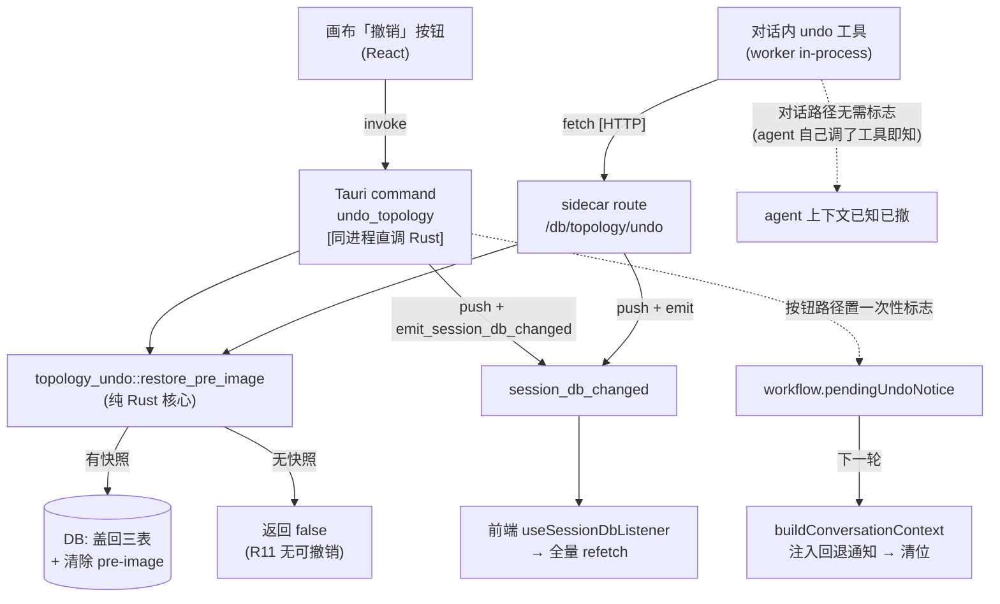
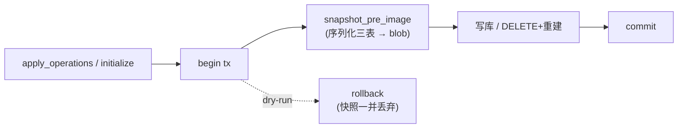

# feat: 单步撤销（跨 stage 通用，本期实现 topology）

## Summary

给会话编辑加「撤销上一次结构改动」的单步回退。每次结构性拓扑变更（apply_operations / initialize）前，把当前态（topology_nodes / topology_links / topology_refs 三表）序列化进一张按 `(session_id, domain)` 键的 blob 表（pre-image，覆盖式只一份）；撤销时盖回 pre-image、清除它、刷新画布、并向 agent 注入一次性回退通知。两个入口——画布「撤销」按钮（Tauri command）与对话内 in-process agent 工具——共用同一个纯 Rust 撤销核心。

---

## Problem Frame

现在 agent 改拓扑没有版本概念：DB 只有当前态、mutation_buffer 只存 id 不存状态、重启清零。用户说「回退上一步」时大模型只能按对话记忆脑补恢复，可能记错删错。本计划存一份确定的 pre-image，把回退从「大模型猜」变成「盖回快照」的确定性操作。撤销价值集中在 initialize 整图重置、连续多步后「刚才那步」难以口述逆转的场景。

origin 需求文档已定 WHAT（单步、只撤结构、无 redo、跨 domain 通用存储、本期只实现 topology、两入口对等、回退后强制 agent 重新认知）。本计划定 HOW。

---

## Key Technical Decisions

- **KTD1 单份覆盖式 pre-image，新建 blob 表。** `topology_undo_snapshots(session_id, domain, blob_json, created_at)`，主键 `(session_id, domain)` 天然「只留一份」，`ON DELETE CASCADE` 让 session 删除自动清快照。挂进 `P0_DOMAIN_SCHEMA_SQL` 靠 `CREATE TABLE IF NOT EXISTS` 自愈老库，不引入新 migration 向量。**不**加进 `SESSION_SCOPED_TABLES`——撤销快照是本机临时状态，不随 session 导出/导入。（满足 R3, R5, R6, R7；origin Assumptions「不复用 mutationId 作持久键」）

- **KTD2 撤销核心做成纯 Rust 模块。** 新建 `src-tauri/src/topology_undo.rs`：`snapshot_pre_image(conn, session_id)` 接调用方已开的事务句柄、序列化三表写 blob；`restore_pre_image(pool, session_id) -> bool` 自开事务、读 blob → DELETE 三表 → 盖回 → 清除 blob → commit，返回「是否有可撤销快照」。`mutation_buffer.push` / `emit` **不进核心**，留在两面各自调用点。（满足 R10）

- **KTD3 写前快照与变更同一事务。** `apply_operations` 在 begin tx 之后、首个 `apply_op` 之前调 `snapshot_pre_image`；`initialize` 的 `persist_initialized_topology` 在拿到连接、三表 DELETE 之前调。dry-run 分支 rollback 时快照随事务一并丢弃，不留存。（满足 R4）

- **KTD4 撤销核心被两个进程面直接调用，不强行都绕 HTTP。** 画布按钮 → Tauri command `undo_topology` 直接调 `restore_pre_image`（同进程 Rust）；对话工具 → sidecar `/db/topology/undo` route 调 `restore_pre_image`。两面调同一核心，各自 `push + emit`，消费方（前端 listener）不区分来源。（满足 R10）

- **KTD5 撤销刷新走全量 refetch，不依赖增量比对。** 撤销后 `emit` 发 `session_db_changed`，前端 `useSessionDbListener` 触发 `refetch()`（全量 `query_topology`）。`mutation_buffer.push` 仍照做（维护 mutation 历史一致性），但前端刷新的触发是 `emit` 信号本身、不是 `mutation_id` 增量比对——所以即便重启清零了 id 也不会漏判。这绕过 `since()`/`last_seen` 的重启清零隐患。（满足 R8；化解 origin Outstanding「刷新通道」）

- **KTD6 R9 用软指令，不做硬拦截。** 撤销后置一个一次性 workflow 标志，下一轮 `buildConversationContext` 注入一段通用回退通知（「上一步已撤销、编辑/回答前先 inspect、勿假设上轮改动仍在」），注入后清位。会话上下文本就每轮从 DB 现取节点计数（撤销后自动刷新），软指令对 MVP 够用。（满足 R9, origin KD4；化解 origin Outstanding「软指令 vs 强制兜底」）

- **KTD7 对话工具用 in-process，对标 request_stage_change。** undo 工具在 worker 内用 `tool()` 定义、注册进 `tsn_workflow` in-process server，handler 调 sidecar undo route 执行。对标既有 `requestStageChangeTool` 的注册与应用层消费模式。（满足 R10, R11）

---

## High-Level Technical Design

撤销的数据流（两入口汇入一个核心，三处副作用：DB 盖回、画布刷新、agent 通知）：

写前快照（结构变更路径，与变更同事务）：

---

## Implementation Units

### U1. 新建 pre-image blob 表

**Goal:** 建 `topology_undo_snapshots` 表，老库自愈，排除出导出清单。
**Requirements:** R5, R6, R7。
**Dependencies:** 无。
**Files:**
- `src-tauri/src/db.rs`（修改 `P0_DOMAIN_SCHEMA_SQL`；确认 `safety_net_schema_sql` 自动覆盖；确认**不**加进 `SESSION_SCOPED_TABLES`）
- `src-tauri/src/db.rs` 既有 schema 测试（修改/新增）
**Approach:** 在 `P0_DOMAIN_SCHEMA_SQL` 末尾（`PRAGMA application_id` 之前）加 `CREATE TABLE IF NOT EXISTS topology_undo_snapshots (session_id TEXT NOT NULL REFERENCES sessions(id) ON DELETE CASCADE, domain TEXT NOT NULL, blob_json TEXT NOT NULL, created_at TEXT NOT NULL, PRIMARY KEY (session_id, domain))`。靠现有 `safety_net_schema_sql` 启动自愈，不加 migration 向量。
**Patterns to follow:** `topology_refs` 表定义（同款 session_id FK + CASCADE）；`safety_net_schema_sql` 的 IF NOT EXISTS 自愈。
**Test scenarios:**
- 新库启动后 `topology_undo_snapshots` 表存在、列与主键正确。
- 模拟「老库」（不含该表）启动后经 safety-net 自动建出该表。
- 删除 session 后该 session 的快照行随 CASCADE 消失。
- `SESSION_SCOPED_TABLES` 不含 `topology_undo_snapshots`（导出/导入跳过它）。
**Verification:** schema 测试绿；导出一个含快照的 session，导出物不含 undo 快照。

### U2. 撤销核心模块 `topology_undo.rs`

**Goal:** 纯 Rust 的 snapshot / restore 两函数，三表序列化与盖回，不含 push/emit。
**Requirements:** R1, R3, R10。
**Dependencies:** U1。
**Files:**
- `src-tauri/src/topology_undo.rs`（新建）
- `src-tauri/src/lib.rs`（`mod topology_undo;`）
- `src-tauri/src/topology_undo.rs` 内联单测
**Approach:**
- `snapshot_pre_image(conn: &mut SqliteConnection, session_id)`：三条 `SELECT * FROM {topology_nodes|topology_links|topology_refs} WHERE session_id=?`，序列化成 `{nodes,links,refs}` JSON，`INSERT INTO topology_undo_snapshots ... ON CONFLICT(session_id,domain) DO UPDATE`（domain 固定 `"topology"`）。列清单抄 `SESSION_SCOPED_TABLES` 三表条目，保证零漂移。
- `restore_pre_image(pool, session_id) -> Result<bool>`：begin tx → 读该 session blob（无则返回 `false`）→ 三表 `DELETE WHERE session_id=?` → 按 blob 反序列化 INSERT 盖回 → `DELETE FROM topology_undo_snapshots WHERE session_id=? AND domain='topology'`（撤销后清除，使 R11 判定成立）→ commit → 返回 `true`。
**Patterns to follow:** sidecar `inspect` 的只读三表 SELECT + Row::get（但需补 `topology_refs` 第三条、且在写事务里）；`apply_op` 的 `&mut Transaction` 句柄约定。
**Test scenarios:**
- snapshot 后 restore：三表行与 snapshot 时刻逐字节一致（含节点 x/y、styles_json、ref_json）。
- restore 后 blob 被清除：再次 restore 返回 `false`（Covers AE3, R11）。
- 无 pre-image 时 restore 返回 `false`、不动三表（Covers AE5）。
- snapshot 覆盖式：连续两次 snapshot，blob 为最后一次（PK 冲突走 UPDATE）。
- restore 盖回含 `topology_refs`（initialize 路径会动 refs）。
**Verification:** cargo test 绿；round-trip 与 no-op 用例通过。

### U3. 写前快照接线（apply_operations + initialize）

**Goal:** 两个结构变更入口在写库前、同事务内调 `snapshot_pre_image`；dry-run 不留快照。
**Requirements:** R4。
**Dependencies:** U2。
**Files:**
- `src-tauri/src/topology_sidecar_routes.rs`（`apply_operations` 与 `persist_initialized_topology`）
- 对应路由/初始化的既有测试（扩展）
**Approach:** `snapshot_pre_image(&mut tx, &session_id)` 必须插在 `begin(tx)` 之后、**任何写操作（DELETE/INSERT）之前**——`apply_operations` 是 `state.pool.begin()` 后、首个 `apply_op` 前；`persist_initialized_topology` 是拿到连接后、三表 DELETE 前。靠这个顺序，dry-run 分支的 rollback 会把快照一并丢弃，业务逻辑无需额外清理——但实现须验证调用点满足该顺序，测试显式覆盖 dry-run 无快照。
**Patterns to follow:** 两函数现有的 `&mut tx` / `&mut conn` 句柄传递。
**Test scenarios:**
- apply_operations（非 dry-run）后，DB 存在该 session 的 pre-image，内容等于 apply 前的三表态。
- apply_operations dry-run（rollback）后，**不**留下 pre-image（Covers origin R4「dry-run 不得留存」）。
- initialize 后，pre-image = initialize 前的整图态；首次 initialize（之前空）后 pre-image 为空三表。
- 一次结构变更只产生一份 pre-image（覆盖上一份）。
**Verification:** cargo test 绿；dry-run 无快照用例通过。

### U4. sidecar 撤销 route

**Goal:** `/db/topology/undo` route 调 `restore_pre_image`，有快照则 push + emit。
**Requirements:** R1, R8, R10, R11。
**Dependencies:** U2。
**Files:**
- `src-tauri/src/topology_sidecar_routes.rs`（新 handler `undo`）
- `src-tauri/src/topology_sidecar.rs`（`build_router` 加 `.route("/db/topology/undo", post(undo))`）
- sidecar 路由测试（新增 undo 用例）
**Approach:** handler 取 `session_id`（请求体，照其他 route），调 `topology_undo::restore_pre_image(&state.pool, &session_id)`；返回 `true` 时 `state.mutation_buffer.push(session_id, "topology")` + `(state.emit)(record)`；返回 `false` 时回结构化「无可撤销」。
**Patterns to follow:** `apply_operations` 的 push+emit 收尾（L724 附近模式）；RouteState 取 pool/buffer/emit。
**Test scenarios:**
- 有快照：undo route 盖回 DB + push 一条 mutation；响应 ok=true。
- 无快照：undo route 返回「无可撤销」、不 push。
- 盖回后 inspect 返回的拓扑 = 撤销前快照态。
**Verification:** sidecar 测试绿。

### U5. Tauri 撤销 command（按钮用）

**Goal:** `undo_topology` command 调同一核心，按钮路径不绕 HTTP。
**Requirements:** R1, R8, R10, R11。
**Dependencies:** U2。
**Files:**
- `src-tauri/src/topology_undo_command.rs`（新建，或并入 `topology_position_command.rs` 同款文件）
- `src-tauri/src/lib.rs`（`invoke_handler` 注册 `undo_topology`）
- command 测试
**Approach:** 照 `update_node_position`：`app: AppHandle` + `store: State<SessionStore>` + `buffer: State<Arc<TopologyMutationBuffer>>` + request{ sessionId }；`pool = store.pool(&app)`，调 `restore_pre_image(pool, sessionId)`，`true` 则 `emit_session_db_changed(&app, &record)` + `buffer.push`。返回是否有撤销，供前端按钮反馈。
**Patterns to follow:** `topology_position_command.rs` 的 `update_node_position`（取 pool/buffer + emit_session_db_changed）。
**Test scenarios:**
- 有快照：command 盖回 + emit；返回 true。
- 无快照：返回 false，不 emit。
**Verification:** command 测试绿；与 U4 共调同一 `restore_pre_image`、行为一致。

### U6. 对话内 in-process undo 工具

**Goal:** worker 内 in-process undo 工具，handler 调 sidecar undo route。
**Requirements:** R10, R11；origin F2。
**Dependencies:** U4。
**Files:**
- `src-node/claude-agent-worker.mjs`（定义 `undoTool = tool(...)`，注册进 `tsn_workflow` server；`buildAllowedToolsForStage` 放开）
- `src-node/mcp/sidecar-client.ts`（复用 `fetchSidecar`）
- worker 相关测试（扩展）
**Approach:** 照 `requestStageChangeTool`：`tool("undo_last_change", 描述, 空/最小 zodShape, handler)`，handler 内 `fetchSidecar("/db/topology/undo", {})`，返回 `{ content:[{type:"text", text: JSON.stringify(result)}] }`。工具结果作普通 tool_call 卡片展示，无需新提取器（对话路径不依赖 adapter 感知结果——见 U7：agent 调了工具自己就知道撤了）。
- **进程面/sessionId**：undo 工具是 in-process（跑在 worker 主进程的 `tsn_workflow` server），`fetchSidecar` 直接读 worker 进程的 `process.env`（`TSN_AGENT_DB_RPC_URL/TOKEN/SESSION_ID` 由 commands.rs 注入），sessionId 无需传参。注意这与现有 `tsn_topology` 工具不同——后者跑在 stdio 子进程、经 `buildTopologyMcpEnv` 透传；undo 在主进程内，别照搬子进程心智。
- **allowedTools 门控**：本期只撤 topology，undo 工具随 `stage === "topology"` 放开（对标 `TOPOLOGY_MCP_ALLOWED_TOOLS`），**不**像 `request_stage_change` 全阶段放开——避免在 time-sync / flow-planning 阶段误撤拓扑。
- SKILL.md / system prompt 补一句：用户说「撤销/回退刚才那步」时调本工具；指代不清先用编号选项问清、不擅自撤；不设单独确认闸（直接执行）。
**Execution note:** 改 worker 后须 `build:worker`（worker 跑 dist 产物）。
**Patterns to follow:** `requestStageChangeTool` 定义/注册；`tsn_topology` 工具的 `fetchSidecar` 调用。
**Test scenarios:**
- 工具 handler 调 sidecar undo、透传结构化结果。
- 工具在 topology 阶段可用、在 allowedTools 内。
- 指代不清场景：SKILL 指引要求先问（这条靠 prompt 指引，覆盖到文案即可）。
**Verification:** worker 测试绿；`build:worker` 后真机对话「撤销刚才那步」生效。

### U7. 回退通知注入（R9 软指令）

**Goal:** 按钮（带外）撤销后置一次性标志，下一轮会话上下文注入通用回退通知。对话路径不置标志——agent 自己调了 undo 工具、本就知道已撤（origin F2）。
**Requirements:** R9；origin KD4。
**Dependencies:** U5。
**Files:**
- `src/agent/agent-adapter.ts`（`buildConversationContext` 加条件文案）
- workflow 状态模块（`normalizeWorkflowState` 所在，加一次性字段 `pendingUndoNotice`，并在 normalize 时 drop 掉、不持久化）
- 按钮 onClick（`src/app/...`，撤销成功后经 `setCurrentSession` 置标志）
- agent-adapter 测试（注入 + 清位 + 不持久化）
**Approach:** `WorkflowState` 加 `pendingUndoNotice?: boolean`。**只按钮路径置位**：onClick 调 `undo_topology` 成功后经 `setCurrentSession` 置真（WorkflowState 在 `currentSession.workflow`、App 持有 `setCurrentSession`，按钮可达——feasibility 已确认可行）。**对话路径不置位**：agent 调 undo 工具后，其 tool_result 在自己上下文里、它已知道撤了，不需要标志（这避开了「adapter 感知不到 tool_call 卡片结果」的死路）。`buildConversationContext` 照 `pendingStageChange` 范本，标志为真时拼入「重要：上一步拓扑已撤销、工程库已回退；编辑或回答当前拓扑前先 topology.inspect，勿假设上一轮改动仍在」，拼完清位（一次性）。`normalizeWorkflowState` 显式 drop `pendingUndoNotice`（仿 pendingStageChange 清理），避免它随 session payload 持久化、重启后还原出过期通知。通知文案通用、不枚举操作、不依赖 diff。
**Patterns to follow:** `buildConversationContext` 里 `workflow.pendingStageChange` 的条件文案 + 注入后处理。
**Test scenarios:**
- 标志置位后，buildConversationContext 输出含回退通知；调用后标志清零。
- 标志未置位时无通知（不每轮重复）。
- `normalizeWorkflowState` 后 `pendingUndoNotice` 不进序列化结果（不持久化、重启不还原）。
- Covers AE1：按钮撤销 → 下一轮上下文带通知 →（prompt 指引）agent 先 inspect 再答。
- Covers AE4：撤销后首条是编辑指令时，通知在上下文中先于该指令呈现（软指令要求先 inspect 再写）。
**Verification:** agent-adapter 测试绿；真机：按钮撤销后下一句问/改，agent 先 inspect。

### U8. 前端撤销按钮

**Goal:** 画布工具栏「撤销」按钮，调 `undo_topology`，无快照时禁用/提示。
**Requirements:** R8, R10, R11；origin F1, KD5。
**Dependencies:** U5, U7。
**Files:**
- `src/app/components/workspace-pane/index.tsx`（按钮 + onClick；可选 `onUndo` prop）
- `src/app/App.tsx`（接线 sessionId、撤销后 `refetchTopology`、置 `pendingUndoNotice`）
- 组件/集成测试（vitest）
**Approach:** 工具栏加「撤销」按钮，onClick `invoke("undo_topology", { request:{ sessionId } })`，成功后显式 `onRefreshTopology()`（双保险，emit 也会触发）并置 workflow undo 标志（U7）。无拓扑（`isEmptyTopologySnapshot`）或 command 返回「无可撤销」时按钮禁用 / 轻提示。
**Patterns to follow:** `invokeCommitNodePosition`（同文件 invoke Tauri command 范本）；现有工具栏按钮（`config-tab` / `config-close`）。
**Test scenarios:**
- 点按钮触发 `undo_topology` invoke、成功后 refetch。
- 空拓扑时按钮禁用（Covers AE5）。
- 撤销成功后第二次点击：command 返回无可撤销、按钮置灰/提示，不静默（Covers AE3, R11）。
- Covers AE2：拖拽 → agent 加交换机 → 点撤销 → 画布回到加交换机前（节点位置一并回滚）。
**Verification:** vitest 绿；真机截图：按钮撤销后画布回退、第二次点击有反馈。

---

## Requirements Trace

| 需求 | 覆盖单元 |
|---|---|
| R1 单步回退 | U2, U4, U5 |
| R2 只撤结构、快照含位置一并回滚 | U2（序列化含 x/y）, U8（AE2） |
| R3 单步无 redo、撤销后清 pre-image | U2 |
| R4 写前快照同事务、dry-run 不留 | U3 |
| R5 通用 blob 表 | U1 |
| R6 本期直调 topology、留扩展路径 | U2（domain 固定 topology、核心可扩展） |
| R7 只实现 topology | 全计划范围 |
| R8 DB 盖回 + 画布刷新 | U4, U5, U8（全量 refetch） |
| R9 回退通知 + 写前 inspect（软指令） | U7 |
| R10 两入口共用核心、进程面切分 | U2, U4, U5, U6 |
| R11 无可撤销禁用/提示 | U2, U4, U5, U8 |

| Acceptance Example | 覆盖单元（测试） |
|---|---|
| AE1 按钮撤销后查询先 inspect | U7 |
| AE2 拖拽+结构改动+撤销，位置一并回滚 | U2, U8 |
| AE3 连续撤销两次第二次有反馈 | U2, U8 |
| AE4 撤销后首条编辑先 inspect | U7 |
| AE5 空会话撤销禁用 | U2, U4, U5, U8 |

---

## Scope Boundaries

**本计划范围内：** origin 需求 R1–R11 全部，仅 topology domain。

**Deferred for later（origin 携带）：** 多步回退 / 版本历史表 / version_seq；redo；确定性 diff；时间同步 / 流量规划 domain 接入（blob 表 domain 维度已留）；撤销按钮常驻 vs 轻量入口的定位取舍。

**不做（origin 携带）：** git 管 DB 二进制 / 导出文件；外部版本控制；逐键撤销粒度。

**Deferred to Follow-Up Work（计划期发现）：** `docs/solutions/` 几乎空白——本计划落地后用 `/ce-compound` 把单步撤销相关学习（命令式迁移、撤销核心、回退通知注入）正式归档。

---

## Risks & Dependencies

- **session 删除复活 bug（既有未修，`docs/solutions` 无、MEMORY 有记录）。** 新表按 session_id 键，靠 `ON DELETE CASCADE` 随 session 删除清快照；`restore_pre_image` 只为存在的 session 写三表，删后快照已被级联清除 → restore 命中空 → no-op，不会复活已删 session。U1 测试显式覆盖 CASCADE。
- **按钮路径置 workflow undo 标志的接线（U7）。** feasibility 核实可行：WorkflowState 在 `currentSession.workflow`、App 持有 `setCurrentSession`、WorkspacePane 已从 App 收 props，按钮 onClick 经 `setCurrentSession` 置位完全可达。回退方案仍备：若置位通路有意外，改恒定「编辑前先 inspect」prompt 指引、弃用一次性标志。注意一次性标志须在 `normalizeWorkflowState` drop 掉、不随 session payload 持久化，否则重启会还原出过期通知。（对话路径不依赖此标志——agent 自己调了 undo 工具即知，绕开了「adapter 感知不到 in-process 工具卡片结果」的死路。）
- **worker 跑 dist 产物。** U6 改 `claude-agent-worker.mjs` 后须 `build:worker` 才生效，真机验收前务必重建。
- **一次性标志不跨重启。** 按钮撤销后若应用重启再发消息，标志丢失；但重启后会话上下文重建、计数自动刷新，agent 细粒度记忆也已随上下文重载，软指令场景可接受，不额外持久化。

---

## Open Questions（Deferred to Implementation）

主要设计悬念已在各单元 Approach 收口（restore 走 DELETE+INSERT 三表见 U2、undo 工具无参 sessionId 经 env 注入见 U6）。剩纯实现期细节：

- 按钮「无可撤销」的反馈形态（置灰 vs toast）——U8 按现有 UI 风格定。
- U7 按钮置位通路若实测不可达，立即走回退方案（弃用一次性标志、改恒定「编辑前先 inspect」prompt 指引）——实现期先 spike 验证置位可行性。

---

## Sources & Research

- origin 需求：`docs/brainstorms/2026-06-23-single-step-undo-requirements.md`（经 ce-doc-review 两轮）。
- 接线缝（path + 符号）：写前快照落点 `src-tauri/src/topology_sidecar_routes.rs`（`apply_operations` / `persist_initialized_topology`）；RouteState 与 Tauri command 取 pool/buffer/emit `src-tauri/src/topology_sidecar.rs`、`src-tauri/src/topology_position_command.rs`（`emit_session_db_changed`）；in-process 工具范本 `src-node/claude-agent-worker.mjs`（`requestStageChangeTool`、`createSdkMcpServer`）；上下文注入 `src/agent/agent-adapter.ts`（`buildConversationContext` 的 `pendingStageChange`）；前端刷新/按钮 `src/app/hooks/use-topology-snapshot.ts`（`refetch` / `useSessionDbListener`）、`src/app/components/workspace-pane/index.tsx`；迁移 `src-tauri/src/db.rs`（`P0_DOMAIN_SCHEMA_SQL` / `safety_net_schema_sql` / `SESSION_SCOPED_TABLES`）；三表读取 `src-tauri/src/topology_query_command.rs`。
- 机构学习（MEMORY 索引，`docs/solutions` 待补）：命令式 pragma 迁移、session 删除复活未修、worker build:worker、in-process 工具对标 request_stage_change、sync_name 三表 schema。
