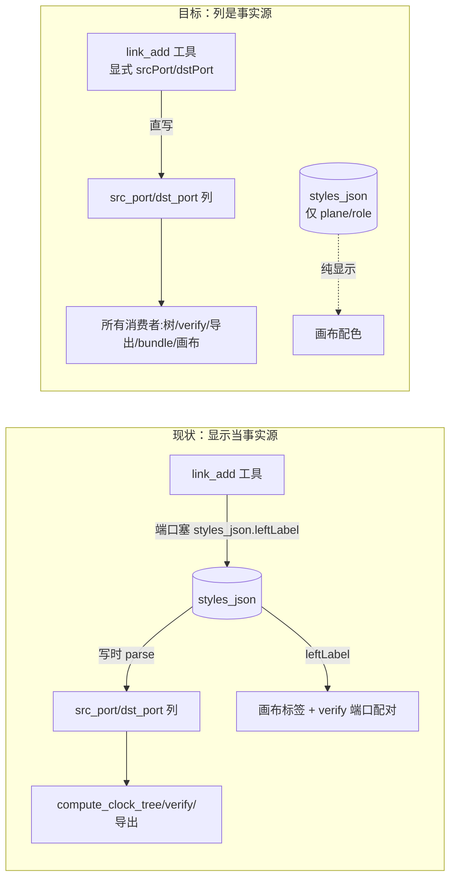
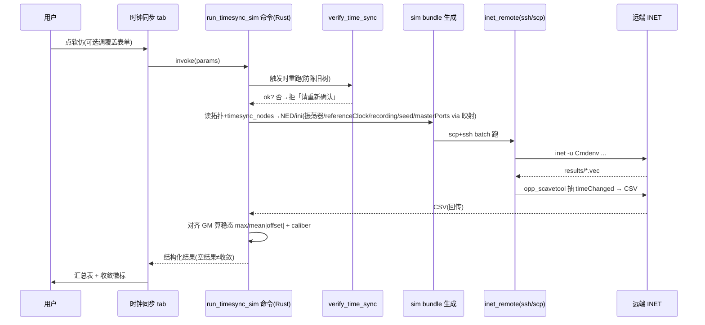

# feat: INET 时钟同步软仿对接

## 摘要

在时钟同步阶段，把当前拓扑 + 时钟树组装成 INET gPTP 软仿，远端 batch 跑完取回各节点相对 GM 的收敛偏差，用汇总表展示——**验证「生成的 gPTP 配置能装配/跑起来/收敛」**，非评估树质量。触发入口在拓扑侧弹出框重构后的「时钟同步」tab。配套：删未启用的 INET 加载验证死代码、远端主机改 UI 可编辑、把 `topology_links` 端口/速率收正为「列是事实源、styles_json 纯显示」。

四阶段：**A 数据流地基**（列权威）→ **B 软仿后端**（bundle/命令/取数）→ **C 前端**（面板/结果）→ **D 显示清理**（画布读列，排最后不阻塞软仿）。

---

## 问题背景

时钟同步阶段能生成时钟树（GM + master/slave 端口），但生成的 gPTP 配置从没在仿真里装配运行过。项目早建了 INET ssh/scp 远端套件（`inet_remote.rs`），但只做过「能否加载」冒烟（`build_inet_bundle`/`verify_inet`，从未接 UI、是死代码）。本特性是项目第一个「INET 真结果消费者」。

同时收正一个数据流问题：`topology_links` 端口/速率实际写源在 `styles_json.leftLabel/rightLabel`、独立列只是 parse 出来的副本（PR #55 治标），同一端口两处存放、有漂移风险（「新增节点掉出时钟树」即此类）。软仿读端口列，借此把列扶正为唯一事实源。

---

## 需求追溯

源需求 R1-R26 见 origin。本计划单元映射：U1(R1/R2/R2a/R3) · U2(并入 U1) · U3(R5/R7-R10/R18 执行) · U4(R21) · U5(R20) · U6(R25) · U7(R22/R23 结构消费者) · U8(R24/R23 画布) · U9(R26) · U10(R14-R16) · U11(R5a/R11/R17/R18 渲染/R19) · U12(R4) · U13(R13)。R6/R12 是约束（贯穿）。

---

## 关键技术决策

### KTD1：列是端口/速率唯一事实源，styles_json 收敛为纯显示（plane/role）

`topology_links` 的 `src_node/dst_node/src_port/dst_port/speed` 列权威。所有结构消费者（`compute_clock_tree`、`timesync_verify` 的端口配对、软仿 bundle、画布端口标签）读列。`styles_json` 只留 plane（配色）、role（角色）。端口标签按**首/尾节点**锚定（src_port 在 source 端、dst_port 在 target 端），不按 Qunee 几何左右。（origin R22-R24）

### KTD2：软仿是 batch + 新 caliber，复用 inet_remote 不重写

软仿走「前端按钮 → 新 Rust Tauri 命令」（agent 无 shell）。复用 `inet_remote.rs` 的 SshRunner/超时排空/unreachable-vs-load_failed 分型。新增 caliber `timesync_simulated` 与「结果为空/解析失败」错误类。指标取 **clock 模块 `timeChanged:vector`**（本版 INET 已删 timeDifference）+ `referenceClock=<GM>.clock` 对齐，偏差 = 节点 timeChanged − GM timeChanged。（origin R5/R7/R9/R10）

### KTD3：端口号→ethN 映射建显式表（feasibility blocker）

DB 端口号（列）≠ INET `ethN` 接口名（现有 bundle 用 `ethg++` 按连线序分配门号）。bundle 生成时建 `(节点, 库端口号) → NED 门号 ethN` 显式映射作单一事实源，masterPorts/slavePort 由同一映射派生。**映射规则（boss 定，2026-06-25）**：每个节点的端口集合**按库端口号升序、取下标作 k**（第 0 小→eth0、第 1 小→eth1…），NED 门号、masterPorts/slavePort、库端口角色三者由同一张表派生。**首个实现单元仍须先在远端用 gptp showcase 实跑一次**，但只为确认两件实跑才知道的事：NED 门名是 `ethg[k]` 还是 `eth[k]`、以及 `.vec` 里 `timeChanged` 的真实 module 路径（据此定 scavetool filter）；端口→k 的换算规则不依赖实跑。（origin R2a）

### KTD4：NULL 守卫＝硬校验拒绝（boss 定，2026-06-25）

R25 让 link_add 显式传端口直写列。端口缺省时**硬校验拒绝**：link_add 拿不到 src_port/dst_port 就返回明确错误，让 agent 修正后重提（与项目其他写入校验一贯）——以「拒绝」作为新 NULL 守卫，取代 PR #55 的 parse-leftLabel 写路径兜底（删兜底而拒绝即守卫，防列 NULL→时钟树断）。SKILL.md 须明确引导 agent 用显式 srcPort/dstPort、并说明漏传会被拒。存量行的 leftLabel 回填由 U9 一次性迁移单独处理、不在 live 写路径；initialize 路径用结构化 port_id 直写列、本就显式。（origin R25/KTD）

---

## 高层技术设计

**数据流：端口源 before → after**

**软仿触发→取数时序**

---

## 实现单元

> 单元号按依赖关系编排、非顺序递增（阶段 A=U6/U7/U9、阶段 B=U1-U5、阶段 C=U10-U13、阶段 D=U8）。追溯以上方「需求追溯」逐单元映射为准，勿按号序读执行顺序。

### 阶段 A — 数据流地基（列权威）

### U6. link_add 写路径：显式端口列 + 保兜底

**Goal**：`LinkAddArgs` + MCP `link_add` 工具加显式 `srcPort/dstPort/speed` 字段直写列；端口缺省时硬校验拒绝并返回明确错误（KTD4，boss 定）。

**Requirements**：R25（R22 的结构权威归 U7） · **Dependencies**：无

**Files**：`src-tauri/src/topology_ops.rs`、`src-node/mcp/topology-tools.ts`、`.claude/skills/tsn-topology/SKILL.md`、`src-tauri/src/topology_ops.rs`(测试)

**Approach**：LinkAddArgs 加 `src_port:Option<i64>`/`dst_port`/`speed`；INSERT 用显式字段直写列，src_port/dst_port 任一缺省 → 返回明确校验错误（不写库、不静默 NULL），删 PR #55 的 `parse_link_ports_and_speed` 写路径兜底（拒绝即新守卫）。MCP 工具 schema 把 srcPort/dstPort 设为必填（speed 可选），描述改「端口走显式字段、styles_json 仅 plane/role」。SKILL.md 同步：引导 agent 必传 srcPort/dstPort、不再把端口塞 styles_json，并说明漏传会被拒、须修正重提。worker 跑 dist——改 topology-tools.ts 后须 `npm run build:worker`。

**Patterns to follow**：NodeAddArgs 的显式字段；现有三态写入 ON CONFLICT。

**Test scenarios**：
- 显式 srcPort/dstPort → 列被直写（不经 parse）。Covers R25。
- 缺 srcPort 或 dstPort → 返回明确校验错误、不写库、不静默 NULL（断言时钟树不因此断）。Covers AE10。
- 端口齐全但 styles_json 无 leftLabel → 正常写入（证明写路径不再依赖 leftLabel）。
- 幂等重放（同 link_seq 同显式端口）仍 ON CONFLICT no-op。

**Verification**：cargo test + vitest 绿；worker 重建；agent 经新工具加链路端口列非 NULL。

### U7. 结构消费者读列：topology_verify 端口配对 + styles_json 收敛

**Goal**：`topology_verify.rs` 的端口配对校验改读 `src_port/dst_port` 列（两列非 NULL=配对），不再读 styles_json.leftLabel；确认 styles_json 仅剩 plane/role 被消费。

**Requirements**：R22, R23(结构侧) · **Dependencies**：U6

**Files**：`src-tauri/src/topology_verify.rs`、`src-tauri/src/topology_query_command.rs`(load_and_verify_topology 的 VerifyLink 取列)、测试同文件

**Approach**：`link_ports_paired` 入参从 styles_json 改为 (src_port, dst_port)，`VerifyLink` 加端口列字段，`load_and_verify_topology` SELECT 加列。PORT_UNPAIRED 判定 = 任一列 NULL。**这是确认闸/topology.validate 的核心，漏改会对每条正常链路误报**。

**Patterns to follow**：compute_clock_tree 读列方式（timesync_tree.rs）。

**Test scenarios**：
- 两端口列非 NULL → paired，无 PORT_UNPAIRED。
- 一端口列 NULL → PORT_UNPAIRED。
- styles_json 无 leftLabel 但列齐 → 仍 paired（证明不再依赖 styles_json）。Covers AE10(verify 侧)。

**Verification**：cargo test 绿；确认闸对正常拓扑不误报。

### U9. 存量迁移审计：删 leftLabel 前条件守卫

**Goal**：删 styles_json.leftLabel 前先审计「列 NULL 但 styles_json 有 leftLabel」的行，重新回填或提示，零不可恢复行才允许删键（R26）。

**Requirements**：R26 · **Dependencies**：U6, U7

**Files**：`src-tauri/src/db.rs`(ensure_* 守卫旁加审计/回填)、测试同文件

**Approach**：命令式 pragma 守卫（非 migrations 向量，遵项目既有 ensure_* 模式）：①补回填一次（对 src_port/dst_port IS NULL 且 styles_json 有可 parse leftLabel 的行）②审计剩余不可恢复行（非数字 label→永久 NULL）记 warn。dual-plane 旧库（boss 定不迁移）纳入同审计：plane 留、端口若旧 leftLabel 来源也走审计。leftLabel 实际删除是 U8 画布切走后的收尾（顺序：U6 写列 → U7/U8 消费列 → 审计 → 删键）。

**Test scenarios**：
- 数字 leftLabel 行回填后列非 NULL。
- 非数字 leftLabel 行 → 列仍 NULL + 审计记录（不静默丢）。
- 幂等：审计/回填重跑不重复写。

**Verification**：cargo test 绿；真机老库启动不 panic、审计有痕。

---

### 阶段 B — 软仿后端

### U1. sim bundle 生成 + 端口→ethN 映射（含远端实跑确认）

**Goal**：新 `build_timesync_sim_bundle`：读拓扑 + `timesync_nodes` + 覆盖参数，产带时钟配置的 NED/omnetpp.ini；建 `(节点,库端口)→ethN` 显式映射（KTD3）。

**Requirements**：R1, R2, R2a, R3 · **Dependencies**：U7（端口列干净）

**Files**：`src-tauri/src/inet_sim_bundle.rs`(新)、测试同文件；参照 `src-tauri/src/inet_bundle.rs`(将删)

**Approach**：NED 用显式门号 `node.ethg[k]`（放弃 ethg++ 隐式序），k 按库端口号升序取下标（KTD3 规则），同一 k 拼 `masterPorts=["eth{k}"]`/slavePort。ini 写：`simtime-resolution=fs`、`**.oscillator.*`(类型/driftRate/nominalTickLength=10ns)、`**.referenceClock="<GM>.clock"`、clock 模块 `result-recording-modes`(确保 timeChanged 录)、`seed-set`、`*.*.eth[*].bitrate`(speed 列)、`**.length=10m`、`sim-time-limit`、gptp.syncInterval(sync_period)/pdelayInterval(measure_period)。one_step_mode 忽略(two-step)。**执行注记**：实现首步先在远端跑 gptp showcase 确认 .vec 实际 name/module（timeChanged vs 别名）与门号映射，再固化 filter。

**Execution note**：先实跑 showcase 确认指标/映射，再写生成器（地基不确定，先验证后编码）。

**Test scenarios**：
- 给定拓扑+timesync_nodes（GM=mid X、master/slave 端口）→ 生成 ini 含正确 masterPorts=["ethK"]，K 由映射表派生且与 NED 门号一致。
- 振荡器/referenceClock/recording/seed/simtime-resolution=fs 全部出现在 ini。
- 端口列 NULL 的链路 → 明确报错/跳过（不静默产错接线）。
- speed 列 → bitrate；缺省 → 默认。

**Verification**：cargo test 绿；远端实跑该 bundle EXIT=0 且 results 有 timeChanged 向量（真机）。

### U2. （并入 U1）— 见 U1

> 注：bundle 生成与映射本是一体，合并在 U1。保留 U2 号位避免重编号。

### U3. run_timesync_sim 命令：触发重验 + 远端跑 + 取数算偏差

**Goal**：新 Tauri 命令：触发时重跑 verify_time_sync（防陈旧树）→ U1 生成 bundle → inet_remote 跑 → scavetool 抽 timeChanged → 对齐 GM 算稳态偏差 → 结构化结果 + caliber。

**Requirements**：R5, R7, R8, R9, R10, R18 · **Dependencies**：U1

**Files**：`src-tauri/src/inet_sim_command.rs`(新)、`src-tauri/src/inet_remote.rs`(扩结果取回：scavetool + CSV 回传)、`src-tauri/src/lib.rs`(注册)、测试

**Approach**：复用 SshRunner 跑 INET，再 ssh `opp_scavetool export -f "module=~'**.clock' AND name=~'timeChanged:vector'" -F CSV` 取回（或抽到本地解析）。偏差 = 节点 timeChanged − GM timeChanged（对齐 simtime）。稳态窗口首发取 sim 后半程，算 max/mean|offset|，对 offset_threshold 标注（参考线非质量判定）。结果 `{caliber:"timesync_simulated", perNode:[{mid,maxOffset,meanOffset,converged}], overall}`。错误类：unreachable/load_failed（复用）+ 结果为空（0 行 timeChanged，文案指向 recording/模块路径，**不渲染成收敛**）+ 解析失败。触发时先 `verify_time_sync` ok=false→拒。

**Patterns to follow**：inet_remote 的 unreachable vs load_failed 分型、超时排空、char 边界截断、`sh_squote` 单引号转义；verify_time_sync 调用。scavetool filter 串以及插值进远端命令的节点名/路径一律过 `sh_squote`，禁止裸字符串拼接（防远端命令注入）。

**Test scenarios**：
- mock RemoteRunner 返回带 timeChanged 的 CSV → 算出每节点稳态 max/mean offset + converged。Covers AE1。
- 0 行 timeChanged → 「结果为空」、overall≠收敛、slave 行数<预期判失败。Covers AE8。
- verify_time_sync 触发时 fail → 拒绝、不跑。Covers AE7。
- ssh exit 255 → unreachable；exit 1 → load_failed（回归 inet_remote 分型）。Covers AE3。
- 稳态窗口：开头瞬态大偏差不计入稳态 max。
- 节点名含 shell 元字符（`'`、`;`、`$`）→ 构造的 scavetool 命令经 `sh_squote` 安全转义（注入回归断言）。

**Verification**：cargo test 绿；真机一轮软仿出汇总。

### U4. 删 INET 加载验证死代码

**Goal**：删 `build_inet_bundle`/`verify_inet` 及全部连带（R21）。

**Requirements**：R21 · **Dependencies**：U1, U3（替代品就位后才删）

**Files**：`src-tauri/src/inet_bundle.rs`(删)、`src-tauri/src/inet_verify_command.rs`(删)、`src-tauri/src/lib.rs`(删注册行+「勿删」注释)、`src/agent/agent-adapter.test.ts`(删两处 verify_inet 未调用断言+mock 分支)、memory 更新（plan-2026-06-17-003/mvp-residue-audit 描述）

**Approach**：删函数+模块+8 个 build_inet_bundle 测试+lib.rs 注册与注释。`inet_remote.rs` 保留。同 PR 内删旧建新避免中间态编译失败（U1/U3 先落、U4 后删）。

**Test scenarios**：Test expectation: 删除单元——断言全套件仍绿（cargo + vitest），无悬空引用。

**Verification**：`grep verify_inet|build_inet_bundle` 仅余历史文档；cargo/vitest 绿。

### U5. 远端主机 UI 可配置 + 持久化

**Goal**：主机/用户/inet 路径改 UI 可编辑（设置面板），落 app_state KV，播种当前写死值（R20）。

**Requirements**：R20 · **Dependencies**：U3（命令读配置）

**Files**：`src-tauri/src/inet_remote.rs`(RemoteConfig 从 app_state 读，env>UI>默认 优先级)、新 Tauri 命令读写配置、`src/app/components/`(设置面板表单)、`src-tauri/src/db.rs`(app_state key)、测试

**Approach**：`app_state` 表加 `inet_host_config`=JSON。RemoteConfig::resolve 顺序：env 覆盖 > UI 持久值 > dev_default；resolve 时对 host/user 做字符集校验（host/user 均限 `[a-zA-Z0-9._-]`），含空格/shell 元字符则拒绝，防 `user@host` 拼接被注入额外 ssh 选项（如 `-o ProxyCommand=`）。设置抽屉加表单（host/user/inet 路径，自由输入），用「保存」按钮显式提交（非 blur 自动存）、保存后关抽屉、关闭不保存则回滚，与现有抽屉编辑模式一致。known_hosts UX：换主机首连因 StrictHostKeyChecking 失败时，从 ssh stderr 抽到 `Host key verification failed`/`known_hosts` 关键词 → 显示独立文案「新主机首次连接需先手动 ssh 建立 host key 信任」，区别于普通 unreachable（主机离线）；输入框下方常驻一行该说明（不依赖报错才出现）。

**Test scenarios**：
- 写 UI 配置→落 app_state；RemoteConfig 读到新值。Covers AE6。
- env 存在时覆盖 UI 值（优先级）。
- 重启后配置仍在（持久化）。
- host/user 含空格或 shell 元字符 → resolve 拒绝（ssh 选项注入防护）。
- ssh stderr 含 host key 失败关键词 → 走「需先建信任」独立文案，非主机离线文案。

**Verification**：cargo+vitest 绿；真机改主机后软仿走新主机。

---

### 阶段 C — 前端

### U10. 弹出框 2-tab 重构 + 显隐解耦

**Goal**：tab 从「节点详情/链路详情」改「节点属性/时钟同步」；点节点→展开+跳节点属性；点链路无响应；面板默认收起、底部 handle 展开（与选中解耦）（R14-R16）。

**Requirements**：R14, R15, R16 · **Dependencies**：无（可与 B 并行）

**Files**：`src/app/components/workspace-pane/index.tsx`、`src/app/App.tsx`(handleNodeSelect/handleLinkSelect/activeConfigTab)、`src/app/App.css`、测试 `workspace-pane.test.tsx`/`App.test.tsx`

**Approach**：`ConfigTabId="node-props"|"time-sync"`。删 onEdgeClick 选中。面板显隐由独立 expand state（非 selectedTopologyItem）驱动 + 底部常驻 handle 条。点节点→展开+切 node-props。流量规划 tab 不做（Deferred）。expand state / activeConfigTab / selectedNodeId 三者跟随 activeSessionId 重置——sessionId 变化即归零（收起、回 node-props、清选中），防 PR#23 的 id 污染。

**Test scenarios**：
- 点节点 → 面板展开、停 node-props tab。Covers AE5。
- 点链路 → 无响应（无选中）。Covers AE5。
- 默认收起；点 handle 展开（无选中节点时也能开）。
- 会话切换重置选中/展开（防 PR#23 的 id 污染）。

**Verification**：vitest 绿；真机交互对。

### U11. 时钟同步 tab：软/硬仿按钮 + 门控 + 运行态 + 结果表

**Goal**：tab 下软仿/硬仿按钮；软仿门控（阶段 time-sync 且时钟树确认）；运行中态；结果汇总表三态（R5a/R11/R17-R19）。

**Requirements**：R5a, R11, R17, R18（仅渲染拒绝提示；重验执行在 U3 命令层）, R19 · **Dependencies**：U3(命令), U10(tab)

**Files**：`src/app/components/workspace-pane/`(time-sync tab 内容)、`src/agent/`或前端 invoke 封装、`src/app/App.css`、测试

**Approach**：软仿按钮 invoke run_timesync_sim。`simStatus: 'idle'|'running'|'done'|'error'` 及结果持于组件外层（App/store 级，非 tab 组件内），切 tab 不销毁状态、不取消正在运行的命令，切回按 simStatus 恢复对应态。门控置灰提示分两条文案：阶段不在 time-sync→「请先进入时钟同步阶段」；阶段对但树未确认→「请先确认时钟树」。运行中按钮 loading、表格「仿真进行中…」。结果表每 slave 行（名/稳态 max/mean offset/收敛徽标）+ 顶部总判定；三态（初始引导/运行中/有结果）。硬仿占位按钮→提示待接入。

**Test scenarios**：
- 门控：非 time-sync 或树未确认 → 软仿按钮 disabled+提示。Covers AE4。
- 阶段=time-sync 但树未确认 → 按钮 disabled + 「请先确认时钟树」文案（区别于未到阶段文案）。
- 点软仿 → invoke 命令、进入运行态、回结果渲染表。Covers AE1。
- 软仿运行中切到节点属性 tab 再切回 → 仍显运行态/结果（命令未被取消）。
- 空结果 → 不渲染全绿（显示「结果为空」）。Covers AE8。
- 硬仿点击 → 提示占位。
- 初始态显示引导文案。

**Verification**：vitest 绿；真机门控+运行态+表格三态。

### U12. 软仿覆盖表单（3 参数）

**Goal**：软仿按钮旁可折叠表单，暴露振荡器类型/漂移幅度/sim 时长，值随软仿提交（R4）。

**Requirements**：R4 · **Dependencies**：U11

**Files**：`src/app/components/workspace-pane/`、测试

**Approach**：tab 内可折叠区（默认收起）。3 字段；提交时并入 run_timesync_sim params；缺省走 R3(a) 固定默认。表单展开态与填入值为独立用户 intent、不受软仿执行结果影响——结果返回后保留当前展开/填值便于多轮调参；仅会话切换时重置为收起+默认。

**Test scenarios**：
- 展开/收起；填值随软仿命令提交。
- 不填 → 用默认。

**Verification**：vitest 绿。

### U13. 异常时大模型解释

**Goal**：有节点未收敛/超参考线时，把汇总（带「漂移为合成默认」上下文）喂大模型生成解释（R13）。

**Requirements**：R13 · **Dependencies**：U11

**Files**：`src/app/components/workspace-pane/`(「解释」按钮)、`src/agent/agent-adapter.ts`或现有大模型调用封装、测试

**Approach**：结果有未收敛节点 → 显「解释」按钮 → 把汇总（非原始数据）+ 合成漂移上下文喂模型 → 渲染说明。点「解释」后按钮置 loading（disabled+spinner），说明渲染在结果表下方独立折叠区；模型调用失败显「解释生成失败，可重试」并恢复按钮可点，成功后按钮改「重新解释」。诊断性：文案引导回时钟同步阶段调 GM/链路/参数，不在面板改树。

**Test scenarios**：
- 有未收敛 → 「解释」可见；点击发汇总+上下文。Covers AE2。
- 全收敛 → 无「解释」。

**Verification**：vitest 绿。

---

### 阶段 D — 显示清理（排最后，不阻塞软仿）

### U8. 画布端口标签读列 + 删 leftLabel/rightLabel

**Goal**：`query_topology` 暴露 src_port/dst_port 列；画布按 source/target 端点渲染 src_port/dst_port；删 styles_json/edge data 的 leftLabel/rightLabel（R23 画布侧/R24）。

**Requirements**：R23, R24 · **Dependencies**：U6, U7（画布读列即可起）；U9 仅为 leftLabel 删键子步骤的前置（审计须先过，再删键）——U8 的画布读列部分先于 U9、删键收尾步骤后于 U9

**Files**：`src-tauri/src/topology_query_command.rs`(TopologyLinkRow 加 src_port/dst_port + SELECT + serde camelCase)、`src/app/components/workspace-pane/topology-flow.ts`、`src/app/components/workspace-pane/tsn-floating-edge.tsx`、TS 类型、测试

**Approach**：query_topology 返回 srcPort/dstPort。画布 PortLabel 渲染：source 端点(sourceX/Y)标 src_port、target 端点(targetX/Y)标 dst_port，几何无关。删 leftLabel/rightLabel 读取与 styles_json 中的键（配 U9 审计后）。自环（src==dst）端点重合时小偏移防叠压。inspect 工具描述去 leftLabel/rightLabel 措辞。

**Test scenarios**：
- query_topology 返回含 srcPort/dstPort。
- 链路 src_port=2/dst_port=3 → 画布 source 端标 2、target 端标 3；拖动让屏幕左右互换 → 标签跟节点不跟屏幕。Covers AE9。
- 删 leftLabel 后端口标签不消失。Covers AE9。
- 自环不叠压。

**Verification**：vitest 绿；真机端口标签按首尾、拖动正确。

---

## 范围边界

**本期做**：U1-U13（R1-R26）。

**Deferred to Follow-Up Work**：offset 时序折线图；逐节点振荡器落库 UI；漂移随设计属性变；硬仿做实；多主机列表；流量规划 tab。

**Outside this product's identity**（origin 三分）：agent 自动触发软仿；实时/在线流式取数；大模型解析原始 .vec。

---

## 风险与依赖

| 风险 | 缓解 |
|------|------|
| 端口→ethN 映射错（feasibility blocker） | U1 执行注记：先远端实跑 showcase 确认 .vec name/module + 门号映射，再编码 |
| 指标名（timeChanged vs 别名）随 INET 版本变 | U1 实跑确认；不写死 timeDifference |
| 删 parse 重开时钟树断链 | KTD4/U6 硬校验拒 NULL（boss 定），AE10 守 |
| 删 leftLabel 漏消费者（verify/canvas/query） | U7 改 verify、U8 改 query+canvas，迁移清单在 origin R23 列全 |
| 存量非数字 label 行永久 NULL | U9 审计 + 条件删键，不无条件删 |
| 画布 regression 挡软仿验收 | U8 排阶段 D 最后，独立 AE9 |
| CI rust 1.96 clippy/rustfmt 版本错位 | 推前本地 `cargo +1.96.0 fmt/clippy` 自检（项目既有踩坑） |
| worker 跑 dist 产物 | 改 topology-tools.ts/SKILL 后 `npm run build:worker` |

**依赖**：`inet_remote.rs`(复用)；PR #55(其 parse-leftLabel 写路径兜底被 U6 改为硬校验拒绝取代)；远端机装 INET+opp_scavetool+ssh 免密；CONCEPTS「时钟同步」词汇。

---

## 系统级影响

- 替换删除 build_inet_bundle/verify_inet（启用那三个标 2026-09 复审的 INET 模块）。
- topology_links 端口源数据流切换：影响 link_add 工具契约、SKILL.md、verify 确认闸、画布、query——origin R22-R26 已列全消费者，按单元顺序（写列→消费列→审计→删键→画布）避免中间态破功能。
- 新增 app_state 配置项；新 Tauri 命令 run_timesync_sim + 主机配置读写。

---

## 待澄清（execution-time）

- ✅ 端口→ethN 映射规则已定（按库端口号升序取下标，见 KTD3）；实跑仅确认 NED 门名（ethg/eth）与 `.vec` 路径。
- scavetool filter 的确切 module/name（U1 实跑确认 timeChanged 路径）。
- 稳态窗口取法（首发 sim 后半程）。
- 覆盖表单漂移幅度单值 vs 范围（倾向单值→对称 uniform）。

---

## Deferred / Open Questions

### From 2026-06-25 review (ce-doc-review)

- **KTD4/U6 — NULL 守卫策略 ✅ 已定（boss，2026-06-25）＝硬校验拒绝**：link_add 端口缺省直接返回明确错误、让 agent 修正重提（符合项目其他写入校验），取代 PR #55 的 parse-leftLabel 写路径兜底；MCP schema 把 srcPort/dstPort 设必填、SKILL.md 明确引导显式传递。已落 KTD4 / U6 Goal·Approach·测试。
- **KTD3/U1 — 端口→ethN 的 k 分配规则 ✅ 已定（boss，2026-06-25）＝按库端口号升序取下标**：每节点端口集合按库端口号升序、第 k 小映射 `eth{k}`，NED 门号 / masterPorts / 库端口角色三者同表派生。已落 KTD3 / U1 Approach。showcase 仅确认 NED 门名（ethg vs eth）与 `.vec` 的 timeChanged module 路径。
