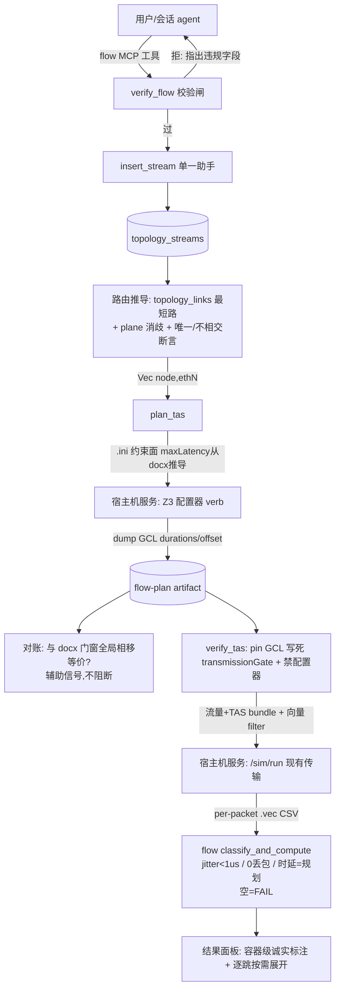

# feat: 解冻 flow-template — 流量录入 + INET Z3 门控规划 + pin 软仿验证

## Summary

解冻 `flow-template`（流量规划）阶段，落地完整闭环：agent 会话录入 ST/BE 流 → INET `Z3GateScheduleConfigurator` **综合** 802.1Qbv 门控表（GCL）→ **pin 住**综合结果软仿、**实测** jitter/丢包/时延判通过。复用既有 INET 软仿传输（`RemoteRunner`/`HttpRunner`）与门映射单一事实源（`build_port_eth_map`），并给宿主机薄服务新增一个"跑配置器 + 读回 GCL"的 verb。数据模型与路由为 802.1CB 预留双平面 A/B 槽，本期不实现 FRER。覆盖 docx 8 用例 + 一个 ST+BE 混合场景。

**Target repo:** 本仓（tsn-agent）。宿主机服务改动落在 `services/inet-sim-http/`（部署 `100.104.38.106:19090`）。

## Problem Frame

INET 时间同步软仿已跑通（工程 DB → `build_timesync_sim_bundle` → 宿主机 HTTP 服务跑 OMNeT++ → CSV → app 侧 `classify_and_compute` 判收敛，见 origin 与 `docs/plans/2026-06-25-003-...`）。但 INET 的真正价值是**带流量的仿真**——时延与调度，而这一段停在 `flow-template` 占位：`src/agent/agent-adapter.ts` 本地拦截、`src/agent/workflow-stage-result.ts` 抛错、输出侧守卫把"仿真"字样改写成否认。研究确认 `flow-template` 已在 `WORKFLOW_STEPS`/`SKILL_IDS`/worker `skills` 数组里，`ScenarioFlowTemplate` 已建模 ST/BE——**这是解冻既有休眠阶段，不是新建**。

宿主机能力已实测（2026-07-01）：pinned `opp_env inet-4.6.0` 带 Z3 编好（`libINET.so`→`libz3.so.4.15`）、四配置器 NED 齐、SAT gatescheduling showcase 端到端跑通。规划引擎走 INET 求解器真算 GCL（boss 定），docx 门窗降为对账辅助信号；成功判据是软仿实测（boss 定）。

---

## Requirements Traceability

| 需求 | 落地单元 |
|---|---|
| R1 解冻原子改动（含输出侧守卫） | U4 |
| R2 保留稳定 id `flow-template` | U4 |
| R3 单表 + class 判别器 | U2 |
| R4 FRER 预留槽 + RC 才显字段 | U2（DB 槽，本期）/ U9（RC 才显字段为**规格记录**，条件渲染代码随面板后续 PR） |
| R5 单一插入助手 + 校验闸（本期仅 agent 入口） | U2, U3 |
| R6 录入校验闸 | U2 |
| R7 Z3 综合 GCL + 验证 pin | U2（flow_plans 归宿）, U6, U7, U8 |
| R8 求解器阶梯 Z3→Eager + 出处 | U7 |
| R9 对账等价谓词（全局相移） | U7 |
| R10 不可行判 FAIL 不落空表 | U7 |
| R11 路由推导 + 唯一性断言 | U5 |
| R12 门窗锚 ethN | U5, U6 |
| R13 单一 bundle 生成器 + 向量导出 | U6, U8 |
| R14 hasEgressTrafficShaping + ST/BE 分门 | U6 |
| R15 软仿实测判据 + 非理想时钟 + BE 灌满 | U8 |
| R16 空=FAIL + 逐跳按需展开 | U8, U9 |
| R17 CB 预留（双路径不相交断言） | U2, U5 |
| R18/R20 docx 8 用例夹具（唯一事实源） | U10 |
| R19 ST+BE 混合场景 | U10 |
| R21 诚实边界容器级可测 | U9 |
| R22 分钟级综合进行中状态 | U9 |
| R23 timesync bundle golden fixture 回归锁 | U6 |
| R24 故意坏 GCL 判 FAIL 对照 | U8, U10 |

Actors：A2 会话 agent（无 shell，经 flow MCP 工具写）、A4 Rust 命令层、A5 INET 配置器、A6 INET 软仿、A7 宿主机服务 —— 全在 U3/U7/U8 体现。AE1-AE8 落到对应单元 test scenarios（见各单元 `Covers AE`）。

---

## Key Technical Decisions

**KTD1 — 规划命令与验证命令都做成 `run_X_inner<R>` + 注入式 mock。** 沿用 `run_timesync_sim_inner`（`src-tauri/src/inet_sim_command.rs:327`）的可测内核范式：拼 bundle / 判分型 / 算指标纯单测，真起 HTTP 留集成。**零改复用只适用于验证路径**：`verify_tas` 用 `RemoteRunner`（`src-tauri/src/inet_remote.rs:35`）+ `HttpRunner`（`src-tauri/src/inet_sim_http.rs:180`）+ `resolve_inet_sim_http_url` 现有 `run_sim_fetch_csv`（回 CSV）**零改**。`plan_tas` 回的是 GCL 不是 CSV，故**不扩 `RemoteRunner` trait**（避免逼 `MockRunner` 也改），而是给 `InetSimHttpClient` 加一个**具体方法** `plan_gcl(...)` 承载 GCL payload，U7 单测用一个 `MockPlanClient` 注入。

**KTD2 — `plan_tas`（Z3 综合）需要宿主机服务新 verb；`verify_tas`（pin 软仿）复用现有传输。** 现薄服务只做"跑 sim → scavetool 一张 CSV"，读回每端口 `transmissionGate` durations/offset 是它今天不产出的 payload（GCL 是配置**参数**、不是 `.vec` 信号，现有 `results/*.vec` 导出路径取不到它）。故 `services/inet-sim-http/` 新增一个 verb（跑 `Z3GateScheduleConfigurator` + dump 综合出的 GCL 为可解析产物），app 侧 `plan_tas` 消费它落 flow-plan；`verify_tas` 则照抄 `run_timesync_sim_inner`（bundle 换成 pin 了 GCL 的流量+TAS bundle、filter 换成向量 filter），传输/轮询/`SimRunOutcome` 零改。真实 dump 契约与向量路径由 U1 spike 在真机钉死。

**KTD2b — flow-plan GCL artifact 是承重事实源，须有明确持久化归宿 + 单一序列化契约。** GCL 不是 per-stream（`topology_streams` 基数不对），而是 per-(port, gate)。落一张独立 `flow_plans` 表（U2 建，键 `(session_id, stream_seq, node, eth_n, gate_index)`，存 durations/offset + 求解器出处，同步进 `SESSION_SCOPED_TABLES` + `FLOW_DOMAIN` undo，遵 KTD4）。定义**一个** Rust GCL 结构（如 `GclEntry { node, eth_n, gate_index, durations_ns, offset_ns }`，单位 ns、按 `build_port_eth_map` 的 ethN 键，U1 spike 产出建议形），U6 pin 模式 / U7 dump 解析 / U8 读取 pin 三处**共用同一结构**——避免各自informal 约定门号序或单位（ns vs us）静默漂移。

**KTD3 — 门映射 `build_port_eth_map` 是唯一会静默毁排程的东西，绝不复制。** `(node, db_port)→k`（升序下标）派生 `ethg[k]`/`eth{k}`（`src-tauri/src/inet_sim_bundle.rs:137`）。R12 门窗锚 ethN、路由输出 `Vec<(node, ethN)>` 只经此映射构造，让 db_port 泄漏出路由模块在类型上不可能。bundle 抽 mode 时此函数与 NED submodule/connection 组装保持共享，只 fork `build_ini`。**真机地雷**：显式 `ethg[k]` 时 INET 的 `ethg[]` 默认 size 0 会报越界，每节点须声明门向量大小 `ethg[N];`（`ethg++` 自增长、显式下标不会）——golden fixture 与 TAS 段都要覆盖。

**KTD4 — 迁移走 `safety_net_schema_sql()` + 命令式 `ensure_*` 守卫，不动 migrations 向量。** 真机生产库 `_sqlx_migrations` 不跑；`task` 表（`src-tauri/src/db.rs:147`）是新表的最干净先例（独立 `*_SCHEMA_SQL` const + `ensure_*_table` 幂等守卫，在 `connect_app_database` 显式调）。探测条件用"目标表/列缺失"而非"旧列存在"。新表**必须同步** `SESSION_SCOPED_TABLES`（导出/导入单一事实源，`db.rs:530`）+ undo blob domain，否则静默丢数据。

**KTD5 — 解冻是一个原子改动同步接通 5 处 kill-switch。** 漏一处即 R1 禁止的半活态。确切点：`agent-adapter.ts` 离线事件（~360-371）、`STAGE_SWITCH_TARGETS` 切阶段白名单（~456）、上下文注入否认句（~781-786，尤其 783）、输出侧守卫 `isUnsupportedSimulationClaim`/`mentionsFlowStageAsCurrent`（~817-840）、`src/agent/workflow-stage-result.ts` flow-template 抛错（~83-84）。`SKILL_IDS` 已含 `tsn-flow-planning`（无需改），但 `.claude/skills/tsn-flow-planning/SKILL.md` 内容须新写。

**KTD6 — 单一 `insert_stream` helper + 纯 `verify_flow` 校验闸从第一天建成。** 对齐 `link-add-skips-port-columns` 历史坑（`docs/solutions/database-issues/`）：任何写入路径（本期 agent MCP、后续面板、路由回填）都过它；测试断言**结构列本身**（非 blob/JSON）。`verify_flow(...) -> Vec<VerifyError>` 复用 `VerifyError{code,message_zh,node_ref}` 形，在 `insert_stream` 前跑，拒绝并指出违规字段。

**KTD7 — 诚实边界升为代码强制。** 验证结论走 `{ok, caliber, errors[]}` + caliber 常量；结果面板容器级标注"仿真实测·非 T10 硬件判决" + 求解器出处（Z3 带保证 / Eager 无保证），Eager 兜底排程不得与 Z3 保证排程呈现同等可信（对齐 `docs/plans/2026-06-17-003-...` 的 caliber 诚实边界）。空/短结果绝不渲染绿（`showResultTable = status=="..." && rows>0` 守卫）。

---

## High-Level Technical Design

闭环数据流（录入 → 规划 → pin → 验证）：

**关键点**：`plan_tas` 与 `verify_tas` 是两次独立 INET 跑（配置器在 sim initialize 时运行）——不 pin 则 `verify` 可能得另一组合法解，故 `verify_tas` bundle 写死 `plan_tas` 综合出的门（KTD2）。门映射 `build_port_eth_map` 贯穿 route/plan/verify 三处，是唯一门号事实源（KTD3）。

**集成顺序**：DB → MCP/worker 门控 → 解冻 → bundle 抽 mode（golden fixture 先）→ 服务 verb + plan_tas → verify_tas → 面板 → 夹具。

---

## Implementation Units

### Phase A — 地基（DB / 工具 / 解冻 / 探针）

### U1. INET 侧 spike：钉死 GCL dump 与向量契约

**Goal:** 在写任何 app 单元前，真机实跑钉死四个只有真机才知道的契约，冻结为后续单元的硬输入；**是 U4 解冻与 U6/U7/U8 的前置门**。
**Requirements:** R7, R13（前置探针）
**Dependencies:** 无
**Files:** `docs/solutions/`（产出一篇 spike findings 便条 + 建议的 GCL Rust 结构草案，非产品代码）
**Approach:** 在宿主机（`zhang@100.104.38.106`，`/usr/bin/ssh`）跑 `showcases/tsn/gatescheduling/sat`，钉死：
- **①GCL dump 契约（含退路）**：怎么让 INET 跑 `Z3GateScheduleConfigurator` 后 dump 出每端口 `transmissionGate` durations/offset（候选：scavetool 门状态向量 / 配置器结果记录 / 专用 dump 配置）。**三候选任一跑出非空可解析产物才算 PASS**；若全不可行，冻结退路评估（如从 `PeriodicGate` 门状态向量反推 GCL），并触发 finding 门（见 Verification）。
- **②输入约束面形状**：用一个 docx Qbv 用例实喂 per-flow `maxLatency`+`gateIndex`+`packetInterval` 约束面，确认 `Z3GateScheduleConfigurator` 按设想接受（而非只吃全局/deadline/需 app 级 TSNschedApp），冻结真实 `.ini` 约束键名/形状供 U7。
- **③门号键对齐**：确认 host 侧 INET 的 `ethg` 分配与 app 侧 `build_port_eth_map` 的升序下标 k 一致——否则 dump 出的 GCL 端口索引与 app 预期错位、verify 会 pin 到错端口。
- **④非理想时钟三方共仿**：确认 drift + gPTP 同步 + TAS 在同一 bundle 共仿跑出**非零且有界**的抖动地板（漂移无同步会发散→假丢包）；冻结 flow bundle 是否需拉入 timesync 的 gPTP 子栈。
- 附：per-stream 时延/抖动/丢包的真实 module 路径与 scavetool filter（候选 `lifeTimePerPacket:vector`，先实跑确认真实表头，对齐历史 `timeChanged` vs 已删 `timeDifference` 教训）。
**Execution note:** 纯真机调查，不写 app 代码；结论直接喂 U6/U7/U8，GCL 结构草案喂 KTD2b。降低本期最大真机不确定性。
**Test expectation:** none — 调查单元；验收 = 上述四契约 + filter 在真机复现且记录。
**Verification:** 便条含可复制的 dump 命令、约束面键名、键对齐确认、drift 共仿抖动地板数据、向量 filter，各自真机跑出非空预期产物。**①dump 若全候选不可行，本单元判红——U7 的 Z3 真算闭环需重新评估（退路或换方案），U4/U6/U7 不得在 U1 红时推进。**

### U2. topology_streams 表 + verify_flow 校验闸 + 单一插入助手 + sidecar 路由

**Goal:** 建流数据模型的承重共享核心（流表 + GCL 表 + 校验闸 + 单一写入路径 + DB-RPC 路由）。
**Requirements:** R3, R4, R5, R6, R17（预留槽）, R7（flow_plans 归宿，见 KTD2b）
**Dependencies:** 无
**Files:**
- `src-tauri/src/db.rs`（新 `FLOW_STREAM_SCHEMA_SQL` + `FLOW_PLAN_SCHEMA_SQL` 两 const + `ensure_flow_streams_table`/`ensure_flow_plans_table` 守卫 + 两表进 `SESSION_SCOPED_TABLES`）
- `src-tauri/src/session_store.rs`（`connect_app_database` 里调两个 `ensure_*`）
- `src-tauri/src/flow_verify.rs`（新，纯 `verify_flow`）
- `src-tauri/src/flow_sidecar_routes.rs`（新，`/db/flow/*`：add_stream/inspect/remove_stream，镜像 `timesync_sidecar_routes.rs`）
- `src-tauri/src/topology_undo.rs`（加 `FLOW_DOMAIN` const，为后续撤销留位；flow_plans 也归 `FLOW_DOMAIN`）
- `src-tauri/src/lib.rs` / sidecar router 注册处
- 测试：`src-tauri/src/flow_verify.rs`（内联 `#[cfg(test)]`）、`flow_sidecar_routes.rs` 路由测试
**Approach:** `topology_streams` PK `(session_id, stream_seq)`，列按 R3/R4：`class TEXT`（ST/BE/RC）、`pcp`、`period_us`、`frame_bytes`、`count`、`talker`、`listener`、五元组字段、`max_latency_us INTEGER`（可空，NULL=规划期从 docx 窗口推导/回退取周期，非空=用户覆盖，解 origin 的 maxLatency 悬空项）、`redundant INTEGER DEFAULT 0`、`paths TEXT`（可空 A/B JSON），FK `session_id → sessions(id) ON DELETE CASCADE`。**`flow_plans`（GCL 归宿，KTD2b）** PK `(session_id, stream_seq, node, eth_n, gate_index)`，列 `durations_ns`/`offset_ns`/`solver TEXT`（Z3/Eager 出处），同 FK；U7 写、U8 读、U10 对账，是承重事实源（进 `SESSION_SCOPED_TABLES` + `FLOW_DOMAIN` undo，否则复现 KTD4 警告的静默丢数据）。`verify_flow`：周期整除门控周期、报文≤链路 MTU、同端口 ST/BE 的 PCP 不冲突、talker/listener 在拓扑连通——返 `Vec<VerifyError>`，在 `insert_stream` 前跑。所有写入走**一个** `insert_stream`。路由 handler 骨架照 `set_gm`（`topology_sidecar_routes.rs:326`）：`require_session` → begin tx →（预留 `snapshot_pre_image(FLOW_DOMAIN)`）→ validate → insert → commit → `push_and_summary`。**本期不写 FRER 逻辑**（R4/R17：槽留空、不为空槽写行为，避休眠死代码）。
**Patterns to follow:** `task` 表建表（`db.rs:147`）、`persist_domain_and_nodes` 单一写入（`timesync_sidecar_routes.rs:150`）、`verify_time_sync` 纯校验闸形。
**Test scenarios:**
- Covers AE1. 录入周期 700us、门控周期 1ms（700∤1000）→ `verify_flow` 返违规"周期须整除门控周期"，不落表。
- 报文 > 链路 MTU → 拒并指出字段；同端口 ST(pcp7)/BE(pcp0) 无冲突 → 过；talker 不在拓扑 → 拒。
- `insert_stream` 落后 `SELECT` 断言**结构列**（class/pcp/period_us/talker/listener）本身有值，非只断言 JSON blob。
- 导出/导入往返：写 2 条流 → export → import → 结构列逐列相等（验 `SESSION_SCOPED_TABLES` 已含表）。
- RC 流带 `redundant=1`+`paths` JSON 可落可读；ST/BE 流 `redundant=0`/`paths=NULL`。
**Verification:** 新库连上后 `topology_streams` 存在；agent 经路由写流被 `verify_flow` 正确接受/拒绝；导出含 streams。

### U3. Flow MCP 工具 + worker 阶段门控 + SKILL

**Goal:** 让会话 agent 能在 flow-template 阶段录流（工具经 sidecar 落 U2 的单一写入）。
**Requirements:** R5, R1（工具面）
**Dependencies:** U2
**Files:**
- `src/topology/topology-service.ts`（新 `FLOW_TOOL_NAMES` as const + `FlowToolName` 类型，镜像 `TIMESYNC_TOOL_NAMES` 块）
- `src-node/mcp/topology-tools.ts`（新 `createFlowToolRegistry()`：`flow.add_stream`/`flow.inspect`/`flow.remove_stream`，zod schema `.min().max()` 早失败服务 R6；`flow.add_stream` 含**可选** `maxLatencyUs`——空则规划期从 docx 推导，对齐 U2 的 `max_latency_us` 列）
- `src-node/mcp/tsn-topology-server.ts`（`registerTool` 循环追加 `...createFlowToolRegistry()`）
- `src-node/claude-agent-worker.mjs`（新 `FLOW_MCP_ALLOWED_TOOLS` 镜像数组 + `buildAllowedToolsForStage` 加 `stage==="flow-template"` 分支放行 flow 工具 + `mcp__tsn_topology__topology_inspect` 只读；`skillDirForStage` 加 `flow-template → "tsn-flow-planning"`）
- `.claude/skills/tsn-flow-planning/SKILL.md`（新写：领域语义 + 录流/规划/软仿操作流程，参 `tsn-time-sync` SKILL 结构）
- 测试：`topology-service.ts` 漂移守卫（TS↔worker 数组一致）、`topology-tools.ts` zod schema 单测
**Approach:** flow 工具 handler 是薄 `callSidecarTool('/db/flow/...', args)`——校验闸在 Rust 路由侧（U2）。worker 阶段门控加 flow 分支，flow 需只读 `topology.inspect` 做 talker/listener→mid 解析。SKILL 注入必须**单字符串**（`string[]` 会崩 `redactSecrets`）。**改 `src-node/` 后必 `npm run build:worker`**（worker 跑 dist 产物）。
**Patterns to follow:** `createTimesyncToolRegistry`（`topology-tools.ts:597`）、`buildAllowedToolsForStage`（`claude-agent-worker.mjs:537`）、`skillDirForStage`（:586）。
**Test scenarios:**
- `FLOW_TOOL_NAMES`（TS）与 `FLOW_MCP_ALLOWED_TOOLS`（worker）逐项一致（漂移守卫）。
- `flow.add_stream` zod 拒 period≤0 / pcp 越界（`.min().max()` 早失败）。
- `buildAllowedToolsForStage("flow-template", true)` 含 flow 工具 + `topology_inspect`，不含 topology 写工具。
- `skillDirForStage("flow-template")` → `tsn-flow-planning`。
**Verification:** flow 阶段 agent 可见 flow 工具、录流经 U2 落库；非 flow 阶段不可见。

### U4. 原子解冻 flow-template（拆 5 处 kill-switch + SKILL 就位）

**Goal:** 让 flow-template 成活的可路由阶段，main 上无半活态。**依赖 U1 PASS**（dump 契约成立才解冻，否则解冻出一个无后端可跑的阶段）。
**Requirements:** R1, R2
**Dependencies:** U1（前置门）, U3（有工具可放行）
**Files:**
- `src/agent/agent-adapter.ts`（替换离线事件分支为 `runFlowStage` 引导，镜像 `runTimeSyncStage`；放开 `STAGE_SWITCH_TARGETS`/切阶段白名单让"切回/切至 flow"合法；删/改上下文注入否认句——注意 **~781-786 范围内有两处**否认（~782"不要说进入配置控制流或流量规划" + ~783 流量规划下线句），两处都要改，否则活阶段仍带自相矛盾的否认指令；把输出侧守卫 `isUnsupportedSimulationClaim`/`mentionsFlowStageAsCurrent` 对 flow 阶段收敛，别把合法软仿回复改写成否认）
- `src/agent/workflow-stage-result.ts`（移除 flow-template ~83-84 抛错，接真实阶段结果处理；flow 写经 sidecar，前端查 DB 渲染，无需 stageResult 捕获路径，同 timesync 先例）
- 测试：`agent-adapter.ts` 阶段路由/守卫单测、`workflow-stage-result.ts` 单测
**Approach:** 五处必须**同一改动**接通（KTD5）。切阶段信号是"大模型可控提议、非可信凭证"，方向/合法性靠应用层硬守（沿 `docs/plans/2026-06-16-001-...` 的意图机纪律）。**半活时序当心（评审 P1）**：本单元删诚实守卫 + 让 flow 可路由，但 `plan_tas`(U7)/`verify_tas`(U8) 在 Phase B/C 才存在——若按单元增量合 main，U4 单独落后 agent 能在 flow 阶段自称"已跑仿真"而后端不存在（比当前诚实的"暂时下线"更糟的半活态）。**本计划取"整个特性作为单个原子 PR 合入 main、不做中间按单元合入"**（见 Open Questions）；若改增量合入，则把 U4 的守卫解冻重排到 U7+U8 之后（Phase C 尾），Phase A 只建 DB/工具不动输出守卫。
**Test scenarios:**
- flow-template 阶段进入 → 得 `runFlowStage` 引导而非"暂时下线"事件。
- agent 回复含"启动仿真/远程仿真"在 flow 阶段**不被**改写成否认（守卫已对 flow 收敛）；在其它阶段仍按原样守卫。
- 从 flow 切回 time-sync/topology 合法；请求切至 flow 合法。
- `workflow-stage-result` 处理 flow-template 不再抛错。
**Verification:** 全阶段流转无死胡同；main 上 flow 跑得起仿真且状态消息不被否认改写。

### Phase B — 规划引擎（路由 / bundle / Z3 综合）

### U5. 路由推导 + ethN 门映射

**Goal:** 从拓扑推导流路径并锚定 ethN，为规划/验证提供门号事实源；为 CB 备好双路径。
**Requirements:** R11, R12, R17
**Dependencies:** U2
**Files:**
- `src-tauri/src/flow_route.rs`（新：`derive_route(stream, nodes, links) -> Result<Vec<(node, ethN)>, Vec<VerifyError>>`）
- `src-tauri/src/inet_sim_bundle.rs`（复用 `build_port_eth_map`/`eth_name`）
- 测试：`flow_route.rs` 内联
**Approach:** 从 `topology_links` 结构列建邻接 + 最短路；双平面用 `styles_json.plane` 消歧；单平面（5 跳线性，链路无 plane 键）走"plane 缺省"分支。**推导期断言**每平面路径唯一（否则响亮 `VerifyError`，绝不 `paths.first()` 静默取一条）；RC/双平面下断言 A/B 节点/链路不相交（R17，FRER 逻辑本身不实现，只备断言）。输出 `Vec<(node, ethN)>` 只经 `build_port_eth_map` 构造，db_port 不外泄（R12）。注意与 `MacForwardingTableConfigurator`（INET L2 转发表、纯拓扑最短路）区分——那是可选交叉核对，**不是** GCL 来源。
**Test scenarios:**
- Covers AE6. 5 跳线性推导 6 个出口全为 ethN；构造 db_port≠ethN 的端口，门锚正确 ethN 而非 `eth{db_port}`。
- 双平面单跳：talker/listener + plane=A 唯一确定路径；plane=B 得不相交路径。
- 制造同 plane 多路径 → `derive_route` 响亮失败（非静默取一条）。
- RC 双平面：A/B 两路径节点/链路不相交断言通过；人为共用一跳 → 断言失败。
**Verification:** 8 用例拓扑各自推导出预期路径；歧义拓扑响亮失败。

### U6. bundle 抽 mode（golden fixture 先）+ 流量/TAS ini

**Goal:** 把 `build_timesync_sim_bundle` 抽成带 mode 的单一生成器，加流量+TAS 段，不分叉门映射。
**Requirements:** R7（bundle 侧）, R13, R14, R23
**Dependencies:** U1（TAS ini 里 GCL 表达形），U5（ethN）
**Files:**
- `src-tauri/src/inet_sim_bundle.rs`（`build_ini` → `build_timesync_ini`；新 `build_flow_tas_ini`；引入 `SimMode::Timesync{..}|FlowTas{streams, gcl}`；参数化网络名/base/caliber）
- 测试：`inet_sim_bundle.rs` 内联（含 golden fixture）
**Approach:** **先** 把当前 timesync 模式的 `.ini`/NED 存 golden fixture，重构后 CI 断言**字节一致**（R23）。判据取字节一致而非模糊的"语义一致"：现产物已确认确定性（`BTreeMap` 序 + `seed-set=0` + oscillator 参数写为字面串 + 无墙钟），且重构对 timesync 模式**行为保持**（网络名仍 `TsnAgentTimesyncNetwork`），故字节一致可达且是最强回归锁——重构不得回退真机揪出的 timesync 时序坑。共享保留：节点映射、guards、`build_port_eth_map`、NED submodule/connection 组装、manifest 脚手架；仅 fork `build_ini` 与 caliber。`build_flow_tas_ini`：`hasEgressTrafficShaping=true`（R14）、apps 按 ST=pcp7/BE=pcp0 分门、门控段用 KTD2b 的 `Vec<GclEntry>`（pin 模式写死 `transmissionGate` durations/offset、单位 ns）。`SimMode::FlowTas{ streams, gcl: Vec<GclEntry> }`。**gPTP 子栈**：按 U1 ④的结论显式声明 flow bundle 是否复用 timesync 的 gPTP 同步子栈（非理想时钟须有同步否则发散），golden/TAS 段覆盖该组合。**门向量声明**每节点 `ethg[N];`（KTD3 真机地雷），TAS 段新增端口/门时覆盖到。
**Patterns to follow:** 现有 `build_timesync_sim_bundle` 的三段组装 + 重单测风格。
**Test scenarios:**
- R23 golden fixture：timesync 模式产物重构前后语义一致。
- `SimMode::FlowTas` 生成的 ini 含 `hasEgressTrafficShaping=true`、ST 流映射 pcp7、BE 映射 pcp0。
- 每节点 NED 声明 `ethg[N];`（N=该节点端口数），非 size 0。
- pin 模式：给定 GCL，ini 里 `transmissionGate[k].durations/offset` 与输入逐值相等、配置器被禁用。
**Verification:** timesync golden 绿；flow bundle 生成的 ini 结构正确、门锚 ethN。

### U7. 宿主机服务 plan verb + `plan_tas` 命令（Z3 综合 → flow-plan）

**Goal:** 让 INET 配置器真算 GCL，app 读回落 flow-plan；docx 窗口对账为辅助信号。
**Requirements:** R7, R8, R9, R10
**Dependencies:** U1, U5, U6
**Files:**
- `services/inet-sim-http/`（新 verb/端点：跑 `Z3GateScheduleConfigurator` + 按 U1 契约 dump GCL；`runner.py`/`app.py`；单运行锁沿用；README 前置依赖补 Z3）
- `src-tauri/src/inet_sim_http.rs`（给 `InetSimHttpClient` 加**具体方法** `plan_gcl(...)` 承载 GCL payload；**不扩 `RemoteRunner` trait**，KTD1）
- `src-tauri/src/flow_plan_command.rs`（新：`plan_tas` `#[tauri::command]` + 可测 `plan_tas_inner`（注入 `MockPlanClient`）；组约束面、调服务、解析回 `Vec<GclEntry>`、对账、**写 `flow_plans` 表**；`maxLatency` 取流的 `max_latency_us`（U2 列），空则**从 docx 窗口预算推导**、再无 docx 靶回退取周期）
- `src-tauri/src/flow_reconcile.rs`（新：等价谓词——全局循环相移 mod gateCycleDuration 后每端口每门开区间集合相同）
- `src-tauri/src/lib.rs`（注册 `plan_tas`）
- 测试：`flow_plan_command.rs`（`MockPlanClient`）、`flow_reconcile.rs` 内联
**Approach:** `plan_tas_inner<R: RemoteRunner>` + MockRunner 注入（KTD1）。求解器阶梯 Z3 主（宿主机已验证）→ Z3 求解失败退 Eager；**出处**（Z3 带保证 / Eager 无保证）随 GCL 记录（R8）。综合结果与 docx 门窗跑 `flow_reconcile`（R9，等价即通过、真正不同合法解判"mismatch→需排查"、不阻断、不作通过闸）。不可行/求解器不可用 → 判 FAIL 报"哪条流/哪个约束"，**不落空/半截 GCL**（R10）。**stdout 死锁当心**：服务子进程在 opp_env 编译 + Z3 求解几分钟里 stdout/stderr 必须被并发排空（`runner.py` job 后台化已具备范式）。
**Test scenarios:**
- Covers AE2. 约束可满足 → Z3 出 GCL 出处记 Z3(带保证)；Z3 求解失败 → 退 Eager 出处记 Eager(无保证)；皆失败 → FAIL 报因、不落空表。
- Covers AE3. GCL 与 docx 窗口整体相位平移一常量 → `flow_reconcile` 判等价通过（辅助信号绿）。
- 真正不同的合法解（非单次全局相移）→ 判 mismatch→需排查，不误判等价。
- `maxLatency` 对 docx 用例取窗口推导值（非周期）；无 docx 靶取周期。
- 服务 verb 返回的 GCL payload 正确解析为每端口 durations/offset 落 flow-plan。
**Verification:** docx Qbv 用例经 `plan_tas` 出 GCL 且对账等价通过；不可行用例判 FAIL 不落空表。

### Phase C — 验证 / UI / 夹具

### U8. `verify_tas` 命令（pin GCL 软仿 + per-stream 实测判据）

**Goal:** pin 住规划 GCL 软仿，实测 jitter/丢包/时延判通过；空=FAIL。
**Requirements:** R7（验证侧）, R13, R15, R16, R24
**Dependencies:** U2（读 `flow_plans`）, U6, U7
**Files:**
- `src-tauri/src/flow_verify_command.rs`（新：`verify_tas` + 可测 `verify_tas_inner<R>`；镜像 `run_timesync_sim_inner`）
- `src-tauri/src/inet_sim_command.rs`（新 flow 版 `classify_and_compute` + per-stream CSV 解析，或抽共享骨架）
- `src-tauri/src/lib.rs`（注册 `verify_tas`）
- 测试：`flow_verify_command.rs`（MockRunner，喂造好的 .vec CSV）
**Approach:** `verify_tas_inner` 从 `flow_plans` 表读回 pin 的 GCL（`Vec<GclEntry>`，KTD2b）→ 喂 U6 pin 模式 bundle（写死 GCL、禁配置器）+ U1 钉死的向量 filter（per-packet `lifeTimePerPacket:vector`，**非 .sca 标量**——服务只导 `results/*.vec`，标量取回空会误触空=FAIL，R13）。flow `classify_and_compute`：解析 per-stream 时延（向量归约）/抖动/收发数，判 jitter<1us、0 丢包、时延符合规划；per-stream/流行数<预期即 FAIL（空=FAIL 守卫，R16）。**非理想时钟**：flow bundle 启用与 timesync 同款 drift/PHY + 同步子栈（R15、U6/U1④），否则理想时钟假绿或漂移发散假红。ST+BE 混合额外断言 BE 灌满剩余带宽下 ST 指标不劣化（R15）。**丢包判据当心**：0 丢包需收=发，若"发送数"只落 `.sca` 标量而服务只导 `.vec`，则收发数须都从向量取（或 U1 确认服务导 `.sca`）。
**Patterns to follow:** `run_timesync_sim_inner`（`inet_sim_command.rs:327`）、`classify_and_compute`（:440）、`parse_timechanged_csv`。
**Test scenarios:**
- Covers AE4. 512B×10000 ST 流收=发=10000、抖动 0.3us、时延在窗口 → PASS；某流收<发或抖动>1us → 该流 FAIL 并高亮；CSV 空/节点少于预期 → 整体 FAIL 不染绿。
- Covers AE5. ST+BE 混合：BE 灌满剩余带宽、ST 收=发且抖动<1us → PASS；BE 灌满致 ST 丢包/抖动>1us → FAIL；BE 仅涓流不算通过。
- Covers AE7/R24. 喂故意碰撞 GCL（两 ST 同端口同窗开门）→ 软仿判 FAIL（证闸能区分好坏排程）。
- pin 校验：verify bundle 用的门 = plan_tas 落库的门（配置器被禁），R15 比对的是规划那张表。
**Verification:** docx Qbv 用例端到端 PASS（实测达标）；坏 GCL 判 FAIL。

### U9. Flow 面板 + flow-sim.ts（规划/软仿按钮 + 诚实边界 + 进行中态）

**Goal:** 前端触发规划/软仿、呈现 plan-vs-actual 结果、容器级诚实标注、分钟级进行中反馈。
**Requirements:** R16（呈现）, R21, R22, R4（RC 显隐规格）
**Dependencies:** U7, U8
**Files:**
- `src/app/components/workspace-pane/flow-panel.tsx`（新，镜像 `time-sync-panel.tsx`）
- `src/app/components/workspace-pane/flow-sim.ts`（新：`invokePlanTas`/`invokeVerifyTas` + plan/verdict DTO 镜像 Rust serde）
- `src/app/components/workspace-pane/index.tsx`（App 级 flow run-state，切 tab 不取消命令）
- 测试：`flow-panel.tsx` / `flow-sim.ts` vitest
**Approach:** 复用 `time-sync-panel` 的并发骨架：`useRef` 在途守卫防双击、捕获 `runSessionId` 比对丢弃会话切换后的迟到结果、`running→done/error` 状态。**R22**：规划触发键在分钟级综合期间禁用 + 显示进行中状态。**R21**：结果区容器级标注"仿真实测·非 T10 硬件判决"（读到任一结果前即可见）+ 求解器出处徽章；`showResultTable = status 达标 && rows>0` 守卫（空=不绿）。**R16**：默认每流对账，失败流展开逐跳。run-state 提到 App 级（同 timesync 先例）。R4 的"RC 才显 redundant/paths 字段"是**录入表单**规则，而 U9 建的是结果面板（规划/软仿按钮 + 结果展示）——本期**不写表单条件渲染代码**，仅在 flow-panel 留 TODO 注释标位、把显隐规则作为后续面板 PR 的规格记录。**注意**：flow 按钮是 Rust 命令，**不经 worker、不被 eval 采集**（仅 flow 会话被采集）——别假设按钮路径有 eval hook。
**Patterns to follow:** `TimeSyncPanel`/`handleSoftSim`/`SimResultArea`（`time-sync-panel.tsx`）、`timesync-sim.ts` DTO 镜像。
**Test scenarios:**
- Covers AE8. 软仿 PASS 后面板容器级可见"仿真实测·非 T10 硬件判决" + 求解器出处；判定徽章与硬件通过视觉可区分。
- 规划在途：触发键禁用 + 进行中态可见；双击不派发第二次。
- 会话切换后迟到结果被丢弃（`runSessionId` 比对）。
- 空/失败结果不渲染成绿表。
**Verification:** 面板端到端跑规划+软仿，结果与诚实标注正确呈现；分钟级等待有反馈。

### U10. docx 8 用例种子夹具 + ST+BE 混合 + 验收接线

**Goal:** 把 docx 8 用例 + 混合场景固化为确定性夹具（唯一事实源），喂规划/闸/验证三方。
**Requirements:** R18, R19, R20, R24（对照接线）
**Dependencies:** U2, U5, U7, U8
**Files:**
- `src-tauri/tests/`（或既有 scenario 种子处）flow 用例夹具：3 拓扑（双平面单跳 6ES+2SW、双平面双跳 4ES+4SW、5 跳线性 2ES+5SW）× 流集 + 期望门窗 + 期望结果
- 复用 `src/domain/scenario-config.ts` 的场景/种子模式（`ScenarioFlowTemplate` 现建模 ST/BE；本期 DB `class` 为权威）
**Approach:** 每用例夹具含拓扑（节点/链路/plane）、流定义、per-hop 期望门窗、期望结果（0 丢包 / jitter<1us / 时延=规划；CB 用例标 xfail/占位期望，不算已通过）。docx 期望值**只写一次**（一个共享 Rust const 模块，U7 单测也从此 import、不各写一份，R20），供对账（U7）/静态闸/验证（U8）共享。**两层分清**（真起 HTTP 打宿主机无法 CI 确定性复现）：①**CI 回归层**——`MockPlanClient`/`MockRunner` 喂冻结的 docx 期望 GCL/CSV 做确定性断言（录流校验、对账谓词、classify 判据、坏 GCL 判 FAIL）；②**真机验收层**——3 拓扑 × Qbv 端到端（录流→plan_tas→verify_tas PASS）+ ST+BE 混合，标为人工验收清单、**不进 CI 门**（宿主机单运行锁把 8 用例 ×分钟级 plan+verify 串行化，墙钟成本高）。R19 混合场景、R24 坏 GCL 对照两层都接。
**Test scenarios:**
- 3 拓扑 × Qbv 各自端到端跑通（录流→plan_tas→verify_tas PASS）。
- ST+BE 混合场景 PASS（BE 灌满、ST 不劣化）。
- docx 期望常量单一来源（grep 断言无重复硬编码）。
- CB 用例存在但标 xfail（本期预留不通过）。
**Verification:** 8 用例可达性覆盖；混合场景 + 坏 GCL 对照纳入回归。

---

## Scope Boundaries

**Deferred for later（以后要做，非本期，carry from origin）**
- 802.1CB FRER 帧复制/消除逻辑、`StreamRedundancyConfigurator` 接入、单链路故障注入（本期仅槽 + 双路径不相交断言）。
- `TsnSchedGateScheduleConfigurator`（外部 ILP）。
- CBS/Qci/preemption 及 `ShaperFragment` 通用接口抽取。
- 设备下发 JSON 导出（flow-plan 本期只投影 INET `.ini`）。
- 显式路径覆盖推导实现（只留数据模型口子）。
- flow-plan artifact 与验证结果契约泛化到 gPTP/TAS 共用（本期 TAS 专用）。

**Deferred to Follow-Up Work（本期序列外的实现跟进）**
- 流的**面板表单录入入口**（本期只 agent 会话录入 + 共享插入/校验闸；面板经同一 `insert_stream` 接入，R4/R6 面板行为已固化为规格，见 U9）。
- flow 写入接单步撤销（U2 已留 `FLOW_DOMAIN` 维度；`restore_pre_image` 必按 domain 查表分派，别跑到 topology 表名上）。

**Outside this product's identity（定位决策，carry from origin）**
- 本产品是 TSN 控制器；真机 offset/jitter/loss 最终通过判决由外部 T10 测试仪给出，不在本产品内实现硬件级测量或裁决。
- 与独立外部 `@tsn/sim` 服务（`100.78.48.43:19080`）对接不在本期；与 INET 软仿服务不同 host/契约。

---

## Risks & Dependencies

| 风险 | 影响 | 缓解 |
|---|---|---|
| Z3 dump GCL 契约 / 向量真实路径只有真机知 | U7/U8 卡壳或做错 filter | U1 spike 前置钉死（先实跑再编码，对齐历史 timeChanged 教训）；U1 dump 全候选不可行则判红、门住 U4/U6/U7 |
| host 侧 INET 门号分配与 app `build_port_eth_map` 不对齐 | verify pin 到错端口、假判决 | U1③键对齐纳入验收 |
| U4 删诚实守卫先于 U7/U8 后端就绪 | 半活态：agent 自称跑仿真但后端不存在 | 整个特性单原子 PR 合入（U4/Open Questions）；否则守卫解冻重排 Phase C 尾 |
| drift+gPTP 同步+TAS 三方共仿未证 | 理想时钟假绿 / 漂移发散假红 | U1④真机证非零有界抖动地板 + U6 声明是否复用 gPTP 子栈 |
| flow-plan GCL 无持久化归宿 / 序列化契约漂移 | U7→U8 pin 错表或静默丢数据 | `flow_plans` 表 KTD2b（进 SESSION_SCOPED_TABLES+undo）+ 共用 `GclEntry` 结构 |
| bundle 抽 mode 回退 timesync 真机时序坑 | 既有 time-sync 静默回归、真机才炸 | R23 golden fixture 先锁 + CI 断言语义一致（U6）|
| `ethg[]` size 0 真机越界 | 显式门号 bundle 真机报错 | 每节点声明 `ethg[N];`（KTD3），golden + TAS 段覆盖 |
| 解冻漏接一处 kill-switch | R1 半活态（跑得起仿真却被改写否认）| U4 五处一个原子改动 + 守卫单测 |
| 加写入路径漏结构列 | 节点/流静默丢失（历史坑复发）| 单一 `insert_stream` + 测试断言结构列本身（KTD6）|
| maxLatency 喂错致对账系统性 mismatch | 对账辅助信号失真 | 从 docx 窗口推导（非周期），U7 |
| 服务子进程 stdout 死锁（分钟级 Z3）| 规划挂死 | 并发排空 stdout/stderr（runner.py job 后台化范式）|
| 改 `src-node/` 忘 build:worker | worker 跑旧 dist、真机看不到新工具 | U3 验收含 `npm run build:worker` |

**依赖（已满足/前置）**
- Z3 路径宿主机已实测可用（`opp_env inet-4.6.0` 带 Z3 + libz3.so.4.15，SAT showcase 端到端通）；离线 nix 不阻塞。
- 复用原语全部真实存在：`build_port_eth_map`、`build_timesync_sim_bundle`、`RemoteRunner`/`HttpRunner`、`run_timesync_sim_inner`、`classify_and_compute`、`MockRunner`。

---

## Open Questions（Deferred to Implementation）

- **合入策略**：本计划取"整个 U1-U10 作为单个原子 PR 合入 main"以避 U4 半活窗口（见 U4）；若团队坚持按单元增量合入，须把 U4 输出守卫解冻重排到 Phase C 尾。落地前确认合入策略。
- 服务 plan verb：复用 `/sim/run` 带 mode，还是新 `/sim/plan` 端点——U1 spike 结论 + payload 形状定夺（KTD2 已定"需要新 verb"，端点形态实现期定）。
- `verify_tas` 的 per-stream 多指标（时延+抖动+丢包，含收发数）能否压进**一个** scavetool filter 出**一张** CSV，还是丢包判据的"发送数"需服务加导 `.sca`——U1 钉死后定。
- **docx 双跳拓扑（4ES+4SW）若存等价多路径**：会触发 U5"每平面路径唯一否则响亮失败"断言，而 R18 要求该 Qbv 用例 PASS——U10 造夹具时须核对 docx 拓扑不含同 plane 等价多路径，否则断言与"必须通过"冲突。
- 静态可行性预检（想法 6）本期是否落地，还是只做 U2 录入校验闸先行——取决于分钟级反馈环实际痛感。
- `ScenarioFlowTemplate`（现 ST/BE）与 DB `topology_streams.class`（ST/BE/RC）关系：DB 为权威，`ScenarioFlowTemplate` 复用还是超集替代——U2/U10 实现期定。

（已解决并入正文：flow-plan GCL 持久化 = `flow_plans` 表 KTD2b/U2；GCL 共用结构 `GclEntry`；`maxLatency` 覆盖 = U2 `max_latency_us` 列 + U3 可选字段；KTD1 零改仅限验证路径、plan 用具体 client 方法；golden fixture = 字节一致。）

---

## Sources & Research

- Origin：`docs/brainstorms/2026-07-01-flow-tas-qbv-inet-verification-requirements.md`（R1-R24/AE1-AE8）。
- ideation：`docs/ideation/2026-07-01-flow-tas-qbv-inet-verification-ideation.md`。
- 复用基座：`docs/plans/2026-06-25-003-...inet-timesync-soft-sim`（bundle/门映射诞生）、`docs/plans/2026-06-27-002-...inet-http-sim-service`（HTTP 传输）、`docs/plans/2026-06-17-003-...topology-inet-verification`（RemoteRunner/注入防御/caliber 诚实边界）、`docs/plans/2026-06-24-001-...stage2-time-sync`（新表+MCP工具+阶段接入模板）、`docs/plans/2026-06-16-001-...stage-switch-intent`（flow-template 死胡同来源）。
- 历史坑：`docs/solutions/database-issues/link-add-skips-port-columns-empty-clock-tree.md`（单一插入助手动机）。
- 真机实证（2026-07-01）：`zhang@100.104.38.106` `opp_env inet-4.6.0` 带 Z3 编好、四配置器 NED 齐、`showcases/tsn/gatescheduling/sat` 端到端跑通；`services/inet-sim-http/runner.py` 只导 `results/*.vec`（R13 向量约束来源）。
- INET 侧模板：`showcases/tsn/gatescheduling/{sat,eager,tsnsched}`、`Ieee8021qTimeAwareShaper`/`PeriodicGate`、`Z3GateScheduleConfigurator`。
