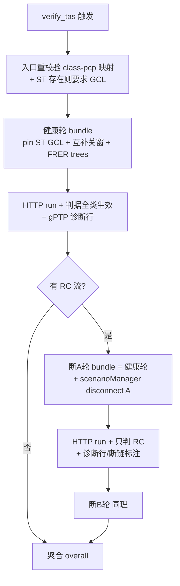

# feat: 三类流 ST/RC/BE 混跑（Qbv + CB + 断链容错验证）

## Summary

流量链路从仅 ST 扩展成 ST/RC/BE 三类混跑（pcp 固定 7/6/0）：RC 按 802.1CB FRER 装配（`StreamRedundancyConfigurator` + 显式 A/B trees），pin 仿真从 ST 门表推导互补关窗保护 ST，验证升级为多轮（健康 + 断 A + 断 B）与分级判据，每轮附 gPTP 收敛诊断行。前置一个宿主机 spike 单元押三项组合的真机契约。

---

## Problem Frame

单 ST 全链路已通，但混流无保护（真机实证 BE 恒开门压垮 ST：688ms/丢半）、docx 用例 3/6 的 802.1CB 一直空缺（验收清单中 xfail）、验证判据对三类流一把尺。上期已为本期预埋：`topology_streams.redundant/paths` 列、`FLOW_CLASSES` 含 RC、`derive_redundant_routes`+`assert_disjoint`（`flow_route.rs`，dead_code 标注待 RC 接入）——本期把它们接活。

---

## Requirements

Origin 需求 R1–R15 全量覆盖，不裁剪（见 origin: docs/brainstorms/2026-07-03-flow-three-class-st-rc-be-requirements.md）。分组对应：

- **录入与校验**（R1–R3）→ U2
- **规划**（R4–R6）→ U3
- **软仿装配**（R7 FRER → U4；R8 互补关窗 → U5；R9 断链 → U6；R10 gPTP 软仿验证 → U1/U8）
- **判据与场景**（R11–R13 分级判据、R15 诊断行 → U7；R14 混合场景 → U8）

---

## Key Technical Decisions

**KTD1 — FRER 走 `StreamRedundancyConfigurator` + 显式 trees，路径由我们 pin。** 宿主机 showcase `framereplication/automaticmultipathconfiguration` 证实 configuration 支持 `trees: [[[node...]],[[node...]]]` 显式路径列表——A/B 路径由 `derive_redundant_routes` 推导后直接下发，与产品「pin 住不让 INET 自算」哲学一致。不用 `FailureProtectionConfigurator`（自动派生冗余树，违背 pin）；不用 manual 配置（逐节点 splitter/merger/VLAN，复杂度爆炸）。`TsnNetworkBase` 自带条件化 `streamRedundancyConfigurator` 子模块槽（U6 spike 文档明记「将来 RC 直接开」），NED 不分叉。

**KTD2 — 断链 = ScenarioManager 运行时 disconnect，NED 连接保持全量。** `build_port_eth_map` 用全部链路建 ethN 门号（删链路生成 bundle 会让门号漂移、pin 的 GCL 对错端口）——故障轮不改 connections，用 `*.scenarioManager.script = xml("<script><at t='T'><disconnect src-module='X' src-gate='ethg$o[N]'/></at></script>")` 在运行中断开（语法源：INET `examples/mrp`），gate 下标即 ethN。断链不要求避开时钟树：双平面单跳拓扑上 RC 的 A 平面路径每条链路都是时钟树边（GM 经 SW1 下发），结构性避不开；故障轮判据只判 RC（origin F4）、R15 诊断只报告不判、断链后下游节点时钟自由运行（0.3ppm 级漂移对丢包计数无影响）——冲突消解为结果里的响亮标注，满足 R9「无法避开时响亮报告」。断点与 ST 流路由（verify 期推导的平面 A 路径）的重叠同样检查：优先选不与 ST 路由重叠的链路，避不开时同款响亮标注——R9 的两个避开对象（ST 路由、时钟树）一个不少。断链语义为单向 TX 口断开（对齐 docx「分别断开两个发送口」的发送口语义），非整链双向失效。

**KTD3 — 三轮 = 三次顺序 HTTP 提交，服务零改动。** `services/inet-sim-http` runner 固定跑单配置（无 `-c`），单运行锁只拦并发；`verify_tas_inner` 顺序生成三个独立 bundle（健康轮无 scenarioManager、故障轮带脚本）循环提交。某轮失败（load_failed/unreachable）继续跑余轮拿全量信息，overall 取最差。

**KTD4 — Z3 只喂 ST，synth bundle 只装 ST 流。** RC/BE 完全不进规划 bundle（app/识别/编码都不装），规划期不为 RC/BE 推路径——现实现对每条流跑 `derive_route(plane: None)`，双平面上 RC 双等长路径会 `AMBIGUOUS_ROUTE` 拖垮整个规划。无 ST 流：`plan_tas` 清空 `flow_plans` 并返回新 status `no_gating`（「无需门控」）；verify 闸从「GCL 非空」改为「有 ST 流才要求 GCL」；前端 `havePlan` 按钮闸同步改口径。pin 时只认 ST-pcp 门条目，存量 flow_plans 里的旧 gate0/gate6 条目忽略（防与互补关窗双写同门）。plan 过期指纹本期不做——ST 判 FAIL 的 reason 文案附「若近期改过 ST 流请重新规划」提示。

**KTD5 — 互补关窗 = 纯函数补集，仅在存在 BE/RC 流时生成，覆盖「有 ST 窗端口 × 全部非 ST 门」。** 纯 ST 会话不生成补集条目——无低优先级流量可防，关 gate0 只会无谓扣 gPTP，并保住已真机验证的 27us 基线与 pin ini 位级回归基线。混流会话内推导域按端口不按流：凡该端口有 ST 门窗，其余全部门（gate0..queue_count-1 除 ST pcp）都写补集窗——gPTP 走 gate0 且遍历全网端口，只给 BE/RC 流经的端口关窗会漏保护。补集算术：ST 开窗区间（mod 1ms 门周期）取并集后取补，转成 initiallyOpen/offset/durations。断言：补集中最长连续开窗 ≥ 端口速率下 MTU 帧发送时长，不满足响亮报错（防 BE 门永久锁死）。ST 门维持 `enableImplicitGuardBand = false`（真机验证的关键行，勿回退）；补集门不写该参数（默认 true，帧发不完不许进窗，天然防跨入 ST 窗）。

**KTD6 — 双平面上 ST/BE 缺省锁平面 A，RC 双路；预存 paths 仅凭证。** 双平面拓扑（链路带 plane 键）上 `derive_route(plane: None)` 对任何流都双路歧义——ST/BE 以 `plane: Some("A")` 推导（docx Qbv 用例即 E6→SW1→E3 主平面路径），RC 用 `derive_redundant_routes`。录入时把 A/B 路径（node_path + link_seqs，按平面分键的 JSON）写入 `paths` 作凭证；规划/验证时一律重推导 + 重跑不相交断言——拓扑在录流后被改动（删链/删节点无流引用检查）时以重推导响亮失败为准，预存值不作装配输入。双平面拓扑上 pin 仿真还须钉死 ST/BE 的实际转发路径：bundle 不写转发配置时 INET 缺省转发在环路双平面上的路径选择不受我们控制（可能落平面 B，门控全部落空）——U1 spike 押注实际行为，不落平面 A 则按 manualconfiguration showcase 语法用 `macTable.forwardingTable` 静态下发（接口经 ethN 映射）；单平面拓扑沿现状不下发。

**KTD7 — sim 时长只按 ST+RC 流计。** BE 灌流流的 count×period 不参与 `flow_sim_time_s`（否则灌流参数主导或远短于 ST 时长、争用测了个寂寞）；BE 源本就产包到 sim 结束。纯 BE 流集回退原公式。断链时刻锚定 RC 活跃窗：`t_break = 0.4 × min(RC 流 count×period)`，且不早于 gPTP 收敛/暖机窗口；尾量守卫按绝对帧量——断后每条被覆盖 RC 流应发帧数 ≥ 20，不足响亮报错提示调大 count（百分比守卫在 0.4 断点下恒不触发，不用）。

**KTD8 — 多 RC 流的故障轮每平面断一条覆盖最多流的链路。** 对候选链路统计其出现在多少条 RC 流该平面路径 link_seqs 中、取计数最大者；未被断链途经的 RC 流该轮标「未测容错」（展示、不判 FAIL）；不按流数倍增轮数。

---

## High-Level Technical Design

### 验证三轮时序



### 互补关窗推导（纯函数，方向性伪码）

```text
complement_gcl(pinned_gcl, nodes) -> Vec<GclEntry>:
  按 (node, eth_n) 分组 ST 门条目 → 每端口取 ST 开窗区间并集 (mod cycle=1ms)
  补集 = cycle 减去并集；空补集 → Err(端口被 ST 占满)
  max_open = 补集最长连续段；max_open < MTU帧发送时长(端口速率) → Err(补集窗容不下一帧)
  对该端口每个 gate g ∈ 0..queue_count, g ∉ ST pcp 集:
    生成 GclEntry{ node, eth_n, gate_index:g, initiallyOpen/offset/durations = 补集 }
```

### 六种流组合矩阵（验收基准，进 U8 夹具）

| 流集 | 进 Z3 | plan 产物 | verify 轮次 | 判据 |
|------|-------|-----------|------------|------|
| 纯 ST | ST | GCL | 健康 | ST 三项 |
| ST+BE | ST | GCL | 健康 | ST 三项 + BE 连通 |
| ST+RC | ST | GCL | 健康+断A+断B | ST 三项 + RC 两态 |
| 三类全有 | ST | GCL | 健康+断A+断B | 全部 |
| 纯 RC | 无 | 清表+no_gating | 健康+断A+断B | RC 两态（门全开、无互补关窗） |
| 纯 BE | 无 | 清表+no_gating | 健康 | BE 连通 |

---

## Implementation Units

### Phase A — 契约押注

### U1. 宿主机 spike：FRER × TAS × gPTP × 断链共存契约

- **Goal:** 手工构造最小双平面 bundle 在宿主机实跑，钉死四项契约，形成 solutions 语法文档；失败则触发退路评估。
- **Requirements:** R7、R9、R10 的可行性前提；KTD1/KTD2 的实证。
- **Dependencies:** 无（先行闸门）。
- **Files:** 无仓库代码改动；产出 `docs/solutions/inet-tas/2026-07-03-frer-tas-disconnect-spike.md`。
- **Approach:** 以 `framereplication/automaticmultipathconfiguration`（trees 语法）+ `combiningfeatures/frerandtas`（共存参考）+ `examples/mrp`（disconnect 语法）为模板，在现有 flow bundle 形态上手工加：`hasStreamRedundancy=true`、`streamRedundancyConfigurator.configuration`（显式 trees + packetFilter 对齐我们的 UDP 端口过滤）、scenarioManager 子模块与 disconnect 脚本。押注点：①FRER 与现有 per-PCP streamCoder encoder/decoder mapping 的编码共存（showcase 用 VLAN 编码，我们用 pcp——冲突则评估 RC 流走 configurator 自管编码、ST/BE 保持现状的混合形态）②R-TAG 去重后 sink 收包计数=发包（scavetool 验证）③断链后 gPTP 下游自由运行不 abort（时钟伺服无越界）④`ScenarioManager` 子模块在自定义 network NED 里的声明位置与 `hasStatus` 是否必需 ⑤双平面环路拓扑上 ST/BE 单播的实际转发路径——INET 缺省转发落哪个平面；不落平面 A 即启用 `macTable.forwardingTable` 静态下发（语法源 manualconfiguration showcase）。顺带观察：单向 TX 断开下对端链路状态与反向 gPTP 报文行为；一条恒发流压「向已断开门持续发帧不 abort」；FRER 恢复窗口默认值 vs 双平面时延差（doc-review FYI 项）。
- **Test scenarios:** Test expectation: none —— spike 单元，产出是真机验证结论与语法契约文档，不进仓库测试。
- **Verification:** 宿主机四押注全过（去重收=发、断 A 后仍收=发、gPTP 不发散、EXIT=0）；契约文档落 docs/solutions/。任一押注失败 → 停下评估退路（编码冲突→混合编码形态；disconnect 不可行→F4 故障轮整体降级并回报 boss），不带伤进 Phase B。

### Phase B — 录入 / 规划 / 装配

### U2. 录入闸三类化 + RC 双平面路径落槽

- **Goal:** class↔pcp 固定映射校验；RC 录入时推导 A/B 不相交路径写入预留槽，非双平面拓扑响亮拒绝。
- **Requirements:** R1、R2、R3（回归）；AE3。
- **Dependencies:** 无（可与 U1 并行）。
- **Files:** `src-tauri/src/flow_verify.rs`（校验闸）、`src-tauri/src/flow_sidecar_routes.rs`（RC 分支：推导+落 `redundant=1`/`paths`）、`src-tauri/src/flow_route.rs`（`derive_redundant_routes` 去 dead_code 接入）、`src-node/mcp/topology-tools.ts`（`flow.add_stream` description 补三类说明，透传面不变——paths 由系统推导非用户输入）；测试同文件 `mod tests`。
- **Approach:** `verify_flow` 增加 FIXED_PCP 映射（ST=7/RC=6/BE=0，违规 → 新错误码 `PCP_CLASS_MISMATCH`）；RC 前置判断：链路集无 plane 键 → `NOT_DUAL_PLANE`（「当前拓扑非双平面」，不是「平面 A 不可达」）；通过则 `derive_redundant_routes` + `assert_disjoint`，路径按 `{"a":{"node_path":[...],"link_seqs":[...]},"b":{...}}` 序列化进 `paths`。改 MCP description 后跑 `npm run build:worker`（AGENTS.md 三层归属：用法住 description）。
- **Patterns to follow:** 校验错误码与 `fail_with_flow_errors` 现有形态；`insert_stream` 单一助手不加第二写入路径（LinkAdd 漏列历史坑，docs/solutions/database-issues/link-add-skips-port-columns-empty-clock-tree.md）。
- **Test scenarios:** ①ST@pcp7/RC@pcp6/BE@pcp0 各录入成功且断言 `redundant`/`paths` 列值本身（非 JSON blob 整体比对）②ST@pcp5 拒绝 `PCP_CLASS_MISMATCH` ③Covers AE3. 5 跳线性拓扑录 RC → `NOT_DUAL_PLANE` ④双平面拓扑 RC 录入 → paths 两平面 node_path 不相交断言通过、列非 NULL ⑤talker 只挂单平面 → 平面 B `NO_ROUTE` 映射为「未接入双平面」文案 ⑥存量 ST/BE 录入行为回归（R3）。
- **Verification:** cargo test 绿；对话录入 RC 在真机双平面会话落库可查。

### U3. 规划分叉：Z3 只喂 ST + 空 GCL 合法化 + pin 过滤

- **Goal:** synth bundle 只装 ST；无 ST 流产出「无需门控」；verify/前端闸口径同步；pin 只认 ST-pcp 门。
- **Requirements:** R4、R5、R6；AE5 前半。
- **Dependencies:** 无（可与 U1/U2 并行）。
- **Files:** `src-tauri/src/flow_plan_command.rs`（specs 过滤 + `no_gating` status + 空集清表）、`src-tauri/src/flow_verify_command.rs`（`no_plan` 闸改「有 ST 才要求 GCL」+ 入口 class↔pcp 重校验 + pin 过滤非 ST 门条目）、`src/app/components/workspace-pane/flow-sim.ts` + `flow-panel.tsx`（`havePlan` 闸与 `no_gating` 文案）；测试同文件。
- **Approach:** `plan_tas_inner` 的 specs 组装只保留 `class=="ST"`（路径推导循环随之只对 ST 跑，双平面时 `plane: Some("A")`，见 KTD6）；ST 为空跳过求解直接 `write_flow_plans(空)` + 返回 `no_gating`；`gcl.is_empty() → solver_failed` 分支仅在有 ST 流时保留。verify 入口：加载流后先重校验 class↔pcp（存量不合规流 → 响亮拒绝提示重录，G1.3）；`load_gcl` 为空且存在 ST 流 → `no_plan`，无 ST 流 → 放行；pin 时过滤 `gate_index != ST pcp` 的存量条目（G2.4 防双写）。
- **Test scenarios:** ①ST+RC+BE 混合集 → synth ini 断言只出现 ST 的 app/identification/configuration 条目 ②纯 BE/纯 RC → `no_gating` 且 flow_plans 清空 ③Covers AE5. 纯 BE：plan `no_gating` 后 verify 放行 ④有 ST 无 GCL → 仍 `no_plan` ⑤存量 flow_plans 含 gate0 条目 → pin ini 无 gate0 的 transmissionGate 行（互补关窗接管前提）⑥存量 ST@pcp3 流 → verify 入口拒绝 ⑦双平面 ST 规划 → 路径为平面 A、无 `AMBIGUOUS_ROUTE`。
- **Verification:** cargo test + vitest 绿；`e2e_plan_then_verify_pipeline` 式管线测试扩三类后仍绿。

### U4. verify 装配：RC FRER + BE/ST 平面缺省 + 读流补列

- **Goal:** pin bundle 装配 RC 帧复制/消除与三类路由，verify 侧数据面打通。
- **Requirements:** R7；AE1 的装配前提。
- **Dependencies:** U1（语法契约）、U3（specs 形态）。
- **Files:** `src-tauri/src/inet_sim_bundle.rs`（FRER ini 段 + trees 组装 + `flow_sim_time_s` 改为只按 ST+RC 计（KTD7，纯 BE 回退原公式）+ 双平面静态转发表段（KTD6，按 U1 押注⑤结论））、`src-tauri/src/flow_verify_command.rs`（`load_streams` 补读 `redundant`/`paths`——按 KTD6 仅作展示凭证，装配前重推导）、`src-tauri/src/flow_plan_command.rs`（`load_streams` 共用则同步）；测试同文件。
- **Approach:** verify 时对 RC 流跑 `derive_redundant_routes`（对 ST/BE 按 KTD6 推导单路），bundle builder 新增 FRER 段：全网 `hasStreamRedundancy = true`（仅当存在 RC 流）、`streamRedundancyConfigurator.configuration` 每 RC 流一条 `{name, packetFilter(对齐该流 UDP 端口), source, destination, trees: [A 路 node_path 的 ned 名, B 路]}`；packetFilter 沿用 `expr(udp != nullptr && udp.destPort == N)` 守卫形态——a761dd9 空指针坑在新入口的复发路径，勿裸写 destPort。编码共存形态按 U1 契约落地。RC 流帧开销含 4B 802.1R（R-TAG），流量段 app 生成沿现状。双平面拓扑按 KTD6 生成 ST/BE 静态转发表段。
- **Patterns to follow:** ini 段拼接风格与既有 `build_flow_tas_ini` 各段一致；ned 名映射走 `node_ned_names`；ethN 一律经 `build_port_eth_map`。
- **Test scenarios:** ①RC 流 bundle 断言 ini 含 `hasStreamRedundancy` 与两条 trees（ned 名与 A/B node_path 一致）②无 RC 流 → ini 无 FRER 段（纯 ST 回归零变化，golden 对比）③RC packetFilter 端口与 placements 端口一致 ④paths 凭证与重推导不一致（拓扑已改）→ 以重推导为准且结果可跑（G1.2）⑤重推导断言失败（拓扑改成相交）→ 响亮报错不装配 ⑥FRER 段回归哨兵：不得出现裸 `expr(udp.destPort`（镜像 `stream_filter_guards_against_non_udp_packets`）⑦BE 灌流参数下 sim 时长由 ST/RC 决定、纯 BE 流集回退原公式（KTD7）。
- **Verification:** cargo test 绿；真机单 RC 双平面健康轮收=发（U8 复核）。

### U5. 互补关窗推导

- **Goal:** 从 pin GCL 推导非 ST 门补集窗，混流保护落地（治 688ms）。
- **Requirements:** R8；AE4 的保护前提。
- **Dependencies:** U3（pin 过滤后的 GCL 形态）。
- **Files:** `src-tauri/src/inet_sim_bundle.rs`（纯函数 `complement_gcl` + pin 段接入）；测试同文件。
- **Approach:** 见 HTD 伪码。生成门条件：会话存在 BE/RC 流（KTD5）——纯 ST 会话不生成任何补集条目，pin ini 与现状位级一致。补集条目走与 pin 相同的 transmissionGate 写参路径但不写 `enableImplicitGuardBand`（保持默认 true）；ST 门维持显式 false。无 ST 窗端口不生成条目（各门恒开，R8）。两类响亮报错：端口被 ST 占满、最长连续开窗容不下 MTU 帧。
- **Test scenarios:** ①单 ST 窗端口 → gate0/gate6 补集 = 周期减窗口、offset 对齐 ②多 ST 窗（多流同端口）→ 并集后补集正确、mod 周期回绕 case ③补集碎片全部短于 MTU 帧发送时长 → 响亮报错 ④无 ST 窗端口 → 无补集条目 ⑤ini 断言：ST 门带 `enableImplicitGuardBand = false`、补集门不带该行 ⑥queue_count=8 与非 8 节点的门下标域正确 ⑦纯 ST 会话 → 不生成任何补集条目（pin ini 位级回归）。
- **Verification:** cargo test 绿；U8 真机混合场景 ST 三项仍绿为最终裁决。

### Phase C — 故障轮 / 判据 / 验收

### U6. 断链故障轮编排

- **Goal:** 有 RC 流时验证跑三轮（健康+断A+断B），故障轮 bundle 带 ScenarioManager disconnect。
- **Requirements:** R9；AE2 的执行面。
- **Dependencies:** U1（disconnect 契约）、U4（RC 装配）。
- **Files:** `src-tauri/src/inet_sim_bundle.rs`（scenarioManager 子模块 + 脚本段，故障轮参数化）、`src-tauri/src/flow_verify_command.rs`（三轮循环 + 断点选择 + 轮间失败继续）、`src-tauri/src/timesync_tree.rs`（只读消费 `compute_clock_tree` 判断断链是否树边）；测试同文件。
- **Approach:** 断点选择：目标平面上对各 RC 流 A/B 路径 link_seqs 求覆盖计数取最大（KTD8），断链模块/门 = 该链路 talker 侧端点的 `ethg$o[ethN]`（ethN 经 `build_port_eth_map`）；`t_break = 0.4 × min(RC count×period)`，尾量断言（KTD7）。断点优先避开 ST 流路由（verify 期平面 A 路径）；断链落时钟树边或 ST 路由链路 → 该轮结果附对应响亮标注（KTD2）。t_break 不早于 gPTP 收敛窗、断后被覆盖 RC 流应发帧数 ≥ 20（KTD7）。三轮顺序调 `runner.run_sim_fetch_csv`（KTD3），单轮异常记录该轮 status 继续余轮——status 词表区分 load_failed / unreachable / busy（宿主机单运行锁 409 归 busy，环境冲突不与验证 FAIL 混淆）。未被断链覆盖的 RC 流该轮标「未测容错」。
- **Test scenarios:** ①Covers AE2. MockRunner 三轮编排：断 A 轮 ini 含 disconnect 脚本且 t 值=RC 活跃窗 40%、健康轮不含 ②断点覆盖计数：两条 RC 流共享链路时选中共享链路、不共享时未覆盖流标注 ③断后帧量不足 20 帧 → 响亮报错提示调大 count ④断链是时钟树边或 ST 路由链路 → 结果带对应标注 ⑤断 A 轮 Mock 返回 load_failed → 断 B 轮仍执行、overall 取最差 ⑥无 RC 流 → 单轮（现状回归）⑦disconnect 的 src-module/src-gate 与 port_eth 映射一致 ⑧断 A 轮 Mock 返回 409/busy → 该轮标 busy 不判 FAIL、余轮继续。
- **Verification:** cargo test 绿；真机断链轮 RC 仍收=发（U8）。

### U7. 分级判据 + 多轮结果契约 + gPTP 诊断行

- **Goal:** classify 按类分叉、结果 DTO 升级 per-round、每轮附 gPTP 收敛诊断（只报告不判）。
- **Requirements:** R11、R12、R13、R15；AE1/AE4 判据面。
- **Dependencies:** U6（轮结构）。
- **Files:** `src-tauri/src/flow_verify_command.rs`（classify 分叉 + rounds DTO + filter 拼 timeChanged 子句）、`src-tauri/src/inet_sim_command.rs`（`parse_timechanged_csv`/`steady_state_offset`/`load_timing` 复用面按需 `pub(crate)`）、`src/app/components/workspace-pane/flow-sim.ts`（DTO 镜像）、`flow-panel.tsx`（`VerifyResultArea` 多轮分组 + class 列 + 诊断行 + BE 送达率并列展示）；测试同文件 + serde camelCase 契约测试。
- **Approach:** 判据分叉：ST 三项不动（在途容差/跳首包 jitter 逻辑保留）；RC 健康轮判去重后收=实发±在途容差（容差逐轮自计：该轮该流 sink 实测 max 时延套现行公式——健康轮自然是首达路、故障轮自然是存活路，origin R12「按较长一路计」由逐轮自计实现，无需消除点前 per-path 向量）+ 收>实发即重复帧 FAIL，故障轮同口径判零丢包、只判被断链覆盖的流；BE 判 received>0，送达率并列展示不判；故障轮跳过 ST/BE 判决（结果标「仅健康轮判」）。ST FAIL reason 附「若近期改过 ST 流请重新规划」（KTD4）。诊断行：`FLOW_VERIFY_FILTER` 拼 `OR (module =~ "**.clock" AND name =~ "timeChanged:vector")`，同一份 CSV 分别过 `parse_vec_csv` 与 `parse_timechanged_csv`，`steady_state_offset` 对 GM 插值算逐节点稳态 offset，与 `timesync_nodes.offset_threshold` 比对生成「gPTP 收敛：N/M 节点 ≤ 阈值」行；故障轮预期劣化照实报告。展示层对 RC 健康轮时延/抖动标注「首达路实测」——慢副本被消除点吞掉，防误读为双路都达标。
- **Test scenarios:** ①Covers AE1. RC 健康轮收=实发±容差且无重复 → PASS；收>实发 → FAIL（消除失效）②RC 缺口超容差 → FAIL、缺口在容差内 → PASS（在途）③Covers AE4. 混合夹具：ST 三项 + RC 两态 + BE received>0 全绿 → overall PASS；ST 抖动超标 → ST FAIL 不被 BE/RC 绿灯掩盖 ④BE 零收包 → FAIL、有收包但丢一半 → PASS 且送达率展示 50% ⑤故障轮向量里 ST 流劣化 → 不影响该轮判决（只判 RC）⑥诊断行：夹具 CSV 含 clock 向量 → 逐节点收敛计数正确、阈值缺省回退 1000ns ⑦serde 契约：rounds/classVerdict/gptpDiag camelCase 字段断言 ⑧空/短向量 → 该流该轮 FAIL 不染绿（R16 沿袭）。
- **Verification:** cargo test + vitest 绿；前端多轮卡片真机可读。

### U8. 组合矩阵夹具 + 验收清单翻正 + 真机全链路

- **Goal:** 六组合矩阵进测试基线，CB 用例 3/6 从 xfail 翻正，混合场景真机验收（R10 的软仿验证在此完成）。
- **Requirements:** R10、R14；AE4/AE5 端到端；docx 用例 3/6。
- **Dependencies:** U2–U7 全部。
- **Files:** `src-tauri/src/flow_verify_command.rs` 或独立 `#[cfg(test)]` 矩阵模块（MockRunner 夹具）、`docs/solutions/inet-tas/2026-07-02-u10-flow-tas-acceptance-checklist.md`（翻正 + 补故障态条目）；测试为主。
- **Approach:** 按 HTD 六组合矩阵逐行建 MockRunner 夹具断言（进 Z3 的流 / plan 产物 / 轮次 / 判据），冻结为回归基线。真机验收：双平面单跳会话录 ST(E6→E3)+RC(E6→E3)+BE 灌流 → 规划 → 验证三轮全绿 + gPTP 诊断行全轮可读 + 断链轮标注正确；纯 BE 灌流会话真机跑一轮——R10「纯 BE 场景必测」，诊断行确认 pcp0 队列争用下时钟收敛；纯 ST 会话回归（27us 量级不劣化）。R10 判定：混合场景健康轮诊断行显示全节点收敛 ≤ 阈值即通过；劣化 → 触发「gPTP 独立通道」备选评估（回报 boss，不在本期自作主张实现）。
- **Test scenarios:** ①六组合矩阵各一夹具（Covers AE4/AE5 的机器可跑面）②Covers AE4. BE 灌流参数下 sim 时长仍由 ST/RC 决定（KTD7 断言）③验收清单 CB 3/6 条目翻正后与矩阵夹具一一对应。
- **Verification:** `npm test` + `npm run cargo:test` + e2e 全绿；真机验收清单过；纯 ST 回归无劣化。

---

## Scope Boundaries

沿 origin 不做：CBS/ATS/帧抢占、录入面板 UI、802.1Qci、硬件真机 CB 部署、RC/BE 时延抖动阈值。

### Deferred to Follow-Up Work

- plan 过期指纹（ST 流集 hash 落库比对）——本期以 FAIL 文案提示替代（KTD4）。
- 验证结果落库（三轮结果仍是 UI 态，切会话丢失）——沿现状。
- 多 RC 流的全覆盖断链轮（轮数×N）——本期覆盖最多流的一条链 + 未覆盖标注（KTD8）。
- per-流平面选择字段（ST/BE 锁平面 A 的解除）——需 schema 变更，待真实需求。
- gPTP 独立通道（R10 备选）——仅在真机诊断显示劣化时评估，回报 boss 决策。

---

## Risks & Dependencies

- **R7/R9 双押 U1 spike**：FRER 编码共存或 disconnect 任一失败，Phase B/C 的一半落地路径要改道——spike 先行、带明确退路门（U1 Verification）。
- **健康轮对冗余零区分度**：FRER 坏到只走单路时健康轮照样全绿——故障轮因此是 RC 验证的必要组成（断 A/断 B 成对兜住单路退化），U6 不可裁剪。
- **断链瞬间在途帧行为**（截断丢弃 vs 发完）未核实，影响「零丢包」在断链时刻附近的严格性——在途容差口径（R12）已缓冲；U1 spike 顺带观察。
- **三轮墙钟 ×3**（单轮分钟级、轮询上限 1800s/轮）——前端文案报轮次进度（U7），不做取消。
- **宿主机服务零改动**是 KTD3 前提——若实现期发现需服务侧配合，走 scp + systemd 自愈部署流程（服务非 git 管理）。
- 惯例坑：改 `topology-tools.ts` 后必跑 `npm run build:worker`；pre-commit 不跑 rustfmt/clippy 须手跑（CI `-D warnings` 会拦）。

---

## Sources & Research

- Origin：docs/brainstorms/2026-07-03-flow-three-class-st-rc-be-requirements.md（R1–R15、AE1–AE5、六决策）。
- 真机契约：docs/solutions/inet-tas/2026-07-01-u1-spike-tas-contracts.md（GCL dump/param-recording/向量名；其丢包判据建议已被推导式取代）、2026-07-02-u6-spike-flow-tas-ini-syntax.md（流识别/编码语法、TsnNetworkBase 条件子模块槽；其 gate 分配节已被 per-PCP 取代）、2026-07-02-u10-flow-tas-acceptance-checklist.md（验收两层分法、CB 3/6 xfail 待翻正）。
- 宿主机 showcase（zhang@100.104.38.106 `~/inet-workspace/inet-4.6.0/`，2026-07-03 实地核对）：`showcases/tsn/framereplication/automaticmultipathconfiguration/omnetpp.ini`（StreamRedundancyConfigurator 显式 trees 语法）、`showcases/tsn/combiningfeatures/frerandtas/omnetpp.ini`（FRER×TAS 共存、R-TAG 4B 帧开销）、`examples/mrp/scripts.xml`（`<disconnect src-module src-gate>` 语法）。
- 代码落点：`src-tauri/src/flow_route.rs`（`derive_redundant_routes`/`assert_disjoint` 预埋）、`flow_verify.rs`（校验闸/FLOW_CLASSES）、`flow_sidecar_routes.rs`（`insert_stream` 单一助手）、`flow_plan_command.rs`/`flow_verify_command.rs`/`inet_sim_bundle.rs`（本期主战场）、`inet_sim_command.rs`（收敛判据三件套复用）、`timesync_tree.rs`（时钟树边判定）、前端 `flow-sim.ts`/`flow-panel.tsx`。
- 历史坑事实源：BE 恒开门 688ms、ST 门关隐式保护带 527→27.66us、gPTP packetFilter 空指针守卫（分支 feat/flow-tas-qbv-inet 提交 6ae7b51/f86c2f9/a761dd9）；LinkAdd 漏列（docs/solutions/database-issues/link-add-skips-port-columns-empty-clock-tree.md）。
