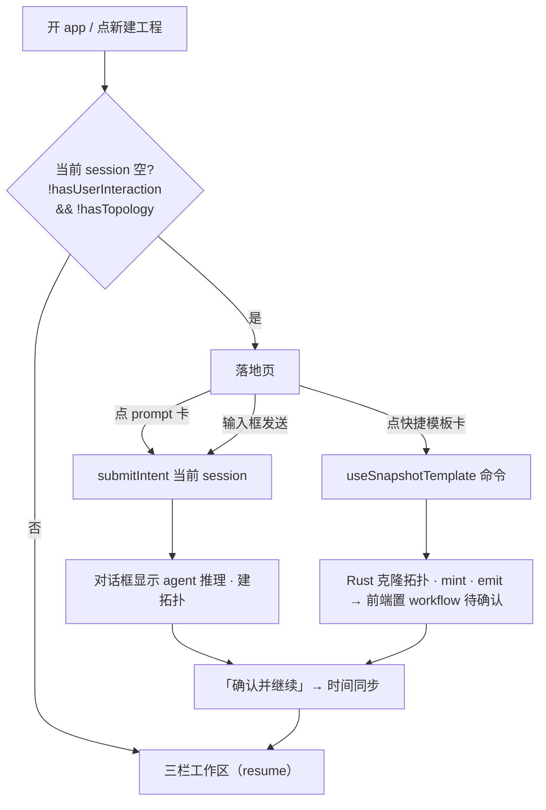

# feat: 启动引导页 + 工程模板体系

## Summary

给 HIBridge Agent 加一个「新建工程 / 首启」落地页：NL 输入框 + 两类隔离模板（prompt 模板 = 新人看 agent 现跑；快捷模板 = 熟手确定性秒建），模板落进新 DB 表 `project_templates`（一张表按 `kind` 判别），出厂 prompt 模板一次性播种。落地页在"空 session"时取代三栏工作区；有工程则 resume。画布右上角加「设为模板」把当前拓扑导出为快捷模板。

## Problem Frame

今天开 app 或点「新建工程」直接落进对话 stepper + 空画布（`src/app/App.tsx` 恒渲染三栏，无空态）。新人面对空输入框不知输入什么，卡在第一步（see origin: `docs/brainstorms/2026-07-09-onboarding-landing-project-templates-requirements.md`）。落地页给新人一个"一点就活"的起步入口。

## Requirements

覆盖 origin 全部 R1–R25、F1–F6、AE1–AE6。按单元追溯（见各 U 的 **Requirements**）。要点：

- **落地页与入口**（R1–R6）：空 session 显落地页、有工程 resume；输入框 + 范例 chips + prompt 画廊 + 快捷模板区 + disabled 知识库；去掉两个旧 chip；flex-wrap + 真机验证。
- **两类模板**（R7–R9, R23–R25）：prompt / 快捷两类隔离、卡片"快/慢"视觉区分、卡名=起点意图、单击即建无预览、可排序/硬删。
- **启动流**（R10–R13）：prompt 使用=当前空 session 上 `submitIntent`；快捷使用=确定性重建；两路汇入同一 session 停拓扑阶段待确认；NL 路径不变。
- **设为模板**（R14–R15）：画布快照拓扑完整行 + 来源 scenario。
- **数据/播种/分类**（R16–R19）：新表、一次性播种（防复活）、场景派生分类、命名不泄 identifier。
- **约束**（R20–R21）：不改名、知识库仅占位。

---

## Key Technical Decisions

KTD1. **一张表 + `kind` 判别。** `project_templates` 单表，`kind ∈ {prompt, snapshot}`，`prompt_text` 与 `topology_snapshot` 均可空（按 kind 二选一填）。排序/查询统一，避免两表 join；隔离在 UI 与 `kind` 过滤，不需两张表（origin Deferred 项收口）。

KTD2. **落地页由显式 `showLanding` UI 状态驱动，不纯靠派生判断。** 点「新建工程」**直接**置 `showLanding=true` 进落地页（不经"空 session"判断）；首启无任何真实工程时也 `true`；用户在落地页发起（prompt / snapshot / NL 提交）后置 `false` 切三栏；选中或恢复已有工程置 `false`（resume-first）。派生信号 `!hasUserInteraction && !hasTopology`（`src/app/App.tsx:176-177`）仅作兜底参考，不作唯一开关。

KTD3. **prompt 模板「使用」在当前空 session 上 `submitIntent`。** 不新建 session（当前空 session 即工程），绕开 `submitIntent`（`src/app/App.tsx:194`）闭包 `currentSession` 的时序坑（origin Deferred 项）。提交后 session 转非空 → 自动切回三栏显示推理。

KTD4. **快捷模板「使用」职责拆分：Rust 只写拓扑行 + mint + emit + 返回 scenario；前端驱 workflow。** Rust `use_snapshot_template` 复用 `src-tauri/src/topology_sidecar_routes.rs` 的 `persist_initialized_topology`（:233 mint mutationId + `(state.emit)(record)`）写全字段拓扑行，不走 `initialize`（它只能算 hop-linear/dual-plane，无法还原任意几何），并把快照的 `scenarioConfigId` 返回给前端。**前端**在 `useSnapshotTemplate` resolve 后镜像 agent-run 完成路径：用 `recordStageResult(workflow, {step:"topology", ...})`（省略 `waitingConfirmation:false` 即得 `waiting_confirmation`）构造工作流态、写回 `workflow.scenarioConfigId`、经 `repository.save` 持久化，并同步切出落地页（不等 async 拓扑 refetch）。

KTD7. **workflow / scenario 是前端 session payload 独占，Rust 写不了。** `WorkflowState`（含 `currentStep`/stage status/`scenarioConfigId`）只作为 TS 字段序列化进 `sessions.payload` blob，唯一运行时驱动是 agent-run 结果在前端应用（`src/app/App.tsx:359 workflow: result.workflow`），且下次 `repository.save` 会覆盖任何 Rust 写进 payload 的内容。故所有 workflow/scenario 变更必须在前端做（约束 KTD4/U3/U5 的职责边界）。

KTD5. **出厂播种用 migrations 版本项 / `app_state` sentinel，不用 seed-if-absent。** sqlx `migrations()`（`src-tauri/src/db.rs`）按 checksum 每库执行一次；硬删项不会因启动/加列迁移复活（保 AE4）。`src-tauri/src/skill_files.rs` 的「缺失即补播」是**反例**，勿套用。

KTD6. **快捷模板存"全字段拓扑行 + 来源 scenario"的 JSON 快照，不止几何。** 否则下游时间同步/软仿缺 scenario、节点类型、MAC、连线（对照 `src-tauri/src/db.rs` `SESSION_SCOPED_TABLES` 的 topology_nodes/links 字段）。

---

## High-Level Technical Design

落地页触发与两条「使用」路径：

`project_templates` 表形态（列，非最终 DDL）：

| 列 | 说明 |
|---|---|
| `id` | 主键 |
| `kind` | `prompt` \| `snapshot` |
| `scenario_config_id` | 场景（分类由此派生：aerospace-onboard / generic-tsn） |
| `title` / `subtitle` | 卡片文案（卡名=起点意图，R24） |
| `prompt_text` | kind=prompt 时的构建 prompt（否则 NULL） |
| `topology_snapshot` | kind=snapshot 时的全字段拓扑行 JSON（否则 NULL） |
| `sort_order` | 排序 |
| `origin` | `factory` \| `user` |
| `created_at` | 建行时间 |

---

## Implementation Units

### U1. DB 表 `project_templates` + 一次性播种

- **Goal:** 建表并把出厂 prompt 模板一次性播种（防复活）。
- **Requirements:** R16, R17, R18, R19；AE4。
- **Dependencies:** 无。
- **Files:** `src-tauri/src/db.rs`（CREATE 块加表 + `safety_net_schema_sql` 同步 + `migrations()` 加播种版本项）；测试在 `src-tauri/src/db.rs` 的 `#[cfg(test)]`。
- **Approach:** **单一新 `migrations()` 版本**内自包含 `CREATE TABLE IF NOT EXISTS project_templates(...)` + 出厂 prompt 的 `INSERT`（同一 version SQL，checksum 一次冻结）——不可拆成"CREATE 进 safety_net / INSERT 进 migration"（两条独立连接，顺序无保证 → migrator 可能先 INSERT 撞 `no such table`）；也**绝不**把列追加进已冻结常量（`P0_DOMAIN_SCHEMA_SQL` 等，会让老库 `VersionMismatch` bricked）。同时把**同款 `CREATE TABLE IF NOT EXISTS`** 也加进 `safety_net_schema_sql()` 作双写网（但 safety_net **不含** INSERT，否则每次启动补种复活，违反 AE4）。**文案定稿后再落此迁移**（migration 一经发布即冻结；见 Open Questions），若排期紧则本期先 CREATE、种 0 行，随后续 PR 定稿时补 seed 迁移。列见 HTD 表。**出厂 seed = 三条 prompt 模板（已定稿）**：
  - 线型拓扑（scenario `generic-tsn`）：「帮我搭一个线型 TSN 网络：5 台交换机首尾串联成一条链，链路两端各挂 1 个端系统，链路 1Gbps 全双工。」→ agent 走 `hop-linear` 生成器。
  - 星型拓扑（scenario `generic-tsn`）：「帮我搭一个星型 TSN 网络：1 台中央核心交换机，下接 4 个端系统，每个端系统独立千兆链路直连交换机。」→ 无生成器，agent 用 `apply_operations` 现搭（星型生成器见 Deferred to Follow-Up Work）。
  - 双平面冗余拓扑（scenario `aerospace-onboard`）：「帮我搭一个双平面冗余 TSN 网络：A、B 两套完全独立平面各 2 台交换机，4 个端系统同时接入两个平面，用于航空航天等高可靠场景。」→ agent 走 `dual-plane-redundant` 生成器。
  分类显示名由场景 `displayName` 派生：`generic-tsn`→「普通」、`aerospace-onboard`→「航空航天」（如现 displayName 非此值，U5/U1 对齐为「航空航天」）。
- **Patterns to follow:** `db.rs` `migrations()` 版本向量 + checksum；`app_state` kv；后续加列用 pragma 守卫幂等式（`ensure_*_column`）。**反例**：`skill_files.rs` 缺失即补播。
- **Test scenarios:**
  - Covers AE4. 全新库执行迁移播种 N 行；同库二次启动不重复（无重复行）。
  - Covers AE4. 硬删一行 factory 后重跑迁移/重启 → 不复活。
  - 模拟未来加列迁移后重启 → 不复种。
  - 仅走 migrator 路径（无 safety_net）也能产出 N 行种子；safety_net 单独建表得零行（种子只在迁移里）。
  - `safety_net_schema` 与迁移后 schema 一致（既有一致性测试通过）。
- **Verification:** 全新库启动后 `project_templates` 有 N 行 factory prompt；删后重启行数不回升。

### U2. Rust 模板 store 命令（list / delete / reorder / create-snapshot）

- **Goal:** 模板读、硬删、排序、从 session 快照建用户模板。
- **Requirements:** R7, R8, R9, R14, R15, R22。
- **Dependencies:** U1。
- **Files:** `src-tauri/src/template_store.rs`（新，sqlx 查询 + `#[tauri::command]`）；`src-tauri/src/lib.rs`（注册 invoke_handler）；测试在 `template_store.rs` `#[cfg(test)]`。
- **Approach:** `list_project_templates` 按 `sort_order` 返回行；`delete_project_template(id)` 硬删；`reorder_project_templates(ordered_ids)` 批量写 `sort_order`；`create_snapshot_template(session_id, title, scenario_config_id)` 读该 session 的 `topology_nodes`/`topology_links` **每一列**（含 `x`/`y`/`styles_json`）→ 序列化 `topology_snapshot` JSON → INSERT `kind='snapshot', origin='user'`。**scenario 由前端显式传入**（前端持 `currentSession.workflow.scenarioConfigId`），Rust 不解析 payload JSON（KTD7）。硬删确认门在前端（R22），命令本身直接执行。
- **Patterns to follow:** 既有 sqlx 命令 + `lib.rs` 注册（timesync/flow 命令）；`db.rs` `SESSION_SCOPED_TABLES` 列拷贝参考。
- **Test scenarios:**
  - list 按 `sort_order`；reorder 后 list 顺序变。
  - delete 后 list 不含该行；delete 不存在 id → no-op 不报错。
  - Covers R14. create_snapshot_template 从含拓扑 session 建行 → `topology_snapshot` 逐列含全部节点/连线字段（`x`/`y`/`styles_json`）+ 传入的 scenario。
  - create_snapshot_template 对空拓扑 session → 返回错误（不建空快照）。
- **Verification:** 前端 invoke 可列/删/排/建快照。

### U3. Rust 快捷模板确定性重建命令

- **Goal:** `use_snapshot_template` 把快照拓扑确定性重建进目标 session（写行 + mint + emit），并**返回快照的 scenario 给前端**。workflow 待确认与 scenario 落地由前端做（KTD7）。
- **Requirements:** R11, R12；AE3, AE6。
- **Dependencies:** U1, U2。
- **Files:** `src-tauri/src/template_store.rs`（加命令）；`src-tauri/src/lib.rs`（注册）；复用 `src-tauri/src/topology_sidecar_routes.rs` 的 persist/emit；测试同文件。
- **Approach:** `use_snapshot_template(template_id, session_id) -> { scenario_config_id, mutation_id }`：读 `topology_snapshot` → 写该 session 的 `topology_nodes`/`topology_links` **每一列**（含节点 `x`/`y`、`topology_links.styles_json` 的 plane/role/端口标签——否则重建拓扑丢布局与配色）→ 复用 `persist_initialized_topology`（mint mutationId + emit，前端 `useTopologySnapshot` 重取）→ 返回 scenario。**不碰 workflow / scenario payload**（KTD7），也不跑 LLM。
- **Patterns to follow:** `topology_sidecar_routes.rs:233` persist_initialized_topology；`db.rs` topology_nodes(x/y)/topology_links(styles_json) 列。
- **Test scenarios:**
  - Covers AE3. use_snapshot_template → 目标 session 拓扑行 == 快照（逐列相等，含 `x`/`y`/`styles_json`）；mutationId 递增；emit 触发。
  - Covers AE6. 命令返回的 `scenario_config_id` == 快照来源 scenario。
  - 无效 template_id / 非 snapshot kind → 错误。
  - （workflow 置 `waiting_confirmation` / 确认按钮出现的断言在 U5 前端测试，非此 Rust 单元。）
- **Verification:** 前端点快捷模板 → 画布秒现拓扑（含布局/配色）+ 确认按钮（U5 驱动），无推理流。

### U4. 前端模板服务 + 类型

- **Goal:** invoke 包装 + TS 类型，供落地页/画布消费。
- **Requirements:** R7–R11, R14, R22。
- **Dependencies:** U2, U3。
- **Files:** `src/templates/template-service.ts`（新）、`src/templates/template-types.ts`；co-located 测试 `src/templates/template-service.test.ts`。
- **Approach:** 镜像 `src/skills/skill-file-service.ts`（`createXxxService` + `isTauriRuntime` 浏览器兜底）。方法：`listTemplates` / `deleteTemplate` / `reorderTemplates` / `createSnapshotTemplate` / `useSnapshotTemplate`。
- **Patterns to follow:** `src/skills/skill-file-service.ts`、`src/app/inet-sim-http-config.ts`。
- **Test scenarios:** 各方法以正确命令名/参数调 invoke（mock）；浏览器兜底行为（非 Tauri）。
- **Verification:** tsc 通过、单测绿。

### U5. 落地页组件 + 接入 App.tsx（frontend-design）

- **Goal:** 落地页 UI（输入框 + 范例 chips + prompt 画廊 + 快捷模板区 + 知识库占位）+ 卡片交互 + 空态 + 删除确认 + 排序；App.tsx 按"空 session"条件渲染落地页 vs 三栏。
- **Requirements:** R1–R13, R21–R25；AE1, AE2, AE3, AE5。
- **Dependencies:** U4。
- **Files:** `src/app/components/landing/LandingPage.tsx`（新，含 TemplateCard / ExampleChips 等子组件）、`src/app/App.tsx`（条件渲染 + 空 session 判定）、`src/app/App.css`（落地页样式，flex-wrap）；co-located 测试 `src/app/components/landing/LandingPage.test.tsx`。
- **Approach:** 用 **frontend-design** 技能产出落地页视觉（两类卡"快/慢"角标 R23、场景分组、chips、空态、disabled 知识库 R21）。App.tsx：新增显式 `showLanding` 状态——`handleNewSession`（:421）置 `true`、首启无真实工程置 `true`、提交/使用/选工程置 `false`（KTD2）；`showLanding` 时渲染 `<LandingPage>` 取代 `ChatPane`+`WorkspacePane`（`WorkspaceTools` 导航栏保留），否则渲染现三栏。交互：prompt 卡 → `submitIntent(prompt)`（当前空 session，KTD3，`submitIntent` 由 App 下传）；snapshot 卡 → `useSnapshotTemplate(id, currentSession.id)` resolve 后**在前端**镜像 agent-run 完成路径：用返回的 scenario + `recordStageResult(workflow,{step:"topology",...})` 置 topology `waiting_confirmation`、写 `workflow.scenarioConfigId`、`repository.save` 持久化，**同步切出落地页**（不等 async 拓扑 refetch，KTD4/KTD7）；example chip → `setInput(exampleIntent)`（R5）；删除 → `ConfirmDialog`（R22，复用 `App.tsx:575`）；排序 → 拖拽 + 上移/下移按钮回退（WebKit，见 Open Questions）。**点击守卫**：卡片点击触发后立即锁定被点卡（及整墙），直到视图切走——防重复点（prompt 卡是真 LLM 轮次、snapshot 卡的 async 窗口都会重复触发；现有 `isAgentRunning` 不覆盖 snapshot 的确定性路径）。卡名文案=起点意图（R24）；单击即建、无预览（R25）。**IA 主次指令给 frontend-design**：模板画廊为首屏主内容（新人先扫模板），NL 输入框次级、常驻但非首要焦点。空态：某场景分组空→隐藏标题；快捷区首次空→引导"去画布右上角设为模板"；`listTemplates` 是本地 sqlite、near-instant，不做单独 loading 态（避免空态文案闪现）。落地页→三栏为即时条件换挂（桌面工具，无过渡动画）。
- **Execution note:** 先用 frontend-design 生成视觉，再接线交互。
- **Patterns to follow:** WebKit `flex-wrap`（`App.css` `.skill-detail-layout` 先例，避 grid 塌行）；`ConfirmDialog`（`App.tsx`）；scenario `exampleIntent`（`src/domain/scenario-config.ts`）。真机截图验证（R6）。
- **Test scenarios:**
  - Covers AE1. `showLanding` true（点新建工程 / 首启无真实工程）→ 渲染落地页；提交 / 使用 / 选工程后 false → 渲染三栏。
  - Covers AE2. 点 prompt 卡 → `submitIntent` 被调用（mock）→ session 非空后切三栏。
  - Covers AE3. 点 snapshot 卡 → `useSnapshotTemplate` 被调用 → resolve 后前端置 workflow topology `waiting_confirmation`（确认按钮出现）并切出落地页。
  - Covers AE5. prompt 卡只在场景分组、snapshot 卡只在快捷区（不混）。
  - 快速双击一张卡 → `submitIntent`/`useSnapshotTemplate` 只调用一次（点击守卫）。
  - 上移/下移按钮改序 → 顺序变且调 `reorderTemplates`（拖拽路径靠真机截图，R6）。
  - 硬删经 `ConfirmDialog` 确认后才调 `deleteTemplate`。
  - example chip 点击填入输入框。
  - 空态：场景分组空 / 快捷区空的呈现。
- **Verification:** 真机（dev）截图：首启/新建显落地页；点 prompt 卡看推理；点 snapshot 卡秒建 + 确认按钮；删除有确认。

### U6. 画布「设为模板」按钮 + 快照建模板

- **Goal:** 拓扑画布右上角「设为模板」→ 快照当前 session 拓扑 + 场景为用户模板。
- **Requirements:** R14, R15；F5；AE6。
- **Dependencies:** U4。
- **Files:** `src/app/components/workspace-pane/index.tsx`（`topology-stats` 加按钮，:652 与「撤销」并排）、`src/app/App.css`（按钮样式）；测试在 workspace-pane 既有测试或新增。
- **Approach:** `topology-stats` 加「设为模板」按钮，`disabled={!hasTopology}`；点击 → 按钮原位换成**内联文本框**（Enter=确认、Escape=取消），标题留空则取场景显示名作默认 → `createSnapshotTemplate(sessionId, title, currentSession.workflow.scenarioConfigId)`（scenario 显式传，KTD7）→ 成功 `transfer-notice`；**失败**（DB 写错/空拓扑）显 `transfer-notice` error 变体。
- **Patterns to follow:** 撤销按钮内联确认（`workspace-pane/index.tsx:656` 的 `undoConfirming` 就地切换）；`transfer-notice` 成功/error 提示。
- **Test scenarios:** 按钮 `disabled` 当无拓扑；点击→内联框；空标题取场景名默认；Escape 取消不建；确认调 `createSnapshotTemplate` 成功显提示；命令失败显 error 提示。
- **Verification:** 真机：有拓扑 session 点「设为模板」→ 落地页快捷区出现该模板 → 用它新建工程拓扑一致且带场景（AE6）。

---

## Scope Boundaries

**Deferred for later（carry from origin）**
- 恢复出厂 / 拓扑推荐；三态播种 / 软删墓碑。
- 编辑出厂模板内容、从落地页凭空新建模板。
- 模板携带时间同步(GM)/流量、整局项目快照。
- 知识库内容层（仅 disabled 占位按钮，本期不建 DB 列）。
- 模板跨机导入/导出、团队共享。
- 出厂模板升级投递（只播种一次 = 存量用户不获后续出厂模板，显式接受）。

**Outside identity（carry from origin）**
- 落地页做成通用项目管理器 / 搜索优先的大规模模板库。

**Deferred to Follow-Up Work**
- **星型拓扑生成器**：本期星型 prompt 模板靠 agent `apply_operations` 现搭（非确定性）；后续加一个 `star` 拓扑生成器（同 `hop-linear`/`dual-plane-redundant` 落 `topology_compute.rs` + `describe_templates`），让星型也确定性可复用。

---

## Open Questions

**Deferred to implementation**
- （出厂 prompt 已定稿为三条：线型/星型/双平面，见 U1。）
- 「工程」导航项在有活跃工程时点击的行为（回落地页 / 保持当前 / 弹新建入口）（origin 遗留，U5/KTD2）。
- 快捷模板区是平铺还是按来源场景分组（origin 遗留，U5；场景已随快照携带，此处仅展示）。
- resume「上次工程」损坏/半成品 session 的降级出口：本 plan 默认信任现有 session 状态、不做降级；如需再议（U5/KTD2）。
- 拖拽排序在 WebKit flex-wrap 下的回退交互（上移/下移按钮 vs 长按菜单）（U5）。
- `create_snapshot_template` 对空拓扑 session 的处理（本 plan 取"拒绝并报错"）（U2）。
- 落地页剩余视觉细节（主次已定：画廊主、输入框次；其余 frontend-design 阶段定，U5）。
- 是否显示 `origin`/badge（factory vs user）。

---

## Risks & Dependencies

- **快照重建的 Rust↔前端接线是最易错点**：Rust 写行 + mint + emit（漏 emit → 画布空白）；**前端**须置 workflow `waiting_confirmation`（漏则拓扑出现但无确认按钮）——两半都做齐才对，真机验证（KTD4/KTD7）。
- **prompt 模板现跑非确定**：卡名可能与产出漂移（origin R24 已用"起点意图"文案缓解，非本 plan 修）。
- **WebKit flex-wrap**：拖拽排序不稳、grid 塌行——用 flex-wrap + 按钮回退 + 真机截图（R6）。
- **依赖**：复用 `topology_sidecar_routes` persist/emit 机制、scenario 系统（`scenario-config.ts`）、`ConfirmDialog`。

---

## System-Wide Impact

- **App.tsx 渲染分叉**（落地页 vs 三栏）是入口级改动——须保证有真实 session 时行为与今天完全一致（resume 不回退）。
- **新 DB 表 + 迁移**：`db.rs` schema 变更，`safety_net_schema` 与 `migrations()` 须同步；新命令注册进 `lib.rs`。
- **命名**：新表/命令/符号用 `session`/`Tsn*` 风格，不把「工程/模板」泄进打包 identifier `com.tsnagent.app`（R18）。

---

## Sources & Research

- 本会话已核实的集成点：`src/app/App.tsx`（:176-177 hasUserInteraction/hasTopology、:194 submitIntent、:421 handleNewSession、:575 ConfirmDialog、:493 render）、`src/app/hooks/use-session-repository.ts`（:173 handleNewSession、:187 handleDeleteSession→ensureCurrentSession）、`src/app/components/workspace-pane/index.tsx`（:652 topology-stats + 撤销按钮）。
- `src-tauri/src/topology_sidecar_routes.rs`（persist_initialized_topology :233 mint mutationId + emit）、`src/project/project-state.ts`（actionsForStage / waitingConfirmation）、`src-tauri/src/db.rs`（migrations()/app_state/SESSION_SCOPED_TABLES）、`src-tauri/src/skill_files.rs`（seed-if-absent 反例）、`src/domain/scenario-config.ts`（exampleIntent/scenario 派生源）、`src/skills/skill-file-service.ts`（前端服务兜底模式）。
- 上游 origin：`docs/brainstorms/2026-07-09-onboarding-landing-project-templates-requirements.md`；ideation：`docs/ideation/2026-07-09-onboarding-landing-project-templates-ideation.md`。
