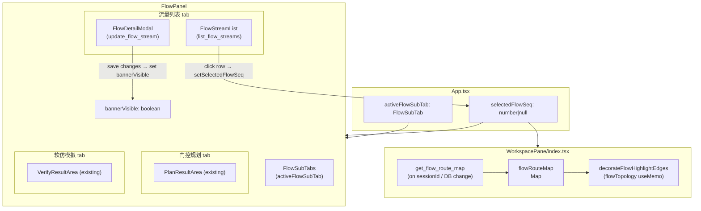
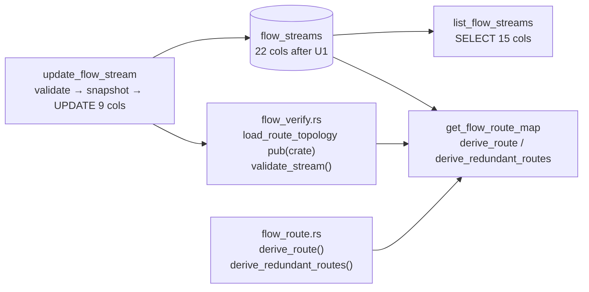

# feat: Flow panel sub-tabs, stream list, route highlight, and editable detail modal

## Summary

Replace the flat `flow-panel.tsx` with a 4-tab shell (流量列表 / 门控规划 / 软仿模拟 / 硬件部署). Add a Rust `list_flow_streams` query, a `FlowStreamList` UI, single-flow topology edge highlighting (RC highlights both A+B plane paths), and an editable `FlowDetailModal` backed by 5 new `flow_streams` columns and an `update_flow_stream` Tauri command.

---

## Requirements

### S1 Sub-tab shell

- R1. A `FlowSubTab` union type and `FLOW_SUBTABS` constant array (with `disabled: true` for hw-deploy) are defined in a new `flow-subtabs.tsx`, mirroring `timesync-subtabs.tsx`.
- R2. A `FlowSubTabs` component renders all four tabs; hw-deploy is visually grey, non-interactive, and shows a tooltip.
- R3. `activeFlowSubTab: FlowSubTab` state (default `"flow-list"`) lives in `App.tsx` alongside `activeTimesyncSubTab`.
- R4. Session change resets `activeFlowSubTab` to `"flow-list"` in the same `useEffect` that resets `activeTimesyncSubTab`.
- R5. `PlanResultArea` (GCL chart + table) and the plan command bar move to the gate-plan tab; `VerifyResultArea` and the soft-sim button move to the soft-sim tab; hw-deploy tab renders empty placeholder content.
- R6. Each sub-tab panel uses `key={sessionId}` to fully remount on session change.

### S2 Flow list display

- R7. A `list_flow_streams` Tauri command returns a `FlowStreamRow` struct with all 15 columns (10 original + 5 new from R17); the SELECT explicitly names all 15 columns.
- R8. A TypeScript `FlowStreamRow` interface and `invokeListFlowStreams` function are added to `flow-sim.ts`.
- R9. `FlowStreamList` renders one row per stream: class badge (color-coded ST/RC/BE), `F{streamSeq}`, `{talker} → {listener}`, period, frame size, 「详情」button. Clicking a row toggles `selectedFlowSeq`; clicking 「详情」opens `FlowDetailModal`.
- R10. When `streams.length === 0`, a `PanelCta` with label 「录入流量」and disabled state when `!inFlowStage` replaces the list.
- R11. `useSessionDbListener` triggers a `list_flow_streams` re-fetch on DB change, matching the `refreshPlanQuery` pattern in the existing panel.

### S3 Topology edge highlight

- R12. A `get_flow_route_map` Tauri command computes per-stream link paths. For dual-plane topologies (any link has `styles_json.plane`), ST/BE use `plane=Some("A")`; RC uses `derive_redundant_routes`. Flows with no reachable path are silently skipped. Returns `Vec<FlowRouteEntry>` with `link_ids` (A-plane or single-plane) and optional `plane_b_link_ids` (RC only).
- R13. A TypeScript `FlowRouteEntry` interface and `invokeGetFlowRouteMap` function are added to `flow-sim.ts`.
- R14. `selectedFlowSeq: number | null` state (default `null`) lives in `App.tsx`, reset on session change.
- R15. `WorkspacePane/index.tsx` fetches `get_flow_route_map` (triggered by `useSessionDbListener` and session change) and stores `flowRouteMap: Map<number, FlowRouteEntry>` internally. When `selectedFlowSeq !== null`, the `flowTopology` useMemo applies `decorateFlowHighlightEdges`, adding `flow-highlighted` to matched edge IDs and `flow-dimmed` to all others.
- R16. Re-clicking the selected row sets `selectedFlowSeq = null` and restores original edge classes. Session change clears selection. Switching sub-tabs does not clear selection.

### S4 Editable detail modal + DB expansion

- R17. `flow_streams` gains 5 nullable columns: `src_mac TEXT`, `dst_mac TEXT`, `vlan_id INTEGER`, `earliest_send_offset_ns INTEGER`, `latest_send_offset_ns INTEGER`. Three locations must be updated together: `FLOW_DOMAIN_SCHEMA_SQL` CREATE TABLE, the `flow_streams` column list in `SESSION_SCOPED_TABLES`, and the new `ensure_flow_streams_extended_columns` migration function.
- R18. `ensure_flow_streams_extended_columns` uses `pragma_table_info('flow_streams')` column guards (one `ALTER TABLE ADD COLUMN` per missing column), called after `ensure_flow_streams_rename` in `session_store.rs`.
- R19. The 5 new columns are included in R7's `FlowStreamRow` struct and SELECT, and in R8's TypeScript interface, with `null` values for existing rows.
- R20. `FlowDetailModal` is an inline controlled component (no `ConfirmDialog` reuse). It renders: read-only fields (stream_seq, class badge, talker→listener, redundant), and editable fields in a form (PCP as **read-only display** derived from class; period_us, frame_bytes, count, max_latency_us; src_mac, dst_mac, vlan_id, earliest/latest_send_offset_ns). Loading state disables save; server error shows inline message without closing the modal.
- R21. `update_flow_stream` is a Tauri command accepting a flat `UpdateFlowStreamRequest` (no `Option<Option<T>>`). The frontend always sends all editable columns. Before UPDATE: call `validate_stream()` (returns error on invariant violation) and `snapshot_pre_image(FLOW_DOMAIN)`. After UPDATE: check `rows_affected > 0`, return error if zero.
- R22. `bannerVisible: boolean` state lives at `FlowPanel` level (not inside the flow-list sub-tab). It is set to `true` after a successful save that changed any of: `period_us`, `frame_bytes`, `count`, or `max_latency_us`. It is cleared after the next successful plan run or on manual close. Saving only MAC/VLAN/offset columns does not set the banner.
- R23. Agent-native parity for `update_flow_stream` (MCP tool + SKILL.md) is deferred.

---

## Key Technical Decisions

- **`selectedFlowSeq` and `flowRouteMap` ownership**: `selectedFlowSeq` is App-level state (passed to both `FlowPanel` for row highlighting and `WorkspacePane` for canvas decoration). `flowRouteMap` is WorkspacePane-internal state (fetched by WorkspacePane, never threaded up from FlowPanel). This avoids adding a reverse callback for route map propagation; WorkspacePane already owns the canvas and has `sessionId`.

- **`load_route_topology` visibility**: Promoted from private to `pub(crate)` in `flow_verify.rs` so `get_flow_route_map` can share the two-SELECT body without duplication. (see origin R12, confirmed in Phase 5.1.5)

- **`update_flow_stream` flat types**: `Option<Option<T>>` is not deserializable from JSON without `serde_with::double_option` (not in Cargo.toml). Frontend sends all editable columns on every save; Rust writes them unconditionally. (see origin R21)

- **PCP is read-only in the modal**: `pcp` is excluded from `UpdateFlowStreamRequest`. The class↔pcp invariant (ST=7, RC=6, BE=0) is enforced by `validate_stream()` in `flow_verify.rs`; allowing PCP edits would silently corrupt the gate7 filter in `get_flow_plan`.

- **`get_flow_route_map` dual-plane detection**: Mirrors `flow_plan_command.rs` KTD6: `let dual_plane = links.iter().any(|l| link_plane(l).is_some())`. ST/BE pass `plane=Some("A")` on dual-plane topologies; `plane=None` on single-plane. RC always uses `derive_redundant_routes`.

- **Banner placement**: `bannerVisible` at FlowPanel level so that switching from 流量列表 to 门控规划 to click 「重新规划」 does not unmount the state. Banner fires only on planning-consumed field changes (not MAC/VLAN/offset, which have no current planning consumer).

- **`FlowDetailModal` as inline component**: Follows `timesync-tree-modal` inline pattern rather than reusing `ConfirmDialog`. `ConfirmDialog` is designed for simple text confirmations; the modal needs form inputs, loading state, and error display.

---

## High-Level Technical Design

### Component ownership and data flow

### Rust backend: commands and DB

---

## Implementation Units

### U1. DB migration: flow_streams 5 new columns

**Goal:** Add 5 nullable columns to `flow_streams` across all three required locations, and define the `ensure_flow_streams_extended_columns` migration.

**Requirements:** R17, R18

**Dependencies:** none

**Files:**
- `src-tauri/src/db.rs` — update `FLOW_DOMAIN_SCHEMA_SQL` CREATE TABLE to include all 5 new columns; update `SESSION_SCOPED_TABLES` `flow_streams` column list
- `src-tauri/src/session_store.rs` — call `ensure_flow_streams_extended_columns` after `ensure_flow_streams_rename`

**Approach:** Follow `ensure_topology_nodes_name_column` pattern for each of the 5 columns. The `FLOW_DOMAIN_SCHEMA_SQL` CREATE TABLE definition and `SESSION_SCOPED_TABLES` column list must be updated in the same commit as the migration function — omitting either causes export or import failures. Run `grep -n "INSERT INTO flow_streams" src-tauri/src/` before finalizing to confirm no write paths are missed by the schema change (existing insert paths do not write the new columns; new columns are nullable, so existing inserts are safe).

**Patterns to follow:** `ensure_topology_nodes_name_column` in `db.rs`; `SESSION_SCOPED_TABLES` column array at line ~754 in `db.rs`.

**Test scenarios:**
- Call `ensure_flow_streams_extended_columns` on a fresh pool → 5 columns present in `pragma_table_info`
- Call it on a pool with the 5 columns already present → no error (idempotent)
- `FLOW_DOMAIN_SCHEMA_SQL` creates a new table with all 22 columns
- Export a session and re-import → new columns are present (NULL) in the imported DB
- Existing `flow_streams` rows have NULL for all 5 new columns after migration

**Verification:** `cargo test` passes; `pragma_table_info('flow_streams')` shows 22 columns on both migrated and fresh DBs.

---

### U2. FlowSubTabs shell + prop chain wiring

**Goal:** New `flow-subtabs.tsx`, App-level `activeFlowSubTab` state, session reset, `WorkspacePaneProps` / `FlowPanelProps` extension, content relocation, `key={sessionId}` remount.

**Requirements:** R1, R2, R3, R4, R5, R6

**Dependencies:** none (can run in parallel with U1)

**Files:**
- `src/app/components/workspace-pane/flow-subtabs.tsx` — new file
- `src/app/App.tsx` — add `activeFlowSubTab: FlowSubTab` and `selectedFlowSeq: number | null` states (after line ~93); reset both to defaults in the session-change `useEffect` (near line ~154); extend WorkspacePane props call to pass both states and their setters
- `src/app/components/workspace-pane/index.tsx` — extend `WorkspacePaneProps` with `activeFlowSubTab / onSelectFlowSubTab / selectedFlowSeq / onSelectFlowSeq`; pass to FlowPanel
- `src/app/components/workspace-pane/flow-panel.tsx` — extend `FlowPanelProps`; render `FlowSubTabs`; relocate `PlanResultArea` under gate-plan, `VerifyResultArea` under soft-sim; add `key={sessionId}` to each sub-panel; add hw-deploy placeholder

**Approach:** Mirror `timesync-subtabs.tsx` exactly — replace `timesync` prefix with `flow`, extend the SUBTABS constant to 4 entries with `disabled: true` on hw-deploy. `activeFlowSubTab` default is `"flow-list"`. Session reset in the same `useEffect` block that resets `activeTimesyncSubTab`.

**Patterns to follow:** `timesync-subtabs.tsx` (42-line template); `App.tsx` lines 93 and 154; `TimeSyncPanel` rendering of `TimesyncSubTabs` in `time-sync-panel.tsx`.

**Test scenarios:**
- Four tabs render; hw-deploy has `disabled` attribute and `title` tooltip
- Clicking hw-deploy does not change `activeFlowSubTab`
- `PlanResultArea` is present under gate-plan tab, absent under flow-list tab
- `VerifyResultArea` is present under soft-sim tab, absent under gate-plan tab
- After session switch, `activeFlowSubTab` resets to `"flow-list"`
- Each sub-tab panel remounts (`key={sessionId}`) on session change

**Verification:** Vitest renders the new `FlowSubTabs` with correct aria attributes and disabled behavior; snapshot tests for content placement.

---

### U3. `list_flow_streams` Rust command + TS invoke

**Goal:** `list_flow_streams` Tauri command returning all 15 columns; TypeScript `FlowStreamRow` interface and `invokeListFlowStreams`; registered in `lib.rs`.

**Requirements:** R7, R8

**Dependencies:** U1 (5 new columns must exist in DB)

**Files:**
- `src-tauri/src/flow_query_command.rs` — add `FlowStreamRow`, `ListFlowStreamsResult`, `ListFlowStreamsRequest`, `list_flow_streams_inner`, `list_flow_streams` command
- `src-tauri/src/lib.rs` — register `list_flow_streams` in `generate_handler![]`
- `src/app/components/workspace-pane/flow-sim.ts` — add `FlowStreamRow` interface, `ListFlowStreamsResult`, `invokeListFlowStreams`

**Approach:** Follow `get_flow_plan_inner` / `get_flow_plan` pattern in the same file. SELECT names all 15 columns explicitly. Name the Rust struct `ListFlowStreamRow` (not `FlowStreamRow`) to avoid collision with the private `FlowStreamRow` in `topology_undo.rs`; name the TypeScript interface `ListFlowStreamRow` to match. The 10 original columns: `stream_seq`, `class`, `pcp`, `period_us`, `frame_bytes`, `count`, `talker`, `listener`, `max_latency_us`, `redundant`. The 5 new: `src_mac`, `dst_mac`, `vlan_id`, `earliest_send_offset_ns`, `latest_send_offset_ns`. Exclude `session_id`, `src_ip`, `dst_ip`, `src_l4_port`, `dst_l4_port`, `l4_protocol`, `paths`. `ListFlowStreamRow` derives `Debug, Clone, Serialize, PartialEq`. `redundant` is queried as `redundant != 0` (SQLite boolean). New columns return `None` / `null` for existing rows. Register new command alongside existing flow commands in `lib.rs`.

**Patterns to follow:** `get_flow_plan_inner` in `flow_query_command.rs`; `invokeGetFlowPlan` in `flow-sim.ts`.

**Test scenarios:**
- Session with no streams → `{ streams: [] }`
- Session with one ST stream (original columns populated, new cols NULL) → correct row with all 15 fields; new fields are `null`
- Session with ST + RC + BE → all three rows returned in `stream_seq` order
- `redundant: true` mapped correctly for RC row
- `max_latency_us: null` when not set
- Wrong `session_id` → `{ streams: [] }` (no cross-session leak)

**Verification:** `cargo test list_flow_streams` passes; TypeScript compiles without type errors.

---

### U4. `FlowStreamList` UI + empty state

**Goal:** `FlowStreamList` component with class badges, row selection, 「详情」button, empty `PanelCta`, `useSessionDbListener` refresh.

**Requirements:** R9, R10, R11

**Dependencies:** U2 (flow-list tab must exist), U3 (`FlowStreamRow` type and invoke function)

**Files:**
- `src/app/components/workspace-pane/flow-stream-list.tsx` — new component
- `src/app/components/workspace-pane/flow-panel.tsx` — import and render `FlowStreamList` in flow-list tab; wire `selectedFlowSeq` and `setSelectedFlowSeq`; wire `useSessionDbListener` refresh

**Approach:** `FlowStreamList` receives `streams`, `selectedFlowSeq`, `onSelectFlowSeq`, `onOpenDetail`, `inFlowStage` props. Badge colors: ST = `CHART_COLORS[0]` (#0072B2), RC = `CHART_COLORS[2]` (#009E73), BE = `CHART_COLORS[1]` (#E69F00) (from `chart-palette.ts`). Row `aria-selected` reflects selection. Click row → `onSelectFlowSeq(streamSeq)` or `onSelectFlowSeq(null)` if already selected. Empty state → `<PanelCta label="录入流量" … />` with `disabled={!inFlowStage}`. `useSessionDbListener` hook in `FlowPanel` (or reuse the existing one) triggers re-fetch.

**Patterns to follow:** `PanelCta` in `panel-cta.tsx`; `useSessionDbListener` in `flow-panel.tsx` line ~95; `CHART_COLORS` from `chart-palette.ts`.

**Test scenarios:**
- Renders one row per stream with correct badge class and text
- ST badge has color `#0072B2`, RC `#009E73`, BE `#E69F00`
- Click row → `onSelectFlowSeq` called with `streamSeq`
- Click already-selected row → `onSelectFlowSeq(null)` called
- `aria-selected="true"` on selected row
- `streams.length === 0` → `PanelCta` renders, no table rows
- `!inFlowStage` → `PanelCta` button disabled

**Verification:** Vitest renders correctly; badge color attributes match constants; selection toggle works.

---

### U5. `get_flow_route_map` Rust command

**Goal:** Promote `load_route_topology` to `pub(crate)`, implement `get_flow_route_map` command with dual-plane detection, register in `lib.rs`.

**Requirements:** R12, R13

**Dependencies:** U1 (DB pool access), U3 (can share `flow_query_command.rs` file)

**Files:**
- `src-tauri/src/flow_verify.rs` — change `load_route_topology` from `async fn` to `pub(crate) async fn`
- `src-tauri/src/flow_query_command.rs` — add `FlowRouteEntry`, `GetFlowRouteMapRequest`, `get_flow_route_map_inner`, `get_flow_route_map`
- `src-tauri/src/lib.rs` — register `get_flow_route_map`
- `src/app/components/workspace-pane/flow-sim.ts` — add `FlowRouteEntry` and `invokeGetFlowRouteMap`

**Approach:** Call `load_route_topology(pool, session_id)` to get nodes and links. Detect dual-plane: `let dual_plane = links.iter().any(|l| link_plane(l).is_some())` (mirrors `flow_plan_command.rs` line ~304). For each stream: if `class == "RC"` → `derive_redundant_routes` → both plane link_seqs as `link_ids` (A) and `plane_b_link_ids` (B). If ST/BE on dual-plane → `derive_route` with `plane=Some("A")`. If ST/BE on single-plane → `plane=None`. Format `link_seqs` as `"link-{seq}"`. Routing failure → skip stream (no entry in result). `link_plane` helper already exists in `flow_plan_command.rs`; import or inline it.

**Patterns to follow:** `flow_plan_command.rs` lines 300-310 for dual-plane detection; `derive_route` / `derive_redundant_routes` in `flow_route.rs`; `linkRowId` pattern (`"link-{linkSeq}"`) from `topology-flow.ts`.

**Test scenarios:**
- Single-plane topology, ST stream → `link_ids` non-empty, `plane_b_link_ids` absent
- Dual-plane topology, ST stream → uses `plane=Some("A")`, returns A-plane path
- Dual-plane topology, RC stream → `link_ids` (A-plane) and `plane_b_link_ids` (B-plane) both populated
- Stream with unreachable talker/listener → entry absent from result (no panic)
- Session with no streams → empty array result
- `link_ids` entries match `"link-{linkSeq}"` format

**Verification:** `cargo test get_flow_route_map` passes; TypeScript type-checks.

---

### U6. Edge highlight decoration (WorkspacePane + CSS)

**Goal:** `WorkspacePane` fetches `get_flow_route_map` and stores `flowRouteMap`; `decorateFlowHighlightEdges` applied in `flowTopology` useMemo; CSS classes `flow-highlighted` / `flow-dimmed`.

**Requirements:** R14, R15, R16

**Dependencies:** U2 (`selectedFlowSeq` prop available in WorkspacePane), U5 (`get_flow_route_map` command exists)

**Files:**
- `src/app/components/workspace-pane/index.tsx` — add `flowRouteMap` state, `get_flow_route_map` fetch (with `useSessionDbListener` and session-change reset), `decorateFlowHighlightEdges` function, apply in `flowTopology` useMemo
- `src/app/App.css` (or `tsn-topology-canvas.css`) — add `.react-flow__edge.flow-highlighted path.react-flow__edge-path` and `.react-flow__edge.flow-dimmed` rules

**Approach:** `WorkspacePane` already receives `sessionId` and `activeConfigTab`. Fetch `get_flow_route_map` when `activeConfigTab === "flow"` and on `useSessionDbListener` trigger. Store as `flowRouteMap: Map<number, FlowRouteEntry>` (keyed by `streamSeq`). In `flowTopology` useMemo, if `selectedFlowSeq !== null`, build `highlightIds: Set<string>` from `flowRouteMap.get(selectedFlowSeq)?.linkIds.concat(planeBLinkIds ?? [])`, then pass through `decorateFlowHighlightEdges`. CSS rules use `.topology-canvas` prefix to match existing specificity (`.topology-canvas .react-flow__edge.plane-a .react-flow__edge-path` is 3-class): `.topology-canvas .react-flow__edge.flow-highlighted .react-flow__edge-path { stroke: #D55E00 !important; stroke-width: 3; stroke-dasharray: 6 3; }`. `.topology-canvas .react-flow__edge.flow-dimmed { opacity: 0.2; transition: opacity 0.15s; }`. The `!important` on stroke is required to override `plane-a`/`plane-b` rules for dual-plane edges.

**Patterns to follow:** `decorateTimesyncEdges` in `index.tsx` lines 957–993; existing CSS in `App.css` for `.react-flow__edge` variants.

**Test scenarios:**
- `selectedFlowSeq = streamSeq` → edge IDs in `flowRouteMap.get(streamSeq).linkIds` gain `flow-highlighted` class; all other edges gain `flow-dimmed`
- RC stream → both `linkIds` and `planeBLinkIds` edges are highlighted
- `selectedFlowSeq = null` → no `flow-highlighted` or `flow-dimmed` classes on any edge
- `flowRouteMap` has no entry for `selectedFlowSeq` (failed route) → no classes added, no error
- Session change → `flowRouteMap` resets; `selectedFlowSeq` already reset by App

**Verification:** Manual canvas inspection shows correct highlight; vitest checks edge class assignments.

---

### U7. `update_flow_stream` Rust command

**Goal:** Flat `UpdateFlowStreamRequest` (no `Option<Option<T>>`), `validate_stream` before UPDATE, `snapshot_pre_image` before UPDATE, full-column UPDATE, `rows_affected` guard.

**Requirements:** R21

**Dependencies:** U1 (5 new columns must exist)

**Files:**
- `src-tauri/src/flow_query_command.rs` (or new `src-tauri/src/flow_update_command.rs`) — `UpdateFlowStreamRequest`, `update_flow_stream_inner`, `update_flow_stream`
- `src-tauri/src/lib.rs` — register `update_flow_stream`
- `src/app/components/workspace-pane/flow-sim.ts` — add `UpdateFlowStreamRequest` TS type and `invokeUpdateFlowStream`

**Approach:** `UpdateFlowStreamRequest` contains `session_id`, `stream_seq`, and 9 editable columns (period_us, frame_bytes, count as non-optional; max_latency_us, src_mac, dst_mac, vlan_id, earliest/latest_send_offset_ns as `Option<T>`). Execution order: (1) call `validate_stream(stream)` — construct a temporary `FlowStream` from the request values and the current `class`/`pcp` from DB; return `Err` if validation fails; (2) call `snapshot_pre_image(FLOW_DOMAIN, pool, session_id)` — match `flow_sidecar_routes.rs` pattern; (3) run UPDATE with all 9 editable columns; (4) check `rows_affected` — return `Err("stream not found")` if 0.

**Patterns to follow:** `snapshot_pre_image` call in `flow_sidecar_routes.rs`; `validate_stream` in `flow_verify.rs`; `get_flow_plan_inner` command scaffolding.

**Test scenarios:**
- Valid request on existing stream → DB values updated, `rows_affected = 1`
- `period_us` that fails `validate_stream` (e.g., not divisible by gate cycle) → error returned, DB unchanged
- `stream_seq` not found → `rows_affected = 0` → error returned
- `max_latency_us: null` → DB column set to NULL
- `src_mac: null` → DB column set to NULL
- Session ID mismatch (wrong session) → 0 rows affected → error
- `snapshot_pre_image` is called before the UPDATE (undo can restore)

**Verification:** `cargo test update_flow_stream` passes; TypeScript types compile.

---

### U8. `FlowDetailModal` component + banner

**Goal:** Inline modal with all fields (PCP read-only), loading/error states, save wires to `update_flow_stream`, `bannerVisible` at FlowPanel level fires for planning-relevant field changes.

**Requirements:** R20, R22

**Dependencies:** U3 (`FlowStreamRow` type available; `invokeListFlowStreams` for refreshing list after save), U7 (`update_flow_stream` command exists), U4 (「詳情」button integration)

**Files:**
- `src/app/components/workspace-pane/flow-detail-modal.tsx` — new component
- `src/app/components/workspace-pane/flow-panel.tsx` — add `bannerVisible` state; render `FlowDetailModal` when `openModalStream` is set; render banner when `bannerVisible`; pass `onOpenDetail` to `FlowStreamList`
- `src/app/components/workspace-pane/flow-stream-list.tsx` — wire 「詳情」button to `onOpenDetail(stream)` callback from FlowPanel

**Approach:** `FlowDetailModal` receives `stream: FlowStreamRow | null` and `onClose / onSaved` callbacks. When `stream !== null`, it renders as an overlay (`.flow-detail-modal-overlay` + `.flow-detail-modal`). PCP is `` only (no input). Saving: set `isSaving = true`, call `invokeUpdateFlowStream`, on success call `onSaved(didChangePlanningFields)` and `onClose`, on error set `errorMessage`. `FlowPanel` listens to `onSaved(didChangePlanningFields)`: if true, set `bannerVisible = true`. `bannerVisible` is cleared when `planState` transitions to a fresh plan result (next successful plan run) or on explicit close. `didChangePlanningFields` is true when the user's pre-save form values differ from current `stream` on any of: `period_us`, `frame_bytes`, `count`, `max_latency_us`.

**Patterns to follow:** `.timesync-tree-modal-backdrop` + `.timesync-tree-modal` pattern in `index.tsx` lines 765–811; `ConfirmDialog` ESC handler pattern in `confirm-dialog.tsx`.

**Test scenarios:**
- `stream = null` → modal not rendered
- `stream` set → modal opens with all field values from the stream
- PCP field is a read-only ``, not an `<input>`
- Changing `period_us` and saving → `invokeUpdateFlowStream` called with new value; `onSaved(true)` called → banner visible
- Changing only `src_mac` and saving → `onSaved(false)` called → banner remains hidden
- Server error response → error message shown inside modal; modal stays open
- 「取消」 / ESC / overlay click → `onClose` called without `invokeUpdateFlowStream`
- During save, button is disabled (prevents double-submit)
- After successful save, `invokeListFlowStreams` re-fetch triggered to refresh list

**Verification:** Vitest modal lifecycle; banner state; PCP read-only; TypeScript compiles.

---

## Scope Boundaries

### Deferred to follow-up work

- S3 step 2: flow legend + hover fade-out interaction (only single-flow click highlight this iteration)
- S3 step 3: multi-flow parallel lanes on canvas (`geom_edge_parallel` offset color bands)
- Agent-native parity: `update_flow_stream` MCP tool + SKILL.md guidance (R23)
- Hardware deploy sub-tab actual capability (device push)
- Redo / multi-step undo / diff for flow stream edits

### Outside this product's identity

- Server-side validation of MAC address format (UI accepts free text; format validation is for the downstream configuration push layer, not for storage)

---

## Open Questions

- **Concurrent write conflict (P1, defer):** Agent writing `flow_streams` while the user has `FlowDetailModal` open will overwrite unsaved modal edits. No optimistic lock or version column exists. Mitigation approaches (modal-open version stamp, pre-save reload) deferred to independent ideation.
- **Verify result staleness (P2, defer):** The banner prompts re-planning but does not block the soft-sim button. Running verify before re-planning yields results based on the old GCL. Acknowledged as a known UX gap; no blocking gate added this iteration.

---

## Risks & Dependencies

- **`snapshot_pre_image` accessibility from Tauri command context**: Currently only called in `flow_sidecar_routes.rs` (axum sidecar handlers). `plan_tas` (a Tauri command) already performs DB writes — confirm `snapshot_pre_image` can accept the pool from `SessionStore::pool()`. If the signature differs, U7 may need a thin adapter.
- **`validate_stream` input shape**: `validate_stream` in `flow_verify.rs` expects a `FlowStream` struct. U7 must construct one from the request values plus the current `class`/`pcp` read from DB (since the request omits PCP). Add a single-row fetch of `class` and `pcp` before validation.
- **`SESSION_SCOPED_TABLES` column list divergence**: The column list for export/import is maintained by hand in `db.rs`. Any reviewer of U1 should verify the list count matches the updated CREATE TABLE before merging.
- **CSS specificity**: `flow-highlighted` and `flow-dimmed` must override the `plane-a` / `plane-b` plane colors applied in `topologySnapshotToReactFlow`. Use `!important` on the highlighted stroke or increase selector specificity to ensure the flow highlight wins.
