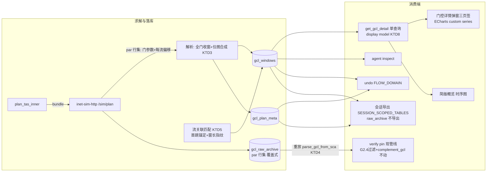

# 门控明细表数据层 + 门控详情弹窗

## 摘要

把 Z3 求解出的门控结果按展示靶面重建存储：新建门控明细表（每窗一行：起止 ns、q0-q7 位图、关联流、provider）+ 规划级元数据表 + 求解原文行存档表，flow_plans 停写退役，全部消费端（展示 / 软仿验证 pin / agent inspect / 删流 / undo / 会话导出）一次性切换。软仿验证 pin 的事实源是存档的 par 行**重放既有解析器**（不做位图反推）。前端加全屏「门控详情」弹窗三页签（门控可视化 / 流量维度 / 门控表），时序视图用 ECharts custom series（依赖已有，先例 time-sync-offset-chart.tsx）。附带产出给 castup 侧的格式规范文档。

## 问题框架

现状 flow_plans 是有损形态：stream_seq 恒 0（无流关联）、每 (端口,门) 一行 durations 交替 JSON（读侧还要展开）、读查询只取 gate7、解析器跳过空 durations 门（丢掉未调度门恒态位）。参考竞品的门控详情弹窗（八队列位图、逐窗流徽章、流量维度窗口链）在此数据上画不出来。castup 外部求解器本期不接，格式定稿后对方参照我们的库格式做返回。

## 需求（源自 origin，R1-R14）

见 origin 文档。核心：R1 逐窗明细表+元数据、R2 解析补齐（保留空 durations 门恒态 + 读路径切新表）、R3 流关联回算（偏移+多实例展开，歧义降级类级）、R4 求解原文行存档、R5 新表体系唯一事实源（全消费端切换）、R6 provider 进键、R7-R13 弹窗三页签与状态、R14 castup 格式文档。

---

## 关键技术决策

| # | 决策 | 理由 |
|---|---|---|
| KTD1 | 新表三张：`gcl_windows`（逐窗行，PK=(session_id, provider, node, eth_n, entry_idx)）+ `gcl_plan_meta`（每 (session_id, provider) 一行：status/cycle_ns/algorithm/created_at）+ `gcl_raw_archive`（每 (session_id, provider) 一行：par 行文本，覆盖式最新，**不进会话导出、不入 undo 快照**——导入方/撤销后重新规划即恢复）。**失败态沿现状 R10 语义：solver_failed/unreachable 不写不清**，meta 保持上一次 ok，失败仅作为命令返回值透传 | R1/R4/R6；评审实证导入侧有 4KB 字段上限、bind_dynamic 无 BLOB 分支、缺表硬报错三重闸——raw 单独表隔离出导出面最干净；失败清表会销毁上一次可验证规划（行为回退），不改 |
| KTD2 | `gate_states` 存 INTEGER（0-255 位图，bit g = gate g 开），`flow_refs` 存 JSON 数组 `[{seq, source}]`，source ∈ solver/derived/class；存档正名为「par 行集」（grep 过滤后的参数行，非 .sca 原文），grep 契约显式定义重放所需全部行类，体积上界 1MB 断言 | 位图整数可位运算；「raw .sca」名不副实问题评审点破——如实定义存什么 |
| KTD3 | 位图合成：per-gate 开窗区间（`gcl_open_intervals` 现成，提升可见性复用）→ 时间轴切分点集合 → 相邻切分点间为一窗，逐门查开关拼位图。未调度门（空 durations）以 initiallyOpen 恒态参与 | R2；切分点法保证窗口边界与任一门翻转对齐 |
| KTD4 | **verify pin = 重放，不反推**：load_gcl 改读 `gcl_raw_archive` 的 par 行重跑既有解析器 `parse_gcl_from_sca`，输出 GclEntry 直接进现管线（G2.4 ST 门过滤、complement_gcl 互补关窗、guard band 写入全部原样保留，注释理由更新为「恒态位不进 pin，补集门由 complement_gcl 生成」）。位图表纯做展示事实源，不承担 pin | 评审双命中：位图反推有恒态门顶掉互补关窗、guard band 双写、0 长度段三重语义陷阱；重放=同一解析器两次跑同一输入，保真度天然成立，零新算法 |
| KTD5 | 流关联匹配模型（**不依赖猜测时延常数**）：①talker 首跳用 offset + k·period 展开实例、串行化时长（帧长+58B/速率）锚定——零常数；②下游跳按「窗长指纹」匹配：Z3 零余量窗长 = 该流帧传输时长（代码注释实证），在该端口 ST 门窗中找窗长匹配 + 时序先后一致的窗；③匹配判据 = 时段与窗口有重叠（非包含）；④同窗多流都记 derived；⑤某流某跳零命中 → 该流**整链降级 class**（与 R9 整链隐藏口径对齐）；⑥U1 真机 golden 先验证多跳匹配率再放行 flow_refs 落库 | 评审双命中：Z3 零余量窗下猜测常数差 1ns 即多跳批量脱靶；窗长指纹与首跳锚定都不依赖配置器内部时延模型 |
| KTD6 | 删流行为修正：remove_stream 不再按 stream_seq 删门控行（现状恒 0 删不到，属既有漏洞），改为清空该 session 的三张新表（删流 = 规划失效，需重新规划） | 扫描发现的语义漏洞，随切表一并修正 |
| KTD7 | 时序视图用 ECharts custom series（renderItem + clipRectByRect 甘特模式），依赖已有（echarts 6.1.0）；照 time-sync-offset-chart.tsx 的 init/resize/dispose 先例；tooltip formatter 出多字段悬浮卡、dataZoom(weakFilter) 出缩放 | boss 定（探索后确认）；不按截图像素还原 |
| KTD8 | 弹窗数据一次查询构建 display model（rows + meta + 流名 join），三页签 + 头部统计 + CSV 导出共享；筛选在 model 层过滤 | R12/AE5 单查询 DoD；三处口径同源 |
| KTD9 | 时延常数（处理 2μs、传播 0）**仅用于展示层窗口链推导**（流量维度页签），不参与落库匹配（KTD5 已解耦）；窗口链 sanity check——推导入窗不落在目标窗内时悬浮卡加不一致提示 | origin 遗留问题拍板（不取 0）；评审指出展示可信度诉求≠求解器建模事实，两用途分离 |
| KTD10 | 会话导入兼容：导入循环前用 sqlite_master 探测源库缺表，缺表按零行跳过（旧导出文件降级为空规划态导入，落 AE6 空态） | 评审实证现状缺表硬报错会让全部历史导出文件不可导入 |
| KTD11 | **统一路径解析出口** `resolve_flow_path(stream 行, nodes, links) -> Route`：指定优先（paths.origin=user）、缺省 derive_route 推导；显式路径消费前复验 link_seq 存在 + 端点连续 + 首尾锚定，失效响亮 `PATH_STALE`（绝不静默回退最短路）。现状 5 处 derive_route 调用簇（规划 pathFragments / 验证 pin / 流列表 nodePath / 路由高亮 / RC 录入闸）+ 2 个新消费者（流关联回算、窗口链推导）全部收口。**失效统一走惰性防线**：initialize 重建后旧指定路径由 PATH_STALE 复验响亮拦截，**不做级联清**（跨域写破坏 undo domain 隔离，且 PATH_STALE 本身已响亮——清除反而是静默销毁、撤销 initialize 后救不回）；initialize 仅置 gcl_plan_meta.stale（单布尔 UPDATE，跨域面最小，无行则 no-op） | R16；评审实证 link_seq 会被 initialize 重绑定 + round2 评审证明级联清与 undo 隔离不变量冲突 |
| KTD12 | **paths 列统一 schema**：`{"version":1, "origin":"user"\|"system", "routes":[{node_path, link_seqs},...]}`——RC 恒两条 origin=system（routes[0]=A 平面、routes[1]=B 平面，数组序承载平面语义；凭证语义不变：验证期重推导复验不相交）；ST/BE 显式恒一条 origin=user（事实源）。NULL=系统推导。**两处既有契约反转**：add_stream 的 paths 不透传（含锁死测试 non_rc_request_redundant_paths_not_passed_through）、UpdateFlowStreamRequest 无 paths 字段——测试随语义一起改，update 校验闸覆盖 paths 变更。**旧形状归一在写边界一次性完成**：session_import 导入循环内旧形状 {a,b} 即转新形状落库 + 读侧兼容命中旧形状顺手回写——归一后兼容代码可删，旧导出文件永续可导入不复活旧形状；U8 文档注明「库内仅存 v1 形状」 | R16 评审：一列两形按 class 分叉解析正是本计划反对的模式；RC 转事实源会削弱 802.1CB 复验防线，不转；round2 补导入边界归一 |
| KTD13 | **软仿逐跳转发钉死（带 spike 放行闸）**：round2 评审纠偏——FRER spike 验证的是「平面选择」（talker L3 出口），**不覆盖中间跳 L2 绕路**（交换机是 L2 网桥，`<route>` 控制不到分叉点转发）。U10b 动手前先做最小真机 spike（同平面三交换机绕路：探查逐跳 `<route>` / MacForwardingTableConfigurator 手工表项 / 802.1d 静态转发的可行机制，.vec 转发计数确证中间跳走向），通过才放行实现；**spike 失败降级**：本期指定路径只进规划与展示（pathFragments/高亮/窗口链），软仿验证对绕路流标注「验证路径未钉死」。落地时三条硬约定：①与 pin_kit 的触发真值表（单/双平面 × 有无 RC × 有无指定）写全；②addStaticRoutes=false 开启时全部流（含未指定流）生成完整 route 覆盖；③录入闸拒绝同 (talker,listener) 对指定互异路径（L3 粒度限制，结构化报错） | R16 评审缺口；spike 证据边界经 round2 复核修正 |
| KTD14 | **规划过期标记服务端化**：gcl_plan_meta 加 `stale` 布尔；写手清单 = add/update/remove 流、改路径、**拓扑结构变更（initialize 及增删链路写路径）**——最重的失效来源恰是拓扑重建；stale **复位仅发生在规划成功事务内**（与写 windows/meta 同事务，失败后保持 true）；门控规划子 tab / 概览卡片 / 门控详情弹窗按 stale 显示「需重新规划」提示（取代前端 useState banner，双入口同源、持久化） | R16 评审：现状提示是弹窗前端 diff 独有，agent 通道触不到；round2 补拓扑写手与复位时序 |

---

## 高层设计



窗口链推导（流量维度页签，展示层纯函数，不落库）：

```
入窗(hop N+1) = 出窗(hop N) + 串行化(帧长/速率) + 传播(0) + 处理(2μs, KTD9 仅展示)
发窗 = talker 出端口门窗；收窗 = 末跳出窗 + 链路时延
```

---

## 实施单元

### U1. 服务端 grep 扩展 + 真机锁 golden（KTD5 放行闸）

**Goal**：宿主机服务回传 par 行集扩到「重放所需全部行类」；真机锁 par 行格式 golden 并验证多跳流关联匹配率。
**Requirements**：R3/R4 实现前置、KTD2/KTD5。
**Dependencies**：无（第一单元，boss 需配合重新部署宿主机服务）。
**Files**：`services/inet-sim-http/runner.py`（grep 正则扩：门参数 + `initialProductionOffset` + 配置器时延相关参数探查）、`services/inet-sim-http/tests/`（过滤器单测）、`src-tauri/src/flow_plan_command.rs`（golden fixture 用真实 par 行）。
**Approach**：grep 契约 = 重放所需全部行类（KTD2）；部署后跑一次真规划，锁两样：偏移 par 行格式、多跳流的窗长指纹匹配可行性（KTD5 ⑥——匹配率不达预期即回到匹配模型再议，不放行 U2 的 flow_refs 落库）。
**Test scenarios**：过滤器对混合 .sca 提取全部目标行类；无偏移行仍回门参数（旧服务向后兼容）；输出体积上界内。
**Verification**：真机 result 可见偏移行；两条不同周期多跳流的逐实例匹配在纸面演算上成立。

### U2. 新表 schema + 落库写路径（与 U3 同 PR 原子落地）

**Goal**：三张新表建表进 safety-net 与导出清单（raw 除外），plan_tas 写新表（全门位图 + 流关联 + meta + par 行存档），flow_plans 停写**且事务内清残留行**（停写≠留残留，避免中间态被旧管线静默消费）。
**Requirements**：R1/R2①②/R3/R4/R6、KTD1/KTD2/KTD3/KTD5。
**Dependencies**：U1（golden 已锁）、U10 后端部分（流关联匹配沿 resolve_flow_path 输出推进，KTD11）。
**Files**：`src-tauri/src/db.rs`（FLOW_DOMAIN_SCHEMA_SQL 加三表 + SESSION_SCOPED_TABLES 加 gcl_windows/gcl_plan_meta 两表——raw_archive 不进）、`src-tauri/src/flow_plan_command.rs`（解析升级 + 位图合成 + 流关联匹配 + 写新表；par 行集来自 /sim/plan 返回的 sca_gcl 字段，覆盖式写 raw_archive）、`src-tauri/src/session_import.rs`（KTD10 缺表探测跳过）。
**Approach**：解析层输出 per-gate 区间集 → 切分点法合成逐窗位图行 → KTD5 匹配标 flow_refs → 事务内（undo 快照先行）清三新表+flow_plans 残留 → 写新。失败态不写不清（KTD1）。
**Execution note**：位图合成与流关联匹配 test-first——纯函数，构造 per-gate 区间直接断言。
**Test scenarios**：单 ST 门 1ms 周期合成两窗（开窗 bit7=1 + 空窗 q0-q6 恒开态）；两门交错翻转切出正确窗口数；空 durations 门贡献恒态位；多实例流（250μs in 1ms）4 实例窗口都标 flow_refs（Covers AE1）；**指定路径下的流关联——绕路流实例窗口沿 resolve_flow_path 输出路径匹配**（R16×R3 集成点）；同窗双流都记；某跳零命中→该流整链 class（Covers AE3 数据面）；**偏移行整体缺失（旧服务/格式变化）→ 全流 class 降级、落库不失败**；no_gating 写 meta 清 windows；solver_failed **不写不清**（沿 R10，断言旧数据保留）；**置 stale 后规划失败→stale 保持 true、meta/windows 保持上次数据**（KTD14 复位时序）；raw 覆盖式最新一份；导入旧文件（无新表）零行跳过不报错（Covers KTD10）。
**Verification**：真机规划后三表数据齐全；降级流占比 = 0（KTD5 ⑥ 检查项）。

### U3. 消费端切表（undo / inspect / 删流 / verify pin 重放）——与 U2 同 PR

**Goal**：四个非展示消费端切到新表体系，flow_plans 退役（表暂留无人读写）。
**Requirements**：R5、KTD4/KTD6。
**Dependencies**：U2。
**Files**：`src-tauri/src/topology_undo.rs`（FLOW_DOMAIN 快照/恢复覆盖 gcl_windows+gcl_plan_meta：PreImage 加字段**全部 #[serde(default)]**（旧 blob 兼容，a9a3e3e 同型坑）、raw_archive 不入快照）、`src-tauri/src/flow_sidecar_routes.rs`（inspect 读新表出 camelCase；remove_stream 清三新表 KTD6）、`src-tauri/src/flow_verify_command.rs`（load_gcl 改读 raw_archive 重放 parse_gcl_from_sca，KTD4；G2.4 过滤保留、注释更新）。
**Approach**：pin 重放输出 GclEntry 与切表前 load_gcl 输出**字段级相等** → 下游 ini 逐字节一致（「等价」的定义）。no_plan 检测口径 = raw_archive 无行或重放为空 且 has_st。
**Execution note**：pin 重放等价性 test-first——同一 par 行集：旧路径（flow_plans 行）vs 新路径（重放）输出 GclEntry 断言相等。
**Test scenarios**：重放等价（含 offset 回绕、恒开门被 G2.4 过滤、guard band 行为不变——pin ini 中 q0-q6 仅出现 complement 来源条目断言）；undo 快照/恢复覆盖两新表 + **旧格式 blob 反序列化兼容**（serde default 生效）；undo 后 raw 与 windows 不一致的口径注明（raw 保持最新，重新规划对齐）；remove_stream 清三表（Covers KTD6）；inspect 无规划返回空；meta status=no_gating 时 verify 行为与现状一致。
**Verification**：软仿验证真机跑通，pin ini 与切表前逐字节一致；删流后弹窗回空态。

### U4. 读查询 + display model + 概览指标聚合（get_gcl_detail 命令）

**Goal**：单查询返回弹窗与概览全部所需：窗口行（含流名 join）+ meta + **门控概览八项指标**；窗口链推导纯函数在此落地（U7 图表与时延聚合共用）；简版概览读路径切新表（R2③）。
**Requirements**：R2③/R12/R15、AE5（单查询 DoD）、KTD8/KTD9。
**Dependencies**：U2。
**Files**：`src-tauri/src/flow_query_command.rs`（新 get_gcl_detail_inner；get_flow_plan_inner 由其取代，简版概览同源）、`src/app/components/workspace-pane/flow-sim.ts`（GclDetailModel TS 类型、invoke、display model 构建 + 筛选纯函数 + **窗口链推导纯函数** + 概览指标聚合）、`src/app/components/workspace-pane/flow-sim.test.ts`。
**Approach**：Rust 出扁平行 + meta（含 stale 标记 KTD14）；前端纯函数构建 model。概览八项（R15）：调度状态（meta.status）、超周期（meta.cycle_ns）、业务流/门控端口数+涉及队列（行聚合）、GCL 表项/打开窗口数（行聚合）、最大门控窗口占用 %（per 端口 Σ开窗/周期 取最大）、关闭窗口占比 %（全关窗时长/Σ端口周期）、**最大链路带宽占用 %**（流表 period/frame+58B 开销 → per-link Σ带宽/speed 取最大；speed 未知链路显示「—」）、**时延分析**（窗口链推导：每流端到端 = 收窗尾 − 发窗头；裕度 = maxLatency/实际，未填显示「未设上限」，超限如实显示负裕度+口径提示；仅 ST 流，BE/RC 显示「不适用」；降级流排除出最大值并提示 N 条未计入——R15 口径细则全套）。三态推导改吃 meta.status + windows 非空 + stale。
**Test scenarios**：Covers AE5——全列一次查询可渲染断言；八项指标各自公式断言（构造两流两跳数据核对占用/占比/带宽/时延数值）；Covers AE7——每流时延与裕度、最大端到端时延正确；筛选流/节点后 model 行正确（流量维度不受节点筛选影响 R7）；空/加载/失败三态推导；老工程（无 meta 行）= 空态（Covers AE6 数据面）；降级流（class 级）时延标注不可算。
**Verification**：简版概览与弹窗读同一命令，数字一致。

### U5. 门控详情弹窗骨架 + 门控表页签 + CSV 导出

**Goal**：全屏弹窗（三页签 + 头部元信息 + 双筛选下拉 + 三态）落地，门控表页签全列渲染 + CSV 导出。
**Requirements**：R7/R10/R11/R13、AE4/AE6。
**Dependencies**：U4。
**Files**：`src/app/components/workspace-pane/gcl-detail-modal.tsx`（新）、`gcl-detail-modal.test.tsx`（新）、`src/app/components/workspace-pane/flow-panel.tsx`（门控详情按钮入口）、`src/app/App.css`。
**Approach**：弹窗结构照 flow-detail-modal 先例（layer/backdrop/section-dialog），页签照 flow-subtabs 分段开关先例（仅三页签，无时间参数页 R11）；门控表用 eng-table（q0-q7 圆点：实心=开）；CSV 导出=当前筛选行前端序列化 + UTF-8 BOM，无网络请求。
**Test scenarios**：三页签切换/ESC/backdrop 关闭；加载中/失败/空态（Covers AE6）；空窗行显示「空窗」；位图圆点渲染断言；Covers AE4——筛选后导出行数=筛选条数、首字节 BOM；「门控详情」按钮无数据时禁用。
**Verification**：真机门控表全列与库数据一致，导出文件 Excel 双击直开。

### U6. 门控可视化页签（ECharts 甘特）——可与 U7 并行

**Goal**：行=节点.端口 的时间轴开窗图，流徽章着色 + 多字段悬浮卡 + 缩放。
**Requirements**：R8、AE1。
**Dependencies**：U5。
**Files**：`src/app/components/workspace-pane/gcl-gantt-chart.tsx`（新）、`gcl-gantt-chart.test.tsx`（新）、`src/app/components/workspace-pane/gcl-detail-modal.tsx`。
**Approach**：ECharts custom series（KTD7）：Y=category(node.port)、X=μs；renderItem clipRectByRect 画窗口块（按首个关联流取色，空窗灰、类级降级中性色+「ST 类」label）；多流徽章并排、>2 折叠 +N；tooltip formatter 悬浮卡（区间/持续/队列/门控操作常量/关联流）；dataZoom inside+slider weakFilter。init/resize/dispose 照 time-sync-offset-chart.tsx。
**Test scenarios**：option 构建纯函数——窗口数据→series data 映射断言；Covers AE1——多实例流每实例窗口有徽章；类级降级 label=「ST 类」（Covers AE3 展示面）；tooltip formatter 含全部字段；空窗块无徽章。
**Verification**：真机与门控表页签同窗口数据逐块一致。

### U7. 流量维度页签（窗口链）+ agent 指引同步——可与 U6 并行

**Goal**：按流分组的逐跳 发/入/出/收 窗口链视图（消费 U4 的推导纯函数），降级流整链隐藏；SKILL.md inspect 字段说明同步。
**Requirements**：R9、AE2/AE3、KTD5/KTD9。
**Dependencies**：U5（弹窗骨架）、U4（窗口链推导纯函数）、U3（inspect 新结构）。
**Files**：`src/app/components/workspace-pane/gcl-flow-chain-chart.tsx`（新）、`gcl-flow-chain-chart.test.tsx`（新）、tsn-flow-planning 的 SKILL.md（执行期定位播种源文件，inspect 输出若含门控字段说明则同步 flow_refs/source 解释；无引用则记录核对结论）。
**Approach**：消费 U4 的窗口链推导输出；ECharts custom series renderItem 返回 group（rect+连线+端点 label）；Y=「流-节点」复合类目单 chart；降级流从流下拉剔除并标注「流关联精度不足」；悬浮卡带「非实际到达时刻」+「数据来源：GCL 规划结果」+ sanity 不一致提示（KTD9）。
**Test scenarios**：Covers AE2——两跳链发/入/出/收时段公式断言；入窗落窗外置 sanity flag；Covers AE3——降级流不出现在流下拉且带提示；默认选中首条可用流；节点筛选不过滤本页签（R7）。
**Verification**：真机窗口链与门控可视化同源窗口对齐。

### U10. 流路径指定（R16：统一解析出口 + 双入口 + 转发钉死）

**Goal**：ST/BE 流显式路径指定全链路落地。**内部分两段**（round2 评审拆解）：**U10a**（先于 U2，无表依赖）= KTD11 resolve_flow_path/PATH_STALE + KTD12 paths schema/录入闸/契约反转 + agent path 参数；**U10b**（后于 U2/U3，同 PR 排后）= KTD14 stale 服务端化（依赖 gcl_plan_meta 表）+ KTD13 验证侧钉死（先过 spike 放行闸）+ 弹窗路径字段。
**Requirements**：R16、AE8/AE9、KTD11/KTD12/KTD13/KTD14。
**Dependencies**：U10a 无依赖（U2 的流关联消费它）；U10b 依赖 U2（gcl_plan_meta）与 KTD13 spike 结果。
**Files**：`src-tauri/src/flow_route.rs`（resolve_flow_path 统一出口 + PATH_STALE 复验 + 候选路径枚举纯函数）、`src-tauri/src/flow_verify.rs`（录入闸：显式路径连通/端点/平面校验 + paths schema 解析）、`src-tauri/src/flow_query_command.rs`（update paths 字段 + 服务端规划字段判定置 stale）、`src-tauri/src/flow_sidecar_routes.rs`（add/update_stream path 参数：mid 或唯一 name 解析、结构化错误；paths 覆写契约反转 + 测试改写）、`src-tauri/src/flow_plan_command.rs`（pathFragments 吃统一出口）、`src-tauri/src/flow_verify_command.rs` + `src-tauri/src/inet_sim_bundle.rs`（KTD13 逐跳 route xml 钉死）、`src-tauri/src/topology_sidecar_routes.rs`（initialize 级联清 origin=user paths）、`src/app/components/workspace-pane/flow-detail-modal.tsx`（路径下拉：候选枚举 + 系统自动默认 + 固定格式文本/tooltip + 选中画布高亮预览；RC 只读展示双路径）、co-located 测试。
**Approach**：schema 迁移含 RC 旧形状（{a,b}）到新形状（routes[2]+origin=system）的读侧兼容或一次性转换（执行期定，倾向读侧兼容一版）；AMBIGUOUS_ROUTE 文案枚举歧义流名；banner 机制替换为读 meta.stale。
**Execution note**：resolve_flow_path 与候选枚举 test-first（纯函数）。
**Test scenarios**：Covers AE8——歧义拓扑报错含流名→指定→规划成功；Covers AE9——删路径链路后 PATH_STALE 响亮、重新指定恢复；指定路径跨平面被录入闸拒；agent path 用 name 解析成功/无名节点报 NODE_NOT_FOUND/重名报 AMBIGUOUS；RC paths 新形状读写 + 验证仍重推导复验不相交；add/update 反转后的透传测试；initialize 后 origin=user paths 被清；stale 置位/规划成功复位；候选枚举上限打满提示；KTD13 route xml 生成断言（指定绕路的逐跳条目）。
**Verification**：真机对称拓扑走通 AE8 全流程；指定绕路后软仿验证流量确实走指定路径（宿主机 .vec/转发计数核对一次）。

### U9. 门控概览卡片组（门控规划子 tab 重构，R15）

**Goal**：门控规划子 tab 的概览区对齐参考截图：可折叠「门控概览」标题 + 八张统计卡片 grid + 右上按钮组（重新规划 / 门控详情）；调度状态卡绿色强调、时延分析卡高亮。
**Requirements**：R15、AE7。
**Dependencies**：U4（八项指标数据）、U5（门控详情按钮联动弹窗）。
**Files**：`src/app/components/workspace-pane/flow-panel.tsx`（PlanResultArea 概览区重构，简版时序图保留在卡片组之下或折叠区内——执行期按视觉密度定）、`flow-panel.test.tsx`、`src/app/App.css`。
**Approach**：卡片 grid 复用现有面板卡片样式语言；按钮组进 commandbar 右上（与 PR #116 的统一位置衔接，「重新规划」保持现有逻辑、「门控详情」开 U5 弹窗）；未规划态维持现有 CTA 渐进式（卡片组只在有数据时出现）；时延卡与每流时延（含裕度）在悬浮或展开处展示，标注「规划推导值，非实测」。
**Test scenarios**：Covers AE7——八卡渲染值与 U4 model 一致；未规划态无卡片组（CTA 不变）；「门控详情」按钮开弹窗；调度状态卡按 meta.status 三态变色；**meta.stale=true 时显示「需重新规划」过期提示、stale 复位后消失**（KTD14）；降级流存在时时延卡的不可算标注 + N 条未计入提示。
**Verification**：真机对照截图布局逐卡核对数值口径。

### U8. castup 格式规范文档

**Goal**：对外格式说明定稿（v1）。
**Requirements**：R14。
**Dependencies**：U2/U3 落定（格式即代码事实）。
**Files**：`docs/solutions/flow-planning/gcl-windows-format-v1.md`（或 docs/ 顶层，执行期定）。
**Approach**：三表结构、字段语义、单位=ns 整数、位图编码（bit g=gate g，固定 8 位，超出 queue_count 的位=恒开）、flow_refs 约定（castup 直给 source=solver）、meta（cycle_ns/status/algorithm）、raw 存档定位（par 行集，不导出不入撤销）、版本 v1 + 向后兼容新增列演进约定。中文。
**Test expectation**: none——纯文档。
**Verification**：boss 审阅可交 castup 侧。

---

## 范围边界

**本期不做**（承 origin）：castup adapter/求解器抽象、时间参数页签、双 provider 切换对比 UI、xlsx 导出、旧数据迁移、帧级时刻展示。
**Deferred to Follow-Up Work**：flow_plans 表物理删除（本期停写退役，观察一个版本后删）；门控表虚拟滚动（规模超界再议）；位图反推 per-gate 算法（本期不需要——pin 走重放；castup 无 par 行时再议，届时 castup 直给结构化 GCL 也不需要反推）。

## 风险与依赖

- **risk-1**：U1 依赖 boss 重新部署宿主机服务；KTD5 多跳匹配率是 U2 flow_refs 落库的放行闸（U1 真机不达标即回改匹配模型，不带病放行）。
- **risk-2**：pin 重放等价性——U3 双路径 GclEntry 相等测试 + 真机 pin ini 与切表前逐字节对照，双绿才算过。
- **risk-3**：偏移 par 行确切格式以 U1 真机 golden 为准；U2 解析器带「偏移行缺失→全流 class 降级不报错」兜底，格式猜错不炸只降级。

## 验收对照

AE1→U2/U6；AE2→U7；AE3→U2/U6/U7；AE4→U5；AE5→U4；AE6→U4/U5（验证入口禁用为 U3 口径）；AE7（origin R15）→U4/U9；AE8/AE9（origin R16）→U10。R16 五环节映射：规划 pathFragments 与路由高亮/预览→U10a；流关联回算（resolve_flow_path 消费）→U2；窗口链推导（指定路径下发/入/出/收）→U4/U7；验证侧钉死→U10b（spike 门控）；stale 持久化与提示→U10b/U4/U9。

## 建议合入切片

U1 单独 PR（服务端+部署）→ **U10a + U2 + U3 同 PR**（数据层原子切换，U10a 排前）→ U4+U5+U9+U10b 同 PR（读面+弹窗骨架+概览+路径字段与 stale；KTD13 spike 在此批前跑）→ U6、U7 可并行各一 PR（或合一）→ U8 文档随最后收尾。
