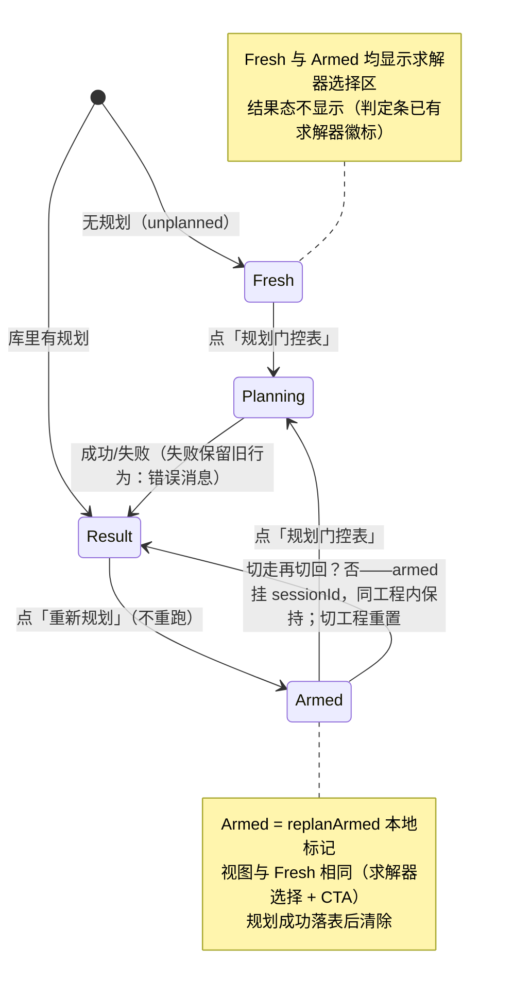

# feat: 流量面板求解器选择 + 两步重新规划 + stale 禁验证

## 摘要

流量面板门控规划入口重做，三项一批（origin R2/R3/R4，一个 PR）：初始态在「规划门控表」按钮上方加求解器选择区（inet-z3 可用 / open-planner 置灰标「预留」）；「重新规划」从点击立即重跑改为回初始态再点执行（镜像时间同步「重新仿真」）；stale=1 时禁用「软仿验证」按钮。**纯前端改动，后端零变更。**

---

## 问题框架

- 当前「重新规划」点击立即重跑，用户没有重选参数的机会；时间同步/硬件部署都已是「回初始态再执行」的两步模式，流量面板是孤例。
- 求解器维度（provider）在数据层已留位（`flow_gcl_plan` 主键含 provider），但 UI 无呈现；open-planner（castup 调度规划 API）接入前需要占位展示。
- stale=1 时验证按钮仍可点，会拿旧门控表验证新配置，结果意义存疑（boss 已定：禁用）。

---

## 需求追溯（origin）

| 需求 | 内容 | 单元 |
|---|---|---|
| R2 / AE2 | 求解器选择区：inet-z3 默认可用、open-planner 置灰标「预留」；provider 维度零表改动 | U1 |
| R3 / AE3 | 重新规划回初始态、再点才执行；镜像时间同步 | U2 |
| R4 / AE4 | stale=1 禁用软仿验证按钮，琥珀提示条保留；重新规划成功后恢复 | U3 |

Origin 已确认的口径：求解器选择区**只在初始态显示**（结果态判定条已有求解器徽标）；stale 解禁时机 = 重新规划**成功落表**后（失败保留旧结果、按钮维持禁用）。

---

## 关键技术决策

1. **KTD1 纯前端选择，不动写通道**：open-planner 置灰后唯一可选值就是 inet-z3，`plan_tas` 调用与后端 `GCL_PROVIDER` 常量原样不动。求解器选择本期是纯 UI state（甚至无需持久化）；open-planner 接入时才引入 provider 参数穿透。
2. **KTD2 两步流程用本地「已回初始态」标记覆盖 fresh 推导**：流量面板初始态判定（`fresh`）叠加了「库里无门控表」（`queryPresentation === "unplanned"`），库里有结果时单纯重置 `planState` 不会出现初始 CTA——需要本地 state（如 `replanArmed`）强制回初始视图。该 state 必须带工程 id 守卫（挂到当前 sessionId、切工程即失效），沿用时间同步 reveal 快照守卫模式（跨工程残留是 timesync 踩过的 P1）。
3. **KTD3 stale 唯一判定源 = `gclMeta.stale`**：不另设前端并行状态。解禁链路走既有机制：重新规划成功 → `write_gcl_plan` 落表 stale=0 → `planState` 变 done 触发 `refreshGclQuery()` 重拉 → 按钮恢复。前端只读不写。
4. **KTD4 置灰模式仿既有先例**：open-planner 选项 disabled + title 提示（先例：流量子 tab「硬件部署」`disabled: true` + `title="即将推出"`）。命名遵 CONCEPTS.md「求解器来源（Solver Provider）」词条：`inet-z3` / `open-planner`。

---

## 高层设计：面板视图状态机

（图为方向性说明；`Fresh` 即现有 `fresh` 推导，`Armed` 是新增的本地标记态，两者渲染同一初始视图。）

---

## 实施单元

### U1. 求解器选择区（初始态）

**Goal**：初始视图（Fresh/Armed）在「规划门控表」CTA 上方渲染求解器选择区。

**Requirements**：R2 / AE2。

**Dependencies**：无（可先行）。

**Files**：
- 修改 `src/app/components/workspace-pane/flow-panel.tsx`（选择区组件就地实现，参照 time-sync-panel.tsx 内嵌 SimOverrideRegion 的组织方式）
- 修改 `src/app/App.css`（选择区样式）
- 测试 `src/app/components/workspace-pane/flow-panel.test.tsx`

**Approach**：
- 两个选项：`inet-z3`（默认选中、当前唯一可选）、`open-planner`（disabled、标「预留」、title 说明「预留：调度规划 API 接入后可用」）。控件形态定为**原生 radio 组**（`.sim-field` 族已全用原生控件，天然键盘可达、零额外 ARIA 成本；不做自定义分段按钮），视觉对齐 `.sim-override` 族的设计语言（小字、低调、位于命令栏之下 CTA 之上）。
- 选择值为组件本地 state，不持久化、不穿透后端调用（KTD1）。
- 仅 `fresh || replanArmed` 时渲染；结果态不渲染。
- CSS 注意：容器避免 `grid + overflow` 组合（WebKit 行塌陷已两次踩坑），优先 flex；若选项带图标 span 记得 `role="img"`（裸 aria-label 会卡 Biome CI）。

**Patterns to follow**：`time-sync-panel.tsx` SimOverrideRegion（折叠区结构与类名 `.sim-override*`）；`flow-subtabs.tsx` hw-deploy 置灰先例；`.btn:disabled` 通用禁用视觉。

**Test scenarios**：
- Covers AE2. 无规划态渲染：选择区可见，inet-z3 选中，open-planner 带 disabled 属性与「预留」文案。
- 已有规划态（getGclDetail 返回 planned 夹具）：选择区不渲染。
- 点击 open-planner 选项无效果（选中值仍为 inet-z3）。
- 点「规划门控表」后 `planTas` 被调用（选择区存在不影响既有 CTA 行为）。
- 键盘可达：Tab 可聚焦 inet-z3 radio；open-planner 带原生 disabled 属性（radio 语义屏幕阅读器可读）。

**Verification**：vitest 上述场景绿；真机初始态可见选择区、置灰项悬停有提示。

### U2. 重新规划两步流程

**Goal**：点「重新规划」回初始视图（求解器选择 + CTA），再点「规划门控表」才执行。

**Requirements**：R3 / AE3。

**Dependencies**：U1（Armed 态复用初始视图含选择区）。

**Files**：
- 修改 `src/app/components/workspace-pane/flow-panel.tsx`
- 测试 `src/app/components/workspace-pane/flow-panel.test.tsx`

**Approach**：
- 新增本地标记（如 `replanArmed`）：「重新规划」onClick 置位（不再调 `handlePlan`），视图分叉条件从 `fresh` 扩为 `fresh || replanArmed`；命令栏右上按钮组在 Armed 态隐藏（与 Fresh 一致）。
- 清除时机：CTA 点击发起规划即清（规划中显示既有 running 文案）；成功/失败均回结果视图走既有 planState 机制。
- **sessionId 守卫**：armed 标记与置位时的工程 id 绑定（KTD2），切工程后标记失效回落到常规推导；实现形态（`{sessionId, armed}` 快照或 effect 重置）执行期定。
- 「门控详情」按钮在 Armed 态一并隐藏（按钮组整体随 `!fresh` 条件走，扩成 `!fresh && !replanArmed`）。
- **概览八卡渲染条件单独收口**：GclOverviewSection 的渲染条件是 `queryPresentation === "planned" && loaded`，**不含 fresh**——机械扫 fresh 分叉点扫不到它，须单独追加 `&& !replanArmed`，否则 Armed 态八卡与初始 CTA 同屏（评审抓到的漏点）。

**Patterns to follow**：`time-sync-panel.tsx` 重新仿真回初始态实现（onClick 重置 + 表单重展开）；timesync reveal 的 snapshot.sessionId 守卫模式。

**Test scenarios**：
- Covers AE3. 已规划态点「重新规划」：`planTas` **未被调用**，初始视图出现（CTA + 选择区），判定头行、**概览八卡（gcl-overview）**与「门控详情」按钮均不渲染（仿 time-sync-panel.test.tsx 回初始态模板）。
- Armed 态点「规划门控表」：`planTas` 被调用一次，进入 running 文案。
- Armed 态规划成功：结果视图恢复，armed 清除（再看不到初始 CTA）。
- 库里有规划（planned 夹具）+ armed 置位 → 初始视图仍强制显示（覆盖 fresh 推导的验证点）。
- 切工程（sessionId 变化）后 armed 失效：视图回落到结果态。

**Verification**：vitest 上述场景绿；真机两步流程手感与时间同步「重新仿真」一致。

### U3. stale 禁用验证按钮

**Goal**：`gclMeta.stale === true` 时「软仿验证」按钮禁用并给出原因提示。

**Requirements**：R4 / AE4。

**Dependencies**：无（与 U1/U2 正交，可并行）。

**Files**：
- 修改 `src/app/components/workspace-pane/flow-panel.tsx`
- 测试 `src/app/components/workspace-pane/flow-panel.test.tsx`

**Approach**：
- `verifyDisabled` 条件追加 stale 项（数据源 `gclQuery.detail.meta.stale`，KTD3）；title 提示追加「流量参数已变更，请重新规划后再验证」分支。
- `handleVerify` 已走 `verifyDisabled` 守卫，无需另拦。
- gclQuery 取数失败（unavailable）时 stale 不可得，沿用既有 fail-open 口径（按钮闸退回 planState 判定，同现状）——有意选择，非遗漏。
- 琥珀提示条与概览 stale 卡不动；解禁走既有 refetch 链路，无新代码。

**Patterns to follow**：现有 `verifyDisabled` 组合条件与 `!havePlan` 的 title 分支写法。

**Test scenarios**：
- Covers AE4. planned 夹具 `meta.stale: true`：验证按钮 disabled 且 title 含重新规划提示；点击不触发 `verifyTas`。
- `meta.stale: false`：按钮可用（回归既有行为）。
- stale=true → 重新规划成功 → refetch 返回 stale=false 夹具：按钮恢复可用（断言经 waitFor 等取数落地）。

**Verification**：vitest 上述场景绿；真机改流参数后验证按钮变灰、重新规划后恢复。

---

## 范围边界

**不做（origin 已定）**：
- open-planner 实际 API 调用、baseUrl 配置项（纯占位）。
- 多 provider 结果并存/对比展示。
- 求解器选择区常驻结果态（结果态判定条已有求解器徽标，boss 已确认只在初始态）。

**不动的相邻逻辑**：
- `flow-replan-banner`（弹窗保存回调驱动的本地提示条）维持现状，与 stale 列驱动的禁用彼此独立。
- 后端 `plan_tas` / `GCL_PROVIDER` / `flow_gcl_plan` 写通道零变更。

**Deferred to Follow-Up Work**：
- open-planner 接入时的 provider 参数穿透与结果切换展示（origin「不做」节）。
- stale 时是否同步禁用「门控详情」入口——本期不动（明细仍可查看旧结果，与琥珀卡口径一致）。

---

## 风险与依赖

- **Armed 态无取消路径（boss 已确认的既定行为）**：点「重新规划」后不提供「返回结果」链接，与时间同步「重新仿真」先例一致；旧门控表仍在库里未丢失，用户再跑一次规划或切工程可回到结果视图。不做额外文案区分 Armed 与首次规划视图。
- **视图分叉条件散布**：`fresh` 参与多处渲染分叉（CTA、按钮组、结果区），Armed 扩展时漏一处会出现「初始 CTA 与结果区同屏」类错乱——U2 测试场景已覆盖按钮组与结果区消失断言。
- **WebKit 渲染差异**：新选择区样式在 playwright 全绿不代表真机 OK（系统 WebKit ≠ playwright webkit），真机截图验收必做。
- 无后端、无迁移、无外部依赖。

---

## 验收（对照 origin）

- AE2：无规划工程进流量面板可见求解器选择（inet-z3 选中、open-planner 置灰标预留）→ 点「规划门控表」→ 正常出结果。
- AE3：有结果态点「重新规划」→ 回选择态不立即重跑；再点「规划门控表」才执行。
- AE4：改流参数触发 stale → 验证按钮禁用 + 琥珀条在；重新规划成功后按钮恢复。
