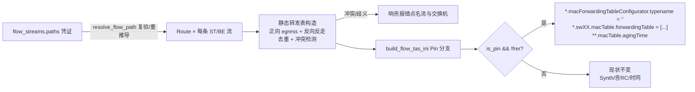

# feat: 软仿验证逐跳转发钉死（KTD13 产品化）

## 摘要

验证 bundle 生成时，把每条 ST/BE 流的路径凭证翻译成逐交换机静态转发表（`MacForwardingTable.forwardingTable` ini 对象参数，spike 已真机验证），并关掉 INET 自算最短路的 `macForwardingTableConfigurator`——用户指定绕路的流在软仿里真按绕路走，验证与 Z3 排程口径一致。**范围（boss 已确认）**：流集含 RC 不钉（维持现状，RC 本就由 StreamRedundancyConfigurator 按 pathFragments 钉）；只动验证 bundle（`is_pin` 闸），Z3 规划 bundle 与时间同步 bundle 零影响。

---

## 问题框架

Z3 按路径凭证（含用户绕路）算门控，但软仿验证时 INET 自算最短路转发——绕路流的门开在绕路沿途、流量却走直路，验证结果不代表规划口径（`GateScheduleConfigurator.pathFragments` 只进调度计算不配转发，spike 源码证实）。现状代码里验证侧**完全不读** `flow_streams.paths` 凭证（单平面 ST/BE 分支干脆不推路径）。

---

## 需求

- **R1 钉死生效**：纯 ST/BE 流集的验证 bundle 含逐交换机静态转发表 + 关闭自动配置器行；指定绕路的流在软仿中实际按绕路转发。
- **R2 含 RC 不钉**：流集含 RC 流时验证 bundle 与现状完全一致（单写入者冲突，混排留下期）。
- **R3 只动验证**：Z3 规划 bundle（Synth 模式）与时间同步 bundle 字节不变。
- **R4 失败响亮**：路径歧义（AMBIGUOUS_ROUTE）与跨流转发冲突（同交换机同目的不同出口）当场报错点名流与位置，不静默回退。
- **R5 行为闸**：既有 cargo 测试全绿；timesync golden 字节测试不动。

---

## 关键技术决策

1. **KTD1 条目算于 Route 之上**：`Route.egress`（每转发节点 `(mid, ethN)`，含 talker 不含 listener）给正向条目（交换机 hop → 去 listener 走 ethN）；反向条目沿 `node_path` 反向逐跳、用 `build_port_eth_map` 同源取该交换机**指向 talker 侧**的端口（新小函数）。**address 写 `ned名%ethN`**（正向=listener 终端口、反向=talker 首端口，均从 Route.link_seqs + 端口映射同源取）——裸节点名在双宿端系统（双平面 ES 两口各挂一平面）上 MAC 解析歧义，可能解析到平面 B 接口 → 查表 miss → 泛洪；`%ethN` 语法已被既有 pin_dest（`destAddress "es02%eth1"`）实证可用。talker/listener 是 TsnDevice 不进表；talker 出口平面选择仍归既有 pin_kit 三件套，两机制互补不替换。
2. **KTD2 双向全覆盖 + 跨流冲突当一等公民**：TsnSwitch 开 `hasIncoming/OutgoingStreams` 已自动禁学习——静态表是唯一转发依据，漏条目即泛洪（双平面拓扑含环 → 风暴），故每条流收发两端在沿途每交换机都写双向条目（spike 硬要求）。**跨流冲突**：MAC 表按 (交换机, 目的) 转发不分流——两条流对同一 (sw, dst) 要求不同出口时物理不可满足（真实硬件同理），构表时检测并响亮报错。**冲突不是边角而是主用例的必然伴生**：用户给 ST 指定绕路、同端点还有 BE（最短路凭证）时，分叉交换机上必冲突；反向条目还把冲突面扩到同 talker 路径分叉的流对。报错是设计行为（物理不可满足 + 保持凭证与实际转发一致），文案除点名冲突流 seq 对与交换机外，**给消解引导**（为共享端点的流指定与绕路同侧的路径），形态照 AMBIGUOUS_ROUTE 先例。同 (sw, dst) 同出口重复条目去重（INET 重复键抛 cRuntimeError）。
3. **KTD3 闸位**：`build_flow_tas_ini` 内 `is_pin && !frer` 才发射钉死段（`is_pin` 既有先例 pin_kit；`frer` 既有 `any(class=="RC")`）。关配置器行：`*.macForwardingTableConfigurator.typename = ""`（宿主机已确认 WiredNetworkBase.ned:18 条件子模块语义）。顺手写死 `**.macTable.agingTime`（默认 120s，RC 守卫引导加大 count 时理论可越过——写大值一行消掉隐患）。
4. **KTD4 验证侧新接凭证（判定粒度=流集级）**：**整个流集不含 RC 才启用钉死**；启用时 ST/BE 逐流经 `resolve_flow_path` 取 Route。`resolve_flow_path` 语义（flow_route 既有，与规划侧同一出口）：凭证存在 → `build_route_from_link_seqs` 复验（链路存在/连续/端口可映射/不跨平面），有效即直用；凭证 NULL（存量未沉淀）或复验失效 → 静默 `derive_route` 重推导。**含 RC 流集的既有双平面分支（含 has_rc 的 ST 喂 frer_trees/断点避让）一行不动**——凭证在 RC 会话中被忽略属本期已知行为（Deferred 提示项）。routes 传入 bundle 生成（通道形态执行期定：扩 `FlowTasSchedule::Pin` 携带或新参数）。新失败面：单平面等长多路径流此前验证不报错、现在 AMBIGUOUS_ROUTE 响亮——**这是口径修正而非回归**（规划侧早已拒绝歧义，验证侧沉默才是漏洞）；错误文案照规划侧引导。可选加固（执行期视改动面定）：消费凭证处断言其平面归属与推导平面一致，不符按失效重推导。

---

## 高层设计：数据流与闸

---

## 实施单元

### U1. 静态转发表构造纯函数

**Goal**：从 routes 集合算出逐交换机双向条目，含去重与跨流冲突检测。

**Requirements**：R1、R4。

**Dependencies**：无。

**Files**：修改 `src-tauri/src/inet_sim_bundle.rs`（新 `pub(crate)` 函数 + 单测就地）。

**Approach**：输入 `&[(stream_seq, Route)]` + `port_eth_map` + `ned_names`；输出按 ned 名排序的 `BTreeMap<交换机ned名, Vec<(目的地址, ethN)>>` 或冲突错误。目的地址写 `ned名%ethN`（KTD1：正向=listener 终端口、反向=talker 首端口，均从 link_seqs + port_eth_map 同源取，防双宿端系统裸名解析歧义）。正向：route.egress 里除 talker 外的每个 hop；反向：node_path 反向逐跳、经 port_eth_map 取该交换机**指向 talker 侧**的端口（新辅助，锚 `build_route_from_link_seqs` 的校验语义——凭证已过复验，此处映射失败属内部不变量破坏，直接 Err）。冲突/去重按 (交换机, 目的地址) 键。vlan 字段不写（缺省 0——当前非 FRER 模式流只打 pcp 不设 VID，帧命中 vlan 0，见调研；未来带 VID 需扩此结构）。

**Patterns to follow**：`build_port_eth_map`/`node_ned_names`（同文件）；`pin_dest` 的 `%ethN` 语法（inet_sim_bundle.rs 既有）；错误串形态照 `flow_route.rs` 的 AMBIGUOUS_ROUTE 文案风格。

**Test scenarios**：
- 单流直路：沿途每交换机正反两条目，端口号与 links 表一致，地址带 `%ethN`。
- 绕路流（spike 三角拓扑形态）：中间交换机出现、直连口交换机条目指向绕路端口。
- 两流同 (sw, 目的地址) 同出口：去重为一条。
- 两流同 (sw, 目的地址) 不同出口：Err 点名两个 stream_seq 与交换机名。
- **主用例冲突形态**：同 talker/listener 的 ST（绕路凭证）+ BE（最短路）→ 正向分叉交换机冲突 Err；含消解引导文案。
- **反向冲突形态**：同 talker、不同 listener、路径分叉的两流 → 反向键 (sw, talker) 冲突 Err。
- 反向条目正确性：listener 侧交换机含去 talker 条目（地址 `talker%ethN`）。

**Verification**：新单测绿；不触既有测试。

### U2. ini 发射接线（is_pin && !frer 闸）

**Goal**：Pin 且无 RC 时发射关配置器行 + 逐交换机 forwardingTable 行 + agingTime；其余模式字节不变。

**Requirements**：R1、R2、R3、R5。

**Dependencies**：U1。

**Files**：修改 `src-tauri/src/inet_sim_bundle.rs`（`build_flow_tas_ini` Pin 分支、`build_flow_tas_sim_bundle` 签名扩 routes 通道）+ 既有 ini 断言测试补充。

**Approach**：forwardingTable 行格式照 spike：`*.sw01.macTable.forwardingTable = [{address: "es02%eth1", interface: "eth2"}, ...]`；行序按 BTreeMap 确定性。关配置器行 `*.macForwardingTableConfigurator.typename = ""`、`**.macTable.agingTime` 写死大值（消 120s 淘汰隐患）一并在 Pin&&!frer 分支发射。`bitrate` 行沿用既有生成器（现状已在 [General] 段发 `*.eth[*].bitrate`——本单元不新增，回归断言确认其仍在即可，spike 老坑无需重踩）。Synth 分支与 frer 分支零改动。routes 通道形态（扩 Pin 变体 vs 新参数）执行期定，取改动面小者。

**Patterns to follow**：`pin_kit` 的 is_pin 闸写法（inet_sim_bundle.rs 既有）；ini 断言测试形态（`flow_pin_mode_writes_gate_params_no_configurator` 等 contains 断言）。

**Test scenarios**：
- Pin+纯 ST/BE：ini 含 `macForwardingTableConfigurator.typename = ""`、每交换机 forwardingTable 行、agingTime 行。
- Pin+含 RC：上述三类行全部**不出现**，FRER 段与现状一致。
- Synth 模式：三类行不出现（规划 bundle 零影响）。
- timesync golden 字节测试原样通过（共享脚手架未动的回归锁，R5）。

**Verification**：cargo test 全绿含 timesync golden（R5）。

### U3. verify_tas_inner 接路径凭证

**Goal**：验证侧消费凭证：ST/BE 流经 `resolve_flow_path` 得 Route 并传入 bundle 生成；歧义响亮。

**Requirements**：R1、R2、R4、R5。

**Dependencies**：U1、U2。

**Files**：修改 `src-tauri/src/flow_verify_command.rs`（specs 构建循环 + run_round 调 build 的实参）+ tests（CapturingRunner 断言）。

**Approach**：**判定粒度=流集级**——`has_rc` 为真时整个 specs 构建循环一行不动（含 RC 会话的双平面 ST 喂 frer_trees/断点避让、`derive_route(plane A)` 全保持，R2/AE2 字节一致）。`has_rc` 为假时：单平面 ST/BE 分支 `(None, None)` 与无 RC 的双平面分支改走 `resolve_flow_path`（凭证复验优先/失效或 NULL 静默重推导，与规划侧同一出口）；收集 `(seq, Route)` 传入 bundle 生成。错误直接冒泡为验证失败消息（含流名 + 消歧引导，文案对齐规划侧）。**慎防**：`else if dual_plane && (!has_rc || class=="ST")` 是含 RC 与无 RC 共用分支，只改无 RC 子况，勿把 has_rc 的 ST 切到凭证优先。

**Execution note**：改动前先跑 `cargo test flow_verify` 记基线（59），逐步改、每步复测。

**Test scenarios**：
- 凭证在库（绕路）：CapturingRunner 捕获 ini 含绕路交换机的 forwardingTable 条目（MockPlan/夹具喂 paths）。
- 凭证 NULL 存量流：重推导成功、bundle 含最短路条目（不报错）。
- 单平面等长多路径流：验证响亮失败，消息含流名与消歧引导（此前沉默通过的口径修正点）。
- **含 RC + ST 带绕路凭证**：bundle 与现状一致（凭证被忽略，R2 回归断言，既有 ScriptedRunner）。
- 含 RC 流集：ini 无钉死段，三轮编排与现状一致。
- 跨流冲突（U1 错误冒泡，主用例形态 ST 绕路+BE 最短路）：验证失败消息点名冲突流对 + 消解引导。

**Verification**：`cargo test flow_verify` 全绿（基线 59 + 新增，R5）；全量 cargo test 绿。

### U4. 真机端到端验收

**Goal**：宿主机全链路证实绕路流验证走绕路且判定可信。

**Requirements**：R1（AE 级）。

**Dependencies**：U1–U3。

**Files**：无代码；结论回写 `docs/solutions/inet-tas/2026-07-15-ktd13-l2-forwarding-pinning-spike.md`（追加产品化落地一节）。

**Approach**：app 造对称拓扑（含等长双路）→ 录 ST 流并在弹窗指定绕路 → 规划 → 软仿验证通过；宿主机抓 run 目录 bundle 核对 ini 钉死段 + `.sca` 端口计数证实绕路交换机满流量、直连口计数为 0 且无泛洪计数（手法照 spike：scavetool/直读 scalar）。三个对照场景：① 含 RC 流集验证跑通且 ini 无钉死段；② **ST 绕路 + BE 同端点对齐同侧路径** → 无冲突、验证通过（混排一等公民）；③ **双平面双宿端点**（无 RC 双平面会话）→ 表项命中、直连口 0、无泛洪（验证 `%ethN` 地址在多接口 ES 上不失配）。

**Test scenarios**：Test expectation: none -- 真机验收单元，无自动化测试（观测手段为宿主机 .sca 计数人工核对）。

**Verification**：绕路流量证据（sw 计数）+ 验证判定达标 + RC 对照场景不回归。

---

## 范围边界

**不做**：
- 含 RC 流集的 ST 绕路钉死（单写入者统一——生成端自算含 RC 双路径的全量静态表，另起周期）。
- 规划（Synth）bundle 与时间同步 bundle 的任何改动。
- UI 变化（无新界面元素；错误消息走既有验证失败展示）。

**Deferred to Follow-Up Work**：
- RC 混排单写入者统一（替换 StreamRedundancyConfigurator 的转发写入或与之合并）。
- 验证侧凭证消费后，规划/验证两侧 `resolve_flow_path` 调用点的共享收敛（若出现重复模式）。

---

## 风险与依赖

- **泛洪风暴面**（KTD2）：静态表漏条目 + 学习禁用 + 拓扑含环 = 广播风暴——U1 双向全覆盖 + `%ethN` 精确寻址（防双宿端点 MAC 失配）+ U4 真机对照（直连口 0/无泛洪计数）是防线；单测覆盖「沿途每交换机都有双向条目」的完整性断言。
- **绕路与共享端点流的路径对齐是用户责任**（KTD2）：MAC 转发不分流，用户给一条流绕路而不同步对齐同端点其它流，验证会响亮报错——这是设计行为（物理不可满足），非回归；文案给消解引导，U4 混排场景验证「对齐后通过」。
- **口径修正的用户可见变化**（KTD4）：此前单平面歧义流验证沉默通过（走 INET 自算路），现在响亮失败——PR 描述要明说这是修正不是回归。
- **含 RC 会话绕路凭证被静默忽略**（KTD4/Deferred）：RC 混排单写入者统一落地前，用户在 RC 会话里给 ST 指定的绕路验证侧不生效（仍按 plane A 重推导）——本期已知行为，是否加 UI 提示留下期定。
- **共享生成函数误伤**：规划 bundle 同函数生成——U2 的 Synth/timesync 回归断言是硬闸。
- 依赖：宿主机 inet-sim-http 服务可用（U4）。

---

## 验收

- AE1：指定绕路的 ST 流 → 规划 → 软仿验证：ini 含钉死段、绕路交换机 .sca 计数满流量、直连口 0 无泛洪、验证判定达标（U4 真机）。
- AE2：含 RC 流集验证与现状逐字节一致（bundle diff）；含 RC + ST 带绕路凭证 bundle 亦不变。
- AE3：单平面等长多路径未消歧流：验证报 AMBIGUOUS_ROUTE 类错误含引导。
- AE4：既有 cargo 测试全绿 + timesync golden 不动（R5）。
- AE5：混排 ST 绕路 + BE 同端点：路径未对齐 → 冲突报错含消解引导；对齐同侧后 → 验证通过（U4 真机）。
- AE6：无 RC 双平面双宿端点：`%ethN` 表项命中、直连口 0、无泛洪（U4 真机）。
